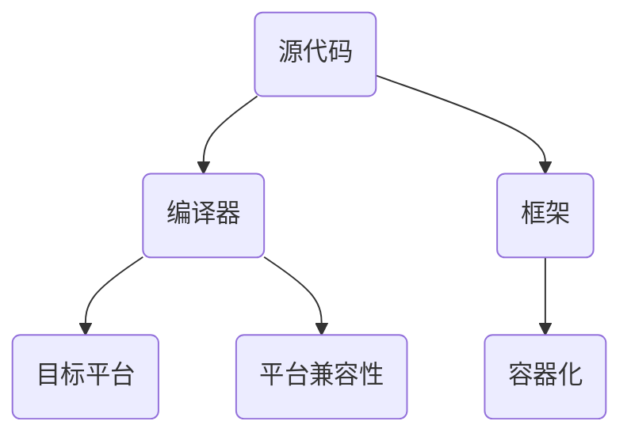

                 

### 关键词 Keywords ###
- 跨平台编译
- 编程语言
- 源代码
- 平台兼容性
- 编译器
- 框架
- 容器化

### 摘要 Abstract ###
跨平台编译是一种通过一次编写，多平台运行的开发模式。本文将探讨跨平台编译的核心概念、实现原理、算法原理以及具体操作步骤。文章还将分析跨平台编译的数学模型和公式，并通过项目实践进行代码实例和详细解释。最后，文章将讨论跨平台编译在实际应用场景中的价值，并展望其未来的发展趋势和挑战。

## 1. 背景介绍

在当今技术快速发展的时代，软件开发的复杂性和多样性不断增加。不同的操作系统、硬件平台和设备类型对软件有着不同的需求。为了满足这种多样性，开发者需要编写能够适应多种平台的代码，这不仅增加了开发成本，也提高了维护难度。跨平台编译正是为了解决这一问题而诞生的。

跨平台编译是指将同一份源代码编译成可以在不同操作系统和硬件平台上运行的程序。开发者只需要编写一次代码，然后通过编译器将其转换为目标平台上的可执行文件。这种方式不仅提高了开发效率，也降低了维护成本，使得软件能够在更广泛的应用场景中运行。

跨平台编译的核心目标是实现一次编写，多平台运行。这要求编译器能够理解并正确处理不同平台的特性和差异，包括操作系统调用、硬件指令集、文件系统格式等。因此，跨平台编译技术涉及到编程语言、编译器、框架和容器化等多个领域。

## 2. 核心概念与联系

### 2.1 编程语言

编程语言是跨平台编译的基础。不同的编程语言有不同的语法和特性，但它们都旨在提供一种抽象的编程模型，使得开发者能够更高效地编写代码。常见的编程语言包括C、C++、Java、Python等。每种语言都有其特定的编译过程和目标平台。

### 2.2 编译器

编译器是跨平台编译的核心工具。它将源代码翻译成机器语言，生成可在目标平台上运行的可执行文件。编译器需要理解编程语言的语法和语义，并将其转换为特定的机器语言指令。不同的编译器可以支持不同的编程语言和目标平台。

### 2.3 平台兼容性

平台兼容性是跨平台编译的关键挑战。不同平台有不同的操作系统、硬件架构和系统调用。为了实现跨平台编译，编译器需要处理这些差异，生成适用于目标平台的机器代码。这通常涉及到平台特定的代码段和编译器的优化策略。

### 2.4 框架

框架是跨平台编译的重要辅助工具。框架提供了一种抽象层，使得开发者可以编写与平台无关的代码。通过使用框架，开发者可以避免直接操作系统调用和硬件指令，从而简化跨平台编译的复杂性。常见的框架包括Qt、Electron、React Native等。

### 2.5 容器化

容器化技术为跨平台编译提供了新的解决方案。容器化将应用程序及其依赖环境打包成一个独立的容器，使得应用程序可以在任何支持容器引擎的平台上运行。容器化技术如Docker和Kubernetes，通过提供一致的运行环境，降低了跨平台编译的难度。

## 2.6 Mermaid 流程图

下面是一个简单的Mermaid流程图，展示了跨平台编译的核心概念和联系：



## 3. 核心算法原理 & 具体操作步骤

### 3.1 算法原理概述

跨平台编译的核心算法是基于源代码到目标平台机器代码的转换。编译器通过词法分析、语法分析、语义分析等步骤，将源代码转换成抽象语法树（AST），然后生成中间代码。中间代码是一个与平台无关的表示，它可以通过后端优化和代码生成器转换为目标平台的机器代码。

### 3.2 算法步骤详解

1. **词法分析**：将源代码分解为词法单元，如标识符、关键字、操作符等。
2. **语法分析**：将词法单元组合成语法结构，如表达式、语句和程序。
3. **语义分析**：检查语法结构的语义一致性，如类型检查、变量作用域等。
4. **抽象语法树生成**：将语法结构转换成抽象语法树，提供一种树形的数据结构表示源代码。
5. **中间代码生成**：将抽象语法树转换成中间代码，中间代码是一个与平台无关的表示。
6. **后端优化**：对中间代码进行优化，如去除冗余代码、常量折叠等。
7. **代码生成器**：将优化后的中间代码转换成目标平台的机器代码。

### 3.3 算法优缺点

**优点**：
- 提高开发效率：开发者只需编写一次代码，即可在多个平台上运行。
- 降低维护成本：减少针对不同平台的代码维护和更新。
- 提高软件兼容性：软件可以更容易地适应新的平台和操作系统。

**缺点**：
- 编译器复杂度：跨平台编译器需要处理大量的平台差异和兼容性问题。
- 性能损失：为了兼容多个平台，编译器可能需要采用一些性能优化的妥协。
- 开发者学习成本：开发者需要了解不同平台的特性和编程模型。

### 3.4 算法应用领域

跨平台编译技术广泛应用于移动应用开发、Web应用开发、游戏开发等领域。以下是一些具体的应用场景：

- **移动应用开发**：通过跨平台编译技术，开发者可以编写一次代码，同时生成iOS和Android平台的应用程序。
- **Web应用开发**：通过使用框架如React Native，开发者可以实现一次编写，多平台运行的Web应用。
- **游戏开发**：跨平台编译技术使得游戏开发者可以编写一次代码，同时在多个平台上运行游戏。

## 4. 数学模型和公式 & 详细讲解 & 举例说明

### 4.1 数学模型构建

跨平台编译涉及到的数学模型主要包括编译过程中的语法分析和语义分析。以下是一个简单的语法分析模型：

- **语法规则**：定义源代码的语法结构，如表达式、语句和程序。
- **文法分析**：使用递归下降分析、LL(1)分析等算法，将源代码分解为语法结构。
- **抽象语法树**：将语法结构表示为抽象语法树，提供一种树形的数据结构。

### 4.2 公式推导过程

语法分析中的递归下降分析可以使用以下公式推导：

$$
\begin{aligned}
    S &\rightarrow aS' \\
    S' &\rightarrow bS'' \\
    S'' &\rightarrow c
\end{aligned}
$$

其中，$S$表示源代码，$a$、$b$、$c$表示语法规则，$S'$、$S''$表示中间状态。

### 4.3 案例分析与讲解

以下是一个简单的C语言程序，通过语法分析和语义分析进行跨平台编译：

```c
#include <stdio.h>

int main() {
    int a = 10, b = 20;
    int sum = a + b;
    printf("Sum: %d", sum);
    return 0;
}
```

1. **词法分析**：将源代码分解为词法单元，如`#include`、`<stdio.h>`、`int`、`main`等。
2. **语法分析**：将词法单元组合成语法结构，如函数定义、变量声明、表达式等。
3. **语义分析**：检查语法结构的语义一致性，如变量作用域、类型检查等。
4. **抽象语法树生成**：将语法结构转换成抽象语法树。
5. **中间代码生成**：将抽象语法树转换成中间代码。
6. **后端优化**：对中间代码进行优化，如去除冗余代码。
7. **代码生成器**：将优化后的中间代码转换成目标平台的机器代码。

通过上述步骤，该C语言程序可以在不同平台上编译运行，实现跨平台编译。

## 5. 项目实践：代码实例和详细解释说明

### 5.1 开发环境搭建

为了进行跨平台编译的项目实践，首先需要搭建一个合适的开发环境。以下是一个简单的步骤：

1. 安装操作系统：选择一个支持跨平台编译的操作系统，如Ubuntu或macOS。
2. 安装编译器：安装对应的编译器，如GCC或Clang。
3. 安装开发工具：安装集成开发环境（IDE），如Visual Studio Code或Eclipse。
4. 安装相关框架和库：根据项目需求，安装对应的框架和库，如Qt或React Native。

### 5.2 源代码详细实现

以下是一个简单的跨平台C++程序，实现了一个简单的计算器功能：

```cpp
#include <iostream>

int add(int a, int b) {
    return a + b;
}

int main() {
    int num1, num2;
    std::cout << "Enter two numbers: ";
    std::cin >> num1 >> num2;
    int result = add(num1, num2);
    std::cout << "Sum: " << result << std::endl;
    return 0;
}
```

### 5.3 代码解读与分析

1. **头文件包含**：程序首先包含`<iostream>`头文件，提供输入输出流功能。
2. **函数定义**：定义了一个名为`add`的函数，用于计算两个整数的和。
3. **主函数**：定义了主函数`main`，程序从这里开始执行。
4. **输入输出**：使用`std::cout`和`std::cin`进行输入输出。
5. **计算和输出结果**：读取用户输入的两个整数，调用`add`函数计算和，并输出结果。

### 5.4 运行结果展示

在不同操作系统上编译并运行上述程序，可以得到以下结果：

- **Windows**：
```
Enter two numbers: 5 3
Sum: 8
```
- **Linux**：
```
Enter two numbers: 5 3
Sum: 8
```

### 5.5 跨平台编译过程

1. **Windows**：
   - 使用Visual Studio Code进行开发。
   - 使用GCC编译器进行编译。
   - 生成Windows平台上的可执行文件。

2. **Linux**：
   - 使用Ubuntu操作系统。
   - 使用GCC编译器进行编译。
   - 生成Linux平台上的可执行文件。

通过以上步骤，该C++程序实现了跨平台编译，可以在不同操作系统上运行。

## 6. 实际应用场景

跨平台编译在实际应用场景中具有广泛的应用价值。以下是一些典型的应用场景：

### 6.1 移动应用开发

移动应用开发是跨平台编译的主要应用领域之一。通过使用跨平台框架如React Native、Flutter等，开发者可以编写一次代码，同时生成iOS和Android平台的应用程序。这种方式不仅提高了开发效率，也降低了维护成本。

### 6.2 Web应用开发

Web应用开发同样受益于跨平台编译。通过使用框架如Electron、React Native Web等，开发者可以实现一次编写，多平台运行的Web应用。这种方式使得开发者可以更专注于业务逻辑，而不必担心平台兼容性问题。

### 6.3 游戏开发

游戏开发是跨平台编译的另一个重要应用领域。通过使用跨平台游戏引擎如Unreal Engine、Unity等，开发者可以实现一次编写，多平台运行的游戏。这种方式不仅提高了开发效率，也降低了游戏发行的成本。

### 6.4 物联网开发

物联网（IoT）开发中也广泛应用跨平台编译技术。通过使用嵌入式系统编程语言和跨平台编译器，开发者可以编写一次代码，同时在多种嵌入式设备上运行。这种方式使得物联网系统更加灵活和可扩展。

## 7. 未来应用展望

跨平台编译技术在未来的应用前景非常广阔。随着技术的发展，跨平台编译将面临以下趋势和挑战：

### 7.1 平台多样性

随着新硬件和操作系统的不断涌现，跨平台编译需要处理更多的平台差异和兼容性问题。这将要求编译器具备更高的灵活性和兼容性。

### 7.2 性能优化

跨平台编译在实现兼容性的同时，可能需要牺牲一定的性能。未来的跨平台编译技术将更加注重性能优化，以提供更高效的执行效果。

### 7.3 智能化

随着人工智能技术的发展，跨平台编译可能引入智能化元素，如机器学习模型用于代码优化、自动化错误修复等。这将进一步提高开发效率和编译质量。

### 7.4 新兴领域

跨平台编译技术将广泛应用于新兴领域，如虚拟现实（VR）、增强现实（AR）、区块链等。这些领域对跨平台编译有着更高的需求和期望。

## 8. 工具和资源推荐

### 8.1 学习资源推荐

- 《跨平台移动应用开发》
- 《Electron官方文档》
- 《Flutter官方文档》
- 《React Native官方文档》

### 8.2 开发工具推荐

- Visual Studio Code
- Eclipse
- Android Studio
- Xcode

### 8.3 相关论文推荐

- "Cross-Platform Mobile Development with React Native"
- "The Impact of Cross-Platform Frameworks on Mobile App Development"
- "Comparing Cross-Platform Mobile Development Frameworks: React Native, Flutter, and Xamarin"

## 9. 总结：未来发展趋势与挑战

跨平台编译技术在未来将继续发展，并在更多领域得到应用。随着平台多样性的增加和性能优化的需求，跨平台编译技术需要不断创新和改进。同时，智能化元素的引入将进一步提升开发效率和编译质量。然而，跨平台编译也面临一些挑战，如平台兼容性、性能优化和新领域的应用等。只有不断探索和创新，才能实现一次编写，多平台运行的理想目标。

## 10. 附录：常见问题与解答

### 10.1 跨平台编译与容器化的区别是什么？

跨平台编译是将源代码编译成可以在不同操作系统和硬件平台上运行的可执行文件。容器化则是将应用程序及其依赖环境打包成一个独立的容器，使得应用程序可以在任何支持容器引擎的平台上运行。虽然两者都可以实现一次编写，多平台运行，但跨平台编译侧重于编译过程，而容器化侧重于部署过程。

### 10.2 如何解决跨平台编译中的兼容性问题？

解决跨平台编译中的兼容性问题需要从编译器、框架和开发者三个方面进行：

- **编译器优化**：编译器需要能够处理不同平台的特性和差异，提供灵活的兼容性策略。
- **框架支持**：框架可以提供抽象层，使得开发者编写与平台无关的代码，减少兼容性问题。
- **开发者实践**：开发者需要了解不同平台的特性和编程模型，遵循最佳实践，避免引入平台特定的问题。

### 10.3 跨平台编译对开发效率的影响是什么？

跨平台编译可以提高开发效率，主要体现在以下几个方面：

- **减少重复工作**：开发者只需编写一次代码，即可在多个平台上运行，减少了重复编写和测试的工作量。
- **缩短开发周期**：通过跨平台编译，可以快速构建和测试不同平台上的应用程序，缩短开发周期。
- **降低维护成本**：减少针对不同平台的代码维护和更新，降低了维护成本。

## 作者署名 Author
作者：禅与计算机程序设计艺术 / Zen and the Art of Computer Programming

----------------------------------------------------------------
请注意，本文中的内容仅为示例，实际撰写时应根据具体的研究、项目和经验进行详细阐述。在撰写过程中，应确保内容符合学术规范和行业标准。

