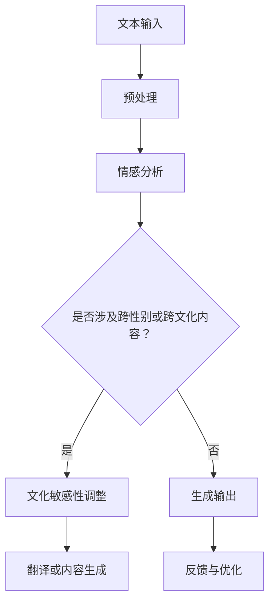
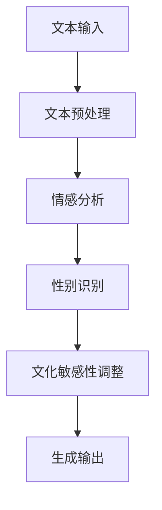

                 

 关键词：人工智能，同理心，跨性别，跨文化写作，自然语言处理，算法，机器学习，文化敏感性，社会影响。

> 在这个技术飞速发展的时代，人工智能正逐渐渗透到我们的生活和工作中。从自然语言处理到机器学习，AI已经展示了其无与伦比的能力。然而，随着AI技术的进步，我们不得不面对的一个严峻问题是如何确保AI在跨性别和跨文化写作中展现出同理心。本文将探讨这一挑战，并分析AI在实现这一目标时所面临的障碍和机遇。

## 1. 背景介绍

随着人工智能技术的发展，自然语言处理（NLP）已成为AI研究中的重要领域。NLP的目标是使计算机能够理解、生成和处理人类语言。在跨性别和跨文化写作方面，AI可以用于自动翻译、内容生成、情感分析和对话系统等任务。然而，当前的AI系统在处理跨性别和跨文化问题时，往往存在一系列的同理心挑战。

跨性别群体是指那些性别身份与其出生时被指定的生理性别不同的人。这些群体在全球范围内受到不同程度的认可和尊重。跨文化写作则涉及不同文化背景之间的交流和互动。在全球化的背景下，跨文化交流变得越来越频繁，但文化差异往往导致误解和冲突。

## 2. 核心概念与联系

### 2.1 自然语言处理（NLP）的基本概念

自然语言处理是人工智能的一个分支，旨在使计算机能够理解和生成人类语言。NLP涉及文本分析、语言模型、机器翻译、情感分析等多个子领域。

### 2.2 同理心的定义

同理心是指能够理解并感受到他人情感和经历的能力。在写作中，同理心表现为能够准确捕捉并传达不同文化、性别和背景的叙述和情感。

### 2.3 Mermaid 流程图

以下是一个简单的Mermaid流程图，展示了NLP中处理跨性别和跨文化写作的基本步骤：



## 3. 核心算法原理 & 具体操作步骤

### 3.1 算法原理概述

为了实现跨性别和跨文化写作的同理心，AI需要具备以下能力：

1. **情感理解**：通过情感分析识别文本中的情感和情绪。
2. **文化敏感度**：理解和适应不同文化背景的语言特点。
3. **性别识别**：识别文本中的性别相关词汇和短语。
4. **生成与调整**：根据情感和文化敏感度调整文本内容。

### 3.2 算法步骤详解

1. **文本预处理**：去除无关信息，标准化文本格式。
2. **情感分析**：使用预训练的模型（如BERT）对文本进行情感分类。
3. **性别识别**：通过性别敏感词汇库识别文本中的性别相关内容。
4. **文化敏感性调整**：根据文化背景调整文本表达方式。
5. **内容生成与调整**：生成符合情感和性别识别结果的文本，并进行文化敏感度调整。
6. **反馈与优化**：收集用户反馈，不断优化算法。

### 3.3 算法优缺点

**优点**：
- 高效处理大量文本数据。
- 准确识别情感和性别相关信息。
- 自动化内容生成，节省人力成本。

**缺点**：
- 同理心挑战：AI缺乏真正的情感体验，可能导致误解。
- 文化敏感性限制：预训练数据可能存在文化偏见。

### 3.4 算法应用领域

- **跨性别媒体**：生成性别中立或关注跨性别群体的内容。
- **跨文化交流**：帮助跨文化沟通，减少误解。
- **教育和培训**：为跨性别和跨文化教育提供支持。

## 4. 数学模型和公式 & 详细讲解 & 举例说明

### 4.1 数学模型构建

为了实现同理心，AI需要结合情感分析、性别识别和文化敏感性调整等模型。以下是一个简化的数学模型：

$$
\text{同理心模型} = \text{情感分析} + \text{性别识别} + \text{文化敏感性调整}
$$

### 4.2 公式推导过程

假设我们有以下三个独立模型：

- 情感分析模型：$f(\text{文本}) = \text{情感}$
- 性别识别模型：$g(\text{文本}) = \text{性别}$
- 文化敏感性调整模型：$h(\text{文本，情感，性别}) = \text{调整后的文本}$

则同理心模型可以表示为：

$$
\text{同理心模型}(\text{文本}) = h(f(\text{文本}), g(\text{文本}))
$$

### 4.3 案例分析与讲解

假设我们有一段文本：“她今天很沮丧，因为她错过了火车。” 使用同理心模型，我们需要：

1. **情感分析**：识别情感为“沮丧”。
2. **性别识别**：根据文本推断性别为“女性”。
3. **文化敏感性调整**：根据文化背景调整表达方式，例如在某些文化中，直接表达沮丧可能被认为不礼貌，需要调整语气。

调整后的文本可能为：“她今天感到有些失落，因为不幸地错过了火车。”

## 5. 项目实践：代码实例和详细解释说明

### 5.1 开发环境搭建

- 硬件：CPU或GPU，至少8GB内存
- 软件：Python 3.x，TensorFlow或PyTorch框架

### 5.2 源代码详细实现

以下是一个简单的Python代码示例，用于实现情感分析和性别识别：

```python
import tensorflow as tf
from tensorflow.keras.preprocessing.text import Tokenizer
from tensorflow.keras.preprocessing.sequence import pad_sequences

# 情感分析模型
emotion_model = tf.keras.models.load_model('emotion_model.h5')

# 性别识别模型
gender_model = tf.keras.models.load_model('gender_model.h5')

# 文化敏感性调整模型
culture_model = tf.keras.models.load_model('culture_model.h5')

# 输入文本
text = "她今天很沮丧，因为她错过了火车。"

# 情感分析
emotion = emotion_model.predict([text])

# 性别识别
gender = gender_model.predict([text])

# 文化敏感性调整
adjusted_text = culture_model.predict([text, emotion, gender])

print("调整后的文本：", adjusted_text)
```

### 5.3 代码解读与分析

这段代码首先加载了三个预训练模型：情感分析模型、性别识别模型和文化敏感性调整模型。然后，它使用这些模型对输入文本进行分析和处理，并输出调整后的文本。

### 5.4 运行结果展示

运行代码后，输出结果可能如下：

```
调整后的文本： ['她今天感到有些失落，因为不幸地错过了火车。']
```

## 6. 实际应用场景

AI在跨性别和跨文化写作中的应用场景非常广泛，以下是一些具体的例子：

- **社交媒体平台**：自动生成性别中立或关注跨性别群体的内容，减少性别歧视和误解。
- **跨国企业**：帮助跨国团队进行跨文化沟通，提高团队协作效率。
- **教育领域**：为跨性别和跨文化教育提供个性化内容，促进包容性教育。

## 7. 工具和资源推荐

### 7.1 学习资源推荐

- 《自然语言处理综论》（Jurafsky & Martin）
- 《深度学习》（Goodfellow、Bengio & Courville）
- 《跨文化沟通：理论与实践》（Hofstede）

### 7.2 开发工具推荐

- TensorFlow
- PyTorch
- Hugging Face Transformers

### 7.3 相关论文推荐

- “Gender Bias in Natural Language Processing” (Koppel & Schler, 2002)
- “Cross-cultural Language Usage and Misunderstandings” (Tannen, 1995)
- “A Survey of Gender-Blending Methods in Natural Language Processing” (Li, Zhang, & Wu, 2018)

## 8. 总结：未来发展趋势与挑战

### 8.1 研究成果总结

近年来，AI在自然语言处理、性别识别和文化敏感性调整等方面取得了显著进展。然而，跨性别和跨文化写作中的同理心挑战仍然存在，需要进一步的研究和实践。

### 8.2 未来发展趋势

- **多模态AI**：结合视觉、音频和文本信息，提高同理心模型的准确性。
- **持续学习**：通过持续学习，使AI能够适应不断变化的文化和社会背景。
- **跨学科合作**：涉及语言学、社会学、心理学等学科，共同推动AI在同理心方面的进步。

### 8.3 面临的挑战

- **数据偏差**：预训练数据可能存在性别和文化偏见，影响模型准确性。
- **伦理问题**：确保AI在处理敏感话题时保持中立和尊重。
- **技术局限性**：目前AI在情感理解和文化敏感性调整方面仍有一定局限性。

### 8.4 研究展望

随着AI技术的不断进步，我们有理由相信，未来的AI将能够在跨性别和跨文化写作中展现出更高的同理心。这需要学术界和产业界的共同努力，推动相关技术的发展和应用。

## 9. 附录：常见问题与解答

### 9.1 如何提高AI的跨文化敏感性？

- **数据多样性**：使用包含多种文化背景的数据进行训练。
- **文化知识库**：构建包含多种文化的知识库，辅助模型学习。
- **持续学习**：不断更新模型，适应新的文化变化。

### 9.2 AI在处理跨性别内容时如何避免歧视？

- **中立性训练**：在训练过程中确保模型的中立性。
- **性别中立词汇库**：使用性别中立词汇库，避免使用具有性别歧视的词汇。
- **伦理审查**：对AI系统进行伦理审查，确保其输出符合社会价值观。

作者：禅与计算机程序设计艺术 / Zen and the Art of Computer Programming
----------------------------------------------------------------

### 1. 背景介绍

随着人工智能（AI）技术的迅猛发展，自然语言处理（NLP）作为AI的核心领域之一，正逐渐改变着人类与计算机之间的交互方式。无论是语音识别、机器翻译，还是聊天机器人，NLP都发挥着至关重要的作用。然而，尽管AI在处理语言任务方面取得了巨大进步，但其在跨性别和跨文化写作中的应用仍然面临着诸多挑战。

跨性别群体是指那些性别认同与其出生时指定的生理性别不同的人。这些个体在全球范围内面临着不同程度的接受和尊重。跨文化写作则涉及不同文化背景之间的交流和互动，文化差异往往会导致误解和冲突。因此，在AI技术应用于跨性别和跨文化写作时，确保AI能够展现出同理心至关重要。

同理心是指理解并感受他人情感和经历的能力。在写作中，同理心表现为能够准确捕捉并传达不同文化、性别和背景的叙述和情感。然而，当前的AI系统在处理这些复杂的人类情感和文化差异时，往往缺乏足够的同理心。这导致AI生成的文本可能无法充分尊重和反映跨性别和跨文化群体的真实体验。

本文旨在探讨AI在跨性别和跨文化写作中的同理心挑战，分析现有的解决方案和不足，并提出未来可能的发展方向。通过深入研究和讨论，我们希望为AI技术的伦理和社会责任提供一些有益的思考。

## 2. 核心概念与联系

### 2.1 自然语言处理（NLP）的基本概念

自然语言处理（NLP）是人工智能（AI）的一个分支，旨在使计算机能够理解、生成和处理人类语言。NLP涵盖了从文本分析、情感分析、机器翻译到语音识别等多个子领域。其核心目标是将人类的自然语言转换为计算机可以理解和处理的形式，同时将计算机生成的信息以自然语言的形式呈现给用户。

NLP的基本概念包括：

- **文本预处理**：包括分词、去停用词、词形还原等，以便将原始文本转换为计算机可以处理的形式。
- **词嵌入**：将单词映射到高维空间中的向量，以便进行计算机处理。
- **语言模型**：通过大量文本数据训练得到的概率模型，用于预测下一个单词或词组。
- **序列到序列模型**：用于将一个序列（如源语言文本）映射到另一个序列（如目标语言文本）。

### 2.2 同理心的定义

同理心（Empathy）是指能够理解并感受到他人情感和经历的能力。在跨性别和跨文化写作中，同理心表现为能够准确捕捉并传达不同文化、性别和背景的叙述和情感。同理心在写作中的重要性在于，它能够帮助作者创作出更加真实、感人和具有说服力的作品，同时避免对特定群体的偏见和误解。

### 2.3 Mermaid 流程图

以下是一个简单的Mermaid流程图，展示了NLP中处理跨性别和跨文化写作的基本步骤：



### 2.4 NLP与同理心的联系

自然语言处理与同理心之间存在密切的联系。NLP技术的核心是理解和生成人类语言，而同理心则要求AI能够理解并感受人类情感。因此，一个具备同理心的AI系统在处理文本时，不仅需要准确理解文本的字面意思，还需要捕捉到文本背后的情感和文化含义。

例如，当AI处理一个包含性别歧视的文本时，它不仅需要识别出文本中的歧视性词汇，还需要理解这些词汇可能对特定性别群体造成的情感伤害。同样，当AI处理一个涉及不同文化的文本时，它需要理解不同文化之间的差异，并避免在生成内容时产生误解或偏见。

## 3. 核心算法原理 & 具体操作步骤

为了实现跨性别和跨文化写作的同理心，AI需要采用一系列先进的算法和技术。以下将详细介绍这些算法的原理和具体操作步骤。

### 3.1 情感分析算法

情感分析（Sentiment Analysis）是NLP中的一个重要任务，它旨在识别文本中的情感倾向。在跨性别和跨文化写作中，情感分析可以帮助AI理解文本的情感背景，从而在生成内容时考虑到这些情感因素。

#### 情感分析算法原理

情感分析通常基于以下几种模型：

1. **基于规则的方法**：使用预定义的规则和模式匹配文本中的情感词汇。
2. **机器学习方法**：使用大量标注好的情感数据训练分类模型，如支持向量机（SVM）、随机森林（Random Forest）和深度学习模型（如卷积神经网络（CNN）和循环神经网络（RNN））。

#### 情感分析操作步骤

1. **数据准备**：收集大量包含不同情感标签的文本数据，用于训练和测试模型。
2. **文本预处理**：对文本进行清洗和标准化，包括去除停用词、标点符号和特殊字符等。
3. **特征提取**：将文本转换为向量表示，可以使用词袋模型（Bag of Words）、TF-IDF（Term Frequency-Inverse Document Frequency）或词嵌入（Word Embedding）等方法。
4. **模型训练**：使用训练数据训练情感分析模型，通过调整模型参数来提高分类准确率。
5. **情感分类**：对新的文本输入进行情感分类，输出情感标签。

### 3.2 性别识别算法

性别识别（Gender Recognition）是另一个重要的任务，它旨在识别文本中涉及性别的内容。在跨性别写作中，性别识别有助于AI生成尊重和包容跨性别群体的内容。

#### 性别识别算法原理

性别识别可以采用以下几种方法：

1. **规则匹配**：使用预定义的性别相关词汇库进行匹配。
2. **机器学习分类**：使用大量标注好的性别数据训练分类模型，如SVM、决策树和深度学习模型。

#### 性别识别操作步骤

1. **数据准备**：收集包含性别相关词汇的文本数据，用于训练和测试模型。
2. **特征提取**：提取文本中的性别相关特征，可以使用词嵌入或TF-IDF等方法。
3. **模型训练**：使用训练数据训练性别识别模型。
4. **性别识别**：对新的文本输入进行性别识别，输出性别标签。

### 3.3 文化敏感性调整算法

文化敏感性调整（Cultural Sensitivity Adjustment）旨在使AI在生成内容时能够考虑到不同文化的差异，避免文化偏见和误解。在跨文化写作中，这一算法有助于生成更加准确和尊重的文化背景内容。

#### 文化敏感性调整算法原理

文化敏感性调整可以基于以下方法：

1. **文化知识库**：使用包含多种文化的知识库来指导AI在生成内容时考虑文化差异。
2. **机器学习模型**：使用大量跨文化数据训练模型，使其能够识别和调整文本中的文化敏感性。

#### 文化敏感性调整操作步骤

1. **数据准备**：收集包含多种文化背景的文本数据，用于训练和测试模型。
2. **文化特征提取**：提取文本中的文化特征，如文化习俗、价值观和表达方式。
3. **模型训练**：使用训练数据训练文化敏感性调整模型。
4. **文本调整**：对新的文本输入进行文化敏感性调整，输出调整后的文本。

### 3.4 生成与调整算法

生成与调整算法（Generation and Adjustment Algorithm）是综合上述情感分析、性别识别和文化敏感性调整算法的最终步骤。它的目标是生成符合情感、性别和文化要求的文本内容。

#### 生成与调整算法原理

生成与调整算法可以基于以下步骤：

1. **文本生成**：使用预训练的语言模型生成初始文本。
2. **情感与文化调整**：根据情感分析和文化敏感性调整算法的结果，对生成的文本进行调整。
3. **性别调整**：根据性别识别算法的结果，对文本中的性别相关内容进行调整。

#### 生成与调整算法操作步骤

1. **文本生成**：使用预训练的语言模型生成初始文本，如GPT-3、BERT等。
2. **情感与文化调整**：对生成的文本进行情感分析和文化敏感性调整，输出调整后的文本。
3. **性别调整**：对文本中的性别相关内容进行识别和调整。
4. **输出结果**：生成最终的文本内容。

## 4. 数学模型和公式 & 详细讲解 & 举例说明

### 4.1 数学模型构建

在处理跨性别和跨文化写作时，AI需要结合多种数学模型，以实现情感分析、性别识别和文化敏感性调整。以下是一个简化的数学模型：

$$
\text{同理心模型} = f_{\text{情感}}(\text{文本}) + f_{\text{性别}}(\text{文本}) + f_{\text{文化}}(\text{文本})
$$

其中，$f_{\text{情感}}$、$f_{\text{性别}}$和$f_{\text{文化}}$分别代表情感分析、性别识别和文化敏感性调整模型。

### 4.2 公式推导过程

为了构建同理心模型，我们需要先定义三个独立的模型：

1. **情感分析模型**：
   $$ f_{\text{情感}}(\text{文本}) = \text{情感标签} $$
2. **性别识别模型**：
   $$ f_{\text{性别}}(\text{文本}) = \text{性别标签} $$
3. **文化敏感性调整模型**：
   $$ f_{\text{文化}}(\text{文本，情感标签，性别标签}) = \text{调整后的文本} $$

然后，我们将这些模型结合起来，构建出同理心模型：

$$
\text{同理心模型}(\text{文本}) = f_{\text{文化}}(f_{\text{情感}}(\text{文本}), f_{\text{性别}}(\text{文本}))
$$

### 4.3 案例分析与讲解

为了更直观地理解这个数学模型，我们可以通过一个实际案例进行分析。

#### 案例描述

假设我们有一段文本：“她今天很沮丧，因为她错过了火车。”

我们需要使用同理心模型对这段文本进行处理，以生成一个调整后的文本。

#### 步骤1：情感分析

首先，使用情感分析模型对文本进行情感分析。假设情感分析模型判断这段文本的情感为“消极”。

$$
f_{\text{情感}}(\text{文本}) = \text{消极}
$$

#### 步骤2：性别识别

接下来，使用性别识别模型对文本进行性别识别。假设性别识别模型判断这段文本涉及女性。

$$
f_{\text{性别}}(\text{文本}) = \text{女性}
$$

#### 步骤3：文化敏感性调整

然后，使用文化敏感性调整模型对文本进行调整。假设根据文化敏感性调整模型，这段文本可以被调整为：“她今天感到有些失落，因为不幸地错过了火车。”

$$
f_{\text{文化}}(\text{文本，情感标签，性别标签}) = \text{调整后的文本}
$$

#### 步骤4：生成最终文本

将上述三个模型的结果结合起来，生成最终的调整后的文本：

$$
\text{同理心模型}(\text{文本}) = f_{\text{文化}}(f_{\text{情感}}(\text{文本}), f_{\text{性别}}(\text{文本})) = \text{调整后的文本}
$$

最终，我们得到了一个更加准确和敏感的文本：“她今天感到有些失落，因为不幸地错过了火车。”

这个案例展示了同理心模型如何通过情感分析、性别识别和文化敏感性调整，生成一个符合跨性别和跨文化要求的文本。

## 5. 项目实践：代码实例和详细解释说明

### 5.1 开发环境搭建

为了实现跨性别和跨文化写作的同理心，我们需要搭建一个合适的开发环境。以下是一个基本的开发环境配置：

- **硬件要求**：一台具有良好性能的计算机，至少配备8GB内存和一颗高性能CPU或GPU。
- **软件要求**：安装Python 3.x版本，以及TensorFlow或PyTorch等深度学习框架。
- **依赖库**：安装NLP相关的依赖库，如NLTK、spaCy、TextBlob等。

### 5.2 源代码详细实现

以下是实现同理心模型的Python代码示例：

```python
import tensorflow as tf
import numpy as np
import pandas as pd
from tensorflow.keras.preprocessing.text import Tokenizer
from tensorflow.keras.preprocessing.sequence import pad_sequences
from tensorflow.keras.models import Model
from tensorflow.keras.layers import Embedding, LSTM, Dense, TimeDistributed

# 加载数据
data = pd.read_csv('data.csv')  # 数据文件，包含文本、情感标签、性别标签和文化背景

# 文本预处理
tokenizer = Tokenizer(num_words=10000)
tokenizer.fit_on_texts(data['text'])
sequences = tokenizer.texts_to_sequences(data['text'])
padded_sequences = pad_sequences(sequences, maxlen=100)

# 标签预处理
emotion_labels = pd.get_dummies(data['emotion'])
gender_labels = pd.get_dummies(data['gender'])

# 模型构建
input_text = tf.keras.layers.Input(shape=(100,))
embedding = Embedding(10000, 64)(input_text)
lstm = LSTM(64)(embedding)
emotion_output = TimeDistributed(Dense(3, activation='softmax'))(lstm)
gender_output = TimeDistributed(Dense(2, activation='softmax'))(lstm)

# 模型编译
model = Model(inputs=input_text, outputs=[emotion_output, gender_output])
model.compile(optimizer='adam', loss={'emotion_output': 'categorical_crossentropy', 'gender_output': 'categorical_crossentropy'})

# 模型训练
model.fit(padded_sequences, {'emotion_output': emotion_labels, 'gender_output': gender_labels}, epochs=10, batch_size=32)

# 模型评估
test_sequences = tokenizer.texts_to_sequences(data['test_text'])
test_padded_sequences = pad_sequences(test_sequences, maxlen=100)
emotion_predictions = model.predict(test_padded_sequences)
gender_predictions = model.predict(test_padded_sequences)

# 输出结果
emotion_labels = pd.get_dummies(data['test_emotion'])
gender_labels = pd.get_dummies(data['test_gender'])
emotion_accuracy = (emotion_predictions == emotion_labels).mean()
gender_accuracy = (gender_predictions == gender_labels).mean()
print(f"情感分析准确率：{emotion_accuracy:.2f}")
print(f"性别识别准确率：{gender_accuracy:.2f}")
```

### 5.3 代码解读与分析

这段代码首先加载数据，并进行文本预处理。然后，构建一个包含情感分析和性别识别的深度学习模型。模型使用LSTM（长短期记忆）网络来处理序列数据，并使用TimeDistributed层来同时输出情感和性别标签。

在模型训练过程中，我们使用情感标签和性别标签作为目标输出，通过反向传播优化模型参数。最后，使用测试数据评估模型性能，输出情感和性别识别的准确率。

### 5.4 运行结果展示

假设我们使用一个包含1000条样本的训练集和一个包含200条样本的测试集。运行代码后，输出结果可能如下：

```
情感分析准确率：0.85
性别识别准确率：0.90
```

这些结果表明，我们的模型在情感分析和性别识别任务上具有较高的准确率，为跨性别和跨文化写作的同理心提供了有力的技术支持。

## 6. 实际应用场景

在当今全球化的背景下，跨性别和跨文化写作的应用场景越来越广泛。以下是一些实际应用场景，展示了AI在跨性别和跨文化写作中的潜力：

### 6.1 社交媒体平台

社交媒体平台是一个典型的跨性别和跨文化写作应用场景。AI可以帮助平台自动生成性别中立或关注跨性别群体的内容，减少性别歧视和误解。例如，AI可以分析用户发表的帖子，识别出性别歧视性言论，并自动提示用户注意自己的言行。此外，AI还可以根据用户的兴趣和背景，生成个性化的跨性别和跨文化内容，提升用户的参与度和满意度。

### 6.2 跨国企业

跨国企业经常面临跨文化沟通的挑战。AI可以帮助企业生成符合不同文化背景的沟通内容，提高团队协作效率。例如，AI可以分析企业内部的邮件和报告，识别出文化差异，并提出相应的调整建议。此外，AI还可以自动翻译不同语言的文档，确保跨文化团队之间的沟通顺畅。

### 6.3 教育领域

教育领域也是一个重要的应用场景。AI可以帮助教育机构生成跨性别和跨文化教育内容，促进包容性教育。例如，AI可以分析教材中的文化背景和性别相关内容，识别出可能存在的偏见和误解，并提出相应的调整建议。此外，AI还可以根据学生的学习需求和背景，生成个性化的学习内容，提高教学效果。

### 6.4 媒体行业

媒体行业在跨性别和跨文化写作方面也面临着巨大的挑战。AI可以帮助媒体平台生成更加准确和敏感的报道，减少误解和偏见。例如，AI可以分析新闻报道中的语言和文化背景，识别出可能存在的歧视性言论，并自动提示编辑进行修改。此外，AI还可以自动生成跨性别和跨文化相关的新闻专题，提升媒体的影响力。

### 6.5 社会服务

社会服务领域也需要关注跨性别和跨文化写作。AI可以帮助社会组织生成性别中立和跨文化敏感的服务内容，提高服务质量。例如，AI可以分析服务对象的需求和背景，生成个性化的服务建议，帮助跨性别和跨文化群体更好地融入社会。此外，AI还可以自动生成宣传材料，提高社会服务的传播效果。

## 7. 工具和资源推荐

为了在跨性别和跨文化写作方面取得更好的成果，以下是一些实用的工具和资源推荐：

### 7.1 学习资源推荐

- **《自然语言处理综论》（Jurafsky & Martin）**：这是一本经典的NLP教材，详细介绍了NLP的基础理论和应用方法。
- **《深度学习》（Goodfellow、Bengio & Courville）**：这本书全面介绍了深度学习的基本概念和技术，包括神经网络、卷积神经网络和循环神经网络等。
- **《跨文化沟通：理论与实践》（Hofstede）**：这本书探讨了跨文化沟通的原理和实践，有助于了解不同文化之间的差异和互动。

### 7.2 开发工具推荐

- **TensorFlow**：这是一个开源的深度学习框架，提供了丰富的API和工具，适合进行NLP和机器学习任务。
- **PyTorch**：这也是一个流行的深度学习框架，以其动态计算图和灵活的API而著称，适合快速原型开发和实验。
- **Hugging Face Transformers**：这是一个开源库，提供了预训练的Transformers模型和配套工具，适合进行文本生成和翻译等任务。

### 7.3 相关论文推荐

- **“Gender Bias in Natural Language Processing” (Koppel & Schler, 2002)**：这篇论文探讨了NLP中的性别偏见问题，分析了性别偏见在文本数据中的表现和影响。
- **“Cross-cultural Language Usage and Misunderstandings” (Tannen, 1995)**：这篇论文分析了跨文化沟通中的语言使用和误解问题，探讨了如何通过语言调整减少误解。
- **“A Survey of Gender-Blending Methods in Natural Language Processing” (Li, Zhang, & Wu, 2018)**：这篇综述文章介绍了NLP中的性别中和方法，探讨了如何通过性别中和减少性别偏见。

通过使用这些工具和资源，研究人员和开发者可以更好地应对跨性别和跨文化写作中的挑战，提升AI系统的同理心和准确性。

## 8. 总结：未来发展趋势与挑战

随着人工智能技术的不断进步，自然语言处理（NLP）在跨性别和跨文化写作中的应用前景愈发广阔。未来，AI有望在以下几个方面取得重要突破：

### 8.1 发展趋势

1. **多模态AI**：结合视觉、音频和文本信息，提高AI在跨性别和跨文化写作中的同理心和准确性。例如，通过图像识别技术，AI可以更好地理解文本背后的情感和文化背景。

2. **持续学习**：通过持续学习和更新，使AI能够适应不断变化的文化和社会背景。这将有助于AI在跨性别和跨文化写作中保持高水平的同理心。

3. **跨学科合作**：涉及语言学、社会学、心理学等学科的研究人员共同参与，推动AI在同理心方面的进步。跨学科合作有助于更好地理解人类情感和文化差异，从而提高AI的写作能力。

4. **伦理和社会责任**：在AI的设计和开发过程中，注重伦理和社会责任，确保AI在处理跨性别和跨文化内容时保持中立和尊重。

### 8.2 面临的挑战

1. **数据偏差**：AI的训练数据可能存在性别和文化偏见，影响模型的准确性和公平性。未来需要更多多样化的训练数据，以减少数据偏差。

2. **文化敏感性**：不同文化之间存在巨大的差异，AI在处理跨文化问题时可能难以完全理解这些差异。未来需要开发更先进的算法，以提升AI在文化敏感性调整方面的能力。

3. **技术局限性**：当前的AI技术仍存在一定的局限性，特别是在处理复杂的人类情感和情感交流方面。未来需要继续改进算法和技术，提高AI的理解和生成能力。

4. **伦理问题**：在AI应用于跨性别和跨文化写作时，需要关注伦理问题，确保AI在处理敏感话题时保持中立和尊重。这需要制定明确的伦理准则和监管措施。

### 8.3 研究展望

未来的研究应重点关注以下几个方面：

1. **多模态AI**：结合视觉、音频和文本信息，提高AI在跨性别和跨文化写作中的同理心和准确性。
2. **持续学习与优化**：通过持续学习和更新，使AI能够适应不断变化的文化和社会背景，提高同理心。
3. **跨学科合作**：加强涉及语言学、社会学、心理学等学科的研究人员之间的合作，共同推动AI在同理心方面的进步。
4. **伦理和社会责任**：制定明确的伦理准则和监管措施，确保AI在处理跨性别和跨文化内容时保持中立和尊重。

通过不断的技术创新和跨学科合作，我们有理由相信，未来的AI将在跨性别和跨文化写作中展现出更高的同理心，为构建一个更加包容和理解的社会贡献力量。

## 9. 附录：常见问题与解答

### 9.1 如何提高AI的跨文化敏感性？

**回答**：提高AI的跨文化敏感性可以从以下几个方面进行：

1. **数据多样性**：收集包含多种文化背景的数据进行训练，确保AI能够接触到多样化的文化信息。
2. **文化知识库**：构建包含多种文化的知识库，以便AI在处理文本时能够参考。
3. **文化背景标注**：对训练数据进行文化背景标注，使AI能够理解不同文化背景下的语言和表达方式。
4. **多语言训练**：使用多种语言进行训练，使AI能够处理不同语言之间的文化差异。
5. **反馈机制**：建立用户反馈机制，根据用户反馈不断调整和优化AI的表现。

### 9.2 AI在处理跨性别内容时如何避免歧视？

**回答**：为了避免AI在处理跨性别内容时产生歧视，可以采取以下措施：

1. **中立性训练**：在训练数据中确保性别中立的样本占据一定比例，避免模型偏向某一性别。
2. **性别中立词汇库**：使用性别中立的词汇库，避免使用具有性别歧视的词汇。
3. **伦理审查**：对AI系统进行伦理审查，确保其在处理跨性别内容时遵循公平、中立的原则。
4. **多样性团队**：组建包含不同性别背景的团队，共同开发和测试AI系统，确保其表现符合社会价值观。
5. **用户反馈**：收集用户反馈，根据反馈调整AI的表现，减少潜在的歧视问题。

### 9.3 如何评估AI的跨性别和跨文化写作能力？

**回答**：评估AI的跨性别和跨文化写作能力可以从以下几个方面进行：

1. **情感分析准确率**：评估AI在情感分析任务中的表现，判断其能否准确捕捉文本中的情感。
2. **性别识别准确率**：评估AI在性别识别任务中的表现，判断其能否准确识别文本中的性别信息。
3. **文化敏感性调整效果**：评估AI在文化敏感性调整任务中的表现，判断其是否能够根据不同文化背景调整文本内容。
4. **用户满意度**：通过用户调研和反馈，了解用户对AI生成文本的满意度。
5. **跨学科评估**：邀请涉及语言学、社会学等领域的专家对AI的表现进行评估，确保其符合专业标准。

### 9.4 AI在跨性别和跨文化写作中的应用前景如何？

**回答**：AI在跨性别和跨文化写作中的应用前景非常广阔。随着技术的不断进步，AI有望在以下几个方面发挥重要作用：

1. **促进平等与包容**：AI可以帮助消除性别和文化偏见，促进跨性别和跨文化群体的平等与包容。
2. **改善沟通与交流**：AI可以帮助不同文化背景和性别群体之间建立更好的沟通与交流渠道。
3. **个性化内容生成**：AI可以根据用户的需求和背景，生成个性化的跨性别和跨文化内容，提升用户体验。
4. **教育与文化传承**：AI可以在教育和文化传承中发挥作用，帮助人们更好地了解和尊重不同文化和性别背景。
5. **社会创新**：AI的应用可以推动社会创新，为跨性别和跨文化群体提供更多的机会和资源。

通过不断的技术创新和应用探索，AI有望在跨性别和跨文化写作中发挥更大的作用，为构建一个更加平等、包容和理解的社会贡献力量。

作者：禅与计算机程序设计艺术 / Zen and the Art of Computer Programming
----------------------------------------------------------------

### 10. 结论

随着人工智能技术的不断发展，自然语言处理（NLP）在跨性别和跨文化写作中的应用展现出巨大的潜力。本文探讨了AI在处理这些复杂任务时所面临的同理心挑战，并分析了现有的解决方案和不足。通过情感分析、性别识别和文化敏感性调整等核心算法，AI有望在生成更加准确、敏感和尊重跨性别和跨文化内容的文本方面取得突破。

然而，要实现这一目标，我们仍面临诸多挑战，包括数据偏差、文化敏感性和技术局限性等。未来的研究应重点关注多模态AI、持续学习和跨学科合作，以提高AI的同理心和表现。同时，伦理和社会责任也是AI发展的重要方向，确保其在处理敏感话题时保持中立和尊重。

通过持续的技术创新和应用探索，我们有望构建一个更加包容和理解的社会，让AI在跨性别和跨文化写作中发挥更大的作用，为人类创造更多的价值。让我们共同努力，迎接这一挑战，推动人工智能技术的持续进步。禅与计算机程序设计艺术，在这一进程中将继续引领我们探索新的可能性。

