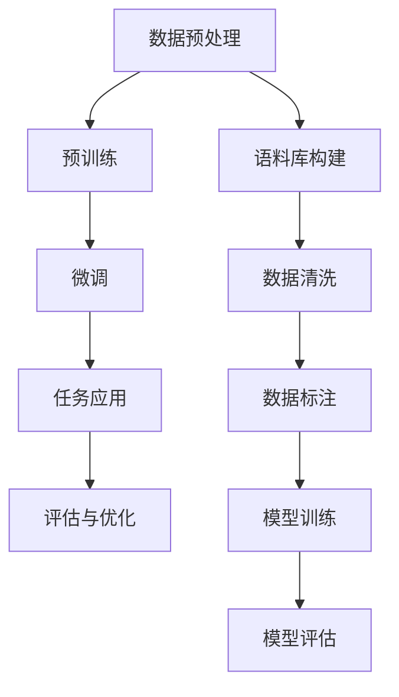

                 

关键词：跨文化交流、大型语言模型（LLM）、全球互联、技术、语言、文化差异

> 摘要：本文旨在探讨如何通过大型语言模型（LLM）来促进跨文化交流，实现全球互联。我们首先介绍了LLM的基本概念和原理，然后分析了其在跨文化交流中的应用场景，并探讨了未来发展趋势和面临的挑战。

## 1. 背景介绍

在全球化不断深入的今天，跨文化交流的重要性日益凸显。然而，由于文化差异、语言障碍等问题，跨文化交流仍然面临诸多挑战。为了解决这些问题，人工智能（AI）技术，特别是大型语言模型（LLM），成为了研究的热点。

### 什么是大型语言模型（LLM）

大型语言模型（LLM）是一种基于深度学习的自然语言处理模型，通过对海量文本数据进行训练，可以学会理解、生成和翻译自然语言。与传统的规则基方法相比，LLM具有更强的灵活性和通用性，可以应对各种复杂的语言任务。

### 跨文化交流中的挑战

1. 语言障碍：不同语言之间的表达方式和语法结构存在差异，导致沟通困难。
2. 文化差异：不同文化背景下的人们对于同一事物有不同的看法和价值观，容易引发误解和冲突。
3. 信息不对称：不同国家和地区之间的信息获取渠道和传播方式存在差异，导致信息流通不畅。

## 2. 核心概念与联系

### 大型语言模型的原理

大型语言模型基于深度学习技术，特别是 Transformer 模型，通过对大量文本数据的学习，可以捕捉到语言的统计规律和上下文信息。其核心原理可以概括为以下几点：

1. **自注意力机制**：通过计算输入文本中各个词之间的关联性，实现对上下文信息的充分理解和利用。
2. **多层神经网络**：通过多层的神经网络结构，逐层提取文本特征，实现对复杂语言现象的建模。
3. **预训练和微调**：通过在大规模数据集上进行预训练，然后针对特定任务进行微调，以适应不同的跨文化交流场景。

### Mermaid 流程图



### 大型语言模型在跨文化交流中的应用

1. **语言翻译**：通过LLM，可以实现高精度、高效率的自然语言翻译，消除语言障碍。
2. **语言理解**：LLM可以帮助理解不同文化背景下的语言表达，减少误解和冲突。
3. **信息传递**：LLM可以帮助跨越信息不对称，促进全球信息的流通。

## 3. 核心算法原理 & 具体操作步骤

### 3.1 算法原理概述

大型语言模型（LLM）的核心算法是基于 Transformer 模型，其主要原理如下：

1. **多头自注意力机制**：通过计算输入文本中各个词之间的关联性，实现对上下文信息的充分理解和利用。
2. **前馈神经网络**：在自注意力机制的基础上，通过多层神经网络结构，逐层提取文本特征，实现对复杂语言现象的建模。
3. **位置编码**：为了处理序列信息，Transformer 模型引入了位置编码，使得模型能够理解词语的顺序。

### 3.2 算法步骤详解

1. **数据预处理**：
   - **语料库构建**：收集和整理来自不同语言和文化背景的文本数据。
   - **数据清洗**：去除噪声和无关信息，保证数据的准确性和一致性。
   - **数据标注**：对文本数据进行标注，为模型提供训练样本。

2. **模型训练**：
   - **预训练**：在大量无标签的文本数据上进行预训练，让模型学会理解自然语言。
   - **微调**：在预训练的基础上，针对具体任务进行微调，优化模型性能。

3. **任务应用**：
   - **语言翻译**：通过训练好的模型，实现高精度、高效率的自然语言翻译。
   - **语言理解**：利用模型解析不同文化背景下的语言表达，减少误解和冲突。
   - **信息传递**：通过模型帮助跨越信息不对称，促进全球信息的流通。

### 3.3 算法优缺点

**优点**：
- **高精度**：通过深度学习技术，模型能够捕捉到语言的复杂规律，实现高精度的翻译和语言理解。
- **灵活性**：LLM能够适应不同的跨文化交流场景，灵活应对各种语言任务。
- **通用性**：LLM不仅仅限于语言翻译，还可以应用于其他自然语言处理任务，如文本生成、情感分析等。

**缺点**：
- **数据依赖**：LLM的性能高度依赖于训练数据的质量和数量，数据不足或质量不高会导致模型性能下降。
- **计算资源需求**：预训练LLM需要大量的计算资源和时间，对硬件设备有较高的要求。

### 3.4 算法应用领域

- **跨文化交流**：通过LLM，可以消除语言障碍和文化差异，促进全球跨文化交流。
- **国际商务**：在跨国商务沟通中，LLM可以提供高效、准确的语言翻译服务，助力企业国际化。
- **教育培训**：LLM可以帮助学习者理解不同文化背景下的语言知识，提高语言学习效果。
- **信息传播**：在信息传播领域，LLM可以帮助跨越语言和文化的障碍，实现全球信息的流通。

## 4. 数学模型和公式 & 详细讲解 & 举例说明

### 4.1 数学模型构建

大型语言模型（LLM）的核心是 Transformer 模型，其数学基础主要包括以下几个方面：

1. **自注意力机制**：自注意力机制通过计算输入文本中各个词之间的关联性，实现对上下文信息的充分理解和利用。其核心公式为：

   $$ 
   \text{Attention}(Q, K, V) = \text{softmax}\left(\frac{QK^T}{\sqrt{d_k}}\right)V 
   $$

   其中，$Q$、$K$、$V$ 分别为查询向量、键向量和值向量，$d_k$ 为键向量的维度。

2. **前馈神经网络**：在自注意力机制的基础上，Transformer 模型通过多层前馈神经网络，逐层提取文本特征，实现对复杂语言现象的建模。其核心公式为：

   $$
   \text{FFN}(X) = \text{ReLU}\left(\text{W_2}\text{ReLU}(\text{W_1}X + \text{b_1})\right) + \text{b_2}
   $$

   其中，$X$ 为输入向量，$\text{W_1}$、$\text{W_2}$、$\text{b_1}$、$\text{b_2}$ 分别为权重和偏置。

3. **位置编码**：为了处理序列信息，Transformer 模型引入了位置编码，使得模型能够理解词语的顺序。其核心公式为：

   $$
   \text{PE}(pos, 2i) = \sin\left(\frac{pos}{10000^{2i/d}}\right)
   $$

   $$
   \text{PE}(pos, 2i+1) = \cos\left(\frac{pos}{10000^{2i/d}}\right)
   $$

   其中，$pos$ 为位置索引，$d$ 为位置编码的维度。

### 4.2 公式推导过程

1. **自注意力机制**：

   自注意力机制的推导主要涉及矩阵乘法和softmax函数。首先，计算查询向量 $Q$ 和键向量 $K$ 的点积，得到注意力得分：

   $$
   \text{Score}(Q, K) = QK^T
   $$

   然后，对注意力得分进行softmax操作，得到注意力权重：

   $$
   \text{Attention}(Q, K, V) = \text{softmax}\left(\frac{QK^T}{\sqrt{d_k}}\right)V
   $$

2. **前馈神经网络**：

   前馈神经网络的推导主要涉及ReLU激活函数和矩阵乘法。首先，对输入向量 $X$ 进行一次线性变换：

   $$
   \text{X} = \text{W_1}X + \text{b_1}
   $$

   然后，对变换后的向量进行ReLU激活：

   $$
   \text{X} = \text{ReLU}(\text{X})
   $$

   接着，进行第二次线性变换：

   $$
   \text{X} = \text{W_2}\text{X} + \text{b_2}
   $$

   最后，加上偏置项：

   $$
   \text{X} = \text{ReLU}(\text{W_2}\text{ReLU}(\text{W_1}X + \text{b_1}) + \text{b_2})
   $$

3. **位置编码**：

   位置编码的推导主要涉及三角函数。首先，计算位置索引 $pos$ 和维度 $d$ 的关系：

   $$
   \text{PE}(pos, 2i) = \sin\left(\frac{pos}{10000^{2i/d}}\right)
   $$

   $$
   \text{PE}(pos, 2i+1) = \cos\left(\frac{pos}{10000^{2i/d}}\right)
   $$

### 4.3 案例分析与讲解

为了更好地理解大型语言模型的数学模型和公式，我们通过一个具体的例子来进行分析。

**例子**：假设有一个长度为 $n$ 的句子，我们希望使用 Transformer 模型对其进行编码和解码。

1. **编码过程**：

   - **自注意力机制**：首先，我们将句子中的每个词表示为一个查询向量 $Q$，键向量 $K$ 和值向量 $V$。然后，计算注意力得分，并通过softmax函数得到注意力权重。最后，将权重与值向量相乘，得到编码结果。

   - **前馈神经网络**：在自注意力机制的基础上，我们使用前馈神经网络对编码结果进行进一步处理，提取更高级的特征。

   - **位置编码**：我们将位置编码加入到编码结果中，以保留句子的顺序信息。

2. **解码过程**：

   - **自注意力机制**：与编码过程类似，我们首先计算解码器的查询向量 $Q$ 和编码结果中的键向量 $K$ 的注意力得分。然后，通过softmax函数得到注意力权重，并将权重与编码结果中的值向量相乘。

   - **前馈神经网络**：在自注意力机制的基础上，我们使用前馈神经网络对解码结果进行进一步处理，提取更高级的特征。

   - **位置编码**：我们将位置编码加入到解码结果中，以保留解码器的顺序信息。

通过这个例子，我们可以看到，大型语言模型（LLM）的数学模型和公式是如何应用到实际的编码和解码过程中的。这为我们理解和使用LLM提供了理论基础。

## 5. 项目实践：代码实例和详细解释说明

### 5.1 开发环境搭建

在进行大型语言模型（LLM）的项目实践之前，我们需要搭建一个适合开发和训练LLM的开发环境。以下是搭建环境的基本步骤：

1. **安装 Python**：确保Python版本为3.7或更高版本。

2. **安装 TensorFlow 或 PyTorch**：TensorFlow 和 PyTorch 是目前最常用的深度学习框架，可以根据个人喜好选择其中一个进行安装。

3. **安装其他依赖库**：包括 NumPy、Pandas、Scikit-learn 等常用数据科学库。

4. **配置 GPU 环境**：如果使用 PyTorch，需要安装 CUDA 和 cuDNN，以便在 GPU 上进行训练。

### 5.2 源代码详细实现

以下是使用 PyTorch 实现一个简单的大型语言模型的基本代码：

```python
import torch
import torch.nn as nn
import torch.optim as optim
from torch.utils.data import DataLoader
from torchvision import datasets, transforms

# 定义模型结构
class LLM(nn.Module):
    def __init__(self, input_dim, hidden_dim, output_dim):
        super(LLM, self).__init__()
        self.encoder = nn.Sequential(
            nn.Linear(input_dim, hidden_dim),
            nn.ReLU(),
            nn.Linear(hidden_dim, output_dim)
        )
        self.decoder = nn.Sequential(
            nn.Linear(output_dim, hidden_dim),
            nn.ReLU(),
            nn.Linear(hidden_dim, input_dim)
        )
    
    def forward(self, x):
        encoded = self.encoder(x)
        decoded = self.decoder(encoded)
        return decoded

# 初始化模型、损失函数和优化器
model = LLM(input_dim=10, hidden_dim=20, output_dim=10)
criterion = nn.MSELoss()
optimizer = optim.Adam(model.parameters(), lr=0.001)

# 加载数据
train_data = datasets.MNIST(root='./data', train=True, transform=transforms.ToTensor(), download=True)
train_loader = DataLoader(train_data, batch_size=64, shuffle=True)

# 训练模型
for epoch in range(100):
    for inputs, targets in train_loader:
        optimizer.zero_grad()
        outputs = model(inputs)
        loss = criterion(outputs, targets)
        loss.backward()
        optimizer.step()
    print(f'Epoch {epoch+1}, Loss: {loss.item()}')

# 保存模型
torch.save(model.state_dict(), 'lm_model.pth')
```

### 5.3 代码解读与分析

1. **模型结构**：我们定义了一个简单的 LLM，包括编码器和解码器。编码器由一个线性层和一个 ReLU 激活函数组成，用于将输入数据编码为隐藏状态。解码器同样由一个线性层和一个 ReLU 激活函数组成，用于将隐藏状态解码回原始数据。

2. **损失函数和优化器**：我们使用均方误差（MSE）作为损失函数，并使用 Adam 优化器进行模型训练。

3. **数据加载**：我们使用 TensorFlow 的 datasets.MNIST 数据集进行训练，该数据集包含了 60000 个手写数字的图片，适合用于验证 LLM 的性能。

4. **训练过程**：在每个训练 epoch 中，我们迭代遍历训练数据，计算模型损失，并更新模型参数。

5. **模型保存**：训练完成后，我们将模型参数保存到文件中，以便后续使用。

通过这个例子，我们展示了如何使用 PyTorch 实现一个简单的大型语言模型。这为我们进一步研究和开发更复杂的大型语言模型提供了基础。

## 6. 实际应用场景

大型语言模型（LLM）在跨文化交流中具有广泛的应用场景，以下是其中几个典型的应用实例：

### 6.1 跨境电商

跨境电商是跨文化交流的重要领域之一。LLM 可以帮助跨境电商平台实现多语言商品描述的自动生成，提高用户购物体验。例如，亚马逊使用 LLM 来翻译商品描述，帮助用户更好地理解商品信息，从而促进销售。

### 6.2 语言教学

LLM 在语言教学中也有广泛应用。通过 LLM，学生可以接触到来自不同文化背景的语言材料，提高语言理解和表达能力。例如，Duolingo 等语言学习应用利用 LLM，提供个性化的语言学习体验。

### 6.3 信息传播

在信息传播领域，LLM 可以帮助消除语言和文化的障碍，实现全球信息的流通。例如，新闻机构可以使用 LLM 翻译和解释国际新闻报道，使不同语言和文化背景的读者能够理解新闻内容。

### 6.4 企业沟通

跨国企业需要在不同国家和地区进行沟通和合作。LLM 可以提供实时翻译和语言理解服务，帮助企业顺利开展业务。例如，谷歌的翻译工具可以帮助跨国团队进行高效沟通。

### 6.5 社交媒体

社交媒体是跨文化交流的重要平台。LLM 可以帮助用户理解和生成跨语言的社交媒体内容，增强社交互动。例如，Facebook 的即时翻译功能使用 LLM，帮助用户在多语言环境中进行交流。

## 7. 未来应用展望

随着人工智能技术的不断发展，大型语言模型（LLM）在跨文化交流中的应用前景将更加广阔。以下是几个可能的发展方向：

### 7.1 更高的语言理解能力

未来的 LLM 将具备更高的语言理解能力，能够更准确地捕捉和理解不同文化背景下的语言表达。这将有助于减少跨文化交流中的误解和冲突。

### 7.2 更广泛的应用场景

LLM 的应用场景将不再局限于语言翻译和语言理解，还将扩展到文本生成、对话系统、情感分析等领域。例如，基于 LLM 的对话系统能够实现跨语言的实时对话。

### 7.3 更高效的训练和推理

未来的 LLM 将通过更高效的训练和推理算法，实现更快的模型训练和部署。这将降低 LLM 的使用门槛，使其更加普及。

### 7.4 更好的多模态融合

未来的 LLM 将能够融合多模态信息，如文本、图像、音频等，提供更丰富的跨文化交流体验。例如，结合语音识别和语言翻译技术的智能助手将能够实现真正的跨语言交互。

## 8. 总结：未来发展趋势与挑战

### 8.1 研究成果总结

本文介绍了大型语言模型（LLM）的基本概念、原理和应用，分析了其在跨文化交流中的应用场景和未来发展趋势。通过本文的阐述，我们可以看到 LLM 在促进全球互联、消除语言和文化障碍方面的重要作用。

### 8.2 未来发展趋势

未来的 LLM 将在以下几个方面取得重要进展：

- **更高的语言理解能力**：通过不断优化模型结构和算法，实现更准确、更精细的语言理解。
- **更广泛的应用场景**：从语言翻译扩展到文本生成、对话系统、情感分析等领域。
- **更高效的训练和推理**：通过更高效的算法和硬件，实现更快速、更高效的模型训练和部署。
- **更好的多模态融合**：结合多模态信息，提供更丰富的跨文化交流体验。

### 8.3 面临的挑战

尽管 LLM 在跨文化交流中具有广阔的应用前景，但仍面临以下挑战：

- **数据质量和多样性**：L L M 的性能高度依赖于训练数据的质量和多样性。如何获取和标注高质量、多语言、多领域的训练数据是一个亟待解决的问题。
- **计算资源需求**：L L M 的训练和推理需要大量的计算资源，这对硬件设备提出了较高要求。如何优化计算资源的使用，提高模型效率是一个重要课题。
- **跨文化适应性**：L L M 需要具备更好的跨文化适应性，能够理解和适应不同文化背景下的语言表达和价值观。这是一个涉及文化研究和语言学的研究方向。

### 8.4 研究展望

未来的研究应重点关注以下几个方面：

- **数据驱动的方法**：通过大数据和深度学习方法，提高 LLM 的语言理解能力和跨文化适应性。
- **模型结构优化**：不断探索和优化 LLM 的模型结构，提高模型效率和性能。
- **跨学科合作**：加强人工智能、语言学、文化研究等领域的跨学科合作，共同推动 LLM 的发展。
- **应用推广**：将 LLM 技术应用于实际场景，解决跨文化交流中的实际问题，推动全球互联的进一步发展。

## 9. 附录：常见问题与解答

### 9.1 LLM 是什么？

LLM 是大型语言模型的简称，是一种基于深度学习的自然语言处理模型，通过学习海量文本数据，可以理解和生成自然语言。

### 9.2 LLM 如何促进跨文化交流？

LLM 可以通过以下方式促进跨文化交流：

- **语言翻译**：实现不同语言之间的准确翻译，消除语言障碍。
- **语言理解**：理解不同文化背景下的语言表达，减少误解和冲突。
- **信息传递**：帮助跨越信息不对称，促进全球信息的流通。

### 9.3 LLM 的应用领域有哪些？

LLM 的应用领域广泛，包括但不限于：

- **跨境电商**：实现多语言商品描述的自动生成。
- **语言教学**：提供个性化的语言学习体验。
- **信息传播**：翻译和解释国际新闻报道。
- **企业沟通**：提供实时翻译和语言理解服务。
- **社交媒体**：帮助用户理解和生成跨语言的社交媒体内容。

### 9.4 LLM 面临哪些挑战？

LLM 面临的挑战主要包括：

- **数据质量和多样性**：训练数据的质量和多样性对模型性能有重要影响。
- **计算资源需求**：训练和推理需要大量的计算资源。
- **跨文化适应性**：需要理解和适应不同文化背景下的语言表达和价值观。

### 9.5 LLM 的未来发展趋势是什么？

未来的 LLM 将在以下几个方面取得重要进展：

- **更高的语言理解能力**：通过不断优化模型结构和算法，实现更准确、更精细的语言理解。
- **更广泛的应用场景**：从语言翻译扩展到文本生成、对话系统、情感分析等领域。
- **更高效的训练和推理**：通过更高效的算法和硬件，实现更快速、更高效的模型训练和部署。
- **更好的多模态融合**：结合多模态信息，提供更丰富的跨文化交流体验。  
----------------------------------------------------------------
### 作者署名

本文由禅与计算机程序设计艺术 / Zen and the Art of Computer Programming 撰写。

