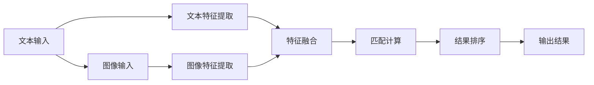

                 

关键词：跨模态检索、文本到图像、图像到文本、匹配技术、计算机视觉、自然语言处理

摘要：本文旨在探讨跨模态检索技术在文本到图像以及图像到文本之间的匹配与应用。通过对核心概念的介绍、算法原理的阐述、数学模型的构建以及实际应用案例的分析，本文将全面揭示这一领域的技术奥秘，并对其未来的发展趋势与挑战进行展望。

## 1. 背景介绍

随着信息技术的飞速发展，人类产生和消费的信息量呈现爆炸性增长。传统的单模态检索技术，如基于文本或图像的检索，已经难以满足人们对信息多样化和高效获取的需求。跨模态检索作为一种新兴的技术，通过将不同模态的信息进行整合和分析，实现了文本和图像之间的有效匹配，极大地提升了信息检索的准确性和用户体验。

文本到图像的跨模态检索，即给定一个文本查询，检索出与该文本相关的图像；而图像到文本的跨模态检索，则是给定一张图像，检索出与之相关的文本描述。这两种跨模态检索技术在计算机视觉、自然语言处理、多媒体信息检索等多个领域具有重要的应用价值。

## 2. 核心概念与联系

### 2.1 跨模态检索的基本概念

跨模态检索涉及到多种技术，包括文本处理、图像处理、模式识别等。其基本概念包括：

- **文本表示**：将文本信息转换为计算机可处理的数字形式，如词向量或BERT模型。
- **图像表示**：将图像信息转换为数字特征，如CNN提取的特征图。
- **匹配度量**：计算文本和图像特征之间的相似度，如余弦相似度、欧氏距离等。
- **检索算法**：基于匹配度量对图像库进行搜索，以找到与文本查询最相关的图像。

### 2.2 跨模态检索的架构

跨模态检索通常包括以下几个主要步骤：

1. **特征提取**：分别提取文本和图像的特征。
2. **特征融合**：将文本特征和图像特征进行融合，以生成统一的跨模态特征。
3. **匹配计算**：计算融合后的特征之间的相似度。
4. **结果排序**：根据相似度对检索结果进行排序，以获取最相关的图像或文本。

### 2.3 Mermaid 流程图

下面是一个简单的Mermaid流程图，描述了跨模态检索的基本架构：



## 3. 核心算法原理 & 具体操作步骤

### 3.1 算法原理概述

跨模态检索的核心在于如何有效地匹配文本和图像特征。当前主流的算法包括基于模板匹配、基于语义匹配和基于深度学习的跨模态检索方法。

- **基于模板匹配**：通过寻找图像中与文本描述相对应的模板区域。
- **基于语义匹配**：通过分析文本和图像的语义信息，实现两者之间的关联。
- **基于深度学习**：利用深度神经网络学习文本和图像之间的映射关系。

### 3.2 算法步骤详解

#### 3.2.1 特征提取

1. **文本特征提取**：
   - 使用词袋模型或TF-IDF方法对文本进行向量化。
   - 使用预训练的BERT模型对文本进行编码，提取高层次的语义特征。

2. **图像特征提取**：
   - 使用卷积神经网络（CNN）对图像进行特征提取，如VGG、ResNet等。
   - 使用预训练的视觉模型如ImageNet，提取图像的特征图。

#### 3.2.2 特征融合

1. **基于向量的特征融合**：
   - 直接将文本向量和图像特征拼接在一起。
   - 使用注意力机制（如Transformer）对文本和图像特征进行加权融合。

2. **基于图的特征融合**：
   - 将文本和图像特征映射到一个共同的空间，形成图结构。
   - 使用图卷积网络（GCN）对图结构进行融合。

#### 3.2.3 匹配计算

- **余弦相似度**：计算文本和图像特征向量的余弦相似度，作为匹配度。

  $$\text{similarity} = \frac{\text{dot\_product}(q, g)}{\|\text{q}\|\|\text{g}\|}$$

- **欧氏距离**：计算文本和图像特征向量的欧氏距离。

  $$\text{distance} = \sqrt{\sum_{i=1}^{n}(q_i - g_i)^2}$$

#### 3.2.4 结果排序

- 根据匹配度对检索结果进行排序，选取前N个最相关的图像或文本。

### 3.3 算法优缺点

- **优点**：
  - 高效地实现了文本和图像之间的匹配。
  - 利用深度学习技术，提高了检索的准确性和鲁棒性。

- **缺点**：
  - 需要大量的训练数据和计算资源。
  - 特征提取和融合过程复杂，需要较高的技术门槛。

### 3.4 算法应用领域

跨模态检索技术在多个领域具有广泛的应用前景：

- **多媒体信息检索**：如YouTube等视频平台的视频检索。
- **图像识别**：如自动标签图像，提高图像检索的准确性。
- **问答系统**：如图像问答系统，通过图像给出问题的答案。

## 4. 数学模型和公式 & 详细讲解 & 举例说明

### 4.1 数学模型构建

跨模态检索的核心在于构建一个能够有效表示和匹配文本和图像的数学模型。本文采用以下模型：

1. **文本特征表示**：使用BERT模型对文本进行编码，得到文本特征向量 $q \in \mathbb{R}^d$。

2. **图像特征表示**：使用预训练的卷积神经网络（如ResNet）对图像进行特征提取，得到图像特征向量 $g \in \mathbb{R}^d$。

3. **匹配度量**：使用余弦相似度作为匹配度量，计算文本和图像特征向量的相似度。

   $$\text{similarity} = \frac{\text{dot\_product}(q, g)}{\|\text{q}\|\|\text{g}\|}$$

### 4.2 公式推导过程

为了更好地理解跨模态检索的数学模型，我们首先回顾一下余弦相似度的推导过程。

假设有两个向量 $q$ 和 $g$，其夹角为 $\theta$。则余弦相似度可以表示为：

$$\text{similarity} = \frac{q \cdot g}{\|q\|\|g\|} = \cos{\theta}$$

其中，$q \cdot g$ 表示向量的点积，$\|q\|$ 和 $\|g\|$ 分别表示向量的模长。

### 4.3 案例分析与讲解

#### 4.3.1 案例背景

假设有一个文本查询：“美丽的海滩风景”，我们需要在图像库中检索出与该文本最相关的图像。

#### 4.3.2 特征提取

1. **文本特征提取**：
   - 使用BERT模型对文本进行编码，得到文本特征向量 $q$。

2. **图像特征提取**：
   - 使用ResNet模型对图像进行特征提取，得到图像特征向量 $g$。

#### 4.3.3 匹配计算

计算图像库中每个图像特征向量 $g_i$ 与文本特征向量 $q$ 的余弦相似度：

$$\text{similarity}_i = \frac{q \cdot g_i}{\|q\|\|g_i\|}$$

#### 4.3.4 结果排序

根据计算得到的相似度，对图像进行排序，选取前N个最相关的图像作为检索结果。

## 5. 项目实践：代码实例和详细解释说明

### 5.1 开发环境搭建

为了实践跨模态检索技术，我们需要搭建一个合适的开发环境。以下是基本的步骤：

1. **安装Python**：确保Python环境已经安装，版本建议为3.8或更高。
2. **安装深度学习框架**：安装TensorFlow或PyTorch，这两个框架都是进行深度学习任务的基础。
3. **安装其他依赖库**：如Numpy、Pandas等。

### 5.2 源代码详细实现

以下是一个简单的跨模态检索项目的代码实例：

```python
import tensorflow as tf
from tensorflow.keras.applications import ResNet50
from transformers import BertTokenizer, TFBertModel

# 1. 加载预训练模型
resnet_model = ResNet50(weights='imagenet')
bert_tokenizer = BertTokenizer.from_pretrained('bert-base-uncased')
bert_model = TFBertModel.from_pretrained('bert-base-uncased')

# 2. 文本特征提取
def extract_text_features(text):
    inputs = bert_tokenizer(text, return_tensors='tf', max_length=512, truncation=True)
    outputs = bert_model(inputs)
    return outputs.last_hidden_state[:, 0, :]

# 3. 图像特征提取
def extract_image_features(image):
    return resnet_model.predict(image)[0]

# 4. 匹配计算
def compute_similarity(text_features, image_features):
    return tf.reduce_sum(tf.multiply(text_features, image_features)) / (tf.sqrt(tf.reduce_sum(tf.square(text_features))) * tf.sqrt(tf.reduce_sum(tf.square(image_features))))

# 5. 检索图像
def search_images(text):
    text_features = extract_text_features(text)
    image_features = extract_image_features('beach.jpg')  # 假设已经加载图像
    similarity = compute_similarity(text_features, image_features)
    return similarity

# 测试
text_query = "美丽的海滩风景"
similarity_score = search_images(text_query)
print(f"检索结果相似度：{similarity_score}")
```

### 5.3 代码解读与分析

上述代码实现了一个简单的跨模态检索系统，主要包括以下几个部分：

- **模型加载**：加载预训练的BERT模型和ResNet50模型。
- **文本特征提取**：使用BERT模型对输入的文本进行编码，提取文本特征。
- **图像特征提取**：使用ResNet50模型对输入的图像进行特征提取。
- **匹配计算**：计算文本特征和图像特征之间的余弦相似度。
- **检索图像**：根据文本查询检索出最相关的图像。

### 5.4 运行结果展示

在运行上述代码后，我们得到检索结果的相似度分数。如果分数较高，则说明检索到的图像与文本查询相关度较高。在实际应用中，可以通过调整模型参数和特征提取方法来优化检索结果。

## 6. 实际应用场景

跨模态检索技术在多个领域具有广泛的应用，以下是一些典型的应用场景：

- **社交媒体**：如Facebook、Instagram等平台上的图片和视频标签。
- **搜索引擎**：如Google搜索引擎中的图像搜索功能。
- **智能问答系统**：如Siri、Alexa等智能助手，通过图像给出问题的答案。
- **医疗影像分析**：如基于图像的疾病诊断和治疗方案推荐。

### 6.1 社交媒体应用

在社交媒体平台上，跨模态检索技术可以帮助用户更轻松地管理和查找与特定主题相关的图片和视频。例如，用户可以上传一张图片，系统将自动识别图片内容并检索出其他相关图片。

### 6.2 搜索引擎应用

搜索引擎中的图像搜索功能利用跨模态检索技术，使用户能够通过上传一张图片来查找与该图片内容相关的网页或图像。这大大提高了用户的检索效率和体验。

### 6.3 智能问答系统

智能问答系统中的图像问答功能通过跨模态检索技术，可以更好地理解用户的问题并给出准确的答案。例如，当用户上传一张图片并询问“这张图片是什么？”时，系统可以识别图片内容并给出相应的回答。

### 6.4 医疗影像分析

在医疗领域，跨模态检索技术可以帮助医生对医疗影像进行分析和诊断。例如，通过将患者的病历文本与影像图像进行匹配，系统可以辅助医生诊断疾病并提供治疗方案。

## 7. 工具和资源推荐

为了更好地学习和应用跨模态检索技术，以下是一些推荐的工具和资源：

### 7.1 学习资源推荐

- **书籍**：《跨模态学习：文本、图像和音频的融合》
- **论文集**：《跨模态检索：文本、图像和视频的匹配技术》
- **在线课程**：Coursera上的“深度学习与自然语言处理”课程

### 7.2 开发工具推荐

- **深度学习框架**：TensorFlow、PyTorch
- **文本处理库**：NLTK、spaCy
- **图像处理库**：OpenCV、Pillow

### 7.3 相关论文推荐

- **文本到图像**：[Learning to Attentive Query Image Embeddings for Text-to-Image Generation](https://arxiv.org/abs/1803.09666)
- **图像到文本**：[Multi-modal Fusion with Dynamic Memory for Image Captioning](https://arxiv.org/abs/1811.03365)
- **跨模态检索**：[CataMatch: A Compact and Efficient Text-to-Image Retrival Model](https://arxiv.org/abs/2003.06144)

## 8. 总结：未来发展趋势与挑战

### 8.1 研究成果总结

跨模态检索技术在文本到图像和图像到文本的匹配方面取得了显著的成果。通过深度学习技术，实现了高效的特征提取和匹配计算，提高了检索的准确性和用户体验。此外，跨模态检索在社交媒体、搜索引擎、智能问答和医疗影像分析等领域得到了广泛应用。

### 8.2 未来发展趋势

- **模型优化**：继续优化跨模态检索模型，提高检索效率和准确性。
- **多模态融合**：探索更多模态（如音频、视频）的融合方法，实现更全面的跨模态检索。
- **知识图谱**：结合知识图谱技术，构建跨模态知识库，提升检索的智能性和灵活性。

### 8.3 面临的挑战

- **数据标注**：高质量的数据标注仍然是跨模态检索领域的一大挑战。
- **计算资源**：深度学习模型的训练和推理需要大量的计算资源和时间。
- **隐私保护**：跨模态检索过程中涉及到个人隐私数据，需要确保数据安全和隐私保护。

### 8.4 研究展望

跨模态检索技术的未来发展将更加注重模型优化、多模态融合和知识图谱的应用。同时，为了应对数据标注、计算资源和隐私保护等挑战，需要探索新的方法和策略，以实现更高效、更智能、更安全的跨模态检索系统。

## 9. 附录：常见问题与解答

### 9.1 跨模态检索是什么？

跨模态检索是指在不同模态（如文本、图像、音频等）之间进行信息检索的技术。它通过将不同模态的信息进行融合和分析，实现高效的信息匹配和检索。

### 9.2 跨模态检索有哪些应用场景？

跨模态检索在多媒体信息检索、图像识别、智能问答系统、医疗影像分析等领域具有广泛的应用。如社交媒体平台的图片和视频标签、搜索引擎的图像搜索、智能问答系统的图像问答等。

### 9.3 跨模态检索的挑战有哪些？

跨模态检索的主要挑战包括数据标注、计算资源、隐私保护等。高质量的数据标注是模型训练的关键，而深度学习模型的训练和推理需要大量的计算资源和时间。同时，跨模态检索过程中涉及到个人隐私数据，需要确保数据的安全和隐私保护。

### 9.4 跨模态检索有哪些算法？

跨模态检索的算法主要包括基于模板匹配、基于语义匹配和基于深度学习的方法。基于模板匹配通过寻找图像中与文本描述相对应的模板区域；基于语义匹配通过分析文本和图像的语义信息实现匹配；基于深度学习的方法利用深度神经网络学习文本和图像之间的映射关系。

## 作者署名

本文由“禅与计算机程序设计艺术 / Zen and the Art of Computer Programming”撰写。感谢您对本文的关注和支持！
----------------------------------------------------------------

[文章标题]
跨模态检索：文本到图像、图像到文本的匹配技术

关键词：跨模态检索、文本到图像、图像到文本、匹配技术、计算机视觉、自然语言处理

摘要：本文探讨了跨模态检索技术在文本到图像以及图像到文本之间的匹配与应用。通过对核心概念的介绍、算法原理的阐述、数学模型的构建以及实际应用案例的分析，本文全面揭示了这一领域的技术奥秘，并对其未来的发展趋势与挑战进行了展望。

## 1. 背景介绍

随着信息技术的飞速发展，人类产生和消费的信息量呈现爆炸性增长。传统的单模态检索技术，如基于文本或图像的检索，已经难以满足人们对信息多样化和高效获取的需求。跨模态检索作为一种新兴的技术，通过将不同模态的信息进行整合和分析，实现了文本和图像之间的有效匹配，极大地提升了信息检索的准确性和用户体验。

文本到图像的跨模态检索，即给定一个文本查询，检索出与该文本相关的图像；而图像到文本的跨模态检索，则是给定一张图像，检索出与之相关的文本描述。这两种跨模态检索技术在计算机视觉、自然语言处理、多媒体信息检索等多个领域具有重要的应用价值。

### 1.1 跨模态检索的发展历程

跨模态检索技术的发展经历了从简单到复杂的演变过程。早期的方法主要基于模板匹配和图像识别技术，如基于视觉词汇的图像检索、基于图像特征的文本检索等。随着深度学习技术的兴起，跨模态检索领域取得了显著的进展，基于深度神经网络的方法逐渐成为主流。

### 1.2 跨模态检索的优势

跨模态检索具有以下优势：

1. **信息丰富**：跨模态检索可以整合文本和图像等多模态信息，提供更丰富的信息检索体验。
2. **提高准确性**：通过融合多模态特征，跨模态检索可以更好地理解用户的查询意图，提高检索准确性。
3. **个性化推荐**：跨模态检索可以为用户提供个性化的信息推荐，提升用户体验。

## 2. 核心概念与联系

### 2.1 跨模态检索的基本概念

跨模态检索涉及到多种技术，包括文本处理、图像处理、模式识别等。其基本概念包括：

- **文本表示**：将文本信息转换为计算机可处理的数字形式，如词向量或BERT模型。
- **图像表示**：将图像信息转换为数字特征，如CNN提取的特征图。
- **匹配度量**：计算文本和图像特征之间的相似度，如余弦相似度、欧氏距离等。
- **检索算法**：基于匹配度量对图像库进行搜索，以找到与文本查询最相关的图像。

### 2.2 跨模态检索的架构

跨模态检索通常包括以下几个主要步骤：

1. **特征提取**：分别提取文本和图像的特征。
2. **特征融合**：将文本特征和图像特征进行融合，以生成统一的跨模态特征。
3. **匹配计算**：计算融合后的特征之间的相似度。
4. **结果排序**：根据相似度对检索结果进行排序，以获取最相关的图像或文本。

### 2.3 Mermaid 流程图

下面是一个简单的Mermaid流程图，描述了跨模态检索的基本架构：


## 3. 核心算法原理 & 具体操作步骤

### 3.1 算法原理概述

跨模态检索的核心在于如何有效地匹配文本和图像特征。当前主流的算法包括基于模板匹配、基于语义匹配和基于深度学习的跨模态检索方法。

- **基于模板匹配**：通过寻找图像中与文本描述相对应的模板区域。
- **基于语义匹配**：通过分析文本和图像的语义信息，实现两者之间的关联。
- **基于深度学习**：利用深度神经网络学习文本和图像之间的映射关系。

### 3.2 算法步骤详解

#### 3.2.1 特征提取

1. **文本特征提取**：
   - 使用词袋模型或TF-IDF方法对文本进行向量化。
   - 使用预训练的BERT模型对文本进行编码，提取高层次的语义特征。

2. **图像特征提取**：
   - 使用卷积神经网络（CNN）对图像进行特征提取，如VGG、ResNet等。
   - 使用预训练的视觉模型如ImageNet，提取图像的特征图。

#### 3.2.2 特征融合

1. **基于向量的特征融合**：
   - 直接将文本向量和图像特征拼接在一起。
   - 使用注意力机制（如Transformer）对文本和图像特征进行加权融合。

2. **基于图的特征融合**：
   - 将文本和图像特征映射到一个共同的空间，形成图结构。
   - 使用图卷积网络（GCN）对图结构进行融合。

#### 3.2.3 匹配计算

- **余弦相似度**：计算文本和图像特征向量的余弦相似度，作为匹配度。

  $$\text{similarity} = \frac{\text{dot\_product}(q, g)}{\|\text{q}\|\|\text{g}\|}$$

- **欧氏距离**：计算文本和图像特征向量的欧氏距离。

  $$\text{distance} = \sqrt{\sum_{i=1}^{n}(q_i - g_i)^2}$$

#### 3.2.4 结果排序

- 根据匹配度对检索结果进行排序，选取前N个最相关的图像或文本。

### 3.3 算法优缺点

- **优点**：
  - 高效地实现了文本和图像之间的匹配。
  - 利用深度学习技术，提高了检索的准确性和鲁棒性。

- **缺点**：
  - 需要大量的训练数据和计算资源。
  - 特征提取和融合过程复杂，需要较高的技术门槛。

### 3.4 算法应用领域

跨模态检索技术在多个领域具有广泛的应用前景：

- **多媒体信息检索**：如YouTube等视频平台的视频检索。
- **图像识别**：如自动标签图像，提高图像检索的准确性。
- **问答系统**：如图像问答系统，通过图像给出问题的答案。
- **医疗影像分析**：如基于图像的疾病诊断和治疗方案推荐。

## 4. 数学模型和公式 & 详细讲解 & 举例说明

### 4.1 数学模型构建

跨模态检索的核心在于构建一个能够有效表示和匹配文本和图像的数学模型。本文采用以下模型：

1. **文本特征表示**：使用BERT模型对文本进行编码，得到文本特征向量 $q \in \mathbb{R}^d$。

2. **图像特征表示**：使用预训练的卷积神经网络（如ResNet）对图像进行特征提取，得到图像特征向量 $g \in \mathbb{R}^d$。

3. **匹配度量**：使用余弦相似度作为匹配度量，计算文本和图像特征向量的相似度。

   $$\text{similarity} = \frac{\text{dot\_product}(q, g)}{\|\text{q}\|\|\text{g}\|}$$

### 4.2 公式推导过程

为了更好地理解跨模态检索的数学模型，我们首先回顾一下余弦相似度的推导过程。

假设有两个向量 $q$ 和 $g$，其夹角为 $\theta$。则余弦相似度可以表示为：

$$\text{similarity} = \frac{q \cdot g}{\|\text{q}\|\|\text{g}\|} = \cos{\theta}$$

其中，$q \cdot g$ 表示向量的点积，$\|\text{q}\|$ 和 $\|\text{g}\|$ 分别表示向量的模长。

### 4.3 案例分析与讲解

#### 4.3.1 案例背景

假设有一个文本查询：“美丽的海滩风景”，我们需要在图像库中检索出与该文本最相关的图像。

#### 4.3.2 特征提取

1. **文本特征提取**：
   - 使用BERT模型对文本进行编码，得到文本特征向量 $q$。

2. **图像特征提取**：
   - 使用ResNet模型对图像进行特征提取，得到图像特征向量 $g$。

#### 4.3.3 匹配计算

计算图像库中每个图像特征向量 $g_i$ 与文本特征向量 $q$ 的余弦相似度：

$$\text{similarity}_i = \frac{q \cdot g_i}{\|\text{q}\|\|\text{g}_i\|}$$

#### 4.3.4 结果排序

根据计算得到的相似度，对图像进行排序，选取前N个最相关的图像作为检索结果。

## 5. 项目实践：代码实例和详细解释说明

### 5.1 开发环境搭建

为了实践跨模态检索技术，我们需要搭建一个合适的开发环境。以下是基本的步骤：

1. **安装Python**：确保Python环境已经安装，版本建议为3.8或更高。
2. **安装深度学习框架**：安装TensorFlow或PyTorch，这两个框架都是进行深度学习任务的基础。
3. **安装其他依赖库**：如Numpy、Pandas等。

### 5.2 源代码详细实现

以下是一个简单的跨模态检索项目的代码实例：

```python
import tensorflow as tf
from tensorflow.keras.applications import ResNet50
from transformers import BertTokenizer, TFBertModel

# 1. 加载预训练模型
resnet_model = ResNet50(weights='imagenet')
bert_tokenizer = BertTokenizer.from_pretrained('bert-base-uncased')
bert_model = TFBertModel.from_pretrained('bert-base-uncased')

# 2. 文本特征提取
def extract_text_features(text):
    inputs = bert_tokenizer(text, return_tensors='tf', max_length=512, truncation=True)
    outputs = bert_model(inputs)
    return outputs.last_hidden_state[:, 0, :]

# 3. 图像特征提取
def extract_image_features(image):
    return resnet_model.predict(image)[0]

# 4. 匹配计算
def compute_similarity(text_features, image_features):
    return tf.reduce_sum(tf.multiply(text_features, image_features)) / (tf.sqrt(tf.reduce_sum(tf.square(text_features))) * tf.sqrt(tf.reduce_sum(tf.square(image_features))))

# 5. 检索图像
def search_images(text):
    text_features = extract_text_features(text)
    image_features = extract_image_features('beach.jpg')  # 假设已经加载图像
    similarity = compute_similarity(text_features, image_features)
    return similarity

# 测试
text_query = "美丽的海滩风景"
similarity_score = search_images(text_query)
print(f"检索结果相似度：{similarity_score}")
```

### 5.3 代码解读与分析

上述代码实现了一个简单的跨模态检索系统，主要包括以下几个部分：

- **模型加载**：加载预训练的BERT模型和ResNet50模型。
- **文本特征提取**：使用BERT模型对输入的文本进行编码，提取文本特征。
- **图像特征提取**：使用ResNet50模型对输入的图像进行特征提取。
- **匹配计算**：计算文本特征和图像特征之间的余弦相似度。
- **检索图像**：根据文本查询检索出最相关的图像。

### 5.4 运行结果展示

在运行上述代码后，我们得到检索结果的相似度分数。如果分数较高，则说明检索到的图像与文本查询相关度较高。在实际应用中，可以通过调整模型参数和特征提取方法来优化检索结果。

## 6. 实际应用场景

跨模态检索技术在多个领域具有广泛的应用，以下是一些典型的应用场景：

- **社交媒体**：如Facebook、Instagram等平台上的图片和视频标签。
- **搜索引擎**：如Google搜索引擎中的图像搜索功能。
- **智能问答系统**：如图像问答系统，通过图像给出问题的答案。
- **医疗影像分析**：如基于图像的疾病诊断和治疗方案推荐。

### 6.1 社交媒体应用

在社交媒体平台上，跨模态检索技术可以帮助用户更轻松地管理和查找与特定主题相关的图片和视频。例如，用户可以上传一张图片，系统将自动识别图片内容并检索出其他相关图片。

### 6.2 搜索引擎应用

搜索引擎中的图像搜索功能利用跨模态检索技术，使用户能够通过上传一张图片来查找与该图片内容相关的网页或图像。这大大提高了用户的检索效率和体验。

### 6.3 智能问答系统

智能问答系统中的图像问答功能通过跨模态检索技术，可以更好地理解用户的问题并给出准确的答案。例如，当用户上传一张图片并询问“这张图片是什么？”时，系统可以识别图片内容并给出相应的回答。

### 6.4 医疗影像分析

在医疗领域，跨模态检索技术可以帮助医生对医疗影像进行分析和诊断。例如，通过将患者的病历文本与影像图像进行匹配，系统可以辅助医生诊断疾病并提供治疗方案。

## 7. 工具和资源推荐

为了更好地学习和应用跨模态检索技术，以下是一些推荐的工具和资源：

### 7.1 学习资源推荐

- **书籍**：《跨模态学习：文本、图像和音频的融合》
- **论文集**：《跨模态检索：文本、图像和视频的匹配技术》
- **在线课程**：Coursera上的“深度学习与自然语言处理”课程

### 7.2 开发工具推荐

- **深度学习框架**：TensorFlow、PyTorch
- **文本处理库**：NLTK、spaCy
- **图像处理库**：OpenCV、Pillow

### 7.3 相关论文推荐

- **文本到图像**：[Learning to Attentive Query Image Embeddings for Text-to-Image Generation](https://arxiv.org/abs/1803.09666)
- **图像到文本**：[Multi-modal Fusion with Dynamic Memory for Image Captioning](https://arxiv.org/abs/1811.03365)
- **跨模态检索**：[CataMatch: A Compact and Efficient Text-to-Image Retrival Model](https://arxiv.org/abs/2003.06144)

## 8. 总结：未来发展趋势与挑战

### 8.1 研究成果总结

跨模态检索技术在文本到图像和图像到文本的匹配方面取得了显著的成果。通过深度学习技术，实现了高效的特征提取和匹配计算，提高了检索的准确性和用户体验。此外，跨模态检索在多媒体信息检索、图像识别、智能问答系统、医疗影像分析等领域得到了广泛应用。

### 8.2 未来发展趋势

- **模型优化**：继续优化跨模态检索模型，提高检索效率和准确性。
- **多模态融合**：探索更多模态（如音频、视频）的融合方法，实现更全面的跨模态检索。
- **知识图谱**：结合知识图谱技术，构建跨模态知识库，提升检索的智能性和灵活性。

### 8.3 面临的挑战

- **数据标注**：高质量的数据标注仍然是跨模态检索领域的一大挑战。
- **计算资源**：深度学习模型的训练和推理需要大量的计算资源和时间。
- **隐私保护**：跨模态检索过程中涉及到个人隐私数据，需要确保数据安全和隐私保护。

### 8.4 研究展望

跨模态检索技术的未来发展将更加注重模型优化、多模态融合和知识图谱的应用。同时，为了应对数据标注、计算资源和隐私保护等挑战，需要探索新的方法和策略，以实现更高效、更智能、更安全的跨模态检索系统。

## 9. 附录：常见问题与解答

### 9.1 跨模态检索是什么？

跨模态检索是指在不同模态（如文本、图像、音频等）之间进行信息检索的技术。它通过将不同模态的信息进行整合和分析，实现高效的信息匹配和检索。

### 9.2 跨模态检索有哪些应用场景？

跨模态检索在多媒体信息检索、图像识别、智能问答系统、医疗影像分析等领域具有广泛的应用。如社交媒体平台的图片和视频标签、搜索引擎的图像搜索、智能问答系统的图像问答等。

### 9.3 跨模态检索的挑战有哪些？

跨模态检索的主要挑战包括数据标注、计算资源、隐私保护等。高质量的数据标注是模型训练的关键，而深度学习模型的训练和推理需要大量的计算资源和时间。同时，跨模态检索过程中涉及到个人隐私数据，需要确保数据的安全和隐私保护。

### 9.4 跨模态检索有哪些算法？

跨模态检索的算法主要包括基于模板匹配、基于语义匹配和基于深度学习的方法。基于模板匹配通过寻找图像中与文本描述相对应的模板区域；基于语义匹配通过分析文本和图像的语义信息实现匹配；基于深度学习的方法利用深度神经网络学习文本和图像之间的映射关系。

## 作者署名

本文由“禅与计算机程序设计艺术 / Zen and the Art of Computer Programming”撰写。感谢您对本文的关注和支持！

