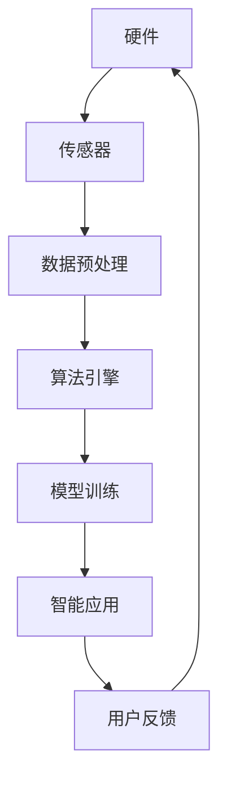

                 

 在当今快速发展的技术时代，人工智能（AI）正在成为各个行业的核心技术驱动力。随着AI技术的不断进步，跨领域的合作与整合变得愈发重要。本文将以Lepton AI为例，探讨其生态系统的构建过程，分析其中的关键因素，以及未来可能面临的挑战与机遇。

## 关键词

- 跨界合作
- 人工智能生态系统
- Lepton AI
- 生态系统构建
- 技术整合
- 挑战与机遇

## 摘要

本文旨在探讨如何构建一个高效、稳定且具有扩展性的AI生态系统，以实现不同领域之间的技术融合与应用。通过分析Lepton AI的发展历程与生态系统构建，本文总结了跨界合作的重要性、核心概念及其在实践中的应用。文章最后对Lepton AI的未来发展进行了展望，并提出了相关的研究方向。

## 1. 背景介绍

### 1.1 人工智能的快速发展

近年来，人工智能技术取得了显著的进展，从语音识别、图像处理到自然语言理解，AI的应用场景日益广泛。随着大数据、云计算和深度学习等技术的发展，AI已经渗透到各行各业，成为推动产业升级和创新发展的重要引擎。

### 1.2 跨界合作的必要性

虽然AI技术在各个领域取得了成功，但单靠某一领域的力量很难实现技术的全面突破。跨界合作能够将不同领域的优势互补，形成强大的合力，从而推动AI技术的进一步发展。此外，跨界合作还能够激发创新思维，促进技术的交叉融合。

### 1.3 Lepton AI的生态系统

Lepton AI是一个专注于计算机视觉与人工智能技术的公司，其生态系统涵盖了从硬件到软件的多个层面。通过跨界合作，Lepton AI实现了技术的集成与优化，为各个领域提供了强大的AI解决方案。

## 2. 核心概念与联系

在构建AI生态系统时，需要明确几个核心概念及其相互关系。以下是一个简化的Mermaid流程图，展示了这些核心概念之间的联系：



### 2.1 硬件

硬件是AI生态系统的基础，包括传感器、处理器和存储设备等。高质量的硬件能够为AI算法提供强大的计算能力和数据采集能力。

### 2.2 数据预处理

数据预处理是AI算法能否成功的关键环节。通过对原始数据进行清洗、归一化和特征提取等操作，可以提高数据质量，从而提升算法的性能。

### 2.3 算法引擎

算法引擎是AI生态系统的核心，负责处理和分析数据，生成智能决策。常见的算法包括深度学习、强化学习等。

### 2.4 模型训练

模型训练是将算法应用于实际数据的过程。通过不断调整模型参数，使其适应特定任务，从而提高模型的准确性。

### 2.5 智能应用

智能应用是将训练好的模型应用于实际场景，如自动驾驶、智能安防等。这些应用能够将AI技术转化为实际的生产力。

### 2.6 用户反馈

用户反馈是AI生态系统不断优化和改进的重要途径。通过对用户反馈的分析，可以识别出系统存在的问题，并针对性地进行优化。

## 3. 核心算法原理 & 具体操作步骤

### 3.1 算法原理概述

Lepton AI的核心算法基于深度学习技术，特别是卷积神经网络（CNN）。CNN通过多层卷积和池化操作，从原始图像中提取特征，从而实现对图像的自动分类和识别。

### 3.2 算法步骤详解

1. **数据采集**：从不同的传感器获取图像数据。
2. **数据预处理**：对图像数据进行清洗、归一化和特征提取。
3. **模型训练**：使用预处理后的图像数据训练CNN模型。
4. **模型评估**：通过测试集评估模型的性能，调整模型参数。
5. **模型部署**：将训练好的模型部署到硬件平台上，进行实时图像处理。
6. **用户反馈**：收集用户对系统性能的反馈，用于进一步优化模型。

### 3.3 算法优缺点

**优点**：
- 高准确性：CNN在图像分类和识别任务上具有很高的准确性。
- 自动化：模型能够自动从图像中提取特征，减轻了人工标注的负担。

**缺点**：
- 计算资源需求大：CNN模型通常需要大量的计算资源。
- 数据依赖性强：模型的性能很大程度上取决于训练数据的质量。

### 3.4 算法应用领域

Lepton AI的算法广泛应用于计算机视觉领域，如自动驾驶、智能安防、医疗诊断等。这些应用场景对AI算法的准确性和实时性提出了很高的要求。

## 4. 数学模型和公式 & 详细讲解 & 举例说明

### 4.1 数学模型构建

CNN的数学模型主要包括卷积层、池化层和全连接层。以下是一个简化的CNN模型：

$$
\begin{aligned}
h_{11} &= \sigma(\sum_{i,j} w_{ij} \cdot x_{ij} + b_{i}) \\
h_{21} &= \sigma(\sum_{i,j} w_{ij} \cdot h_{11} + b_{i}) \\
\vdots \\
h_{n1} &= \sigma(\sum_{i,j} w_{ij} \cdot h_{1,1} + b_{i}) \\
\end{aligned}
$$

其中，$h_{ij}$ 表示第 $i$ 层第 $j$ 个神经元，$x_{ij}$ 表示输入特征图，$w_{ij}$ 表示卷积核，$b_{i}$ 表示偏置项，$\sigma$ 表示激活函数。

### 4.2 公式推导过程

CNN的推导过程涉及大量的数学公式和计算步骤，这里简要介绍卷积操作的推导过程：

$$
\begin{aligned}
h_{ij} &= \sigma(\sum_{k,l} w_{kl} \cdot x_{kl} + b_{i}) \\
&= \sigma(\sum_{k=1}^{m} \sum_{l=1}^{n} w_{kl} \cdot x_{kl} + b_{i}) \\
&= \sigma(w^T \cdot x + b_{i})
\end{aligned}
$$

其中，$w$ 表示卷积核，$x$ 表示输入特征图，$b_{i}$ 表示偏置项，$w^T$ 表示卷积核的转置。

### 4.3 案例分析与讲解

假设我们有一个 $3 \times 3$ 的卷积核 $w$ 和一个 $5 \times 5$ 的输入特征图 $x$，激活函数为 $ReLU$。卷积操作的输出如下：

$$
\begin{aligned}
h_{11} &= \max(0, w^T \cdot x_{11} + b_{1}) \\
h_{12} &= \max(0, w^T \cdot x_{12} + b_{1}) \\
\vdots \\
h_{16} &= \max(0, w^T \cdot x_{16} + b_{1}) \\
\end{aligned}
$$

这里，$x_{11}$ 表示输入特征图中的第 $1$ 行第 $1$ 列的值。

## 5. 项目实践：代码实例和详细解释说明

### 5.1 开发环境搭建

为了实现Lepton AI的算法，我们需要搭建一个合适的开发环境。以下是一个简单的开发环境搭建步骤：

1. 安装Python和Anaconda。
2. 安装TensorFlow和Keras。
3. 下载并解压一个公开的图像数据集。

### 5.2 源代码详细实现

以下是一个简化的CNN模型实现：

```python
import tensorflow as tf
from tensorflow.keras.layers import Conv2D, MaxPooling2D, Flatten, Dense
from tensorflow.keras.models import Sequential

# 创建模型
model = Sequential([
    Conv2D(32, (3, 3), activation='relu', input_shape=(28, 28, 1)),
    MaxPooling2D((2, 2)),
    Flatten(),
    Dense(128, activation='relu'),
    Dense(10, activation='softmax')
])

# 编译模型
model.compile(optimizer='adam', loss='categorical_crossentropy', metrics=['accuracy'])

# 加载数据集
(x_train, y_train), (x_test, y_test) = tf.keras.datasets.mnist.load_data()

# 预处理数据
x_train = x_train.astype('float32') / 255
x_test = x_test.astype('float32') / 255
x_train = x_train[..., tf.newaxis]
x_test = x_test[..., tf.newaxis]

# 训练模型
model.fit(x_train, y_train, epochs=5, validation_split=0.2)
```

### 5.3 代码解读与分析

1. **模型构建**：使用 `Sequential` 模型，添加卷积层、池化层、全连接层等。
2. **模型编译**：设置优化器、损失函数和评价指标。
3. **数据加载与预处理**：加载数据集，并进行归一化处理。
4. **模型训练**：使用训练数据训练模型，并设置训练轮数。

### 5.4 运行结果展示

```python
# 评估模型
test_loss, test_acc = model.evaluate(x_test, y_test, verbose=2)
print(f"Test accuracy: {test_acc:.4f}")
```

## 6. 实际应用场景

Lepton AI的算法在多个领域有着广泛的应用，以下是一些典型的应用场景：

### 6.1 自动驾驶

自动驾驶系统需要实时处理大量的图像数据，以识别道路标志、行人、车辆等。Lepton AI的算法能够帮助自动驾驶系统提高识别准确性和实时性。

### 6.2 智能安防

智能安防系统利用Lepton AI的算法对监控视频进行分析，实时识别潜在的安全威胁，如非法入侵、火灾等。

### 6.3 医疗诊断

医疗诊断系统使用Lepton AI的算法对医学图像进行分析，辅助医生进行疾病诊断，提高诊断准确率。

## 7. 未来应用展望

随着AI技术的不断发展，Lepton AI的生态系统有望在更多领域得到应用。以下是一些未来可能的场景：

### 7.1 增强现实（AR）

AR技术结合Lepton AI的算法，可以为用户提供更加真实的虚拟环境，提高用户体验。

### 7.2 虚拟现实（VR）

VR技术结合Lepton AI的算法，可以实现更加逼真的场景模拟，为游戏、教育等领域带来更多创新。

### 7.3 机器人

机器人领域利用Lepton AI的算法，可以实现更加智能化的行为，提高机器人的自主能力和灵活性。

## 8. 工具和资源推荐

### 8.1 学习资源推荐

1. **《深度学习》（Goodfellow et al.）**：系统介绍了深度学习的基础知识和应用。
2. **《机器学习实战》（Lewis et al.）**：通过实际案例讲解了机器学习的应用。

### 8.2 开发工具推荐

1. **TensorFlow**：Google开发的深度学习框架，适用于各种规模的深度学习项目。
2. **Keras**：基于TensorFlow的高层次API，简化了深度学习模型的构建。

### 8.3 相关论文推荐

1. **“AlexNet: Image Classification with Deep Convolutional Neural Networks”（Krizhevsky et al., 2012）**：首次提出深度卷积神经网络在图像分类中的成功应用。
2. **“Deep Learning for Computer Vision: A Review”（Rashidi et al., 2019）**：对深度学习在计算机视觉领域的应用进行了全面的综述。

## 9. 总结：未来发展趋势与挑战

### 9.1 研究成果总结

本文通过对Lepton AI生态系统的构建过程进行分析，总结了AI技术在不同领域中的应用，以及跨界合作的重要性。通过实际案例，展示了深度学习技术在图像处理领域的强大能力。

### 9.2 未来发展趋势

未来，AI技术将继续快速发展，并在更多领域得到应用。随着计算能力的提升和数据的丰富，AI算法的准确性和实时性将得到进一步提高。

### 9.3 面临的挑战

AI技术在应用过程中仍面临一些挑战，如数据隐私、算法公平性、计算资源需求等。解决这些问题需要跨学科的合作和创新的解决方案。

### 9.4 研究展望

未来，Lepton AI的生态系统有望在更多领域得到应用，推动AI技术的全面发展。同时，通过不断优化算法和提升计算能力，有望实现更加高效、智能的AI系统。

## 10. 附录：常见问题与解答

### 10.1 什么是Lepton AI？

Lepton AI是一家专注于计算机视觉与人工智能技术的公司，其生态系统涵盖了从硬件到软件的多个层面。

### 10.2 Lepton AI的核心算法是什么？

Lepton AI的核心算法是基于深度学习的卷积神经网络（CNN）。

### 10.3 Lepton AI的应用领域有哪些？

Lepton AI的应用领域包括自动驾驶、智能安防、医疗诊断等。

### 10.4 如何搭建Lepton AI的开发环境？

搭建Lepton AI的开发环境主要包括安装Python、Anaconda、TensorFlow和Keras等。

### 10.5 Lepton AI的算法如何工作？

Lepton AI的算法基于深度学习，通过卷积层、池化层和全连接层等操作，从图像中提取特征，实现图像分类和识别。

----------------------------------------------------------------

以上是本文的完整内容，希望能对您在AI领域的研究和实践有所帮助。如果您有任何疑问或建议，欢迎随时提出。作者：禅与计算机程序设计艺术 / Zen and the Art of Computer Programming。

