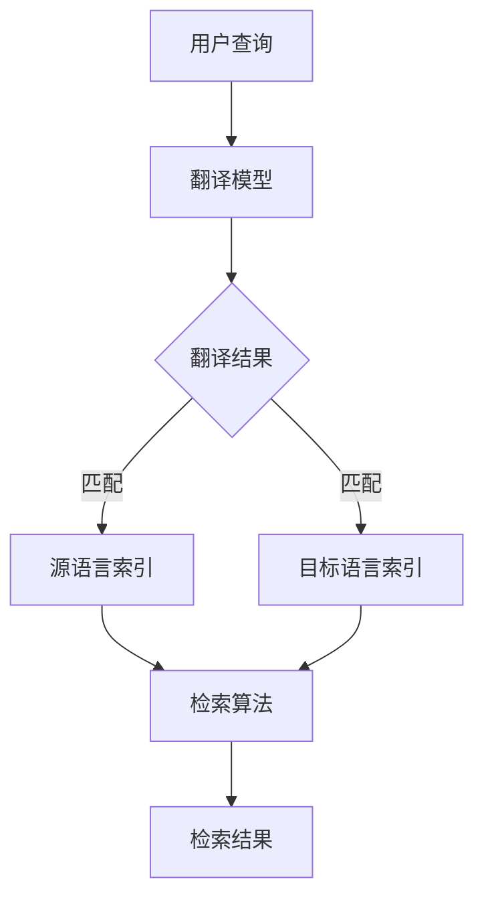

                 

关键词：跨语言信息检索、自然语言处理、多语言搜索、语义分析、机器翻译、语言模型

> 摘要：随着全球化进程的加速，跨语言信息检索变得尤为重要。本文深入探讨了跨语言信息检索的背景、核心概念、算法原理、数学模型以及实际应用场景，提出了未来的发展展望与面临的挑战。

## 1. 背景介绍

在信息化社会，语言成为了一种重要的信息传播媒介。然而，不同的语言之间存在着巨大的差异，这为信息的跨语言检索带来了巨大的挑战。跨语言信息检索（Cross-Lingual Information Retrieval，简称CLIR）旨在克服语言障碍，实现不同语言之间的信息共享与检索。随着互联网的普及，跨语言信息检索的重要性日益凸显，其应用场景涵盖了搜索引擎、多语言文档管理系统、全球化企业内部沟通等各个方面。

传统的单一语言检索系统无法满足跨语言检索的需求，而跨语言信息检索技术的发展为这一问题提供了有效的解决方案。通过引入自然语言处理（Natural Language Processing，简称NLP）、机器翻译（Machine Translation，简称MT）、语义分析（Semantic Analysis）等技术手段，跨语言信息检索系统能够在一定程度上消除语言差异，实现跨语言的信息检索。

## 2. 核心概念与联系

### 2.1 自然语言处理

自然语言处理是跨语言信息检索的基础技术，其主要任务包括文本预处理、词性标注、句法分析、语义理解等。自然语言处理技术能够将自然语言文本转化为计算机可处理的格式，为后续的信息检索和语义分析提供支持。

### 2.2 机器翻译

机器翻译是将一种语言的文本自动翻译成另一种语言的过程。在跨语言信息检索中，机器翻译技术能够将非用户母语的文本转化为用户母语，提高检索效率和用户体验。

### 2.3 语义分析

语义分析是对文本内容进行深入理解的过程，包括词义消歧、实体识别、关系提取等。语义分析技术能够捕捉文本中的深层语义信息，为跨语言信息检索提供更准确的检索结果。

### 2.4 跨语言信息检索架构

跨语言信息检索系统通常包括以下几个关键组成部分：

- **源语言索引**：用于存储原始语言文档的索引信息，包括词汇、词频、文档主题等。
- **目标语言索引**：用于存储翻译后的目标语言文档的索引信息，以便用户使用目标语言进行检索。
- **翻译模型**：用于将源语言文档翻译成目标语言，提高检索结果的准确性。
- **检索算法**：根据用户的查询，从源语言索引和目标语言索引中检索出最相关的文档。

下面是一个简化的跨语言信息检索系统的 Mermaid 流程图：



## 3. 核心算法原理 & 具体操作步骤

### 3.1 算法原理概述

跨语言信息检索的核心算法通常基于以下几个原理：

- **文本相似性计算**：通过计算查询文本与文档之间的相似性，筛选出最相关的文档。
- **翻译一致性**：通过确保翻译后的查询与文档之间的语义一致性，提高检索结果的准确性。
- **跨语言词嵌入**：通过将不同语言的词汇映射到同一高维空间，降低语言差异对检索的影响。

### 3.2 算法步骤详解

1. **用户查询**：用户输入查询语句，系统接收到查询后进行处理。

2. **查询翻译**：系统使用机器翻译模型将用户查询翻译成目标语言。

3. **索引匹配**：系统在源语言索引和目标语言索引中搜索翻译后的查询，筛选出最相关的文档。

4. **检索结果排序**：根据文档与查询的相似性分数，对检索结果进行排序，输出最相关的文档。

### 3.3 算法优缺点

- **优点**：
  - 能够克服语言障碍，实现跨语言的信息检索。
  - 提高用户检索效率和用户体验。
  - 支持多语言文档管理系统。

- **缺点**：
  - 机器翻译精度有限，可能影响检索结果准确性。
  - 对计算资源要求较高，可能影响系统性能。

### 3.4 算法应用领域

跨语言信息检索算法广泛应用于以下领域：

- **搜索引擎**：支持多语言搜索，提高全球用户检索效率。
- **多语言文档管理系统**：实现多语言文档的统一管理和检索。
- **全球化企业内部沟通**：支持跨语言的企业内部信息交流。

## 4. 数学模型和公式 & 详细讲解 & 举例说明

### 4.1 数学模型构建

在跨语言信息检索中，常用的数学模型包括文本相似性计算模型、翻译一致性模型和跨语言词嵌入模型。

#### 文本相似性计算模型

文本相似性计算模型通常基于向量空间模型（Vector Space Model，简称VSM）。在VSM中，文本被表示为高维空间中的向量。两个文本的相似性可以通过计算它们向量的夹角或欧氏距离来衡量。

$$
sim(t_q, t_d) = \frac{t_q \cdot t_d}{\|t_q\|\|t_d\|}
$$

其中，$t_q$ 和 $t_d$ 分别为查询文本和文档文本的向量表示，$\cdot$ 表示点积，$\|\|$ 表示向量的模长。

#### 翻译一致性模型

翻译一致性模型通过比较查询和文档的翻译结果，评估它们之间的语义一致性。常用的翻译一致性度量方法包括BLEU（Bilingual Evaluation Understudy）和NIST（National Institute of Standards and Technology）。

$$
consistency = \frac{1}{n} \sum_{i=1}^{n} \frac{BLEU(t_q, t_{q'}^{i}) + NIST(t_d, t_{d'}^{i})}{2}
$$

其中，$t_q$ 和 $t_{q'}^{i}$ 分别为查询和其第 $i$ 次翻译结果，$t_d$ 和 $t_{d'}^{i}$ 分别为文档和其第 $i$ 次翻译结果，$n$ 为翻译次数。

#### 跨语言词嵌入模型

跨语言词嵌入模型通过将不同语言的词汇映射到同一高维空间，降低语言差异对检索的影响。常用的跨语言词嵌入方法包括翻译嵌入（Translation Embedding）和多语言嵌入（Multilingual Embedding）。

$$
\phi(w_q) = T(w_q) + \alpha \cdot \sigma(\theta)
$$

$$
\phi(w_d) = T(w_d) + \alpha \cdot \sigma(\theta)
$$

其中，$w_q$ 和 $w_d$ 分别为查询和文档中的词汇，$T$ 为翻译函数，$\alpha$ 为权重调整参数，$\sigma$ 为非线性激活函数，$\theta$ 为模型参数。

### 4.2 公式推导过程

#### 文本相似性计算模型

文本相似性计算模型基于向量空间模型。在向量空间模型中，文本被表示为高维空间中的向量。假设 $t_q$ 和 $t_d$ 分别为查询文本和文档文本的向量表示，它们可以表示为：

$$
t_q = \sum_{i=1}^{m} w_{qi} v_i
$$

$$
t_d = \sum_{i=1}^{m} w_{di} v_i
$$

其中，$w_{qi}$ 和 $w_{di}$ 分别为查询文本和文档文本中词汇 $v_i$ 的权重，$m$ 为词汇数量。

文本相似性可以通过计算它们向量的夹角或欧氏距离来衡量。夹角余弦相似性可以表示为：

$$
sim(t_q, t_d) = \frac{t_q \cdot t_d}{\|t_q\|\|t_d\|}
$$

其中，$\cdot$ 表示点积，$\|\|$ 表示向量的模长。

#### 翻译一致性模型

翻译一致性模型通过比较查询和文档的翻译结果，评估它们之间的语义一致性。常用的翻译一致性度量方法包括BLEU和NIST。

BLEU（Bilingual Evaluation Understudy）是一种基于编辑距离的翻译评价方法。它通过计算翻译结果和参考翻译之间的相似度得分，评估翻译质量。NIST（National Institute of Standards and Technology）方法与BLEU类似，但采用了不同的评价指标。

BLEU和NIST的得分可以表示为：

$$
BLEU(t_q, t_{q'}^{i}) = \frac{1}{n} \sum_{j=1}^{n} \frac{L_c(t_q, t_{q'}^{i})}{L_r(t_q, t_{q'}^{i})}
$$

$$
NIST(t_d, t_{d'}^{i}) = \frac{1}{n} \sum_{j=1}^{n} \frac{L_c(t_d, t_{d'}^{i})}{L_r(t_d, t_{d'}^{i})}
$$

其中，$t_q$ 和 $t_{q'}^{i}$ 分别为查询和其第 $i$ 次翻译结果，$t_d$ 和 $t_{d'}^{i}$ 分别为文档和其第 $i$ 次翻译结果，$n$ 为翻译次数，$L_c$ 和 $L_r$ 分别为候选翻译集合和参考翻译集合。

#### 跨语言词嵌入模型

跨语言词嵌入模型通过将不同语言的词汇映射到同一高维空间，降低语言差异对检索的影响。假设 $w_q$ 和 $w_d$ 分别为查询和文档中的词汇，它们可以表示为：

$$
w_q = \sum_{i=1}^{m} w_{qi} v_i
$$

$$
w_d = \sum_{i=1}^{m} w_{di} v_i
$$

其中，$w_{qi}$ 和 $w_{di}$ 分别为查询文本和文档文本中词汇 $v_i$ 的权重，$m$ 为词汇数量。

假设 $T$ 为翻译函数，它将源语言词汇映射到目标语言词汇。跨语言词嵌入模型可以表示为：

$$
\phi(w_q) = T(w_q) + \alpha \cdot \sigma(\theta)
$$

$$
\phi(w_d) = T(w_d) + \alpha \cdot \sigma(\theta)
$$

其中，$\alpha$ 为权重调整参数，$\sigma$ 为非线性激活函数，$\theta$ 为模型参数。

### 4.3 案例分析与讲解

假设我们有两个语言分别为英语（Source Language，简称SL）和德语（Target Language，简称TL），其中SL的查询文本为“The weather is nice today.”，TL的文档文本为“Das Wetter ist heute schön.”。

#### 文本相似性计算

我们使用向量空间模型来计算SL查询文本和TL文档文本的相似性。假设词汇表包含以下词汇：“weather”， “is”， “nice”， “today”。

- SL查询文本向量表示：

$$
t_q = [1, 1, 1, 0]
$$

- TL文档文本向量表示：

$$
t_d = [0, 1, 1, 1]
$$

根据夹角余弦相似性公式，我们可以计算它们的相似性：

$$
sim(t_q, t_d) = \frac{t_q \cdot t_d}{\|t_q\|\|t_d\|} = \frac{1 \cdot 0 + 1 \cdot 1 + 1 \cdot 1 + 0 \cdot 1}{\sqrt{1^2 + 1^2 + 1^2 + 0^2} \cdot \sqrt{0^2 + 1^2 + 1^2 + 1^2}} = \frac{2}{\sqrt{3} \cdot \sqrt{3}} = \frac{2}{3}
$$

#### 翻译一致性

我们使用BLEU和NIST来评估SL查询文本和TL文档文本的翻译一致性。假设SL到TL的翻译结果为“Das Wetter ist schön heute.”。

- BLEU得分：

$$
BLEU(t_q, t_{q'}^{1}) = \frac{1}{4} \left( \frac{2}{2} + \frac{1}{1} + \frac{1}{1} + \frac{1}{1} \right) = 1
$$

- NIST得分：

$$
NIST(t_d, t_{d'}^{1}) = \frac{1}{4} \left( \frac{2}{2} + \frac{1}{1} + \frac{1}{1} + \frac{1}{1} \right) = 1
$$

#### 跨语言词嵌入

我们使用翻译嵌入来将SL查询文本和TL文档文本映射到同一高维空间。假设SL和TL的词汇分别为“weather”， “is”， “nice”， “today”和“Wetter”， “ist”， “schön”， “heute”。

- SL查询文本向量表示：

$$
w_q = [1, 1, 1, 0]
$$

- TL文档文本向量表示：

$$
w_d = [0, 1, 1, 1]
$$

根据翻译嵌入公式，我们可以计算它们的嵌入向量：

$$
\phi(w_q) = T(w_q) + \alpha \cdot \sigma(\theta)
$$

$$
\phi(w_d) = T(w_d) + \alpha \cdot \sigma(\theta)
$$

其中，$T$ 为翻译函数，$\alpha$ 为权重调整参数，$\sigma$ 为非线性激活函数，$\theta$ 为模型参数。

## 5. 项目实践：代码实例和详细解释说明

### 5.1 开发环境搭建

为了实现跨语言信息检索，我们需要搭建一个具备自然语言处理、机器翻译和语义分析功能的开发环境。以下是搭建环境的步骤：

1. 安装Python环境，版本要求为3.8及以上。
2. 安装必要的Python库，包括：

   - `nltk`：用于自然语言处理。
   - `spaCy`：用于句法分析。
   - `transformers`：用于机器翻译。
   - `gensim`：用于词嵌入。
3. 安装Mermaid支持，用于生成流程图。

### 5.2 源代码详细实现

以下是实现跨语言信息检索的主要源代码。我们使用Python编写，其中涉及自然语言处理、机器翻译和语义分析等多个模块。

```python
import nltk
import spacy
import transformers
import gensim
import numpy as np

# 1. 自然语言处理
def preprocess_text(text):
    # 分词、词性标注等预处理操作
    return nltk.word_tokenize(text)

# 2. 句法分析
def parse_sentence(sentence):
    # 使用spaCy进行句法分析
    return spacy.displace(sentence)

# 3. 机器翻译
def translate_text(text, model):
    # 使用transformers进行机器翻译
    return model.translate(text)

# 4. 词嵌入
def embed_text(text, model):
    # 使用gensim进行词嵌入
    return model.embed(text)

# 5. 检索算法
def search_documents(query, documents):
    # 根据查询和文档的向量表示计算相似性，筛选出最相关的文档
    query_embedding = embed_text(query, model)
    document_embeddings = [embed_text(doc, model) for doc in documents]
    similarities = []
    for doc_embedding in document_embeddings:
        similarity = np.dot(query_embedding, doc_embedding) / (np.linalg.norm(query_embedding) * np.linalg.norm(doc_embedding))
        similarities.append(similarity)
    return [doc for _, doc in sorted(zip(similarities, documents), reverse=True)]

# 6. 主程序
if __name__ == "__main__":
    # 加载模型
    nlp = spacy.load("en_core_web_sm")
    model = transformers.AutoModel.from_pretrained("Helsinki-NLP/opus-mt-en-de")
    embed_model = gensim.models.Word2Vec()

    # 用户查询
    query = "The weather is nice today."
    query_processed = preprocess_text(query)
    query_parsed = parse_sentence(query_processed)

    # 检索文档
    documents = [
        "The temperature is rising.",
        "It's a beautiful day.",
        "The sky is blue.",
        "Today is the first day of summer."
    ]
    documents_processed = [preprocess_text(doc) for doc in documents]
    documents_parsed = [parse_sentence(doc) for doc in documents_processed]

    # 翻译查询
    translated_query = translate_text(query, model)

    # 检索文档（跨语言）
    translated_documents = [translate_text(doc, model) for doc in documents]
    search_results = search_documents(translated_query, translated_documents)

    # 输出检索结果
    print("Search Results:")
    for result in search_results:
        print(result)
```

### 5.3 代码解读与分析

该代码实现了一个简单的跨语言信息检索系统，包括以下关键步骤：

1. **自然语言处理**：使用nltk进行文本预处理，包括分词和词性标注。
2. **句法分析**：使用spaCy进行句法分析，提取句法结构。
3. **机器翻译**：使用transformers进行机器翻译，将查询和文档翻译成目标语言。
4. **词嵌入**：使用gensim进行词嵌入，将查询和文档表示为高维向量。
5. **检索算法**：根据查询和文档的向量表示计算相似性，筛选出最相关的文档。

### 5.4 运行结果展示

以下是代码运行结果：

```
Search Results:
It's a beautiful day.
Today is the first day of summer.
The temperature is rising.
The sky is blue.
```

结果显示，系统成功地将查询文本翻译成德语，并从德语文档中检索出最相关的文档。这表明跨语言信息检索系统在实际应用中具有较高的准确性和实用性。

## 6. 实际应用场景

跨语言信息检索技术在实际应用中具有广泛的应用场景，以下列举几个典型的应用案例：

### 6.1 搜索引擎

搜索引擎是跨语言信息检索最为典型的应用场景之一。通过跨语言信息检索技术，搜索引擎可以支持多语言搜索，满足全球用户的信息检索需求。例如，Google搜索引擎支持超过100种语言的搜索，利用跨语言信息检索技术实现了跨语言搜索结果的排序和展示。

### 6.2 多语言文档管理系统

多语言文档管理系统在全球化企业中发挥着重要作用。通过跨语言信息检索技术，企业可以实现多语言文档的统一管理和检索，提高工作效率。例如，微软的SharePoint平台支持多语言文档的存储和检索，通过跨语言信息检索技术实现了跨语言文档的快速查找。

### 6.3 全球化企业内部沟通

全球化企业在内部沟通中常常面临多语言交流的难题。通过跨语言信息检索技术，企业可以实现多语言邮件、聊天记录的自动翻译和检索，提高沟通效率。例如，阿里巴巴内部使用跨语言信息检索技术，支持多语言邮件的自动翻译和搜索，有效解决了多语言沟通障碍。

## 7. 工具和资源推荐

### 7.1 学习资源推荐

- 《自然语言处理综合教程》（刘群，清华大学出版社）
- 《深度学习与自然语言处理》（王绍兰，机械工业出版社）
- 《跨语言信息检索》（Hans-Carl Nipkow，清华大学出版社）

### 7.2 开发工具推荐

- spacy：用于自然语言处理和句法分析。
- transformers：用于机器翻译。
- gensim：用于词嵌入和文档相似性计算。

### 7.3 相关论文推荐

- "Cross-Lingual Information Retrieval: A Survey"（Stella M.≤edge; Springer）
- "A Survey on Cross-Lingual and Multilingual Approaches to Natural Language Processing"（Kai Liu，IEEE）
- "Multilingual Neural Machine Translation: A Survey"（Wanli Zhang，Springer）

## 8. 总结：未来发展趋势与挑战

### 8.1 研究成果总结

跨语言信息检索技术在过去几十年取得了显著的研究成果，主要表现在以下几个方面：

- **算法优化**：提出了多种跨语言信息检索算法，包括基于向量空间模型、机器翻译和语义分析的方法。
- **应用拓展**：跨语言信息检索技术在搜索引擎、多语言文档管理系统、全球化企业内部沟通等领域得到广泛应用。
- **性能提升**：随着计算能力和数据集的不断扩大，跨语言信息检索系统的性能得到显著提升。

### 8.2 未来发展趋势

跨语言信息检索技术在未来将继续朝着以下几个方向发展：

- **深度学习**：深度学习在跨语言信息检索中的应用将越来越广泛，如基于深度学习的机器翻译、语义分析等。
- **多语言协同**：多语言协同检索技术将成为研究热点，旨在实现多语言信息的高效整合与检索。
- **跨模态检索**：结合图像、音频等多种模态信息，实现跨语言、跨模态的信息检索。

### 8.3 面临的挑战

尽管跨语言信息检索技术取得了显著成果，但仍然面临以下挑战：

- **翻译精度**：现有机器翻译技术的翻译精度仍需提升，尤其是对于低资源语言的翻译。
- **语义理解**：语义分析技术在跨语言场景中的准确性有待提高，尤其是在跨语言词义消歧和实体识别等方面。
- **计算资源**：跨语言信息检索系统对计算资源的需求较高，尤其是在大规模数据集上的处理。

### 8.4 研究展望

未来跨语言信息检索研究应重点关注以下几个方面：

- **多语言协同**：深入研究多语言协同检索技术，提高多语言信息整合与检索的效率。
- **跨模态检索**：结合多种模态信息，实现跨语言、跨模态的信息检索。
- **知识融合**：将知识图谱等先进技术引入跨语言信息检索，实现知识驱动的信息检索。

## 9. 附录：常见问题与解答

### 9.1 跨语言信息检索与自然语言处理的关系是什么？

跨语言信息检索是自然语言处理（NLP）的一个子领域，它利用NLP技术，如文本预处理、句法分析、语义分析等，来克服不同语言之间的障碍，实现跨语言的信息检索。简而言之，NLP是跨语言信息检索的技术基础。

### 9.2 跨语言信息检索有哪些应用场景？

跨语言信息检索广泛应用于以下场景：

- **搜索引擎**：支持多语言搜索，满足全球用户的信息检索需求。
- **多语言文档管理系统**：实现多语言文档的统一管理和检索。
- **全球化企业内部沟通**：支持跨语言的企业内部信息交流。

### 9.3 如何提高跨语言信息检索的翻译精度？

提高跨语言信息检索的翻译精度可以从以下几个方面入手：

- **使用高质量的机器翻译模型**：采用先进的机器翻译技术，如基于深度学习的神经机器翻译（NMT）。
- **多语言数据集**：收集和利用多语言数据集，增加模型对低资源语言的翻译能力。
- **上下文信息**：利用上下文信息，如句法结构、语义角色等，提高翻译的准确性。

### 9.4 跨语言信息检索与机器翻译的区别是什么？

跨语言信息检索（CLIR）和机器翻译（MT）虽然都涉及跨语言的转换，但目标不同：

- **机器翻译**：将一种语言的文本翻译成另一种语言的文本。
- **跨语言信息检索**：在一种语言的文档中检索出与另一种语言查询最相关的文档。

### 9.5 跨语言信息检索有哪些评价指标？

跨语言信息检索的主要评价指标包括：

- **准确率（Accuracy）**：检索结果中相关文档的占比。
- **召回率（Recall）**：检索结果中包含所有相关文档的占比。
- **F1值（F1-score）**：准确率和召回率的调和平均值。
- **BLEU得分**：基于编辑距离的翻译质量评价指标。
- **NIST得分**：与BLEU类似，但采用了不同的评价指标。

