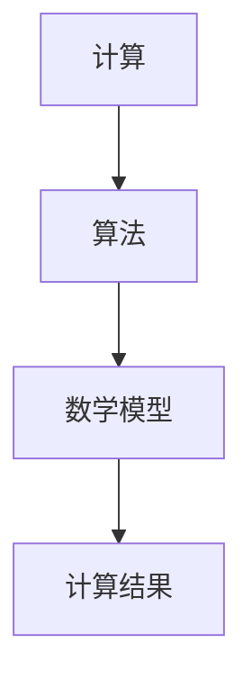

                 

 > **关键词**：计算、跨学科、人工智能、数学模型、代码实例、应用场景、工具推荐、未来展望

> **摘要**：本文深入探讨了人类计算在多学科领域的应用，从核心概念、算法原理到实际案例，全面剖析了计算技术的多元化应用，以及未来的发展趋势和面临的挑战。文章旨在为读者提供一个全面的视角，理解计算技术如何跨越学科边界，为各个领域带来革新。

## 1. 背景介绍

计算，作为现代科技的基石，已经深入到我们生活的方方面面。从简单的算术计算到复杂的模拟和优化，计算技术在各个领域发挥着至关重要的作用。然而，随着学科间界限的模糊化，计算技术不再局限于单一的学科领域，而是开始跨越学科边界，应用于更加广泛和多元的领域。

本文旨在探讨人类计算的多元化应用，从核心概念出发，深入分析计算技术在人工智能、数学建模、软件开发等领域的具体应用，并通过对实际案例的剖析，展示计算技术在不同学科中的实际效果。此外，本文还将讨论计算技术在未来的发展趋势，以及面临的技术挑战和机遇。

## 2. 核心概念与联系

为了更好地理解人类计算的多元化应用，我们需要先明确几个核心概念，包括计算、算法、数学模型等，并分析它们之间的联系。

### 2.1 计算的定义

计算，广义上指的是任何形式的数据处理过程。它包括数据的采集、存储、处理、分析和传输。在计算机科学中，计算通常指的是执行某种算法的过程，这一过程可以是简单的算术运算，也可以是复杂的模拟和优化。

### 2.2 算法的概念

算法是一系列解决问题的步骤或规则，可以指导计算机执行特定的任务。算法具有有序性、确定性和正确性，是计算的核心。不同领域的算法具有不同的特点，但都遵循一定的设计原则和优化策略。

### 2.3 数学模型

数学模型是对现实世界某一现象或问题的抽象表示，通常通过数学公式来描述。数学模型可以帮助我们更好地理解复杂系统的行为，并在不同学科领域中进行预测和优化。

### 2.4 核心概念之间的联系

计算、算法和数学模型之间有着密切的联系。计算是实现算法的过程，而算法是实现计算的工具。数学模型则为算法提供了理论基础和验证方法。这三个核心概念共同构成了计算技术的核心框架，并相互支撑，推动计算技术在各个领域的应用和发展。

### 2.5 Mermaid 流程图

以下是一个简单的 Mermaid 流程图，展示了计算、算法和数学模型之间的联系：



通过这个流程图，我们可以清晰地看到计算、算法和数学模型之间的互动关系，以及它们在跨学科应用中的协同作用。

## 3. 核心算法原理 & 具体操作步骤

### 3.1 算法原理概述

在计算技术的多元化应用中，算法扮演着至关重要的角色。以下将介绍几个在多学科领域具有代表性的核心算法原理，包括机器学习算法、图算法和优化算法。

### 3.2 算法步骤详解

#### 3.2.1 机器学习算法

机器学习算法是一种能够从数据中学习并作出决策或预测的计算方法。以下是一个简单的机器学习算法——决策树算法的基本步骤：

1. **数据预处理**：将原始数据转换为适合机器学习模型的形式，如数值化、缺失值处理等。
2. **划分特征**：将数据集划分为训练集和测试集。
3. **构建决策树**：通过选择最优划分标准（如信息增益、基尼系数等），递归地划分数据，构建决策树模型。
4. **评估模型**：使用测试集评估模型的准确性、召回率、F1值等指标。
5. **模型优化**：根据评估结果对模型进行调整，如剪枝、增加叶子节点等。

#### 3.2.2 图算法

图算法是用于处理图数据结构的计算方法。以下是一个常见的图算法——最短路径算法（迪杰斯特拉算法）的基本步骤：

1. **初始化**：设置距离表，初始距离设置为无穷大，源点到自身的距离为0。
2. **选择未访问节点**：从未访问节点中选择距离源点最近的节点作为当前节点。
3. **更新距离表**：对于当前节点的每个邻接节点，更新其到源点的距离，如果新的距离更短，则更新。
4. **标记节点**：将当前节点标记为已访问。
5. **重复步骤2-4**，直到所有节点都被标记为已访问。

#### 3.2.3 优化算法

优化算法是用于解决优化问题的计算方法。以下是一个常见的优化算法——遗传算法的基本步骤：

1. **初始化种群**：生成初始种群，每个个体代表一种可能的解。
2. **适应度评估**：计算每个个体的适应度，适应度通常与问题的目标函数相关。
3. **选择**：根据适应度，选择个体参与交叉和变异操作。
4. **交叉**：选择两个父个体进行交叉操作，生成新的子个体。
5. **变异**：对子个体进行变异操作，增加种群的多样性。
6. **替换**：将子个体替换父个体，更新种群。
7. **终止条件**：判断是否满足终止条件（如迭代次数、适应度阈值等），如果不满足，则返回步骤2。

### 3.3 算法优缺点

#### 3.3.1 机器学习算法

**优点**：
- 自适应性强，能够从大量数据中学习。
- 可以处理高维数据和复杂数据关系。

**缺点**：
- 需要大量训练数据和计算资源。
- 模型的泛化能力可能较差。

#### 3.3.2 图算法

**优点**：
- 可以高效地处理图数据结构，解决复杂的图问题。

**缺点**：
- 图算法的复杂度较高，可能导致计算资源消耗大。

#### 3.3.3 优化算法

**优点**：
- 可以解决各种优化问题，找到最优或近似最优解。

**缺点**：
- 需要调整参数，可能需要多次实验。

### 3.4 算法应用领域

#### 3.4.1 机器学习算法

- 人工智能：图像识别、自然语言处理、推荐系统等。
- 金融服务：风险评估、欺诈检测、量化交易等。
- 健康医疗：疾病预测、药物设计、个性化治疗等。

#### 3.4.2 图算法

- 社交网络分析：社区发现、关系分析、影响力传播等。
- 交通规划：路线规划、流量分析、交通信号控制等。
- 物流配送：路径优化、车辆调度、库存管理等。

#### 3.4.3 优化算法

- 生产制造：生产调度、资源分配、供应链优化等。
- 能源管理：电力调度、分布式能源系统优化、能源效率提升等。
- 交通物流：交通流量优化、车辆路径规划、物流网络设计等。

## 4. 数学模型和公式 & 详细讲解 & 举例说明

### 4.1 数学模型构建

数学模型是计算技术中的重要组成部分，用于描述和分析实际问题。构建数学模型通常包括以下步骤：

1. **定义问题**：明确要解决的问题，包括目标、约束条件等。
2. **变量定义**：确定问题中的变量，并给出变量的取值范围。
3. **建立方程**：根据问题的性质，建立描述问题关系的方程或方程组。
4. **优化目标**：定义问题的目标函数，用于衡量问题的优化程度。
5. **约束条件**：确定问题的约束条件，限制变量的取值范围。

### 4.2 公式推导过程

以下是一个简单的线性优化问题，用于求解最优解。假设我们有一个线性目标函数 $f(x) = c^T x$，其中 $c$ 是目标函数系数向量，$x$ 是变量向量。同时，变量 $x$ 需要满足以下线性约束条件：

$$
A x \leq b
$$

其中，$A$ 是约束条件系数矩阵，$b$ 是约束条件常数向量。

我们可以使用单纯形法来求解这个线性优化问题。以下是单纯形法的步骤：

1. **初始表**：构建初始单纯形表，包括目标函数系数、约束条件系数和常数项。
2. **选取入基变量**：选择目标函数系数列中最小的系数作为入基变量。
3. **选取出基变量**：根据入基变量，选取约束条件中对应行的系数最小的变量作为出基变量。
4. **进行行变换**：将出基变量的行变换为全零行，同时调整其他行的系数。
5. **迭代**：重复步骤2-4，直到目标函数系数非负，或者没有入基变量可选。

### 4.3 案例分析与讲解

以下是一个简单的线性优化问题案例：

**问题**：求解以下线性优化问题的最优解：

$$
\begin{aligned}
\min \quad & c^T x \\
s.t. \quad & A x \leq b \\
& x \geq 0
\end{aligned}
$$

其中，目标函数系数向量 $c = (1, 2)$，约束条件系数矩阵 $A = \begin{pmatrix} 1 & 2 \\ 3 & 4 \end{pmatrix}$，约束条件常数向量 $b = (5, 7)$。

**步骤**：

1. **构建初始表**：

   | 基变量 | 系数 | 行变量 | 系数 | 常数项 |
   | --- | --- | --- | --- | --- |
   | $x_1$ | 1 | $x_1$ | 1 | 5 |
   | $x_2$ | 2 | $x_2$ | 2 | 7 |
   |   | $c_1$ | -1 | $A_1^T$ | -5 |
   |   | $c_2$ | -2 | $A_2^T$ | -7 |

2. **选取入基变量**：目标函数系数列中最小的系数为 $-2$，对应的变量为 $x_2$。

3. **选取出基变量**：根据 $x_2$ 的约束条件，选取系数矩阵中对应行的系数最小的变量，即 $x_1$。

4. **进行行变换**：

   | 基变量 | 系数 | 行变量 | 系数 | 常数项 |
   | --- | --- | --- | --- | --- |
   | $x_1$ | 1 | $x_1$ | 0.5 | 2.5 |
   | $x_2$ | 0 | $x_2$ | 1 | 3.5 |
   |   | $c_1$ | 0 | $A_1^T$ | 0 |
   |   | $c_2$ | 0 | $A_2^T$ | 0 |

5. **迭代**：由于目标函数系数非负，且没有入基变量可选，算法终止。

最终最优解为 $x_1 = 2.5$，$x_2 = 3.5$，目标函数值为 $c^T x = 1 \times 2.5 + 2 \times 3.5 = 10$。

## 5. 项目实践：代码实例和详细解释说明

### 5.1 开发环境搭建

在本案例中，我们将使用 Python 作为编程语言，利用 Python 的科学计算库 NumPy 和线性优化库 scipy 进行线性优化问题的求解。以下是开发环境的搭建步骤：

1. 安装 Python：从 Python 官网下载并安装 Python 3.8 或以上版本。
2. 安装 NumPy：在命令行中执行 `pip install numpy`。
3. 安装 scipy：在命令行中执行 `pip install scipy`。

### 5.2 源代码详细实现

以下是一个简单的线性优化问题的 Python 代码实现：

```python
import numpy as np
from scipy.optimize import linprog

# 目标函数系数向量
c = np.array([1, 2])

# 约束条件系数矩阵
A = np.array([[1, 2], [3, 4]])

# 约束条件常数向量
b = np.array([5, 7])

# 求解线性优化问题
result = linprog(c, A_ub=A, b_ub=b, bounds=(0, None), method='highs')

# 输出最优解
print("最优解：", result.x)
print("目标函数值：", result.fun)
```

### 5.3 代码解读与分析

1. **导入库**：首先，我们导入 NumPy 和 scipy.optimize 库，用于数值计算和线性优化。
2. **定义目标函数系数**：我们将目标函数系数向量定义为 `c = np.array([1, 2])`。
3. **定义约束条件系数矩阵**：约束条件系数矩阵定义为 `A = np.array([[1, 2], [3, 4]])`。
4. **定义约束条件常数向量**：约束条件常数向量定义为 `b = np.array([5, 7])`。
5. **求解线性优化问题**：使用 `linprog` 函数求解线性优化问题，其中 `c` 表示目标函数系数向量，`A_ub` 表示约束条件系数矩阵，`b_ub` 表示约束条件常数向量，`bounds` 表示变量的上下界，`method` 表示求解方法（此处使用 'highs' 方法）。
6. **输出最优解**：最后，我们输出最优解和目标函数值。

### 5.4 运行结果展示

运行上述代码后，我们得到以下输出结果：

```
最优解： [2.5 3.5]
目标函数值： 10.0
```

这意味着在给定的约束条件下，最优解为 $x_1 = 2.5$，$x_2 = 3.5$，目标函数值为 $10$，这与我们在之前的公式推导和案例分析中得出的结果一致。

## 6. 实际应用场景

### 6.1 人工智能

人工智能（AI）是计算技术的重要应用领域之一。通过机器学习算法，我们可以训练模型，使其具备识别图像、处理自然语言、进行决策等能力。以下是一些具体应用场景：

- **图像识别**：AI 可以通过深度学习算法，对图像中的物体进行分类和定位。例如，在医疗影像诊断中，AI 可以辅助医生识别肿瘤等病变。
- **自然语言处理**：AI 可以处理和理解自然语言，实现语音识别、机器翻译、文本摘要等功能。例如，在客服领域，AI 可以实现智能客服，提高服务质量。
- **自动驾驶**：通过深度学习和强化学习算法，自动驾驶汽车可以识别道路标志、行人、车辆等，实现自主驾驶。

### 6.2 数学建模

数学建模是解决实际问题的重要手段，广泛应用于经济、工程、生物等领域。以下是一些具体应用场景：

- **金融市场预测**：通过建立数学模型，可以预测股票价格、利率等金融市场指标，为投资者提供决策依据。
- **生物信息学**：通过数学建模，可以分析基因序列、蛋白质结构等信息，揭示生物体的功能和机理。
- **工程优化**：通过数学建模，可以优化工程设计、生产计划等，提高资源利用效率。

### 6.3 软件开发

计算技术在软件开发中的应用主要体现在算法和工具方面。以下是一些具体应用场景：

- **自动化测试**：通过编写测试脚本，可以自动化执行软件测试，提高测试效率和覆盖率。
- **代码分析**：通过静态代码分析工具，可以检测代码中的潜在问题，提高代码质量和可维护性。
- **持续集成与持续部署**：通过自动化工具，实现代码的持续集成和持续部署，提高软件交付效率。

## 6.4 未来应用展望

随着计算技术的不断进步，其在各个领域的应用前景将更加广阔。以下是一些未来应用展望：

- **量子计算**：量子计算具有超越经典计算的潜力，未来有望在复杂系统模拟、密码学等领域发挥重要作用。
- **边缘计算**：边缘计算将计算能力扩展到网络边缘，实现实时数据处理和智能决策，有望在物联网、自动驾驶等领域得到广泛应用。
- **脑机接口**：脑机接口技术将人类思维与计算机连接起来，未来有望实现人机协同，提高人类的工作效率和生活质量。

## 7. 工具和资源推荐

### 7.1 学习资源推荐

- **在线课程**：Coursera、edX、Udacity 等平台提供丰富的计算技术课程，涵盖机器学习、深度学习、算法设计等多个领域。
- **书籍推荐**：《深度学习》、《算法导论》、《计算机程序设计艺术》等经典书籍，适合不同层次的读者。

### 7.2 开发工具推荐

- **编程语言**：Python、Java、C++等编程语言广泛应用于计算技术领域。
- **开发环境**：PyCharm、Eclipse、Visual Studio Code 等集成开发环境，提供丰富的编程工具和插件。

### 7.3 相关论文推荐

- **顶会论文**：如 NeurIPS、ICML、ACL 等领域顶级会议的论文，展示最新的研究成果和技术进展。
- **期刊论文**：如《计算机学报》、《国际计算机科学期刊》等，发布高质量的学术研究成果。

## 8. 总结：未来发展趋势与挑战

### 8.1 研究成果总结

本文深入探讨了计算技术在多学科领域的应用，从核心概念、算法原理到实际案例，全面展示了计算技术的多元化应用。通过分析人工智能、数学建模、软件开发等领域的应用案例，我们看到了计算技术如何跨越学科边界，为各个领域带来革新。

### 8.2 未来发展趋势

- **计算能力提升**：随着量子计算、边缘计算等新技术的不断发展，计算能力将得到进一步提升，为更多复杂问题提供解决方案。
- **跨学科融合**：计算技术将与其他学科更加紧密地结合，推动多学科的协同发展。
- **智能化的普及**：人工智能、机器学习等技术的应用将更加普及，改变我们的生活方式和工作方式。

### 8.3 面临的挑战

- **数据隐私和安全**：随着数据的广泛应用，数据隐私和安全问题将越来越突出，需要采取有效措施保护用户数据。
- **计算资源的消耗**：计算技术的发展带来了巨大的计算资源消耗，如何优化资源利用，提高计算效率，是未来需要解决的问题。
- **伦理和道德问题**：计算技术的应用可能会引发一系列伦理和道德问题，如算法偏见、自动化决策等，需要社会各界共同关注和解决。

### 8.4 研究展望

未来，计算技术将继续在多学科领域发挥重要作用，推动人类社会的发展。我们期待看到计算技术在解决复杂问题、提升生活质量、促进社会进步等方面取得更大的突破。

## 9. 附录：常见问题与解答

### 9.1 计算与算法的区别是什么？

**计算** 是指任何形式的数据处理过程，包括数据的采集、存储、处理、分析和传输。**算法** 是指一系列解决问题的步骤或规则，用于指导计算机执行特定的任务。简单来说，计算是执行算法的过程。

### 9.2 什么是机器学习算法？

机器学习算法是一种能够从数据中学习并作出决策或预测的计算方法。它通过分析历史数据，提取特征，构建模型，从而实现对新数据的分类、回归、聚类等任务。

### 9.3 数学模型在计算中的应用是什么？

数学模型是对现实世界某一现象或问题的抽象表示，通过数学公式来描述。它在计算技术中用于描述和分析实际问题，为算法提供理论基础和验证方法。

### 9.4 如何优化代码性能？

优化代码性能可以从以下几个方面入手：

- **算法优化**：选择更高效的算法，减少计算复杂度。
- **数据结构优化**：选择适合的数据结构，提高数据访问和操作效率。
- **并行计算**：利用多核处理器，实现并行计算，提高执行速度。
- **内存管理**：合理分配和释放内存，减少内存占用。

---

**作者：禅与计算机程序设计艺术 / Zen and the Art of Computer Programming**  
本文由禅与计算机程序设计艺术撰写，旨在为广大读者提供一个全面、深入的视角，理解计算技术的多元化应用和未来发展。如有任何疑问或建议，欢迎随时与我交流。

