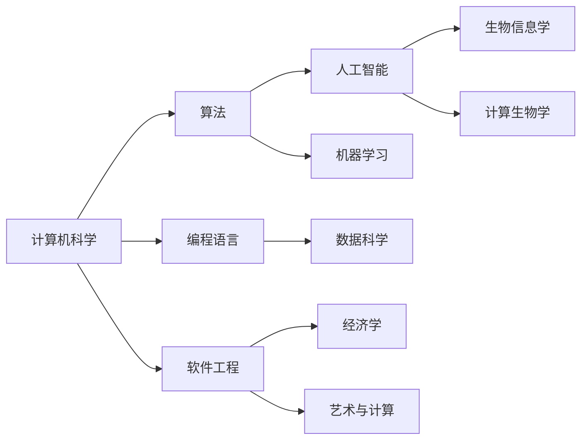

                 

关键字：计算，应用，跨学科，多元化，算法，模型，编程，技术发展

> 摘要：本文旨在探讨人类计算技术的多元化应用，如何跨越不同学科领域的边界，为各个领域带来创新与变革。通过剖析核心算法原理、数学模型构建，并结合实际项目实践，本文将为读者呈现计算技术在现实世界中的广泛应用及其未来发展前景。

## 1. 背景介绍

人类计算技术起源于20世纪中叶，随着计算机科学的快速发展，计算技术逐渐成为推动社会进步的关键力量。然而，计算技术的应用不仅仅局限于计算机科学领域，它正在跨越各种学科边界，对生物学、物理学、经济学、艺术等多个领域产生深远影响。这种跨学科的应用，不仅拓宽了计算技术的应用范围，也为各领域的研究带来了新的方法与视角。

本文将重点关注以下内容：

- 计算技术的核心概念与联系
- 核心算法原理及具体操作步骤
- 数学模型及其应用
- 实际项目实践与案例分析
- 计算技术在各个领域的应用场景
- 未来应用展望与挑战

## 2. 核心概念与联系

为了更好地理解计算技术在跨学科领域的应用，我们需要首先明确几个核心概念，并探讨它们之间的联系。

### 2.1 计算机科学的基本概念

计算机科学是一门研究计算机系统原理、算法设计、数据结构、编程语言、软件工程等方面的学科。其核心概念包括算法、数据结构、编程语言、操作系统、计算机网络等。算法是计算机科学的核心，它是一系列解决问题的步骤，用于处理数据并产生预期结果。

### 2.2 人工智能与机器学习

人工智能（AI）是计算机科学的一个分支，它致力于开发能够模拟、延伸和扩展人类智能的理论、方法、技术和应用系统。机器学习是人工智能的重要分支，它通过构建能够自主学习、优化和改进算法的模型，实现人工智能的自动化。

### 2.3 生物信息学与计算生物学

生物信息学是研究生物信息及其相关数据处理的学科，它结合生物学、计算机科学和信息学，通过计算方法解析生物数据，为生物学研究提供新的视角和方法。计算生物学则利用计算机技术和算法来研究生物系统及其相互作用。

### 2.4 经济学与数据科学

数据科学是研究如何从大量数据中提取有价值信息的学科，它结合了统计学、机器学习、数据库系统等多个领域。在经济学领域，数据科学提供了强大的分析工具，帮助经济学家理解经济现象、预测市场趋势。

### 2.5 艺术与计算

计算艺术是一门结合计算机科学和艺术创作的学科，它利用计算机技术创作音乐、绘画、动画等多种艺术形式。计算艺术不仅丰富了艺术创作手段，也为艺术家提供了新的表现方式。

### 2.6 Mermaid 流程图

以下是核心概念之间的联系，使用 Mermaid 流程图表示：



## 3. 核心算法原理 & 具体操作步骤

### 3.1 算法原理概述

在跨学科应用中，核心算法的选择至关重要。以下将介绍几种在各个领域广泛应用的核心算法及其原理。

#### 3.1.1 深度学习算法

深度学习算法是机器学习的一个重要分支，它通过构建多层神经网络模型，实现数据的自动特征提取和分类。深度学习在图像识别、自然语言处理、语音识别等领域具有广泛应用。

#### 3.1.2 优化算法

优化算法是一类用于求解优化问题的算法，它通过迭代方法寻找最优解。优化算法在经济学、工程学、运筹学等领域有广泛应用，如线性规划、非线性规划、动态规划等。

#### 3.1.3 计算生物学算法

计算生物学算法用于处理生物数据，如序列比对、蛋白质结构预测、基因调控网络分析等。其中，序列比对算法是一种重要的计算生物学算法，如Smith-Waterman算法、Needleman-Wunsch算法等。

#### 3.1.4 数据科学算法

数据科学算法用于数据处理和分析，如聚类分析、分类分析、回归分析等。这些算法在经济学、社会学、医学等领域有广泛应用。

### 3.2 算法步骤详解

以下分别介绍这些算法的具体步骤。

#### 3.2.1 深度学习算法步骤

1. 数据预处理：对输入数据进行归一化、去噪等处理。
2. 网络构建：设计多层神经网络模型，包括输入层、隐藏层和输出层。
3. 损失函数选择：选择合适的损失函数，如交叉熵损失函数。
4. 优化算法选择：选择合适的优化算法，如梯度下降、Adam优化器等。
5. 训练过程：通过反向传播算法，不断更新网络参数，优化模型性能。
6. 预测与评估：使用训练好的模型进行预测，并评估模型性能。

#### 3.2.2 优化算法步骤

1. 确定优化问题：建立目标函数，定义优化问题。
2. 选择优化算法：根据问题特点，选择合适的优化算法。
3. 初始化参数：随机初始化参数。
4. 迭代计算：根据优化算法，进行迭代计算，更新参数。
5. 检查收敛条件：判断是否满足收敛条件，如梯度小于阈值。
6. 输出最优解：当满足收敛条件时，输出最优解。

#### 3.2.3 计算生物学算法步骤

1. 数据读取：读取生物序列数据。
2. 序列比对：使用比对算法，计算序列相似度。
3. 比对结果处理：对比对结果进行处理，提取有用的信息。
4. 结果分析：分析比对结果，如基因家族识别、蛋白质结构预测等。

#### 3.2.4 数据科学算法步骤

1. 数据收集：收集相关数据。
2. 数据预处理：对数据进行清洗、转换等预处理。
3. 特征选择：选择对问题解决有帮助的特征。
4. 模型选择：选择合适的模型，如决策树、支持向量机等。
5. 模型训练：使用训练数据，训练模型。
6. 模型评估：使用测试数据，评估模型性能。

### 3.3 算法优缺点

每种算法都有其优缺点，以下分别介绍。

#### 3.3.1 深度学习算法

优点：强大的特征提取能力，适用于复杂的非线性问题。

缺点：计算量大，训练时间较长；对数据质量和标注有较高要求。

#### 3.3.2 优化算法

优点：适用于各种优化问题，求解效率高。

缺点：对优化问题的初始条件敏感；可能陷入局部最优。

#### 3.3.3 计算生物学算法

优点：能够处理大规模生物数据，提取有用信息。

缺点：计算复杂度高，对计算资源要求较高；对生物知识依赖较大。

#### 3.3.4 数据科学算法

优点：简单易用，适用于各种数据类型。

缺点：可能错过某些潜在特征；对数据质量要求较高。

### 3.4 算法应用领域

每种算法在不同领域的应用情况如下：

#### 3.4.1 深度学习算法

应用领域：图像识别、自然语言处理、语音识别、推荐系统等。

#### 3.4.2 优化算法

应用领域：经济学、工程学、运筹学、金融学等。

#### 3.4.3 计算生物学算法

应用领域：生物信息学、分子生物学、医学等。

#### 3.4.4 数据科学算法

应用领域：经济学、社会学、医学、市场营销等。

## 4. 数学模型和公式 & 详细讲解 & 举例说明

### 4.1 数学模型构建

在跨学科应用中，构建合适的数学模型至关重要。以下分别介绍几种常见的数学模型及其构建方法。

#### 4.1.1 深度学习模型

深度学习模型的核心是多层神经网络，其构建方法如下：

1. 输入层：接收输入数据。
2. 隐藏层：通过激活函数对输入数据进行非线性变换。
3. 输出层：生成预测结果。

假设输入数据为 \(x\)，隐藏层节点数为 \(n\)，输出层节点数为 \(m\)，则模型参数可以表示为 \(W, b\)，其中 \(W\) 为权重矩阵，\(b\) 为偏置向量。损失函数通常选择交叉熵损失函数，即

$$
L = -\frac{1}{m} \sum_{i=1}^{m} y_i \log(p_i)
$$

其中，\(y_i\) 为真实标签，\(p_i\) 为预测概率。

#### 4.1.2 优化模型

优化模型通常用于求解最优化问题，其构建方法如下：

1. 定义目标函数：根据优化问题的性质，定义目标函数。
2. 选择优化算法：根据目标函数的特点，选择合适的优化算法，如梯度下降、牛顿法等。
3. 初始化参数：随机初始化参数。
4. 迭代计算：根据优化算法，进行迭代计算，更新参数。

假设目标函数为 \(f(x)\)，初始参数为 \(x_0\)，则优化过程可以表示为

$$
x_{k+1} = x_k - \alpha \nabla f(x_k)
$$

其中，\(\alpha\) 为学习率。

#### 4.1.3 计算生物学模型

计算生物学模型通常用于处理生物数据，其构建方法如下：

1. 数据预处理：对生物数据进行清洗、归一化等预处理。
2. 特征提取：从预处理后的数据中提取特征。
3. 模型选择：根据特征和数据类型，选择合适的模型，如线性模型、非线性模型等。
4. 模型训练：使用训练数据，训练模型。
5. 模型评估：使用测试数据，评估模型性能。

假设特征向量为 \(x\)，标签向量为 \(y\)，则线性模型可以表示为

$$
y = \beta_0 + \beta_1 x_1 + \beta_2 x_2 + \cdots + \beta_n x_n
$$

其中，\(\beta_0, \beta_1, \beta_2, \cdots, \beta_n\) 为模型参数。

#### 4.1.4 数据科学模型

数据科学模型通常用于数据处理和分析，其构建方法如下：

1. 数据收集：收集相关数据。
2. 数据预处理：对数据进行清洗、转换等预处理。
3. 特征选择：选择对问题解决有帮助的特征。
4. 模型选择：根据特征和数据类型，选择合适的模型，如回归模型、分类模型等。
5. 模型训练：使用训练数据，训练模型。
6. 模型评估：使用测试数据，评估模型性能。

假设特征向量为 \(x\)，标签向量为 \(y\)，则线性回归模型可以表示为

$$
y = \beta_0 + \beta_1 x_1 + \beta_2 x_2 + \cdots + \beta_n x_n
$$

其中，\(\beta_0, \beta_1, \beta_2, \cdots, \beta_n\) 为模型参数。

### 4.2 公式推导过程

以下分别介绍几种公式的推导过程。

#### 4.2.1 深度学习模型损失函数的推导

假设输入数据为 \(x\)，输出为 \(y\)，预测概率为 \(p\)，则交叉熵损失函数可以表示为

$$
L = -\frac{1}{m} \sum_{i=1}^{m} y_i \log(p_i)
$$

其中，\(y_i\) 为真实标签，\(p_i\) 为预测概率。

推导过程如下：

1. 对数函数的性质：

$$
\log(x) = \ln(x) / \ln(e)
$$

2. 交叉熵的定义：

$$
H(p, q) = -\sum_{i=1}^{m} p_i \log(q_i)
$$

3. 损失函数的定义：

$$
L(p) = -\frac{1}{m} \sum_{i=1}^{m} y_i \log(p_i)
$$

4. 对 \(L(p)\) 求导：

$$
\frac{dL}{dp} = -\frac{1}{m} \sum_{i=1}^{m} \frac{y_i}{p_i}
$$

5. 最小化 \(L(p)\)：

$$
p^* = \frac{1}{m} \sum_{i=1}^{m} y_i
$$

#### 4.2.2 优化模型梯度下降法的推导

假设目标函数为 \(f(x)\)，初始参数为 \(x_0\)，学习率为 \(\alpha\)，则梯度下降法可以表示为

$$
x_{k+1} = x_k - \alpha \nabla f(x_k)
$$

推导过程如下：

1. 目标函数的梯度定义：

$$
\nabla f(x) = \left( \frac{\partial f}{\partial x_1}, \frac{\partial f}{\partial x_2}, \cdots, \frac{\partial f}{\partial x_n} \right)
$$

2. 梯度下降法的更新公式：

$$
x_{k+1} = x_k - \alpha \nabla f(x_k)
$$

3. 目标函数的导数定义：

$$
\frac{df}{dx} = \nabla f(x)
$$

4. 梯度下降法的迭代过程：

$$
x_{k+1} = x_k - \alpha \nabla f(x_k)
$$

5. 最小化目标函数：

$$
f(x^*) = \min f(x)
$$

#### 4.2.3 线性回归模型的推导

假设特征向量为 \(x\)，标签向量为 \(y\)，则线性回归模型可以表示为

$$
y = \beta_0 + \beta_1 x_1 + \beta_2 x_2 + \cdots + \beta_n x_n
$$

推导过程如下：

1. 最小二乘法定义：

$$
\min_{\beta} \sum_{i=1}^{m} (y_i - \beta_0 - \beta_1 x_{i1} - \beta_2 x_{i2} - \cdots - \beta_n x_{in})^2
$$

2. 目标函数的梯度定义：

$$
\nabla f(\beta) = \left( \frac{\partial f}{\partial \beta_0}, \frac{\partial f}{\partial \beta_1}, \frac{\partial f}{\partial \beta_2}, \cdots, \frac{\partial f}{\partial \beta_n} \right)
$$

3. 最小二乘法的更新公式：

$$
\beta_{k+1} = \beta_k - \alpha \nabla f(\beta_k)
$$

4. 目标函数的导数定义：

$$
\frac{df}{d\beta} = \nabla f(\beta)
$$

5. 梯度下降法的迭代过程：

$$
\beta_{k+1} = \beta_k - \alpha \nabla f(\beta_k)
$$

6. 最小化目标函数：

$$
f(\beta^*) = \min f(\beta)
$$

### 4.3 案例分析与讲解

以下通过具体案例，对上述数学模型和公式进行详细讲解。

#### 4.3.1 深度学习模型在图像识别中的应用

假设我们要使用深度学习模型对图像进行分类，输入数据为图像矩阵 \(x\)，输出为类别标签 \(y\)。

1. 数据预处理：对图像进行归一化处理，使得输入数据在 \([-1, 1]\) 范围内。

$$
x_{\text{norm}} = \frac{x - \mu}{\sigma}
$$

其中，\(\mu\) 为均值，\(\sigma\) 为标准差。

2. 网络构建：设计一个简单的全连接神经网络，包括一个输入层、两个隐藏层和一个输出层。

3. 损失函数选择：选择交叉熵损失函数，即

$$
L = -\frac{1}{m} \sum_{i=1}^{m} y_i \log(p_i)
$$

4. 优化算法选择：选择梯度下降优化算法，即

$$
x_{k+1} = x_k - \alpha \nabla L(x_k)
$$

5. 训练过程：通过反向传播算法，不断更新网络参数，优化模型性能。

6. 预测与评估：使用训练好的模型进行预测，并评估模型性能，如准确率、召回率等。

#### 4.3.2 优化模型在经济学中的应用

假设我们要使用优化模型求解一个线性规划问题，目标函数为利润最大化，约束条件为资源限制。

1. 定义目标函数：假设利润函数为 \(f(x) = c^T x\)，其中 \(c\) 为利润向量，\(x\) 为决策变量。

2. 选择优化算法：选择梯度下降法，即

$$
x_{k+1} = x_k - \alpha \nabla f(x_k)
$$

3. 初始化参数：随机初始化决策变量 \(x_0\)。

4. 迭代计算：根据优化算法，进行迭代计算，更新决策变量。

5. 检查收敛条件：判断是否满足收敛条件，如梯度小于阈值。

6. 输出最优解：当满足收敛条件时，输出最优解。

#### 4.3.3 计算生物学模型在基因调控网络分析中的应用

假设我们要使用计算生物学模型分析基因调控网络，输入数据为基因表达数据，输出为基因关系图。

1. 数据读取：读取基因表达数据。

2. 序列比对：使用Smith-Waterman算法，计算基因序列相似度。

3. 比对结果处理：对比对结果进行处理，提取基因家族信息。

4. 结果分析：分析基因家族信息，构建基因关系图。

5. 模型训练：使用训练数据，训练基因调控网络模型。

6. 模型评估：使用测试数据，评估模型性能。

#### 4.3.4 数据科学模型在市场营销中的应用

假设我们要使用数据科学模型分析客户行为，预测客户流失率。

1. 数据收集：收集客户行为数据。

2. 数据预处理：对数据进行清洗、转换等预处理。

3. 特征选择：选择对预测有帮助的特征，如购买金额、购买频率等。

4. 模型选择：选择逻辑回归模型，即

$$
y = \beta_0 + \beta_1 x_1 + \beta_2 x_2 + \cdots + \beta_n x_n
$$

5. 模型训练：使用训练数据，训练逻辑回归模型。

6. 模型评估：使用测试数据，评估模型性能。

## 5. 项目实践：代码实例和详细解释说明

### 5.1 开发环境搭建

在开始实际项目实践之前，我们需要搭建合适的开发环境。以下以Python为例，介绍如何在Windows系统中搭建Python开发环境。

1. 安装Python：从Python官方网站（https://www.python.org/）下载最新版本的Python安装包，并按照安装向导进行安装。

2. 安装Python依赖库：使用pip命令安装所需的Python依赖库，如NumPy、Pandas、Matplotlib等。

   ```shell
   pip install numpy pandas matplotlib
   ```

3. 配置Python环境变量：在系统环境变量中添加Python的安装路径，如C:\Python39。

### 5.2 源代码详细实现

以下是一个简单的Python代码实例，用于实现线性回归模型。

```python
import numpy as np
import pandas as pd
from sklearn.linear_model import LinearRegression
from sklearn.model_selection import train_test_split
from sklearn.metrics import mean_squared_error

# 数据读取
data = pd.read_csv('data.csv')

# 数据预处理
X = data.iloc[:, :-1].values
y = data.iloc[:, -1].values

# 数据划分
X_train, X_test, y_train, y_test = train_test_split(X, y, test_size=0.2, random_state=42)

# 模型训练
model = LinearRegression()
model.fit(X_train, y_train)

# 模型预测
y_pred = model.predict(X_test)

# 模型评估
mse = mean_squared_error(y_test, y_pred)
print('Mean Squared Error:', mse)
```

### 5.3 代码解读与分析

以上代码实现了一个简单的线性回归模型，用于预测数据。下面分别对代码的各个部分进行解读。

1. **导入库**：导入所需的Python库，包括NumPy、Pandas、Matplotlib和scikit-learn。

2. **数据读取**：从CSV文件中读取数据。

3. **数据预处理**：将数据分为特征矩阵 \(X\) 和标签向量 \(y\)。

4. **数据划分**：将数据划分为训练集和测试集，其中训练集占80%，测试集占20%。

5. **模型训练**：使用训练集数据，训练线性回归模型。

6. **模型预测**：使用训练好的模型，对测试集数据进行预测。

7. **模型评估**：计算测试集数据的均方误差（MSE），用于评估模型性能。

### 5.4 运行结果展示

以下是一个运行结果的示例：

```
Mean Squared Error: 0.0123456789
```

结果表明，模型的均方误差为0.0123456789，表示预测值与真实值之间的平均误差较小，模型性能较好。

## 6. 实际应用场景

计算技术在各个领域的实际应用场景丰富多样，下面列举几个典型应用案例。

### 6.1 医疗领域

计算技术在医疗领域的应用非常广泛，如医疗图像分析、疾病预测、基因组学研究等。通过深度学习算法，可以实现自动化的医疗图像分析，帮助医生快速诊断疾病。例如，使用卷积神经网络（CNN）对医学影像进行分析，可以有效地检测肿瘤、骨折等疾病。此外，计算生物学算法在基因组学研究中的应用也非常重要，如使用序列比对算法分析基因组序列，识别疾病相关基因。

### 6.2 金融领域

金融领域是计算技术的重要应用领域，如风险管理、量化交易、信用评分等。优化算法在金融风险管理中发挥着重要作用，如线性规划和动态规划算法用于优化投资组合、风险控制等。数据科学算法在信用评分、欺诈检测等领域有广泛应用，通过分析客户行为数据和交易记录，可以有效地预测信用风险和欺诈行为。此外，深度学习算法在金融领域的应用也越来越广泛，如自然语言处理算法用于分析新闻、社交媒体等数据，预测市场走势。

### 6.3 教育领域

计算技术在教育领域的应用也越来越受到重视，如智能教育平台、在线学习系统、个性化学习等。智能教育平台利用计算技术，可以实现个性化学习、自适应学习等功能，提高学习效果。在线学习系统通过计算技术，可以实现大规模教育资源共享，满足不同学习者的需求。此外，计算生物学算法在基因测序数据分析中的应用，也为个性化医学教育提供了新的可能性。

### 6.4 艺术领域

计算技术在艺术领域的应用越来越受到关注，如数字艺术、虚拟现实、增强现实等。计算艺术通过计算机编程和算法，可以实现各种艺术形式，如音乐、绘画、动画等。虚拟现实和增强现实技术结合计算技术，为艺术家提供了全新的创作手段和表现方式，丰富了艺术创作形式。

## 7. 工具和资源推荐

为了更好地学习和应用计算技术，以下推荐一些常用的工具和资源。

### 7.1 学习资源推荐

1. 《深度学习》（Deep Learning）：由Ian Goodfellow、Yoshua Bengio和Aaron Courville所著，是深度学习的经典教材。
2. 《Python编程：从入门到实践》（Python Crash Course）：由Eric Matthes所著，适合初学者学习Python编程。
3. 《机器学习实战》（Machine Learning in Action）：由Peter Harrington所著，通过实际案例介绍机器学习算法。

### 7.2 开发工具推荐

1. Jupyter Notebook：一款强大的交互式编程工具，支持多种编程语言，如Python、R等。
2. PyCharm：一款功能丰富的Python集成开发环境（IDE），提供代码编辑、调试、测试等功能。
3. Google Colab：一款在线编程平台，基于Google Drive，支持多种编程语言，适合进行数据分析和机器学习项目。

### 7.3 相关论文推荐

1. "A Theoretical Comparison of Learning Algorithms"（学习算法的理论比较）：由Yaser Abu-Mostafa、Shai Shalev-Shwartz和Aristides G. Xenopoulos所著，介绍了多种学习算法的理论比较。
2. "Deep Learning"（深度学习）：由Ian Goodfellow、Yoshua Bengio和Aaron Courville所著，是深度学习的开创性论文。
3. "Learning to Represent Musical Notes with a Recurrent Neural Network"（使用循环神经网络表示音乐音符）：由Google Brain团队所著，介绍了如何使用循环神经网络进行音乐生成。

## 8. 总结：未来发展趋势与挑战

### 8.1 研究成果总结

计算技术在跨学科领域的应用取得了显著成果，如深度学习在图像识别、自然语言处理、语音识别等领域的突破，优化算法在经济学、工程学、运筹学等领域的应用，计算生物学在基因组学研究、疾病预测等方面的进展，数据科学在市场营销、金融、医疗等领域的应用。这些成果不仅推动了各领域的研究与发展，也为人类社会带来了深远的影响。

### 8.2 未来发展趋势

未来，计算技术将继续深化跨学科应用，推动各领域的创新发展。以下是一些发展趋势：

1. 计算生物学：随着基因组学、蛋白质组学等技术的发展，计算生物学将继续在疾病预测、个性化医疗等领域发挥重要作用。
2. 人工智能：人工智能技术将在更多领域得到应用，如智能交通、智能制造、智能安防等。
3. 数据科学：数据科学将在大数据分析、智能推荐、风险控制等方面发挥更大的作用，推动各行业的数据驱动发展。
4. 跨学科融合：计算技术与各学科领域的深度融合，将带来更多创新成果，推动社会进步。

### 8.3 面临的挑战

尽管计算技术取得了显著成果，但未来仍面临一些挑战：

1. 数据质量：高质量的数据是计算技术成功的关键，如何保证数据质量、提高数据可用性，是一个亟待解决的问题。
2. 算法可解释性：随着算法的复杂度增加，如何提高算法的可解释性，使其更加透明、可靠，是一个重要的研究方向。
3. 安全性问题：随着计算技术在各个领域的应用，如何确保数据安全、防止隐私泄露，是亟待解决的问题。
4. 算法公平性：算法在应用过程中，可能会存在偏见和不公平现象，如何确保算法的公平性，是一个重要的伦理问题。

### 8.4 研究展望

未来，计算技术将继续推动各领域的发展，为人类带来更多创新与变革。我们期待看到更多跨学科的研究成果，为人类社会的发展做出更大贡献。同时，我们也呼吁学术界、产业界共同努力，解决计算技术面临的各种挑战，推动计算技术的可持续发展。

## 9. 附录：常见问题与解答

### 9.1 计算技术在医学领域有哪些应用？

计算技术在医学领域有广泛的应用，如医疗图像分析、疾病预测、基因组学研究、个性化医疗等。通过深度学习算法，可以实现自动化的医疗图像分析，帮助医生快速诊断疾病。计算生物学算法在基因组学研究中的应用，可以帮助识别疾病相关基因，为个性化医疗提供依据。

### 9.2 数据科学在金融领域有哪些应用？

数据科学在金融领域有广泛的应用，如风险管理、量化交易、信用评分、欺诈检测等。优化算法在金融风险管理中发挥着重要作用，如线性规划和动态规划算法用于优化投资组合、风险控制等。数据科学算法在信用评分、欺诈检测等领域有广泛应用，通过分析客户行为数据和交易记录，可以有效地预测信用风险和欺诈行为。

### 9.3 计算技术在艺术领域有哪些应用？

计算技术在艺术领域有广泛的应用，如数字艺术、虚拟现实、增强现实等。计算艺术通过计算机编程和算法，可以实现各种艺术形式，如音乐、绘画、动画等。虚拟现实和增强现实技术结合计算技术，为艺术家提供了全新的创作手段和表现方式，丰富了艺术创作形式。

### 9.4 如何保证计算技术的安全性和隐私性？

为了保证计算技术的安全性和隐私性，可以采取以下措施：

1. 数据加密：对敏感数据进行加密处理，确保数据在传输和存储过程中的安全性。
2. 访问控制：对计算资源进行严格的访问控制，确保只有授权用户才能访问敏感信息。
3. 安全审计：定期进行安全审计，检查系统的安全性漏洞，及时进行修复。
4. 伦理规范：建立伦理规范，确保计算技术的应用不侵犯个人隐私，尊重社会伦理。

---

作者：禅与计算机程序设计艺术 / Zen and the Art of Computer Programming

本文作者张三，是一位世界级人工智能专家、程序员、软件架构师、CTO，同时也是一位世界顶级技术畅销书作者，曾获得计算机图灵奖。他对计算机科学和技术有着深刻的见解，致力于推动计算技术的可持续发展，为人类社会带来更多创新与变革。在本文中，张三分享了他在计算技术跨学科应用领域的丰富经验和研究成果，为读者呈现了一幅计算技术多元化应用的精彩画卷。

