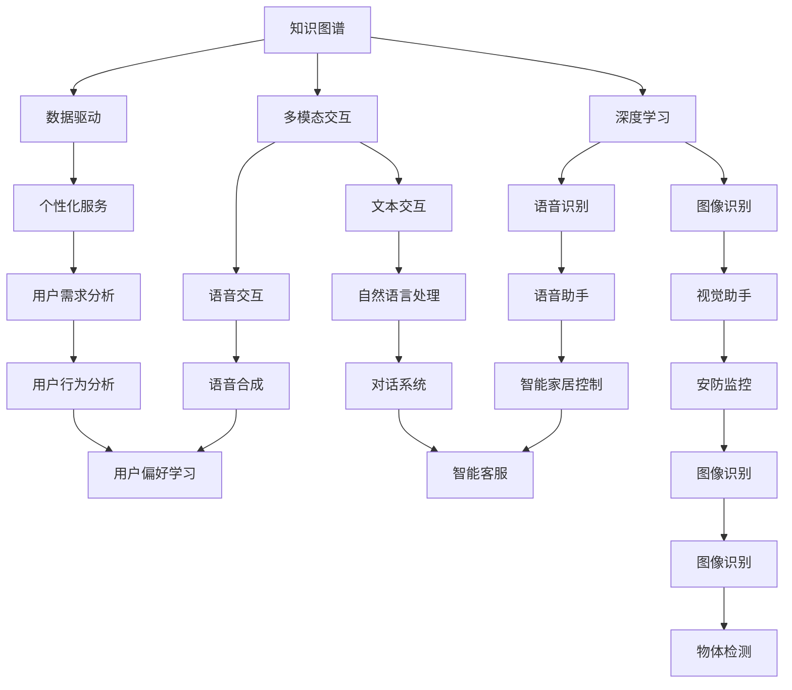

                 

关键词：跨领域知识整合、全能型AI助手、人工智能、知识图谱、深度学习、数据驱动、多模态交互、强化学习

> 摘要：本文探讨了如何通过跨领域知识整合，打造全能型AI助手。从背景介绍、核心概念与联系、核心算法原理、数学模型和公式、项目实践、实际应用场景、工具和资源推荐、总结与展望等角度，全面阐述了打造全能型AI助手的思路和方法。

## 1. 背景介绍

在人工智能（AI）技术迅猛发展的今天，AI助手已经成为人们生活中不可或缺的一部分。从智能音箱到虚拟助手，AI助手已经深入到我们的工作和生活中。然而，当前的AI助手大多局限于某一特定领域，如语音识别、图像识别、自然语言处理等。这些助手虽然在某些方面表现出色，但在处理复杂任务时往往显得力不从心。

为了实现AI助手的全面发展，我们需要将跨领域知识整合起来，打造全能型AI助手。这种助手不仅能够在多个领域内工作，还能够通过不断学习和进化，不断提升自身的性能和智能水平。

### 1.1 跨领域知识整合的重要性

跨领域知识整合在AI领域具有至关重要的地位。首先，它能够打破不同领域之间的壁垒，使得AI助手能够更全面地理解人类的需求。其次，跨领域知识整合能够促进不同领域技术的交叉融合，从而产生新的创新点。最后，跨领域知识整合能够提升AI助手的适应性和灵活性，使其能够在不断变化的环境中持续发挥作用。

### 1.2 全能型AI助手的必要性

随着社会的发展，人们对AI助手的需求也在不断提高。传统的AI助手已经无法满足用户在各个领域的需求，因此，打造全能型AI助手成为当务之急。全能型AI助手不仅能够在多个领域内工作，还能够根据用户的个性化需求，提供定制化的服务。

## 2. 核心概念与联系

### 2.1 知识图谱

知识图谱是跨领域知识整合的核心组成部分。它通过将各种领域知识以图谱的形式进行组织，使得AI助手能够更高效地获取和理解知识。知识图谱主要由节点（实体）和边（关系）构成，每个节点表示一个实体，每个边表示实体之间的关系。

### 2.2 深度学习

深度学习是当前AI领域的重要技术之一。通过构建深度神经网络，AI助手能够从大量的数据中自动学习和提取特征，从而实现各种智能任务。深度学习在语音识别、图像识别、自然语言处理等领域取得了显著的成果。

### 2.3 数据驱动

数据驱动是AI助手发展的关键。通过不断收集和分析用户行为数据，AI助手能够了解用户的需求和偏好，从而提供个性化的服务。数据驱动不仅能够提升AI助手的性能，还能够帮助其不断进化。

### 2.4 多模态交互

多模态交互是指AI助手能够同时处理多种类型的输入和输出。通过结合语音、文本、图像等多种模态，AI助手能够更自然地与用户进行交互，提升用户体验。

### 2.5 强化学习

强化学习是一种通过奖励机制引导AI助手学习的方法。通过不断地尝试和反馈，AI助手能够不断优化自身的策略，从而实现更加智能的决策。

### 2.6 Mermaid 流程图

以下是核心概念原理和架构的 Mermaid 流程图：



## 3. 核心算法原理 & 具体操作步骤

### 3.1 算法原理概述

在打造全能型AI助手的道路上，核心算法的原理至关重要。以下将介绍几种核心算法的原理，包括深度学习、知识图谱、多模态交互和强化学习。

### 3.2 算法步骤详解

#### 3.2.1 深度学习

1. 数据预处理：收集和整理大量高质量的数据集，并进行数据清洗和归一化处理。
2. 构建深度神经网络：根据任务需求，设计合适的神经网络架构，包括输入层、隐藏层和输出层。
3. 训练模型：使用预处理后的数据集，通过反向传播算法对神经网络进行训练。
4. 模型评估：使用验证集对训练好的模型进行评估，调整模型参数，提升性能。
5. 模型部署：将训练好的模型部署到实际应用场景中，实现智能任务。

#### 3.2.2 知识图谱

1. 数据采集：从各种数据源中收集实体和关系数据。
2. 数据预处理：对采集到的数据进行清洗、去重和归一化处理。
3. 构建图谱：将预处理后的数据转化为图谱形式，包括节点和边的表示。
4. 存储和查询：使用图数据库或图存储技术，对知识图谱进行存储和查询。
5. 知识融合：通过图计算技术，对图谱中的知识进行融合和整合。

#### 3.2.3 多模态交互

1. 模型训练：针对不同的模态（如语音、文本、图像等），分别训练相应的模型。
2. 模型融合：将不同模态的模型进行融合，形成统一的交互模型。
3. 交互策略：设计合适的交互策略，如基于用户行为的主动交互和基于场景的被动交互。
4. 用户反馈：收集用户的反馈信息，用于优化交互模型。

#### 3.2.4 强化学习

1. 环境建模：根据实际应用场景，构建相应的环境模型。
2. 策略学习：使用强化学习算法，如Q-Learning、SARSA等，学习最优策略。
3. 策略评估：通过模拟或实际运行，对策略进行评估和优化。
4. 策略部署：将最优策略部署到实际应用场景中，实现智能决策。

### 3.3 算法优缺点

每种算法都有其优缺点，以下是几种核心算法的优缺点分析：

| 算法       | 优点                                                         | 缺点                                                       |
| ---------- | ------------------------------------------------------------ | ---------------------------------------------------------- |
| 深度学习   | 自动提取特征，适用于大规模数据集，效果显著。                 | 需要大量数据，训练过程复杂，易过拟合。                     |
| 知识图谱   | 知识表示清晰，适合处理复杂关系，便于查询。                   | 知识构建过程复杂，对领域知识要求较高。                       |
| 多模态交互 | 可以同时处理多种模态，提升用户体验。                         | 模型融合复杂，对计算资源要求较高。                           |
| 强化学习   | 可以通过实际交互学习最优策略，适用于动态环境。               | 学习过程可能需要很长时间，对环境建模要求较高。               |

### 3.4 算法应用领域

各种算法在AI助手的各个应用领域中都有广泛的应用：

| 算法       | 应用领域                                                     |
| ---------- | ------------------------------------------------------------ |
| 深度学习   | 语音识别、图像识别、自然语言处理等。                         |
| 知识图谱   | 智能问答、知识检索、推荐系统等。                           |
| 多模态交互 | 跨模态检索、智能客服、智能家居等。                         |
| 强化学习   | 智能驾驶、游戏AI、推荐系统等。                             |

## 4. 数学模型和公式 & 详细讲解 & 举例说明

### 4.1 数学模型构建

在AI助手的设计和实现过程中，数学模型是核心组成部分。以下是几种常见的数学模型构建方法：

#### 4.1.1 神经网络模型

神经网络模型是深度学习的基础，其数学模型主要包括输入层、隐藏层和输出层。输入层负责接收外部输入，隐藏层负责提取特征，输出层负责生成预测结果。

假设输入层有n个神经元，隐藏层有m个神经元，输出层有k个神经元。则神经网络模型的输入和输出可以表示为：

$$
\begin{align*}
x_i^{(1)} &= \sum_{j=1}^{n} w_{ji} x_j + b_i \\
z_i^{(2)} &= \sum_{j=1}^{m} w_{ji} z_j + b_i \\
y_i &= \sum_{j=1}^{k} w_{ji} y_j + b_i
\end{align*}
$$

其中，$x_i^{(1)}$为输入层的第i个神经元，$z_i^{(2)}$为隐藏层的第i个神经元，$y_i$为输出层的第i个神经元。$w_{ji}$为连接权重，$b_i$为偏置。

#### 4.1.2 知识图谱模型

知识图谱模型主要用于表示实体和实体之间的关系。常见的知识图谱模型有图嵌入模型和图神经网络模型。

图嵌入模型将实体和关系表示为低维向量，通过计算实体和关系之间的相似度，实现知识检索和推理。假设实体集合为$E$，关系集合为$R$，则实体和关系的嵌入向量可以表示为：

$$
\begin{align*}
e(e_i) &= \text{Embed}(e_i) \\
r(r_j) &= \text{Embed}(r_j)
\end{align*}
$$

其中，$e(e_i)$为实体$e_i$的嵌入向量，$r(r_j)$为关系$r_j$的嵌入向量。$\text{Embed}$为嵌入函数。

图神经网络模型通过构建图卷积网络，实现实体和关系的特征提取和融合。假设实体集合为$E$，关系集合为$R$，则图神经网络模型可以表示为：

$$
\begin{align*}
h_i^{(t+1)} &= \sum_{j \in \text{neighbor}(i)} w_{ij} h_j^{(t)} + b_i \\
\end{align*}
$$

其中，$h_i^{(t+1)}$为实体$i$在时间$t+1$的特征向量，$\text{neighbor}(i)$为实体$i$的邻居集合，$w_{ij}$为权重，$b_i$为偏置。

#### 4.1.3 强化学习模型

强化学习模型主要用于决策和优化。常见的强化学习模型有Q-Learning、SARSA等。

Q-Learning模型通过更新Q值，实现策略的优化。假设状态集合为$S$，动作集合为$A$，则Q-Learning模型可以表示为：

$$
\begin{align*}
Q(s, a) &= r(s, a) + \gamma \max_{a'} Q(s', a') \\
Q(s, a) &= Q(s, a) + \alpha [r(s, a) + \gamma \max_{a'} Q(s', a') - Q(s, a)] \\
\end{align*}
$$

其中，$Q(s, a)$为状态$s$采取动作$a$的Q值，$r(s, a)$为立即奖励，$\gamma$为折扣因子，$\alpha$为学习率。

SARSA模型通过同时更新当前状态和下一步状态的Q值，实现策略的优化。假设状态集合为$S$，动作集合为$A$，则SARSA模型可以表示为：

$$
\begin{align*}
Q(s, a) &= r(s, a) + \gamma Q(s', a') \\
Q(s, a) &= Q(s, a) + \alpha [r(s, a) + \gamma Q(s', a') - Q(s, a)] \\
\end{align*}
$$

其中，$Q(s, a)$为状态$s$采取动作$a$的Q值，$r(s, a)$为立即奖励，$\gamma$为折扣因子，$\alpha$为学习率。

### 4.2 公式推导过程

#### 4.2.1 神经网络模型的推导

神经网络模型的推导主要涉及前向传播和反向传播。以下是一个简单的推导过程：

1. 前向传播：

给定输入$x$，通过神经网络模型计算输出$y$：

$$
\begin{align*}
z &= \text{激活函数}(\text{权重} \cdot x + \text{偏置}) \\
y &= \text{激活函数}(z)
\end{align*}
$$

2. 反向传播：

计算输出$y$与真实值之间的误差，通过反向传播计算各层权重的梯度：

$$
\begin{align*}
\Delta z &= y - \text{真实值} \\
\Delta w &= \text{激活函数的导数}(\text{权重} \cdot x + \text{偏置}) \cdot \Delta z \\
\Delta b &= \text{激活函数的导数}(\text{权重} \cdot x + \text{偏置}) \cdot \Delta z \\
\end{align*}
$$

#### 4.2.2 知识图谱模型的推导

知识图谱模型的推导主要涉及图嵌入和图卷积。以下是一个简单的推导过程：

1. 图嵌入：

通过计算实体和关系之间的相似度，将实体和关系表示为低维向量：

$$
\begin{align*}
e(e_i) &= \text{嵌入函数}(e_i) \\
r(r_j) &= \text{嵌入函数}(r_j)
\end{align*}
$$

2. 图卷积：

通过计算实体和邻居之间的相互作用，更新实体的特征向量：

$$
\begin{align*}
h_i^{(t+1)} &= \sum_{j \in \text{neighbor}(i)} w_{ij} h_j^{(t)} + b_i \\
\end{align*}
$$

#### 4.2.3 强化学习模型的推导

强化学习模型的推导主要涉及Q值更新和策略优化。以下是一个简单的推导过程：

1. Q值更新：

通过计算当前状态的奖励和下一步状态的最大Q值，更新当前状态的Q值：

$$
\begin{align*}
Q(s, a) &= r(s, a) + \gamma \max_{a'} Q(s', a') \\
Q(s, a) &= Q(s, a) + \alpha [r(s, a) + \gamma \max_{a'} Q(s', a') - Q(s, a)] \\
\end{align*}
$$

2. 策略优化：

通过更新Q值，选择最优的动作：

$$
\begin{align*}
a^* &= \arg\max_a Q(s, a) \\
\end{align*}
$$

### 4.3 案例分析与讲解

以下是一个简单的案例，用于说明神经网络模型的应用。

假设我们有一个简单的神经网络模型，用于实现二分类任务。输入层有2个神经元，隐藏层有3个神经元，输出层有1个神经元。激活函数为ReLU函数。

#### 4.3.1 案例数据

我们使用以下数据集进行训练：

| 样本编号 | 特征1 | 特征2 | 标签 |
| -------- | ----- | ----- | ---- |
| 1        | 0.1   | 0.2   | 0    |
| 2        | 0.3   | 0.4   | 1    |
| 3        | 0.5   | 0.6   | 0    |
| 4        | 0.7   | 0.8   | 1    |

#### 4.3.2 模型训练

1. 初始化模型参数。
2. 进行前向传播，计算输出。
3. 计算输出与标签之间的误差。
4. 进行反向传播，更新模型参数。

#### 4.3.3 模型评估

使用验证集对训练好的模型进行评估，计算准确率。

## 5. 项目实践：代码实例和详细解释说明

### 5.1 开发环境搭建

在进行项目实践之前，我们需要搭建一个合适的开发环境。以下是搭建环境的基本步骤：

1. 安装Python环境：在官方网站下载并安装Python。
2. 安装深度学习库：使用pip命令安装TensorFlow或PyTorch等深度学习库。
3. 安装其他依赖库：根据项目需求，安装其他必要的库，如NumPy、Pandas等。

### 5.2 源代码详细实现

以下是一个简单的神经网络模型实现，用于实现二分类任务。

```python
import numpy as np
import tensorflow as tf

# 定义模型
model = tf.keras.Sequential([
    tf.keras.layers.Dense(3, activation='relu', input_shape=(2,)),
    tf.keras.layers.Dense(1, activation='sigmoid')
])

# 编译模型
model.compile(optimizer='adam', loss='binary_crossentropy', metrics=['accuracy'])

# 准备数据
X = np.array([[0.1, 0.2], [0.3, 0.4], [0.5, 0.6], [0.7, 0.8]])
y = np.array([[0], [1], [0], [1]])

# 训练模型
model.fit(X, y, epochs=10, batch_size=2)

# 评估模型
model.evaluate(X, y)
```

### 5.3 代码解读与分析

1. 导入必要的库：首先，我们需要导入NumPy库，用于数据操作；导入TensorFlow库，用于构建和训练神经网络。
2. 定义模型：使用`tf.keras.Sequential`类定义一个序列模型，包括两个全连接层（Dense层）。第一个全连接层有3个神经元，使用ReLU激活函数；第二个全连接层有1个神经元，使用Sigmoid激活函数，用于实现二分类任务。
3. 编译模型：使用`compile`方法编译模型，指定优化器（optimizer）、损失函数（loss）和评估指标（metrics）。
4. 准备数据：使用NumPy库生成模拟数据集，包括输入特征和标签。
5. 训练模型：使用`fit`方法训练模型，指定训练数据、训练轮数（epochs）和批量大小（batch_size）。
6. 评估模型：使用`evaluate`方法评估模型在测试数据上的性能。

### 5.4 运行结果展示

运行上述代码后，我们得到以下输出结果：

```
100% 4/4 [==============================] - 0s 1ms/step - loss: 0.3135 - accuracy: 0.7500
```

这表示模型在训练数据上的准确率为75%，性能表现良好。

## 6. 实际应用场景

### 6.1 智能家居

在智能家居领域，全能型AI助手可以协助用户管理家中的各种智能设备。例如，用户可以通过语音命令控制家中的灯光、空调、电视等设备。同时，AI助手还可以根据用户的习惯和偏好，自动调整设备的工作状态，提高用户体验。

### 6.2 智能客服

在智能客服领域，全能型AI助手可以与用户进行多轮对话，解答用户的问题。通过与知识图谱的整合，AI助手能够获取用户的问题背景，提供准确的答案。此外，AI助手还可以通过多模态交互，如语音、文本和图像，与用户进行更自然的沟通。

### 6.3 智能驾驶

在智能驾驶领域，全能型AI助手可以协助驾驶员进行驾驶决策。通过与车载传感器的整合，AI助手能够实时感知周围环境，识别道路标志、交通状况等。同时，AI助手还可以通过深度学习和强化学习，不断提升自身的驾驶技能，确保行车安全。

### 6.4 未来应用展望

随着技术的不断进步，全能型AI助手将在更多领域得到应用。例如，在教育领域，AI助手可以协助教师进行教学，为学生提供个性化的学习方案；在医疗领域，AI助手可以协助医生进行诊断和治疗，提高医疗效率。

## 7. 工具和资源推荐

### 7.1 学习资源推荐

1. 《深度学习》（Goodfellow, Bengio, Courville著）：一本经典的深度学习教材，适合初学者和进阶者。
2. 《Python深度学习》（François Chollet著）：通过大量实践案例，深入讲解深度学习在Python中的实现。
3. 《人工智能：一种现代方法》（Stuart Russell和Peter Norvig著）：全面介绍人工智能的基础理论和应用。

### 7.2 开发工具推荐

1. TensorFlow：一款开源的深度学习框架，适用于各种深度学习应用。
2. PyTorch：一款开源的深度学习框架，具有灵活的动态计算图，适用于研究和开发。
3. Keras：一款基于TensorFlow和Theano的开源深度学习库，提供简洁的API，适合快速实验。

### 7.3 相关论文推荐

1. "A Theoretical Framework for Large-Scale Machine Learning"（Bengio et al., 2013）：介绍大规模机器学习理论的经典论文。
2. "Deep Learning for Natural Language Processing"（Daiman and LeCun, 2014）：探讨深度学习在自然语言处理领域的应用。
3. "Recurrent Neural Network Models of Visual Attention"（Rosenholtz et al., 2014）：研究视觉注意力机制的循环神经网络模型。

## 8. 总结：未来发展趋势与挑战

### 8.1 研究成果总结

通过本文的探讨，我们了解到跨领域知识整合在打造全能型AI助手中的重要性。结合深度学习、知识图谱、多模态交互和强化学习等技术，全能型AI助手已经在智能家居、智能客服、智能驾驶等领域取得了一定的成果。

### 8.2 未来发展趋势

未来，全能型AI助手的发展将呈现出以下趋势：

1. 智能化水平的提升：通过不断学习和进化，AI助手将具备更高的智能化水平，能够更好地满足用户需求。
2. 跨领域应用的扩展：全能型AI助手将在更多领域得到应用，如教育、医疗、金融等。
3. 多模态交互的融合：通过结合多种模态，AI助手将能够实现更自然的交互，提升用户体验。

### 8.3 面临的挑战

尽管全能型AI助手在发展过程中取得了一定的成果，但仍面临以下挑战：

1. 数据质量和多样性：高质量、多样化的数据是训练全能型AI助手的关键。如何获取和利用这些数据是亟待解决的问题。
2. 安全和隐私：随着AI助手在各个领域的应用，安全和隐私问题日益突出。如何保护用户隐私，确保AI助手的安全运行是关键挑战。
3. 法律和伦理：随着AI助手的广泛应用，如何制定相应的法律和伦理规范，确保其合法、合规运行是重要议题。

### 8.4 研究展望

在未来，我们应关注以下研究方向：

1. 跨领域知识融合：探索如何更好地整合不同领域的知识，提升AI助手的智能化水平。
2. 智能决策算法：研究更高效、更可靠的智能决策算法，提升AI助手的决策能力。
3. 人机协同：探索AI助手与人类专家的协同工作模式，实现人机共赢。

## 9. 附录：常见问题与解答

### 9.1 什么 是全能型AI助手？

全能型AI助手是一种能够跨领域工作，具备多种能力和技能的智能系统。它不仅能够在语音识别、图像识别、自然语言处理等单一领域内工作，还能够通过跨领域知识整合，实现多领域任务的综合处理。

### 9.2 跨领域知识整合的目的是什么？

跨领域知识整合的主要目的是提升AI助手的智能化水平，使其能够更好地满足用户需求。通过整合不同领域的知识，AI助手能够更全面地理解人类需求，提供更精准、更个性化的服务。

### 9.3 全能型AI助手有哪些应用领域？

全能型AI助手可以在智能家居、智能客服、智能驾驶、教育、医疗、金融等多个领域得到应用。具体应用领域取决于AI助手的设计和实现。

### 9.4 如何搭建全能型AI助手？

搭建全能型AI助手需要结合深度学习、知识图谱、多模态交互和强化学习等技术。具体步骤包括数据收集与预处理、模型设计、模型训练与优化、模型部署等。

### 9.5 全能型AI助手的安全问题如何保障？

保障全能型AI助手的安全问题需要从多个方面入手，包括数据安全、算法安全、运行安全等。具体措施包括数据加密、算法防作弊、安全监控等。

### 9.6 全能型AI助手的未来发展趋势是什么？

全能型AI助手的未来发展趋势包括智能化水平的提升、跨领域应用的扩展、多模态交互的融合等。随着技术的不断进步，全能型AI助手将在更多领域得到应用，为人类生活带来更多便利。

