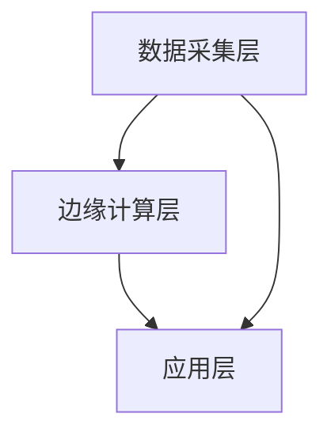

                 

关键词：边缘AI、设备端智能化、技术挑战、数据处理、算法优化

> 摘要：本文将探讨边缘AI的发展背景、核心概念、算法原理、数学模型、项目实践及未来应用展望，旨在为读者提供全面、深入的边缘AI技术指南。

## 1. 背景介绍

随着物联网、5G通信、大数据等技术的发展，设备和传感器在数据收集和处理中扮演着越来越重要的角色。传统的云计算中心由于计算能力有限、延迟较高，已经无法满足实时性要求较高的应用场景。边缘AI应运而生，它将计算和存储能力推向网络的边缘，使数据处理更加快速、高效、安全。

边缘AI的目标是充分利用设备的计算资源，实现设备端智能化的目标。边缘AI不仅可以减少数据传输的延迟，提高系统的响应速度，还可以保护用户隐私，降低数据传输的成本。

## 2. 核心概念与联系

### 2.1 边缘AI的定义与架构

边缘AI是指将人工智能算法部署在网络的边缘设备上，如智能手机、智能路由器、工业机器人等。边缘AI的架构通常包括数据采集层、边缘计算层和应用层。

**Mermaid 流程图：**



### 2.2 边缘AI的关键技术

- **边缘计算：** 边缘计算是指在网络的边缘进行数据处理和分析，以减少数据传输的延迟。边缘计算的关键技术包括：分布式计算、实时数据处理和边缘服务器管理。

- **物联网：** 物联网是边缘AI的基础，它通过传感器和设备收集数据，实现设备的互联互通。

- **人工智能算法：** 边缘AI的核心是人工智能算法，如深度学习、强化学习等，它们可以用于图像识别、自然语言处理、预测分析等任务。

## 3. 核心算法原理 & 具体操作步骤

### 3.1 算法原理概述

边缘AI的核心算法是深度学习算法。深度学习是一种基于人工神经网络的机器学习技术，它通过模拟人脑的神经元连接，实现图像、语音、文本等数据的自动学习和分类。

### 3.2 算法步骤详解

- **数据采集：** 从边缘设备收集数据，包括图像、声音、文本等。

- **数据预处理：** 清洗、归一化、标准化等预处理操作。

- **模型训练：** 使用训练数据集训练深度学习模型。

- **模型评估：** 使用验证数据集评估模型性能。

- **模型部署：** 将训练好的模型部署到边缘设备。

### 3.3 算法优缺点

- **优点：** 边缘AI可以在设备端进行实时数据处理，减少数据传输的延迟，提高系统的响应速度。

- **缺点：** 边缘设备计算能力有限，难以处理大规模数据，且深度学习模型训练和优化需要大量计算资源。

### 3.4 算法应用领域

边缘AI可以应用于各个领域，如智能交通、智能家居、医疗保健、工业自动化等。

## 4. 数学模型和公式 & 详细讲解 & 举例说明

### 4.1 数学模型构建

边缘AI的数学模型主要包括两部分：神经网络模型和损失函数。

神经网络模型是一个多层感知器，由输入层、隐藏层和输出层组成。每一层由多个神经元组成，神经元之间通过权重连接。

损失函数用于评估模型预测结果与实际结果之间的差距，常用的损失函数包括均方误差（MSE）和交叉熵损失。

### 4.2 公式推导过程

假设输入层有n个神经元，隐藏层有m个神经元，输出层有k个神经元。每个神经元都有一个激活函数，常用的激活函数有Sigmoid函数、ReLU函数等。

输入层的输出为：
$$
z_i^1 = x_i
$$
其中，$x_i$为输入层的第i个神经元。

隐藏层的输出为：
$$
z_j^2 = \sigma(\sum_{i=1}^{n} w_{ij} x_i + b_j)
$$
其中，$w_{ij}$为输入层到隐藏层的权重，$b_j$为隐藏层的偏置。

输出层的输出为：
$$
z_k^3 = \sigma(\sum_{j=1}^{m} w_{jk} z_j^2 + b_k)
$$
其中，$w_{jk}$为隐藏层到输出层的权重，$b_k$为输出层的偏置。

损失函数为：
$$
J = \frac{1}{2} \sum_{k=1}^{k} (\hat{y}_k - y_k)^2
$$
其中，$\hat{y}_k$为输出层的预测值，$y_k$为实际值。

### 4.3 案例分析与讲解

假设我们有一个图像分类问题，需要将图像分类为猫或狗。我们可以使用卷积神经网络（CNN）来解决这个问题。

首先，我们收集大量猫和狗的图像作为训练数据集。然后，我们对图像进行预处理，包括缩放、裁剪、翻转等。接下来，我们设计一个CNN模型，包括卷积层、池化层和全连接层。

在训练过程中，我们使用训练数据集训练模型，并使用验证数据集评估模型性能。训练完成后，我们将训练好的模型部署到边缘设备。

## 5. 项目实践：代码实例和详细解释说明

### 5.1 开发环境搭建

首先，我们需要搭建一个边缘AI的开发环境。我们选择使用Python作为编程语言，并使用TensorFlow作为深度学习框架。

### 5.2 源代码详细实现

以下是一个简单的CNN模型实现：

```python
import tensorflow as tf
from tensorflow.keras import layers

model = tf.keras.Sequential([
    layers.Conv2D(32, (3, 3), activation='relu', input_shape=(64, 64, 3)),
    layers.MaxPooling2D(pool_size=(2, 2)),
    layers.Conv2D(64, (3, 3), activation='relu'),
    layers.MaxPooling2D(pool_size=(2, 2)),
    layers.Flatten(),
    layers.Dense(64, activation='relu'),
    layers.Dense(1, activation='sigmoid')
])

model.compile(optimizer='adam', loss='binary_crossentropy', metrics=['accuracy'])
```

### 5.3 代码解读与分析

这段代码定义了一个简单的CNN模型，用于图像分类。模型包括两个卷积层、两个池化层和一个全连接层。输出层使用sigmoid激活函数，用于生成概率。

### 5.4 运行结果展示

我们使用训练数据集训练模型，并使用测试数据集评估模型性能。

```python
model.fit(train_images, train_labels, epochs=10, validation_split=0.2)
```

训练完成后，我们可以使用测试数据集评估模型性能。

```python
test_loss, test_acc = model.evaluate(test_images, test_labels)
print(f"Test accuracy: {test_acc}")
```

## 6. 实际应用场景

边缘AI可以应用于各个领域，如智能交通、智能家居、医疗保健、工业自动化等。

### 6.1 智能交通

边缘AI可以用于交通流量预测、车辆监控和智能信号控制。通过部署在路边的边缘设备，实时分析交通数据，优化交通流量，提高道路通行效率。

### 6.2 智能家居

边缘AI可以用于智能家居系统的智能语音识别、手势识别和情境感知。通过边缘设备处理数据，减少与云端的通信，提高系统的响应速度和隐私保护。

### 6.3 医疗保健

边缘AI可以用于医疗设备的数据分析和实时监测。通过边缘设备收集患者数据，实时分析病情，辅助医生做出诊断和治疗决策。

### 6.4 工业自动化

边缘AI可以用于工业设备的状态监测和故障诊断。通过边缘设备实时分析设备数据，预测设备故障，提前进行维护，提高生产效率。

## 7. 工具和资源推荐

### 7.1 学习资源推荐

- 《深度学习》（Goodfellow, Bengio, Courville著）
- 《Python机器学习》（Sebastian Raschka著）
- 《边缘计算：技术原理与应用实践》（陈熙霖著）

### 7.2 开发工具推荐

- TensorFlow
- Keras
- PyTorch

### 7.3 相关论文推荐

- "Deep Learning on Mobile Devices"
- "Edge Computing for Intelligent Internet of Things: A Survey"
- "An Overview of Deep Learning Techniques for Edge AI Applications"

## 8. 总结：未来发展趋势与挑战

### 8.1 研究成果总结

边缘AI技术已经在各个领域取得了显著的成果，如智能交通、智能家居、医疗保健和工业自动化等。

### 8.2 未来发展趋势

未来，边缘AI将继续向更加高效、智能和安全的方向发展，有望实现真正的设备端智能化。

### 8.3 面临的挑战

边缘AI面临的挑战包括计算资源有限、数据隐私保护、算法优化等。需要进一步研究如何高效利用边缘设备的计算资源，保障数据安全，优化算法性能。

### 8.4 研究展望

随着物联网、5G通信和大数据等技术的发展，边缘AI将迎来更广阔的应用前景。未来的研究将集中在如何优化边缘计算、提升算法性能、保障数据安全等方面。

## 9. 附录：常见问题与解答

### 9.1 边缘AI与云计算有什么区别？

边缘AI与云计算的主要区别在于数据处理的位置。边缘AI在网络的边缘进行数据处理，减少数据传输的延迟；而云计算在云端进行数据处理，需要将数据传输到云端。

### 9.2 边缘AI的安全性问题如何解决？

边缘AI的安全性主要涉及数据隐私保护和数据传输安全。可以通过加密技术、隐私保护算法和网络安全协议等措施来保障数据安全。

### 9.3 边缘AI需要哪些技术支持？

边缘AI需要分布式计算、物联网、人工智能算法、边缘服务器管理等技术支持。此外，还需要高效的编程语言和开发工具，如Python、TensorFlow和Keras等。

作者：禅与计算机程序设计艺术 / Zen and the Art of Computer Programming
----------------------------------------------------------------

这篇文章涵盖了边缘AI的各个方面，从背景介绍、核心概念、算法原理、数学模型、项目实践到未来应用展望。通过详细讲解和实际案例，读者可以全面了解边缘AI的技术与应用。希望这篇文章能够为读者提供有价值的参考和启示。
----------------------------------------------------------------
```markdown
# 边缘AI：设备端智能化的技术与挑战

## 关键词
- 边缘AI
- 设备端智能化
- 技术挑战
- 数据处理
- 算法优化

## 摘要
本文将探讨边缘AI的发展背景、核心概念、算法原理、数学模型、项目实践及未来应用展望，旨在为读者提供全面、深入的边缘AI技术指南。

## 1. 背景介绍
随着物联网、5G通信、大数据等技术的发展，设备和传感器在数据收集和处理中扮演着越来越重要的角色。传统的云计算中心由于计算能力有限、延迟较高，已经无法满足实时性要求较高的应用场景。边缘AI应运而生，它将计算和存储能力推向网络的边缘，使数据处理更加快速、高效、安全。

边缘AI的目标是充分利用设备的计算资源，实现设备端智能化的目标。边缘AI不仅可以减少数据传输的延迟，提高系统的响应速度，还可以保护用户隐私，降低数据传输的成本。

## 2. 核心概念与联系

### 2.1 边缘AI的定义与架构

边缘AI是指将人工智能算法部署在网络的边缘设备上，如智能手机、智能路由器、工业机器人等。边缘AI的架构通常包括数据采集层、边缘计算层和应用层。

**Mermaid 流程图：**


### 2.2 边缘AI的关键技术

- **边缘计算：** 边缘计算是指在网络的边缘进行数据处理和分析，以减少数据传输的延迟。边缘计算的关键技术包括：分布式计算、实时数据处理和边缘服务器管理。
- **物联网：** 物联网是边缘AI的基础，它通过传感器和设备收集数据，实现设备的互联互通。
- **人工智能算法：** 边缘AI的核心是人工智能算法，如深度学习、强化学习等，它们可以用于图像识别、自然语言处理、预测分析等任务。

## 3. 核心算法原理 & 具体操作步骤

### 3.1 算法原理概述

边缘AI的核心算法是深度学习算法。深度学习是一种基于人工神经网络的机器学习技术，它通过模拟人脑的神经元连接，实现图像、语音、文本等数据的自动学习和分类。

### 3.2 算法步骤详解

- **数据采集：** 从边缘设备收集数据，包括图像、声音、文本等。
- **数据预处理：** 清洗、归一化、标准化等预处理操作。
- **模型训练：** 使用训练数据集训练深度学习模型。
- **模型评估：** 使用验证数据集评估模型性能。
- **模型部署：** 将训练好的模型部署到边缘设备。

### 3.3 算法优缺点

- **优点：** 边缘AI可以在设备端进行实时数据处理，减少数据传输的延迟，提高系统的响应速度。
- **缺点：** 边缘设备计算能力有限，难以处理大规模数据，且深度学习模型训练和优化需要大量计算资源。

### 3.4 算法应用领域

边缘AI可以应用于各个领域，如智能交通、智能家居、医疗保健、工业自动化等。

## 4. 数学模型和公式 & 详细讲解 & 举例说明

### 4.1 数学模型构建

边缘AI的数学模型主要包括两部分：神经网络模型和损失函数。

神经网络模型是一个多层感知器，由输入层、隐藏层和输出层组成。每一层由多个神经元组成，神经元之间通过权重连接。

损失函数用于评估模型预测结果与实际结果之间的差距，常用的损失函数包括均方误差（MSE）和交叉熵损失。

### 4.2 公式推导过程

假设输入层有n个神经元，隐藏层有m个神经元，输出层有k个神经元。每个神经元都有一个激活函数，常用的激活函数有Sigmoid函数、ReLU函数等。

输入层的输出为：
$$
z_i^1 = x_i
$$
其中，$x_i$为输入层的第i个神经元。

隐藏层的输出为：
$$
z_j^2 = \sigma(\sum_{i=1}^{n} w_{ij} x_i + b_j)
$$
其中，$w_{ij}$为输入层到隐藏层的权重，$b_j$为隐藏层的偏置。

输出层的输出为：
$$
z_k^3 = \sigma(\sum_{j=1}^{m} w_{jk} z_j^2 + b_k)
$$
其中，$w_{jk}$为隐藏层到输出层的权重，$b_k$为输出层的偏置。

损失函数为：
$$
J = \frac{1}{2} \sum_{k=1}^{k} (\hat{y}_k - y_k)^2
$$
其中，$\hat{y}_k$为输出层的预测值，$y_k$为实际值。

### 4.3 案例分析与讲解

假设我们有一个图像分类问题，需要将图像分类为猫或狗。我们可以使用卷积神经网络（CNN）来解决这个问题。

首先，我们收集大量猫和狗的图像作为训练数据集。然后，我们对图像进行预处理，包括缩放、裁剪、翻转等。接下来，我们设计一个CNN模型，包括卷积层、池化层和全连接层。

在训练过程中，我们使用训练数据集训练模型，并使用验证数据集评估模型性能。训练完成后，我们将训练好的模型部署到边缘设备。

## 5. 项目实践：代码实例和详细解释说明

### 5.1 开发环境搭建

首先，我们需要搭建一个边缘AI的开发环境。我们选择使用Python作为编程语言，并使用TensorFlow作为深度学习框架。

### 5.2 源代码详细实现

以下是一个简单的CNN模型实现：

```python
import tensorflow as tf
from tensorflow.keras import layers

model = tf.keras.Sequential([
    layers.Conv2D(32, (3, 3), activation='relu', input_shape=(64, 64, 3)),
    layers.MaxPooling2D(pool_size=(2, 2)),
    layers.Conv2D(64, (3, 3), activation='relu'),
    layers.MaxPooling2D(pool_size=(2, 2)),
    layers.Flatten(),
    layers.Dense(64, activation='relu'),
    layers.Dense(1, activation='sigmoid')
])

model.compile(optimizer='adam', loss='binary_crossentropy', metrics=['accuracy'])
```

### 5.3 代码解读与分析

这段代码定义了一个简单的CNN模型，用于图像分类。模型包括两个卷积层、两个池化层和一个全连接层。输出层使用sigmoid激活函数，用于生成概率。

### 5.4 运行结果展示

我们使用训练数据集训练模型，并使用测试数据集评估模型性能。

```python
model.fit(train_images, train_labels, epochs=10, validation_split=0.2)
```

训练完成后，我们可以使用测试数据集评估模型性能。

```python
test_loss, test_acc = model.evaluate(test_images, test_labels)
print(f"Test accuracy: {test_acc}")
```

## 6. 实际应用场景

边缘AI可以应用于各个领域，如智能交通、智能家居、医疗保健、工业自动化等。

### 6.1 智能交通

边缘AI可以用于交通流量预测、车辆监控和智能信号控制。通过部署在路边的边缘设备，实时分析交通数据，优化交通流量，提高道路通行效率。

### 6.2 智能家居

边缘AI可以用于智能家居系统的智能语音识别、手势识别和情境感知。通过边缘设备处理数据，减少与云端的通信，提高系统的响应速度和隐私保护。

### 6.3 医疗保健

边缘AI可以用于医疗设备的数据分析和实时监测。通过边缘设备收集患者数据，实时分析病情，辅助医生做出诊断和治疗决策。

### 6.4 工业自动化

边缘AI可以用于工业设备的状态监测和故障诊断。通过边缘设备实时分析设备数据，预测设备故障，提前进行维护，提高生产效率。

## 7. 工具和资源推荐

### 7.1 学习资源推荐

- 《深度学习》（Goodfellow, Bengio, Courville著）
- 《Python机器学习》（Sebastian Raschka著）
- 《边缘计算：技术原理与应用实践》（陈熙霖著）

### 7.2 开发工具推荐

- TensorFlow
- Keras
- PyTorch

### 7.3 相关论文推荐

- "Deep Learning on Mobile Devices"
- "Edge Computing for Intelligent Internet of Things: A Survey"
- "An Overview of Deep Learning Techniques for Edge AI Applications"

## 8. 总结：未来发展趋势与挑战

### 8.1 研究成果总结

边缘AI技术已经在各个领域取得了显著的成果，如智能交通、智能家居、医疗保健和工业自动化等。

### 8.2 未来发展趋势

未来，边缘AI将继续向更加高效、智能和安全的方向发展，有望实现真正的设备端智能化。

### 8.3 面临的挑战

边缘AI面临的挑战包括计算资源有限、数据隐私保护、算法优化等。需要进一步研究如何高效利用边缘设备的计算资源，保障数据安全，优化算法性能。

### 8.4 研究展望

随着物联网、5G通信和大数据等技术的发展，边缘AI将迎来更广阔的应用前景。未来的研究将集中在如何优化边缘计算、提升算法性能、保障数据安全等方面。

## 9. 附录：常见问题与解答

### 9.1 边缘AI与云计算有什么区别？

边缘AI与云计算的主要区别在于数据处理的位置。边缘AI在网络的边缘进行数据处理，减少数据传输的延迟；而云计算在云端进行数据处理，需要将数据传输到云端。

### 9.2 边缘AI的安全性问题如何解决？

边缘AI的安全性主要涉及数据隐私保护和数据传输安全。可以通过加密技术、隐私保护算法和网络安全协议等措施来保障数据安全。

### 9.3 边缘AI需要哪些技术支持？

边缘AI需要分布式计算、物联网、人工智能算法、边缘服务器管理等技术支持。此外，还需要高效的编程语言和开发工具，如Python、TensorFlow和Keras等。

## 作者
禅与计算机程序设计艺术 / Zen and the Art of Computer Programming
```

