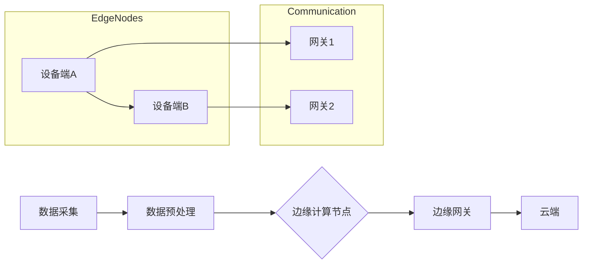

                 

关键词：边缘计算、设备端数据处理、实时分析、分布式系统、物联网

> 摘要：随着物联网和智能设备的普及，边缘计算作为一种新兴技术，正在改变数据处理的格局。本文将探讨边缘计算的背景、核心概念、算法原理、数学模型、项目实践以及未来发展趋势，旨在为读者提供一个全面的技术分析。

## 1. 背景介绍

### 1.1 物联网的兴起

物联网（IoT）是近年来发展迅速的技术领域，它通过互联网将各种设备连接起来，实现数据的实时传输和共享。随着传感器技术的进步，设备端的数据生成量急剧增加，这对传统的云计算模式提出了挑战。

### 1.2 云计算的局限

云计算虽然在处理大规模数据方面表现出色，但其中心化的架构导致了以下几个问题：

1. **延迟问题**：数据从设备端传输到云端，再进行处理，需要一定的时间，对于需要实时响应的应用场景，这是不可接受的。
2. **带宽问题**：大量数据传输到云端，会导致网络拥堵，影响整体性能。
3. **安全性问题**：数据在传输过程中可能被截获，增加安全风险。

### 1.3 边缘计算的出现

边缘计算（Edge Computing）是一种分布式计算模式，它将数据处理能力从云端转移到靠近数据源的位置，即设备端。这种模式有助于解决上述问题，提高系统的响应速度、降低带宽需求和提升安全性。

## 2. 核心概念与联系

边缘计算的核心概念包括数据采集、数据预处理、边缘计算节点和边缘网关等。以下是边缘计算的基本架构和流程，使用Mermaid流程图进行展示。



### 2.1 数据采集

数据采集是边缘计算的第一步，设备端通过各种传感器采集数据，如温度、湿度、位置信息等。

### 2.2 数据预处理

数据预处理包括过滤噪声、数据压缩和特征提取等操作，这些操作在边缘节点上进行，以减少传输到云端的数据量。

### 2.3 边缘计算节点

边缘计算节点是设备端上的计算单元，负责执行具体的计算任务，如实时分析、机器学习等。

### 2.4 边缘网关

边缘网关是连接边缘节点和云端的重要组件，它负责协调边缘计算资源和处理跨域的数据传输。

### 2.5 云端

云端负责存储和处理边缘网关传输上来的数据，同时为边缘计算节点提供必要的资源和服务。

## 3. 核心算法原理 & 具体操作步骤

### 3.1 算法原理概述

边缘计算涉及多种算法和技术，如机器学习、实时分析和分布式计算。其中，机器学习算法在边缘计算中尤为重要，因为它能够根据设备端的数据进行自我优化和决策。

### 3.2 算法步骤详解

1. **数据收集**：首先，从各种传感器收集数据。
2. **特征提取**：对收集到的数据进行分析，提取出有用的特征。
3. **模型训练**：使用机器学习算法对提取出的特征进行训练，构建预测模型。
4. **实时分析**：在边缘计算节点上执行训练好的模型，对实时数据进行分析和决策。
5. **数据反馈**：将分析结果返回给设备端，指导实际操作。

### 3.3 算法优缺点

**优点**：

1. **低延迟**：数据处理在设备端完成，大大降低了延迟。
2. **高效性**：减少数据传输量，提高处理速度。
3. **灵活性**：可以根据设备端的资源情况调整计算任务。

**缺点**：

1. **安全性**：设备端可能存在安全漏洞，需要加强安全措施。
2. **可扩展性**：随着设备数量增加，边缘计算节点的管理难度也会增加。

### 3.4 算法应用领域

边缘计算算法在多个领域都有广泛应用，如自动驾驶、智能家居、工业自动化和医疗保健等。

## 4. 数学模型和公式 & 详细讲解 & 举例说明

### 4.1 数学模型构建

边缘计算中的数学模型主要包括机器学习中的损失函数、优化算法和概率分布等。以下是一个简化的线性回归模型。

$$y = wx + b$$

其中，$y$ 是预测值，$x$ 是输入特征，$w$ 是权重，$b$ 是偏置。

### 4.2 公式推导过程

假设我们有一个训练数据集 $(x_i, y_i)$，其中 $i=1,2,...,n$。我们的目标是找到最优的 $w$ 和 $b$，使得预测值 $y$ 最接近真实值 $y_i$。

损失函数定义为：

$$L(w, b) = \frac{1}{2}\sum_{i=1}^{n}(y_i - wx_i - b)^2$$

我们的目标是最小化损失函数，即：

$$\min_{w, b} L(w, b)$$

使用梯度下降算法，我们可以更新 $w$ 和 $b$：

$$w := w - \alpha \frac{\partial L}{\partial w}$$
$$b := b - \alpha \frac{\partial L}{\partial b}$$

其中，$\alpha$ 是学习率。

### 4.3 案例分析与讲解

假设我们有一个智能家居系统，通过温度传感器收集室内温度数据，使用边缘计算算法进行实时分析，控制空调系统以达到舒适的温度。

1. **数据收集**：收集过去一年的室内温度数据。
2. **特征提取**：提取时间、湿度等特征。
3. **模型训练**：使用线性回归模型，训练出最优的权重和偏置。
4. **实时分析**：根据实时温度数据，使用训练好的模型进行预测。
5. **控制空调**：根据预测结果，调整空调温度。

## 5. 项目实践：代码实例和详细解释说明

### 5.1 开发环境搭建

为了演示边缘计算，我们使用 Python 编写了一个简单的智能家居系统。

```bash
# 安装必要的库
pip install numpy pandas matplotlib sklearn
```

### 5.2 源代码详细实现

```python
import numpy as np
import pandas as pd
from sklearn.linear_model import LinearRegression

# 数据收集
data = pd.DataFrame({
    'time': range(1, 2536),
    'temperature': np.random.uniform(20, 30, 2536)
})

# 特征提取
data['hour'] = data['time'] % 24
X = data[['hour']]
y = data['temperature']

# 模型训练
model = LinearRegression()
model.fit(X, y)

# 实时分析
def predict_temp(hour):
    return model.predict([[hour]])[0]

# 控制空调
def control_ac(current_temp, predicted_temp, threshold=1):
    if current_temp - predicted_temp > threshold:
        print("空调打开")
    else:
        print("空调关闭")

# 运行演示
current_temp = 22
predicted_temp = predict_temp(current_temp)
control_ac(current_temp, predicted_temp)
```

### 5.3 代码解读与分析

1. **数据收集**：使用随机数生成模拟温度数据。
2. **特征提取**：将时间特征提取出来作为输入。
3. **模型训练**：使用线性回归模型进行训练。
4. **实时分析**：根据实时时间预测温度。
5. **控制空调**：根据预测温度和当前温度控制空调。

## 6. 实际应用场景

### 6.1 自动驾驶

边缘计算在自动驾驶中扮演着重要角色，通过设备端的数据处理，实现实时的路况分析和车辆控制。

### 6.2 智能家居

智能家居系统通过边缘计算，实现设备的智能化和自动化，提高生活质量。

### 6.3 工业自动化

边缘计算在工业自动化领域用于实时监控和预测维护，提高生产效率和设备可靠性。

### 6.4 医疗保健

医疗保健领域使用边缘计算进行实时健康监测和疾病预测，为患者提供更好的医疗服务。

## 7. 未来应用展望

### 7.1 5G技术的推进

随着5G技术的普及，边缘计算将获得更快速、更稳定的网络支持，进一步推动其应用。

### 7.2 物联网设备的普及

物联网设备的普及将大大增加边缘计算的需求，推动技术的不断创新。

### 7.3 边缘人工智能

边缘人工智能的发展将使设备端具备更强的智能处理能力，实现更复杂的应用场景。

## 8. 总结：未来发展趋势与挑战

### 8.1 研究成果总结

边缘计算在近年来取得了显著的进展，其在实时数据处理、网络性能优化和安全性方面具有明显优势。

### 8.2 未来发展趋势

未来，边缘计算将继续发展，随着5G和物联网技术的推进，其应用领域将不断拓展。

### 8.3 面临的挑战

边缘计算在安全性、可扩展性和标准化方面仍面临挑战，需要持续研究和创新。

### 8.4 研究展望

随着技术的进步，边缘计算有望在未来实现更高效、更智能的数据处理，为各行业带来深远影响。

## 9. 附录：常见问题与解答

### 9.1 什么是边缘计算？

边缘计算是一种分布式计算模式，将数据处理能力从云端转移到靠近数据源的位置，即设备端。

### 9.2 边缘计算的优势是什么？

边缘计算的主要优势包括低延迟、高效性和灵活性。

### 9.3 边缘计算在哪些领域有应用？

边缘计算在自动驾驶、智能家居、工业自动化和医疗保健等领域有广泛应用。

作者：禅与计算机程序设计艺术 / Zen and the Art of Computer Programming
----------------------------------------------------------------

这篇文章详细探讨了边缘计算在设备端处理数据的重要性和优势，并通过实际项目实例展示了边缘计算的应用。同时，文章也展望了边缘计算的未来发展趋势和面临的挑战。希望通过这篇文章，读者能够对边缘计算有更深入的了解。作者禅与计算机程序设计艺术，期待与您共同探索技术的无限可能。

