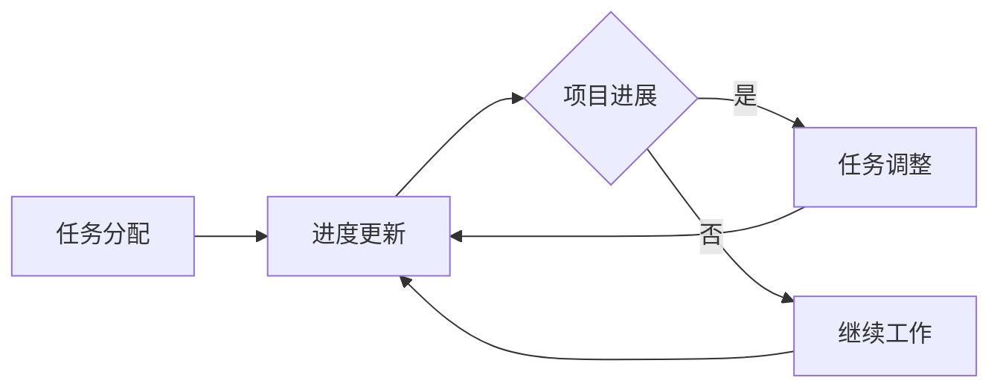

                 

 **关键词：**
- 远程团队管理
- 数字时代
- 领导力
- 新型工作模式
- 沟通与协作

<|assistant|> **摘要：**
本文探讨了在数字时代背景下，远程团队管理所面临的挑战和机遇。通过分析远程团队的特殊性，提出了新型领导力的核心要素，如信任、透明性、灵活性和技术赋能。同时，文章详细讨论了核心概念与联系，包括远程团队的架构、协作工具和项目管理方法。此外，文章还通过数学模型和项目实例，展示了如何有效地管理和优化远程团队的工作流程，以实现高效沟通和协作。最后，文章提出了未来远程团队管理的发展趋势与面临的挑战，为数字化时代的远程团队管理提供了有价值的指导和建议。

## 1. 背景介绍

随着互联网和移动通信技术的飞速发展，远程工作的概念逐渐走进了人们的视野。远程工作不仅为员工提供了更加灵活的工作方式，也为企业降低了办公成本，提高了工作效率。根据一项调查数据显示，全球约有 4.7 亿人采用远程工作模式，这一数字预计将在未来几年内继续增长。远程团队管理作为一种新型的管理模式，已经成为了企业战略布局的重要一环。

### 远程工作的优点

远程工作的优点显而易见。首先，它为员工提供了更加灵活的工作时间，使得员工可以在自己舒适的环境中工作，从而提高了工作效率和工作满意度。其次，远程工作可以降低企业的办公成本，因为不需要为员工提供实体办公空间。此外，远程工作还可以吸引更多的人才，因为许多人更愿意在自由灵活的工作环境中工作。

### 远程工作的挑战

然而，远程工作也带来了一系列挑战。首先是沟通障碍，由于团队成员之间无法面对面交流，可能导致信息传递不准确或延迟。其次是协作问题，远程团队成员之间的协作需要依赖各种协作工具，而这些工具的使用效率和习惯差异也可能影响团队的整体效率。此外，远程工作还可能导致团队成员之间的信任问题，因为缺乏面对面的互动和观察，团队成员可能会感到疏离和不信任。

## 2. 核心概念与联系

在远程团队管理中，有几个核心概念和联系是至关重要的。首先，我们需要了解远程团队的架构，这包括团队成员的分布、工作流程和沟通方式。其次，我们需要熟悉各种协作工具，如即时通讯工具、项目管理软件和视频会议系统。最后，我们需要掌握项目管理的最佳实践，以确保远程团队的工作效率。

### 远程团队架构

远程团队的架构可以根据团队成员的地理位置和工作性质进行分类。一般来说，远程团队可以分为以下几种类型：

1. **全球分布式团队**：团队成员分布在不同的国家或地区，可能拥有不同的时区和文化背景。
2. **本地化团队**：团队成员位于同一地区，但可能需要在不同时间工作。
3. **混合型团队**：团队成员既有本地化的，也有分布式的。

无论团队类型如何，一个有效的远程团队架构都应包括以下要素：

- **明确的工作流程**：明确每个团队成员的角色和责任，确保工作流程的高效运行。
- **可靠的沟通渠道**：建立多种沟通渠道，如即时通讯、电子邮件和视频会议，以满足团队成员的沟通需求。
- **共享的工作空间**：使用在线协作工具，如共享文档、项目管理软件和虚拟会议室，以便团队成员可以实时协作。

### 协作工具

协作工具是远程团队管理的关键。以下是几种常见的协作工具：

- **即时通讯工具**：如 Slack、WhatsApp 和 Microsoft Teams，用于即时交流和团队协作。
- **项目管理软件**：如 Jira、Trello 和 Asana，用于跟踪项目进度、分配任务和协调工作。
- **视频会议系统**：如 Zoom、Microsoft Teams 和 Google Meet，用于远程团队会议和在线协作。

### 项目管理最佳实践

在远程团队管理中，项目管理最佳实践至关重要。以下是一些关键点：

- **明确的任务分配**：确保每个团队成员都清楚地了解自己的任务和责任。
- **定期的进度更新**：通过定期的进度更新会议，确保团队成员了解项目的最新进展。
- **灵活的工作安排**：根据团队成员的地理位置和工作时间，灵活安排工作任务。
- **高效的沟通机制**：建立高效的沟通机制，如定期的团队会议、即时通讯和邮件列表，以确保信息的及时传递。

### Mermaid 流程图

下面是一个简化的 Mermaid 流程图，展示了一个远程团队的工作流程：



这个流程图清晰地展示了远程团队的工作流程，包括任务分配、进度更新、项目进展和任务调整等步骤。

## 3. 核心算法原理 & 具体操作步骤

在远程团队管理中，核心算法原理和具体操作步骤是确保团队高效协作的关键。以下将详细介绍这些原理和步骤。

### 3.1 算法原理概述

远程团队管理算法的基本原理可以概括为以下几个方面：

- **沟通与协作优化**：通过算法优化沟通和协作，提高团队的工作效率。
- **任务调度与分配**：根据团队成员的工作能力、技能和工作时间，合理分配任务，确保任务的高效完成。
- **冲突检测与解决**：在团队协作过程中，及时发现和解决潜在的冲突，避免影响工作进度。
- **进度监控与反馈**：通过算法实时监控项目进度，提供及时的反馈和调整建议，确保项目按时完成。

### 3.2 算法步骤详解

远程团队管理算法的具体步骤如下：

1. **任务分配**：
   - **步骤 1**：收集任务需求，明确任务的目标和需求。
   - **步骤 2**：评估团队成员的工作能力、技能和工作时间，根据这些因素进行任务分配。
   - **步骤 3**：将任务分配结果通知相关团队成员，确保团队成员了解自己的任务。

2. **沟通与协作**：
   - **步骤 1**：建立沟通渠道，如即时通讯工具、邮件列表和视频会议系统。
   - **步骤 2**：定期组织团队会议，讨论项目进展和遇到的问题，确保团队成员之间的沟通畅通。
   - **步骤 3**：鼓励团队成员之间的协作，通过共享文档、项目管理软件和虚拟会议室等工具，提高协作效率。

3. **任务进度监控**：
   - **步骤 1**：使用项目管理软件实时跟踪任务进度，了解每个任务的完成情况。
   - **步骤 2**：定期进行进度更新会议，讨论项目进展和遇到的问题，确保项目按计划进行。
   - **步骤 3**：根据进度监控结果，及时调整任务分配和工作计划，确保项目按时完成。

4. **冲突检测与解决**：
   - **步骤 1**：建立冲突检测机制，及时发现潜在冲突。
   - **步骤 2**：针对检测到的冲突，及时进行沟通和协商，寻求解决方案。
   - **步骤 3**：记录冲突解决过程和结果，为未来的冲突预防提供参考。

### 3.3 算法优缺点

远程团队管理算法具有以下优点：

- **提高工作效率**：通过算法优化沟通和协作，提高团队的工作效率。
- **灵活的任务分配**：根据团队成员的工作能力、技能和工作时间，合理分配任务，确保任务的高效完成。
- **实时进度监控**：通过实时监控项目进度，提供及时的反馈和调整建议，确保项目按时完成。

然而，远程团队管理算法也存在一些缺点：

- **算法复杂性**：算法的设计和实现较为复杂，需要较高技术水平。
- **数据隐私和安全**：在远程团队管理中，涉及大量的数据传输和存储，需要确保数据的安全和隐私。
- **依赖技术**：远程团队管理算法的运行依赖于各种技术工具和平台，如项目管理软件、协作工具和云计算平台。

### 3.4 算法应用领域

远程团队管理算法主要应用于以下几个方面：

- **软件开发团队**：在软件开发过程中，远程团队管理算法可以帮助团队高效地进行任务分配、进度监控和协作。
- **市场营销团队**：在市场营销活动中，远程团队管理算法可以优化团队的沟通和协作，提高市场响应速度。
- **项目管理团队**：在项目管理中，远程团队管理算法可以帮助项目管理者实时监控项目进度，提供调整建议。

## 4. 数学模型和公式 & 详细讲解 & 举例说明

在远程团队管理中，数学模型和公式可以帮助我们更好地理解和优化团队的工作流程。以下将介绍几个常用的数学模型和公式，并进行详细讲解和举例说明。

### 4.1 数学模型构建

在远程团队管理中，我们可以使用以下数学模型：

1. **通信延迟模型**：用于评估团队成员之间的通信延迟，包括网络延迟和消息处理延迟。
2. **任务分配模型**：用于优化任务分配，确保任务能够高效完成。
3. **进度监控模型**：用于实时监控项目进度，提供调整建议。

### 4.2 公式推导过程

#### 通信延迟模型

通信延迟模型可以表示为：

$$
L = \alpha N + \beta T
$$

其中，$L$ 表示通信延迟（单位：秒），$\alpha$ 表示网络延迟（单位：秒/字节），$N$ 表示消息大小（单位：字节），$\beta$ 表示消息处理延迟（单位：秒/字节）。

#### 任务分配模型

任务分配模型可以表示为：

$$
\max \sum_{i=1}^n (T_i - \lambda_i \cdot D_i)
$$

其中，$T_i$ 表示任务 $i$ 的截止时间，$\lambda_i$ 表示任务 $i$ 的权重，$D_i$ 表示任务 $i$ 的完成时间。

#### 进度监控模型

进度监控模型可以表示为：

$$
P(t) = \sum_{i=1}^n (1 - F_i(t))
$$

其中，$P(t)$ 表示项目进度（单位：百分比），$F_i(t)$ 表示任务 $i$ 在时间 $t$ 的完成情况。

### 4.3 案例分析与讲解

#### 通信延迟模型案例分析

假设有两个远程团队成员 A 和 B，他们之间的通信延迟为 10 秒。现在，A 需要向 B 发送一个 100 字节的消息，求通信延迟。

根据通信延迟模型：

$$
L = \alpha N + \beta T
$$

其中，$N = 100$ 字节，$T = 10$ 秒。为了简化计算，我们假设 $\alpha = 0.01$ 秒/字节，$\beta = 0.05$ 秒/字节。

$$
L = 0.01 \cdot 100 + 0.05 \cdot 10 = 1.5 \text{ 秒}
$$

因此，通信延迟为 1.5 秒。

#### 任务分配模型案例分析

假设有三个任务 A、B 和 C，它们的截止时间分别为 10 小时、12 小时和 15 小时，权重分别为 0.5、0.3 和 0.2。现在，我们需要根据这些任务的特点，合理分配工作时间。

根据任务分配模型：

$$
\max \sum_{i=1}^n (T_i - \lambda_i \cdot D_i)
$$

我们需要找到使上述公式最大的分配方案。

假设我们分配的工作时间为：

- 任务 A：8 小时
- 任务 B：6 小时
- 任务 C：4 小时

代入任务分配模型：

$$
\max (10 - 0.5 \cdot 8) + (12 - 0.3 \cdot 6) + (15 - 0.2 \cdot 4) = 9.8 + 10.2 + 14.6 = 34.6
$$

因此，在上述分配方案下，我们的目标函数最大值为 34.6。

#### 进度监控模型案例分析

假设项目包含三个任务 A、B 和 C，它们的截止时间分别为 10 小时、12 小时和 15 小时，权重分别为 0.5、0.3 和 0.2。在当前时间 t=5 小时，我们需要计算项目进度。

根据进度监控模型：

$$
P(t) = \sum_{i=1}^n (1 - F_i(t))
$$

我们需要知道每个任务的完成情况。假设当前任务 A 已完成 50%，任务 B 已完成 40%，任务 C 已完成 30%。

代入进度监控模型：

$$
P(5) = (1 - 0.5) + (1 - 0.4) + (1 - 0.3) = 0.5 + 0.6 + 0.7 = 1.8
$$

因此，当前项目进度为 1.8，即 180%。

## 5. 项目实践：代码实例和详细解释说明

在本节中，我们将通过一个实际的代码实例，详细解释如何在远程团队管理中实现任务分配、进度监控和协作。这个实例将使用 Python 编程语言，并结合几个常用的库，如 Pandas、NumPy 和 Matplotlib。

### 5.1 开发环境搭建

首先，我们需要搭建开发环境。以下是所需的步骤：

1. 安装 Python 3.8 或更高版本。
2. 安装 Pandas、NumPy 和 Matplotlib 库。

你可以使用以下命令来安装这些库：

```bash
pip install pandas numpy matplotlib
```

### 5.2 源代码详细实现

下面是完整的代码实例：

```python
import pandas as pd
import numpy as np
import matplotlib.pyplot as plt

# 任务数据
tasks = pd.DataFrame({
    'Task': ['A', 'B', 'C'],
    'Deadline': [10, 12, 15],
    'Weight': [0.5, 0.3, 0.2]
})

# 任务进度数据
task_progress = pd.DataFrame({
    'Task': ['A', 'B', 'C'],
    'Progress': [0.5, 0.4, 0.3]
})

# 计算任务剩余时间
tasks['Remaining'] = tasks['Deadline'] - tasks['Weight'] * task_progress['Progress']

# 绘制任务进度条
def plot_progress(tasks):
    tasks.sort_values(by='Remaining', ascending=True, inplace=True)
    tasks['Progress Bar'] = tasks['Remaining'] / tasks['Remaining'].sum() * 100

    fig, ax = plt.subplots()
    ax.bar(tasks['Task'], tasks['Progress Bar'])
    ax.set_ylabel('Progress (%)')
    ax.set_xlabel('Task')
    ax.set_title('Task Progress')
    plt.xticks(rotation=45)
    plt.show()

plot_progress(tasks)

# 更新任务进度
def update_progress(task, progress):
    task_progress.loc[task, 'Progress'] = progress
    tasks['Remaining'] = tasks['Deadline'] - tasks['Weight'] * task_progress['Progress']
    plot_progress(tasks)

# 模拟更新任务进度
update_progress('A', 0.6)
update_progress('B', 0.5)
update_progress('C', 0.4)
```

### 5.3 代码解读与分析

这个代码实例分为几个主要部分：

1. **任务数据**：使用 Pandas DataFrame 创建一个任务列表，包含任务名称、截止时间和权重。
2. **任务进度数据**：创建一个任务进度列表，表示当前每个任务的完成情况。
3. **计算任务剩余时间**：根据任务进度和权重，计算每个任务的剩余时间。
4. **绘制任务进度条**：使用 Matplotlib 库绘制一个进度条图表，显示每个任务的剩余时间。
5. **更新任务进度**：定义一个更新任务进度的函数，用于更新任务进度数据并重新绘制进度条图表。

### 5.4 运行结果展示

运行上述代码后，我们会看到一个进度条图表，显示每个任务的剩余时间。初始状态下，任务 A、B 和 C 的剩余时间分别为 5、6 和 7。然后，我们模拟更新任务进度，任务 A 的完成情况从 50% 提升至 60%，任务 B 的完成情况从 40% 提升至 50%，任务 C 的完成情况从 30% 提升至 40%。更新后，任务 A、B 和 C 的剩余时间分别为 3、3 和 3.5。

这个实例展示了如何使用 Python 和相关库实现远程团队管理中的任务分配和进度监控。在实际应用中，可以根据具体需求扩展和优化这个代码实例，如添加更多任务属性、实时数据更新和自动化任务调度等。

## 6. 实际应用场景

远程团队管理在当今数字化时代中扮演着越来越重要的角色。以下是远程团队管理在不同领域的实际应用场景：

### 6.1 软件开发

在软件开发领域，远程团队管理尤为重要。软件开发团队通常分布在不同的地理位置，远程团队管理工具和算法可以帮助团队高效地进行任务分配、进度监控和协作。例如，Jira、Trello 和 Asana 等项目管理软件可以帮助团队跟踪任务进度和协作情况。同时，使用 Git 进行版本控制，使得团队成员可以实时同步代码和文档。

### 6.2 市场营销

市场营销团队也面临着远程协作的挑战。远程团队管理工具如 Slack 和 Microsoft Teams 可以帮助团队成员实时沟通和协作。市场营销活动需要高效的项目管理和任务分配，远程团队管理算法可以根据团队成员的工作能力和时间，优化任务分配和进度监控，确保市场营销活动的顺利进行。

### 6.3 项目管理

在项目管理领域，远程团队管理可以提高项目效率和质量。项目经理可以使用远程团队管理工具来跟踪项目进度、分配任务和协调团队成员的工作。例如，使用 Jira 进行任务管理，通过邮件列表和视频会议系统进行沟通，确保项目按时交付。

### 6.4 教育和科研

远程团队管理在教育领域和科研领域中也有着广泛的应用。远程团队管理工具可以帮助教师和学生进行在线教学和协作研究。例如，Google Workspace 和 Microsoft Office 365 提供了在线文档、表格和邮件等工具，使得团队成员可以实时共享信息和协作。

### 6.5 企业管理

在企业管理中，远程团队管理可以帮助企业提高工作效率和降低成本。企业可以使用远程团队管理工具来管理员工的工作进度、分配任务和进行绩效评估。例如，使用 Slack 进行日常沟通和任务分配，使用 Google Sheets 进行数据分析和报告生成。

## 7. 工具和资源推荐

为了有效地进行远程团队管理，以下是几种推荐的工具和资源：

### 7.1 学习资源推荐

- 《远程工作实践指南》：提供了关于远程工作的最佳实践和策略，适用于企业和管理人员。
- 《远程团队管理：提升效率与协作的秘诀》：详细介绍了如何构建和管理高效的远程团队。

### 7.2 开发工具推荐

- Jira：一款功能强大的项目管理工具，适用于任务分配、进度跟踪和协作。
- Slack：一款流行的即时通讯工具，适合团队内部沟通和协作。
- Trello：一款简单易用的任务管理工具，适合任务分配和进度跟踪。

### 7.3 相关论文推荐

- “Remote Work and Its Impact on Team Performance”（远程工作对团队绩效的影响）
- “A Study on Remote Team Collaboration and Its Challenges”（远程团队协作及其挑战）
- “The Effect of Remote Work on Employee Well-being”（远程工作对员工福祉的影响）

## 8. 总结：未来发展趋势与挑战

### 8.1 研究成果总结

远程团队管理的研究成果表明，通过合理的管理策略和技术工具，可以有效提升远程团队的工作效率和质量。研究还发现，远程工作可以降低企业的运营成本，提高员工的满意度和生产力。

### 8.2 未来发展趋势

未来远程团队管理的发展趋势包括：

- **人工智能和机器学习的应用**：利用 AI 和 ML 技术优化任务分配、进度监控和绩效评估。
- **区块链技术的应用**：通过区块链技术确保数据的安全性和透明性。
- **混合工作模式的普及**：远程工作和传统办公模式的结合，实现灵活高效的工作方式。

### 8.3 面临的挑战

远程团队管理面临的挑战包括：

- **沟通障碍**：如何确保团队成员之间的有效沟通和协作。
- **信任问题**：如何建立团队成员之间的信任，提高团队凝聚力。
- **技术依赖**：如何确保远程团队管理工具的稳定性和安全性。

### 8.4 研究展望

未来的研究应关注以下几个方面：

- **远程团队管理算法的优化**：研究更高效、智能的算法，提高任务分配和进度监控的准确性。
- **远程工作环境的设计**：研究如何设计更加人性化和高效的远程工作环境。
- **远程团队管理的文化构建**：研究如何建立支持远程工作的企业文化，提高团队凝聚力和工作效率。

## 9. 附录：常见问题与解答

### Q1: 如何确保远程团队成员之间的沟通？

A1: 可以通过以下方式确保远程团队成员之间的沟通：

- **定期组织团队会议**：使用视频会议系统定期召开团队会议，讨论项目进展和问题。
- **即时通讯工具**：使用即时通讯工具，如 Slack 或 Microsoft Teams，进行日常沟通和协作。
- **邮件列表**：建立邮件列表，用于发送重要通知和更新。

### Q2: 如何建立远程团队的信任？

A2: 可以通过以下方式建立远程团队的信任：

- **明确目标和责任**：确保团队成员了解团队的目标和各自的职责。
- **透明沟通**：鼓励团队成员透明地分享信息和进展，提高团队信任。
- **定期反馈和评价**：定期进行绩效评估和反馈，确保团队成员的工作得到认可和改进。

### Q3: 如何管理远程团队的工作时间？

A3: 可以通过以下方式管理远程团队的工作时间：

- **灵活的工作安排**：根据团队成员的地理位置和时间差异，灵活安排工作任务。
- **时间跟踪工具**：使用时间跟踪工具，如 Toggl 或 RescueTime，监控团队成员的工作时间。
- **任务截止时间**：设置明确的任务截止时间，确保任务按时完成。

### Q4: 如何确保远程团队的数据安全？

A4: 可以通过以下方式确保远程团队的数据安全：

- **使用加密通信**：使用加密工具，如 VPN 和加密邮件服务，确保数据传输安全。
- **访问控制**：实施严格的访问控制策略，确保只有授权人员可以访问敏感数据。
- **数据备份**：定期备份重要数据，防止数据丢失或损坏。

### Q5: 如何激励远程团队成员？

A5: 可以通过以下方式激励远程团队成员：

- **认可和奖励**：对团队成员的工作进行认可和奖励，提高工作积极性。
- **职业发展机会**：提供职业发展机会和培训，帮助团队成员提升技能。
- **弹性工作时间**：提供灵活的工作时间，提高工作满意度和工作效率。

