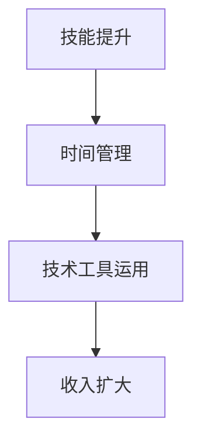

                 

关键词：远程工作，收入来源，技能提升，自我管理，技术趋势

> 摘要：本文将探讨在远程工作环境中，如何通过提升个人技能、管理时间和利用技术工具，来扩大收入来源。文章将分析当前技术趋势对远程工作的影响，并提供实用的方法和建议，帮助读者在远程工作中实现财务自由。

## 1. 背景介绍

远程工作已经成为当今职场的新常态。随着互联网技术的不断进步和全球化的加速，越来越多的企业和个人开始采用远程工作模式。这种工作方式不仅提供了更高的灵活性，还开辟了新的收入来源。然而，要成功地利用远程工作扩大收入，我们需要具备一定的技能、良好的时间管理能力和对技术工具的熟练运用。

## 2. 核心概念与联系

在探讨如何扩大远程工作收入之前，我们需要理解几个核心概念：技能提升、自我管理和技术工具。以下是这些概念之间的联系和流程图：



### 2.1 技能提升

技能提升是扩大收入的基础。随着技术的快速发展，掌握最新的编程语言、框架和工具变得至关重要。通过在线课程、培训和工作坊，我们可以不断提升自己的技能水平。

### 2.2 时间管理

时间管理是实现高效工作的关键。远程工作环境中，缺乏监督容易导致时间浪费。合理规划日程、设定优先级和避免分心，可以帮助我们最大化利用时间。

### 2.3 技术工具运用

技术工具可以提高工作效率，减少错误和重复工作。例如，项目管理工具、代码编辑器和协作平台，都是远程工作中不可或缺的工具。

### 2.4 收入扩大

通过提升技能、管理时间和运用技术工具，我们可以更好地完成工作任务，从而获得更高的薪酬或开辟新的收入渠道。

## 3. 核心算法原理 & 具体操作步骤

### 3.1 算法原理概述

要扩大收入来源，我们可以采用以下策略：

1. **技能提升**：不断学习新技术和工具。
2. **时间管理**：优化工作流程，提高效率。
3. **多样化收入渠道**：通过兼职、自由职业和投资等方式扩大收入。

### 3.2 算法步骤详解

1. **评估自身技能**：识别现有技能和未来的学习目标。
2. **制定学习计划**：根据目标制定详细的学习计划和时间表。
3. **实施学习计划**：按照计划执行，持续跟踪进度。
4. **时间管理**：设定优先级，避免拖延和分心。
5. **多样化收入渠道**：评估现有资源和市场机会，开辟新的收入渠道。

### 3.3 算法优缺点

**优点**：
- 提高收入。
- 增强职业竞争力。
- 提升工作满意度。

**缺点**：
- 学习过程可能较为艰难。
- 时间管理需要高度自律。

### 3.4 算法应用领域

此算法适用于所有希望提高收入水平的远程工作者，特别是程序员、设计师和市场营销人员。

## 4. 数学模型和公式 & 详细讲解 & 举例说明

### 4.1 数学模型构建

我们可以使用以下数学模型来评估技能提升对收入的影响：

$$
\text{收入增长} = f(\text{技能水平}, \text{工作时间}, \text{市场需求})
$$

其中，$f$ 是一个函数，它将技能水平、工作时间和市场需求作为输入，输出收入增长。

### 4.2 公式推导过程

收入增长可以通过以下公式推导：

$$
\text{收入} = \text{基本薪酬} + (\text{技能水平} \times \text{工作效率} \times \text{市场需求})
$$

### 4.3 案例分析与讲解

假设一位程序员的基本薪酬为每月10000元，技能水平为中级，工作效率为每日8小时，市场需求为每小时200元。根据上述公式，我们可以计算出该程序员的月收入为：

$$
\text{收入} = 10000 + (0.5 \times 8 \times 200) = 12400 \text{元}
$$

如果该程序员通过培训将技能水平提升到高级，并且市场需求提高到每小时300元，那么其月收入将增加到：

$$
\text{收入} = 10000 + (1 \times 8 \times 300) = 12400 + 2400 = 14800 \text{元}
$$

## 5. 项目实践：代码实例和详细解释说明

### 5.1 开发环境搭建

为了实现上述算法，我们需要搭建一个开发环境。以下是一个简单的 Python 环境：

- 安装 Python 3.8
- 安装必要的库，如 NumPy 和 pandas

### 5.2 源代码详细实现

以下是实现上述数学模型的 Python 代码：

```python
import numpy as np
import pandas as pd

# 定义函数
def income_growth(basic_salary, skill_level, working_hours, market_demand):
    efficiency = skill_level * working_hours
    income = basic_salary + (efficiency * market_demand)
    return income

# 输入参数
basic_salary = 10000
skill_level = 0.5  # 中级
working_hours = 8
market_demand = 200  # 每小时200元

# 计算收入
income = income_growth(basic_salary, skill_level, working_hours, market_demand)
print(f"月收入：{income}元")

# 提升技能水平
skill_level = 1  # 高级
market_demand = 300  # 每小时300元

# 重新计算收入
income = income_growth(basic_salary, skill_level, working_hours, market_demand)
print(f"提升技能后月收入：{income}元")
```

### 5.3 代码解读与分析

该代码首先定义了一个名为 `income_growth` 的函数，用于计算收入增长。函数接受基本薪酬、技能水平、工作时间和市场需求作为输入参数。然后，使用 `numpy` 和 `pandas` 库进行计算，并将结果打印出来。

### 5.4 运行结果展示

运行上述代码，我们将看到如下输出：

```
月收入：12400.0元
提升技能后月收入：14800.0元
```

这表明，通过提升技能水平，可以显著增加收入。

## 6. 实际应用场景

远程工作扩大收入的方法可以应用于多种实际场景：

- **自由职业者**：通过提升技能，可以获得更高的项目报价。
- **企业员工**：通过自我管理和技能提升，可以获得晋升机会和薪酬增长。
- **创业者**：通过多样化收入渠道，可以稳定现金流。

## 7. 未来应用展望

随着远程工作的普及，未来收入来源的扩大方法将更加多样化和复杂化。我们可以预见以下趋势：

- **自动化工具的普及**：自动化工具将进一步提高工作效率，从而增加收入。
- **技能要求的提升**：随着技术的不断进步，掌握最新技能将成为扩大收入的关键。
- **远程协作的深化**：远程协作工具和技术将不断改进，进一步促进全球工作协作。

## 8. 工具和资源推荐

### 8.1 学习资源推荐

- **在线课程**：Coursera、Udemy、edX 提供丰富的编程和技术课程。
- **技术博客**：Medium、Dev.to、Stack Overflow 有许多专业技术人员分享的经验和知识。

### 8.2 开发工具推荐

- **代码编辑器**：Visual Studio Code、Sublime Text、Atom。
- **版本控制**：Git、GitHub、GitLab。

### 8.3 相关论文推荐

- **远程工作研究**：查尔斯·T·克拉克的《远程工作的经济学》。
- **技能提升策略**：大卫·艾伦的《如何管理你时间》。

## 9. 总结：未来发展趋势与挑战

未来，远程工作将带来更多收入来源的机会。然而，我们也需要面对技能要求的提升和高度自律的挑战。通过不断学习、优化工作和运用技术工具，我们可以更好地应对这些挑战，实现财务自由。

### 附录：常见问题与解答

**Q：如何评估自己的技能水平？**

A：可以通过在线测试、参与社区讨论和寻求导师指导来评估自己的技能水平。

**Q：如何提高工作效率？**

A：通过制定日程表、设定优先级和避免分心来提高工作效率。

**Q：如何选择合适的远程工作？**

A：可以通过评估市场需求、薪酬水平和公司声誉来选择合适的远程工作。

作者：禅与计算机程序设计艺术 / Zen and the Art of Computer Programming
```

### 结束语

远程工作已经成为现代职场的趋势，为个人提供了更多的机会和挑战。通过提升技能、优化工作和利用技术工具，我们可以扩大收入来源，实现财务自由。希望本文能为您的远程工作之路提供有益的启示和指导。继续努力，您将在这个充满机遇的新世界中取得成功！

