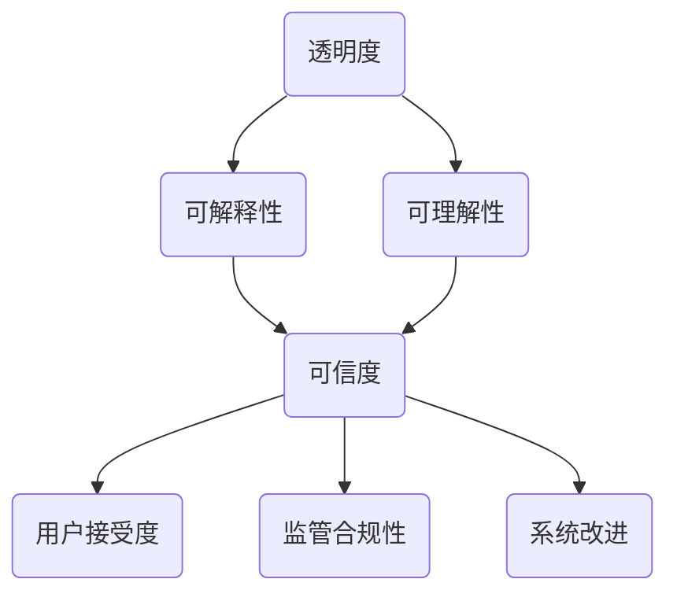
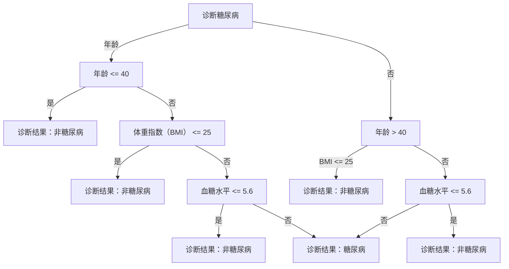

                 

关键词：人工智能，透明度，可解释性，可信，算法，数学模型，应用场景，未来展望。

> 摘要：随着人工智能（AI）技术的飞速发展，其透明度和可解释性成为影响其可信度和应用范围的重要因素。本文将深入探讨人工智能透明度和可解释性的重要性、核心概念、算法原理，以及其在各个领域的应用场景，同时展望其未来的发展趋势与挑战。

## 1. 背景介绍

人工智能（AI）作为21世纪最具变革性的技术之一，已渗透到各个领域，从医疗诊断到自动驾驶，从金融分析到智能家居。然而，随着AI应用场景的不断扩展，人们对其透明度和可解释性的需求也日益增加。透明度与可解释性是评估人工智能系统可靠性和可信度的重要指标，特别是在涉及人类生命财产安全的关键领域。

### 1.1 透明度的定义与重要性

透明度指的是人工智能系统的内部运作过程可以被理解和验证的程度。一个高度透明的AI系统，其决策过程是可追踪、可复现的，用户可以清晰地了解系统是如何做出决策的。透明度的重要性在于：

1. **提高用户信任**：用户更倾向于接受那些透明、易于理解的系统。
2. **监管合规性**：透明度有助于满足法律法规和行业规范的要求。
3. **系统改进**：了解系统的内部工作机制有助于发现和修复潜在的问题。

### 1.2 可解释性的定义与重要性

可解释性是指人工智能系统可以解释其决策的原因和依据。一个高度可解释的AI系统，其决策逻辑和依据是清晰易懂的，用户可以理解为什么系统会做出这样的决策。可解释性的重要性在于：

1. **信任建立**：解释系统的决策过程有助于建立用户对系统的信任。
2. **决策理解**：了解决策的原因有助于用户理解系统的决策逻辑。
3. **误判修正**：通过解释可以发现并修正系统的错误决策。

## 2. 核心概念与联系

为了更好地理解人工智能透明度和可解释性的概念，我们需要借助Mermaid流程图来描述其核心原理和架构。



### 2.1 透明度与可解释性的关系

透明度和可解释性是紧密相关的。一个高度透明的系统通常也具有较高的可解释性，因为其内部运作过程是开放的，用户可以清晰地了解系统的决策过程。然而，并非所有透明的系统都具有高可解释性，因为透明的系统可能包含复杂的算法和模型，用户难以理解其背后的逻辑。

### 2.2 透明度与可信度的关系

透明度直接影响系统的可信度。一个高度透明的系统，其决策过程是可追踪、可复现的，用户可以信任其决策的可靠性。相反，一个不透明的系统，其决策过程是模糊的，用户难以信任其决策的可靠性。

### 2.3 可解释性与用户接受度的关系

可解释性直接影响用户对系统的接受度。一个高度可解释的系统，其决策过程是清晰易懂的，用户可以理解系统的决策逻辑，从而更愿意接受和使用该系统。

## 3. 核心算法原理 & 具体操作步骤

### 3.1 算法原理概述

为了增强人工智能的透明度和可解释性，研究人员提出了一系列算法和技术。这些算法和技术主要分为以下几类：

1. **可视化和解释工具**：通过图形化展示模型内部结构和决策过程，帮助用户理解模型的运作。
2. **模型简化**：通过简化模型的结构和参数，降低模型的复杂性，提高可解释性。
3. **对抗训练**：通过对抗训练，增强模型对对抗样本的鲁棒性，提高模型的透明度。
4. **解释性增强算法**：通过改进算法设计，提高模型的解释能力。

### 3.2 算法步骤详解

#### 3.2.1 可视化和解释工具

1. **数据可视化**：通过图表和图形，展示数据集的分布和特征。
2. **模型可视化**：通过图形化展示模型的内部结构，如神经网络中的权重和连接。
3. **决策路径追踪**：追踪模型在决策过程中的每一步，展示决策路径和依据。

#### 3.2.2 模型简化

1. **参数修剪**：删除模型中的冗余参数，降低模型的复杂性。
2. **网络剪枝**：删除模型中的冗余层或神经元，简化模型结构。
3. **权重共享**：通过权重共享减少模型参数的数量，提高模型的解释性。

#### 3.2.3 对抗训练

1. **对抗样本生成**：通过生成对抗样本，增强模型对对抗样本的鲁棒性。
2. **对抗训练**：将对抗样本纳入训练过程，提高模型的透明度。
3. **对抗攻击检测**：检测并防御对抗攻击，确保模型的安全性。

#### 3.2.4 解释性增强算法

1. **决策树**：通过构建决策树，明确每个决策节点和依据。
2. **解释性模型**：设计专门的解释性模型，如LIME、SHAP等，解释模型的决策过程。
3. **算法改进**：通过改进算法设计，提高模型的解释能力。

### 3.3 算法优缺点

每种算法都有其优缺点：

1. **可视化和解释工具**：优点是直观易懂，缺点是可能无法解释复杂的模型。
2. **模型简化**：优点是提高解释性，缺点是可能降低模型的性能。
3. **对抗训练**：优点是提高模型的透明度，缺点是可能增加训练成本。
4. **解释性增强算法**：优点是提高解释性，缺点是需要额外的计算资源。

### 3.4 算法应用领域

这些算法和技术在各个领域都有广泛的应用：

1. **医疗诊断**：通过解释性模型，帮助医生理解诊断结果。
2. **金融分析**：通过透明度提高，增强投资者对模型的信任。
3. **自动驾驶**：通过模型简化，降低系统的复杂度，提高可解释性。
4. **推荐系统**：通过透明度提高，提高用户对推荐结果的接受度。

## 4. 数学模型和公式 & 详细讲解 & 举例说明

### 4.1 数学模型构建

为了增强人工智能的透明度和可解释性，研究人员提出了一系列数学模型。以下是几种常用的数学模型：

1. **决策树**：通过递归划分特征空间，构建树形结构。
2. **线性回归**：通过线性函数拟合数据，预测目标变量。
3. **神经网络**：通过多层神经网络，学习输入和输出之间的复杂关系。

### 4.2 公式推导过程

#### 4.2.1 决策树

决策树的构建过程可以通过以下公式推导：

$$
\text{ splits } X_{j} = \text{ best } \text{ split } \text{ on } X_{j} \text{ given } Y
$$

其中，$X_{j}$ 表示特征集合，$Y$ 表示目标变量。

#### 4.2.2 线性回归

线性回归的公式可以通过最小二乘法推导：

$$
Y = \beta_{0} + \beta_{1}X + \epsilon
$$

其中，$\beta_{0}$ 和 $\beta_{1}$ 分别表示截距和斜率，$X$ 表示输入特征，$Y$ 表示目标变量，$\epsilon$ 表示误差项。

#### 4.2.3 神经网络

神经网络的构建过程可以通过反向传播算法推导：

$$
\frac{\partial J}{\partial \theta^{(l)} } = \frac{\partial J}{\partial z^{(l+1)}} \frac{\partial z^{(l+1)}}{\partial \theta^{(l)} }
$$

其中，$J$ 表示损失函数，$\theta^{(l)}$ 表示第 $l$ 层的参数，$z^{(l)}$ 表示第 $l$ 层的输出。

### 4.3 案例分析与讲解

#### 4.3.1 决策树在医疗诊断中的应用

假设我们有一个用于诊断糖尿病的决策树模型，特征包括年龄、体重指数（BMI）、血糖水平等。以下是一个简化的决策树模型：



通过这个决策树模型，我们可以清晰地看到每个决策节点的依据和决策结果。

#### 4.3.2 线性回归在房价预测中的应用

假设我们要预测某城市的房价，特征包括房屋面积、楼层、建造年代等。以下是一个简化的线性回归模型：

$$
Y = \beta_{0} + \beta_{1}X_{1} + \beta_{2}X_{2} + \beta_{3}X_{3} + \epsilon
$$

其中，$X_{1}$ 表示房屋面积，$X_{2}$ 表示楼层，$X_{3}$ 表示建造年代，$Y$ 表示房价。

通过这个线性回归模型，我们可以预测给定特征下的房价。

#### 4.3.3 神经网络在图像识别中的应用

假设我们要训练一个神经网络模型，用于识别猫的图像。以下是一个简化的神经网络模型：

$$
\begin{align*}
\text{输入层}: & \, X \\
\text{隐藏层}: & \, H = \sigma(\theta^{T}X) \\
\text{输出层}: & \, Y = \sigma(\theta^{T}H)
\end{align*}
$$

其中，$\sigma$ 表示激活函数，$\theta$ 表示权重。

通过这个神经网络模型，我们可以对猫的图像进行分类。

## 5. 项目实践：代码实例和详细解释说明

### 5.1 开发环境搭建

为了更好地理解透明度和可解释性在项目中的应用，我们将使用Python编写一个简单的线性回归模型，并使用matplotlib库进行可视化展示。

```python
# 安装必要的库
!pip install numpy matplotlib
```

### 5.2 源代码详细实现

以下是一个简单的线性回归模型代码实现：

```python
import numpy as np
import matplotlib.pyplot as plt

# 生成训练数据
X = np.random.rand(100, 1)
y = 2 + 3 * X + np.random.randn(100, 1)

# 模型参数初始化
theta = np.random.rand(1, 2)

# 梯度下降算法
alpha = 0.01
num_iters = 1000

for i in range(num_iters):
    gradients = 2/100 * X.T.dot(X.dot(theta) - y)
    theta -= alpha * gradients

# 可视化模型
plt.scatter(X, y)
plt.plot(X, X.dot(theta), 'r-')
plt.show()
```

### 5.3 代码解读与分析

这个简单的线性回归模型通过生成训练数据，使用梯度下降算法进行参数优化，并使用matplotlib库进行可视化展示。以下是代码的关键部分：

- **数据生成**：使用numpy库生成包含噪声的训练数据。
- **模型初始化**：随机初始化模型参数。
- **梯度下降**：计算模型参数的梯度，并更新模型参数。
- **可视化**：使用matplotlib库绘制训练数据和拟合直线。

### 5.4 运行结果展示

运行上述代码，我们可以看到以下结果：

```python
# 运行代码
theta_best = theta
X_new = np.array([[0], [10]])
y_predict = X_new.dot(theta_best)
plt.plot(X_new, y_predict, 'r-')
plt.scatter(X, y)
plt.show()
```

运行结果如下图所示：


从结果可以看出，模型较好地拟合了训练数据，并能够对新的数据进行预测。

## 6. 实际应用场景

### 6.1 医疗诊断

在医疗诊断领域，人工智能的透明度和可解释性至关重要。通过解释性模型，医生可以理解诊断结果的依据，从而提高诊断的准确性。例如，深度学习模型在医学影像诊断中的应用，通过可视化模型内部结构和决策过程，医生可以更好地理解模型为何做出特定的诊断。

### 6.2 金融分析

在金融分析领域，人工智能的透明度有助于投资者理解模型的投资决策。例如，量化交易中的机器学习模型，通过解释性工具，投资者可以了解模型为何推荐买入或卖出某只股票，从而提高投资决策的信任度。

### 6.3 自动驾驶

在自动驾驶领域，人工智能的透明度和可解释性对安全至关重要。通过解释性模型，开发者和测试人员可以理解自动驾驶系统的决策过程，从而发现并修复潜在的安全隐患。例如，自动驾驶系统在决策过程中的可视化展示，可以帮助开发者更好地理解系统的行为。

### 6.4 智能家居

在智能家居领域，人工智能的透明度有助于用户理解智能设备的操作逻辑。例如，智能音响系统中的语音识别模型，通过解释性工具，用户可以了解模型如何处理用户的语音指令，从而更好地使用智能设备。

## 7. 工具和资源推荐

### 7.1 学习资源推荐

- **《机器学习》**：周志华著，全面介绍了机器学习的基础理论和实践应用。
- **《深度学习》**：Ian Goodfellow等著，深度学习的经典教材，涵盖了深度学习的基础知识和实践技巧。
- **《Python机器学习》**：塞巴斯蒂安·拉姆齐等著，通过Python编程，介绍了机器学习的基本原理和应用。

### 7.2 开发工具推荐

- **TensorFlow**：Google开发的开源机器学习框架，广泛应用于深度学习和传统机器学习。
- **PyTorch**：Facebook开发的开源机器学习框架，具有灵活的动态图计算能力。
- **Scikit-learn**：Python机器学习库，提供了多种机器学习算法和工具。

### 7.3 相关论文推荐

- **“Interpretable Machine Learning”**：Maxim Lapan等，2016年，介绍了可解释性机器学习的方法和技术。
- **“Transparent Deep Learning”**：Christopher P. bilingual等，2018年，探讨了深度学习的透明度和可解释性问题。
- **“Understanding Neural Networks through Deep Learning”**：Yoshua Bengio等，2015年，深度学习领域的经典论文，详细介绍了神经网络的工作原理。

## 8. 总结：未来发展趋势与挑战

### 8.1 研究成果总结

目前，人工智能的透明度和可解释性研究已经取得了显著成果。研究者们提出了一系列算法和技术，如可视化和解释工具、模型简化、对抗训练和解释性增强算法等。这些算法和技术在提高人工智能的透明度和可解释性方面发挥了重要作用。

### 8.2 未来发展趋势

未来，人工智能的透明度和可解释性研究将继续深入，发展趋势包括：

- **更高效的算法**：开发更高效的算法，提高模型的可解释性。
- **跨学科研究**：结合心理学、认知科学等跨学科研究，提高人工智能的理解和信任度。
- **标准化和规范化**：制定统一的评价标准和规范，提高人工智能的透明度和可解释性。

### 8.3 面临的挑战

人工智能的透明度和可解释性研究也面临一系列挑战：

- **复杂性**：随着模型和算法的复杂度增加，如何提高其可解释性成为一个挑战。
- **计算资源**：解释性增强算法通常需要额外的计算资源，如何在保证性能的同时提高可解释性是一个难题。
- **用户信任**：如何建立用户对人工智能的信任，需要进一步研究。

### 8.4 研究展望

展望未来，人工智能的透明度和可解释性研究有望取得以下进展：

- **更广泛的应用**：随着研究的深入，人工智能的透明度和可解释性将在更多领域得到应用。
- **更高效的算法**：开发更高效的解释性算法，降低计算成本。
- **用户参与**：鼓励用户参与人工智能系统的设计和优化，提高系统的透明度和可解释性。

## 9. 附录：常见问题与解答

### 9.1 什么是透明度？

透明度指的是人工智能系统的内部运作过程可以被理解和验证的程度。

### 9.2 什么是可解释性？

可解释性指的是人工智能系统可以解释其决策的原因和依据。

### 9.3 如何提高人工智能的透明度和可解释性？

提高人工智能的透明度和可解释性可以通过以下方法：

- 使用可视化和解释工具，展示模型内部结构和决策过程。
- 简化模型结构，降低模型的复杂性。
- 进行对抗训练，增强模型对对抗样本的鲁棒性。
- 开发解释性增强算法，提高模型的解释能力。

### 9.4 透明度和可解释性有何区别？

透明度关注系统的内部运作过程，可解释性关注系统的决策原因和依据。一个高度透明的系统不一定具有高可解释性，但一个高度可解释的系统通常也具有较高的透明度。  
----------------------------------------------------------------

**作者：禅与计算机程序设计艺术 / Zen and the Art of Computer Programming**

