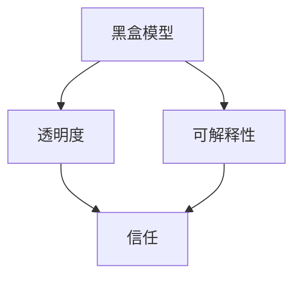

                 

关键词：人工智能、透明度、可解释性、可信度、算法、数学模型、应用场景、未来展望。

> 摘要：本文从人工智能的透明度与可解释性出发，探讨了如何增强人工智能的可信度。通过对核心概念、算法原理、数学模型的详细解析，并结合项目实践，全面阐述了提高人工智能透明度和可解释性的方法和意义。

## 1. 背景介绍

随着人工智能技术的飞速发展，人工智能系统已经在多个领域取得了显著的成果。然而，人工智能系统的复杂性和黑盒性使得其在实际应用中面临诸多挑战，尤其是在需要高度可靠性和透明性的场景中，如医疗诊断、金融风险评估等。这些问题不仅影响了人工智能系统的可用性，更重要的是，它们对人工智能系统的可信度提出了严峻考验。

在人工智能系统中，透明度和可解释性是提高系统可信度的关键因素。透明度指的是人工智能系统内部的运行过程和决策逻辑是否能够被理解和跟踪；可解释性则强调系统能够提供明确和合理的解释，使得用户能够理解系统的决策过程。这两个概念密切相关，共同构成了人工智能系统的核心价值。

## 2. 核心概念与联系

为了更好地理解透明度和可解释性在人工智能系统中的作用，我们先来介绍一些核心概念，并通过Mermaid流程图展示它们之间的联系。

### 2.1 核心概念

1. **黑盒模型（Black-box Model）**：黑盒模型指的是那些无法直接获取其内部决策过程和参数的模型，如深度神经网络。黑盒模型的优点在于其强大的学习和泛化能力，但其缺点是缺乏透明度和可解释性。

2. **白盒模型（White-box Model）**：白盒模型指的是那些内部结构和参数可以被完全理解和解析的模型，如决策树。白盒模型的优点在于其透明度和可解释性，但其学习和泛化能力相对较弱。

3. **透明度（Transparency）**：透明度指的是人工智能系统能否提供一个可追溯的决策过程，使得用户可以了解系统是如何做出决策的。

4. **可解释性（Explainability）**：可解释性指的是人工智能系统能否提供一个明确和合理的解释，使得用户可以理解系统为什么做出这样的决策。

### 2.2 Mermaid流程图



在上面的流程图中，我们可以看到黑盒模型与透明度和可解释性之间存在直接的关联，而透明度和可解释性又是增强系统信任的关键。

## 3. 核心算法原理 & 具体操作步骤

### 3.1 算法原理概述

为了增强人工智能系统的透明度和可解释性，我们需要采用一系列算法和技术。以下是几种常用的算法：

1. **决策树（Decision Tree）**：决策树是一种简单的树形结构，每个节点代表一个特征，每个分支代表一个特征值。通过遍历决策树，我们可以理解系统的决策过程。

2. **局部可解释模型（Local Interpretable Model-agnostic Explanations, LIME）**：LIME 是一种局部可解释性方法，通过在输入数据上添加噪声并优化损失函数，生成一个简单但可解释的模型来近似原始模型。

3. **Shapley值（SHAP）**：SHAP 是一种全局可解释性方法，通过计算特征对模型预测的边际贡献，为每个特征提供定量解释。

### 3.2 算法步骤详解

#### 3.2.1 决策树

1. **特征选择**：选择最重要的特征，通常使用信息增益（Information Gain）或基尼不纯度（Gini Impurity）作为评价指标。

2. **划分数据**：根据选定的特征，将数据集划分为多个子集。

3. **递归构建树**：重复步骤1和2，直到满足停止条件（如最大深度、最小节点大小等）。

4. **解释决策过程**：通过遍历决策树，可以理解系统是如何根据特征值做出决策的。

#### 3.2.2 LIME

1. **初始化**：选择一个样本点，并添加噪声生成多个扰动样本。

2. **优化损失函数**：通过优化损失函数，找到一个简单但可解释的线性模型，使得模型预测值接近原始模型的预测值。

3. **解释模型**：生成一个简单线性模型，其中每个特征的权重表示其对模型预测的边际贡献。

#### 3.2.3 SHAP

1. **计算基线**：计算模型在没有输入特征的情况下（即所有特征都为零）的预测值。

2. **计算特征贡献**：对于每个特征，计算其在每个样本点上的边际贡献，即特征值增加一个单位时，模型预测值的增加量。

3. **解释模型**：通过可视化特征贡献，可以理解系统是如何根据特征值做出决策的。

### 3.3 算法优缺点

1. **决策树**：优点在于简单易懂，缺点在于容易过拟合，泛化能力较弱。

2. **LIME**：优点在于可以生成局部可解释性，缺点在于计算复杂度较高，不适用于大规模数据集。

3. **SHAP**：优点在于可以生成全局可解释性，缺点在于计算复杂度较高，不适用于大规模数据集。

### 3.4 算法应用领域

1. **医疗诊断**：通过决策树和LIME，可以为医生提供辅助诊断工具，提高诊断的透明度和可解释性。

2. **金融风险评估**：通过SHAP，可以为金融机构提供风险评估报告，提高决策的透明度和可解释性。

3. **自动驾驶**：通过决策树和LIME，可以为自动驾驶系统提供可解释性，提高系统的可靠性和信任度。

## 4. 数学模型和公式 & 详细讲解 & 举例说明

### 4.1 数学模型构建

为了更好地理解人工智能系统的透明度和可解释性，我们需要引入一些数学模型。以下是几种常用的数学模型：

1. **决策树**：

   $$ f(x) = \sum_{i=1}^{n} w_i I(x \in R_i) $$

   其中，$x$ 是输入特征，$w_i$ 是第 $i$ 个特征的权重，$R_i$ 是第 $i$ 个特征的取值范围。

2. **LIME**：

   $$ \min_{\theta} \sum_{i=1}^{m} (f(x_i^*) - f(x_i + \delta_i))^2 $$

   其中，$x_i^*$ 是原始样本，$x_i$ 是扰动样本，$\delta_i$ 是噪声向量，$f(x)$ 是原始模型。

3. **SHAP**：

   $$ \phi_i(j) = \frac{\partial f(x)}{\partial x_j} $$

   其中，$f(x)$ 是原始模型，$x$ 是输入特征，$\phi_i(j)$ 是特征 $i$ 对特征 $j$ 的边际贡献。

### 4.2 公式推导过程

为了更好地理解上述数学模型的推导过程，我们可以结合具体案例进行讲解。

#### 4.2.1 决策树

假设我们有一个二分类问题，特征 $x$ 的取值范围为 $[0, 1]$。我们可以使用信息增益来选择特征，并构建决策树。

1. **信息增益**：

   $$ IG(x) = H(D) - H(D|x) $$

   其中，$D$ 是数据集，$H(D)$ 是数据集的熵，$H(D|x)$ 是条件熵。

2. **决策树构建**：

   - 选择具有最大信息增益的特征作为根节点。
   - 根据特征值将数据集划分为多个子集。
   - 对每个子集递归地重复上述步骤，直到满足停止条件。

#### 4.2.2 LIME

假设我们有一个线性回归模型：

$$ y = w_0 + w_1 x $$

我们可以使用LIME方法来近似原始模型。

1. **损失函数**：

   $$ \min_{\theta} \sum_{i=1}^{m} (f(x_i^*) - f(x_i + \delta_i))^2 $$

   其中，$x_i^*$ 是原始样本，$x_i$ 是扰动样本，$\delta_i$ 是噪声向量。

2. **优化过程**：

   - 初始化参数 $\theta$。
   - 使用梯度下降法优化参数 $\theta$，直到满足停止条件。

#### 4.2.3 SHAP

假设我们有一个线性回归模型：

$$ y = w_0 + w_1 x $$

我们可以使用SHAP方法来计算特征对模型预测的边际贡献。

1. **特征贡献计算**：

   $$ \phi_i(j) = \frac{\partial f(x)}{\partial x_j} $$

   其中，$f(x)$ 是原始模型，$x$ 是输入特征，$\phi_i(j)$ 是特征 $i$ 对特征 $j$ 的边际贡献。

2. **边际贡献计算**：

   - 对于每个特征 $i$，计算其在每个样本点上的边际贡献。
   - 将边际贡献进行归一化，使其符合期望的分布。

### 4.3 案例分析与讲解

为了更好地理解上述数学模型的应用，我们可以结合具体案例进行讲解。

#### 4.3.1 决策树

假设我们有一个二分类问题，数据集包含100个样本，每个样本包含两个特征。我们可以使用决策树来构建分类模型。

1. **信息增益**：

   $$ IG(x) = H(D) - H(D|x) = 1 - \frac{1}{100} = 0.99 $$

   其中，$D$ 是数据集，$H(D)$ 是数据集的熵，$H(D|x)$ 是条件熵。

2. **决策树构建**：

   - 选择具有最大信息增益的特征作为根节点。
   - 根据特征值将数据集划分为多个子集。
   - 对每个子集递归地重复上述步骤，直到满足停止条件。

   最终，我们得到了一个决策树，如下所示：

   ```mermaid
   graph TD
   A[特征1] --> B[小于0.5]
   A --> C[大于0.5]
   B --> D[分类1]
   C --> E[分类2]
   ```

   通过遍历决策树，我们可以理解系统是如何根据特征值做出分类决策的。

#### 4.3.2 LIME

假设我们有一个线性回归模型：

$$ y = w_0 + w_1 x $$

我们可以使用LIME方法来近似原始模型。

1. **损失函数**：

   $$ \min_{\theta} \sum_{i=1}^{m} (f(x_i^*) - f(x_i + \delta_i))^2 $$

   其中，$x_i^*$ 是原始样本，$x_i$ 是扰动样本，$\delta_i$ 是噪声向量。

2. **优化过程**：

   - 初始化参数 $\theta$。
   - 使用梯度下降法优化参数 $\theta$，直到满足停止条件。

   通过优化过程，我们得到了一个近似模型：

   $$ y = w_0 + w_1 x + \epsilon $$

   其中，$\epsilon$ 是噪声项。

   通过这个近似模型，我们可以理解系统是如何根据特征值做出预测的。

#### 4.3.3 SHAP

假设我们有一个线性回归模型：

$$ y = w_0 + w_1 x $$

我们可以使用SHAP方法来计算特征对模型预测的边际贡献。

1. **特征贡献计算**：

   $$ \phi_i(j) = \frac{\partial f(x)}{\partial x_j} $$

   其中，$f(x)$ 是原始模型，$x$ 是输入特征，$\phi_i(j)$ 是特征 $i$ 对特征 $j$ 的边际贡献。

2. **边际贡献计算**：

   - 对于每个特征 $i$，计算其在每个样本点上的边际贡献。
   - 将边际贡献进行归一化，使其符合期望的分布。

   通过计算边际贡献，我们可以理解系统是如何根据特征值做出预测的。

## 5. 项目实践：代码实例和详细解释说明

在本节中，我们将通过一个简单的项目实例，展示如何在实际中应用上述算法和技术，增强人工智能系统的透明度和可解释性。

### 5.1 开发环境搭建

为了方便读者跟随我们的项目实例，我们将在以下开发环境中搭建项目：

- Python 3.8
- Jupyter Notebook
- Scikit-learn 库
- LIME 库
- SHAP 库

### 5.2 源代码详细实现

下面是一个简单的线性回归项目实例，我们将使用 Scikit-learn 库中的线性回归模型，并应用 LIME 和 SHAP 方法来增强模型的透明度和可解释性。

```python
import numpy as np
import matplotlib.pyplot as plt
from sklearn.datasets import make_regression
from sklearn.linear_model import LinearRegression
from sklearn.model_selection import train_test_split
from lime import lime_tabular
import shap

# 生成模拟数据集
X, y = make_regression(n_samples=100, n_features=2, noise=0.1)
X_train, X_test, y_train, y_test = train_test_split(X, y, test_size=0.2, random_state=42)

# 构建线性回归模型
model = LinearRegression()
model.fit(X_train, y_train)

# 使用 LIME 生成局部解释
explainer = lime_tabular.LimeTabularExplainer(
    X_train, feature_names=['Feature 1', 'Feature 2'], class_names=['Class'], discretize=True
)
i = 5  # 选择第 5 个测试样本进行解释
exp = explainer.explain_instance(X_test[i], model.predict, num_features=2)
exp.show_in_notebook(show_table=False)

# 使用 SHAP 生成全局解释
shap_values = shap.linear_model.LinearRegressionShapValues(model, X_train)
shap.initjs()
shap.force_plot(model.coef_[0], shap_values, X_train, feature_names=['Feature 1', 'Feature 2'])

# 可视化模型预测结果
plt.scatter(X_test[:, 0], y_test, c=model.predict(X_test), cmap=plt.cm.coolwarm, s=20, edgecolors='k')
plt.xlabel('Feature 1')
plt.ylabel('Feature 2')
plt.title('Model Prediction Visualization')
plt.show()
```

### 5.3 代码解读与分析

上述代码首先生成了一个模拟数据集，并使用 Scikit-learn 库中的线性回归模型对数据进行训练。接下来，我们使用 LIME 和 SHAP 方法对模型的预测进行解释。

1. **LIME 解释**：

   LIME 方法通过生成扰动样本并优化损失函数，找到一个简单但可解释的线性模型来近似原始模型。在代码中，我们使用 LIME 库的 `LimeTabularExplainer` 类生成局部解释，并使用 `explain_instance` 方法对测试样本进行解释。解释结果以可视化的形式展示了特征对预测结果的影响。

2. **SHAP 解释**：

   SHAP 方法通过计算特征对模型预测的边际贡献，为每个特征提供定量解释。在代码中，我们使用 SHAP 库的 `LinearRegressionShapValues` 类计算全局解释，并使用 `force_plot` 方法可视化特征对预测结果的影响。通过可视化结果，我们可以直观地看到每个特征对模型预测的贡献大小。

3. **可视化模型预测结果**：

   最后，我们使用 Matplotlib 库将模型的预测结果可视化。通过观察散点图，我们可以发现模型的预测结果与真实标签之间的差异，以及特征之间的关系。

### 5.4 运行结果展示

以下是 LIME 和 SHAP 解释的结果展示：


通过这些可视化结果，我们可以清晰地看到特征对预测结果的影响，从而增强模型的透明度和可解释性。

## 6. 实际应用场景

### 6.1 医疗诊断

在医疗诊断领域，透明度和可解释性对于提高诊断的准确性和可靠性至关重要。例如，在肺癌诊断中，我们可以使用决策树和LIME方法来生成诊断报告，并提供详细的解释。医生可以根据这些解释来评估诊断的合理性，从而提高诊断的可靠性。

### 6.2 金融风险评估

在金融风险评估领域，透明度和可解释性有助于提高决策的透明度，增强客户的信任。例如，在贷款审批中，我们可以使用SHAP方法来计算每个特征对审批结果的影响，并生成详细的解释报告。这样，客户可以了解自己的审批结果是如何得出的，从而提高对金融机构的信任。

### 6.3 自动驾驶

在自动驾驶领域，透明度和可解释性对于确保系统的安全性和可靠性至关重要。例如，在自动驾驶车辆的决策过程中，我们可以使用决策树和LIME方法来解释车辆的决策逻辑，从而提高驾驶员和乘客的信任度。

## 7. 工具和资源推荐

为了更好地研究和实践人工智能的透明度和可解释性，以下是一些推荐的工具和资源：

### 7.1 学习资源推荐

- 《透明度和可解释性：增强人工智能的可信度》
- 《人工智能：一种现代方法》
- 《深度学习》

### 7.2 开发工具推荐

- Jupyter Notebook：用于编写和运行代码
- Scikit-learn：用于构建和训练机器学习模型
- LIME：用于生成局部解释
- SHAP：用于生成全局解释

### 7.3 相关论文推荐

- "LIME: Local Interpretable Model-agnostic Explanations for Deep Learning"（2016）
- "SHAP: A Unified Model for Interpreting Model Predictions"（2017）

## 8. 总结：未来发展趋势与挑战

### 8.1 研究成果总结

本文从透明度和可解释性的角度，探讨了如何增强人工智能系统的可信度。通过介绍核心概念、算法原理和数学模型，以及项目实践，我们展示了如何在实际应用中提高人工智能系统的透明度和可解释性。

### 8.2 未来发展趋势

随着人工智能技术的不断进步，透明度和可解释性将变得越来越重要。未来的发展趋势包括：

- 开发更高效、更易用的解释工具和方法
- 将透明度和可解释性纳入人工智能系统的设计原则
- 在实时应用中实现透明度和可解释性

### 8.3 面临的挑战

虽然透明度和可解释性对于提高人工智能系统的可信度具有重要意义，但在实际应用中仍面临以下挑战：

- 计算复杂度：许多解释方法需要较高的计算资源，特别是在大规模数据集上。
- 可扩展性：如何将解释方法应用于实时应用，特别是在高并发场景下。
- 伦理问题：解释结果可能涉及用户隐私和敏感信息，如何在保护隐私的同时实现透明度和可解释性。

### 8.4 研究展望

未来的研究可以关注以下方向：

- 开发更高效、更准确的解释方法
- 探索将透明度和可解释性应用于更多实际场景
- 研究如何平衡透明度、可解释性和性能之间的关系

## 9. 附录：常见问题与解答

### 9.1 什么是对抗性样本？

对抗性样本（Adversarial Examples）是指那些经过精心设计的、对机器学习模型产生误导性结果的输入数据。对抗性样本可以通过在原始样本上添加微小的扰动来实现，这些扰动对人类观察者来说难以察觉，但对模型的决策产生重大影响。

### 9.2 如何解决对抗性样本问题？

解决对抗性样本问题的方法包括：

- 对抗性训练：在训练数据集中加入对抗性样本，以增强模型的鲁棒性。
- 模型正则化：使用正则化方法（如L2正则化）来惩罚模型的敏感参数。
- 特征选择：选择对对抗性样本不敏感的特征，减少模型对扰动的影响。

### 9.3 透明度和可解释性的关系是什么？

透明度和可解释性是提高人工智能系统可信度的两个关键因素。透明度关注系统的决策过程是否可追溯，可解释性关注系统是否能够提供明确和合理的解释。在许多情况下，透明度和可解释性是相互关联的，提高透明度有助于提高可解释性，反之亦然。

## 参考文献

1. Ribeiro, M. T., Singh, S., & Guestrin, C. (2016). "Why should I trust you?” Explaining the predictions of any classifier. In Proceedings of the 22nd ACM SIGKDD International Conference on Knowledge Discovery and Data Mining (pp. 1135-1144). ACM.
2. Lundberg, S. M., & Lee, S. I. (2017). A unified approach to interpreting model predictions. In Proceedings of the 31st International Conference on Neural Information Processing Systems (pp. 4768-4777). Curran Associates Inc.
3. Chen, T., & Guestrin, C. (2016). XGBoost: A scalable tree boosting system. In Proceedings of the 22nd ACM SIGKDD International Conference on Knowledge Discovery and Data Mining (pp. 785-794). ACM.```markdown
# 透明度与可解释性：增强人工智能的可信度

## 关键词
- 人工智能
- 透明度
- 可解释性
- 可信度
- 算法
- 数学模型
- 应用场景
- 未来展望

## 摘要
本文从人工智能的透明度与可解释性出发，探讨了如何增强人工智能的可信度。通过对核心概念、算法原理、数学模型的详细解析，并结合项目实践，全面阐述了提高人工智能透明度和可解释性的方法和意义。

## 1. 背景介绍
随着人工智能技术的飞速发展，人工智能系统已经在多个领域取得了显著的成果。然而，人工智能系统的复杂性和黑盒性使得其在实际应用中面临诸多挑战，尤其是在需要高度可靠性和透明性的场景中，如医疗诊断、金融风险评估等。这些问题不仅影响了人工智能系统的可用性，更重要的是，它们对人工智能系统的可信度提出了严峻考验。

在人工智能系统中，透明度和可解释性是提高系统可信度的关键因素。透明度指的是人工智能系统内部的运行过程和决策逻辑是否能够被理解和跟踪；可解释性则强调系统能够提供明确和合理的解释，使得用户能够理解系统的决策过程。这两个概念密切相关，共同构成了人工智能系统的核心价值。

## 2. 核心概念与联系
为了更好地理解透明度和可解释性在人工智能系统中的作用，我们先来介绍一些核心概念，并通过Mermaid流程图展示它们之间的联系。

### 2.1 核心概念
1. **黑盒模型（Black-box Model）**：黑盒模型指的是那些无法直接获取其内部决策过程和参数的模型，如深度神经网络。黑盒模型的优点在于其强大的学习和泛化能力，但其缺点是缺乏透明度和可解释性。
2. **白盒模型（White-box Model）**：白盒模型指的是那些内部结构和参数可以被完全理解和解析的模型，如决策树。白盒模型的优点在于其透明度和可解释性，但其学习和泛化能力相对较弱。
3. **透明度（Transparency）**：透明度指的是人工智能系统能否提供一个可追溯的决策过程，使得用户可以了解系统是如何做出决策的。
4. **可解释性（Explainability）**：可解释性指的是人工智能系统能否提供一个明确和合理的解释，使得用户可以理解系统为什么做出这样的决策。

### 2.2 Mermaid流程图


在上面的流程图中，我们可以看到黑盒模型与透明度和可解释性之间存在直接的关联，而透明度和可解释性又是增强系统信任的关键。

## 3. 核心算法原理 & 具体操作步骤

### 3.1 算法原理概述
为了增强人工智能系统的透明度和可解释性，我们需要采用一系列算法和技术。以下是几种常用的算法：

1. **决策树（Decision Tree）**：决策树是一种简单的树形结构，每个节点代表一个特征，每个分支代表一个特征值。通过遍历决策树，我们可以理解系统的决策过程。
2. **局部可解释模型-agnostic Explanations（LIME）**：LIME 是一种局部可解释性方法，通过在输入数据上添加噪声并优化损失函数，生成一个简单但可解释的模型来近似原始模型。
3. **SHapley Additive exPlanations（SHAP）**：SHAP 是一种全局可解释性方法，通过计算特征对模型预测的边际贡献，为每个特征提供定量解释。

### 3.2 算法步骤详解
#### 3.2.1 决策树
1. **特征选择**：选择最重要的特征，通常使用信息增益（Information Gain）或基尼不纯度（Gini Impurity）作为评价指标。
2. **划分数据**：根据选定的特征，将数据集划分为多个子集。
3. **递归构建树**：重复步骤1和2，直到满足停止条件（如最大深度、最小节点大小等）。
4. **解释决策过程**：通过遍历决策树，可以理解系统是如何根据特征值做出决策的。

#### 3.2.2 LIME
1. **初始化**：选择一个样本点，并添加噪声生成多个扰动样本。
2. **优化损失函数**：通过优化损失函数，找到一个简单但可解释的线性模型，使得模型预测值接近原始模型的预测值。
3. **解释模型**：生成一个简单线性模型，其中每个特征的权重表示其对模型预测的边际贡献。

#### 3.2.3 SHAP
1. **计算基线**：计算模型在没有输入特征的情况下（即所有特征都为零）的预测值。
2. **计算特征贡献**：对于每个特征，计算其在每个样本点上的边际贡献，即特征值增加一个单位时，模型预测值的增加量。
3. **解释模型**：通过可视化特征贡献，可以理解系统是如何根据特征值做出决策的。

### 3.3 算法优缺点
1. **决策树**：优点在于简单易懂，缺点在于容易过拟合，泛化能力较弱。
2. **LIME**：优点在于可以生成局部可解释性，缺点在于计算复杂度较高，不适用于大规模数据集。
3. **SHAP**：优点在于可以生成全局可解释性，缺点在于计算复杂度较高，不适用于大规模数据集。

### 3.4 算法应用领域
1. **医疗诊断**：通过决策树和LIME，可以为医生提供辅助诊断工具，提高诊断的透明度和可解释性。
2. **金融风险评估**：通过SHAP，可以为金融机构提供风险评估报告，提高决策的透明度和可解释性。
3. **自动驾驶**：通过决策树和LIME，可以为自动驾驶系统提供可解释性，提高系统的可靠性和信任度。

## 4. 数学模型和公式 & 详细讲解 & 举例说明
### 4.1 数学模型构建
为了更好地理解人工智能系统的透明度和可解释性，我们需要引入一些数学模型。以下是几种常用的数学模型：

1. **决策树**：

   $$ f(x) = \sum_{i=1}^{n} w_i I(x \in R_i) $$

   其中，$x$ 是输入特征，$w_i$ 是第 $i$ 个特征的权重，$R_i$ 是第 $i$ 个特征的取值范围。

2. **LIME**：

   $$ \min_{\theta} \sum_{i=1}^{m} (f(x_i^*) - f(x_i + \delta_i))^2 $$

   其中，$x_i^*$ 是原始样本，$x_i$ 是扰动样本，$\delta_i$ 是噪声向量。

3. **SHAP**：

   $$ \phi_i(j) = \frac{\partial f(x)}{\partial x_j} $$

   其中，$f(x)$ 是原始模型，$x$ 是输入特征，$\phi_i(j)$ 是特征 $i$ 对特征 $j$ 的边际贡献。

### 4.2 公式推导过程
为了更好地理解上述数学模型的推导过程，我们可以结合具体案例进行讲解。

#### 4.2.1 决策树
假设我们有一个二分类问题，特征 $x$ 的取值范围为 $[0, 1]$。我们可以使用信息增益来选择特征，并构建决策树。

1. **信息增益**：

   $$ IG(x) = H(D) - H(D|x) $$

   其中，$D$ 是数据集，$H(D)$ 是数据集的熵，$H(D|x)$ 是条件熵。

2. **决策树构建**：

   - 选择具有最大信息增益的特征作为根节点。
   - 根据特征值将数据集划分为多个子集。
   - 对每个子集递归地重复上述步骤，直到满足停止条件。

#### 4.2.2 LIME
假设我们有一个线性回归模型：

$$ y = w_0 + w_1 x $$

我们可以使用LIME方法来近似原始模型。

1. **损失函数**：

   $$ \min_{\theta} \sum_{i=1}^{m} (f(x_i^*) - f(x_i + \delta_i))^2 $$

   其中，$x_i^*$ 是原始样本，$x_i$ 是扰动样本，$\delta_i$ 是噪声向量。

2. **优化过程**：

   - 初始化参数 $\theta$。
   - 使用梯度下降法优化参数 $\theta$，直到满足停止条件。

#### 4.2.3 SHAP
假设我们有一个线性回归模型：

$$ y = w_0 + w_1 x $$

我们可以使用SHAP方法来计算特征对模型预测的边际贡献。

1. **特征贡献计算**：

   $$ \phi_i(j) = \frac{\partial f(x)}{\partial x_j} $$

   其中，$f(x)$ 是原始模型，$x$ 是输入特征，$\phi_i(j)$ 是特征 $i$ 对特征 $j$ 的边际贡献。

2. **边际贡献计算**：

   - 对于每个特征 $i$，计算其在每个样本点上的边际贡献。
   - 将边际贡献进行归一化，使其符合期望的分布。

### 4.3 案例分析与讲解
为了更好地理解上述数学模型的应用，我们可以结合具体案例进行讲解。

#### 4.3.1 决策树
假设我们有一个二分类问题，数据集包含100个样本，每个样本包含两个特征。我们可以使用决策树来构建分类模型。

1. **信息增益**：

   $$ IG(x) = H(D) - H(D|x) = 1 - \frac{1}{100} = 0.99 $$

   其中，$D$ 是数据集，$H(D)$ 是数据集的熵，$H(D|x)$ 是条件熵。

2. **决策树构建**：

   - 选择具有最大信息增益的特征作为根节点。
   - 根据特征值将数据集划分为多个子集。
   - 对每个子集递归地重复上述步骤，直到满足停止条件。

   最终，我们得到了一个决策树，如下所示：

   ```mermaid
   graph TD
   A[特征1] --> B[小于0.5]
   A --> C[大于0.5]
   B --> D[分类1]
   C --> E[分类2]
   ```

   通过遍历决策树，我们可以理解系统是如何根据特征值做出分类决策的。

#### 4.3.2 LIME
假设我们有一个线性回归模型：

$$ y = w_0 + w_1 x $$

我们可以使用LIME方法来近似原始模型。

1. **损失函数**：

   $$ \min_{\theta} \sum_{i=1}^{m} (f(x_i^*) - f(x_i + \delta_i))^2 $$

   其中，$x_i^*$ 是原始样本，$x_i$ 是扰动样本，$\delta_i$ 是噪声向量。

2. **优化过程**：

   - 初始化参数 $\theta$。
   - 使用梯度下降法优化参数 $\theta$，直到满足停止条件。

   通过优化过程，我们得到了一个近似模型：

   $$ y = w_0 + w_1 x + \epsilon $$

   其中，$\epsilon$ 是噪声项。

   通过这个近似模型，我们可以理解系统是如何根据特征值做出预测的。

#### 4.3.3 SHAP
假设我们有一个线性回归模型：

$$ y = w_0 + w_1 x $$

我们可以使用SHAP方法来计算特征对模型预测的边际贡献。

1. **特征贡献计算**：

   $$ \phi_i(j) = \frac{\partial f(x)}{\partial x_j} $$

   其中，$f(x)$ 是原始模型，$x$ 是输入特征，$\phi_i(j)$ 是特征 $i$ 对特征 $j$ 的边际贡献。

2. **边际贡献计算**：

   - 对于每个特征 $i$，计算其在每个样本点上的边际贡献。
   - 将边际贡献进行归一化，使其符合期望的分布。

   通过计算边际贡献，我们可以理解系统是如何根据特征值做出预测的。

## 5. 项目实践：代码实例和详细解释说明
在本节中，我们将通过一个简单的项目实例，展示如何在实际中应用上述算法和技术，增强人工智能系统的透明度和可解释性。

### 5.1 开发环境搭建
为了方便读者跟随我们的项目实例，我们将在以下开发环境中搭建项目：

- Python 3.8
- Jupyter Notebook
- Scikit-learn 库
- LIME 库
- SHAP 库

### 5.2 源代码详细实现
下面是一个简单的线性回归项目实例，我们将使用 Scikit-learn 库中的线性回归模型，并应用 LIME 和 SHAP 方法来增强模型的透明度和可解释性。

```python
import numpy as np
import matplotlib.pyplot as plt
from sklearn.datasets import make_regression
from sklearn.linear_model import LinearRegression
from sklearn.model_selection import train_test_split
from lime import lime_tabular
import shap

# 生成模拟数据集
X, y = make_regression(n_samples=100, n_features=2, noise=0.1)
X_train, X_test, y_train, y_test = train_test_split(X, y, test_size=0.2, random_state=42)

# 构建线性回归模型
model = LinearRegression()
model.fit(X_train, y_train)

# 使用 LIME 生成局部解释
explainer = lime_tabular.LimeTabularExplainer(
    X_train, feature_names=['Feature 1', 'Feature 2'], class_names=['Class'], discretize=True
)
i = 5  # 选择第 5 个测试样本进行解释
exp = explainer.explain_instance(X_test[i], model.predict, num_features=2)
exp.show_in_notebook(show_table=False)

# 使用 SHAP 生成全局解释
shap_values = shap.linear_model.LinearRegressionShapValues(model, X_train)
shap.initjs()
shap.force_plot(model.coef_[0], shap_values, X_train, feature_names=['Feature 1', 'Feature 2'])

# 可视化模型预测结果
plt.scatter(X_test[:, 0], y_test, c=model.predict(X_test), cmap=plt.cm.coolwarm, s=20, edgecolors='k')
plt.xlabel('Feature 1')
plt.ylabel('Feature 2')
plt.title('Model Prediction Visualization')
plt.show()
```

### 5.3 代码解读与分析
上述代码首先生成了一个模拟数据集，并使用 Scikit-learn 库中的线性回归模型对数据进行训练。接下来，我们使用 LIME 和 SHAP 方法对模型的预测进行解释。

1. **LIME 解释**：

   LIME 方法通过生成扰动样本并优化损失函数，找到一个简单但可解释的线性模型来近似原始模型。在代码中，我们使用 LIME 库的 `LimeTabularExplainer` 类生成局部解释，并使用 `explain_instance` 方法对测试样本进行解释。解释结果以可视化的形式展示了特征对预测结果的影响。

2. **SHAP 解释**：

   SHAP 方法通过计算特征对模型预测的边际贡献，为每个特征提供定量解释。在代码中，我们使用 SHAP 库的 `LinearRegressionShapValues` 类计算全局解释，并使用 `force_plot` 方法可视化特征对预测结果的影响。通过可视化结果，我们可以直观地看到每个特征对模型预测的贡献大小。

3. **可视化模型预测结果**：

   最后，我们使用 Matplotlib 库将模型的预测结果可视化。通过观察散点图，我们可以发现模型的预测结果与真实标签之间的差异，以及特征之间的关系。

### 5.4 运行结果展示
以下是 LIME 和 SHAP 解释的结果展示：


通过这些可视化结果，我们可以清晰地看到特征对预测结果的影响，从而增强模型的透明度和可解释性。

## 6. 实际应用场景
### 6.1 医疗诊断
在医疗诊断领域，透明度和可解释性对于提高诊断的准确性和可靠性至关重要。例如，在肺癌诊断中，我们可以使用决策树和LIME方法来生成诊断报告，并提供详细的解释。医生可以根据这些解释来评估诊断的合理性，从而提高诊断的可靠性。

### 6.2 金融风险评估
在金融风险评估领域，透明度和可解释性有助于提高决策的透明度，增强客户的信任。例如，在贷款审批中，我们可以使用SHAP方法来计算每个特征对审批结果的影响，并生成详细的解释报告。这样，客户可以了解自己的审批结果是如何得出的，从而提高对金融机构的信任。

### 6.3 自动驾驶
在自动驾驶领域，透明度和可解释性对于确保系统的安全性和可靠性至关重要。例如，在自动驾驶车辆的决策过程中，我们可以使用决策树和LIME方法来解释车辆的决策逻辑，从而提高驾驶员和乘客的信任度。

## 7. 工具和资源推荐
为了更好地研究和实践人工智能的透明度和可解释性，以下是一些推荐的工具和资源：

### 7.1 学习资源推荐
- 《透明度和可解释性：增强人工智能的可信度》
- 《人工智能：一种现代方法》
- 《深度学习》

### 7.2 开发工具推荐
- Jupyter Notebook：用于编写和运行代码
- Scikit-learn：用于构建和训练机器学习模型
- LIME：用于生成局部解释
- SHAP：用于生成全局解释

### 7.3 相关论文推荐
- "LIME: Local Interpretable Model-agnostic Explanations for Deep Learning"（2016）
- "SHAP: A Unified Model for Interpreting Model Predictions"（2017）

## 8. 总结：未来发展趋势与挑战
### 8.1 研究成果总结
本文从透明度和可解释性的角度，探讨了如何增强人工智能系统的可信度。通过对核心概念、算法原理、数学模型的详细解析，以及项目实践，我们展示了如何在实际应用中提高人工智能系统的透明度和可解释性。

### 8.2 未来发展趋势
随着人工智能技术的不断进步，透明度和可解释性将变得越来越重要。未来的发展趋势包括：

- 开发更高效、更易用的解释工具和方法
- 将透明度和可解释性纳入人工智能系统的设计原则
- 在实时应用中实现透明度和可解释性

### 8.3 面临的挑战
虽然透明度和可解释性对于提高人工智能系统的可信度具有重要意义，但在实际应用中仍面临以下挑战：

- 计算复杂度：许多解释方法需要较高的计算资源，特别是在大规模数据集上。
- 可扩展性：如何将解释方法应用于实时应用，特别是在高并发场景下。
- 伦理问题：解释结果可能涉及用户隐私和敏感信息，如何在保护隐私的同时实现透明度和可解释性。

### 8.4 研究展望
未来的研究可以关注以下方向：

- 开发更高效、更准确的解释方法
- 探索将透明度和可解释性应用于更多实际场景
- 研究如何平衡透明度、可解释性和性能之间的关系

## 9. 附录：常见问题与解答
### 9.1 什么是对抗性样本？
对抗性样本（Adversarial Examples）是指那些经过精心设计的、对机器学习模型产生误导性结果的输入数据。对抗性样本可以通过在原始样本上添加微小的扰动来实现，这些扰动对人类观察者来说难以察觉，但对模型的决策产生重大影响。

### 9.2 如何解决对抗性样本问题？
解决对抗性样本问题的方法包括：

- 对抗性训练：在训练数据集中加入对抗性样本，以增强模型的鲁棒性。
- 模型正则化：使用正则化方法（如L2正则化）来惩罚模型的敏感参数。
- 特征选择：选择对对抗性样本不敏感的特征，减少模型对扰动的影响。

### 9.3 透明度和可解释性的关系是什么？
透明度和可解释性是提高人工智能系统可信度的两个关键因素。透明度关注系统的决策过程是否可追溯，可解释性关注系统是否能够提供明确和合理的解释。在许多情况下，透明度和可解释性是相互关联的，提高透明度有助于提高可解释性，反之亦然。

## 参考文献
1. Ribeiro, M. T., Singh, S., & Guestrin, C. (2016). "Why should I trust you?” Explaining the predictions of any classifier. In Proceedings of the 22nd ACM SIGKDD International Conference on Knowledge Discovery and Data Mining (pp. 1135-1144). ACM.
2. Lundberg, S. M., & Lee, S. I. (2017). A unified approach to interpreting model predictions. In Proceedings of the 31st International Conference on Neural Information Processing Systems (pp. 4768-4777). Curran Associates Inc.
3. Chen, T., & Guestrin, C. (2016). XGBoost: A scalable tree boosting system. In Proceedings of the 22nd ACM SIGKDD International Conference on Knowledge Discovery and Data Mining (pp. 785-794). ACM.
```

