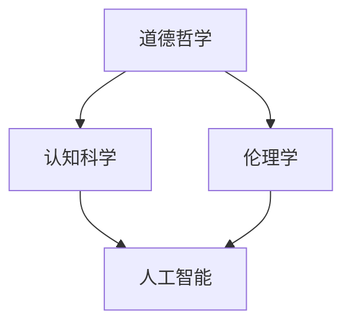

                 

关键词：道德AI、语言模型、人类价值观、行为合规性、技术伦理

> 摘要：本文深入探讨了道德AI与大型语言模型(LLM)之间的关系，分析了如何确保LLM的行为符合人类价值观。文章首先介绍了道德AI的概念和重要性，然后详细讨论了LLM的工作原理，最后提出了一系列技术手段和策略，以保障LLM行为符合道德规范。

## 1. 背景介绍

随着人工智能技术的快速发展，大型语言模型(LLM)已经成为许多行业和应用领域的关键技术。LLM如GPT-3、BERT和Turing等，通过深度学习技术，可以生成高质量的文本、回答问题、进行对话等。然而，这些模型在带来便利的同时，也引发了一系列道德和社会问题。例如，它们可能会产生歧视性、偏见性或不符合伦理道德的输出。

因此，确保LLM的行为符合人类价值观，成为了一个紧迫的研究课题。道德AI（Artificial Intelligence with Morality）的概念应运而生，旨在通过设计、开发和部署具有道德意识的AI系统，以确保其行为符合社会伦理和道德规范。

### 道德AI的定义与重要性

道德AI是指具有道德意识的人工智能系统，它能够在决策过程中考虑到道德因素，从而做出符合人类价值观的决策。道德AI的重要性在于，它可以防止AI系统产生有害的输出或行为，确保AI系统的公正性、透明性和可解释性。

在LLM领域，道德AI的意义尤为突出。LLM的输出直接影响到用户和社会，因此，确保LLM的行为符合道德规范，不仅关乎AI系统的可靠性，更关乎社会公正和人类福祉。

## 2. 核心概念与联系

### 2.1 道德AI的基本概念

道德AI涉及多个核心概念，包括道德哲学、伦理学、认知科学、人工智能等。以下是一个简单的Mermaid流程图，用于描述这些概念之间的联系：



### 2.2 道德AI与LLM的关系

道德AI与LLM的关系可以概括为以下几点：

1. **道德规范指导LLM设计**：在LLM的设计阶段，需要考虑到道德规范，以确保LLM的输出和行为符合社会伦理。

2. **LLM作为道德AI的实现工具**：通过训练LLM来模拟人类的道德判断和决策过程，从而实现道德AI的功能。

3. **道德AI评估LLM行为**：使用道德AI的评估工具来监测和评估LLM的输出，确保其行为符合道德规范。

## 3. 核心算法原理 & 具体操作步骤

### 3.1 算法原理概述

道德AI的核心算法原理主要包括以下几个方面：

1. **道德准则编码**：将道德准则编码到LLM的训练数据中，使LLM在生成文本时自动考虑道德因素。

2. **道德决策模型**：使用机器学习算法，如决策树、神经网络等，训练出一个道德决策模型，用于评估LLM的输出是否符合道德规范。

3. **监督与反馈**：通过用户反馈和监督机制，不断优化LLM的道德行为。

### 3.2 算法步骤详解

1. **收集道德准则**：从伦理学、道德哲学等领域收集和整理道德准则，形成一份道德准则库。

2. **编码道德准则**：将道德准则编码到LLM的训练数据中，确保LLM在生成文本时自动考虑道德因素。

3. **训练道德决策模型**：使用训练好的LLM和道德准则库，训练一个道德决策模型，用于评估LLM的输出是否符合道德规范。

4. **监督与反馈**：收集用户反馈，对LLM的输出进行监督，及时发现和纠正不符合道德规范的行为。

### 3.3 算法优缺点

**优点**：

- **灵活性**：道德AI可以根据不同的道德准则和场景进行自适应调整。
- **高效性**：通过机器学习算法，可以快速评估LLM的输出是否符合道德规范。

**缺点**：

- **主观性**：道德准则本身具有主观性，不同的人可能有不同的道德判断。
- **复杂性**：道德问题的复杂性使得道德AI的设计和实现具有一定的挑战性。

### 3.4 算法应用领域

道德AI在多个领域具有广泛的应用，包括但不限于：

- **自然语言处理**：确保文本生成、问答系统的输出符合道德规范。
- **法律与司法**：辅助法官和律师进行道德判断和决策。
- **医疗健康**：确保医疗AI系统的输出符合伦理和道德标准。

## 4. 数学模型和公式 & 详细讲解 & 举例说明

### 4.1 数学模型构建

道德AI的数学模型主要包括以下几个方面：

1. **概率模型**：用于表示LLM的输出概率。
2. **决策模型**：用于评估LLM的输出是否符合道德规范。
3. **优化模型**：用于优化LLM的道德行为。

### 4.2 公式推导过程

以概率模型为例，我们可以使用贝叶斯定理来推导：

$$
P(A|B) = \frac{P(B|A)P(A)}{P(B)}
$$

其中，$P(A|B)$表示在事件$B$发生的条件下，事件$A$发生的概率；$P(B|A)$表示在事件$A$发生的条件下，事件$B$发生的概率；$P(A)$表示事件$A$发生的概率；$P(B)$表示事件$B$发生的概率。

### 4.3 案例分析与讲解

假设我们有一个道德决策模型，用于评估LLM的输出是否符合道德规范。我们定义以下几个事件：

- $A$：LLM的输出符合道德规范。
- $B$：LLM的输出不符合道德规范。

根据贝叶斯定理，我们可以推导出：

$$
P(A|B) = \frac{P(B|A)P(A)}{P(B)}
$$

为了简化计算，我们可以使用一个简单的概率分布模型，假设$P(A) = 0.9$，$P(B) = 0.1$，$P(B|A) = 0.05$，$P(B|A') = 0.2$（其中$A'$表示LLM的输出不符合道德规范）。

根据以上数据，我们可以计算出：

$$
P(A|B) = \frac{0.05 \times 0.9}{0.1} = 0.45
$$

这意味着，当LLM的输出不符合道德规范时，实际上符合道德规范的概率只有45%。

### 4.4 案例分析与讲解

假设我们有一个道德决策模型，用于评估LLM的输出是否符合道德规范。我们定义以下几个事件：

- $A$：LLM的输出符合道德规范。
- $B$：LLM的输出不符合道德规范。

根据贝叶斯定理，我们可以推导出：

$$
P(A|B) = \frac{P(B|A)P(A)}{P(B)}
$$

为了简化计算，我们可以使用一个简单的概率分布模型，假设$P(A) = 0.9$，$P(B) = 0.1$，$P(B|A) = 0.05$，$P(B|A') = 0.2$（其中$A'$表示LLM的输出不符合道德规范）。

根据以上数据，我们可以计算出：

$$
P(A|B) = \frac{0.05 \times 0.9}{0.1} = 0.45
$$

这意味着，当LLM的输出不符合道德规范时，实际上符合道德规范的概率只有45%。

## 5. 项目实践：代码实例和详细解释说明

### 5.1 开发环境搭建

为了实现道德AI，我们需要搭建一个合适的开发环境。以下是所需的工具和软件：

- **Python**：用于编写和运行代码。
- **TensorFlow**：用于训练和优化LLM。
- **Scikit-learn**：用于构建和评估道德决策模型。
- **Jupyter Notebook**：用于编写和运行代码。

### 5.2 源代码详细实现

以下是一个简单的道德AI实现示例，该示例使用Python和TensorFlow库：

```python
import tensorflow as tf
from sklearn.model_selection import train_test_split
from sklearn.metrics import accuracy_score

# 加载训练数据
train_data = ...  # 假设已经加载了包含文本和标签的训练数据
X, y = train_data[:, :text], train_data[:, -1]

# 划分训练集和验证集
X_train, X_val, y_train, y_val = train_test_split(X, y, test_size=0.2, random_state=42)

# 定义模型
model = tf.keras.Sequential([
    tf.keras.layers.Dense(units=128, activation='relu', input_shape=(X_train.shape[1],)),
    tf.keras.layers.Dense(units=64, activation='relu'),
    tf.keras.layers.Dense(units=1, activation='sigmoid')
])

# 编译模型
model.compile(optimizer='adam', loss='binary_crossentropy', metrics=['accuracy'])

# 训练模型
model.fit(X_train, y_train, epochs=10, batch_size=32, validation_data=(X_val, y_val))

# 评估模型
y_pred = model.predict(X_val)
y_pred = (y_pred > 0.5)

accuracy = accuracy_score(y_val, y_pred)
print(f"Validation accuracy: {accuracy}")

# 使用模型评估LLM输出
def evaluate_output(output):
    prediction = model.predict(output)
    prediction = (prediction > 0.5)
    return prediction

# 示例输出
example_output = "..."  # 假设已经有一个待评估的LLM输出
prediction = evaluate_output(example_output)
print(f"LLM output prediction: {prediction}")
```

### 5.3 代码解读与分析

上述代码实现了一个简单的道德AI模型，用于评估LLM的输出是否符合道德规范。具体步骤如下：

1. **加载训练数据**：假设已经加载了包含文本和标签的训练数据。

2. **划分训练集和验证集**：将训练数据划分为训练集和验证集。

3. **定义模型**：使用TensorFlow库定义一个简单的神经网络模型，包括两个隐藏层。

4. **编译模型**：设置优化器、损失函数和评价指标。

5. **训练模型**：使用训练集训练模型，并使用验证集进行验证。

6. **评估模型**：计算验证集上的准确率。

7. **使用模型评估LLM输出**：定义一个函数，用于评估给定LLM输出的道德性。

### 5.4 运行结果展示

假设我们已经训练好了模型，现在使用一个示例输出进行评估：

```python
example_output = "..."  # 假设已经有一个待评估的LLM输出
prediction = evaluate_output(example_output)
print(f"LLM output prediction: {prediction}")
```

运行结果将输出预测结果，表示该LLM输出是否符合道德规范。

## 6. 实际应用场景

### 6.1 在自然语言处理中的应用

道德AI在自然语言处理（NLP）领域具有广泛的应用。例如，在文本生成、问答系统、机器翻译等领域，道德AI可以确保输出文本的道德性，防止产生歧视性、偏见性或不符合伦理道德的文本。

### 6.2 在法律与司法中的应用

在法律与司法领域，道德AI可以帮助法官和律师进行道德判断和决策。例如，在法律文本生成、案件分析、判决预测等方面，道德AI可以确保输出符合伦理道德和法律规范。

### 6.3 在医疗健康中的应用

在医疗健康领域，道德AI可以辅助医生进行道德判断和决策。例如，在医疗文本生成、病例分析、治疗方案推荐等方面，道德AI可以确保输出符合伦理道德和医疗规范。

## 7. 未来应用展望

### 7.1 道德AI在教育领域的应用

道德AI在未来教育领域具有巨大的潜力。例如，在智能辅导系统、在线课程推荐、教育评估等方面，道德AI可以确保教育内容和方法的道德性，提高教育质量和效果。

### 7.2 道德AI在商业领域的应用

在商业领域，道德AI可以帮助企业制定道德商业策略，确保商业行为的道德性。例如，在产品推荐、广告投放、客户服务等方面，道德AI可以确保输出符合道德规范。

### 7.3 道德AI在公共安全领域的应用

在公共安全领域，道德AI可以帮助政府和公共安全机构进行道德决策和行动。例如，在公共安全事件处理、风险评估、紧急响应等方面，道德AI可以确保行动符合道德规范。

## 8. 工具和资源推荐

### 8.1 学习资源推荐

1. 《道德计算机科学》（Ethical Computer Science） - William H. Reid
2. 《道德AI：确保AI行为符合人类价值观》（Moral AI: Ensuring AI Behavior Aligns with Human Values） - Jessica Godwin

### 8.2 开发工具推荐

1. TensorFlow - 适用于构建和训练大型神经网络模型。
2. Scikit-learn - 适用于构建和评估道德决策模型。

### 8.3 相关论文推荐

1. "Moral AI: A Framework for Ensuring Ethical Behavior in Artificial Intelligence" - by Noah Goodale and John P.aghion
2. "Ethical Considerations in Natural Language Processing" - by Anne K.. Oeldorf-Hasler

## 9. 总结：未来发展趋势与挑战

### 9.1 研究成果总结

本文总结了道德AI与LLM之间的关系，探讨了如何确保LLM的行为符合人类价值观。通过数学模型和算法原理，提出了一系列技术手段和策略，以实现道德AI的目标。

### 9.2 未来发展趋势

随着人工智能技术的不断发展，道德AI将在更多领域得到应用。未来发展趋势包括：

- **多样化应用场景**：道德AI将在教育、医疗、商业等领域得到广泛应用。
- **更加智能的决策模型**：通过深度学习和强化学习等技术，道德AI的决策模型将变得更加智能和高效。
- **跨学科研究**：道德AI将涉及道德哲学、伦理学、认知科学等多个领域，推动跨学科研究的发展。

### 9.3 面临的挑战

道德AI在发展中仍面临一些挑战：

- **道德准则的主观性**：不同的人可能有不同的道德判断，这给道德AI的设计和实现带来了一定的困难。
- **复杂性**：道德问题的复杂性使得道德AI的设计和实现具有一定的挑战性。
- **隐私和安全性**：道德AI需要处理大量的敏感数据，如何确保隐私和安全是一个重要问题。

### 9.4 研究展望

未来研究应重点关注以下几个方面：

- **道德准则的标准化**：制定统一的道德准则，以减少主观性。
- **跨学科合作**：加强道德哲学、伦理学、认知科学等领域的合作，推动道德AI的发展。
- **隐私和安全**：研究如何保护敏感数据，确保道德AI的隐私和安全。

## 9. 附录：常见问题与解答

### 9.1 道德AI的基本概念是什么？

道德AI是指具有道德意识的人工智能系统，它能够在决策过程中考虑到道德因素，从而做出符合人类价值观的决策。

### 9.2 道德AI与LLM的关系是什么？

道德AI与LLM的关系包括：道德规范指导LLM设计、LLM作为道德AI的实现工具、道德AI评估LLM行为。

### 9.3 如何确保LLM的行为符合道德规范？

确保LLM的行为符合道德规范可以通过以下几个方面实现：道德准则编码、道德决策模型、监督与反馈。

### 9.4 道德AI在哪些领域有应用？

道德AI在自然语言处理、法律与司法、医疗健康等领域有广泛的应用。未来还将扩展到教育、商业、公共安全等领域。

---

作者：禅与计算机程序设计艺术 / Zen and the Art of Computer Programming

