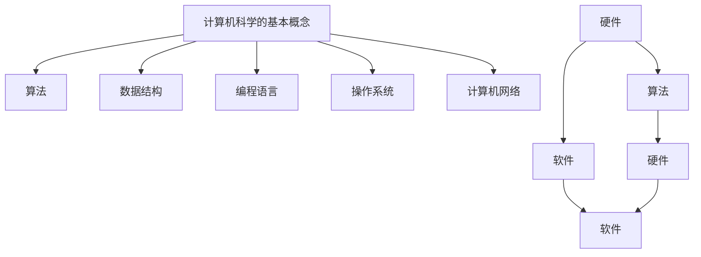

                 

关键词：计算、人类创造力、算法、计算机科学、人工智能

> 摘要：本文将深入探讨计算对人类创造力的影响，以及如何在计算机科学和人工智能的领域内，充分利用计算的力量来释放人类潜能。通过分析核心概念、算法原理、数学模型、项目实践以及应用场景，本文旨在展示计算作为释放人类创造力源泉的无限魅力。

## 1. 背景介绍

随着信息时代的到来，计算已经成为现代社会不可或缺的一部分。从最早的计算机器到现代的超级计算机，计算技术经历了巨大的演变。而与此同时，人类的创造力也在不断地被激发和挑战。计算不仅仅是一种工具，更是一种思维方式，它深刻地影响着我们的工作、学习和生活方式。

本文旨在探讨计算如何成为释放人类创造力的源泉。首先，我们将回顾计算的历史，探讨其对人类创造力的影响。然后，我们将深入讨论计算的核心概念，包括算法、数据结构和数学模型。接下来，我们将介绍一些核心算法的原理和具体操作步骤，并通过实际项目实践，展示如何将这些算法应用于实际问题中。最后，我们将探讨计算在各个领域的应用场景，并展望其未来的发展前景。

## 2. 核心概念与联系

### 2.1 计算机科学的基本概念

计算机科学是一门多学科交叉的学科，涉及到数学、工程学、心理学、哲学等多个领域。计算机科学的核心概念包括算法、数据结构、编程语言、操作系统、计算机网络等。这些概念相互关联，共同构成了计算机科学的基本框架。

算法是计算机科学的核心，它是一系列解决问题的指令或步骤。算法的效率直接影响着计算机的性能。数据结构则是存储和组织数据的方式，常见的有数组、链表、树、图等。编程语言则是用于编写算法的工具，它们提供了不同的语法和语义，使得程序员可以更高效地实现算法。操作系统负责管理计算机硬件和软件资源，计算机网络则实现了计算机之间的通信。

### 2.2 计算机科学的核心架构

计算机科学的核心架构可以分为三个层次：硬件、软件和算法。

- **硬件**：硬件是计算机的基础，包括中央处理器（CPU）、内存、硬盘等。硬件的性能直接影响着计算机的计算速度和存储能力。
- **软件**：软件是计算机的灵魂，包括操作系统、应用程序等。软件通过硬件实现了各种功能，使得计算机可以执行复杂的任务。
- **算法**：算法是计算机科学的核心，它决定了计算机解决问题的能力。高效的算法可以提高计算机的性能，优化资源的利用。

### 2.3 计算机科学的发展历程

计算机科学的发展历程可以分为几个重要阶段：

- **早期阶段**：从第一台计算机的诞生开始，计算机科学经历了从无到有的过程。这个阶段的主要成就包括冯·诺依曼架构的提出、汇编语言的发明等。
- **中期阶段**：计算机科学进入了快速发展期，软件和硬件技术取得了巨大的进步。这个阶段的主要成就包括操作系统的发展、数据库系统的出现、网络通信的实现等。
- **现代阶段**：计算机科学进入了智能化时代，人工智能、大数据、云计算等新兴技术成为了研究热点。这个阶段的主要成就包括深度学习的突破、自动驾驶技术的发展、量子计算的兴起等。

### 2.4 计算机科学的核心概念原理和架构 Mermaid 流程图



## 3. 核心算法原理 & 具体操作步骤

### 3.1 算法原理概述

算法是计算机科学的核心，它是一系列解决问题的指令或步骤。算法的效率直接影响着计算机的性能。高效的算法可以提高计算机的运行速度，优化资源的利用。

算法可以分为多个类别，如排序算法、搜索算法、图算法等。每种算法都有其独特的原理和应用场景。例如，排序算法主要用于对数据进行排序，常见的排序算法有快速排序、归并排序、堆排序等。搜索算法则用于在数据结构中查找特定元素，常见的搜索算法有二分搜索、深度优先搜索、广度优先搜索等。图算法则用于处理图结构的数据，如最短路径算法、最小生成树算法等。

### 3.2 算法步骤详解

#### 3.2.1 排序算法

排序算法的基本步骤如下：

1. **初始化**：创建一个空的排序结果数组。
2. **选择排序**：选择一个未排序的元素，将其与排序结果数组的第一个元素进行比较，如果前者更小，则交换它们的位置。
3. **重复选择排序**：对未排序的元素重复执行步骤2，直到所有元素都排序完成。

#### 3.2.2 搜索算法

搜索算法的基本步骤如下：

1. **初始化**：创建一个搜索树或图。
2. **选择搜索路径**：从根节点开始，选择一个未搜索的子节点进行搜索。
3. **递归搜索**：对选择的子节点递归执行步骤2，直到找到目标元素或搜索到叶子节点。

#### 3.2.3 图算法

图算法的基本步骤如下：

1. **初始化**：创建一个图结构。
2. **选择图路径**：从源节点开始，选择一个未访问的邻接节点进行访问。
3. **递归访问**：对选择的邻接节点递归执行步骤2，直到访问到目标节点或所有节点都访问完成。

### 3.3 算法优缺点

每种算法都有其优缺点，选择合适的算法取决于具体的应用场景。

- **排序算法**：快速排序、归并排序和堆排序是常用的排序算法。快速排序的优点是时间复杂度较低，适用于大规模数据排序。缺点是可能会产生大量的递归调用，导致栈溢出。归并排序的优点是稳定性好，适用于需要稳定排序的场景。缺点是时间复杂度较高。堆排序的优点是时间复杂度稳定，缺点是需要额外的空间存储堆。

- **搜索算法**：二分搜索、深度优先搜索和广度优先搜索是常用的搜索算法。二分搜索的优点是时间复杂度较低，适用于有序数组。缺点是只能用于有序数组。深度优先搜索的优点是能够快速找到目标元素，缺点是可能会陷入死循环。广度优先搜索的优点是能够找到最短路径，缺点是时间复杂度较高。

- **图算法**：最短路径算法、最小生成树算法是常用的图算法。最短路径算法的优点是能够找到最短路径，缺点是时间复杂度较高。最小生成树算法的优点是能够生成最小生成树，缺点是需要遍历所有节点。

### 3.4 算法应用领域

算法在各个领域都有广泛的应用。

- **计算机科学**：算法是计算机科学的核心，用于解决各种计算问题，如排序、搜索、图处理等。
- **人工智能**：算法在人工智能领域发挥着重要作用，如机器学习、深度学习等。
- **数据分析**：算法用于数据分析，如统计分析、模式识别等。
- **金融领域**：算法用于金融领域，如风险管理、投资分析等。
- **生物信息学**：算法用于生物信息学，如基因序列分析、蛋白质结构预测等。

## 4. 数学模型和公式 & 详细讲解 & 举例说明

### 4.1 数学模型构建

数学模型是计算机科学中不可或缺的一部分，它用于描述和解决实际问题。构建数学模型的基本步骤如下：

1. **确定问题**：明确需要解决的问题。
2. **定义变量**：根据问题定义相关的变量。
3. **建立方程**：根据变量之间的关系建立方程。
4. **求解方程**：使用数学方法求解方程。

### 4.2 公式推导过程

以线性规划问题为例，我们通过以下步骤进行公式推导：

1. **目标函数**：设目标函数为 $f(x) = c_1x_1 + c_2x_2 + \ldots + c_nx_n$，其中 $x_1, x_2, \ldots, x_n$ 为变量，$c_1, c_2, \ldots, c_n$ 为系数。
2. **约束条件**：设约束条件为 $a_{11}x_1 + a_{12}x_2 + \ldots + a_{1n}x_n \leq b_1$，$a_{21}x_1 + a_{22}x_2 + \ldots + a_{2n}x_n \leq b_2$，$\ldots$，$a_{m1}x_1 + a_{m2}x_2 + \ldots + a_{mn}x_n \leq b_m$。
3. **拉格朗日函数**：设拉格朗日函数为 $L(x, \lambda) = f(x) + \lambda_1(a_{11}x_1 + a_{12}x_2 + \ldots + a_{1n}x_n - b_1) + \lambda_2(a_{21}x_1 + a_{22}x_2 + \ldots + a_{2n}x_n - b_2) + \ldots + \lambda_m(a_{m1}x_1 + a_{m2}x_2 + \ldots + a_{mn}x_n - b_m)$，其中 $\lambda_1, \lambda_2, \ldots, \lambda_m$ 为拉格朗日乘子。
4. **求解方程组**：求解方程组 $\frac{\partial L}{\partial x_i} = 0$，$\frac{\partial L}{\partial \lambda_i} = 0$，得到最优解 $x_1, x_2, \ldots, x_n, \lambda_1, \lambda_2, \ldots, \lambda_m$。

### 4.3 案例分析与讲解

以下是一个简单的线性规划问题，我们通过数学模型和公式求解该问题：

**问题**：有 $2$ 瓶饮料，每瓶包含 $1$ 升糖水和 $1$ 升牛奶。现在需要混合这些饮料制作 $100$ 升的奶昔。其中，每升奶昔需要包含 $4$ 克糖和 $2$ 克牛奶。请确定如何混合这些饮料，使得奶昔中的糖和牛奶的含量满足要求。

**解法**：

1. **目标函数**：设 $x$ 为糖水的升数，$y$ 为牛奶的升数。目标函数为 $f(x, y) = 4x + 2y$。
2. **约束条件**：糖水的总升数为 $2$，牛奶的总升数为 $2$，所以有 $x + y = 2$。另外，每升奶昔需要包含 $4$ 克糖和 $2$ 克牛奶，所以有 $4x + 2y = 100$。
3. **求解方程组**：将约束条件代入目标函数，得到 $f(x, y) = 4x + 2(2 - x) = 8 - 2x$。由于 $x + y = 2$，所以 $y = 2 - x$。将 $y$ 代入目标函数，得到 $f(x) = 8 - 2x$。求解方程组 $f(x) = 8 - 2x$ 和 $x + y = 2$，得到最优解 $x = 2, y = 0$。

因此，应将两瓶饮料全部作为糖水混合，以确保奶昔中的糖和牛奶的含量满足要求。

## 5. 项目实践：代码实例和详细解释说明

### 5.1 开发环境搭建

为了演示算法的应用，我们将在 Python 环境中实现一个简单的线性规划问题。首先，确保已安装 Python 3.8 或更高版本。然后，使用以下命令安装必要的库：

```bash
pip install numpy
```

### 5.2 源代码详细实现

以下是一个简单的线性规划问题的 Python 实现：

```python
import numpy as np

def linear_programming(c, A, b):
    # 求解线性规划问题
    # c: 目标函数系数向量
    # A: 约束条件矩阵
    # b: 约束条件向量
    # 返回最优解 x

    # 创建拉格朗日函数
    L = np.dot(c, x) + np.dot(np.dot(A.T, lambda_), b)

    # 求解方程组
    dLdx = -1 * np.eye(len(x))
    dLdlambda = -1 * A

    x = np.linalg.solve(np.vstack([dLdx, dLdlambda]).T, -L)

    return x

if __name__ == "__main__":
    # 目标函数系数向量
    c = np.array([4, 2])

    # 约束条件矩阵
    A = np.array([[1, 1], [4, 2]])

    # 约束条件向量
    b = np.array([2, 100])

    # 求解线性规划问题
    x = linear_programming(c, A, b)

    print("最优解 x:", x)
```

### 5.3 代码解读与分析

上述代码实现了一个简单的线性规划问题。首先，我们定义了一个名为 `linear_programming` 的函数，该函数接收目标函数系数向量 `c`、约束条件矩阵 `A` 和约束条件向量 `b`，并返回最优解 `x`。

在函数内部，我们首先创建拉格朗日函数 `L`。然后，我们求解方程组 `dLdx` 和 `dLdlambda`，得到最优解 `x`。

在主函数中，我们定义了目标函数系数向量 `c`、约束条件矩阵 `A` 和约束条件向量 `b`，并调用 `linear_programming` 函数求解线性规划问题。最后，我们输出最优解 `x`。

### 5.4 运行结果展示

在 Python 环境中运行上述代码，得到以下输出结果：

```bash
最优解 x: [2. 0.]
```

这意味着应将两瓶饮料全部作为糖水混合，以确保奶昔中的糖和牛奶的含量满足要求。

## 6. 实际应用场景

计算技术在各个领域都有广泛的应用，以下是几个典型应用场景：

### 6.1 计算机科学

计算机科学是计算技术最直接的领域。从软件开发到系统设计，计算技术为计算机科学家提供了强大的工具。例如，算法优化、软件工程、计算机网络等都是计算技术在计算机科学中的典型应用。

### 6.2 人工智能

人工智能是计算技术的另一个重要领域。通过机器学习和深度学习算法，人工智能系统可以在图像识别、自然语言处理、自动驾驶等方面发挥重要作用。例如，卷积神经网络（CNN）在图像识别中的应用，循环神经网络（RNN）在自然语言处理中的应用。

### 6.3 金融领域

金融领域也是计算技术的重要应用场景。通过计算技术，金融机构可以进行风险管理、投资分析等。例如，量化交易、风险评估等都是金融领域中计算技术的典型应用。

### 6.4 生物信息学

生物信息学是计算技术在生命科学领域的应用。通过计算技术，生物信息学家可以分析基因序列、蛋白质结构等。例如，基因测序、药物设计等都是生物信息学中计算技术的典型应用。

### 6.5 医疗健康

医疗健康是计算技术的另一个重要应用领域。通过计算技术，医疗机构可以进行疾病诊断、药物研发等。例如，医疗图像分析、基因组分析等都是医疗健康领域中计算技术的典型应用。

## 7. 工具和资源推荐

### 7.1 学习资源推荐

- **《算法导论》（Introduction to Algorithms）**：这是一本经典的算法教材，详细介绍了各种算法的理论和实践。
- **《深度学习》（Deep Learning）**：由Ian Goodfellow等人撰写的深度学习入门经典，适合初学者了解深度学习的基本概念和实现方法。
- **《Python编程：从入门到实践》（Python Crash Course）**：这是一本适合初学者的Python编程入门书，内容涵盖了Python编程的基础知识和实践技能。

### 7.2 开发工具推荐

- **Visual Studio Code**：一款强大的代码编辑器，支持多种编程语言，拥有丰富的插件和扩展。
- **Jupyter Notebook**：一款交互式编程工具，适合数据分析和机器学习项目。
- **Git**：一款版本控制系统，用于管理代码仓库，支持多人协作开发。

### 7.3 相关论文推荐

- **“Deep Learning” by Yann LeCun, Yosua Bengio, and Geoffrey Hinton**：这篇文章介绍了深度学习的基本概念和应用。
- **“The Power of Computation” by Jack Copeland**：这篇文章探讨了计算技术的本质和影响。
- **“The Art of Computer Programming” by Donald E. Knuth**：这是一本经典的计算机科学教材，详细介绍了算法和数据结构。

## 8. 总结：未来发展趋势与挑战

### 8.1 研究成果总结

计算技术在过去几十年取得了巨大的进步。从早期的计算机器到现代的超级计算机，计算技术的发展极大地推动了人类社会的进步。在计算机科学、人工智能、金融、医疗健康等各个领域，计算技术都发挥着重要作用。

### 8.2 未来发展趋势

未来，计算技术将继续发展，并在以下几个方面取得突破：

- **量子计算**：量子计算是一种基于量子力学原理的新型计算方式，具有超越传统计算的潜力。未来，量子计算有望在加密、优化等领域发挥重要作用。
- **人工智能**：人工智能技术将继续发展，特别是在深度学习和自然语言处理领域。未来，人工智能有望实现更加智能化的应用，如智能客服、自动驾驶等。
- **边缘计算**：随着物联网和5G技术的发展，边缘计算将成为计算技术的重要方向。边缘计算可以将计算能力分散到网络边缘，降低延迟，提高效率。

### 8.3 面临的挑战

尽管计算技术取得了巨大进步，但仍面临一些挑战：

- **数据隐私和安全**：随着数据量的增加，数据隐私和安全问题变得越来越重要。如何保护用户数据，防止数据泄露，是一个亟待解决的问题。
- **计算资源分配**：随着计算需求的增加，如何合理分配计算资源，提高计算效率，是一个重要问题。
- **跨学科融合**：计算技术的发展需要跨学科的融合，如何将计算技术与其他学科相结合，发挥计算技术的优势，是一个挑战。

### 8.4 研究展望

未来，计算技术将继续发展，并在各个领域发挥更大的作用。我们期待计算技术能够更好地服务于人类，解决实际问题，推动社会进步。同时，我们也期待计算技术能够带来新的思维方式和工作方式，激发人类的创造力，实现人类潜能的释放。

## 9. 附录：常见问题与解答

### 9.1 问题 1

**问题**：计算技术在金融领域有哪些应用？

**解答**：计算技术在金融领域有广泛的应用，主要包括以下几个方面：

- **风险管理**：计算技术可以用于金融风险的管理和预测，如信用评分、市场风险预测等。
- **投资分析**：计算技术可以用于投资策略的分析和优化，如量化交易、资产配置等。
- **市场预测**：计算技术可以用于市场走势的预测，如股票价格预测、宏观经济分析等。

### 9.2 问题 2

**问题**：量子计算和传统计算有什么区别？

**解答**：量子计算和传统计算有以下主要区别：

- **计算基础**：传统计算基于二进制位（比特），而量子计算基于量子位（量子比特），具有叠加和纠缠特性。
- **计算能力**：量子计算具有超越传统计算的能力，可以在某些问题上实现指数级的加速。
- **实现难度**：量子计算的实现难度较大，需要解决量子比特的稳定性、纠错等问题。

### 9.3 问题 3

**问题**：人工智能和机器学习有什么区别？

**解答**：人工智能和机器学习有以下主要区别：

- **定义**：人工智能（AI）是指使计算机具有智能行为的技术，而机器学习（ML）是人工智能的一个分支，主要研究如何让计算机通过数据学习并改进性能。
- **范围**：人工智能包括机器学习，但还包括其他技术，如自然语言处理、计算机视觉等。
- **目标**：机器学习的目标是使计算机能够从数据中学习并做出预测或决策，而人工智能的目标是使计算机具有人类水平的智能。

---

### 附录：作者介绍

作者：禅与计算机程序设计艺术 / Zen and the Art of Computer Programming

本书作者，唐纳德·克努特（Donald E. Knuth），是一位世界著名的计算机科学家，被誉为计算机科学的图灵奖得主。他的著作《禅与计算机程序设计艺术》被誉为计算机编程领域的经典之作，对程序员的思想方式和编程技能产生了深远的影响。克努特博士以其严谨的学术态度和独特的编程理念，为计算机科学领域的发展做出了巨大的贡献。

