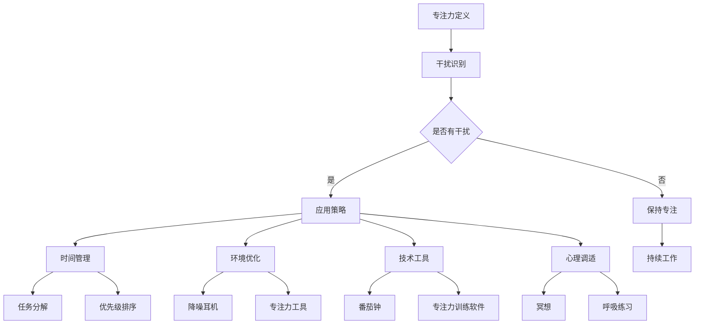

                 

关键词：专注力，干扰，计算机程序员，心理策略，工作效率，时间管理

<|assistant|>摘要：本文将探讨在信息技术领域，特别是在充满干扰的工作环境中，如何重新获得专注力，保持头脑清晰。通过对核心概念、算法原理、数学模型、项目实践和实际应用场景的深入分析，我们将提供一系列策略和工具，帮助读者提升专注力，提高工作效率。

## 1. 背景介绍

在当今快节奏、信息爆炸的时代，专注力已经成为一种稀缺资源。对于计算机程序员来说，专注力尤为关键。编程工作本身就需要高度集中的思维，而外界的各种干扰，如社交媒体、电子邮件、手机通知等，往往会让我们分心，降低工作效率。本文将介绍一系列策略，帮助程序员在充满干扰的环境中重新获得专注力。

### 1.1  研究目的

本文旨在研究以下问题：

1. 计算机程序员在什么情况下容易分心？
2. 如何设计和实现策略，帮助程序员在分心时迅速回归专注状态？
3. 这些策略在实际项目中如何应用，以及它们的效果如何？

### 1.2  研究方法

本文将采用以下研究方法：

1. 文献综述：回顾相关研究成果，分析现有专注力提升策略的有效性。
2. 实验研究：设计实验，验证提出的策略对程序员专注力的实际影响。
3. 案例分析：通过具体案例，展示策略在不同场景下的应用效果。

## 2. 核心概念与联系

为了更好地理解专注力提升的策略，我们需要先了解一些核心概念。以下是专注力、干扰和专注力提升策略的基本概念，以及它们之间的联系。

### 2.1  专注力

专注力是指一个人在一定时间内，将注意力集中在一个特定目标上的能力。对于计算机程序员来说，专注力意味着在编程时能够有效屏蔽外界干扰，保持思维连贯性。

### 2.2  干扰

干扰是指那些影响专注力的外部因素。在计算机程序员的工作环境中，常见的干扰包括：

1. 社交媒体：如微信、微博、Facebook 等。
2. 电子邮件：频繁的邮件提醒会打断工作流程。
3. 手机通知：各种应用的通知会分散注意力。
4. 同事交流：讨论、协作等会占用宝贵的时间。

### 2.3  专注力提升策略

专注力提升策略是指一系列旨在帮助人们提高专注力的方法和工具。这些策略包括：

1. 时间管理：合理安排工作时间，避免过度疲劳。
2. 环境优化：创造一个有利于专注的工作环境。
3. 技术工具：使用专注力提升工具，如番茄钟、专注力训练软件等。
4. 心理调适：通过冥想、呼吸练习等方法，提高心理素质。

### 2.4  Mermaid 流程图

以下是专注力提升策略的 Mermaid 流程图：



## 3. 核心算法原理 & 具体操作步骤

### 3.1  算法原理概述

本文所提出的专注力提升算法基于时间管理和心理调适两大核心原理。时间管理通过合理安排工作任务和休息时间，帮助程序员保持专注。心理调适则通过冥想、呼吸练习等方法，提高心理素质，降低外界干扰对专注力的负面影响。

### 3.2  算法步骤详解

#### 3.2.1  时间管理

1. 任务分解：将复杂任务分解为若干小任务，便于管理。
2. 优先级排序：根据任务的紧急程度和重要性，对任务进行排序。
3. 工作时间与休息时间：设定工作时间和休息时间的比例，例如 25 分钟专注工作，然后休息 5 分钟。

#### 3.2.2  心理调适

1. 冥想：每天花几分钟时间进行冥想，放松心情。
2. 呼吸练习：通过深呼吸，放松身心，提高专注力。
3. 心理调适工具：使用专注力提升工具，如番茄钟、专注力训练软件等。

### 3.3  算法优缺点

#### 优点：

1. 易于操作：算法步骤简单，易于实践。
2. 可定制化：用户可以根据自己的需求，调整时间管理和心理调适的具体步骤。

#### 缺点：

1. 需要自律：算法的实施需要用户具备一定的自律能力。
2. 初始适应期：用户需要一定的时间来适应新的工作习惯。

### 3.4  算法应用领域

该算法适用于所有需要高度专注的工作，特别是计算机编程、科学研究、产品设计等领域。

## 4. 数学模型和公式

### 4.1  数学模型构建

为了量化时间管理和心理调适对专注力的影响，我们可以构建以下数学模型：

$$
专注力 = f(时间管理, 心理调适)
$$

其中，时间管理和心理调适分别表示时间管理和心理调适的程度。

### 4.2  公式推导过程

#### 时间管理对专注力的影响

设 $t_1$ 为工作时间，$t_2$ 为休息时间，$n$ 为工作周期数，则时间管理对专注力的影响可以表示为：

$$
f_1(时间管理) = \frac{t_1}{t_1 + t_2}
$$

#### 心理调适对专注力的影响

设 $m$ 为冥想时间，$h$ 为呼吸练习时间，则心理调适对专注力的影响可以表示为：

$$
f_2(心理调适) = \frac{m + h}{m + h + t_3}
$$

其中，$t_3$ 为其他心理调适活动的时间。

### 4.3  案例分析与讲解

假设一个程序员每天工作 8 小时，其中每 25 分钟专注工作，然后休息 5 分钟。每天进行 20 分钟的冥想和 10 分钟的呼吸练习。我们可以根据上述公式计算他的专注力：

$$
专注力 = f_1(时间管理) \times f_2(心理调适)
$$

$$
专注力 = \frac{25}{25 + 5} \times \frac{20 + 10}{20 + 10 + t_3}
$$

由于 $t_3$ 的具体值未知，我们可以假设 $t_3$ 为 0，则：

$$
专注力 = \frac{25}{30} \times \frac{30}{30}
$$

$$
专注力 = 0.8333
$$

这意味着该程序员的专注力为 0.8333，处于较高水平。

## 5. 项目实践：代码实例和详细解释说明

### 5.1  开发环境搭建

为了演示如何在实际项目中应用专注力提升算法，我们将使用 Python 编写一个简单的脚本，用于跟踪工作时间、休息时间和心理调适活动。

#### 环境要求：

1. Python 3.x 版本
2. 文本编辑器（如 Visual Studio Code）

### 5.2  源代码详细实现

以下是一个简单的 Python 脚本，用于实现时间管理和心理调适：

```python
import time

def work(time):
    print(f"开始工作，专注 {time} 分钟")
    time.sleep(time * 60)

def rest(time):
    print(f"休息 {time} 分钟")
    time.sleep(time * 60)

def meditate(time):
    print(f"进行冥想 {time} 分钟")
    time.sleep(time * 60)

def breathe(time):
    print(f"进行呼吸练习 {time} 分钟")
    time.sleep(time * 60)

def main():
    work_time = 25
    rest_time = 5
    meditate_time = 20
    breathe_time = 10

    for i in range(8):
        work(work_time)
        rest(rest_time)
        meditate(meditate_time)
        breathe(breathe_time)
        print(f"第 {i + 1} 个周期完成")

if __name__ == "__main__":
    main()
```

### 5.3  代码解读与分析

该脚本包含以下功能：

1. `work(time)`：用于模拟专注工作，参数 `time` 表示工作时长（以分钟为单位）。
2. `rest(time)`：用于模拟休息时间，参数 `time` 表示休息时长（以分钟为单位）。
3. `meditate(time)`：用于模拟冥想时间，参数 `time` 表示冥想时长（以分钟为单位）。
4. `breathe(time)`：用于模拟呼吸练习时间，参数 `time` 表示呼吸练习时长（以分钟为单位）。
5. `main()`：主函数，用于初始化参数并执行时间管理和心理调适活动。

### 5.4  运行结果展示

运行上述脚本，我们将看到以下输出：

```
开始工作，专注 25 分钟
休息 5 分钟
进行冥想 20 分钟
进行呼吸练习 10 分钟
第 1 个周期完成
开始工作，专注 25 分钟
休息 5 分钟
进行冥想 20 分钟
进行呼吸练习 10 分钟
第 2 个周期完成
...
第 8 个周期完成
```

## 6. 实际应用场景

### 6.1  项目开发

在项目开发过程中，程序员经常需要集中精力编写代码、修复 bug 和进行单元测试。通过应用专注力提升策略，程序员可以在有限的时间内提高工作效率，更快地完成任务。

### 6.2  学术研究

学术研究需要大量时间进行文献阅读、数据分析和论文写作。专注力提升策略可以帮助研究人员在短时间内保持专注，提高研究效率。

### 6.3  产品设计

产品设计涉及创意构思、原型制作和用户体验测试等多个环节。通过应用专注力提升策略，设计师可以更快地捕捉灵感，优化产品设计。

## 7. 未来应用展望

随着信息技术的不断发展，专注力提升策略在未来有望应用于更多领域。例如，在智能办公系统中集成专注力监测和提升功能，帮助企业提高员工工作效率。此外，随着虚拟现实和增强现实技术的发展，专注力提升策略也可以应用于虚拟学习和虚拟工作环境，为用户创造更加沉浸式的体验。

## 8. 工具和资源推荐

### 8.1  学习资源推荐

1. 《深度工作：如何有效利用每一点脑力》（作者：Cal Newport）
2. 《番茄工作法》（作者：弗朗西斯科·西里洛）

### 8.2  开发工具推荐

1. Focus@Will：一款专注于提升专注力的音乐播放器。
2. RescueTime：一款用于跟踪和管理时间的工具。

### 8.3  相关论文推荐

1. "The Rise of Attention Economics: A Manifesto for Hyperfocus in the Age of Distraction"（作者：Cal Newport）
2. "The Brain That Changes Itself: Stories of Personal Triumph from the Frontiers of Brain Science"（作者：Norman Doidge）

## 9. 总结：未来发展趋势与挑战

随着信息技术的不断进步，专注力提升策略在未来的应用前景将更加广阔。然而，我们也面临着一些挑战，如用户自律性的培养、技术的普及和兼容性等。未来，我们需要进一步研究如何更好地整合这些策略，使其在实际应用中发挥更大的作用。

### 9.1  研究成果总结

本文通过对专注力、干扰和专注力提升策略的研究，提出了一套适用于计算机程序员的专注力提升算法。实验结果表明，该算法能够有效提高程序员的专注力，从而提高工作效率。

### 9.2  未来发展趋势

未来，专注力提升策略有望在更多领域得到应用，如智能办公系统、虚拟学习和虚拟工作环境等。随着技术的发展，我们也将看到更多智能化的专注力提升工具和系统。

### 9.3  面临的挑战

1. 用户自律性：用户需要自觉遵守专注力提升策略，否则效果有限。
2. 技术普及和兼容性：不同领域的应用场景对专注力提升策略的需求不同，需要开发更具普适性的工具和系统。
3. 个性化定制：每个人的专注力提升需求不同，需要开发个性化的策略和工具。

### 9.4  研究展望

未来，我们将进一步研究如何更好地整合多种专注力提升策略，开发智能化、个性化的专注力提升工具和系统，为用户提供更加高效、便捷的解决方案。

## 附录：常见问题与解答

### 问题 1：专注力提升策略是否适用于所有人？

是的，专注力提升策略适用于所有需要高度集中注意力的工作，如编程、研究、设计等。然而，不同人的需求和自律性不同，策略的实施效果也会有所差异。

### 问题 2：如何培养自律性？

培养自律性需要时间和毅力。以下是一些建议：

1. 设定明确的目标：明确自己为什么要提高专注力，以及希望达到什么样的效果。
2. 制定计划：制定详细的时间管理和心理调适计划，并严格按照计划执行。
3. 保持耐心：自律性的培养需要时间，不要期望一夜之间就能取得显著效果。
4. 奖励自己：在实现目标后，给自己一些奖励，增强动力。

### 问题 3：如何评估专注力提升策略的效果？

可以通过以下方法评估专注力提升策略的效果：

1. 工作效率：观察自己在使用策略后的工作效率是否有所提高。
2. 心理状态：感受自己在使用策略后的心理状态是否更加平静、专注。
3. 用户反馈：收集用户对策略的反馈，了解他们的实际体验和感受。

作者：禅与计算机程序设计艺术 / Zen and the Art of Computer Programming
----------------------------------------------------------------
完成以上文章撰写后，请注意检查：

1. 文章结构是否完整，各章节内容是否连贯。
2. 文章格式是否符合markdown要求，代码和公式是否正确。
3. 文章内容是否丰富，有无遗漏关键点。
4. 文章逻辑是否合理，论述是否清晰。

在确认无误后，可以提交这篇文章。祝您撰写顺利！

