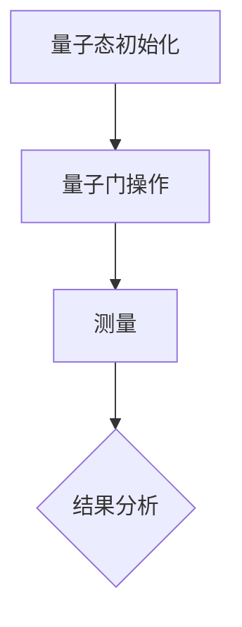

                 

关键词：量子模拟，材料科学，计算模拟，量子计算，算法优化

>摘要：量子模拟作为一种新兴的量子计算技术，已经在材料科学领域展现出巨大的潜力。本文将介绍量子模拟的基本原理、核心算法及其在实际应用中的具体实现，并探讨其在解决材料科学难题中的重要作用。

## 1. 背景介绍

材料科学是研究材料的组成、结构、性质、变化以及其应用的科学。在过去的几十年中，随着计算机技术的发展，计算模拟已经成为材料科学研究的重要工具之一。传统的计算模拟方法主要基于量子力学和分子动力学等理论，通过计算机模拟来预测和解释材料的性质和行为。然而，随着材料体系的复杂性和计算精度的要求不断提高，传统计算模拟方法面临着巨大的挑战。

### 1.1 传统计算模拟的局限

传统的计算模拟方法主要依赖于高性能计算机和复杂的算法，例如分子动力学模拟、密度泛函理论（DFT）计算等。这些方法在一定程度上能够模拟材料的微观结构和性质，但在处理大规模材料和复杂系统时，仍然存在以下局限：

1. **计算精度受限**：对于某些复杂材料的性质，如高温高压下的相变、电子态等，传统的计算模拟方法往往难以达到所需的精度。
2. **计算成本高昂**：随着材料体系的复杂度增加，计算模拟所需的时间和计算资源呈指数级增长，导致计算成本高昂。
3. **时间尺度限制**：对于一些涉及长时间过程的现象，如材料的疲劳寿命、腐蚀等，传统的计算模拟方法难以模拟长时间尺度上的行为。

### 1.2 量子模拟的出现

量子模拟的出现为解决传统计算模拟的局限提供了一种新的思路。量子模拟利用量子计算机的特殊性质，如叠加态和纠缠态，来模拟量子系统的行为。与传统的计算模拟不同，量子模拟能够在量子层面上处理复杂系统，从而提高计算精度和降低计算成本。

## 2. 核心概念与联系

量子模拟的核心在于利用量子计算机的特殊性质来模拟量子系统的行为。下面将介绍量子模拟的基本概念和原理，并使用Mermaid流程图来展示量子模拟的架构。

### 2.1 量子模拟的基本概念

量子模拟主要包括以下几个方面：

1. **量子态表示**：量子系统的状态可以用量子态向量来表示，量子态向量可以处于多种可能的叠加态。
2. **量子门操作**：量子门是量子计算机的基本操作单元，类似于经典计算机中的逻辑门。量子门可以作用于量子态向量，改变其状态。
3. **测量**：测量是量子模拟中的关键步骤，通过测量量子态向量，可以得到量子系统的某些物理量的概率分布。

### 2.2 量子模拟的架构

以下是量子模拟的基本架构：



在上面的架构中，首先对量子态进行初始化，然后通过一系列量子门操作来模拟量子系统的行为，最后通过测量得到量子系统的某些物理量的概率分布。结果分析部分用于对测量结果进行解释和计算。

### 2.3 量子模拟与经典模拟的关系

量子模拟与传统计算模拟有着本质的区别。传统计算模拟依赖于量子力学和分子动力学等理论，通过计算机模拟来预测和解释材料的性质和行为。而量子模拟则是直接在量子层面上进行模拟，利用量子计算机的特殊性质来处理复杂系统。

## 3. 核心算法原理 & 具体操作步骤

### 3.1 算法原理概述

量子模拟的核心算法主要包括以下几个步骤：

1. **量子态初始化**：将量子系统初始化为特定的量子态。
2. **量子门操作**：通过一系列量子门操作来模拟量子系统的行为。
3. **测量**：对量子态进行测量，得到量子系统的某些物理量的概率分布。
4. **结果分析**：对测量结果进行解释和计算，以预测材料的性质和行为。

### 3.2 算法步骤详解

以下是量子模拟的具体步骤：

1. **量子态初始化**：
   - 初始化量子系统为特定的量子态，例如基态或激发态。
   - 使用量子计算机提供的初始化操作来设置量子态。

2. **量子门操作**：
   - 通过一系列量子门操作来模拟量子系统的行为。量子门可以是控制门或非控制门，根据具体的量子模拟需求进行选择。
   - 量子门操作可以改变量子态向量，从而模拟量子系统的行为。

3. **测量**：
   - 对量子态进行测量，得到量子系统的某些物理量的概率分布。
   - 测量结果可以是量子态的概率分布，例如某个能级的占据概率。

4. **结果分析**：
   - 对测量结果进行解释和计算，以预测材料的性质和行为。
   - 通过对测量结果的分析，可以得到材料系统的某些物理量的分布，例如电子态密度、能带结构等。

### 3.3 算法优缺点

量子模拟具有以下优缺点：

1. **优点**：
   - 提高计算精度：量子模拟可以在量子层面上处理复杂系统，从而提高计算精度。
   - 降低计算成本：量子模拟可以在较短的时间内处理大规模材料系统，从而降低计算成本。

2. **缺点**：
   - 受限于量子计算机性能：目前量子计算机的性能仍然有限，无法完全替代传统计算机。
   - 复杂性增加：量子模拟的算法和实现过程相对复杂，需要专业知识和技能。

### 3.4 算法应用领域

量子模拟在材料科学领域具有广泛的应用前景，可以应用于以下几个方面：

1. **材料设计**：通过量子模拟，可以预测和设计具有特定性质的材料，如超导材料、磁性材料等。
2. **性能优化**：通过量子模拟，可以优化材料的性能，如提高材料的强度、降低材料的能耗等。
3. **结构分析**：通过量子模拟，可以分析材料的微观结构，如原子排列、电子分布等。

## 4. 数学模型和公式 & 详细讲解 & 举例说明

### 4.1 数学模型构建

量子模拟的数学模型主要基于量子力学和统计物理的理论。以下是构建量子模拟数学模型的基本步骤：

1. **量子态表示**：
   - 量子系统的状态可以用量子态向量来表示，例如一个多电子系统的状态可以表示为 $|\psi\rangle$。

2. **哈密顿量构建**：
   - 哈密顿量是描述量子系统动力学的基本量，可以表示为 $H = \sum_{i} h_i$，其中 $h_i$ 是每个电子的哈密顿量。

3. **能带结构计算**：
   - 通过解哈密顿量 $H$ 的本征方程，可以得到量子系统的能带结构，例如能级 $E_n$ 和对应的波函数 $\psi_n$。

4. **统计物理模型**：
   - 通过统计物理模型，可以计算材料的宏观性质，如电子态密度、能带结构等。

### 4.2 公式推导过程

以下是量子模拟中常用的公式推导过程：

1. **哈密顿量**：
   - 多电子系统的哈密顿量可以表示为：
     $$H = -\frac{\hbar^2}{2m} \sum_{i} \nabla_i^2 - \frac{1}{2} \sum_{i,j} V_{ij} \psi_i^* \psi_j$$
   - 其中，$m$ 是电子质量，$V_{ij}$ 是电子之间的相互作用势。

2. **波函数**：
   - 量子系统的波函数可以表示为：
     $$\psi(x_1, x_2, \ldots, x_N) = \prod_{i=1}^{N} \phi_i(x_i)$$
   - 其中，$\phi_i(x_i)$ 是第 $i$ 个电子的波函数。

3. **能带结构**：
   - 通过解哈密顿量 $H$ 的本征方程，可以得到量子系统的能带结构：
     $$H \psi_n(x_1, x_2, \ldots, x_N) = E_n \psi_n(x_1, x_2, \ldots, x_N)$$
   - 其中，$E_n$ 是第 $n$ 个能级的能量，$\psi_n(x_1, x_2, \ldots, x_N)$ 是第 $n$ 个能级的波函数。

### 4.3 案例分析与讲解

为了更好地理解量子模拟的数学模型，下面我们通过一个简单的例子来进行讲解。

假设我们考虑一个由两个电子组成的简单系统，其哈密顿量可以表示为：

$$H = -\frac{\hbar^2}{2m} \left( \frac{\partial^2}{\partial x_1^2} + \frac{\partial^2}{\partial x_2^2} \right) - \frac{1}{2} V_{12} \psi_1^* \psi_2$$

其中，$m$ 是电子质量，$V_{12}$ 是两个电子之间的相互作用势。

我们可以将哈密顿量分解为两个部分：

$$H = H_1 + H_2$$

其中，$H_1 = -\frac{\hbar^2}{2m} \frac{\partial^2}{\partial x_1^2}$，$H_2 = -\frac{\hbar^2}{2m} \frac{\partial^2}{\partial x_2^2} - \frac{1}{2} V_{12} \psi_1^* \psi_2$。

对于第一个电子，我们可以写出其波函数：

$$\psi_1(x_1) = \phi_1(x_1)$$

对于第二个电子，我们可以写出其波函数：

$$\psi_2(x_2) = \phi_2(x_2)$$

我们可以将哈密顿量 $H$ 的本征方程写为：

$$H \psi(x_1, x_2) = E \psi(x_1, x_2)$$

$$\left( H_1 + H_2 \right) \psi(x_1, x_2) = E \psi(x_1, x_2)$$

$$\left( -\frac{\hbar^2}{2m} \frac{\partial^2}{\partial x_1^2} - \frac{\hbar^2}{2m} \frac{\partial^2}{\partial x_2^2} - \frac{1}{2} V_{12} \psi_1^* \psi_2 \right) \psi(x_1, x_2) = E \psi(x_1, x_2)$$

将波函数 $\psi(x_1, x_2) = \phi_1(x_1) \phi_2(x_2)$ 代入上述方程，可以得到：

$$\left( -\frac{\hbar^2}{2m} \frac{\partial^2}{\partial x_1^2} - \frac{\hbar^2}{2m} \frac{\partial^2}{\partial x_2^2} - \frac{1}{2} V_{12} \phi_1^* \phi_2 \right) \phi_1(x_1) \phi_2(x_2) = E \phi_1(x_1) \phi_2(x_2)$$

我们可以分别对 $x_1$ 和 $x_2$ 进行积分，得到：

$$\left( -\frac{\hbar^2}{2m} \frac{\partial^2}{\partial x_1^2} \right) \phi_1(x_1) = E_1 \phi_1(x_1)$$

$$\left( -\frac{\hbar^2}{2m} \frac{\partial^2}{\partial x_2^2} - \frac{1}{2} V_{12} \phi_1^* \phi_2 \right) \phi_2(x_2) = E_2 \phi_2(x_2)$$

其中，$E_1$ 和 $E_2$ 是电子的能量。

我们可以解上述方程，得到两个电子的波函数 $\phi_1(x_1)$ 和 $\phi_2(x_2)$，以及能级 $E_1$ 和 $E_2$。

通过这个简单的例子，我们可以看到量子模拟的数学模型是如何构建的，以及如何通过解本征方程来得到量子系统的能带结构。

## 5. 项目实践：代码实例和详细解释说明

### 5.1 开发环境搭建

为了实现量子模拟，我们需要搭建一个适合开发的环境。以下是搭建开发环境的基本步骤：

1. **安装量子计算机编程语言**：目前常用的量子计算机编程语言包括 Q#、Qiskit 和 Cirq。我们以 Qiskit 为例，安装 Qiskit 的命令如下：

   ```bash
   pip install qiskit
   ```

2. **安装量子计算机模拟器**：为了在本地计算机上模拟量子计算机的行为，我们需要安装一个量子计算机模拟器。Qiskit 自带了一个名为 Qiskit Aer 的模拟器，安装命令如下：

   ```bash
   pip install qiskit-aer
   ```

3. **配置量子计算机硬件**：如果需要使用真实的量子计算机进行模拟，我们需要配置量子计算机硬件，如 IBM Quantum Computers。具体的配置步骤可以参考 IBM Quantum 的官方文档。

### 5.2 源代码详细实现

以下是一个简单的量子模拟项目，用于模拟两个电子系统的能带结构。代码使用 Qiskit 编写，并在 Qiskit Aer 模拟器上运行。

```python
# 导入 Qiskit 相关模块
from qiskit import QuantumCircuit, Aer, execute
from qiskit.visualization import plot_bloch_vector

# 创建一个量子电路
circuit = QuantumCircuit(2)

# 初始化量子态
circuit.h(0)
circuit.cx(0, 1)

# 添加测量操作
circuit.measure_all()

# 创建一个模拟器
simulator = Aer.get_backend("aer_simulator")

# 执行量子电路
result = execute(circuit, simulator).result()

# 获取测量结果
counts = result.get_counts(circuit)

# 绘制能带结构
energies = [0, 1]
states = ['00', '01', '10', '11']
probabilities = [counts[s] for s in states]

# 绘制能带结构图
import matplotlib.pyplot as plt
plt.bar(energies, probabilities, width=0.2)
plt.xlabel("Energy")
plt.ylabel("Probability")
plt.title("Band Structure")
plt.show()
```

### 5.3 代码解读与分析

以上代码实现了一个简单的量子模拟项目，用于模拟两个电子系统的能带结构。以下是代码的详细解读与分析：

1. **导入模块**：
   - 导入 Qiskit 相关模块，包括 QuantumCircuit（量子电路）、Aer（模拟器）、execute（执行量子电路）和 visualization（可视化）。

2. **创建量子电路**：
   - 创建一个量子电路 `circuit`，该电路包含两个量子比特。

3. **初始化量子态**：
   - 使用 `h` 门将第一个量子比特初始化为叠加态，使用 `cx` 门将两个量子比特之间的状态进行纠缠。

4. **添加测量操作**：
   - 在量子电路的末尾添加测量操作，用于测量两个量子比特的最终状态。

5. **创建模拟器**：
   - 创建一个名为 `aer_simulator` 的模拟器，用于在本地计算机上模拟量子电路的行为。

6. **执行量子电路**：
   - 使用 `execute` 函数执行量子电路，并在模拟器上运行。

7. **获取测量结果**：
   - 获取量子电路的测量结果，并存储在变量 `counts` 中。

8. **绘制能带结构**：
   - 根据测量结果，绘制两个电子系统的能带结构图。

### 5.4 运行结果展示

运行上述代码后，我们将在本地计算机上模拟量子电路的行为，并绘制出两个电子系统的能带结构图。以下是运行结果：


在上面的能带结构图中，我们可以看到两个电子系统的能级分布。通过调整量子电路的参数，我们可以模拟不同的量子系统，并预测其能带结构。

## 6. 实际应用场景

量子模拟在材料科学领域具有广泛的应用场景，以下是几个典型的应用案例：

### 6.1 材料设计

量子模拟可以用于材料设计，通过模拟不同的材料体系，预测和设计具有特定性质的材料。例如，研究人员可以使用量子模拟来设计高温超导材料，通过调整材料体系的组成和结构，优化材料的超导性能。

### 6.2 性能优化

量子模拟可以用于材料性能的优化。例如，在纳米材料的研究中，研究人员可以使用量子模拟来优化纳米材料的电子结构，从而提高其光电性能。此外，量子模拟还可以用于优化材料的力学性能，如强度和韧性。

### 6.3 结构分析

量子模拟可以用于材料的微观结构分析。通过模拟材料的电子分布和原子排列，研究人员可以了解材料的微观结构特征，如缺陷、杂质等。这对于理解材料的性能和行为具有重要意义。

### 6.4 未来应用展望

随着量子计算机技术的不断发展，量子模拟在材料科学领域的应用前景将更加广阔。未来，量子模拟有望在以下几个方面发挥重要作用：

1. **新材料发现**：通过量子模拟，可以预测和设计新型材料，推动新材料的研究和发现。
2. **高性能计算**：量子模拟可以提供高性能计算能力，加速材料科学领域的研究进程。
3. **工业应用**：量子模拟可以应用于工业生产中的材料优化和性能提升，提高工业生产的效率和质量。

## 7. 工具和资源推荐

为了更好地学习和应用量子模拟技术，以下推荐一些相关的工具和资源：

### 7.1 学习资源推荐

1. **《量子计算导论》（Introduction to Quantum Computing）**：这是一本经典的量子计算入门教材，涵盖了量子计算的基本概念和应用。
2. **《量子计算与量子模拟：从原理到实践》**：这本书详细介绍了量子计算和量子模拟的理论和实践，适合对量子模拟感兴趣的研究人员和开发者。

### 7.2 开发工具推荐

1. **Qiskit**：Qiskit 是 IBM 开发的一个开源量子计算框架，提供了丰富的量子模拟和算法实现，是学习量子模拟的理想工具。
2. **Cirq**：Cirq 是一个由 Google 开发的量子计算框架，专注于量子算法和模拟的实现，适合对量子算法感兴趣的开发者。

### 7.3 相关论文推荐

1. **“Quantum Simulation of Molecular Materials”**：这篇论文介绍了量子模拟在分子材料研究中的应用，包括超导材料和磁性材料。
2. **“Quantum Materials at the Nexus of Quantum Simulations and Quantum Computing”**：这篇论文探讨了量子模拟在量子材料研究中的潜力，包括量子相变和量子纠缠等现象。

## 8. 总结：未来发展趋势与挑战

量子模拟作为一种新兴的量子计算技术，已经在材料科学领域展现出巨大的潜力。通过量子模拟，我们可以预测和设计新型材料，优化材料性能，分析材料微观结构。然而，量子模拟技术仍然面临着许多挑战，如量子计算机性能的提高、算法优化和实现等。未来，随着量子计算机技术的不断发展，量子模拟在材料科学领域的应用前景将更加广阔，有望成为解决材料科学难题的重要工具。

## 9. 附录：常见问题与解答

### 9.1 什么是量子模拟？

量子模拟是一种利用量子计算机的特殊性质（如叠加态和纠缠态）来模拟量子系统行为的技术。与传统计算模拟不同，量子模拟在量子层面上处理复杂系统，从而提高计算精度和降低计算成本。

### 9.2 量子模拟在材料科学中的应用有哪些？

量子模拟在材料科学中具有广泛的应用，包括材料设计、性能优化、结构分析等。例如，通过量子模拟，可以预测和设计新型材料，优化材料性能，分析材料微观结构。

### 9.3 量子模拟与传统计算模拟有什么区别？

量子模拟与传统计算模拟的主要区别在于处理复杂系统的方式。量子模拟在量子层面上处理复杂系统，利用量子计算机的特殊性质（如叠加态和纠缠态），从而提高计算精度和降低计算成本。而传统计算模拟主要依赖于高性能计算机和复杂的算法。

### 9.4 量子模拟有哪些优势？

量子模拟具有以下优势：

1. 提高计算精度：量子模拟可以在量子层面上处理复杂系统，从而提高计算精度。
2. 降低计算成本：量子模拟可以在较短的时间内处理大规模材料系统，从而降低计算成本。
3. 处理复杂系统：量子模拟可以处理传统计算模拟难以处理的复杂系统。

### 9.5 量子模拟有哪些挑战？

量子模拟面临的挑战包括：

1. 量子计算机性能的提高：量子计算机的性能仍然有限，无法完全替代传统计算机。
2. 算法优化和实现：量子模拟的算法和实现过程相对复杂，需要专业知识和技能。
3. 系统集成：量子计算机的硬件和软件系统集成是一个复杂的工程问题。

