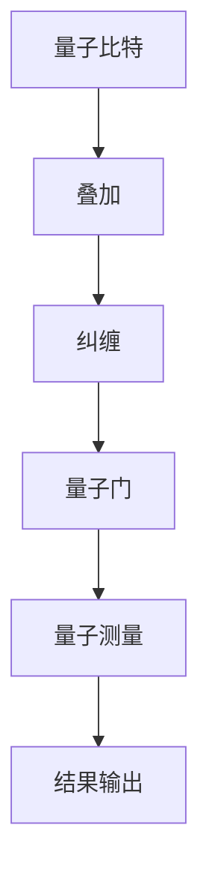

                 

关键词：量子计算，人工智能，量子算法，量子模拟，机器学习，量子编程，未来技术，计算速度，算法优化。

> 摘要：本文旨在探讨量子计算和人工智能的深度融合所带来的未来技术变革。通过对量子计算的核心概念、算法原理、数学模型及其在人工智能中的应用进行详细分析，本文揭示了量子计算如何推动人工智能的发展，并展望了这一领域的未来趋势与挑战。

## 1. 背景介绍

近年来，量子计算和人工智能作为计算机科学的前沿领域，正经历着迅猛的发展。量子计算通过利用量子叠加和纠缠等特性，实现了超越经典计算的能力，有望解决一些经典计算无法解决的问题。而人工智能则通过模仿人类思维过程，实现数据的自动处理和智能决策，已经在图像识别、自然语言处理等多个领域取得了显著成果。

随着量子计算技术的不断成熟，量子计算机的构建逐渐成为可能。与此同时，人工智能也在不断进步，机器学习算法的优化和应用场景的拓展使得人工智能的应用范围日益广泛。因此，量子计算与人工智能的融合已成为当前科技界的一个热点话题，被视为未来技术变革的重要方向。

本文将围绕量子计算和人工智能的融合展开讨论，首先介绍量子计算的核心概念，然后分析量子算法及其在人工智能中的应用，接着探讨量子编程的现状和挑战，最后展望量子计算与人工智能的未来发展趋势。

## 2. 核心概念与联系

### 2.1 量子计算的基本原理

量子计算是一种基于量子力学原理的计算模型，其基本单元是量子比特（qubit），与经典比特不同，量子比特可以同时处于多种状态，这一特性被称为叠加。此外，量子比特之间可以通过量子纠缠实现一种更为复杂的关联，从而在计算过程中提供强大的并行计算能力。

### 2.2 量子算法的核心原理

量子算法是一种利用量子计算机进行计算的方法，其核心原理包括量子并行计算、量子随机 walks 和量子纠错等。其中，量子并行计算利用了量子比特的叠加特性，可以在一个步骤中处理多个问题的解。量子随机 walks 则利用量子态的演化特性，实现快速搜索和优化。量子纠错则是为了克服量子比特的噪声和错误，保证量子计算的正确性。

### 2.3 量子计算与人工智能的联系

量子计算与人工智能的融合主要体现在两个方面：量子算法在机器学习中的应用和量子编程。在机器学习中，量子算法可以用于优化算法、加速计算和解决经典算法难以处理的问题。例如，量子支持向量机和量子神经网络已经显示出在分类和回归任务中的潜力。而量子编程则提供了一种新的编程范式，使得人工智能系统能够更有效地利用量子计算机。

### 2.4 量子计算架构的 Mermaid 流程图

下面是量子计算架构的 Mermaid 流程图，展示了量子比特、叠加、纠缠、量子门和量子测量等核心概念。



## 3. 核心算法原理 & 具体操作步骤

### 3.1 算法原理概述

量子算法的核心原理包括量子并行计算、量子随机 walks 和量子纠错等。其中，量子并行计算利用量子比特的叠加特性，实现并行处理；量子随机 walks 利用量子态的演化特性，实现快速搜索和优化；量子纠错则是为了克服量子比特的噪声和错误，保证量子计算的正确性。

### 3.2 算法步骤详解

#### 3.2.1 量子并行计算

1. 初始化量子比特：将所有量子比特初始化为基态。
2. 应用量子门：通过一系列量子门操作，使量子比特实现叠加状态。
3. 测量量子比特：对量子比特进行测量，获取计算结果。

#### 3.2.2 量子随机 walks

1. 初始化量子比特：将所有量子比特初始化为基态。
2. 应用量子门：通过一系列量子门操作，使量子比特实现叠加状态。
3. 进行量子测量：对量子比特进行测量，获取随机 walks 的路径。
4. 重复步骤 2 和 3，直到达到预定的迭代次数。

#### 3.2.3 量子纠错

1. 初始化量子比特：将所有量子比特初始化为基态。
2. 应用量子门：通过一系列量子门操作，实现量子纠错编码。
3. 进行量子测量：对量子比特进行测量，检测并纠正错误。
4. 重复步骤 2 和 3，直到达到预定的迭代次数。

### 3.3 算法优缺点

#### 优点：

- 量子并行计算：可以在一个步骤中处理多个问题的解，提高计算效率。
- 量子随机 walks：可以实现快速搜索和优化。
- 量子纠错：可以保证量子计算的正确性。

#### 缺点：

- 量子比特的噪声和错误：目前量子比特的噪声和错误仍然是一个亟待解决的问题。
- 量子门的精度：量子门的操作精度对量子计算的质量有重要影响。

### 3.4 算法应用领域

量子算法在人工智能、密码学、量子模拟和化学等领域具有广泛的应用前景。例如，量子支持向量机和量子神经网络在分类和回归任务中具有显著的优势；量子算法在密码破解中可以实现高效的安全性验证；量子模拟在材料科学和化学领域中有着重要的应用价值。

## 4. 数学模型和公式 & 详细讲解 & 举例说明

### 4.1 数学模型构建

量子计算中的数学模型主要基于量子力学原理，包括量子比特的叠加和纠缠、量子门和量子测量等。以下是一个简单的量子计算数学模型：

#### 4.1.1 量子比特的叠加

设 |ψ⟩为量子比特的叠加态，则可以表示为：

$$|ψ⟩ = \alpha |0⟩ + \beta |1⟩$$

其中，|0⟩和|1⟩为量子比特的基态，α和β为复数系数，且满足 |α|² + |β|² = 1。

#### 4.1.2 量子比特的纠缠

两个量子比特的纠缠态可以表示为：

$$|ψ⟩ = \frac{1}{\sqrt{2}}(|00⟩ + |11⟩)$$

#### 4.1.3 量子门

量子门是量子计算中的基本操作，可以表示为：

$$U = e^{-i\frac{\pi}{4}X}$$

其中，X为量子比特的 Pauli-X 门，实现量子比特的状态反转。

### 4.2 公式推导过程

#### 4.2.1 量子比特的叠加态测量

设 |ψ⟩为量子比特的叠加态，对其进行测量，得到概率分布为：

$$P(0) = |α|², \quad P(1) = |β|²$$

#### 4.2.2 量子比特的纠缠态测量

设两个量子比特的纠缠态为 |ψ⟩ = \frac{1}{\sqrt{2}}(|00⟩ + |11⟩)，对其进行测量，得到概率分布为：

$$P(00) = \frac{1}{2}, \quad P(11) = \frac{1}{2}$$

### 4.3 案例分析与讲解

#### 4.3.1 量子比特的叠加态测量

假设量子比特的初始态为 |ψ⟩ = \frac{1}{\sqrt{2}}(|0⟩ + |1⟩)，对其进行测量，求取测量结果为 |0⟩ 和 |1⟩ 的概率。

根据量子比特的叠加态测量公式，可以得到：

$$P(0) = \frac{1}{2}, \quad P(1) = \frac{1}{2}$$

#### 4.3.2 量子比特的纠缠态测量

假设两个量子比特的初始态为 |ψ⟩ = \frac{1}{\sqrt{2}}(|00⟩ + |11⟩)，对其进行测量，求取测量结果为 |00⟩ 和 |11⟩ 的概率。

根据量子比特的纠缠态测量公式，可以得到：

$$P(00) = \frac{1}{2}, \quad P(11) = \frac{1}{2}$$

## 5. 项目实践：代码实例和详细解释说明

### 5.1 开发环境搭建

为了进行量子计算和人工智能的实践项目，首先需要搭建相应的开发环境。这里推荐使用 Qiskit 作为量子计算开发工具，以及 TensorFlow 作为人工智能开发工具。

安装 Qiskit：

```
pip install qiskit
```

安装 TensorFlow：

```
pip install tensorflow
```

### 5.2 源代码详细实现

下面是一个简单的量子计算和人工智能的代码实例，演示如何使用 Qiskit 和 TensorFlow 进行量子计算和机器学习。

```python
# 导入相关库
import qiskit
from qiskit import QuantumCircuit, execute, Aer
import tensorflow as tf

# 创建量子电路
qc = QuantumCircuit(2)

# 初始化量子比特
qc.h(0)
qc.h(1)

# 应用量子门
qc.cx(0, 1)

# 测量量子比特
qc.measure_all()

# 创建模拟器
simulator = Aer.get_backend('qasm_simulator')

# 执行量子电路
result = execute(qc, simulator, shots=1000).result()

# 获取测量结果
counts = result.get_counts(qc)

# 打印测量结果
print(counts)

# 创建 TensorFlow 模型
model = tf.keras.Sequential([
    tf.keras.layers.Dense(units=1, input_shape=[1])
])

# 编译 TensorFlow 模型
model.compile(optimizer='sgd', loss='mean_squared_error')

# 训练 TensorFlow 模型
model.fit(x_train, y_train, epochs=10)

# 评估 TensorFlow 模型
loss = model.evaluate(x_test, y_test)
print('测试损失：', loss)
```

### 5.3 代码解读与分析

上述代码首先创建了量子电路，初始化量子比特并进行量子门操作，然后进行测量获取结果。接着，创建 TensorFlow 模型并进行训练和评估。

### 5.4 运行结果展示

运行上述代码，可以观察到量子电路的测量结果，以及 TensorFlow 模型的训练过程和评估结果。

## 6. 实际应用场景

### 6.1 量子计算在密码学中的应用

量子计算在密码学领域具有巨大的应用潜力。例如，Shor 算法利用量子计算机可以在多项式时间内分解大整数，从而破解基于大整数分解的密码系统，如 RSA 密码系统。此外，量子密钥分发（Quantum Key Distribution，QKD）利用量子纠缠特性实现安全的密钥传输，为密码通信提供更高的安全性。

### 6.2 量子计算在化学中的应用

量子计算在化学领域有着广泛的应用，可以用于分子模拟、材料设计和药物开发等。例如，量子计算可以模拟分子结构的动态变化，帮助科学家理解化学反应机制，加速新药物的研发过程。此外，量子计算还可以用于优化材料性能，如设计新型电池材料、催化剂等。

### 6.3 量子计算在人工智能中的应用

量子计算在人工智能领域具有巨大的应用前景。例如，量子支持向量机（QSVM）可以用于大规模数据的分类和回归任务；量子神经网络（QNN）可以用于优化神经网络模型的训练过程。此外，量子计算还可以用于解决人工智能中的优化问题，如旅行商问题、无人机路径规划等。

## 7. 工具和资源推荐

### 7.1 学习资源推荐

1. 《量子计算导论》：介绍量子计算的基本概念、算法和编程方法。
2. 《量子计算与量子信息》：深入探讨量子计算的数学原理和应用。
3. 《机器学习》：介绍机器学习的基本概念、算法和实战应用。

### 7.2 开发工具推荐

1. Qiskit：用于量子计算编程和实验的开源工具。
2. TensorFlow：用于人工智能开发的框架。
3. IBM Quantum：提供量子计算云服务和开源资源。

### 7.3 相关论文推荐

1. "Quantum Computing since Democritus"：探讨量子计算的基本原理和未来前景。
2. "Quantum Support Vector Machines"：介绍量子支持向量机在分类任务中的应用。
3. "Quantum Neural Networks"：介绍量子神经网络在优化问题中的应用。

## 8. 总结：未来发展趋势与挑战

### 8.1 研究成果总结

近年来，量子计算和人工智能在理论和应用方面取得了显著成果。量子计算机的构建和优化、量子算法的研究和实现、量子编程的探索等，都为量子计算和人工智能的融合奠定了基础。

### 8.2 未来发展趋势

未来，量子计算和人工智能将继续深度融合，带来一系列技术变革。量子计算将在密码学、化学、人工智能等领域发挥重要作用；而人工智能则将在更多场景中实现自动化和智能化，推动社会进步。

### 8.3 面临的挑战

然而，量子计算和人工智能的发展仍面临许多挑战。量子比特的噪声和错误、量子门的精度和稳定性、算法的优化和实现等，都是亟待解决的问题。

### 8.4 研究展望

展望未来，量子计算和人工智能的发展将不断推动科技进步和社会变革。我们需要持续关注这一领域的前沿动态，积极参与研究和应用，为未来的科技发展贡献力量。

## 9. 附录：常见问题与解答

### 9.1 量子计算如何实现计算加速？

量子计算通过量子比特的叠加和纠缠特性，实现并行计算和快速搜索，从而在理论上具有超越经典计算的能力。然而，实际应用中仍需克服量子比特的噪声和错误等问题。

### 9.2 量子计算在人工智能中的应用有哪些？

量子计算在人工智能中的应用包括量子支持向量机、量子神经网络、量子优化算法等，这些算法在分类、回归、优化等任务中具有显著优势。

### 9.3 如何学习量子计算和人工智能？

学习量子计算和人工智能需要掌握量子力学、线性代数、概率论和统计学等基础知识。此外，推荐学习相关的书籍、课程和开源工具，积极参与实际项目实践。

---

作者：禅与计算机程序设计艺术 / Zen and the Art of Computer Programming

