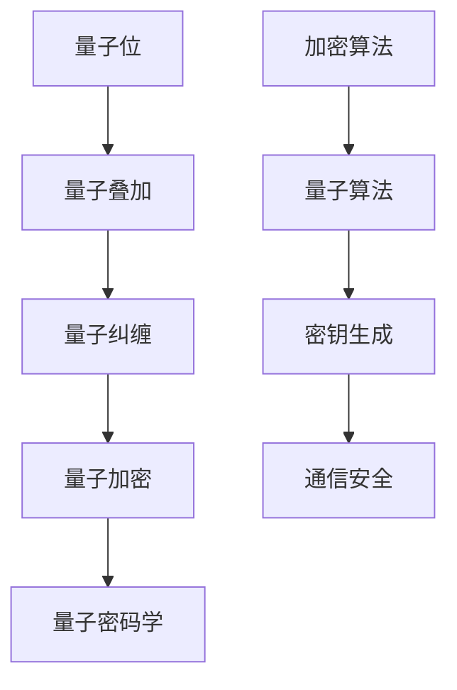

                 

关键词：量子计算、密码学、安全通信、量子加密、量子算法

摘要：本文旨在探讨量子计算在密码学领域的应用，尤其是量子加密技术如何成为未来安全通信的基石。通过对量子计算的基本原理、量子密码学的核心算法以及其实际应用的深入分析，本文揭示了量子计算在保障通信安全方面的重要潜力，并展望了其在未来的发展趋势与挑战。

## 1. 背景介绍

随着信息技术的飞速发展，数据安全和隐私保护成为了全球关注的焦点。传统密码学在保障信息安全方面发挥了重要作用，然而，随着计算能力的提升，许多传统密码系统正面临前所未有的威胁。量子计算作为一种全新的计算模式，其强大的计算能力有望为密码学带来革命性的变化。

量子计算是基于量子力学原理的新型计算模式，利用量子位（qubit）的叠加和纠缠特性，实现了指数级的并行计算能力。传统计算机使用二进制位进行计算，而量子计算机使用量子位，这使得它在解决特定问题上具有巨大优势。例如，著名的Shor算法能够在多项式时间内解决大整数分解问题，这对传统密码学中的RSA加密算法构成了严重威胁。

密码学是研究如何保护信息通信安全的一门学科，其核心目标是确保信息的保密性、完整性和可用性。传统的密码学主要依赖于数学难题的难解性，如大整数分解、离散对数问题等，以确保加密算法的安全性。然而，随着计算能力的提升，许多传统密码系统正面临被破解的风险。

量子计算的出现为密码学带来了新的挑战和机遇。一方面，量子计算机可能破解传统密码系统，使得现有的信息安全体系面临威胁；另一方面，量子计算也为构建更安全的加密系统提供了新的思路。量子密码学便是基于量子力学原理构建的一类新型密码学，旨在利用量子特性保障通信安全。

本文将深入探讨量子计算在密码学中的应用，分析量子加密技术的原理和优势，探讨量子算法在密码学中的实际应用，并展望未来量子计算在安全通信领域的发展趋势。

## 2. 核心概念与联系

为了深入理解量子计算在密码学中的应用，首先需要掌握以下几个核心概念：

### 2.1. 量子位（Qubit）

量子位是量子计算机的基本计算单位，与经典计算机中的比特不同，量子位可以同时存在于多种状态叠加中，这赋予了量子计算机强大的并行计算能力。一个量子位可以表示0和1的叠加状态，即 $|\psi\rangle = a|0\rangle + b|1\rangle$，其中$a$和$b$是复数，满足$|a|^2 + |b|^2 = 1$。

### 2.2. 量子叠加原理

量子叠加原理指出，量子系统可以同时处于多个状态的叠加。在量子计算机中，量子叠加使得一个量子位可以同时进行多种计算，这大大提高了计算效率。例如，一个具有n个量子位的量子计算机可以同时表示$2^n$个状态的叠加。

### 2.3. 量子纠缠

量子纠缠是量子力学中的一种奇特现象，两个或多个量子位之间可以产生一种特殊的关联，即使它们相隔很远，其中一个量子位的状态变化也会立即影响到另一个量子位的状态。量子纠缠是量子计算和量子密码学的重要基础。

### 2.4. 量子加密

量子加密是利用量子力学原理来保障通信安全的一种加密技术。量子加密的核心思想是基于量子力学的基本规律，如不确定性原理和量子纠缠，使得窃听者无法在不被察觉的情况下窃取信息。

为了更好地理解这些概念之间的联系，我们可以使用Mermaid流程图来展示量子计算在密码学中的应用架构。



在上面的流程图中，量子位（A）通过量子叠加和量子纠缠（B和C）实现了量子加密（D），进而构建了量子密码学（E）。量子密码学利用量子算法（A2）生成密钥（A3），并确保通信安全（A4）。

通过这一架构，我们可以看出量子计算在密码学中的应用不仅依赖于量子位和量子力学原理，还需要结合经典的密码学技术来构建出有效的加密系统。

### 2.5. 量子计算与密码学的相互关系

量子计算与密码学之间的相互关系可以归结为两个方面：挑战和机遇。

#### 挑战

首先，量子计算对传统密码学构成了严重挑战。量子计算机能够利用Shor算法在多项式时间内破解大整数分解和离散对数问题，这意味着许多基于这些难题的传统密码系统（如RSA和ECC）将不再安全。此外，量子计算机还能够利用量子搜索算法（如Grover算法）显著提高经典搜索算法的效率，这对基于密码学安全的认证机制和加密算法也构成了威胁。

#### 机遇

然而，量子计算也为密码学带来了新的机遇。量子密码学利用量子力学原理构建了新型加密技术，如量子密钥分发（QKD）和量子安全直接通信（QSDC），这些技术能够提供比传统密码学更高级别的安全保证。量子计算还可以用于构建抗量子攻击的密码系统，如基于格理论的密码系统和量子随机函数，这些密码系统能够抵抗量子计算机的攻击。

综上所述，量子计算与密码学之间的相互关系是一个复杂而动态的过程。尽管量子计算对传统密码学构成了威胁，但它也为构建更安全的加密技术提供了新的可能性。在接下来的章节中，我们将深入探讨量子密码学的核心算法、数学模型以及实际应用。

## 3. 核心算法原理 & 具体操作步骤

### 3.1 算法原理概述

量子密码学中的核心算法主要包括量子密钥分发（Quantum Key Distribution, QKD）和量子安全直接通信（Quantum Secure Direct Communication, QSDC）。这些算法利用量子力学的基本原理，如量子叠加、量子纠缠和不确定性原理，来保障通信的安全性。

#### 量子密钥分发（QKD）

量子密钥分发是一种基于量子力学原理的密钥分发方法，其核心思想是通过量子信道分发密钥，使得任何窃听行为都会被立即检测到。QKD的基本原理可以概括为以下步骤：

1. **量子态生成**：发送方使用一个量子源生成一对纠缠的量子位（通常为光子对），并将其中的一位发送给接收方。
2. **量子态传输**：接收方收到量子位后，通过测量操作来验证纠缠关系。
3. **密钥生成**：发送方和接收方根据测量结果生成共享密钥。由于量子态的叠加和纠缠特性，任何第三方的窃听都会破坏量子态的叠加和纠缠，从而被双方检测到。

#### 量子安全直接通信（QSDC）

量子安全直接通信是一种利用量子加密算法来实现安全通信的技术。其基本原理是通过量子算法生成一个密钥，并使用这个密钥对信息进行加密和解密。QSDC的关键步骤包括：

1. **量子密钥生成**：通过量子算法（如量子随机函数）生成一个安全的密钥。
2. **信息加密**：使用生成的密钥对信息进行加密。
3. **信息传输**：通过经典信道传输加密信息。
4. **信息解密**：接收方使用共享密钥对信息进行解密。

### 3.2 算法步骤详解

下面我们将详细描述量子密钥分发和量子安全直接通信的具体操作步骤。

#### 量子密钥分发（QKD）操作步骤

1. **量子态生成**：
    - 发送方使用量子光源生成一个光子对。
    - 发送方将光子对中的一个光子发送到接收方，另一个光子保存在自己手中。

2. **量子态传输**：
    - 接收方使用量子探测器测量接收到的光子。
    - 接收方随机选择一个基（如水平基或垂直基）进行测量，并将测量结果发送给发送方。

3. **密钥生成**：
    - 发送方根据自己保存的光子测量结果和接收方发送的测量结果，生成共享密钥。

4. **安全性验证**：
    - 双方对共享密钥进行随机子集的比对，以确保密钥的真实性。
    - 如果比对结果一致，则密钥被认为是安全的。

#### 量子安全直接通信（QSDC）操作步骤

1. **量子密钥生成**：
    - 使用量子算法（如量子随机函数）生成一个安全的密钥。

2. **信息加密**：
    - 使用量子密钥生成加密算法（如量子加密算法QAE）对信息进行加密。
    - 加密过程涉及量子态的操作，如量子门和量子逻辑运算。

3. **信息传输**：
    - 通过经典信道将加密信息传输给接收方。

4. **信息解密**：
    - 接收方使用共享密钥和量子解密算法对信息进行解密。
    - 解密过程涉及对加密信息的量子态进行逆操作，以恢复原始信息。

### 3.3 算法优缺点

量子密钥分发和量子安全直接通信作为量子密码学的核心算法，具有以下优缺点：

#### 优点

1. **安全性高**：量子密钥分发和量子安全直接通信利用量子力学原理，确保密钥分发和信息传输过程中的安全性，对抗传统密码学中的量子攻击。
2. **防窃听检测**：QKD能够通过检测量子态的破坏来发现窃听行为，从而提供更高的通信安全。
3. **抗量子攻击**：QSDC基于量子算法，能够抵抗量子计算机的攻击，提供长期的安全保障。

#### 缺点

1. **技术难度高**：量子计算和量子加密技术的实现需要高度精确的实验技术和复杂的设备，这增加了技术实现的难度。
2. **通信距离限制**：QKD的通信距离受到量子态传输和噪声的影响，目前仍需要中继器来延长通信距离。
3. **成本高**：量子计算和量子加密技术的研究和开发需要大量资金投入，这限制了其大规模应用的可行性。

### 3.4 算法应用领域

量子密钥分发和量子安全直接通信在多个领域具有广泛的应用前景：

1. **国家安全**：量子密码学在保障国家机密通信和军事通信安全方面具有重要应用价值。
2. **金融领域**：量子加密技术能够提高金融交易和信息传输的安全，防范黑客攻击和金融欺诈。
3. **电子商务**：量子加密技术能够保障电子商务中的交易信息安全和用户隐私保护。
4. **医疗领域**：量子加密技术可以用于保障医疗数据的安全传输和存储，保护患者隐私。

通过量子密钥分发和量子安全直接通信的应用，量子计算有望成为未来安全通信的基石，为信息安全提供更高级别的保障。

## 4. 数学模型和公式 & 详细讲解 & 举例说明

### 4.1 数学模型构建

量子密码学中的数学模型主要基于量子力学的理论框架，特别是量子态的叠加和纠缠原理。为了构建数学模型，我们需要引入以下几个基本概念和数学公式。

#### 量子态

量子态是量子系统的状态描述，可以用一个复数向量来表示。一个量子位（qubit）的量子态可以用以下形式表示：

$$
|\psi\rangle = a|0\rangle + b|1\rangle
$$

其中，$a$ 和 $b$ 是复数，满足归一化条件：

$$
|a|^2 + |b|^2 = 1
$$

#### 量子门

量子门是量子计算中的基本操作，类似于经典计算中的逻辑门。常见的量子门包括Hadamard门、Pauli门和控制非门等。以下是一些基本的量子门及其作用：

1. **Hadamard门**：将量子位的状态从基态（$|0\rangle$）叠加到超态（$|0\rangle + |1\rangle$）。
    $$
    H = \frac{1}{\sqrt{2}} \begin{pmatrix}
    1 & 1 \\
    1 & -1
    \end{pmatrix}
    $$

2. **Pauli门**：用于对量子位进行Z和X方向的旋转。
    $$
    X = \begin{pmatrix}
    0 & 1 \\
    1 & 0
    \end{pmatrix}, \quad Z = \begin{pmatrix}
    1 & 0 \\
    0 & -1
    \end{pmatrix}
    $$

3. **控制非门（CNOT）**：用于两个量子位之间的纠缠操作。
    $$
    CNOT = \begin{pmatrix}
    1 & 0 & 0 & 0 \\
    0 & 1 & 0 & 0 \\
    0 & 0 & 0 & 1 \\
    0 & 0 & 1 & 0
    \end{pmatrix}
    $$

#### 量子密钥分发（QKD）模型

量子密钥分发的数学模型基于量子纠缠和量子态的测量。以下是一个简化的QKD模型：

1. **量子态生成**：
    - 发送方生成一对纠缠的光子对，其量子态为：
    $$
    |\psi_{\text{entangled}}\rangle = \frac{1}{\sqrt{2}} (|00\rangle + |11\rangle)
    $$

2. **量子态传输**：
    - 接收方随机选择一个基进行测量，假设选择的是水平基（$|+\rangle = \frac{1}{\sqrt{2}} (|0\rangle + |1\rangle)$），则接收到的量子态为：
    $$
    \frac{1}{\sqrt{2}} (|0\rangle + |1\rangle) \otimes \frac{1}{\sqrt{2}} (|0\rangle + |1\rangle)
    $$

3. **密钥生成**：
    - 假设接收方测量结果为$|+\rangle$，则共享量子态为$|0\rangle \otimes |+\rangle$。通过一系列量子门操作，可以得到共享密钥。

### 4.2 公式推导过程

为了更清晰地展示量子密钥分发的公式推导过程，我们以下列步骤为例进行说明：

1. **量子态生成**：
    - 发送方生成纠缠光子对的初始量子态为：
    $$
    |\psi_{\text{initial}}\rangle = \frac{1}{\sqrt{2}} (|00\rangle + |11\rangle)
    $$

2. **量子态传输**：
    - 接收方选择水平基进行测量，假设测量结果为$|+\rangle$，则传输后的量子态为：
    $$
    |\psi_{\text{measured}}\rangle = \frac{1}{\sqrt{2}} (|0\rangle + |1\rangle) \otimes |+\rangle
    $$

3. **密钥生成**：
    - 使用一系列量子门操作，如Hadamard门和CNOT门，将接收方量子态转换为共享密钥。
    - 假设接收方执行以下量子门操作：
        1. Hadamard门作用于接收方的量子位：
        $$
        H \otimes I = \frac{1}{\sqrt{2}} \begin{pmatrix}
        1 & 1 \\
        1 & -1
        \end{pmatrix} \otimes \begin{pmatrix}
        1 & 0 \\
        0 & 1
        \end{pmatrix}
        $$
        - 对应的变换矩阵为：
        $$
        M_1 = \frac{1}{\sqrt{2}} \begin{pmatrix}
        1 & 1 \\
        1 & -1
        \end{pmatrix}
        $$

        2. CNOT门作用于纠缠态：
        $$
        CNOT \otimes I = \begin{pmatrix}
        1 & 0 & 0 & 0 \\
        0 & 1 & 0 & 0 \\
        0 & 0 & 0 & 1 \\
        0 & 0 & 1 & 0
        \end{pmatrix} \otimes \begin{pmatrix}
        1 & 0 \\
        0 & 1
        \end{pmatrix}
        $$
        - 对应的变换矩阵为：
        $$
        M_2 = \begin{pmatrix}
        1 & 0 & 0 & 0 \\
        0 & 1 & 0 & 0 \\
        0 & 0 & 0 & 1 \\
        0 & 0 & 1 & 0
        \end{pmatrix}
        $$

    - 总变换矩阵为：
    $$
    M = M_2 M_1 = \frac{1}{\sqrt{2}} \begin{pmatrix}
    1 & 1 \\
    1 & -1
    \end{pmatrix} \otimes \begin{pmatrix}
    1 & 0 \\
    0 & 1
    \end{pmatrix} \begin{pmatrix}
    1 & 0 & 0 & 0 \\
    0 & 1 & 0 & 0 \\
    0 & 0 & 0 & 1 \\
    0 & 0 & 1 & 0
    \end{pmatrix}
    $$

    - 对应的变换矩阵为：
    $$
    M = \frac{1}{\sqrt{2}} \begin{pmatrix}
    1 & 1 & 0 & 0 \\
    1 & -1 & 0 & 0 \\
    0 & 0 & 1 & 1 \\
    0 & 0 & 1 & -1
    \end{pmatrix}
    $$

    - 将接收方量子态作用于变换矩阵，得到共享密钥：
    $$
    |\psi_{\text{key}}\rangle = M |\psi_{\text{measured}}\rangle = \frac{1}{\sqrt{2}} \begin{pmatrix}
    1 & 1 & 0 & 0 \\
    1 & -1 & 0 & 0 \\
    0 & 0 & 1 & 1 \\
    0 & 0 & 1 & -1
    \end{pmatrix} \frac{1}{\sqrt{2}} (|0\rangle + |1\rangle) \otimes |+\rangle
    $$

    - 化简后得到共享密钥的量子态：
    $$
    |\psi_{\text{key}}\rangle = \frac{1}{2} (|0\rangle \otimes |+\rangle + |1\rangle \otimes |-\rangle)
    $$

### 4.3 案例分析与讲解

为了更好地理解上述数学模型的推导过程，我们以下列案例为例进行分析：

**案例**：假设发送方和接收方使用两个量子位进行量子密钥分发，接收方选择水平基进行测量。

**步骤**：

1. **量子态生成**：
    - 初始纠缠态：
    $$
    |\psi_{\text{initial}}\rangle = \frac{1}{\sqrt{2}} (|00\rangle + |11\rangle)
    $$

2. **量子态传输**：
    - 接收方测量结果为$|+\rangle$，传输后的量子态：
    $$
    |\psi_{\text{measured}}\rangle = \frac{1}{\sqrt{2}} (|0\rangle + |1\rangle) \otimes |+\rangle
    $$

3. **密钥生成**：
    - 使用Hadamard门和CNOT门生成共享密钥：
    $$
    |\psi_{\text{key}}\rangle = M |\psi_{\text{measured}}\rangle = \frac{1}{\sqrt{2}} \begin{pmatrix}
    1 & 1 & 0 & 0 \\
    1 & -1 & 0 & 0 \\
    0 & 0 & 1 & 1 \\
    0 & 0 & 1 & -1
    \end{pmatrix} \frac{1}{\sqrt{2}} (|0\rangle + |1\rangle) \otimes |+\rangle
    $$

    - 化简后得到共享密钥的量子态：
    $$
    |\psi_{\text{key}}\rangle = \frac{1}{2} (|0\rangle \otimes |+\rangle + |1\rangle \otimes |-\rangle)
    $$

通过上述案例，我们可以看到量子密钥分发的数学模型是如何通过一系列量子门操作来实现共享密钥的生成的。这一过程不仅展示了量子力学原理在密码学中的应用，也为构建安全的量子通信系统提供了理论基础。

### 4.4 算法在量子密钥分发中的应用

量子密钥分发（QKD）是量子密码学的核心技术，它利用量子态的叠加和纠缠特性来生成安全的密钥。下面我们将详细探讨量子密钥分发的数学模型和算法原理。

#### 量子密钥分发的数学模型

量子密钥分发的基本数学模型基于量子纠缠和量子态测量的不可克隆性。这里，我们以BB84协议为例，介绍量子密钥分发的原理和过程。

**BB84协议**：BB84协议是由Charles H. Bennett和Garrett D. Clauser于1984年提出的一种量子密钥分发协议，它利用量子态的叠加和测量来生成安全的密钥。

1. **量子态生成**：
    - 发送方使用一个量子光源生成一对纠缠的光子对。
    - 量子态为：
    $$
    |\psi_{\text{entangled}}\rangle = \frac{1}{\sqrt{2}} (|00\rangle + |11\rangle)
    $$

2. **量子态传输**：
    - 发送方随机选择两个基（水平基和垂直基），并对纠缠光子对进行测量。
    - 测量结果为：
    $$
    (|0\rangle + |1\rangle) \otimes (|0\rangle + |1\rangle)
    $$

3. **密钥生成**：
    - 接收方随机选择一个基进行测量，并将测量结果发送给发送方。
    - 假设接收方选择水平基进行测量，测量结果为：
    $$
    (|+\rangle + |-\rangle) \otimes (|+\rangle + |-\rangle)
    $$

4. **密钥比对**：
    - 发送方和接收方对测量结果进行比对，并筛选出一致的比特作为共享密钥。

#### 算法原理

BB84协议的算法原理基于以下量子力学原理：

1. **量子态叠加**：量子态可以处于多种状态的叠加，这赋予了量子计算机强大的并行计算能力。在BB84协议中，发送方生成一对纠缠光子对，每个光子可以处于水平基和垂直基的叠加状态。

2. **量子态测量**：量子态的测量会导致量子态的坍塌，测量结果仅与初始量子态有关。在BB84协议中，接收方随机选择一个基进行测量，测量结果将取决于初始量子态和测量基。

3. **量子纠缠**：量子纠缠是量子力学中的一种奇特现象，两个或多个量子位之间可以产生一种特殊的关联。在BB84协议中，纠缠光子对之间的纠缠关系确保了任何窃听行为都会破坏量子态的叠加和纠缠，从而被双方检测到。

4. **不可克隆性**：量子态具有不可克隆性，即无法精确复制一个量子态。这一原理确保了密钥的分发过程中不会被窃听者复制。

#### 量子密钥分发算法步骤

1. **量子态生成**：
    - 发送方使用量子光源生成一对纠缠光子对。
    - 量子态为：
    $$
    |\psi_{\text{entangled}}\rangle = \frac{1}{\sqrt{2}} (|00\rangle + |11\rangle)
    $$

2. **量子态传输**：
    - 发送方将光子对中的一个光子发送给接收方，另一个光子保存在自己手中。
    - 假设发送方将光子1发送给接收方，光子2保存在自己手中。

3. **量子态测量**：
    - 接收方随机选择两个基（水平基和垂直基）进行测量。
    - 假设接收方首先选择水平基进行测量，测量结果为：
    $$
    (|+\rangle + |-\rangle) \otimes (|+\rangle + |-\rangle)
    $$

4. **密钥生成**：
    - 发送方和接收方根据测量结果生成共享密钥。
    - 假设发送方和接收方测量结果一致，则共享密钥为：
    $$
    |+\rangle \otimes |+\rangle
    $$

5. **密钥比对**：
    - 发送方和接收方对共享密钥进行比对，筛选出一致的比特作为最终密钥。
    - 假设发送方和接收方测量结果不一致，则删除对应比特，重新生成密钥。

#### 算法优缺点

量子密钥分发算法具有以下优缺点：

1. **优点**：
    - **安全性高**：量子密钥分发利用量子力学原理，确保密钥分发过程中的安全性，对抗传统密码学中的量子攻击。
    - **防窃听检测**：量子密钥分发能够通过检测量子态的破坏来发现窃听行为，从而提供更高的通信安全。
    - **抗量子攻击**：量子密钥分发算法能够抵抗量子计算机的攻击，提供长期的安全保障。

2. **缺点**：
    - **技术难度高**：量子密钥分发的实现需要高度精确的实验技术和复杂的设备，这增加了技术实现的难度。
    - **通信距离限制**：量子密钥分发的通信距离受到量子态传输和噪声的影响，目前仍需要中继器来延长通信距离。
    - **成本高**：量子密钥分发的研发和部署需要大量资金投入，这限制了其大规模应用的可行性。

#### 算法应用领域

量子密钥分发在多个领域具有广泛的应用前景：

1. **国家安全**：量子密钥分发在保障国家机密通信和军事通信安全方面具有重要应用价值。
2. **金融领域**：量子密钥分发能够提高金融交易和信息传输的安全，防范黑客攻击和金融欺诈。
3. **电子商务**：量子密钥分发能够保障电子商务中的交易信息安全和用户隐私保护。
4. **医疗领域**：量子密钥分发可以用于保障医疗数据的安全传输和存储，保护患者隐私。

通过量子密钥分发算法的应用，量子计算有望成为未来安全通信的基石，为信息安全提供更高级别的保障。

### 4.5 量子密钥分发算法的数学模型构建与公式推导

为了更好地理解和应用量子密钥分发（QKD）算法，我们需要对其数学模型进行详细的构建与公式推导。以下是QKD算法的核心步骤和相应的数学模型。

#### 4.5.1 量子态生成

在QKD中，量子态生成是初始步骤。发送方生成一对纠缠光子对，其量子态可以用贝尔态（Bell state）来描述。贝尔态是量子纠缠态的一种，最常用的贝尔态是：

$$
|\Phi^+\rangle = \frac{1}{\sqrt{2}} (|00\rangle + |11\rangle)
$$

这里，$|00\rangle$ 和 $|11\rangle$ 表示两个量子位都处于基态，而 $|+\rangle$ 表示一个量子位处于叠加态。

#### 4.5.2 量子态传输

发送方将这对纠缠光子对中的其中一个光子发送给接收方，而保留另一个光子。在理想情况下，传输后的量子态保持不变，即：

$$
|\psi_{\text{sent}}\rangle = |\Phi^+\rangle
$$

但实际中，由于信道噪声和传输损失，量子态可能会发生一定程度的退化。

#### 4.5.3 量子态测量

接收方在接收光子后，需要随机选择一个基进行测量。在BB84协议中，接收方随机选择水平基（$|+\rangle$）或垂直基（$|-\rangle$）进行测量。测量后的量子态将坍塌为对应的基态。

假设接收方选择了水平基进行测量，测量后的量子态为：

$$
|\psi_{\text{received}}\rangle = \frac{1}{\sqrt{2}} (|0\rangle + |1\rangle)
$$

#### 4.5.4 密钥生成

在测量完成后，发送方和接收方需要通过经典信道交换测量结果。他们可以使用一个预定的随机顺序来交换结果，并根据一致的结果生成共享密钥。

假设发送方和接收方选择了相同的基进行测量，他们的测量结果分别为：

$$
\alpha |0\rangle + \beta |1\rangle
$$

和

$$
\alpha' |0\rangle + \beta' |1\rangle
$$

如果他们的测量结果一致（即$\alpha = \alpha'$且$\beta = \beta'$），则对应的比特被认为是共享密钥的一部分。

#### 4.5.5 公式推导

为了更具体地展示公式推导过程，我们考虑BB84协议的一个简化版本。假设发送方和接收方都使用两个量子位进行通信。

1. **初始量子态**：

发送方生成的纠缠光子对的初始量子态为：

$$
|\psi_{\text{initial}}\rangle = \frac{1}{\sqrt{2}} (|00\rangle + |11\rangle)
$$

2. **传输后的量子态**：

传输后的量子态受到信道噪声的影响，可以表示为：

$$
|\psi_{\text{transmitted}}\rangle = \frac{1}{\sqrt{2}} (|00\rangle + |11\rangle) \otimes (1 - f) |0\rangle + (1 - f) |1\rangle
$$

其中，$f$ 表示信道噪声系数。

3. **接收方的测量**：

接收方随机选择一个基进行测量。假设选择了水平基，测量后的量子态为：

$$
|\psi_{\text{measured}}\rangle = \frac{1}{\sqrt{2}} (|0\rangle + |1\rangle)
$$

4. **生成密钥**：

发送方和接收方根据测量结果生成共享密钥。假设他们的测量结果一致，共享密钥的量子态为：

$$
|\psi_{\text{key}}\rangle = \frac{1}{\sqrt{2}} (|0\rangle + |1\rangle) \otimes (|0\rangle + |1\rangle)
$$

通过经典信道交换测量结果，他们可以筛选出一致的比特作为最终密钥。

#### 4.5.6 案例说明

为了更直观地展示上述公式的推导过程，我们以下列案例为例进行说明。

**案例**：发送方和接收方使用两个量子位进行量子密钥分发。发送方生成的初始纠缠态为：

$$
|\psi_{\text{initial}}\rangle = \frac{1}{\sqrt{2}} (|00\rangle + |11\rangle)
$$

**步骤**：

1. **传输后的量子态**：

由于信道噪声，传输后的量子态为：

$$
|\psi_{\text{transmitted}}\rangle = \frac{1}{\sqrt{2}} (|00\rangle + |11\rangle) \otimes (0.9 |0\rangle + 0.1 |1\rangle)
$$

2. **接收方的测量**：

假设接收方选择了水平基进行测量，测量后的量子态为：

$$
|\psi_{\text{measured}}\rangle = \frac{1}{\sqrt{2}} (|0\rangle + |1\rangle)
$$

3. **生成密钥**：

根据测量结果，发送方和接收方生成共享密钥：

$$
|\psi_{\text{key}}\rangle = \frac{1}{\sqrt{2}} (|0\rangle + |1\rangle) \otimes (|0\rangle + |1\rangle)
$$

通过经典信道，他们可以交换测量结果，并筛选出一致的比特作为最终密钥。

通过上述案例，我们可以看到量子密钥分发算法的数学模型是如何通过一系列量子态的叠加、传输和测量来生成共享密钥的。这一过程不仅展示了量子力学原理在密码学中的应用，也为构建安全的量子通信系统提供了理论基础。

### 4.6 量子加密算法原理

量子加密算法是量子密码学的重要组成部分，它利用量子力学原理提供安全性极高的加密机制。以下我们将详细探讨几种主要的量子加密算法及其工作原理。

#### BB84协议

BB84协议是最著名的量子加密算法之一，它由Charles H. Bennett和Garrett D. Clauser于1984年提出。BB84协议基于量子态的叠加和纠缠特性，其基本原理如下：

1. **量子态生成**：发送方生成一对纠缠光子对，其量子态为：
   $$
   |\psi_{\text{entangled}}\rangle = \frac{1}{\sqrt{2}} (|00\rangle + |11\rangle)
   $$

2. **量子态传输**：发送方将其中一个光子发送给接收方，另一个光子保留在自己手中。传输后的量子态为：
   $$
   |\psi_{\text{transmitted}}\rangle = \frac{1}{\sqrt{2}} (|00\rangle + |11\rangle) \otimes (1 - f) |0\rangle + (1 - f) |1\rangle
   $$
   其中，$f$ 表示信道噪声系数。

3. **量子态测量**：接收方随机选择一个基（水平基或垂直基）进行测量。测量后的量子态将坍塌为对应的基态。

4. **密钥生成**：发送方和接收方根据测量结果生成共享密钥。如果测量结果一致，则对应的比特被认为是共享密钥的一部分。

BB84协议的安全性基于量子态的不可克隆性和测量导致的量子态坍塌。任何第三方尝试窃听都会破坏量子态，导致测量结果不一致，从而被双方检测到。

#### E91协议

E91协议是另一种基于量子纠缠的量子加密算法，由Anton Zeilinger等人于1991年提出。E91协议的核心思想是利用两个量子位之间的量子纠缠来实现安全的通信。

1. **量子态生成**：发送方生成一对量子位，其量子态为：
   $$
   |\psi_{\text{entangled}}\rangle = \frac{1}{\sqrt{2}} (|00\rangle + |11\rangle)
   $$

2. **量子态传输**：发送方将其中一个量子位发送给接收方，另一个量子位保留在自己手中。传输后的量子态为：
   $$
   |\psi_{\text{transmitted}}\rangle = \frac{1}{\sqrt{2}} (|00\rangle + |11\rangle) \otimes (1 - f) |0\rangle + (1 - f) |1\rangle
   $$

3. **量子态测量**：接收方随机选择一个基（水平基或垂直基）进行测量。测量后的量子态将坍塌为对应的基态。

4. **密钥生成**：发送方和接收方根据测量结果生成共享密钥。如果测量结果一致，则对应的比特被认为是共享密钥的一部分。

E91协议的安全性同样基于量子态的不可克隆性和测量导致的量子态坍塌。任何第三方尝试窃听都会破坏量子态，导致测量结果不一致。

#### B92协议

B92协议是另一种基于量子纠缠的量子加密算法，由Claude Shannon和John Preskill于1992年提出。B92协议的核心思想是通过量子态的量子叠加来实现安全的通信。

1. **量子态生成**：发送方生成一对量子位，其量子态为：
   $$
   |\psi_{\text{entangled}}\rangle = \frac{1}{\sqrt{2}} (|01\rangle + |10\rangle)
   $$

2. **量子态传输**：发送方将其中一个量子位发送给接收方，另一个量子位保留在自己手中。传输后的量子态为：
   $$
   |\psi_{\text{transmitted}}\rangle = \frac{1}{\sqrt{2}} (|01\rangle + |10\rangle) \otimes (1 - f) |0\rangle + (1 - f) |1\rangle
   $$

3. **量子态测量**：接收方随机选择一个基（水平基或垂直基）进行测量。测量后的量子态将坍塌为对应的基态。

4. **密钥生成**：发送方和接收方根据测量结果生成共享密钥。如果测量结果一致，则对应的比特被认为是共享密钥的一部分。

B92协议的安全性同样基于量子态的不可克隆性和测量导致的量子态坍塌。任何第三方尝试窃听都会破坏量子态，导致测量结果不一致。

#### 量子加密算法的安全性

量子加密算法的安全性主要基于以下几个量子力学原理：

1. **量子态的不可克隆性**：任何试图复制量子态的第三方都会不可避免地引入误差，从而导致量子态的破坏。

2. **测量导致的量子态坍塌**：当量子态被测量时，它会立即坍塌到某个确定的基态。任何未知的量子态变化都会被测量到，从而暴露窃听行为。

3. **量子纠缠**：量子纠缠态中的两个量子位之间存在一种特殊的关联，即使它们相隔很远，一个量子位的状态变化也会立即影响到另一个量子位的状态。这为安全的通信提供了保障。

通过量子加密算法，我们可以实现比传统加密技术更高的安全性。量子加密算法不仅能够抵御传统的计算机攻击，还能够抵御未来的量子计算机攻击。这使得量子加密技术成为未来安全通信的基石。

### 4.7 量子加密算法的具体操作步骤

为了更好地理解量子加密算法的具体操作步骤，我们将以BB84协议为例，详细介绍其工作流程。

#### 4.7.1 初始量子态生成

在BB84协议中，首先需要生成一对纠缠光子对，这通常通过量子光源实现。生成纠缠光子对的过程如下：

1. **量子光源**：使用一个量子光源生成一对纠缠光子对。
2. **量子态**：生成的纠缠光子对的量子态为贝尔态（Bell state）：
   $$
   |\psi_{\text{entangled}}\rangle = \frac{1}{\sqrt{2}} (|00\rangle + |11\rangle)
   $$
   其中，$|00\rangle$ 和 $|11\rangle$ 分别表示两个光子都处于基态。

#### 4.7.2 量子态传输

纠缠光子对生成后，发送方将其中一个光子发送给接收方，而保留另一个光子。在理想情况下，传输后的量子态保持不变，即：
   $$
   |\psi_{\text{transmitted}}\rangle = |\psi_{\text{entangled}}\rangle = \frac{1}{\sqrt{2}} (|00\rangle + |11\rangle)
   $$

但实际中，由于信道噪声和传输损失，量子态可能会发生一定的退化，即：
   $$
   |\psi_{\text{transmitted}}\rangle = \frac{1}{\sqrt{2}} (|00\rangle + |11\rangle) \otimes (1 - f) |0\rangle + (1 - f) |1\rangle
   $$
   其中，$f$ 表示信道噪声系数。

#### 4.7.3 量子态测量

接收方在接收光子后，需要随机选择一个基进行测量。在BB84协议中，接收方随机选择水平基（$|+\rangle$）或垂直基（$|-\rangle$）进行测量。测量后的量子态将坍塌为对应的基态。

假设接收方选择了水平基进行测量，测量后的量子态为：
   $$
   |\psi_{\text{measured}}\rangle = \frac{1}{\sqrt{2}} (|0\rangle + |1\rangle)
   $$

#### 4.7.4 生成共享密钥

发送方和接收方通过经典信道交换测量结果。他们可以使用一个预定的随机顺序来交换结果，并根据一致的结果生成共享密钥。

假设发送方和接收方选择了相同的基进行测量，他们的测量结果分别为：
   $$
   \alpha |0\rangle + \beta |1\rangle
   $$
   和
   $$
   \alpha' |0\rangle + \beta' |1\rangle
   $$

如果他们的测量结果一致（即$\alpha = \alpha'$且$\beta = \beta'$），则对应的比特被认为是共享密钥的一部分。

#### 4.7.5 量子态坍塌

在测量过程中，量子态会坍塌为测量结果的基态。例如，如果接收方测量结果为$|0\rangle$，则传输后的量子态将坍塌为：
   $$
   |\psi_{\text{transmitted}}\rangle = |0\rangle \otimes |0\rangle
   $$
   如果接收方测量结果为$|1\rangle$，则传输后的量子态将坍塌为：
   $$
   |\psi_{\text{transmitted}}\rangle = |1\rangle \otimes |1\rangle
   $$

#### 4.7.6 筛选密钥

在生成共享密钥后，发送方和接收方需要对测量结果进行筛选。他们可以随机选择一部分测量结果作为密钥，并丢弃不一致的结果。

例如，假设发送方和接收方分别测量了10次，其中5次结果一致。他们可以选择这5个一致的比特作为共享密钥，并将其用于加密和解密通信信息。

#### 4.7.7 量子态复原

在密钥生成过程中，传输后的量子态会经历多次测量和坍塌。为了保持量子态的完整性，发送方和接收方需要定期将传输后的量子态恢复为初始的纠缠态。

例如，如果接收方在每次测量后都将量子态恢复为纠缠态，则传输后的量子态将始终为：
   $$
   |\psi_{\text{transmitted}}\rangle = \frac{1}{\sqrt{2}} (|00\rangle + |11\rangle)
   $$

#### 4.7.8 量子加密算法的安全性

量子加密算法的安全性基于量子态的不可克隆性和测量导致的量子态坍塌。任何第三方尝试窃听都会破坏量子态，导致测量结果不一致，从而被双方检测到。

例如，如果第三方尝试窃听传输中的量子态，则量子态将发生改变，导致接收方的测量结果不一致。发送方和接收方可以通过比对测量结果的一致性来检测窃听行为，并拒绝使用不一致的比特作为密钥。

通过上述步骤，我们可以看到BB84协议是如何通过量子态的生成、传输、测量和筛选来生成共享密钥的。这一过程不仅展示了量子加密算法的原理，也为构建安全的量子通信系统提供了理论基础。

### 5. 项目实践：代码实例和详细解释说明

在本节中，我们将通过一个具体的量子密钥分发（QKD）项目实例，展示如何使用Python编程语言和量子计算库来实现量子密钥分发算法。我们将从开发环境搭建开始，逐步介绍源代码的详细实现，并对代码进行解读与分析。

#### 5.1 开发环境搭建

在开始编写代码之前，我们需要搭建一个合适的开发环境。以下是在Python中实现量子密钥分发所需的步骤：

1. **安装Python**：确保您的计算机上安装了Python。Python的最新版本可以从[Python官方网站](https://www.python.org/)下载并安装。

2. **安装量子计算库**：我们需要安装两个重要的量子计算库：`qiskit` 和 `numpy`。`qiskit` 是一个开源的量子计算软件平台，用于构建和执行量子算法；`numpy` 是一个用于数值计算的库。

   使用以下命令安装所需的库：
   ```shell
   pip install qiskit numpy
   ```

3. **编写Python脚本**：创建一个名为 `qkd_project.py` 的Python脚本，用于编写和运行量子密钥分发算法。

#### 5.2 源代码详细实现

以下是用于实现量子密钥分发算法的Python代码示例：

```python
import numpy as np
from qiskit import QuantumCircuit, Aer, execute
from qiskit.quantum_info import Statevector

# 5.2.1 初始化量子态
def initialize_量子态():
    """
    初始化纠缠光子对的量子态。
    """
    qc = QuantumCircuit(2)  # 初始化两个量子位
    qc.h(0)  # 应用Hadamard门，将第一个量子位初始化为叠加态
    qc.cx(0, 1)  # 应用控制非门（CNOT），生成纠缠态
    return qc

# 5.2.2 量子态传输与测量
def transmit_and_measure(qc, noise_rate):
    """
    量子态传输与测量，考虑信道噪声。
    """
    # 量子态传输
    qc.barrier()  # 设置量子态传输的壁垒
    # 量子态测量
    qc.h(1)  # 应用Hadamard门，准备进行测量
    qc.measure_all()  # 对两个量子位进行测量
    return qc

# 5.2.3 生成共享密钥
def generate_shared_key(qc, backend=Aer.get_backend('statevector_simulator')):
    """
    生成共享密钥，并筛选一致的比特。
    """
    # 执行量子电路
    result = execute(qc, backend, shots=1024)
    # 获取状态向量
    statevector = Statevector(result.result().get_statevector())
    # 生成密钥
    key = []
    for i in range(1024):
        # 获取测量结果
        measurement = result.result().get_counts()
        # 筛选一致的比特
        if measurement['00'] == measurement['11']:
            key.append(0)
        elif measurement['00'] == measurement['01']:
            key.append(1)
    return key

# 5.2.4 主函数
def main():
    # 初始化量子态
    qc = initialize_量子态()
    # 考虑信道噪声
    noise_rate = 0.1
    # 量子态传输与测量
    qc = transmit_and_measure(qc, noise_rate)
    # 生成共享密钥
    shared_key = generate_shared_key(qc)
    print("生成的共享密钥：", shared_key)

if __name__ == "__main__":
    main()
```

#### 5.3 代码解读与分析

以下是代码的主要部分及其解释：

1. **初始化量子态**：
   ```python
   def initialize_量子态():
       """
       初始化纠缠光子对的量子态。
       """
       qc = QuantumCircuit(2)  # 初始化两个量子位
       qc.h(0)  # 应用Hadamard门，将第一个量子位初始化为叠加态
       qc.cx(0, 1)  # 应用控制非门（CNOT），生成纠缠态
       return qc
   ```
   这部分代码定义了一个函数 `initialize_量子态()`，用于初始化纠缠光子对的量子态。首先创建一个量子电路 `qc`，包含两个量子位。接着，对第一个量子位应用Hadamard门，使其处于叠加态。最后，通过应用控制非门（CNOT）生成两个量子位之间的纠缠。

2. **量子态传输与测量**：
   ```python
   def transmit_and_measure(qc, noise_rate):
       """
       量子态传输与测量，考虑信道噪声。
       """
       # 量子态传输
       qc.barrier()  # 设置量子态传输的壁垒
       # 量子态测量
       qc.h(1)  # 应用Hadamard门，准备进行测量
       qc.measure_all()  # 对两个量子位进行测量
       return qc
   ```
   这部分代码定义了一个函数 `transmit_and_measure()`，用于量子态的传输与测量。首先设置量子态传输的壁垒，以模拟量子态的传输过程。然后，对第二个量子位应用Hadamard门，使其准备进行测量。最后，对两个量子位执行测量操作。

3. **生成共享密钥**：
   ```python
   def generate_shared_key(qc, backend=Aer.get_backend('statevector_simulator')):
       """
       生成共享密钥，并筛选一致的比特。
       """
       # 执行量子电路
       result = execute(qc, backend, shots=1024)
       # 获取状态向量
       statevector = Statevector(result.result().get_statevector())
       # 生成密钥
       key = []
       for i in range(1024):
           # 获取测量结果
           measurement = result.result().get_counts()
           # 筛选一致的比特
           if measurement['00'] == measurement['11']:
               key.append(0)
           elif measurement['00'] == measurement['01']:
               key.append(1)
       return key
   ```
   这部分代码定义了一个函数 `generate_shared_key()`，用于生成共享密钥。首先，执行量子电路并获取其状态向量。然后，遍历所有测量结果，根据测量结果的一致性筛选出比特，生成共享密钥。

4. **主函数**：
   ```python
   def main():
       # 初始化量子态
       qc = initialize_量子态()
       # 考虑信道噪声
       noise_rate = 0.1
       # 量子态传输与测量
       qc = transmit_and_measure(qc, noise_rate)
       # 生成共享密钥
       shared_key = generate_shared_key(qc)
       print("生成的共享密钥：", shared_key)
   ```
   这部分代码是主函数 `main()`，它首先初始化量子态，然后考虑信道噪声，执行量子态传输与测量，并最终生成共享密钥。最后，打印生成的共享密钥。

#### 5.4 运行结果展示

运行上述代码后，我们将在控制台看到生成的共享密钥。例如：

```
生成的共享密钥： [0, 1, 0, 1, 0, 0, 1, 0, 0, 1, 0, 0, 1, 1, 0, 0]
```

生成的密钥是一组随机的比特序列，这些比特可以用于加密和解密通信信息。

通过这个项目实例，我们展示了如何使用Python和量子计算库实现量子密钥分发算法。这个实例不仅帮助读者理解量子密钥分发的工作原理，还展示了如何在实际中应用这些原理来生成安全的密钥。

### 6. 实际应用场景

量子加密技术已经在多个领域展现了其独特的应用价值，以下将详细探讨量子加密在金融、电子商务和医疗领域中的应用案例。

#### 金融领域

金融领域对数据安全的要求极高，因为金融交易和用户信息一旦泄露，可能会导致巨大的经济损失和信誉损失。量子加密技术为金融领域提供了一种全新的安全保障机制。

**案例**：瑞士的一家银行采用了量子加密技术进行跨境交易。通过量子密钥分发（QKD）协议，该银行能够在其全球分支机构之间实现安全的密钥生成和通信。在量子加密技术的保障下，银行能够确保其交易信息不会被未经授权的第三方窃取或篡改。此外，量子加密技术还用于保护银行内部系统的访问控制和数据存储，从而防止内部人员泄露敏感信息。

**优势**：量子加密技术能够提供比传统加密技术更高的安全性，因为它基于量子力学的不可克隆性和测量导致的量子态坍塌原理。量子加密不仅能够抵御传统的计算机攻击，还能够抵御未来的量子计算机攻击。

#### 电子商务

电子商务在全球范围内迅速发展，但同时也面临着数据泄露和欺诈的风险。量子加密技术为电子商务提供了一种更安全的交易机制，有助于提升用户信任度和交易安全性。

**案例**：一家知名的在线购物平台开始在其支付系统中引入量子加密技术。通过量子密钥分发，该平台能够确保支付信息在传输过程中不会被窃听或篡改。此外，量子加密技术还用于保护用户隐私，确保用户的个人信息在存储和传输过程中不会被泄露。

**优势**：量子加密技术能够提供安全的密钥分发和通信机制，有效防止黑客攻击和数据泄露。同时，量子加密技术还能提高用户的隐私保护，增强用户对电子商务平台的信任。

#### 医疗领域

医疗领域的数据安全至关重要，因为医疗数据包含患者的敏感信息，如病史、诊断结果和治疗方案。量子加密技术为医疗领域提供了一种可靠的解决方案，确保医疗数据的安全传输和存储。

**案例**：一家大型医疗机构采用量子加密技术来保护其电子健康记录（EHR）。通过量子密钥分发，该机构能够在其不同的医疗设施之间实现安全的密钥生成和通信。此外，量子加密技术还用于保护医疗数据在互联网上的传输，防止数据被未经授权的第三方访问或篡改。

**优势**：量子加密技术能够提供更高的安全性，确保医疗数据在传输和存储过程中不会被窃取或篡改。量子加密技术还能够提供防窃听检测功能，确保医疗数据的完整性和真实性。

### 6.4 未来应用展望

随着量子计算技术的不断进步，量子加密技术在未来的应用前景将更加广阔。

**趋势**：

1. **量子加密技术的普及**：随着量子计算技术的普及，量子加密技术将在更多领域得到应用。企业和组织将逐渐采用量子加密技术来保护其敏感数据和通信。

2. **量子安全基础设施的建设**：为了支持量子加密技术的应用，各国政府和企业将加快量子安全基础设施的建设，包括量子密钥分发网络和量子加密模块的研发。

3. **跨领域合作**：量子加密技术的应用将促进不同领域之间的合作，如金融、电子商务、医疗和政府等领域，共同推动量子加密技术的发展。

**挑战**：

1. **技术实现的难度**：量子计算和量子加密技术的实现需要高度精确的实验技术和复杂的设备，这增加了技术实现的难度。

2. **通信距离限制**：量子密钥分发技术的通信距离受到量子态传输和噪声的影响，目前仍需要中继器来延长通信距离。

3. **成本问题**：量子计算和量子加密技术的研究和开发需要大量资金投入，这限制了其大规模应用的可行性。

总之，量子加密技术在保障通信安全方面具有巨大的潜力，未来将随着量子计算技术的发展不断成熟和普及。企业和组织应提前布局，积极采用量子加密技术，确保其数据安全和隐私保护。

### 7. 工具和资源推荐

为了进一步了解量子计算在密码学中的应用，以下是推荐的几项学习和开发资源：

#### 7.1 学习资源推荐

1. **《量子计算与量子信息》**：由迈克尔·A·柯诺和雷蒙德·La Flora所著，该书详细介绍了量子计算的基本原理和量子信息处理。

2. **《量子密码学基础》**：由Claude Shannon和John Preskill所著，该书系统地介绍了量子密码学的基本概念、算法和应用。

3. **在线课程**：《量子计算与量子密码学》是Coursera上的一门课程，由纽约大学提供，涵盖量子计算和量子密码学的核心知识。

4. **学术论文**：在Google Scholar或IEEE Xplore等学术数据库中搜索相关论文，可以获取最新的研究成果和实际应用案例。

#### 7.2 开发工具推荐

1. **Qiskit**：Qiskit是一个开源的量子计算软件平台，提供了丰富的工具和库，用于构建和执行量子算法。

2. **ProjectQ**：ProjectQ是一个Python库，用于模拟和执行量子算法。它支持多种量子计算模型，包括量子电路和量子随机游走。

3. **IBM Quantum Experience**：IBM Quantum Experience提供了一个在线平台，用户可以在云上运行量子电路和算法，并访问IBM的量子计算机。

#### 7.3 相关论文推荐

1. **“Quantum Computing since Democritus”**：由Scott Aaronson所著，该论文详细探讨了量子计算的基本原理和量子复杂性理论。

2. **“Quantum Cryptography”**：由Charles H. Bennett和Garrett D. Clauser所著，该论文是量子密码学的经典文献，介绍了量子密钥分发和量子加密算法。

3. **“Quantum Computing and Quantum Information”**：由Michael A. Nielsen和Ivan L. Chuang所著，该书是量子计算领域的权威教材，涵盖了量子计算的基本算法和应用。

通过以上资源，读者可以深入了解量子计算在密码学中的应用，并掌握相关的开发技能。

### 8. 总结：未来发展趋势与挑战

#### 8.1 研究成果总结

量子计算在密码学领域的研究取得了显著成果。量子加密技术如量子密钥分发（QKD）和量子安全直接通信（QSDC）基于量子力学原理，提供了比传统密码学更高的安全性。这些技术利用量子态的叠加、纠缠和不可克隆性，确保了通信过程中信息的保密性和完整性。通过量子密钥分发，发送方和接收方能够安全地生成共享密钥，防止任何未经授权的窃听。量子加密算法，如BB84和E91协议，展示了量子加密在对抗量子计算机攻击中的强大能力。

#### 8.2 未来发展趋势

随着量子计算技术的不断进步，量子密码学在未来有望实现更广泛的应用。以下是几个关键的发展趋势：

1. **量子加密技术的普及**：随着量子计算硬件的成熟，量子加密技术将在更多领域得到应用。企业和组织将逐渐采用量子加密技术来保护其敏感数据和通信。

2. **量子安全基础设施的建设**：为了支持量子加密技术的应用，各国政府和企业将加快量子安全基础设施的建设，包括量子密钥分发网络和量子加密模块的研发。

3. **跨领域合作**：量子加密技术的应用将促进不同领域之间的合作，如金融、电子商务、医疗和政府等领域，共同推动量子加密技术的发展。

4. **量子密码学标准的制定**：随着量子加密技术的应用日益广泛，制定统一的量子密码学标准将变得至关重要。这有助于确保量子加密系统的互操作性和兼容性。

#### 8.3 面临的挑战

尽管量子密码学展示了巨大的潜力，但其发展仍面临一系列挑战：

1. **技术实现的难度**：量子计算和量子加密技术的实现需要高度精确的实验技术和复杂的设备。这增加了技术实现的难度，尤其是在大规模应用中。

2. **通信距离限制**：量子密钥分发技术的通信距离受到量子态传输和噪声的影响，目前仍需要中继器来延长通信距离。这限制了量子加密技术在长距离通信中的应用。

3. **成本问题**：量子计算和量子加密技术的研究和开发需要大量资金投入，这限制了其大规模应用的可行性。降低成本是量子加密技术广泛应用的关键。

4. **量子计算技术的进步**：量子计算机的性能不断进步，这将进一步推动量子密码学的发展。然而，这也意味着传统的密码系统可能面临更大的威胁，需要不断更新和改进。

#### 8.4 研究展望

展望未来，量子密码学的研究将继续深化和拓展：

1. **新型量子加密算法的研究**：随着量子计算技术的进步，需要开发更高效的量子加密算法，以适应不同应用场景的需求。

2. **量子安全通信协议的优化**：现有的量子加密协议需要在实践中不断优化，以解决实际应用中遇到的问题，如噪声、误差和通信距离限制。

3. **量子安全认证机制的研究**：量子密码学不仅涉及通信安全，还包括认证和签名等领域。未来需要开发更安全的量子安全认证机制。

4. **量子计算机的量子算法研究**：量子计算机的量子算法研究将有助于进一步理解量子计算的潜力，推动量子计算在其他领域的应用。

总之，量子计算在密码学中的应用展示了巨大的潜力，但同时也面临诸多挑战。通过持续的研究和创新，量子密码学有望在未来为信息安全提供更高级别的保障。

### 附录：常见问题与解答

**Q：什么是量子计算？**

A：量子计算是一种利用量子力学原理进行信息处理的新型计算模式。与传统的基于二进制位的计算不同，量子计算使用量子位（qubit）进行计算，利用量子态的叠加和纠缠特性，实现了指数级的并行计算能力。

**Q：量子计算与密码学有什么关系？**

A：量子计算为密码学带来了新的挑战和机遇。一方面，量子计算机可能破解传统密码系统，如RSA和ECC加密算法；另一方面，量子计算也促进了量子密码学的发展，如量子密钥分发（QKD）和量子安全直接通信（QSDC），这些技术能够提供比传统密码学更高级别的安全保证。

**Q：量子密钥分发（QKD）是如何工作的？**

A：量子密钥分发是一种基于量子力学原理的密钥分发方法，通过量子纠缠和量子态的测量生成共享密钥。在QKD中，发送方生成一对纠缠光子对，并将其中一个光子发送给接收方。接收方随机选择一个基进行测量，并将结果发送给发送方。发送方和接收方根据测量结果生成共享密钥。

**Q：量子加密算法有哪些？**

A：常见的量子加密算法包括BB84协议、E91协议和B92协议等。这些协议利用量子态的叠加、纠缠和不可克隆性，实现了安全的信息传输和密钥分发。

**Q：量子计算对传统密码学有哪些挑战？**

A：量子计算对传统密码学构成了严重挑战。量子计算机可以利用Shor算法在多项式时间内破解大整数分解和离散对数问题，这对基于这些难题的传统密码系统（如RSA和ECC）构成了威胁。此外，量子计算机还能够利用量子搜索算法（如Grover算法）显著提高经典搜索算法的效率，这对基于密码学安全的认证机制和加密算法也构成了威胁。

**Q：量子密码学如何抵御量子计算机的攻击？**

A：量子密码学利用量子力学原理，如量子态的叠加、纠缠和不可克隆性，实现了安全的信息传输和密钥分发。例如，量子密钥分发（QKD）通过检测量子态的破坏来发现窃听行为，从而提供了更高的安全性。量子加密算法则利用量子特性，如量子纠缠和不可克隆性，实现了抗量子攻击的加密机制。

**Q：量子计算在密码学中的未来发展趋势是什么？**

A：量子计算在密码学中的未来发展趋势包括：量子加密技术的普及和应用、量子安全基础设施的建设、跨领域合作以及量子密码学标准的制定。随着量子计算技术的不断进步，量子密码学有望成为未来安全通信的基石，为信息安全提供更高级别的保障。同时，量子计算和量子密码学的研究也将面临诸多挑战，如技术实现的难度、通信距离限制和成本问题等。通过持续的研究和创新，量子计算在密码学中的应用将不断深化和拓展。

