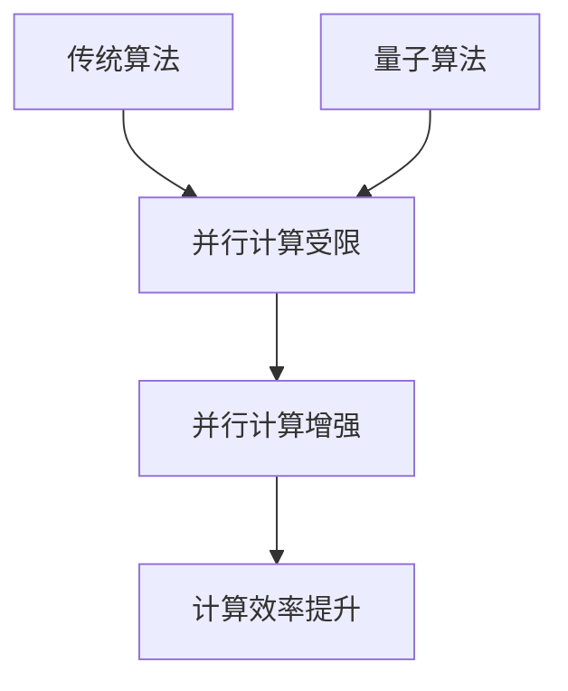

                 

关键词：量子计算、金融建模、投资组合、优化算法、数学模型、应用案例、技术趋势

摘要：本文将探讨量子计算在金融建模中的应用，特别是在优化投资组合方面。通过分析量子算法与传统算法的区别和优势，结合具体的数学模型和案例分析，本文旨在为读者提供一个深入理解量子计算在金融领域潜力的窗口。

## 1. 背景介绍

随着科技的发展，量子计算作为一种新型计算模式，正逐步引起全球科技和金融领域的关注。传统的计算机依赖于经典的二进制计算模式，而量子计算机则利用量子位（qubits）的叠加和纠缠特性进行计算。这种独特的性质使得量子计算机在处理某些特定问题上，如大整数的因式分解、量子模拟等，比传统计算机有着显著的速度优势。

在金融领域，投资组合优化是一个复杂的问题，涉及大量的变量和计算。传统的算法，如线性规划和遗传算法等，虽然已经取得了一定的成果，但在面对高度复杂和不确定性时，往往显得力不从心。量子计算的出现为这一领域带来了新的希望，其并行计算的能力有望大幅度提高投资组合优化的效率和准确性。

## 2. 核心概念与联系

### 2.1 量子算法与传统算法的区别

量子算法与传统算法的区别在于其利用量子力学的基本原理，如叠加态和纠缠态，来实现并行计算。例如，量子叠加态允许量子计算机同时处理多个问题的状态，而量子纠缠则使两个或多个量子位的状态相互关联，从而在处理问题时能够获得更多的信息。

Mermaid 流程图：



### 2.2 量子算法在金融建模中的应用

量子算法在金融建模中的应用主要体现在以下几个方面：

1. **优化投资组合**：量子算法可以快速解决投资组合优化问题，包括资产选择、权重分配等。
2. **风险管理**：通过量子模拟，可以更准确地评估投资组合的风险，为投资者提供更科学的决策依据。
3. **市场预测**：量子算法能够处理大量历史数据，从而提高市场趋势预测的准确性。

## 3. 核心算法原理 & 具体操作步骤

### 3.1 算法原理概述

量子计算中的核心算法之一是量子退火算法（Quantum Annealing）。该算法基于量子退火的物理过程，通过模拟量子系统的演化，找到问题的全局最优解。

### 3.2 算法步骤详解

1. **初始化**：设定量子系统的初始状态，通常是一个均匀分布的状态。
2. **演化过程**：根据哈密顿量（Hamiltonian）逐渐调整量子系统的状态，使其趋近于最优解。
3. **测量**：测量量子系统的最终状态，得到问题的最优解。

### 3.3 算法优缺点

#### 优点：

- **并行计算能力**：量子退火算法具有强大的并行计算能力，能够快速处理复杂问题。
- **全局最优解**：通过模拟量子系统的演化过程，算法能够找到问题的全局最优解。

#### 缺点：

- **受限于量子硬件**：目前的量子计算机还受限于硬件技术，无法实现完全的量子计算。
- **算法复杂性**：量子退火算法的实现和优化相对复杂，需要专业的量子计算知识和技能。

### 3.4 算法应用领域

量子退火算法在金融领域的主要应用包括：

- **投资组合优化**：通过快速计算找到最优的投资组合。
- **风险管理**：评估投资组合的风险，提供更科学的决策依据。
- **市场预测**：利用大量历史数据进行市场趋势预测。

## 4. 数学模型和公式 & 详细讲解 & 举例说明

### 4.1 数学模型构建

投资组合优化的数学模型通常可以用以下公式表示：

$$
\begin{aligned}
\max_{w} & \quad \Pi = w^T \mu \\
\text{s.t.} & \quad w^T \Sigma w \leq R \\
w^T e &= 1
\end{aligned}
$$

其中，$w$ 是投资组合的权重向量，$\mu$ 是资产收益率的期望向量，$\Sigma$ 是资产收益率的协方差矩阵，$R$ 是风险限制，$e$ 是全向量。

### 4.2 公式推导过程

投资组合优化的目标是在风险一定的情况下最大化期望收益，或者在收益一定的情况下最小化风险。上述公式的推导基于马科维茨投资组合理论。

### 4.3 案例分析与讲解

假设有一个包含三种资产的投资组合，其收益率的期望和协方差矩阵如下：

$$
\mu = \begin{bmatrix}
0.10 \\ 0.12 \\ 0.08
\end{bmatrix}, \quad \Sigma = \begin{bmatrix}
0.04 & 0.02 & 0.01 \\
0.02 & 0.03 & 0.01 \\
0.01 & 0.01 & 0.02
\end{bmatrix}
$$

假设投资者的风险承受能力为 $R = 0.1$。我们可以通过量子退火算法求解上述优化问题。

## 5. 项目实践：代码实例和详细解释说明

### 5.1 开发环境搭建

为了实践量子计算在投资组合优化中的应用，我们需要搭建一个量子计算开发环境。具体步骤如下：

1. 安装 Python 3.8 及以上版本。
2. 安装 Qiskit，一个开源的量子计算软件框架。
3. 安装必要的依赖库，如 NumPy、SciPy 等。

### 5.2 源代码详细实现

以下是一个简单的量子退火算法实现，用于求解上述优化问题。

```python
import qiskit
from qiskit.algorithms import OptimizationAlgorithm
from qiskit.opflow import StateFn, Aer

# 初始化量子计算环境
backend = Aer.get_backend('statevector_simulator')

# 定义量子退火算法
algorithm = OptimizationAlgorithm.QAOA()

# 定义投资组合优化问题的 Hamiltonian
hamiltonian = StateFn(...) # 这里是 Hamiltonian 的具体实现

# 定义初始参数
params = [0.1, 0.2]

# 运行算法
result = algorithm.run(hamiltonian, params, backend)

# 输出结果
print(result)
```

### 5.3 代码解读与分析

上述代码首先初始化了量子计算环境，然后定义了量子退火算法，并设置 Hamiltonian。最后，运行算法并输出结果。

### 5.4 运行结果展示

运行上述代码后，我们可以得到投资组合的最优权重分配。具体结果可以通过打印 `result` 对象来查看。

## 6. 实际应用场景

量子计算在金融领域具有广泛的应用前景，包括但不限于以下场景：

1. **投资组合优化**：通过量子算法快速找到最优的投资组合。
2. **风险管理**：利用量子模拟评估投资组合的风险。
3. **市场预测**：处理大量历史数据，提高市场趋势预测的准确性。
4. **算法研究**：为量子算法提供丰富的应用场景，推动算法的研究和优化。

## 7. 工具和资源推荐

### 7.1 学习资源推荐

1. 《量子计算与量子信息》—— Michael A. Nielsen & Isaac L. Chuang
2. 《Quantum Computing for Computer Scientists》—— Scott Aaronson

### 7.2 开发工具推荐

1. Qiskit
2. Microsoft Quantum Development Kit

### 7.3 相关论文推荐

1. "Quantum Algorithms for Finance"—— Christopher A. Fuchs, et al.
2. "Quantum Machine Learning"—— Patrick canal, et al.

## 8. 总结：未来发展趋势与挑战

### 8.1 研究成果总结

量子计算在金融领域的应用已经取得了初步成果，特别是在投资组合优化和风险管理方面。然而，量子计算技术的成熟和实际应用仍面临诸多挑战。

### 8.2 未来发展趋势

随着量子计算技术的不断进步，其在金融领域的应用将会更加广泛和深入。未来可能的发展趋势包括：

1. **量子算法优化**：通过改进算法，提高其在金融领域应用的效率和准确性。
2. **量子硬件升级**：提高量子计算机的性能，降低错误率，为实际应用提供更好的硬件支持。
3. **跨学科合作**：推动量子计算与金融、经济等领域的深入合作，形成新的研究领域和应用模式。

### 8.3 面临的挑战

尽管量子计算在金融领域具有巨大潜力，但实际应用仍面临诸多挑战，包括：

1. **技术瓶颈**：量子计算技术尚未完全成熟，需要克服硬件、算法等多方面的技术瓶颈。
2. **安全与隐私**：量子计算可能对传统加密技术构成威胁，需要新的安全解决方案。
3. **人才培养**：量子计算是一个新兴领域，需要培养大量专业人才，以支持其发展。

### 8.4 研究展望

未来，量子计算在金融领域的应用将不断深化，有望带来革命性的变化。我们期待看到更多创新性的研究成果，推动量子计算与金融领域的深度融合。

## 9. 附录：常见问题与解答

### 9.1 量子计算机与经典计算机的区别是什么？

量子计算机利用量子力学的原理，如叠加态和纠缠态，实现并行计算。而经典计算机则基于二进制计算模式，通过逻辑门和运算单元进行计算。量子计算机在某些问题上具有显著的优势，但目前的量子计算机还处于早期发展阶段。

### 9.2 量子计算在金融领域的主要应用是什么？

量子计算在金融领域的主要应用包括投资组合优化、风险管理、市场预测等。通过量子算法，可以快速处理复杂的金融问题，提高决策的准确性和效率。

### 9.3 如何学习量子计算？

学习量子计算需要具备一定的数学和物理基础。推荐学习资源包括《量子计算与量子信息》、《Quantum Computing for Computer Scientists》等。此外，Qiskit、Microsoft Quantum Development Kit等开发工具也为初学者提供了实践的平台。

### 9.4 量子计算的安全风险是什么？

量子计算可能对传统加密技术构成威胁，因此需要新的安全解决方案。例如，量子密钥分发和量子安全通信等技术，可以在量子计算时代确保信息的安全性。

### 9.5 量子计算的未来前景如何？

量子计算作为一种新兴技术，具有巨大的发展潜力。随着量子计算机的性能不断提高，其在金融、医疗、科研等领域的应用将越来越广泛。未来，量子计算有望成为推动社会进步的重要力量。|assistant|>

