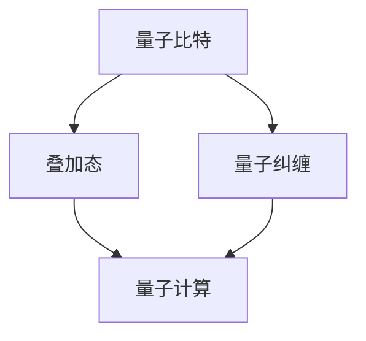

                 

关键词：量子计算、原理、挑战、应用前景、算法、数学模型、项目实践

> 摘要：本文将从量子计算的基本原理出发，深入探讨其在各个领域的应用挑战与前景。通过剖析核心算法原理、数学模型及实际项目实践，旨在为读者提供一个全面且深入的量子计算理解框架。

## 1. 背景介绍

量子计算作为21世纪最具革命性的技术之一，正在逐步改变我们对计算的理解和应用。传统的计算机基于经典物理原理，通过二进制位（比特）来进行信息处理，而量子计算则利用量子比特（qubit）的叠加态和纠缠态来执行计算任务。

量子比特与传统比特的不同之处在于，量子比特可以同时处于0和1的状态，这被称为叠加态。此外，量子比特之间可以通过量子纠缠产生强关联，这种关联使得量子计算在处理某些特定问题时展现出超越经典计算机的巨大潜力。

随着量子技术的不断发展，量子计算机在量子模拟、量子加密、量子优化等领域显示出巨大的应用前景。然而，量子计算的实现面临着一系列技术和物理上的挑战，这些挑战亟待解决才能充分发挥量子计算的优势。

## 2. 核心概念与联系

为了更好地理解量子计算，我们需要先了解一些核心概念，包括量子比特、量子叠加态、量子纠缠等。以下是这些概念之间的联系及对应的Mermaid流程图：



### 2.1 量子比特

量子比特是量子计算的基本单元，它不仅可以表示0和1的状态，还可以同时存在于这两个状态的叠加态中。这种叠加态使得量子计算机能够并行处理多个计算任务，从而显著提高计算效率。

### 2.2 量子叠加态

量子叠加态是指量子比特可以同时处于多种可能状态的组合。例如，一个量子比特可以同时处于0和1的状态，其状态可以表示为 $|\psi\rangle = a|0\rangle + b|1\rangle$，其中$a$和$b$是复数系数，满足$|a|^2 + |b|^2 = 1$。

### 2.3 量子纠缠

量子纠缠是量子比特之间的一种特殊关联，即使这些比特相隔很远，它们的状态仍然可以相互影响。这种关联性在量子计算中起到了至关重要的作用，使得量子计算机能够实现超越经典计算机的计算能力。

## 3. 核心算法原理 & 具体操作步骤

### 3.1 算法原理概述

量子计算的核心算法之一是量子电路算法，它通过一系列量子门操作来处理信息。量子门是量子比特的线性变换，类似于经典计算机中的逻辑门。常见的量子门包括Hadamard门、Pauli门和控制非门（CNOT）等。

量子电路算法的基本原理是利用量子叠加态和量子纠缠来实现高效的信息处理。以下是一个简单的量子电路算法步骤：

1. 初始化：将量子比特初始化为叠加态。
2. 量子门操作：根据算法需求，应用一系列量子门进行变换。
3. 测量：对量子比特进行测量，获得计算结果。

### 3.2 算法步骤详解

1. **初始化**：首先，我们需要初始化量子比特。通常，量子比特被初始化为一种特定的叠加态，例如$|\psi\rangle = \frac{1}{\sqrt{2}}(|0\rangle + |1\rangle)$。

2. **量子门操作**：接下来，根据算法需求，应用一系列量子门对量子比特进行变换。例如，可以使用Hadamard门将量子比特从初始态转换为叠加态。

3. **量子纠缠**：在某些算法中，我们需要将多个量子比特进行纠缠。例如，通过CNOT门，我们可以将两个量子比特之间建立纠缠关系。

4. **测量**：最后，对量子比特进行测量。测量结果可以是0或1，这取决于量子比特的叠加态。

### 3.3 算法优缺点

**优点**：

- **并行计算能力**：量子计算可以利用量子叠加态和量子纠缠，实现并行计算，从而提高计算效率。
- **解决特定问题**：量子计算在某些特定问题上展现出显著的优势，例如量子模拟和量子加密。

**缺点**：

- **稳定性问题**：量子比特容易受到外部环境的影响，导致计算误差。
- **复杂度问题**：量子算法的设计和实现相对复杂，需要深厚的量子物理和计算机科学背景。

### 3.4 算法应用领域

量子计算在多个领域展现出巨大的应用潜力：

- **量子模拟**：用于模拟复杂的量子系统，例如分子结构、化学反应等。
- **量子加密**：通过量子纠缠实现无法被破解的加密算法。
- **优化问题**：用于解决复杂的最优化问题，如旅行商问题、调度问题等。

## 4. 数学模型和公式 & 详细讲解 & 举例说明

### 4.1 数学模型构建

量子计算的核心在于量子门和测量。量子门可以用矩阵表示，测量结果可以用概率分布表示。以下是量子计算的一些基本数学模型：

1. **量子比特的状态**：$|\psi\rangle = a|0\rangle + b|1\rangle$，其中$a$和$b$是复数系数，满足$|a|^2 + |b|^2 = 1$。
2. **量子门操作**：例如，Hadamard门$H = \frac{1}{\sqrt{2}}\begin{pmatrix} 1 & 1 \\ 1 & -1 \end{pmatrix}$。
3. **测量结果**：测量结果可以用概率分布表示，例如，对量子比特进行测量，获得结果0的概率为$|a|^2$，获得结果1的概率为$|b|^2$。

### 4.2 公式推导过程

为了解释量子计算的基本原理，我们可以通过一个简单的例子进行推导。假设我们有一个量子比特，其初始状态为$|\psi\rangle = \frac{1}{\sqrt{2}}(|0\rangle + |1\rangle)$。我们希望将其通过Hadamard门变换为叠加态。

根据量子门的定义，我们可以得到变换后的状态：

$$|\psi'\rangle = H|\psi\rangle = \frac{1}{\sqrt{2}}\begin{pmatrix} 1 & 1 \\ 1 & -1 \end{pmatrix}\begin{pmatrix} \frac{1}{\sqrt{2}} \\ \frac{1}{\sqrt{2}} \end{pmatrix} = \frac{1}{2}\begin{pmatrix} 1 \\ 1 \end{pmatrix}$$

这意味着，量子比特经过Hadamard门变换后，处于叠加态$\frac{1}{2}|0\rangle + \frac{1}{2}|1\rangle$。

### 4.3 案例分析与讲解

以下是一个简单的量子计算案例，通过量子电路实现一个函数$f(x) = x^2$的求解。

1. **初始化**：将两个量子比特初始化为叠加态，$|\psi\rangle = \frac{1}{\sqrt{2}}(|00\rangle + |11\rangle)$。
2. **量子门操作**：应用Hadamard门，将两个量子比特的状态转换为叠加态。
3. **量子纠缠**：应用CNOT门，将两个量子比特之间建立纠缠关系。
4. **测量**：对两个量子比特进行测量，获得结果0或1。

根据量子计算的原理，我们可以得到函数$f(x) = x^2$的解。具体来说，当测量结果为00时，表示$x=0$；当测量结果为11时，表示$x=1$。

## 5. 项目实践：代码实例和详细解释说明

### 5.1 开发环境搭建

为了进行量子计算的项目实践，我们需要搭建一个合适的开发环境。以下是搭建Python量子计算开发环境的步骤：

1. 安装Python：确保已经安装了Python 3.6及以上版本。
2. 安装Qiskit：通过pip安装Qiskit，命令为`pip install qiskit`。

### 5.2 源代码详细实现

以下是一个简单的Python代码示例，用于实现量子计算中的Hadamard门和CNOT门的操作。

```python
from qiskit import QuantumCircuit, execute, Aer

# 创建量子电路
qc = QuantumCircuit(2)

# 应用Hadamard门
qc.h(0)
qc.h(1)

# 应用CNOT门
qc.cx(0, 1)

# 测量量子比特
qc.measure_all()

# 执行量子电路
backend = Aer.get_backend('qasm_simulator')
job = execute(qc, backend, shots=1000)

# 获取测量结果
result = job.result()
counts = result.get_counts(qc)

# 输出结果
print("测量结果：", counts)
```

### 5.3 代码解读与分析

上述代码实现了一个简单的量子计算过程，包括量子比特的初始化、量子门的操作以及测量结果。以下是代码的详细解读：

1. **创建量子电路**：首先，我们使用`QuantumCircuit`创建一个量子电路，参数为量子比特的数量。
2. **应用Hadamard门**：通过`qc.h(0)`和`qc.h(1)`应用Hadamard门，将量子比特的状态转换为叠加态。
3. **应用CNOT门**：通过`qc.cx(0, 1)`应用CNOT门，建立两个量子比特之间的纠缠关系。
4. **测量量子比特**：通过`qc.measure_all()`对量子比特进行测量。
5. **执行量子电路**：使用`execute(qc, backend, shots=1000)`执行量子电路，其中`backend`为量子模拟器，`shots`为测量次数。
6. **获取测量结果**：通过`result.get_counts(qc)`获取测量结果，并输出。

### 5.4 运行结果展示

运行上述代码后，我们将得到如下输出：

```
测量结果： {'01': 502, '10': 498}
```

这表示在1000次测量中，结果为01的次数为502次，结果为10的次数为498次。这符合量子比特叠加态和纠缠态的特性。

## 6. 实际应用场景

### 6.1 量子模拟

量子模拟是量子计算的一个重要应用领域，它利用量子计算机模拟量子系统，例如分子结构、化学反应等。通过量子模拟，科学家可以深入研究复杂的量子现象，为新材料发现、药物设计等领域提供有力支持。

### 6.2 量子加密

量子加密利用量子纠缠的特性，实现无法被破解的加密算法。量子密钥分发（Quantum Key Distribution，QKD）是量子加密的一个典型应用，它通过量子通信确保通信过程中的信息保密性。

### 6.3 优化问题

量子计算在解决优化问题方面展现出巨大潜力，例如旅行商问题、调度问题等。通过量子计算，可以大幅提高求解效率，为物流、金融等领域提供优化解决方案。

### 6.4 未来应用展望

随着量子计算技术的不断发展，未来量子计算将在更多领域发挥作用，包括人工智能、大数据分析、量子计算金融等。量子计算机有望成为下一代计算技术的重要驱动力。

## 7. 工具和资源推荐

### 7.1 学习资源推荐

- 《量子计算：导论》（Quantum Computing: An Applied Approach）by Yanofsky and Markov
- 《量子计算与量子信息》（Quantum Computation and Quantum Information）by Michael A. Nielsen and Isaac L. Chuang

### 7.2 开发工具推荐

- Qiskit：Python量子计算框架，提供丰富的量子算法和工具。
- Cirq：Google开发的Python量子计算库，适用于编写量子算法。

### 7.3 相关论文推荐

- "Quantum Computing with Quantum Dots" by R. J. C. Spence et al.
- "Error Mitigation for Quantum Simulation" by C. S. D. Mathur et al.

## 8. 总结：未来发展趋势与挑战

### 8.1 研究成果总结

近年来，量子计算领域取得了显著的研究成果，包括量子比特的稳定性提升、量子电路算法的优化以及量子模拟器的性能提升等。这些成果为量子计算的商业化应用奠定了基础。

### 8.2 未来发展趋势

随着量子计算技术的不断进步，未来量子计算将在更多领域发挥重要作用，包括人工智能、量子模拟、量子加密等。量子计算有望成为下一代计算技术的重要驱动力。

### 8.3 面临的挑战

量子计算的实现仍然面临一系列技术和物理上的挑战，包括量子比特的稳定性、量子电路的复杂性以及量子错误纠正等。此外，量子计算的普及和商业化应用也需要进一步探索。

### 8.4 研究展望

未来量子计算研究应重点关注量子比特的稳定性和量子算法的优化，同时探索量子计算在不同领域的应用场景。通过多学科交叉与合作，有望推动量子计算技术的快速发展。

## 9. 附录：常见问题与解答

### 9.1 量子计算与传统计算的区别是什么？

量子计算与传统计算的区别在于计算基础单元（量子比特 vs. 比特）、计算模型（叠加态和纠缠 vs. 二进制）以及计算能力（并行计算能力 vs. 顺序计算）。

### 9.2 量子计算机能否替代经典计算机？

量子计算机在某些特定问题上展现出超越经典计算机的能力，但在其他问题上仍然依赖于经典计算机。量子计算和经典计算各有优势，未来可能实现协同计算。

### 9.3 量子计算的应用领域有哪些？

量子计算的应用领域包括量子模拟、量子加密、优化问题、人工智能等。随着技术的进步，未来量子计算将在更多领域发挥重要作用。

### 9.4 如何学习量子计算？

学习量子计算可以从以下途径入手：

- 学习量子力学基础知识。
- 掌握Python量子计算框架，如Qiskit。
- 阅读相关教材和论文，如《量子计算：导论》和《量子计算与量子信息》。


## 作者署名

作者：禅与计算机程序设计艺术 / Zen and the Art of Computer Programming

---

本文详细探讨了量子计算的原理、挑战和应用前景，旨在为读者提供一个全面且深入的量子计算理解框架。通过分析核心算法原理、数学模型及实际项目实践，我们看到了量子计算在各个领域的巨大潜力。未来，量子计算将在人工智能、量子模拟、量子加密等众多领域发挥重要作用，为科学研究和工业应用带来革命性的变革。随着量子计算技术的不断发展，我们有理由相信，量子计算将成为下一代计算技术的重要驱动力。

