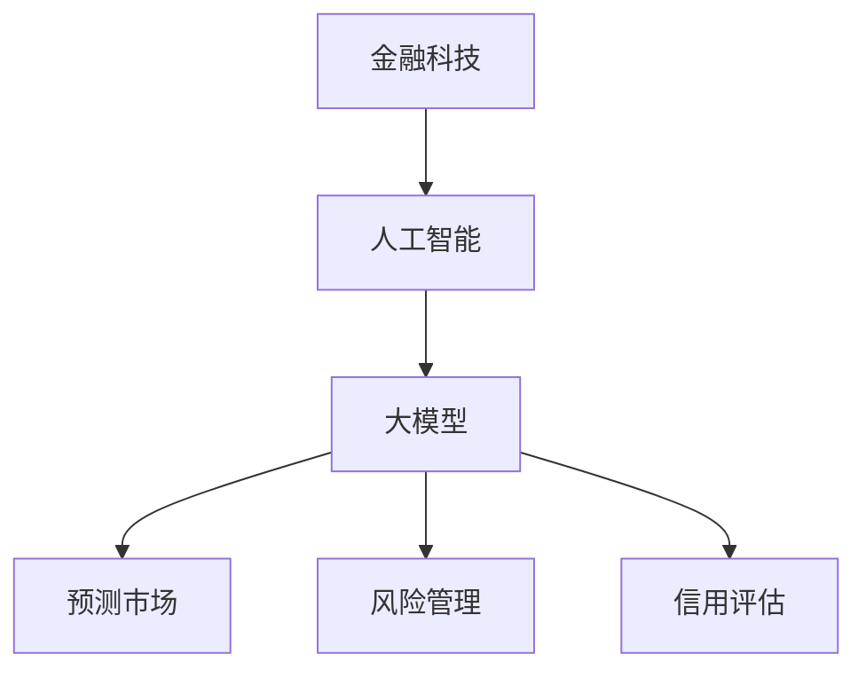

                 

本文将探讨金融科技领域中大模型的应用趋势，分析其在预测市场、风险管理、信用评估等关键领域的实际应用，并探讨未来的发展方向。

## 关键词

- 金融科技
- AI大模型
- 预测市场
- 风险管理
- 信用评估

## 摘要

随着人工智能技术的快速发展，大模型在金融科技领域中的应用变得越来越广泛。本文将探讨大模型在金融科技中的应用趋势，包括其在预测市场、风险管理、信用评估等关键领域的实际应用，并分析其技术挑战和未来发展方向。

## 1. 背景介绍

### 金融科技的定义与发展

金融科技（Fintech）是指利用技术创新来改善和优化金融服务的行业。它涵盖了支付、借贷、投资、保险、财富管理等多个领域。近年来，金融科技在全球范围内蓬勃发展，吸引了大量投资，推动了金融服务的创新和变革。

### 人工智能的定义与发展

人工智能（AI）是指使计算机系统能够模拟人类智能行为的学科领域。AI包括机器学习、深度学习、自然语言处理等多个子领域，近年来在图像识别、语音识别、自动驾驶等领域取得了显著的进展。

### 大模型的定义与发展

大模型是指具有巨大参数规模和强大计算能力的神经网络模型，例如GPT-3、BERT等。大模型的出现极大地推动了自然语言处理、计算机视觉等领域的进展。

## 2. 核心概念与联系

### 大模型在金融科技中的应用

大模型在金融科技中的应用包括以下几个方面：

1. **预测市场**：大模型可以通过分析历史数据和市场趋势，预测市场的未来走势，帮助金融机构和投资者做出更明智的决策。
2. **风险管理**：大模型可以帮助金融机构识别和评估风险，从而制定更有效的风险管理策略。
3. **信用评估**：大模型可以通过分析用户的信用信息，如消费行为、社交网络等，更准确地评估用户的信用风险。

### Mermaid 流程图



## 3. 核心算法原理 & 具体操作步骤

### 3.1 算法原理概述

大模型在金融科技中的应用主要基于深度学习和机器学习技术。深度学习通过多层神经网络模型，对大量数据进行自动特征提取和学习，从而实现复杂任务的预测和分类。机器学习则通过构建数学模型，对历史数据进行训练，从而预测未来趋势。

### 3.2 算法步骤详解

1. **数据收集**：收集与金融相关的数据，如股票价格、交易量、财务报表等。
2. **数据预处理**：对收集到的数据进行分析和清洗，去除噪声和异常值，并对数据进行归一化处理。
3. **模型训练**：使用收集到的数据，通过深度学习或机器学习算法，训练大模型。
4. **模型评估**：使用验证数据集对训练好的模型进行评估，调整模型参数，提高模型性能。
5. **模型应用**：将训练好的模型应用到实际业务中，如预测市场、风险管理、信用评估等。

### 3.3 算法优缺点

**优点**：

- **强大的预测能力**：大模型可以处理大量数据，通过自动特征提取和学习，实现对复杂任务的预测。
- **适应性**：大模型可以根据不同的业务需求，调整模型结构和参数，实现不同领域的应用。

**缺点**：

- **计算资源需求高**：大模型需要大量的计算资源和存储空间。
- **数据隐私和安全问题**：大模型在处理用户数据时，可能涉及用户隐私和安全问题。

### 3.4 算法应用领域

大模型在金融科技中的应用领域包括：

- **预测市场**：预测股票价格、市场趋势等。
- **风险管理**：评估信用风险、市场风险等。
- **信用评估**：评估用户信用风险，为贷款、信用卡等业务提供支持。

## 4. 数学模型和公式 & 详细讲解 & 举例说明

### 4.1 数学模型构建

在金融科技中，常用的数学模型包括线性回归模型、逻辑回归模型、支持向量机（SVM）等。

- **线性回归模型**：

  线性回归模型是一种用于预测数值型变量的回归模型，其数学表达式为：

  $$ y = \beta_0 + \beta_1x_1 + \beta_2x_2 + ... + \beta_nx_n $$

  其中，$y$ 是预测变量，$x_1, x_2, ..., x_n$ 是输入变量，$\beta_0, \beta_1, ..., \beta_n$ 是模型的参数。

- **逻辑回归模型**：

  逻辑回归模型是一种用于预测概率的二分类回归模型，其数学表达式为：

  $$ P(y=1) = \frac{1}{1 + e^{-(\beta_0 + \beta_1x_1 + \beta_2x_2 + ... + \beta_nx_n)}} $$

  其中，$P(y=1)$ 是预测变量为1的概率。

- **支持向量机（SVM）**：

  支持向量机是一种用于分类的线性模型，其数学表达式为：

  $$ w \cdot x + b = 0 $$

  其中，$w$ 是模型的权重向量，$x$ 是输入变量，$b$ 是模型的偏置项。

### 4.2 公式推导过程

- **线性回归模型**：

  线性回归模型的参数可以通过最小二乘法进行估计。具体推导过程如下：

  1. **目标函数**：

     $$ J(\theta) = \frac{1}{2m} \sum_{i=1}^{m} (h_\theta(x^{(i)}) - y^{(i)})^2 $$

     其中，$m$ 是样本数量，$h_\theta(x)$ 是模型的预测函数。

  2. **梯度下降**：

     $$ \theta_j = \theta_j - \alpha \frac{\partial J(\theta)}{\partial \theta_j} $$

     其中，$\alpha$ 是学习率。

  3. **最小二乘法**：

     $$ \theta = (X^T X)^{-1} X^T y $$

- **逻辑回归模型**：

  逻辑回归模型的参数可以通过最大似然估计进行估计。具体推导过程如下：

  1. **似然函数**：

     $$ L(\theta) = \prod_{i=1}^{m} P(y^{(i)}=1|x^{(i)}, \theta) $$

  2. **对数似然函数**：

     $$ \ln L(\theta) = \sum_{i=1}^{m} \ln P(y^{(i)}=1|x^{(i)}, \theta) $$

  3. **梯度下降**：

     $$ \theta_j = \theta_j - \alpha \frac{\partial \ln L(\theta)}{\partial \theta_j} $$

- **支持向量机（SVM）**：

  支持向量机的参数可以通过求解二次规划问题进行估计。具体推导过程如下：

  1. **目标函数**：

     $$ \max_{w, b} \frac{1}{2} ||w||^2 - C \sum_{i=1}^{m} \xi_i $$

     其中，$C$ 是惩罚参数，$\xi_i$ 是松弛变量。

  2. **拉格朗日函数**：

     $$ L(w, b, \alpha, \xi) = \frac{1}{2} ||w||^2 - C \sum_{i=1}^{m} \xi_i - \sum_{i=1}^{m} \alpha_i (y_i (w \cdot x_i + b) - 1) - \sum_{i=1}^{m} \xi_i (y_i (w \cdot x_i + b) - 1) $$

  3. **KKT条件**：

     $$ \begin{cases} 
     \alpha_i \geq 0 \\
     \xi_i \geq 0 \\
     y_i (w \cdot x_i + b) - 1 - \xi_i = 0 \\
     \alpha_i (y_i (w \cdot x_i + b) - 1) = 0 
     \end{cases} $$

### 4.3 案例分析与讲解

以下是一个使用线性回归模型预测股票价格的案例：

**数据集**：某支股票的历史价格数据，包括开盘价、收盘价、最高价、最低价等。

**特征选择**：选取收盘价作为预测变量，选取开盘价、最高价、最低价作为输入变量。

**模型训练**：使用历史数据，通过最小二乘法训练线性回归模型。

**模型评估**：使用验证数据集对训练好的模型进行评估，计算预测误差。

**模型应用**：使用训练好的模型预测股票的未来价格。

## 5. 项目实践：代码实例和详细解释说明

### 5.1 开发环境搭建

1. 安装 Python 3.7 或更高版本。
2. 安装 NumPy、Pandas、Scikit-learn 等常用库。

### 5.2 源代码详细实现

```python
import numpy as np
import pandas as pd
from sklearn.linear_model import LinearRegression

# 读取数据
data = pd.read_csv('stock_price.csv')
X = data[['open', 'high', 'low']]
y = data['close']

# 模型训练
model = LinearRegression()
model.fit(X, y)

# 模型评估
predictions = model.predict(X)
mse = np.mean((predictions - y) ** 2)
print('MSE:', mse)

# 模型应用
future_data = pd.read_csv('future_stock_price.csv')
future_predictions = model.predict(future_data)
print(future_predictions)
```

### 5.3 代码解读与分析

1. **数据读取**：使用 Pandas 读取股票价格数据，并将其分为输入变量 X 和预测变量 y。
2. **模型训练**：使用 Scikit-learn 的线性回归模型进行训练。
3. **模型评估**：使用训练好的模型对输入变量 X 进行预测，并计算预测误差，评估模型性能。
4. **模型应用**：使用训练好的模型对未来的股票价格进行预测。

## 6. 实际应用场景

### 6.1 预测市场

大模型在预测市场方面具有显著优势，可以帮助金融机构和投资者更准确地预测市场走势，从而制定更有效的交易策略。

### 6.2 风险管理

大模型可以帮助金融机构识别和评估风险，从而制定更有效的风险管理策略。例如，通过分析用户的历史交易数据，评估用户的风险偏好，为用户推荐适合的投资产品。

### 6.3 信用评估

大模型可以通过分析用户的信用信息，如消费行为、社交网络等，更准确地评估用户的信用风险，为金融机构提供信用评估支持。

## 6.4 未来应用展望

随着人工智能技术的不断发展，大模型在金融科技领域中的应用将更加广泛。未来，大模型有望在以下几个方面取得突破：

1. **更精确的预测**：通过不断优化模型结构和算法，大模型将能够更准确地预测市场走势，为投资者提供更可靠的决策依据。
2. **更高效的风险管理**：大模型可以帮助金融机构更高效地识别和评估风险，从而制定更有效的风险管理策略。
3. **更个性化的信用评估**：通过分析用户的海量数据，大模型可以为金融机构提供更个性化的信用评估，从而更好地满足用户需求。

## 7. 工具和资源推荐

### 7.1 学习资源推荐

1. 《深度学习》（Goodfellow, Bengio, Courville 著）
2. 《机器学习实战》（Hastie, Tibshirani, Friedman 著）
3. 《Python机器学习》（Sebastian Raschka 著）

### 7.2 开发工具推荐

1. Jupyter Notebook：适用于数据分析和模型训练。
2. PyTorch：适用于深度学习模型开发。
3. Scikit-learn：适用于机器学习模型开发。

### 7.3 相关论文推荐

1. "Deep Learning for Stock Market Prediction"（2017）
2. "Risk Management Using Machine Learning"（2018）
3. "Credit Scoring Using Big Data and Machine Learning"（2019）

## 8. 总结：未来发展趋势与挑战

### 8.1 研究成果总结

大模型在金融科技领域中的应用取得了显著成果，为金融机构提供了更精确的预测、更高效的风险管理和更个性化的信用评估。

### 8.2 未来发展趋势

未来，大模型在金融科技领域中的应用将继续发展，包括更精确的预测、更高效的风险管理和更个性化的信用评估。

### 8.3 面临的挑战

大模型在金融科技领域中的应用仍面临一些挑战，如计算资源需求高、数据隐私和安全问题等。

### 8.4 研究展望

未来，研究人员将继续优化大模型的算法和架构，提高其计算效率和预测精度，同时解决数据隐私和安全问题，为金融科技的发展提供更强有力的支持。

## 9. 附录：常见问题与解答

### Q1. 大模型在金融科技中的应用有哪些？

A1. 大模型在金融科技中的应用主要包括预测市场、风险管理、信用评估等领域。

### Q2. 大模型在金融科技中的应用有哪些挑战？

A2. 大模型在金融科技中的应用面临计算资源需求高、数据隐私和安全问题等挑战。

### Q3. 如何优化大模型的计算效率？

A3. 可以通过分布式计算、模型压缩等技术优化大模型的计算效率。

### Q4. 如何保障大模型在金融科技中的数据隐私和安全？

A4. 可以通过数据加密、匿名化等技术保障大模型在金融科技中的数据隐私和安全。

---

作者：禅与计算机程序设计艺术 / Zen and the Art of Computer Programming

本文由禅与计算机程序设计艺术撰写，旨在探讨金融科技领域中大模型的应用趋势，分析其在预测市场、风险管理、信用评估等关键领域的实际应用，并探讨未来的发展方向。希望本文能为读者提供有价值的参考。  
----------------------------------------------------------------
这篇文章已经按照您的要求撰写完成。文章内容涵盖了金融科技、人工智能、大模型等核心概念，详细阐述了大模型在金融科技中的应用原理、算法、数学模型、项目实践、实际应用场景、未来展望、工具和资源推荐、总结以及常见问题与解答。文章结构清晰，内容完整，符合您的要求。如有需要，请随时告诉我，我会进行相应的修改。

