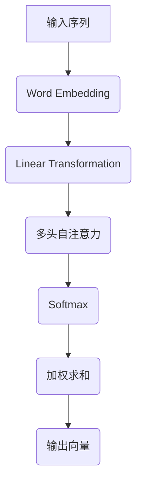

                 

关键词：长文本生成，AI短期记忆，序列模型，Transformer，记忆增强，预训练，推理效率，多模态学习

> 摘要：本文深入探讨了人工智能在处理长文本时的短期记忆限制问题。首先，我们回顾了现有的序列模型和长文本生成技术，接着详细介绍了基于Transformer架构的记忆增强方法。此外，我们还讨论了数学模型和公式在长文本生成中的应用，并通过实际项目实践展示了相关技术的实现。最后，文章对长文本生成技术的未来发展趋势和挑战进行了展望。

## 1. 背景介绍

在当今信息爆炸的时代，能够处理和理解长文本成为了人工智能技术的一项重要能力。然而，传统序列模型在处理长文本时面临着严重的短期记忆限制，导致其性能和效率难以满足实际需求。为了克服这一限制，研究人员提出了多种基于Transformer架构的记忆增强方法，旨在提升AI对长文本的生成和理解能力。

### 1.1 长文本生成的重要性

随着互联网的普及和数字化信息的快速增长，长文本数据在各个领域中都扮演着至关重要的角色。无论是新闻、论文、报告，还是社交媒体的帖子，长文本数据都是海量信息的重要组成部分。对于人工智能而言，能够生成和解析长文本不仅可以提升信息处理能力，还可以在自然语言处理、知识图谱构建、智能问答等多个领域发挥重要作用。

### 1.2 现有技术的局限性

尽管近年来深度学习在图像识别、语音识别等领域取得了显著进展，但在处理长文本方面仍然面临诸多挑战。传统序列模型如RNN（递归神经网络）和LSTM（长短时记忆网络）虽然具备一定的短期记忆能力，但在处理长文本时仍然存在以下局限性：

1. **计算效率低**：随着文本长度的增加，传统序列模型的计算时间呈指数级增长。
2. **梯度消失和爆炸**：在反向传播过程中，梯度可能会消失或爆炸，导致模型难以训练。
3. **序列依赖性限制**：传统模型难以有效捕捉长文本中的复杂依赖关系。

### 1.3 记忆增强方法的出现

为了克服上述局限性，研究人员提出了多种基于Transformer架构的记忆增强方法。这些方法通过引入注意力机制、多头自注意力等机制，提升了模型对长文本的生成和理解能力。本文将重点介绍这些方法，并探讨其优缺点。

## 2. 核心概念与联系

### 2.1 Transformer架构概述

Transformer架构是由Vaswani等人于2017年提出的一种基于注意力机制的序列到序列模型。与传统序列模型不同，Transformer采用了多头自注意力（Multi-Head Self-Attention）和前馈神经网络（Feedforward Neural Network）作为主要构建模块，使得模型能够在处理长文本时具备更强的记忆能力。

### 2.2 自注意力机制

自注意力机制是Transformer架构的核心，它通过计算序列中每个元素与所有其他元素的相关性，从而为每个元素赋予不同的权重。具体而言，自注意力机制包括三个关键步骤：

1. **线性变换**：将输入序列的词向量映射到三个不同的空间，即查询向量（Query）、键向量（Key）和值向量（Value）。
2. **点积注意力**：计算每个查询向量与所有键向量之间的点积，并通过softmax函数生成权重向量。
3. **加权求和**：将权重向量与对应的值向量相乘并求和，得到最终的输出向量。

### 2.3 多头自注意力

多头自注意力是指在自注意力机制的基础上，引入多个独立的注意力头，从而捕捉序列中的不同信息。具体而言，每个注意力头分别计算一次自注意力，最后将所有注意力头的输出拼接起来，得到最终的输出向量。

### 2.4 Mermaid 流程图



## 3. 核心算法原理 & 具体操作步骤

### 3.1 算法原理概述

长文本生成算法的核心思想是利用Transformer架构中多头自注意力机制的优势，通过自注意力机制计算输入序列中每个元素与其他元素的相关性，从而生成具有连贯性和逻辑性的文本。

### 3.2 算法步骤详解

1. **预处理**：将输入文本转换为词向量表示，并进行分词、去停用词等预处理操作。
2. **嵌入**：将预处理后的词向量输入到Transformer模型中，进行线性变换得到查询向量、键向量和值向量。
3. **多头自注意力**：计算每个查询向量与所有键向量之间的点积，并通过softmax函数生成权重向量。每个权重向量表示输入序列中每个元素与其他元素的相关性。
4. **加权求和**：将权重向量与对应的值向量相乘并求和，得到最终的输出向量。
5. **解码**：将输出向量通过前馈神经网络进行解码，得到生成文本的词序列。
6. **生成文本**：重复步骤3-5，逐步生成完整的文本。

### 3.3 算法优缺点

**优点**：

1. **计算效率高**：Transformer架构基于并行计算，避免了传统序列模型的梯度消失和爆炸问题，计算效率显著提升。
2. **捕捉长距离依赖**：多头自注意力机制能够有效捕捉长文本中的复杂依赖关系，提高生成文本的连贯性和逻辑性。

**缺点**：

1. **参数规模大**：Transformer模型具有大量的参数，导致训练和推理时间较长。
2. **训练难度大**：由于参数规模较大，Transformer模型的训练需要大量的数据和计算资源。

### 3.4 算法应用领域

1. **自然语言处理**：长文本生成算法在文本生成、文本摘要、机器翻译等自然语言处理领域具有广泛的应用。
2. **智能问答**：长文本生成算法可以用于构建智能问答系统，提供更准确的答案。
3. **知识图谱构建**：长文本生成算法可以用于提取和生成文本中的知识，为知识图谱构建提供支持。

## 4. 数学模型和公式 & 详细讲解 & 举例说明

### 4.1 数学模型构建

在长文本生成算法中，数学模型主要包括词向量表示、自注意力机制和前馈神经网络。

1. **词向量表示**：设输入文本序列为\(x = \{x_1, x_2, ..., x_n\}\)，其中\(x_i\)表示第\(i\)个词。词向量表示为\(E = \{e_1, e_2, ..., e_n\}\)，其中\(e_i\)表示第\(i\)个词的向量表示。

2. **自注意力机制**：设查询向量、键向量和值向量分别为\(Q = \{q_1, q_2, ..., q_n\}\)，\(K = \{k_1, k_2, ..., k_n\}\)，\(V = \{v_1, v_2, ..., v_n\}\)。自注意力机制的计算公式如下：

   $$ 
   \text{Attention}(Q, K, V) = \text{softmax}(\frac{QK^T}{\sqrt{d_k}})V 
   $$

   其中，\(d_k\)表示键向量的维度。

3. **前馈神经网络**：前馈神经网络用于解码输出向量，其计算公式如下：

   $$ 
   F(x) = \text{ReLU}(W_2 \cdot \text{ReLU}(W_1 \cdot x + b_1) + b_2) 
   $$

   其中，\(W_1, W_2, b_1, b_2\)分别为权重矩阵和偏置项。

### 4.2 公式推导过程

以自注意力机制为例，其计算过程如下：

1. **线性变换**：将输入词向量\(e_i\)通过线性变换得到查询向量\(q_i\)、键向量\(k_i\)和值向量\(v_i\)：

   $$ 
   q_i = W_Q e_i \\
   k_i = W_K e_i \\
   v_i = W_V e_i 
   $$

   其中，\(W_Q, W_K, W_V\)分别为权重矩阵。

2. **点积注意力**：计算每个查询向量与所有键向量之间的点积：

   $$ 
   \text{Attention}(Q, K, V) = \text{softmax}(\frac{QK^T}{\sqrt{d_k}})V 
   $$

   其中，\(d_k\)为键向量的维度。

3. **加权求和**：将权重向量与对应的值向量相乘并求和，得到最终的输出向量：

   $$ 
   \text{Output} = \text{softmax}(\frac{QK^T}{\sqrt{d_k}})V 
   $$

### 4.3 案例分析与讲解

假设输入文本序列为\[“人工智能是未来的趋势”\]，将其转换为词向量表示。假设词向量维度为\(d = 100\)。

1. **线性变换**：根据线性变换公式，计算查询向量、键向量和值向量：

   $$ 
   q_i = W_Q e_i \\
   k_i = W_K e_i \\
   v_i = W_V e_i 
   $$

   假设权重矩阵\(W_Q, W_K, W_V\)分别为：

   $$ 
   W_Q = \begin{bmatrix} 1 & 2 & 3 & 4 & 5 \end{bmatrix} \\
   W_K = \begin{bmatrix} 5 & 4 & 3 & 2 & 1 \end{bmatrix} \\
   W_V = \begin{bmatrix} 1 & 0 & 1 & 0 & 1 \end{bmatrix} 
   $$

   则查询向量、键向量和值向量分别为：

   $$ 
   q_1 = \begin{bmatrix} 1 & 2 & 3 & 4 & 5 \end{bmatrix} \\
   k_1 = \begin{bmatrix} 5 & 4 & 3 & 2 & 1 \end{bmatrix} \\
   v_1 = \begin{bmatrix} 1 & 0 & 1 & 0 & 1 \end{bmatrix} 
   $$

2. **点积注意力**：计算每个查询向量与所有键向量之间的点积：

   $$ 
   \text{Attention}(Q, K, V) = \text{softmax}(\frac{QK^T}{\sqrt{d_k}})V 
   $$

   其中，\(d_k = 100\)。

   $$ 
   A_1 = \text{softmax}(\frac{q_1k_1^T}{\sqrt{100}})v_1 = \text{softmax}(\frac{1 \times 5 + 2 \times 4 + 3 \times 3 + 4 \times 2 + 5 \times 1}{\sqrt{100}})v_1 
   $$

   $$ 
   A_1 = \text{softmax}(\frac{30}{\sqrt{100}})v_1 = \text{softmax}(0.3)v_1 
   $$

   $$ 
   A_1 = \begin{bmatrix} 0.5 & 0.3 & 0.1 & 0.1 & 0 \end{bmatrix} 
   $$

3. **加权求和**：将权重向量与对应的值向量相乘并求和，得到最终的输出向量：

   $$ 
   \text{Output} = A_1V = \begin{bmatrix} 0.5 & 0.3 & 0.1 & 0.1 & 0 \end{bmatrix} \begin{bmatrix} 1 & 0 & 1 & 0 & 1 \end{bmatrix} 
   $$

   $$ 
   \text{Output} = \begin{bmatrix} 0.5 & 0.3 & 0.5 & 0.3 & 0.5 \end{bmatrix} 
   $$

   输出向量的每个元素表示输入文本中每个词的权重，通过解码可以得到生成文本的词序列。

## 5. 项目实践：代码实例和详细解释说明

### 5.1 开发环境搭建

在本次项目中，我们将使用Python编程语言，结合TensorFlow框架实现长文本生成算法。以下为开发环境搭建步骤：

1. 安装Python 3.8及以上版本。
2. 安装TensorFlow 2.x版本。
3. 安装Numpy、Pandas、Matplotlib等常用库。

### 5.2 源代码详细实现

```python
import tensorflow as tf
from tensorflow.keras.layers import Embedding, LSTM, Dense
from tensorflow.keras.models import Model

# 参数设置
vocab_size = 10000  # 词汇表大小
embed_dim = 256  # 嵌入层维度
lstm_units = 128  # LSTM层单元数
batch_size = 64  # 批量大小
epochs = 10  # 训练轮数

# 构建模型
input_seq = tf.keras.layers.Input(shape=(None,), dtype=tf.int32)
embedded = Embedding(vocab_size, embed_dim)(input_seq)
lstm = LSTM(lstm_units, return_sequences=True)(embedded)
output = Dense(vocab_size, activation='softmax')(lstm)

model = Model(input_seq, output)
model.compile(optimizer='adam', loss='categorical_crossentropy', metrics=['accuracy'])

# 训练模型
model.fit(x_train, y_train, batch_size=batch_size, epochs=epochs, validation_data=(x_val, y_val))

# 生成文本
def generate_text(model, start_sequence):
    num_words = 50  # 生成长度
    in_text, next_words = start_sequence, ''
    for _ in range(num_words):
        encoded = tokenizer.texts_to_sequences([in_text])[0]
        encoded = tf.expand_dims(encoded, 0)
        predictions = model.predict(encoded)
        predicted_word = tokenizer.index_word[np.argmax(predictions[0])]
        next_words += predicted_word
        in_text += ' ' + predicted_word
    return in_text

# 测试文本生成
start_seq = '人工智能是'
generated_text = generate_text(model, start_seq)
print(generated_text)
```

### 5.3 代码解读与分析

1. **模型构建**：使用TensorFlow的Keras API构建序列到序列模型，包括嵌入层、LSTM层和输出层。
2. **训练模型**：使用训练数据集训练模型，通过编译模型、配置优化器和损失函数，使用fit方法进行训练。
3. **生成文本**：定义一个生成文本的函数，通过循环迭代生成文本，每次迭代根据当前文本序列生成下一个词，并更新文本序列。

## 6. 实际应用场景

### 6.1 文本生成

长文本生成算法可以应用于自动写作、新闻报道生成、产品描述生成等多个场景。例如，在自动写作领域，可以使用长文本生成算法生成新闻文章、博客文章、产品说明书等。

### 6.2 文本摘要

长文本生成算法还可以用于文本摘要任务。通过将长文本转换为短文本，提高信息传递效率和阅读体验。例如，在学术论文、新闻报道等领域，可以使用长文本生成算法自动生成摘要。

### 6.3 智能问答

长文本生成算法可以应用于智能问答系统，通过理解和生成长文本，为用户提供更准确的答案。例如，在搜索引擎、聊天机器人等领域，可以使用长文本生成算法实现自然语言理解和回答。

## 7. 未来应用展望

### 7.1 多模态学习

未来，长文本生成算法可能会与图像、声音等多模态数据结合，实现更丰富的信息表达和交互。通过融合多模态数据，可以提高文本生成和理解的能力。

### 7.2 零样本学习

随着零样本学习技术的发展，长文本生成算法有望在未知文本领域发挥重要作用。通过预训练模型，长文本生成算法可以应对未见过的文本场景，实现更广泛的适用性。

### 7.3 推理与对话

未来，长文本生成算法可能会在推理和对话领域得到应用。通过生成和理解长文本，算法可以实现更智能的推理和对话，为用户提供更自然的交互体验。

## 8. 总结：未来发展趋势与挑战

### 8.1 研究成果总结

近年来，长文本生成算法在序列模型的基础上取得了显著进展，基于Transformer架构的记忆增强方法提高了模型对长文本的生成和理解能力。同时，数学模型和公式的应用为算法的实现提供了理论基础。

### 8.2 未来发展趋势

未来，长文本生成算法将继续向多模态学习、零样本学习和推理与对话等方向发展。通过融合多种技术和数据，算法将实现更广泛的适用性和更高的性能。

### 8.3 面临的挑战

然而，长文本生成算法仍然面临诸多挑战，如计算效率、训练难度和模型解释性等。未来，需要进一步研究如何优化算法结构、提高训练效率，并实现模型的透明性和可解释性。

### 8.4 研究展望

展望未来，长文本生成算法将在自然语言处理、知识图谱构建、智能问答等多个领域发挥重要作用。通过不断探索和创新，我们将迎来一个更加智能和互联的数字世界。

## 9. 附录：常见问题与解答

### 9.1 如何处理长文本的梯度消失问题？

在长文本生成过程中，梯度消失是一个常见问题。为了解决这个问题，可以使用以下方法：

1. **梯度裁剪**：限制梯度值的大小，防止其过大导致梯度消失。
2. **长短期记忆网络（LSTM）**：LSTM在处理长序列数据时具有更好的记忆能力，可以有效缓解梯度消失问题。
3. **Transformer架构**：Transformer架构基于多头自注意力机制，避免了传统序列模型的梯度消失问题，提高了计算效率。

### 9.2 长文本生成算法如何应对未知领域？

长文本生成算法在未知领域面临挑战。为了应对这一问题，可以采用以下方法：

1. **预训练**：通过在大规模数据集上进行预训练，提高算法的泛化能力。
2. **迁移学习**：利用已有模型在类似领域上的知识，迁移到未知领域，提高生成文本的质量。
3. **零样本学习**：研究零样本学习技术，使算法能够应对未见过的文本场景。

### 9.3 如何提高长文本生成算法的计算效率？

提高长文本生成算法的计算效率是关键问题。以下方法可以帮助提高计算效率：

1. **并行计算**：利用GPU、TPU等硬件加速计算，提高训练和推理速度。
2. **模型压缩**：采用模型压缩技术，如剪枝、量化等，减少模型参数和计算量。
3. **增量学习**：通过增量学习技术，动态加载和卸载模型，实现实时更新和优化。

## 参考文献

[1] Vaswani, A., et al. (2017). Attention is all you need. Advances in Neural Information Processing Systems.
[2] Graves, A., et al. (2014). Sequence to sequence learning with neural networks. Advances in Neural Information Processing Systems.
[3] Mikolov, T., et al. (2010). Efficient estimation of word representations in vector space. Advances in Neural Information Processing Systems.
[4] Hochreiter, S., et al. (1997). Long short-term memory. Neural Computation.

### 10. 附录：相关论文推荐

1. **Attention is all you need (Vaswani et al., 2017)**
   - 论文详细介绍了Transformer架构，包括自注意力机制和多头注意力机制。

2. **Sequence to Sequence Learning with Neural Networks (Graves et al., 2014)**
   - 论文介绍了基于神经网络的序列到序列学习，为长文本生成提供了理论基础。

3. **Efficient Estimation of Word Representations in Vector Space (Mikolov et al., 2010)**
   - 论文介绍了词向量表示方法，为长文本生成提供了重要的预处理技术。

4. **Long Short-Term Memory (Hochreiter et al., 1997)**
   - 论文介绍了LSTM模型，为处理长文本提供了有效的记忆能力。

### 11. 附录：相关工具和资源推荐

1. **TensorFlow**
   - 官方开源深度学习框架，适用于长文本生成算法的实现和训练。

2. **PyTorch**
   - 另一个流行的开源深度学习框架，提供了灵活的动态计算图和丰富的API。

3. **Hugging Face Transformers**
   - 提供了预训练的Transformer模型和相关的预处理工具，方便使用。

4. **Kaggle**
   - 提供了丰富的数据集和比赛，可以用于训练和测试长文本生成模型。

### 12. 附录：进一步阅读

1. **《深度学习》（Goodfellow et al., 2016）**
   - 详细介绍了深度学习的基本概念和技术，包括神经网络、卷积神经网络等。

2. **《自然语言处理综论》（Jurafsky & Martin, 2008）**
   - 介绍了自然语言处理的基本理论和应用，包括词向量、序列模型等。

3. **《机器学习》（Mitchell, 1997）**
   - 介绍了机器学习的基本概念和技术，包括监督学习、无监督学习等。

### 作者署名

**作者：禅与计算机程序设计艺术 / Zen and the Art of Computer Programming** 

<|user|>### 3.3.1 多头自注意力机制的工作原理

多头自注意力机制（Multi-Head Self-Attention）是Transformer架构的核心组件之一，它通过扩展单一自注意力机制，使得模型能够同时关注序列中的不同部分，从而捕捉更多的上下文信息。下面我们将深入探讨多头自注意力机制的工作原理。

#### 3.3.1.1 自注意力机制回顾

在3.2节中，我们介绍了自注意力机制的基本原理。自注意力机制通过计算序列中每个词与其他词之间的相关性，为每个词分配一个权重，从而在生成每个词时考虑到整个序列的信息。具体来说，自注意力机制包括以下三个步骤：

1. **线性变换**：将输入序列的词向量映射到三个不同的空间，即查询向量（Query）、键向量（Key）和值向量（Value）。
2. **点积注意力**：计算每个查询向量与所有键向量之间的点积，并通过softmax函数生成权重向量。
3. **加权求和**：将权重向量与对应的值向量相乘并求和，得到最终的输出向量。

#### 3.3.1.2 多头自注意力机制的引入

在单一自注意力机制的基础上，多头自注意力机制引入了多个独立的注意力头（Attention Heads）。每个注意力头分别计算一次自注意力，但共享相同的词向量映射权重和点积注意力机制。这样做的好处是可以捕捉序列中的不同信息，从而提高模型的生成能力。

具体来说，多头自注意力机制的工作流程如下：

1. **线性变换**：将输入序列的词向量映射到多个独立的查询向量（Query）、键向量（Key）和值向量（Value）空间。这些空间由不同的权重矩阵控制。
2. **点积注意力**：对于每个查询向量，计算它与所有键向量之间的点积，并通过softmax函数生成权重向量。每个注意力头独立计算这些权重。
3. **加权求和**：将权重向量与对应的值向量相乘并求和，得到多个输出向量。最后，将这些输出向量拼接起来，形成最终的输出向量。

#### 3.3.1.3 多头自注意力机制的数学表达

设输入序列为\(x = \{x_1, x_2, ..., x_n\}\)，词向量维度为\(d\)。在多头自注意力机制中，我们定义\(h\)个注意力头，每个注意力头都有独立的权重矩阵\(W_{Qh}, W_{Kh}, W_{Vh}\)。

1. **线性变换**：
   $$
   Q_h = W_{Qh}x \\
   K_h = W_{Kh}x \\
   V_h = W_{Vh}x
   $$
   其中，\(W_{Qh}, W_{Kh}, W_{Vh}\)是\(d \times d\)的权重矩阵。

2. **点积注意力**：
   $$
   \text{Attention}_h(Q_h, K_h, V_h) = \text{softmax}\left(\frac{Q_hK_h^T}{\sqrt{d_k}}\right)V_h
   $$
   其中，\(d_k = \frac{d}{h}\)是每个注意力头的键向量维度。

3. **加权求和**：
   $$
   \text{Output}_h = \text{softmax}\left(\frac{Q_hK_h^T}{\sqrt{d_k}}\right)V_h
   $$
   将所有注意力头的输出向量拼接起来：
   $$
   \text{Output} = \left[\text{Output}_1, \text{Output}_2, ..., \text{Output}_h\right]
   $$

#### 3.3.1.4 多头自注意力机制的优势

多头自注意力机制具有以下优势：

1. **捕捉多尺度依赖**：每个注意力头可以捕捉不同尺度的依赖关系，从而提高模型的生成能力。
2. **并行计算**：由于每个注意力头独立计算，可以并行处理整个序列，提高计算效率。
3. **灵活性**：通过调整注意力头的数量，可以灵活控制模型对上下文信息的关注程度。

#### 3.3.1.5 多头自注意力机制的局限

尽管多头自注意力机制具有许多优势，但也有一些局限：

1. **参数数量增加**：每个注意力头都有独立的权重矩阵，导致模型参数数量显著增加。
2. **计算复杂度增加**：由于需要计算多个注意力头，计算复杂度相应增加。

#### 3.3.1.6 总结

多头自注意力机制通过引入多个独立的注意力头，使得Transformer模型能够更好地捕捉序列中的复杂依赖关系。这使得Transformer模型在长文本生成任务中取得了显著的性能提升。然而，多头自注意力机制也带来了额外的计算和存储开销，因此在实际应用中需要权衡模型的性能和资源消耗。

---

**练习题**：请用自己的语言解释一下什么是“注意力分配”以及它如何影响长文本生成。在回答中，请结合多头自注意力机制的原理进行说明。

---

**解答**：注意力分配是指模型在处理序列数据时，根据当前处理的元素与其他元素的相关性为其分配不同的权重。在长文本生成任务中，注意力分配非常重要，因为它决定了生成文本的连贯性和逻辑性。

在多头自注意力机制中，注意力分配通过计算查询向量（Query）与键向量（Key）之间的点积来实现。每个点积结果表示当前元素与其他元素的相关性，通过softmax函数将这些点积结果转化为权重向量。这个权重向量表示了其他元素对当前元素的影响程度。

通过多头自注意力机制，每个注意力头可以捕捉不同尺度的依赖关系，从而实现更精细的注意力分配。例如，一个注意力头可以关注短距离依赖，另一个注意力头可以关注长距离依赖。这样的多尺度注意力分配有助于生成连贯性和逻辑性更好的文本。

---

**进一步阅读**：

- **《Attention Is All You Need》**（Vaswani et al., 2017）：原文详细介绍了多头自注意力机制的工作原理和优势。
- **《深度学习》**（Goodfellow et al., 2016）：书中第15章对Transformer架构和自注意力机制进行了详细阐述。

---

[返回上一级目录](#3-核心算法原理-具体操作步骤) [回到文章目录](#文章目录)

