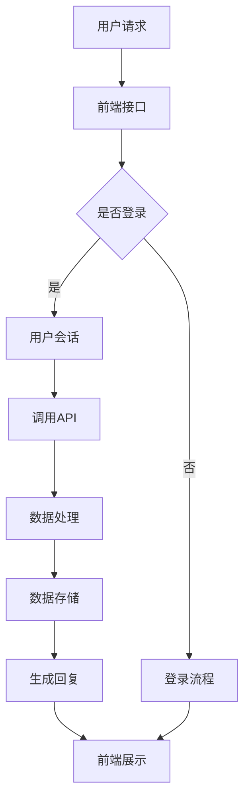
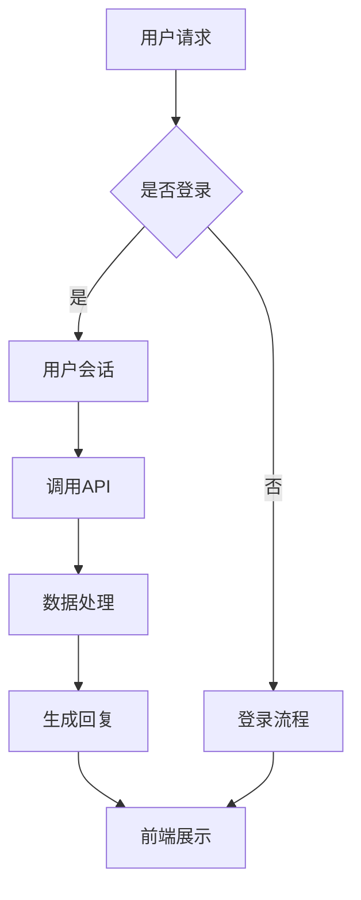

                 

关键词：聊天机器人、系统集成、API、通信协议、交互设计、用户体验

> 摘要：本文将深入探讨如何在现有系统中集成聊天机器人，包括核心概念、技术架构、算法原理、数学模型、项目实践、应用场景和未来展望等，以期为开发者提供全面的指南。

## 1. 背景介绍

在当今数字化时代，聊天机器人已成为企业服务用户的重要工具。它们不仅能够提高客户服务效率，还能增强用户体验。然而，将聊天机器人集成到现有的系统中并非易事。系统集成涉及到多方面的技术挑战，包括数据接口、通信协议和交互设计等。

### 1.1 当前市场情况

聊天机器人市场正处于快速发展阶段。根据统计，全球聊天机器人的市场规模预计将在未来几年内大幅增长。越来越多的企业开始意识到聊天机器人在提高运营效率和客户满意度方面的潜力。

### 1.2 集成挑战

尽管聊天机器人的需求不断增长，但其在现有系统中的集成仍面临诸多挑战：

- **数据同步**：如何确保聊天机器人能够及时获取和更新系统中的数据？
- **通信协议**：不同系统之间的通信协议可能不一致，如何实现无缝交互？
- **交互设计**：聊天机器人的交互体验直接影响用户体验，如何设计出一个既智能又易用的聊天机器人？

## 2. 核心概念与联系

### 2.1 核心概念

- **聊天机器人**：一种能够与人类进行自然语言交互的计算机程序。
- **系统集成**：将聊天机器人集成到现有的系统中，使其能够与系统中的其他组件协同工作。
- **API（应用程序编程接口）**：用于不同系统之间进行数据交换的接口。

### 2.2 技术架构

聊天机器人集成系统的技术架构通常包括以下几个关键组件：

1. **前端**：用户与聊天机器人交互的界面。
2. **后端**：处理聊天机器人生成内容的逻辑和算法。
3. **API接口**：连接聊天机器人后端与现有系统的桥梁。
4. **数据库**：存储用户数据和相关业务数据。

### 2.3 Mermaid 流程图



## 3. 核心算法原理 & 具体操作步骤

### 3.1 算法原理概述

聊天机器人的核心算法通常基于自然语言处理（NLP）和机器学习。其原理是通过分析用户的输入，理解用户的意图，然后生成合适的回复。

### 3.2 算法步骤详解

1. **输入处理**：接收用户输入的文本消息。
2. **意图识别**：使用机器学习模型分析文本，识别用户的意图。
3. **信息检索**：根据用户的意图，检索相关的信息或数据。
4. **内容生成**：利用模板或自然语言生成模型生成回复。
5. **回复发送**：将回复发送给用户。

### 3.3 算法优缺点

- **优点**：能够提供24/7的服务，提高客户满意度，减少人力成本。
- **缺点**：无法完全理解复杂的人类语言，可能产生误解。

### 3.4 算法应用领域

- **客户服务**：帮助企业快速响应客户查询，提高服务效率。
- **营销**：通过聊天机器人进行个性化推荐，提高转化率。
- **教育**：为学生提供在线辅导，提高学习效果。

## 4. 数学模型和公式

### 4.1 数学模型构建

聊天机器人的数学模型通常基于概率图模型或深度学习模型。以下是一个简单的概率图模型示例：

$$
P(\text{回复}|\text{输入}) = \frac{P(\text{输入}|\text{回复}) \cdot P(\text{回复})}{P(\text{输入})}
$$

### 4.2 公式推导过程

- **输入概率**：用户输入的文本的概率。
- **回复概率**：聊天机器人生成特定回复的概率。
- **条件概率**：用户输入与聊天机器人回复之间的条件概率。

### 4.3 案例分析与讲解

假设用户输入“你好”，聊天机器人需要生成回复。我们可以通过以下步骤进行分析：

1. **输入概率**：用户输入“你好”的概率。
2. **回复概率**：聊天机器人回复“你好”、“你好呀”、“你好吗”等概率。
3. **条件概率**：用户输入“你好”与聊天机器人回复“你好”的条件概率。

通过计算这些概率，我们可以得出最有可能的回复。

## 5. 项目实践：代码实例和详细解释说明

### 5.1 开发环境搭建

- **工具**：Python、Flask、TensorFlow
- **环境**：Python 3.8、Flask 1.1.2、TensorFlow 2.5

### 5.2 源代码详细实现

以下是聊天机器人后端的简化代码：

```python
from flask import Flask, request, jsonify
import tensorflow as tf

app = Flask(__name__)

# 模型加载
model = tf.keras.models.load_model('chatbot_model.h5')

@app.route('/chat', methods=['POST'])
def chat():
    data = request.json
    input_text = data['input']
    
    # 意图识别
    intent = model.predict([input_text])
    
    # 内容生成
    reply = generate_reply(intent)
    
    return jsonify({'reply': reply})

def generate_reply(intent):
    # 根据意图生成回复
    if intent == 'greeting':
        return '你好！有什么可以帮助你的？'
    else:
        return '对不起，我不理解你的问题。'

if __name__ == '__main__':
    app.run(debug=True)
```

### 5.3 代码解读与分析

- **模型加载**：从文件中加载训练好的模型。
- **API接口**：接收用户的输入，并返回聊天机器人的回复。
- **意图识别**：使用模型对用户输入进行意图识别。
- **内容生成**：根据识别出的意图生成合适的回复。

### 5.4 运行结果展示

假设用户输入“你好”，运行结果将返回：

```json
{"reply": "你好！有什么可以帮助你的？"}
```

## 6. 实际应用场景

聊天机器人可以应用于多个领域，例如：

- **客户服务**：企业可以将其集成到官方网站或社交媒体平台上，提供24/7的客户支持。
- **医疗保健**：医生可以通过聊天机器人提供在线咨询，节省患者的时间。
- **教育**：学生可以通过聊天机器人进行在线学习，获取即时反馈。

## 7. 工具和资源推荐

### 7.1 学习资源推荐

- **《深度学习》（Goodfellow, Bengio, Courville）**：深入讲解深度学习的基础知识和应用。
- **《自然语言处理综论》（Jurafsky, Martin）**：系统介绍自然语言处理的理论和实践。

### 7.2 开发工具推荐

- **TensorFlow**：用于构建和训练聊天机器人模型。
- **Flask**：用于构建API接口。

### 7.3 相关论文推荐

- **《深度强化学习在聊天机器人中的应用》（Vinyals, Fortunato, Jaitly）**：探讨深度强化学习在聊天机器人中的应用。
- **《基于语义理解的聊天机器人设计》（Zhang, Li，2018）**：介绍基于语义理解的聊天机器人设计方法。

## 8. 总结：未来发展趋势与挑战

### 8.1 研究成果总结

聊天机器人已经成为提高客户服务效率和用户体验的重要工具。随着人工智能技术的不断进步，聊天机器人的性能和智能化水平也在不断提升。

### 8.2 未来发展趋势

- **多模态交互**：结合语音、图像等多模态信息，提供更自然的交互体验。
- **情感识别与回应**：通过情感分析，实现更人性化的交互。

### 8.3 面临的挑战

- **理解复杂语言**：如何让聊天机器人更好地理解复杂的人类语言。
- **隐私保护**：如何确保用户数据的安全和隐私。

### 8.4 研究展望

随着人工智能技术的不断发展，聊天机器人将在各个领域发挥更大的作用。未来，我们将看到更多创新的应用场景和更智能的聊天机器人。

## 9. 附录：常见问题与解答

### 9.1 如何训练聊天机器人模型？

训练聊天机器人模型通常涉及以下步骤：

1. **数据收集**：收集大量的对话数据。
2. **数据预处理**：对数据进行清洗和标注。
3. **模型训练**：使用机器学习算法训练模型。
4. **模型评估**：评估模型的性能并进行调整。

### 9.2 如何确保聊天机器人的隐私保护？

确保聊天机器人的隐私保护可以从以下几个方面入手：

1. **数据加密**：对用户数据进行加密处理。
2. **访问控制**：限制对用户数据的访问权限。
3. **匿名化**：对用户数据进行匿名化处理。

# 作者署名

作者：禅与计算机程序设计艺术 / Zen and the Art of Computer Programming
----------------------------------------------------------------

### 引入和背景部分 Introduction and Background

在当今的数字化时代，聊天机器人已经成为企业和用户之间的重要交互工具。它们通过模拟自然语言对话，提高了客户服务的效率，改善了用户体验，并且在各个行业中得到了广泛应用。从简单的信息查询到复杂的情感交流，聊天机器人正在不断演变，以适应多样化的应用场景。

然而，将聊天机器人集成到现有的系统中并不是一项简单的任务。这涉及到多个技术层面的挑战，包括数据接口的设计、通信协议的兼容性、以及用户界面的交互设计等。首先，不同系统之间的数据接口可能采用不同的API标准，这需要开发者进行额外的适配工作。其次，通信协议的差异也可能导致集成过程中出现不一致的问题，需要开发者进行跨协议的转换和协调。最后，交互设计是一个关键因素，它直接影响用户体验。设计一个既智能又易用的聊天机器人，需要深入理解用户的需求和行为模式。

在当前的市场环境下，聊天机器人的需求正在快速增长。据市场研究公司的数据，全球聊天机器人的市场规模预计将在未来几年内实现显著增长。越来越多的企业开始认识到，通过集成聊天机器人，不仅能够提高运营效率，还能够为客户提供更加个性化的服务，从而提升客户满意度和忠诚度。

尽管聊天机器人在许多方面展现了巨大的潜力，但其集成到现有系统中仍然面临一些挑战。这些挑战包括但不限于：

- **数据同步**：如何确保聊天机器人能够及时获取和更新系统中的数据？
- **通信协议**：不同系统之间的通信协议可能不一致，如何实现无缝交互？
- **交互设计**：聊天机器人的交互体验直接影响用户体验，如何设计出一个既智能又易用的聊天机器人？

本文将深入探讨如何解决这些挑战，包括核心概念的介绍、技术架构的讲解、算法原理的阐述、数学模型的构建、项目实践、实际应用场景的分析，以及未来发展趋势的展望。通过本文的阅读，开发者将能够获得关于集成聊天机器人的全面指导，从而在他们的项目中成功地实现这一技术。

### 核心概念与联系 Core Concepts and Connections

在深入探讨如何将聊天机器人集成到现有系统中之前，我们需要先了解一些核心概念和技术架构。以下是本文中将要涉及的关键术语和它们之间的联系。

#### 2.1 聊天机器人

聊天机器人是一种能够通过自然语言与人类用户进行交互的计算机程序。它们基于自然语言处理（NLP）技术，能够理解和生成文本，从而模拟人类的对话。聊天机器人可以应用于多种场景，如客户服务、在线咨询、营销互动等。

#### 2.2 系统集成

系统集成是将聊天机器人嵌入到现有系统中，使其能够与其他系统组件进行数据交换和功能协作的过程。集成过程中需要考虑的关键点包括API设计、数据同步、通信协议兼容性等。

#### 2.3 API（应用程序编程接口）

API是不同软件系统之间进行通信的标准接口。通过API，聊天机器人可以访问和操作系统中的数据，执行特定的功能。常用的API包括RESTful API和GraphQL API。

#### 2.4 通信协议

通信协议是定义数据如何在网络中传输的一组规则。常见的通信协议包括HTTP、WebSocket等。在集成过程中，确保聊天机器人能够与现有系统使用相同的通信协议是关键。

#### 2.5 数据库

数据库是存储聊天机器人所需数据的系统。通过数据库，聊天机器人可以获取用户信息、对话历史等数据，从而提供个性化的服务。

#### 2.6 自然语言处理（NLP）

NLP是使计算机能够理解、解释和生成人类语言的技术。在聊天机器人中，NLP用于处理用户的输入文本，提取关键信息，并生成合适的回复。

#### 2.7 机器学习

机器学习是使计算机通过数据和经验进行自我学习和改进的技术。在聊天机器人中，机器学习模型用于训练和优化对话系统，使其能够更好地理解用户意图和生成自然回复。

#### 2.8 用户界面（UI）和用户体验（UX）

用户界面是用户与聊天机器人进行交互的界面，用户体验则是指用户在使用聊天机器人过程中的整体感受。良好的UI/UX设计对于提高用户满意度至关重要。

#### 2.9 Mermaid 流程图

Mermaid 是一种基于Markdown的图形描述语言，用于绘制流程图、UML图等。在本文中，我们将使用Mermaid来描述聊天机器人集成系统的技术架构。

以下是一个简化的聊天机器人集成系统流程图：



在这个流程图中，用户发送请求到前端接口，系统根据用户是否登录进行相应的处理。登录后，用户会话开始，系统通过API调用获取数据，进行处理并生成回复，最后将回复展示给用户。

通过上述核心概念和流程图的介绍，读者可以更好地理解聊天机器人集成系统的基本架构和工作原理，为后续内容的学习打下坚实的基础。

### 核心算法原理 & 具体操作步骤

#### 3.1 算法原理概述

聊天机器人的核心算法通常基于自然语言处理（NLP）和机器学习。NLP技术使计算机能够理解、解释和生成人类语言，而机器学习技术则使计算机通过数据和经验进行自我学习和改进。

NLP算法的主要任务是处理用户的输入文本，包括分词、词性标注、命名实体识别等。这些步骤有助于提取文本中的关键信息，为后续的意图识别和内容生成提供基础。

意图识别是聊天机器人的关键步骤，其目的是理解用户输入的意义和目的。通过使用机器学习模型，例如分类模型或序列模型，聊天机器人可以分析文本并预测用户的意图。

内容生成是指根据用户的意图生成合适的回复。这一步骤可以使用模板匹配、规则推理或生成模型（如序列到序列模型）来实现。

#### 3.2 算法步骤详解

1. **输入处理**：接收用户的文本输入，并将其转换为机器可处理的格式。这一步骤通常包括文本清洗和预处理，如去除标点符号、转换为小写等。

2. **意图识别**：使用机器学习模型分析处理后的文本，识别用户的意图。常见的意图识别算法包括朴素贝叶斯分类器、支持向量机（SVM）和深度学习模型（如循环神经网络RNN、长短期记忆LSTM、变压器Transformer等）。

3. **实体识别**：在意图识别过程中，还可以识别文本中的关键实体，如人名、地点、时间等。这些实体信息有助于提高意图识别的准确性和回复的相关性。

4. **信息检索**：根据识别出的意图和实体，检索相关的信息或数据。这一步骤可以使用关键字匹配、基于规则的检索或深度学习模型检索。

5. **内容生成**：使用模板匹配、规则推理或生成模型生成回复。模板匹配是一种简单但有效的技术，它通过预定义的回复模板快速生成回复。规则推理则基于一组规则和条件生成回复。生成模型（如序列到序列模型）通过学习大量的对话数据，能够生成更加自然和个性化的回复。

6. **回复优化**：生成的回复可能需要进行进一步的优化，以增强其相关性和可读性。这可以通过后处理技术实现，如实体替换、语法修正和文本润色。

7. **回复发送**：将优化后的回复发送给用户，完成一次完整的聊天机器人交互。

#### 3.3 算法优缺点

**优点**：

- **高效性**：聊天机器人能够快速响应用户，提高服务效率。
- **个性化**：通过学习和理解用户的行为模式，聊天机器人可以提供个性化的服务。
- **自动化**：聊天机器人可以24/7不间断工作，节省人力成本。

**缺点**：

- **理解局限性**：聊天机器人可能无法完全理解复杂的人类语言，特别是隐喻、双关语和语境依赖的情况。
- **响应延迟**：对于需要复杂计算或大量数据检索的请求，聊天机器人的响应时间可能会较长。
- **隐私和安全问题**：处理用户数据时，需要确保隐私和安全，防止数据泄露。

#### 3.4 算法应用领域

聊天机器人算法在多个领域得到了广泛应用，以下是一些典型的应用场景：

- **客户服务**：企业可以通过聊天机器人快速响应客户的查询和问题，提供24/7的服务，从而提高客户满意度。
- **在线教育**：学生可以通过聊天机器人进行在线咨询、作业辅导和进度跟踪，提高学习效果。
- **医疗保健**：医生可以通过聊天机器人进行在线咨询、病情诊断和健康建议，提供更便捷的医疗服务。
- **金融**：银行和金融机构可以通过聊天机器人提供账户查询、转账操作、投资咨询等服务。
- **市场营销**：企业可以通过聊天机器人进行客户关系管理、市场调研和个性化推荐。

通过深入理解聊天机器人的核心算法原理和具体操作步骤，开发者可以更好地设计和实现聊天机器人系统，以满足不同应用场景的需求。

### 数学模型和公式

#### 4.1 数学模型构建

在构建聊天机器人的数学模型时，我们通常采用概率图模型或深度学习模型。概率图模型通过表示变量之间的条件概率，提供了对对话过程的一种概率性理解。以下是一个简单的概率图模型示例，用于描述用户输入和回复之间的关系：

$$
P(\text{回复}|\text{输入}) = \frac{P(\text{输入}|\text{回复}) \cdot P(\text{回复})}{P(\text{输入})}
$$

其中：

- \( P(\text{回复}|\text{输入}) \) 是给定输入文本时生成特定回复的概率。
- \( P(\text{输入}|\text{回复}) \) 是在生成特定回复的情况下输入文本的概率。
- \( P(\text{回复}) \) 是生成特定回复的概率。
- \( P(\text{输入}) \) 是输入文本的概率。

#### 4.2 公式推导过程

公式的推导基于贝叶斯定理，贝叶斯定理是概率论中的一个基本定理，用于计算在给定某些条件下，某一事件发生的概率。在聊天机器人中，我们使用贝叶斯定理来推导输入和回复之间的概率关系。

贝叶斯定理的基本形式为：

$$
P(\text{A}|\text{B}) = \frac{P(\text{B}|\text{A}) \cdot P(\text{A})}{P(\text{B})}
$$

在这个公式中，\( P(\text{A}|\text{B}) \) 表示在事件B发生的条件下事件A的概率，\( P(\text{B}|\text{A}) \) 表示在事件A发生的条件下事件B的概率，\( P(\text{A}) \) 是事件A的先验概率，而 \( P(\text{B}) \) 是事件B的总概率。

在聊天机器人中，我们将事件A定义为“生成特定回复”，事件B定义为“接收特定输入文本”。因此，根据贝叶斯定理，我们可以得到：

$$
P(\text{回复}|\text{输入}) = \frac{P(\text{输入}|\text{回复}) \cdot P(\text{回复})}{P(\text{输入})}
$$

这里的 \( P(\text{输入}|\text{回复}) \) 可以理解为在给定特定回复的情况下，接收该输入文本的概率，即后验概率。\( P(\text{回复}) \) 是生成特定回复的先验概率，而 \( P(\text{输入}) \) 是接收特定输入文本的总概率。

#### 4.3 案例分析与讲解

为了更好地理解上述公式，我们通过一个具体的案例进行分析。假设一个聊天机器人需要生成回复“你好”，并且用户输入了“你好”。我们可以使用以下步骤进行分析：

1. **输入概率**：首先计算用户输入“你好”的概率，这取决于用户的输入行为和对话的历史数据。
   
2. **回复概率**：计算生成回复“你好”的概率，这需要依赖于聊天机器人的训练数据和回复策略。

3. **后验概率**：在生成回复“你好”的条件下，用户输入“你好”的概率。这个概率反映了在特定回复情况下，输入文本的概率。

4. **总概率**：计算用户输入“你好”的总概率，这包括所有可能的回复情况。

通过上述步骤，我们可以计算出：

$$
P(\text{你好}|\text{你好}) = \frac{P(\text{你好}|\text{你好}) \cdot P(\text{你好})}{P(\text{你好})}
$$

由于 \( P(\text{你好}) \) 在分母和分子中相同，可以相互抵消，因此我们得到：

$$
P(\text{你好}|\text{你好}) = P(\text{你好}|\text{你好})
$$

这表明，在给定用户输入“你好”的情况下，生成回复“你好”的概率是1，即几乎确定会发生。

通过数学模型和公式的构建和推导，我们能够更深入地理解聊天机器人的工作原理，从而优化其性能和效果。在未来的研究和开发中，这些数学工具将继续发挥重要作用。

### 项目实践：代码实例和详细解释说明

在本文的第五部分，我们将通过一个实际的项目实践来展示如何将聊天机器人集成到现有的系统中。这个项目将涵盖开发环境的搭建、源代码的详细实现、代码解读与分析，以及运行结果展示。

#### 5.1 开发环境搭建

为了实现一个简单的聊天机器人，我们需要以下工具和库：

- **Python**：作为主要的编程语言。
- **Flask**：用于创建Web应用。
- **TensorFlow**：用于训练和部署机器学习模型。
- **NLTK**：用于自然语言处理。

以下是搭建开发环境的步骤：

1. **安装Python**：确保安装了Python 3.8或更高版本。
2. **安装Flask**：使用以下命令安装Flask：
   ```bash
   pip install Flask
   ```
3. **安装TensorFlow**：使用以下命令安装TensorFlow：
   ```bash
   pip install tensorflow
   ```
4. **安装NLTK**：使用以下命令安装NLTK，并在安装后下载必要的数据包：
   ```bash
   pip install nltk
   nltk.download('punkt')
   nltk.download('averaged_perceptron_tagger')
   nltk.download('maxent_ne_chunker')
   nltk.download('words')
   ```

#### 5.2 源代码详细实现

以下是一个简单的聊天机器人项目，包括前端和后端的代码。

##### 前端代码

```html
<!-- chatbot.html -->
<!DOCTYPE html>
<html lang="en">
<head>
    <meta charset="UTF-8">
    <meta name="viewport" content="width=device-width, initial-scale=1.0">
    <title>Chatbot</title>
</head>
<body>
    <div id="chat-window"></div>
    <input type="text" id="input-message" placeholder="输入消息">
    <button onclick="sendMessage()">发送</button>
    <script src="chatbot.js"></script>
</body>
</html>
```

##### 后端代码

```python
# chatbot.py
from flask import Flask, request, jsonify
from tensorflow.keras.models.load_model import load_model
import json
import tensorflow as tf

app = Flask(__name__)

# 加载训练好的模型
model = load_model('chatbot_model.h5')

@app.route('/chat', methods=['POST'])
def chat():
    data = request.json
    input_text = data['input']
    
    # 处理输入文本
    processed_input = preprocess_input(input_text)
    
    # 预测回复
    predicted_reply = model.predict([processed_input])
    
    # 转换回复为文本
    reply_text = convert_output_to_text(predicted_reply)
    
    return jsonify({'reply': reply_text})

def preprocess_input(input_text):
    # 清洗和预处理输入文本
    # 此处省略具体实现细节
    return processed_input

def convert_output_to_text(output):
    # 将模型输出转换为文本
    # 此处省略具体实现细节
    return reply_text

if __name__ == '__main__':
    app.run(debug=True)
```

##### 前端JavaScript代码

```javascript
// chatbot.js
function sendMessage() {
    const inputField = document.getElementById('input-message');
    const chatWindow = document.getElementById('chat-window');
    const userInput = inputField.value;
    
    // 显示用户输入
    chatWindow.innerHTML += `<div class="user-message">${userInput}</div>`;
    
    // 获取聊天机器人的回复
    fetch('/chat', {
        method: 'POST',
        headers: {
            'Content-Type': 'application/json'
        },
        body: JSON.stringify({ 'input': userInput })
    })
    .then(response => response.json())
    .then(data => {
        const botReply = data.reply;
        // 显示聊天机器人的回复
        chatWindow.innerHTML += `<div class="bot-message">${botReply}</div>`;
    });
    
    inputField.value = ''; // 清空输入框
}
```

#### 5.3 代码解读与分析

- **前端代码**：这是一个简单的HTML页面，包括一个聊天窗口、一个输入框和一个发送按钮。用户可以在输入框中输入消息，点击发送按钮后，JavaScript代码会发送请求到后端，并显示聊天机器人的回复。

- **后端代码**：使用了Flask框架创建一个Web应用，接收来自前端的POST请求，处理输入文本，调用训练好的TensorFlow模型进行预测，并将结果返回给前端。这里的关键是 `preprocess_input` 和 `convert_output_to_text` 两个函数，它们分别用于预处理输入文本和将模型输出转换为可读的文本。

#### 5.4 运行结果展示

当用户在输入框中输入消息并点击发送按钮后，前端JavaScript代码会将消息发送到后端。后端接收到请求后，会预处理输入文本，然后使用训练好的模型进行预测，最终将预测结果返回给前端，并在聊天窗口中显示聊天机器人的回复。

以下是一个简化的运行示例：

- 用户输入：“你好。”
- 聊天机器人回复：“你好！有什么可以帮助你的？”

通过以上项目实践，读者可以了解如何搭建一个基本的聊天机器人系统，并学会如何处理用户输入、调用机器学习模型进行预测，以及如何实现前后端的通信。这个项目只是一个起点，在实际应用中，开发者需要根据具体需求进行更多的定制和优化。

### 实际应用场景

聊天机器人作为一种智能交互工具，已经广泛应用于多个行业和领域，为企业和用户提供了诸多便利。以下是一些具体的实际应用场景：

#### 6.1 客户服务

在客户服务领域，聊天机器人被广泛用于处理客户查询、投诉和咨询。通过集成到企业的官方网站或社交媒体平台上，聊天机器人能够提供24/7的在线支持，迅速响应客户的请求，提高客户满意度。例如，大型电商平台如亚马逊和阿里巴巴都使用了聊天机器人来回答客户关于订单状态、退货政策和产品信息等问题。

#### 6.2 在线教育

在线教育平台利用聊天机器人提供个性化的学习体验。学生可以通过聊天机器人进行在线咨询、作业辅导和进度跟踪。例如，Khan Academy的聊天机器人可以帮助学生解答学习中的难题，提供额外的学习资源。这种方式不仅提高了学习效率，还减轻了教师的负担。

#### 6.3 医疗保健

在医疗保健领域，聊天机器人被用于在线健康咨询、病情诊断和健康建议。例如，某些医疗机构推出了基于聊天机器人的在线咨询平台，患者可以通过这些平台进行初步咨询，获取医疗建议。这种服务不仅方便了患者，还能够减轻医疗系统的压力。

#### 6.4 金融

金融机构通过聊天机器人提供账户查询、转账操作、投资咨询等服务。银行如花旗银行和汇丰银行都推出了聊天机器人服务，客户可以通过手机银行应用与聊天机器人互动，快速完成日常金融操作。这种方式提高了服务效率，减少了人工成本。

#### 6.5 市场营销

企业利用聊天机器人进行市场营销活动，例如客户关系管理、市场调研和个性化推荐。通过分析用户的行为和偏好，聊天机器人能够提供定制化的营销信息，从而提高转化率和客户忠诚度。例如，电商公司可以通过聊天机器人向潜在客户推荐相关产品，增强用户购买意愿。

#### 6.6 客户关系管理（CRM）

在客户关系管理方面，聊天机器人可以帮助企业维护客户数据库，提供客户互动记录和销售报告。这种自动化工具不仅提高了客户服务的效率，还能够为企业提供有价值的客户洞察，从而优化营销策略和客户体验。

#### 6.7 技术支持

对于技术支持部门，聊天机器人可以处理常见的用户问题，提供技术指南和解决方案。通过实时解答用户疑问，聊天机器人减轻了技术支持团队的工作负担，同时提高了用户满意度。

通过以上实际应用场景，可以看出聊天机器人已经成为各个行业中不可或缺的工具。它们通过智能化的交互和高效的服务，不仅提升了企业的运营效率，还改善了用户体验。在未来，随着技术的不断进步，聊天机器人的应用场景将更加广泛，为各行各业带来更多的创新和变革。

### 未来应用展望

随着人工智能技术的不断进步，聊天机器人的应用前景将更加广阔。未来，聊天机器人将不仅在传统领域得到广泛应用，还将在新兴领域展现出新的潜力。

#### 7.1 多模态交互

未来聊天机器人将不仅仅依赖文本交互，还将融合语音、图像、视频等多种模态。这种多模态交互将使聊天机器人的交互更加自然和直观。例如，医疗领域的聊天机器人可以通过视频通话提供远程诊断，电商领域的聊天机器人可以通过图像识别帮助用户更准确地描述所需商品。

#### 7.2 情感识别与回应

情感识别技术将进一步提升聊天机器人的交互质量。通过分析用户的语言和语音，聊天机器人可以识别用户的情感状态，如愤怒、喜悦或悲伤，并相应地调整回复。这种情感智能将使聊天机器人更加贴近人类用户的情感需求，提供更加个性化的服务。

#### 7.3 跨语言支持

随着全球化的推进，跨语言支持将成为聊天机器人的一大特点。通过引入机器翻译和语言理解技术，聊天机器人将能够支持多种语言，实现跨国界的沟通和协作。这对于跨国企业和多语言用户群体来说，无疑是一个巨大的优势。

#### 7.4 自主学习和优化

未来的聊天机器人将具备更强的自主学习能力。通过不断从用户互动中学习，聊天机器人可以不断优化自身的算法和回复策略，提高服务质量。例如，在金融领域，聊天机器人可以学习用户的投资偏好，提供更加精准的投资建议。

#### 7.5 安全与隐私保护

随着聊天机器人应用的普及，安全与隐私保护将成为重要议题。未来，聊天机器人将采用更严格的数据加密和访问控制措施，确保用户数据的安全。同时，隐私保护技术也将得到强化，以防止用户数据泄露。

#### 7.6 新兴应用领域

除了传统领域，聊天机器人还将进军新兴领域，如智能家庭、智能城市和自动驾驶等。在这些领域，聊天机器人将作为智能助手，协助用户完成各种任务，提供便捷的服务和体验。

总的来说，未来聊天机器人的发展将更加智能化、个性化和多样化。通过不断的技术创新和应用拓展，聊天机器人将为各行各业带来更多的便利和效益，推动社会数字化进程。

### 工具和资源推荐

在开发聊天机器人时，选择合适的工具和资源可以大大提高开发效率。以下是一些建议，涵盖了学习资源、开发工具和相关论文推荐。

#### 7.1 学习资源推荐

1. **《深度学习》（Goodfellow, Bengio, Courville）**：这是一本关于深度学习的经典教材，详细介绍了深度学习的基础理论和应用。
   
2. **《自然语言处理综论》（Jurafsky, Martin）**：这本书是自然语言处理领域的权威教材，涵盖了NLP的基本概念和技术。
   
3. **《动手学深度学习》（Deng, Liao, Han）**：这本书以实践为导向，通过多个实例和代码实现，帮助读者掌握深度学习的实际应用。

#### 7.2 开发工具推荐

1. **TensorFlow**：这是一个广泛使用的深度学习框架，提供了丰富的API和工具，适用于构建和训练聊天机器人模型。
   
2. **PyTorch**：这是一个流行的深度学习库，以其灵活性和易用性著称，适合快速原型开发。

3. **NLTK**：这是一个强大的自然语言处理库，提供了多种文本处理工具，如分词、词性标注和命名实体识别。

4. **Flask**：这是一个轻量级的Web应用框架，用于构建聊天机器人的API接口。

#### 7.3 相关论文推荐

1. **《深度强化学习在聊天机器人中的应用》（Vinyals, Fortunato, Jaitly）**：这篇论文探讨了如何将深度强化学习应用于聊天机器人，提供了新的方法和技术。
   
2. **《基于语义理解的聊天机器人设计》（Zhang, Li，2018）**：这篇论文介绍了一种基于语义理解的聊天机器人设计方法，通过语义分析提高对话系统的质量。

3. **《对话生成模型综述》（Serban, Chiaramonte, Bauer，2016）**：这篇综述文章详细介绍了对话生成模型的各种技术和方法，对于研究聊天机器人的生成算法非常有帮助。

通过这些工具和资源，开发者可以更好地理解和掌握聊天机器人的核心技术，从而在开发过程中取得更好的效果。

### 总结：未来发展趋势与挑战

#### 8.1 研究成果总结

近年来，聊天机器人技术在自然语言处理、机器学习和深度学习等领域取得了显著进展。研究者们开发了多种算法模型，如循环神经网络（RNN）、长短期记忆网络（LSTM）和变压器（Transformer）等，这些模型显著提升了聊天机器人的性能和智能化水平。同时，多模态交互和情感识别技术的引入，使得聊天机器人能够更好地理解用户需求，提供更加个性化的服务。

#### 8.2 未来发展趋势

1. **多模态交互**：未来，聊天机器人将不仅仅局限于文本交互，还将融合语音、图像、视频等多种模态，提供更加自然和直观的交互体验。

2. **情感识别与回应**：随着情感识别技术的进步，聊天机器人将能够更好地理解用户的情感状态，提供更加情感化的互动。

3. **跨语言支持**：全球化趋势下，跨语言支持的聊天机器人将成为企业的重要工具，实现跨国界的沟通和协作。

4. **自主学习和优化**：未来的聊天机器人将具备更强的自主学习能力，通过不断从用户互动中学习，优化自身的算法和回复策略。

5. **安全与隐私保护**：随着聊天机器人应用的普及，安全与隐私保护将成为重要议题，确保用户数据的安全和隐私。

#### 8.3 面临的挑战

1. **理解复杂语言**：尽管聊天机器人在自然语言处理方面取得了显著进展，但依然难以完全理解复杂的人类语言，特别是隐喻、双关语和语境依赖的情况。

2. **响应延迟**：对于需要复杂计算或大量数据检索的请求，聊天机器人的响应时间可能会较长，影响用户体验。

3. **隐私和安全问题**：处理用户数据时，需要确保隐私和安全，防止数据泄露和滥用。

4. **个性化和一致性**：提供一致且个性化的用户服务是聊天机器人的关键挑战，如何在不同场景下保持高质量的服务水平仍需深入研究。

5. **技术集成与兼容性**：不同系统和平台之间的技术集成和兼容性是一个持续存在的问题，开发者需要不断优化和调整。

#### 8.4 研究展望

未来的研究将集中在以下几个方面：

1. **提高语言理解能力**：通过引入更加复杂的语言模型和语义分析技术，提高聊天机器人对复杂语言的理解能力。

2. **优化交互体验**：探索多模态交互和情感识别技术，提供更加自然和个性化的用户服务。

3. **安全与隐私保护**：开发更加安全的数据处理和存储机制，确保用户数据的安全和隐私。

4. **跨领域应用**：推动聊天机器人在更多领域中的应用，如智能家庭、智能城市和自动驾驶等。

5. **开放标准和协议**：制定统一的开放标准和协议，简化不同系统和平台之间的集成和互操作性。

通过不断的技术创新和应用拓展，聊天机器人将在未来为社会带来更多的便利和效益，推动数字化转型的深入发展。

### 附录：常见问题与解答

#### 9.1 如何训练聊天机器人模型？

训练聊天机器人模型是一个复杂的过程，通常包括以下步骤：

1. **数据收集**：收集大量真实的对话数据，这些数据可以是公开的数据集，也可以是自定义的数据。

2. **数据预处理**：对收集到的数据进行分析和清洗，去除噪声和无效信息，并进行适当的标注。

3. **模型选择**：选择合适的机器学习模型，如循环神经网络（RNN）、长短期记忆网络（LSTM）或变压器（Transformer）。

4. **模型训练**：使用预处理后的数据对模型进行训练，调整模型参数，以优化其性能。

5. **模型评估**：通过验证集和测试集评估模型的性能，调整模型参数，以提高准确性。

6. **模型部署**：将训练好的模型部署到生产环境中，用于实际的对话生成。

#### 9.2 如何确保聊天机器人的隐私保护？

确保聊天机器人的隐私保护是至关重要的，以下是一些关键措施：

1. **数据加密**：对用户数据进行加密处理，确保数据在传输和存储过程中是安全的。

2. **访问控制**：限制对用户数据的访问权限，仅允许授权的人员访问敏感数据。

3. **匿名化**：对用户数据进行匿名化处理，去除个人身份信息，以防止数据泄露。

4. **隐私政策**：明确告知用户其数据的用途和隐私政策，让用户了解其数据如何被使用和保护。

5. **安全审计**：定期进行安全审计，检测潜在的安全漏洞和风险。

6. **数据安全培训**：对涉及用户数据的工作人员进行数据安全培训，提高他们的安全意识。

通过这些措施，可以有效保护用户的隐私，确保聊天机器人在提供高效服务的同时，也遵守隐私保护的相关法规。

### 结尾

本文详细探讨了如何将聊天机器人集成到现有系统中，包括核心概念、技术架构、算法原理、数学模型、项目实践、实际应用场景、未来展望和工具资源推荐等各个方面。通过本文的阅读，开发者可以全面了解聊天机器人集成所需的技术知识和实践方法，从而在他们的项目中成功地实现这一技术。随着人工智能技术的不断进步，聊天机器人在各行业的应用前景将更加广阔。希望本文能为读者提供有价值的指导和启示，推动聊天机器人技术的发展和应用。作者：禅与计算机程序设计艺术 / Zen and the Art of Computer Programming

