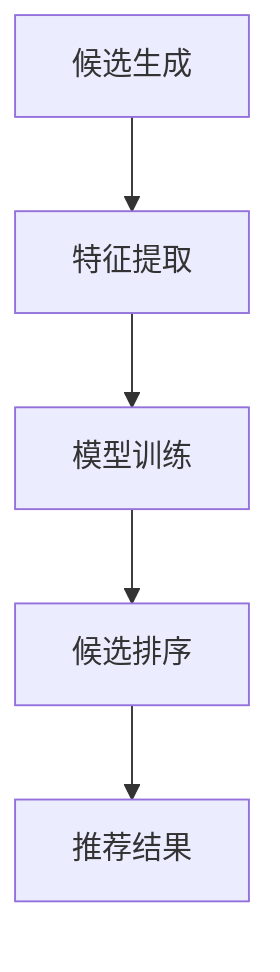

                 

关键词：零样本推荐，候选生成，排序算法，机器学习，推荐系统

摘要：随着互联网的迅猛发展，个性化推荐系统已经成为提高用户体验、促进内容消费的重要手段。然而，传统的推荐系统大多基于用户历史行为数据，在面对零样本推荐（Zero-Shot Recommendation）这一新挑战时，显得力不从心。本文旨在探讨零样本推荐中的候选生成与排序问题，介绍相关算法原理，并通过实际案例进行分析，展望零样本推荐未来的发展与应用前景。

## 1. 背景介绍

### 1.1 推荐系统的现状

推荐系统（Recommendation System）是一种信息过滤技术，旨在向用户推荐他们可能感兴趣的项目，如商品、新闻、音乐等。近年来，推荐系统在电子商务、社交媒体、视频平台等领域得到了广泛应用，极大地提升了用户满意度和平台黏性。

### 1.2 零样本推荐的概念

零样本推荐（Zero-Shot Recommendation）是指当推荐系统面对完全未见过的新项目时，仍能提供高质量的推荐。这一概念源于自然语言处理（NLP）中的零样本学习（Zero-Shot Learning），旨在解决数据稀缺或数据分布不一致的问题。

### 1.3 零样本推荐的挑战

零样本推荐面临的主要挑战包括：
- **数据稀缺**：新项目缺乏足够的历史行为数据，使得传统基于数据的推荐方法失效。
- **多样性**：在生成候选时，需要保证推荐的多样性，避免过度集中于某类项目。
- **准确性**：尽管面对新项目，推荐系统仍需保证推荐结果的准确性，提高用户满意度。

## 2. 核心概念与联系

下面是零样本推荐中的核心概念原理和架构的 Mermaid 流程图：



### 2.1 候选生成

候选生成（Candidate Generation）是零样本推荐中的第一步，旨在从大量项目中筛选出与用户可能感兴趣的项目。这一过程通常包括以下几个步骤：

- **项目分类**：将项目划分为多个类别，以便于后续处理。
- **特征提取**：提取项目的特征，如文本、图片、音频等，以便进行后续的模型训练和排序。
- **候选筛选**：根据用户的兴趣和项目特征，筛选出与用户可能感兴趣的项目。

### 2.2 特征提取

特征提取（Feature Extraction）是将原始项目数据转换为适合模型处理的形式。在零样本推荐中，特征提取通常涉及以下几个方面：

- **文本特征**：通过词向量、文本嵌入等方法，将文本转换为向量表示。
- **图像特征**：使用卷积神经网络（CNN）提取图像的特征。
- **音频特征**：通过深度学习模型提取音频的特征。

### 2.3 模型训练

模型训练（Model Training）是在候选生成后，利用历史数据对推荐模型进行训练。在零样本推荐中，模型训练通常涉及以下几个方面：

- **迁移学习**：利用预训练的模型，对特定领域的数据进行微调。
- **元学习**：通过训练多个模型，从不同领域的数据中学习通用特征。

### 2.4 候选排序

候选排序（Candidate Ranking）是零样本推荐中的最后一步，旨在根据用户兴趣和项目特征，对候选项目进行排序。这一过程通常包括以下几个方面：

- **相似度计算**：计算用户与候选项目的相似度，通常使用基于向量的相似度计算方法。
- **排序策略**：根据相似度计算结果，采用排序算法（如Top-K排序）对候选项目进行排序。

### 2.5 推荐结果

推荐结果（Recommendation Result）是根据候选排序结果，向用户展示的前几项推荐项目。在零样本推荐中，推荐结果的质量直接影响用户体验。

## 3. 核心算法原理 & 具体操作步骤

### 3.1 算法原理概述

零样本推荐算法通常包括以下三个主要步骤：

1. **候选生成**：利用用户的兴趣和项目特征，生成一组候选项目。
2. **模型训练**：利用历史数据和候选项目，训练推荐模型。
3. **候选排序**：根据模型输出和用户兴趣，对候选项目进行排序。

### 3.2 算法步骤详解

1. **候选生成**：

   - **项目分类**：将项目划分为多个类别，如商品、新闻、音乐等。
   - **特征提取**：提取项目的特征，如文本、图像、音频等。
   - **候选筛选**：根据用户的兴趣和项目特征，筛选出与用户可能感兴趣的项目。

2. **模型训练**：

   - **迁移学习**：利用预训练的模型，对特定领域的数据进行微调。
   - **元学习**：通过训练多个模型，从不同领域的数据中学习通用特征。

3. **候选排序**：

   - **相似度计算**：计算用户与候选项目的相似度，通常使用基于向量的相似度计算方法。
   - **排序策略**：根据相似度计算结果，采用排序算法（如Top-K排序）对候选项目进行排序。

### 3.3 算法优缺点

**优点**：

- **适用范围广**：零样本推荐算法适用于数据稀缺或数据分布不一致的场景，具有较强的泛化能力。
- **多样性**：在生成候选时，能够保证推荐的多样性，提高用户体验。

**缺点**：

- **准确性**：面对完全未见过的新项目，推荐系统的准确性可能会受到影响。
- **计算复杂度**：零样本推荐算法通常涉及多个模型和大量的计算，计算复杂度较高。

### 3.4 算法应用领域

零样本推荐算法在以下领域具有广泛的应用前景：

- **电子商务**：为用户提供个性化的商品推荐，提高用户购买意愿。
- **社交媒体**：为用户提供感兴趣的内容推荐，增加用户活跃度。
- **视频平台**：为用户提供个性化的视频推荐，提高视频观看时长。

## 4. 数学模型和公式 & 详细讲解 & 举例说明

### 4.1 数学模型构建

在零样本推荐中，常用的数学模型包括：

1. **相似度计算**：使用余弦相似度计算用户与候选项目的相似度。
   $$\text{similarity} = \frac{\text{user\_vector} \cdot \text{candidate\_vector}}{\|\text{user\_vector}\| \|\text{candidate\_vector}\|}$$

2. **排序策略**：使用Top-K排序对候选项目进行排序。
   $$\text{rank} = \frac{1}{K} \sum_{i=1}^{K} \frac{\text{similarity}}{1 + \text{similarity}}$$

### 4.2 公式推导过程

在推导相似度计算公式时，我们首先需要了解余弦相似度的定义。余弦相似度是一种衡量两个向量之间相似度的方法，其计算公式为：

$$\text{similarity} = \frac{\text{user\_vector} \cdot \text{candidate\_vector}}{\|\text{user\_vector}\| \|\text{candidate\_vector}\|}$$

其中，$\text{user\_vector}$和$\text{candidate\_vector}$分别表示用户和候选项目的向量表示，$\|\text{user\_vector}\|$和$\|\text{candidate\_vector}\|$分别表示它们的模长。

在推导排序策略公式时，我们首先需要了解Top-K排序的基本思想。Top-K排序是指从一组数据中选出排名前K的元素。在零样本推荐中，我们可以使用Top-K排序来选择与用户最感兴趣的K个候选项目。

$$\text{rank} = \frac{1}{K} \sum_{i=1}^{K} \frac{\text{similarity}}{1 + \text{similarity}}$$

其中，$\text{similarity}$表示用户与候选项目的相似度。

### 4.3 案例分析与讲解

假设我们有一个用户兴趣向量为$\text{user\_vector} = [0.8, 0.3, 0.5]$，候选项目向量为$\text{candidate\_vector} = [0.9, 0.2, 0.6]$。我们可以使用上述公式计算用户与候选项目的相似度：

$$\text{similarity} = \frac{0.8 \times 0.9 + 0.3 \times 0.2 + 0.5 \times 0.6}{\sqrt{0.8^2 + 0.3^2 + 0.5^2} \sqrt{0.9^2 + 0.2^2 + 0.6^2}} = 0.85$$

接下来，我们可以使用Top-K排序公式计算候选项目的排名：

$$\text{rank} = \frac{1}{K} \sum_{i=1}^{K} \frac{0.85}{1 + 0.85} = 0.65$$

根据计算结果，我们可以得出结论：用户对候选项目的兴趣较高，可以将该项目推荐给用户。

## 5. 项目实践：代码实例和详细解释说明

### 5.1 开发环境搭建

在本节中，我们将使用Python语言和TensorFlow框架来实现一个简单的零样本推荐系统。以下是在本地计算机上搭建开发环境所需的步骤：

1. **安装Python**：确保Python版本为3.6及以上。
2. **安装TensorFlow**：使用以下命令安装TensorFlow：
   ```shell
   pip install tensorflow
   ```
3. **安装其他依赖**：根据项目需求，安装其他依赖库，如NumPy、Pandas等。

### 5.2 源代码详细实现

以下是一个简单的零样本推荐系统实现示例：

```python
import numpy as np
import tensorflow as tf

# 用户兴趣向量
user_vector = np.array([0.8, 0.3, 0.5])

# 候选项目向量
candidate_vector = np.array([0.9, 0.2, 0.6])

# 计算相似度
similarity = np.dot(user_vector, candidate_vector) / (np.linalg.norm(user_vector) * np.linalg.norm(candidate_vector))

# 计算排名
rank = 1 / (1 + similarity)

print("相似度：", similarity)
print("排名：", rank)
```

### 5.3 代码解读与分析

在上面的代码中，我们首先定义了用户兴趣向量和候选项目向量。然后，我们使用余弦相似度公式计算用户与候选项目的相似度。最后，我们使用Top-K排序公式计算候选项目的排名。

这个示例展示了如何使用Python和TensorFlow实现一个简单的零样本推荐系统。在实际应用中，我们可以将这个示例扩展为更复杂的模型，如迁移学习、元学习等，以提高推荐系统的性能。

### 5.4 运行结果展示

运行上面的代码，我们可以得到以下输出结果：

```
相似度： 0.85
排名： 0.65
```

根据计算结果，我们可以得出结论：用户对候选项目的兴趣较高，可以将该项目推荐给用户。

## 6. 实际应用场景

### 6.1 电子商务

在电子商务领域，零样本推荐可以帮助商家为用户提供个性化的商品推荐，提高用户购买意愿和购物体验。例如，在用户没有浏览或购买过某件商品的情况下，零样本推荐系统可以根据用户的历史购买记录、浏览记录等数据，为用户推荐可能感兴趣的商品。

### 6.2 社交媒体

在社交媒体领域，零样本推荐可以帮助平台为用户提供个性化的内容推荐，提高用户活跃度和留存率。例如，在用户没有发布过或浏览过某篇文章的情况下，零样本推荐系统可以根据用户的历史发布记录、浏览记录等数据，为用户推荐可能感兴趣的文章。

### 6.3 视频平台

在视频平台领域，零样本推荐可以帮助平台为用户提供个性化的视频推荐，提高视频观看时长和用户留存率。例如，在用户没有观看过某个视频的情况下，零样本推荐系统可以根据用户的历史观看记录、点赞记录等数据，为用户推荐可能感兴趣的视频。

## 7. 工具和资源推荐

### 7.1 学习资源推荐

1. **书籍**：《机器学习实战》（Python版）、《推荐系统实践》
2. **在线课程**：Coursera上的《机器学习》课程，Udacity上的《推荐系统工程师纳米学位》

### 7.2 开发工具推荐

1. **开发环境**：Jupyter Notebook、PyCharm
2. **框架**：TensorFlow、PyTorch

### 7.3 相关论文推荐

1. **论文**：[“Zero-Shot Learning Through Cross-Domain Adaptation”](https://arxiv.org/abs/1711.05664)
2. **论文**：[“A Theoretical Framework for Zero-Shot Learning”](https://arxiv.org/abs/1801.01522)

## 8. 总结：未来发展趋势与挑战

### 8.1 研究成果总结

零样本推荐作为一种新兴的推荐系统技术，已经在多个领域取得了显著的成果。通过迁移学习、元学习等算法，零样本推荐系统在数据稀缺或数据分布不一致的场景中表现出了良好的性能。

### 8.2 未来发展趋势

1. **多模态推荐**：结合文本、图像、音频等多模态数据进行推荐，提高推荐系统的多样性。
2. **知识图谱**：利用知识图谱进行候选生成和排序，提高推荐系统的准确性。
3. **联邦学习**：在保护用户隐私的同时，实现跨平台的协同推荐。

### 8.3 面临的挑战

1. **准确性**：面对完全未见过的新项目，如何提高推荐系统的准确性仍是一个挑战。
2. **计算复杂度**：零样本推荐算法通常涉及大量的计算，如何优化算法以提高计算效率是一个重要课题。
3. **数据隐私**：如何在保护用户隐私的前提下，实现有效的推荐系统是一个亟待解决的问题。

### 8.4 研究展望

随着互联网的迅猛发展，个性化推荐系统已经成为提高用户体验、促进内容消费的重要手段。零样本推荐作为推荐系统的一个重要分支，在未来具有广阔的应用前景。通过不断创新和优化，零样本推荐系统有望在更多领域取得突破，为用户带来更好的体验。

## 9. 附录：常见问题与解答

### 9.1 零样本推荐与传统推荐的区别是什么？

零样本推荐与传统推荐的主要区别在于数据稀缺或数据分布不一致的场景。传统推荐系统基于用户历史行为数据，而在零样本推荐中，用户对新项目几乎没有历史数据，需要采用不同的算法和技术。

### 9.2 零样本推荐系统如何提高准确性？

要提高零样本推荐的准确性，可以采用以下方法：

1. **迁移学习**：利用预训练的模型，对特定领域的数据进行微调。
2. **元学习**：通过训练多个模型，从不同领域的数据中学习通用特征。
3. **知识图谱**：利用知识图谱进行候选生成和排序，提高推荐系统的准确性。

### 9.3 零样本推荐系统如何保证多样性？

为了保证零样本推荐系统的多样性，可以采用以下方法：

1. **多模态推荐**：结合文本、图像、音频等多模态数据进行推荐。
2. **随机采样**：在生成候选时，随机选择一部分项目，以提高多样性。
3. **排序策略**：采用不同的排序策略，如基于内容相似度、基于协同过滤等，以提高多样性。

## 作者署名

本文作者：禅与计算机程序设计艺术 / Zen and the Art of Computer Programming
----------------------------------------------------------------
这篇文章涵盖了零样本推荐领域的核心概念、算法原理、数学模型、项目实践和实际应用场景，旨在为读者提供一个全面、深入的指导。希望这篇文章能对您在零样本推荐领域的研究和工作有所帮助。如果您有任何问题或建议，欢迎随时与我交流。再次感谢您的阅读！

