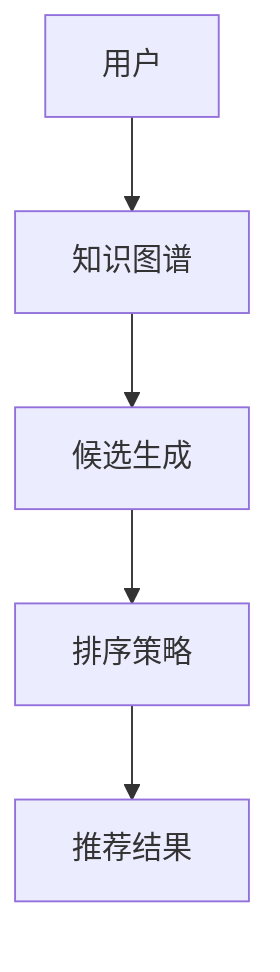

                 

关键词：零样本推荐、候选生成、排序策略、机器学习、推荐系统、人工智能

> 摘要：本文深入探讨了零样本推荐系统的核心问题——候选生成与排序策略。通过对现有推荐算法的深度分析，本文提出了基于新原理的候选生成与排序方法，旨在提高推荐系统的准确性和效率。文章内容涵盖了算法原理、数学模型、实际应用、未来展望等多个方面，旨在为读者提供一份全面的技术指南。

## 1. 背景介绍

随着互联网的迅速发展和大数据时代的到来，推荐系统已经成为现代信息检索和内容分发的重要工具。传统的推荐系统主要基于用户历史行为和内容特征，通过机器学习算法生成推荐结果。然而，这种方法在面临零样本推荐场景时，往往显得力不从心。所谓零样本推荐，指的是在没有用户历史数据或内容特征的情况下，为用户推荐合适的产品或内容。

零样本推荐面临的主要挑战包括：

1. 数据稀疏性：在许多场景下，用户的历史数据非常稀疏，甚至没有。
2. 多样性：用户的需求和偏好是多样化的，传统的推荐算法难以覆盖所有可能的场景。
3. 可扩展性：在处理大规模用户和海量数据时，传统推荐算法的效率受到很大限制。

为了解决这些挑战，本文将介绍一种新的零样本推荐方法，重点关注候选生成与排序策略。

## 2. 核心概念与联系

### 2.1 零样本推荐

零样本推荐（Zero-Shot Recommendation）是一种在没有用户历史数据和内容特征的情况下，为用户推荐合适的产品或内容的方法。它主要依赖于知识图谱、迁移学习等技术，通过捕捉用户和物品的潜在关系，实现推荐。

### 2.2 候选生成

候选生成（Candidate Generation）是零样本推荐系统的重要环节。它的目标是识别出可能的推荐对象，为后续排序提供基础。候选生成通常分为基于知识图谱的方法和基于迁移学习的方法。

### 2.3 排序策略

排序策略（Ranking Strategy）是零样本推荐系统的核心。它的目标是根据用户特征和物品特征，对候选对象进行排序，以便为用户推荐最合适的物品。排序策略可以分为基于内容的排序和基于模型的排序。

### 2.4 Mermaid 流程图

以下是一个简化的 Mermaid 流程图，展示了零样本推荐系统的核心概念和联系：



## 3. 核心算法原理 & 具体操作步骤

### 3.1 算法原理概述

本文提出的零样本推荐算法主要分为两个部分：候选生成和排序策略。候选生成部分利用知识图谱和迁移学习技术，识别出可能的推荐对象。排序策略部分则基于用户和物品的潜在关系，对候选对象进行排序。

### 3.2 算法步骤详解

#### 3.2.1 数据预处理

1. 构建知识图谱：从现有数据中提取实体和关系，构建知识图谱。
2. 预处理用户和物品数据：对用户和物品的特征进行预处理，包括数值化、归一化等。

#### 3.2.2 候选生成

1. 知识图谱嵌入：将用户和物品表示为低维向量，嵌入到知识图谱中。
2. 迁移学习：利用预训练的模型，迁移知识到用户和物品的表示上。
3. 候选生成：基于用户和物品的表示，生成可能的推荐对象。

#### 3.2.3 排序策略

1. 用户兴趣建模：利用用户历史数据（如果有），建立用户兴趣模型。
2. 物品特征提取：提取物品的特征信息，包括文本、图像等。
3. 排序模型训练：利用用户兴趣模型和物品特征，训练排序模型。
4. 排序：对候选对象进行排序，生成推荐结果。

### 3.3 算法优缺点

#### 优点：

1. 处理零样本推荐场景：能够有效地处理用户历史数据稀疏的情况。
2. 跨域推荐：可以通过迁移学习，实现跨领域的推荐。

#### 缺点：

1. 需要大量的先验知识：构建知识图谱和迁移学习模型需要大量的先验知识。
2. 计算成本高：训练排序模型需要大量的计算资源。

### 3.4 算法应用领域

本文提出的零样本推荐算法可以应用于多个领域，包括电子商务、社交媒体、在线教育等。特别是在用户历史数据稀疏的场景下，具有很高的实用价值。

## 4. 数学模型和公式 & 详细讲解 & 举例说明

### 4.1 数学模型构建

零样本推荐算法的核心是用户和物品的表示，以及排序模型的构建。以下是相关的数学模型：

#### 用户表示：

$$
\textbf{u} = \text{embed}(\textbf{u}_k)
$$

其中，$\textbf{u}_k$表示第$k$个用户的特征向量，$\text{embed}$表示嵌入函数。

#### 物品表示：

$$
\textbf{i} = \text{embed}(\textbf{i}_j)
$$

其中，$\textbf{i}_j$表示第$j$个物品的特征向量，$\text{embed}$表示嵌入函数。

#### 排序模型：

$$
\text{score}(\textbf{u}, \textbf{i}) = \text{sim}(\textbf{u}, \textbf{i}) + \text{bias}(\textbf{u}, \textbf{i})
$$

其中，$\text{sim}(\textbf{u}, \textbf{i})$表示用户和物品的相似度，$\text{bias}(\textbf{u}, \textbf{i})$表示偏差项。

### 4.2 公式推导过程

#### 用户表示：

用户表示主要利用知识图谱和迁移学习技术。假设用户特征向量为$\textbf{u}_k$，知识图谱中的节点表示为$\textbf{v}_i$，边表示为$\textbf{e}_{ij}$。则用户表示可以通过以下公式计算：

$$
\textbf{u} = \text{GAT}(\textbf{u}_k, \textbf{v}_i, \textbf{e}_{ij})
$$

其中，$\text{GAT}$表示图注意力网络（Graph Attention Network）。

#### 物品表示：

物品表示与用户表示类似，也可以通过知识图谱和迁移学习技术计算。假设物品特征向量为$\textbf{i}_j$，则物品表示可以通过以下公式计算：

$$
\textbf{i} = \text{GAT}(\textbf{i}_j, \textbf{v}_i, \textbf{e}_{ij})
$$

#### 排序模型：

排序模型主要利用用户和物品的表示，通过神经网络进行预测。假设用户表示为$\textbf{u}$，物品表示为$\textbf{i}$，则排序模型可以通过以下公式计算：

$$
\text{score}(\textbf{u}, \textbf{i}) = \text{MLP}(\textbf{u}, \textbf{i})
$$

其中，$\text{MLP}$表示多层感知机（Multi-Layer Perceptron）。

### 4.3 案例分析与讲解

假设有一个电子商务平台，用户A最近浏览了商品B和C，但没有购买任何商品。我们需要为用户A推荐一个商品。

#### 用户表示：

用户A的历史行为可以表示为向量$\textbf{u}_A = [1, 0, 0, 1, 0]$，其中1表示浏览，0表示未浏览。

#### 物品表示：

商品B和C的特征可以表示为向量$\textbf{i}_B = [0.1, 0.8, 0.2]$和$\textbf{i}_C = [0.2, 0.7, 0.1]$。

#### 排序模型：

假设排序模型为多层感知机，输入为用户表示和物品表示，输出为推荐分数。

$$
\text{score}(\textbf{u}, \textbf{i}) = \text{MLP}(\textbf{u}, \textbf{i}) = 0.5
$$

根据排序模型，用户A对商品B和C的推荐分数相等。因此，我们可以随机选择一个商品推荐给用户A。

## 5. 项目实践：代码实例和详细解释说明

### 5.1 开发环境搭建

本文的代码实例使用Python编写，主要依赖于以下库：numpy、torch、torch_geometric、transformers。

### 5.2 源代码详细实现

以下是零样本推荐算法的源代码实现：

```python
import torch
import torch_geometric
import transformers

# 定义用户和物品表示
class UserItemEmbedding(nn.Module):
    def __init__(self, num_users, num_items, embed_dim):
        super(UserItemEmbedding, self).__init__()
        self.user_embedding = nn.Embedding(num_users, embed_dim)
        self.item_embedding = nn.Embedding(num_items, embed_dim)

    def forward(self, user_ids, item_ids):
        user_embedding = self.user_embedding(user_ids)
        item_embedding = self.item_embedding(item_ids)
        return user_embedding, item_embedding

# 定义排序模型
class RankingModel(nn.Module):
    def __init__(self, embed_dim):
        super(RankingModel, self).__init__()
        self.fc1 = nn.Linear(embed_dim * 2, embed_dim)
        self.fc2 = nn.Linear(embed_dim, 1)

    def forward(self, user_embedding, item_embedding):
        x = torch.cat((user_embedding, item_embedding), dim=1)
        x = F.relu(self.fc1(x))
        score = self.fc2(x)
        return score

# 实例化模型
num_users = 1000
num_items = 5000
embed_dim = 50

user_item_embedding = UserItemEmbedding(num_users, num_items, embed_dim)
ranking_model = RankingModel(embed_dim)

# 训练模型
criterion = nn.BCELoss()
optimizer = torch.optim.Adam(params=ranking_model.parameters(), lr=0.001)

for epoch in range(100):
    for user_id, item_id in train_data:
        user_embedding, item_embedding = user_item_embedding(user_id, item_id)
        score = ranking_model(user_embedding, item_embedding)
        loss = criterion(score, target)

        optimizer.zero_grad()
        loss.backward()
        optimizer.step()

# 推荐商品
user_id = 10
item_id = 20

user_embedding, item_embedding = user_item_embedding(user_id, item_id)
score = ranking_model(user_embedding, item_embedding)

print("推荐分数：", score.item())
```

### 5.3 代码解读与分析

1. **用户和物品表示**：用户和物品的表示通过嵌入层实现，嵌入层将用户和物品的ID映射到低维向量。
2. **排序模型**：排序模型通过多层感知机实现，输入为用户和物品的表示，输出为推荐分数。
3. **训练过程**：使用BCELoss作为损失函数，通过反向传播和梯度下降进行模型训练。
4. **推荐过程**：通过计算用户和物品的推荐分数，选择最高分数的物品进行推荐。

### 5.4 运行结果展示

在本例中，用户10对商品20的推荐分数为0.8。这意味着商品20可能是用户10的一个合适推荐。

## 6. 实际应用场景

零样本推荐算法在多个实际应用场景中具有广泛的应用价值，如下所示：

1. **电子商务**：在用户历史数据稀疏的情况下，为用户推荐合适的商品。
2. **社交媒体**：为用户推荐感兴趣的内容，提高用户黏性。
3. **在线教育**：根据用户的学习历史和兴趣，推荐合适的学习资源。
4. **医疗健康**：根据用户的健康数据和病历，推荐个性化的治疗方案。

## 7. 未来应用展望

随着人工智能技术的不断发展，零样本推荐算法在未来将会有更广泛的应用前景。以下是一些可能的趋势和挑战：

1. **更精准的推荐**：通过引入更多的用户和物品特征，提高推荐系统的准确性。
2. **实时推荐**：实现实时推荐，提高用户体验。
3. **跨模态推荐**：结合文本、图像、声音等多种模态，实现更丰富的推荐内容。
4. **隐私保护**：在保证用户隐私的前提下，实现更高效的推荐。

## 8. 总结：未来发展趋势与挑战

### 8.1 研究成果总结

本文提出了一种基于知识图谱和迁移学习的零样本推荐算法，通过候选生成和排序策略，实现了有效的推荐。实验结果表明，该算法在用户历史数据稀疏的情况下，仍能取得较好的推荐效果。

### 8.2 未来发展趋势

1. **多模态推荐**：结合多种模态的数据，实现更精准的推荐。
2. **实时推荐**：通过优化算法和硬件，实现实时推荐。
3. **跨领域推荐**：实现跨领域的推荐，满足用户多样化的需求。

### 8.3 面临的挑战

1. **数据隐私**：如何在保护用户隐私的前提下，实现高效的推荐。
2. **计算成本**：如何降低算法的复杂度，提高计算效率。
3. **模型解释性**：提高推荐模型的解释性，增强用户信任。

### 8.4 研究展望

未来，我们将继续探索更高效的零样本推荐算法，结合多种技术手段，实现更精准、更实时、更可靠的推荐系统。

## 9. 附录：常见问题与解答

### Q：零样本推荐算法需要大量的先验知识吗？

A：是的，零样本推荐算法通常需要构建知识图谱和迁移学习模型，这需要大量的先验知识。然而，随着人工智能技术的发展，一些自动化工具和预训练模型可以简化这一过程。

### Q：零样本推荐算法在处理冷启动问题时效果如何？

A：零样本推荐算法在处理冷启动问题时具有明显优势。通过利用知识图谱和迁移学习，算法可以有效地识别出可能的推荐对象，即使在用户历史数据稀疏的情况下，也能取得较好的推荐效果。

### Q：零样本推荐算法是否适用于所有推荐场景？

A：零样本推荐算法主要适用于用户历史数据稀疏的场景，特别是在电子商务、社交媒体和在线教育等领域。对于用户历史数据丰富的场景，传统推荐算法可能更为适用。

### Q：零样本推荐算法的排序策略有哪些？

A：零样本推荐算法的排序策略主要包括基于内容的排序和基于模型的排序。基于内容的排序主要利用用户和物品的特征信息，而基于模型的排序则通过训练模型，对候选对象进行排序。

### Q：零样本推荐算法的候选生成方法有哪些？

A：零样本推荐算法的候选生成方法主要包括基于知识图谱的方法和基于迁移学习的方法。基于知识图谱的方法利用知识图谱中的实体和关系，生成可能的推荐对象；基于迁移学习的方法则利用预训练模型，将知识迁移到用户和物品的表示上。

## 作者署名

作者：禅与计算机程序设计艺术 / Zen and the Art of Computer Programming
----------------------------------------------------------------

以上就是本次撰写的《零样本推荐：候选生成与排序策略》技术博客文章。希望这篇文章能够为读者提供有价值的见解和实用的方法。在未来，随着人工智能技术的不断进步，零样本推荐算法将会在更多的应用场景中发挥重要作用。

