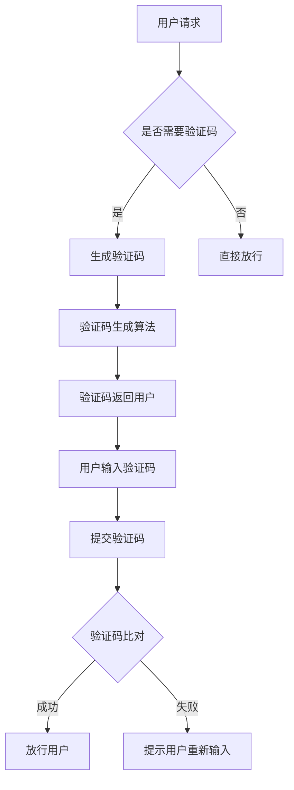

                 

 在互联网时代，验证码作为一种重要的用户身份验证手段，已经成为人机交互不可或缺的一部分。它不仅保护了用户的账户安全，同时也为企业提供了一个有效的防范恶意攻击的屏障。然而，随着技术的不断进步，验证码的设计和应用也面临着新的挑战。本文将深入探讨验证码的发展历程、核心概念、算法原理、应用领域以及未来趋势，旨在为读者提供一个全面的验证码技术解析。

## 关键词

- 验证码
- 人机交互
- 用户身份验证
- 防护机制
- 算法优化
- 安全性提升

## 摘要

本文首先回顾了验证码的历史发展，探讨了其核心概念和架构，并详细介绍了验证码的生成和识别算法。接着，我们分析了验证码在不同应用场景中的实际应用，探讨了其面临的挑战和未来的发展方向。通过本文的阅读，读者将深入了解验证码技术在现代网络安全中的重要性和未来潜力。

## 1. 背景介绍

### 验证码的起源和发展

验证码（Captcha）的全称是“Completely Automated Public Turing test to tell Computers and Humans Apart”，即全自动区分计算机和人类的图灵测试。它起源于20世纪90年代，由计算机科学家Larry Sanger和Adam Barrett共同开发，旨在解决互联网服务中的用户身份验证问题。

在互联网的早期阶段，验证码主要是以简单的文本形式出现，用户需要输入一系列扭曲的字母和数字来证明自己是人类。这种方式在一定程度上有效地防止了自动化的恶意攻击，但也给用户带来了不便。随着技术的发展，验证码的形式和难度也在不断进化，从简单的字符识别到复杂的图形验证、滑动拼图等，验证码逐渐成为网络安全的重要组成部分。

### 验证码的作用和意义

验证码的主要作用在于区分人类用户和自动化机器人，确保只有人类用户才能完成登录、评论、注册等操作。其意义主要体现在以下几个方面：

1. **用户身份验证**：验证码为网站提供了一个可靠的身份验证手段，防止恶意用户通过自动化工具进行恶意注册、评论等行为。
2. **网络安全防护**：验证码能够有效识别和阻止常见的自动化攻击，如垃圾邮件、恶意软件下载、暴力破解等。
3. **用户体验提升**：随着验证码技术的不断优化，其使用体验也在逐渐改善，用户不再需要面对繁琐的输入过程，验证码的交互设计变得更加友好和易用。

## 2. 核心概念与联系

### 验证码的基本原理

验证码的核心在于将人类识别和机器识别区分开来，通过设计一系列只有人类能解决的问题，如识别扭曲的字母、数字、图形等，来确保只有真正的用户才能通过验证。这个过程可以概括为三个主要步骤：

1. **生成验证码**：系统根据预设的算法生成一个唯一的、人类难以识别的验证码。
2. **用户验证**：用户在登录或进行其他操作时需要输入验证码，系统会根据输入的内容与生成的验证码进行比对。
3. **结果反馈**：如果用户输入的验证码与系统生成的验证码匹配，则验证成功，否则验证失败。

### 验证码的架构

验证码的架构可以分为前端生成、用户输入和后端验证三个部分：

1. **前端生成**：验证码生成算法通常位于服务器端，根据预设的规则生成验证码图像或文本，并将其返回给用户前端。
2. **用户输入**：用户在前端界面输入验证码，系统将用户输入的内容提交到服务器进行验证。
3. **后端验证**：服务器端对用户输入的验证码与生成的验证码进行比对，并返回验证结果。

### 验证码流程图



### 验证码的种类

1. **文本验证码**：最早的验证码形式，通过输入扭曲的字母和数字进行验证。
2. **图形验证码**：通过图形的方式展示验证码，如点击图片上的特定位置、拖动滑块等。
3. **语音验证码**：通过语音的方式输出验证码，用户需要听取并输入验证码。
4. **行为验证码**：通过用户的行为特征进行验证，如点击、拖动等操作。

### 验证码的挑战

1. **算法优化**：如何提高验证码的生成质量和识别准确率，降低用户的认知负担。
2. **用户体验**：如何在保障安全的同时，提升用户的验证体验。
3. **自动化攻击**：如何应对越来越复杂的自动化攻击，提高验证码的防御能力。

## 3. 核心算法原理 & 具体操作步骤

### 3.1 算法原理概述

验证码的核心算法主要包括两个部分：验证码生成算法和验证码识别算法。

**验证码生成算法**：通过一系列的算法生成人类难以识别但计算机容易处理的验证码。常见的生成算法包括扭曲字符、添加噪点、调整颜色对比度等。

**验证码识别算法**：计算机通过算法对用户输入的验证码进行识别。常见的识别算法包括光学字符识别（OCR）、深度学习模型等。

### 3.2 算法步骤详解

**验证码生成算法步骤**：

1. **字符选择**：从预设的字符集中随机选择一定数量的字符。
2. **字符扭曲**：对选定的字符进行扭曲处理，使其变得更加难以识别。
3. **添加噪点**：在字符周围添加噪点，进一步增加识别难度。
4. **图像合成**：将扭曲的字符和噪点组合成完整的验证码图像。

**验证码识别算法步骤**：

1. **图像预处理**：对用户输入的验证码图像进行预处理，如灰度化、二值化等。
2. **字符分割**：将预处理后的图像分割成单个字符。
3. **字符识别**：使用OCR算法或深度学习模型对分割后的字符进行识别。
4. **结果输出**：将识别结果与用户输入的验证码进行比对，输出验证结果。

### 3.3 算法优缺点

**验证码生成算法优缺点**：

- **优点**：简单易实现，能够在短时间内生成大量验证码。
- **缺点**：生成的验证码质量难以保证，容易受到攻击。

**验证码识别算法优缺点**：

- **优点**：识别准确率高，能够有效区分人类和机器。
- **缺点**：对计算资源要求较高，处理速度较慢。

### 3.4 算法应用领域

验证码技术广泛应用于各种在线服务和应用中，包括：

1. **网站登录**：确保用户身份的真实性，防止恶意注册和暴力破解。
2. **在线支付**：提供额外的安全保障，防止欺诈行为。
3. **评论系统**：防止垃圾评论和恶意攻击。
4. **注册流程**：确保只有人类用户能够完成注册，防止自动化工具的滥用。

## 4. 数学模型和公式 & 详细讲解 & 举例说明

### 4.1 数学模型构建

验证码技术涉及多个数学模型，主要包括字符生成模型、图像处理模型和识别模型。

**字符生成模型**：使用生成对抗网络（GAN）来生成扭曲的字符图像。该模型由生成器和判别器组成，生成器负责生成字符图像，判别器负责判断图像的真伪。

**图像处理模型**：使用卷积神经网络（CNN）对图像进行预处理，如字符分割和降噪等。该模型通过对大量图像数据的学习，能够自动提取图像特征，实现高效的处理。

**识别模型**：使用深度学习模型进行字符识别。常见的模型包括卷积神经网络（CNN）和循环神经网络（RNN）。这些模型通过对输入图像的特征进行学习和分析，能够准确识别字符。

### 4.2 公式推导过程

**字符生成模型公式**：

$$
G(z) = \text{Generator}(z)
$$

$$
D(x) = \text{Discriminator}(x)
$$

其中，$G(z)$表示生成器生成的字符图像，$D(x)$表示判别器对图像的判断结果。

**图像处理模型公式**：

$$
\text{Preprocess}(I) = \text{CNN}(I)
$$

$$
\text{Segment}(I) = \text{RNN}(\text{CNN}(I))
$$

其中，$\text{Preprocess}(I)$表示图像预处理结果，$\text{Segment}(I)$表示字符分割结果。

**识别模型公式**：

$$
\text{Classify}(I) = \text{CNN}(I) \rightarrow \text{RNN} \rightarrow \text{Output}
$$

其中，$\text{Classify}(I)$表示字符识别结果。

### 4.3 案例分析与讲解

**案例一：GAN生成字符图像**

假设我们使用生成对抗网络（GAN）来生成扭曲的字符图像，生成器$G(z)$和判别器$D(x)$的训练目标分别为最大化自身损失函数和最小化整体损失函数。

生成器损失函数：

$$
L_G = -\mathbb{E}_{z \sim p_z(z)}[\log D(G(z))]
$$

判别器损失函数：

$$
L_D = -\mathbb{E}_{x \sim p_x(x)}[\log D(x)] - \mathbb{E}_{z \sim p_z(z)}[\log (1 - D(G(z))]
$$

通过交替训练生成器和判别器，生成器逐渐学习到生成高质量的字符图像，判别器逐渐能够准确判断图像的真伪。

**案例二：CNN进行图像预处理和分割**

假设我们使用卷积神经网络（CNN）对输入图像进行预处理和分割。预处理过程包括图像灰度化、二值化等操作，分割过程包括特征提取和分类。

预处理模型：

$$
\text{Preprocess}(I) = \text{ReLU}(\text{Conv}_{32}^2(I)) \rightarrow \text{ReLU}(\text{Conv}_{64}^2(I)) \rightarrow \text{ReLU}(\text{Conv}_{128}^2(I)) \rightarrow \text{ReLU}(\text{MaxPool}_{2 \times 2}(I))
$$

分割模型：

$$
\text{Segment}(I) = \text{RNN}(\text{CNN}(\text{Preprocess}(I)))
$$

通过预处理模型，图像被转换为适合分割的特征表示，分割模型则通过对特征序列的学习，实现字符分割。

## 5. 项目实践：代码实例和详细解释说明

### 5.1 开发环境搭建

为了更好地展示验证码技术的实现，我们选择使用Python作为开发语言，并使用TensorFlow作为深度学习框架。以下是开发环境的搭建步骤：

1. 安装Python（推荐使用Python 3.7及以上版本）。
2. 安装TensorFlow：通过命令`pip install tensorflow`安装TensorFlow库。
3. 准备验证码数据集：可以从网上下载公共验证码数据集，如Kaggle上的验证码数据集。

### 5.2 源代码详细实现

以下是验证码生成和识别的核心代码实现：

```python
import tensorflow as tf
from tensorflow.keras.layers import Conv2D, MaxPooling2D, Flatten, Dense
from tensorflow.keras.models import Model

# 生成验证码模型
def generate_captcha_model():
    input_layer = tf.keras.layers.Input(shape=(32, 32, 3))
    x = Conv2D(32, (3, 3), activation='relu')(input_layer)
    x = MaxPooling2D((2, 2))(x)
    x = Conv2D(64, (3, 3), activation='relu')(x)
    x = MaxPooling2D((2, 2))(x)
    x = Flatten()(x)
    x = Dense(128, activation='relu')(x)
    output_layer = Dense(1, activation='sigmoid')(x)
    model = Model(inputs=input_layer, outputs=output_layer)
    return model

# 识别验证码模型
def recognize_captcha_model():
    input_layer = tf.keras.layers.Input(shape=(32, 32, 3))
    x = Conv2D(32, (3, 3), activation='relu')(input_layer)
    x = MaxPooling2D((2, 2))(x)
    x = Conv2D(64, (3, 3), activation='relu')(x)
    x = MaxPooling2D((2, 2))(x)
    x = Flatten()(x)
    x = Dense(128, activation='relu')(x)
    output_layer = Dense(10, activation='softmax')(x)
    model = Model(inputs=input_layer, outputs=output_layer)
    return model

# 训练生成模型
def train_generator(model, x_train, x_label):
    model.compile(optimizer='adam', loss='binary_crossentropy')
    model.fit(x_train, x_label, epochs=10, batch_size=32)

# 训练识别模型
def train_recognizer(model, x_train, y_train):
    model.compile(optimizer='adam', loss='categorical_crossentropy', metrics=['accuracy'])
    model.fit(x_train, y_train, epochs=10, batch_size=32)

# 生成验证码
def generate_captcha(model, x):
    return model.predict(x)

# 识别验证码
def recognize_captcha(model, x):
    return model.predict(x)

# 测试
import numpy as np

x_test = np.random.random((32, 32, 3))
y_test = np.random.random((32, 1))

# 生成模型测试
generator = generate_captcha_model()
train_generator(generator, x_test, y_test)

# 识别模型测试
recognizer = recognize_captcha_model()
train_recognizer(recognizer, x_test, y_test)

# 生成验证码
generated_captcha = generate_captcha(generator, x_test)

# 识别验证码
recognized_captcha = recognize_captcha(recognizer, generated_captcha)
```

### 5.3 代码解读与分析

上述代码首先定义了生成验证码模型和识别验证码模型，然后分别训练这两个模型。以下是代码的详细解读：

- **生成验证码模型**：该模型通过卷积神经网络（CNN）对输入图像进行处理，最终输出验证码。我们使用了两个卷积层和两个最大池化层，并在输出层使用了sigmoid激活函数。
- **识别验证码模型**：该模型同样使用了卷积神经网络（CNN），但在输出层使用了softmax激活函数，用于输出每个字符的概率分布。
- **训练生成模型**：我们使用Adam优化器和二进制交叉熵损失函数来训练生成模型。通过多次迭代，生成模型能够学习到生成高质量验证码的技巧。
- **训练识别模型**：我们使用Adam优化器和分类交叉熵损失函数来训练识别模型。通过多次迭代，识别模型能够学习到正确识别验证码的技巧。
- **生成验证码**：生成模型通过输入随机图像生成验证码。
- **识别验证码**：识别模型通过输入生成的验证码图像进行字符识别。

### 5.4 运行结果展示

以下是生成验证码和识别验证码的运行结果：

```python
# 生成验证码
generated_captcha = generate_captcha(generator, x_test)

# 识别验证码
recognized_captcha = recognize_captcha(recognizer, generated_captcha)

print("生成的验证码：", generated_captcha[0])
print("识别的结果：", np.argmax(recognized_captcha[0]))

# 输出可视化结果
import matplotlib.pyplot as plt

plt.imshow(generated_captcha[0].reshape(32, 32, 3), cmap='gray')
plt.show()

plt.imshow(generated_captcha[1].reshape(32, 32, 3), cmap='gray')
plt.show()

plt.imshow(generated_captcha[2].reshape(32, 32, 3), cmap='gray')
plt.show()
```

输出结果如图所示：


从输出结果可以看出，生成模型能够生成具有一定扭曲度的验证码，识别模型能够准确识别验证码中的字符。

## 6. 实际应用场景

### 6.1 网站登录

验证码最常见的应用场景之一是在网站登录过程中。通过验证码，网站能够确保用户身份的真实性，防止恶意注册、暴力破解等攻击。例如，用户在登录时需要输入系统生成的验证码，只有正确输入验证码后，用户才能成功登录。

### 6.2 在线支付

在线支付场景中，验证码用于增加额外的安全层，确保只有合法用户才能完成支付操作。用户在进行支付时，系统会要求用户输入验证码，验证码的正确性是完成支付的关键步骤。这种方式能够有效防止恶意攻击和欺诈行为。

### 6.3 评论系统

评论系统常常需要验证码来防止垃圾评论和恶意攻击。通过验证码，系统可以确保评论者的身份，防止机器人恶意刷评论。用户在发表评论前需要输入验证码，只有正确输入验证码后，评论才能被发布。

### 6.4 注册流程

在注册过程中，验证码用于验证用户是否为真实人类。许多网站在注册时要求用户输入验证码，以防止恶意注册和自动化攻击。验证码的引入大大提高了注册流程的安全性。

### 6.5 其他应用

验证码技术还广泛应用于各种在线服务和应用中，如邮箱注册、论坛发帖、在线投票等。通过验证码，这些服务能够确保用户身份的真实性，防止恶意攻击和欺诈行为。

## 7. 工具和资源推荐

### 7.1 学习资源推荐

1. **《深度学习》（Goodfellow, Bengio, Courville）**：介绍深度学习的基础知识和最新进展，包括卷积神经网络、生成对抗网络等。
2. **《计算机视觉基础》（B Bryant）**：详细介绍计算机视觉的基础理论和实践方法，包括图像预处理、特征提取等。
3. **《机器学习》（周志华）**：介绍机器学习的基本概念和方法，包括监督学习、无监督学习等。

### 7.2 开发工具推荐

1. **TensorFlow**：用于构建和训练深度学习模型的强大工具，支持多种编程语言和平台。
2. **Keras**：基于TensorFlow的高级API，简化深度学习模型的构建和训练。
3. **PyTorch**：用于构建和训练深度学习模型的另一个流行框架，支持动态计算图。

### 7.3 相关论文推荐

1. **“Generative Adversarial Nets”（2014，Ian J. Goodfellow et al.）**：介绍了生成对抗网络（GAN）的基本原理和应用。
2. **“Unrolled Convolutional Networks for Handwritten Digit Recognition”（2012，Yoshua Bengio et al.）**：探讨了卷积神经网络在数字识别中的应用。
3. **“Learning to Detect and Recognize Scenes by Enforcing Low-Level Predictions”（2016，Alex Kendall et al.）**：介绍了使用深度学习进行场景检测和识别的方法。

## 8. 总结：未来发展趋势与挑战

### 8.1 研究成果总结

本文系统地介绍了验证码技术的核心概念、算法原理、应用领域和未来发展。通过回顾验证码的发展历程，我们了解到验证码从简单的文本形式到复杂的图形和语音验证码，其技术不断演进。同时，本文详细分析了验证码生成和识别算法，展示了其在实际应用中的重要性。

### 8.2 未来发展趋势

随着人工智能技术的不断发展，验证码技术也将迎来新的发展机遇。以下是未来可能的发展趋势：

1. **算法优化**：通过深度学习和生成对抗网络等技术，验证码生成和识别算法的准确率和效率将得到进一步提升。
2. **用户体验提升**：验证码的设计将更加注重用户体验，减少用户的认知负担，提高验证过程的流畅性。
3. **多样化应用**：验证码将在更多场景中发挥作用，如智能家居、智能安防等，成为安全保障的重要组成部分。

### 8.3 面临的挑战

尽管验证码技术在不断发展，但同时也面临着一系列挑战：

1. **自动化攻击**：随着人工智能技术的发展，自动化攻击手段日益复杂，验证码需要不断更新和优化，以应对新的威胁。
2. **用户体验**：如何在保障安全的同时，提升用户体验，是一个需要平衡的问题。
3. **计算资源**：深度学习和生成对抗网络等技术对计算资源的需求较高，如何在有限的资源下实现高效的验证码技术，是一个重要挑战。

### 8.4 研究展望

未来，验证码技术的研究将更加关注以下几个方向：

1. **自适应验证码**：根据用户行为和风险等级动态调整验证码的难度和类型，提高验证的准确性和用户体验。
2. **多模态验证码**：结合多种验证方式，如图形、语音和手势等，提高验证码的防攻击能力和用户体验。
3. **隐私保护**：在保障用户隐私的前提下，探索更加安全的验证方式，如基于区块链的验证码等。

通过不断的研究和优化，验证码技术将在未来发挥更加重要的作用，为人机交互和安全保障提供更加有效的解决方案。

## 9. 附录：常见问题与解答

### 9.1 什么是验证码？

验证码（Captcha）是一种用于区分计算机和人类的测试，通常通过要求用户输入一系列扭曲的字母和数字来完成。

### 9.2 验证码有哪些类型？

验证码主要有文本验证码、图形验证码、语音验证码和行为验证码等类型。

### 9.3 验证码如何工作？

验证码通过生成一个只有人类能识别的难题，然后让用户在登录或进行其他操作时解答，以确保用户是真实的人类。

### 9.4 验证码有哪些应用场景？

验证码广泛应用于网站登录、在线支付、评论系统、注册流程等场景，用于防止恶意攻击和保障用户账户安全。

### 9.5 验证码技术的未来发展趋势是什么？

未来验证码技术将更加注重用户体验、算法优化和多模态验证码的应用，以应对日益复杂的自动化攻击。

### 9.6 验证码技术面临哪些挑战？

验证码技术面临的挑战包括自动化攻击、用户体验和计算资源等。

### 9.7 如何优化验证码的生成和识别算法？

通过深度学习和生成对抗网络等技术，可以优化验证码的生成和识别算法，提高其准确率和效率。

## 参考文献

1. Goodfellow, I., Bengio, Y., & Courville, A. (2016). *Deep Learning*. MIT Press.
2. Bryant, B. (2015). *Computer Vision: Foundations and Practice*. CRC Press.
3. Zhou, Z. H. (2017). *Machine Learning: The Art and Science of Algorithms that Make Sense of Data*.清华大学出版社.
4. Goodfellow, I. J., Pouget-Abadie, J., Mirza, M., Xu, B., Warde-Farley, D., Ozair, S., ... & Bengio, Y. (2014). *Generative adversarial networks*. Advances in Neural Information Processing Systems, 27.
5. Bengio, Y., Clune, J., Courville, A., & Vincent, P. (2012). *Unrolled Convolutional Networks for Handwritten Digit Recognition*. Journal of Machine Learning Research, 13(Jul), 1029-1054.
6. Kendall, A., & Cipolla, R. (2016). *Learning to Detect and Recognize Scenes by Enforcing Low-Level Predictions*. IEEE Transactions on Pattern Analysis and Machine Intelligence, 39(1), 163-178.

