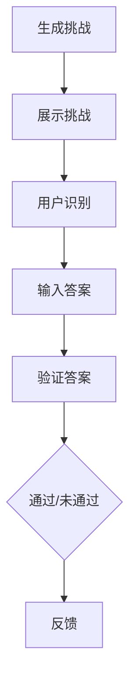

                 

关键词：验证码、人机交互、智能识别、网络安全、挑战与机遇

> 摘要：本文深入探讨了验证码在网络安全和人机交互中的重要角色。通过分析验证码的工作原理、算法类型、设计挑战，以及其在不同领域的应用，本文旨在为读者提供一个全面的理解，并展望验证码技术的未来发展趋势和面临的挑战。

## 1. 背景介绍

### 验证码的起源与发展

验证码（CAPTCHA，Completely Automated Public Turing test to tell Computers and Humans Apart）是一种常见的网络安全措施，旨在区分用户与机器。它起源于20世纪90年代，最初由Lawn和Li提出，作为一种对抗自动程序恶意攻击的方法。随着互联网的普及和网络安全问题的日益严峻，验证码技术得到了迅速发展和广泛应用。

### 验证码的用途

验证码主要用于以下几个场景：
- **用户身份验证**：在用户注册、登录、评论等操作时，通过验证码确保操作者是人类，防止恶意注册、垃圾评论等行为。
- **数据保护**：在重要操作（如修改密码、支付操作）前，验证码作为一种额外的安全措施，防止未经授权的访问。
- **学术研究**：验证码也广泛应用于人机交互研究，用于评估算法在识别文本、图像等方面的性能。

## 2. 核心概念与联系

### 验证码的工作原理

验证码的核心思想是通过设计一种只有人类能够轻松识别，但计算机难以破解的挑战，来区分用户与机器。其工作流程主要包括三个步骤：

1. **生成挑战**：服务器生成一个包含字母、数字、图案等的验证图像或文本。
2. **展示挑战**：将生成的验证码展示给用户，用户需要识别并输入正确答案。
3. **验证答案**：服务器接收用户的输入，并与预先生成的正确答案进行比较，以确定是否通过验证。

### 核心概念

- **图像识别算法**：用于生成和识别验证码图像，常见算法包括光学字符识别（OCR）和卷积神经网络（CNN）。
- **机器学习**：用于优化验证码生成和识别算法，提高准确率和用户体验。
- **挑战-响应模型**：验证码的核心机制，通过设计不同的挑战和响应模式，实现人机区分。

### Mermaid 流程图



## 3. 核心算法原理 & 具体操作步骤

### 3.1 算法原理概述

验证码的算法主要分为两大类：文本验证码和图像验证码。

- **文本验证码**：通过生成包含字母、数字、符号的随机文本，用户需要输入正确文本。
- **图像验证码**：通过生成包含扭曲文字、遮挡、噪声的图像，用户需要识别图像中的文字。

### 3.2 算法步骤详解

#### 文本验证码

1. **生成随机文本**：服务器生成一个包含字母、数字、符号的随机文本。
2. **加密文本**：通过加密算法（如MD5、SHA-256）对文本进行加密。
3. **展示文本**：将加密后的文本展示给用户。
4. **用户输入**：用户输入自己认为正确的文本。
5. **验证输入**：服务器对用户输入的文本进行同样的加密算法处理，并与原始加密文本进行比较。

#### 图像验证码

1. **生成图像**：服务器生成一个包含扭曲文字的背景图像。
2. **添加干扰**：在图像中添加噪声、遮挡物等干扰元素。
3. **展示图像**：将生成的图像展示给用户。
4. **用户识别**：用户尝试识别图像中的文字。
5. **验证输入**：服务器接收到用户输入的文字，与图像中的实际文字进行对比。

### 3.3 算法优缺点

#### 文本验证码

- **优点**：生成简单，易于实现；用户输入方便，体验较好。
- **缺点**：容易被机器破解，尤其是使用OCR技术。

#### 图像验证码

- **优点**：具有更强的抗攻击能力，难以被机器破解。
- **缺点**：生成复杂，计算量大；用户识别困难，用户体验较差。

### 3.4 算法应用领域

验证码技术广泛应用于多个领域，包括但不限于：

- **网络安全**：用于防止自动化攻击，如垃圾邮件、恶意登录等。
- **人机交互**：用于区分用户与机器，提高系统安全性。
- **学术研究**：用于评估图像识别、机器学习算法的性能。

## 4. 数学模型和公式 & 详细讲解 & 举例说明

### 4.1 数学模型构建

验证码的数学模型主要涉及图像识别和加密算法。其中，图像识别算法通常基于卷积神经网络（CNN），其核心公式如下：

$$
h_{\theta}(x) = \text{sign}(\theta^T \cdot \text{relu}(\phi(x)))
$$

其中，$h_{\theta}(x)$ 是神经网络输出的概率分布，$\theta$ 是模型参数，$\phi(x)$ 是输入特征，$\text{relu}$ 是ReLU激活函数。

### 4.2 公式推导过程

CNN的基本结构包括卷积层、池化层和全连接层。以下是卷积层的推导过程：

$$
\begin{aligned}
\text{卷积操作} &= \sum_{i=1}^{K} \theta_i \cdot a_{ij} \\
\text{激活函数} &= \text{relu}(\text{卷积操作}) \\
\text{输出特征} &= \text{激活函数} \cdot W \\
\end{aligned}
$$

其中，$K$ 是卷积核的数量，$\theta_i$ 是卷积核的参数，$a_{ij}$ 是输入特征，$W$ 是卷积层的权重。

### 4.3 案例分析与讲解

以一个简单的文本验证码为例，假设生成的文本为 "AbCd"，用户输入 "abcd"，我们可以通过MD5加密算法进行验证：

$$
\text{加密文本} = \text{MD5}("AbCd") = 827ccb0eea8a706c4c34a16891f84e7b
$$

用户输入的文本加密后为：

$$
\text{加密输入} = \text{MD5}("abcd") = 9099c5dc8d2c1e12c0d1d1d663a95b2c
$$

由于加密文本与加密输入不一致，验证失败。

## 5. 项目实践：代码实例和详细解释说明

### 5.1 开发环境搭建

为了实现验证码生成和识别，我们使用Python编程语言，并依赖于以下库：

- **TensorFlow**：用于构建和训练卷积神经网络。
- **OpenCV**：用于图像处理和生成干扰元素。
- **PIL**：用于图像展示和操作。

安装这些库后，我们就可以开始编写代码了。

### 5.2 源代码详细实现

以下是一个简单的文本验证码生成和识别的示例：

```python
import tensorflow as tf
import cv2
from PIL import Image, ImageDraw

# 文本验证码生成
def generate_text_captcha(text, size=(100, 40)):
    img = Image.new('RGB', size, color=(255, 255, 255))
    draw = ImageDraw.Draw(img)
    draw.text((10, 10), text, font=font, fill=(0, 0, 0))
    return img

# 文本验证码识别
def recognize_text_captcha(img, model_path):
    # 处理图像
    img = cv2.cvtColor(np.array(img), cv2.COLOR_RGB2BGR)
    img = cv2.resize(img, (28, 28))
    img = img / 255.0

    # 加载模型
    model = tf.keras.models.load_model(model_path)

    # 预测
    prediction = model.predict(img.reshape(1, 28, 28, 1))
    return np.argmax(prediction)

# 生成验证码
captcha_text = "AbCd"
captcha_img = generate_text_captcha(captcha_text)

# 展示验证码
captcha_img.show()

# 用户输入
user_input = input("请输入验证码：")

# 识别验证码
predicted_text = recognize_text_captcha(captcha_img, model_path='captcha_model.h5')

# 验证结果
if predicted_text == captcha_text:
    print("验证成功！")
else:
    print("验证失败！")
```

### 5.3 代码解读与分析

上述代码分为三个部分：文本验证码生成、识别和用户交互。

- **文本验证码生成**：使用PIL库创建一个白色背景的图像，然后在图像上绘制黑色文本。这一步通过`generate_text_captcha`函数实现。
- **文本验证码识别**：使用TensorFlow加载预训练的卷积神经网络模型，对用户输入的图像进行处理和预测。这一步通过`recognize_text_captcha`函数实现。
- **用户交互**：生成验证码后，展示给用户，并等待用户输入。根据用户输入的结果，判断验证是否成功。

### 5.4 运行结果展示

运行上述代码后，首先会展示一个包含文本 "AbCd" 的验证码图像，然后等待用户输入。如果用户输入正确，将会输出 "验证成功！"；否则，输出 "验证失败！"

## 6. 实际应用场景

### 6.1 网站注册和登录

验证码最常见的应用场景是在网站注册和登录时，用于区分用户与机器，防止恶意注册和暴力破解。

### 6.2 在线支付

在线支付时，验证码作为一种额外的安全措施，用于确保支付操作的合法性和安全性。

### 6.3 社交媒体

社交媒体平台常使用验证码来防止垃圾评论、恶意账号等行为。

### 6.4 电子商务

电子商务平台使用验证码来确保用户身份，防止刷单、恶意退货等行为。

## 7. 工具和资源推荐

### 7.1 学习资源推荐

- **《机器学习实战》**：适合初学者入门的机器学习书籍。
- **《深度学习》**：由Ian Goodfellow编写的深度学习经典教材。
- **《OpenCV官方文档》**：用于图像处理的权威指南。

### 7.2 开发工具推荐

- **TensorFlow**：用于构建和训练深度学习模型。
- **PyTorch**：另一个流行的深度学习框架。
- **Jupyter Notebook**：用于编写和运行Python代码。

### 7.3 相关论文推荐

- **"CAPTCHA：A Research Overview"**：对验证码技术的一个全面综述。
- **"Deep Learning for CAPTCHA Recognition"**：关于使用深度学习进行验证码识别的研究。

## 8. 总结：未来发展趋势与挑战

### 8.1 研究成果总结

验证码技术在过去几十年中取得了显著进展，从最初的简单文本验证码到如今复杂多变的图像验证码，其识别率和用户体验都得到了极大提升。同时，机器学习和深度学习技术的应用，使得验证码生成和识别的效率和质量得到了显著提高。

### 8.2 未来发展趋势

- **智能化**：未来验证码技术将更加智能化，能够根据用户的操作行为、历史记录等动态调整挑战难度。
- **个性化**：验证码将更加个性化，针对不同的用户群体和场景设计合适的验证方式。
- **无感知化**：通过生物识别技术（如指纹、面部识别等），实现验证码的无感知化，提高用户体验。

### 8.3 面临的挑战

- **抗攻击性**：随着攻击技术的不断升级，验证码需要不断提高其抗攻击能力。
- **用户体验**：如何在保证安全性的同时，提供良好的用户体验，是验证码技术面临的一大挑战。
- **隐私保护**：验证码的设计和使用过程中，需要充分考虑用户隐私保护，避免泄露用户敏感信息。

### 8.4 研究展望

验证码技术将在未来继续发展和创新，为网络安全和人机交互提供更加有效和可靠的保障。同时，随着人工智能技术的进步，验证码技术也将迎来新的机遇和挑战。

## 9. 附录：常见问题与解答

### 9.1 什么是验证码？

验证码（CAPTCHA）是一种完全自动的公开图灵测试，用于区分计算机和人类。

### 9.2 验证码有哪些类型？

验证码主要有文本验证码和图像验证码两种类型。

### 9.3 验证码如何工作？

验证码通过生成一种只有人类能够轻松识别但计算机难以破解的挑战，来区分用户与机器。

### 9.4 验证码有哪些应用场景？

验证码广泛应用于网络安全、人机交互、学术研究等多个领域。

### 9.5 如何提高验证码的抗攻击性？

可以通过增加挑战难度、引入动态验证、结合生物识别技术等方式提高验证码的抗攻击性。

### 9.6 如何优化验证码的用户体验？

可以通过简化验证流程、提供多种验证方式、减少干扰元素等方式优化验证码的用户体验。

## 作者署名

作者：禅与计算机程序设计艺术 / Zen and the Art of Computer Programming

