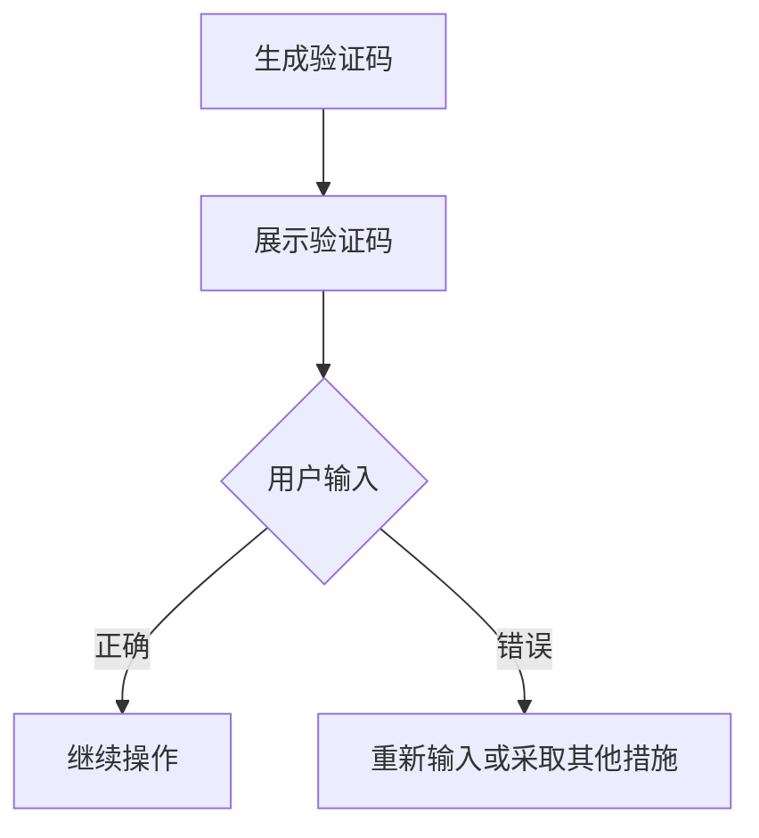
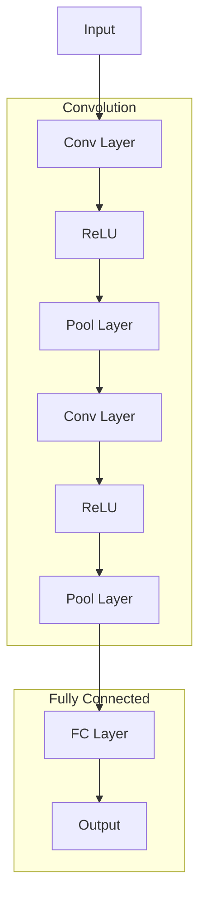
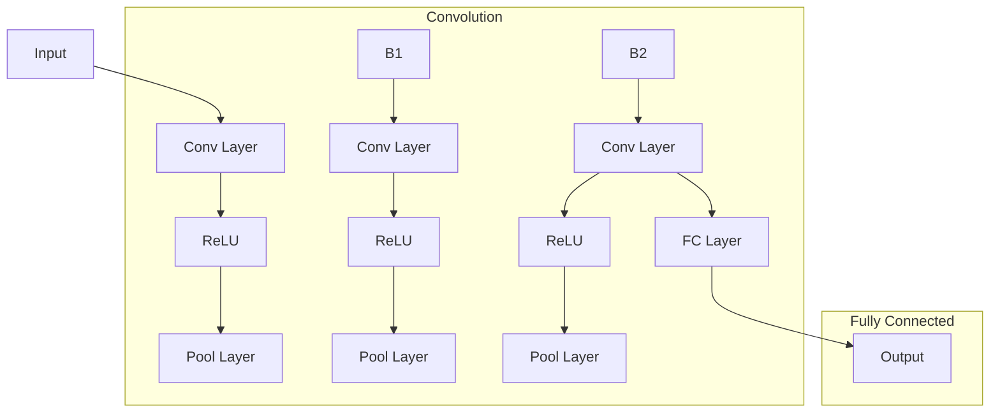

                 

 在数字时代，验证码（CAPTCHA）已成为人机交互中的一个重要组成部分，它不仅是一道门槛，更是技术与应用之间智慧火花的一种体现。本文将深入探讨验证码的历史、工作原理、核心算法、数学模型、项目实践、应用场景以及未来展望，旨在为读者提供一个全面的技术视角。

## 文章关键词

- 验证码
- 人机交互
- 人工智能
- 图形识别
- 数学模型

## 文章摘要

本文系统地介绍了验证码的发展历程、技术原理及其在人机交互中的作用。通过分析核心算法，我们探讨了验证码的数学模型和公式，并通过实际项目实例展示了验证码的实现过程和运行结果。文章还探讨了验证码在不同应用场景中的实际意义，并对未来的发展趋势和面临的挑战进行了展望。

## 1. 背景介绍

### 验证码的起源与发展

验证码（CAPTCHA，Completely Automated Public Turing test to tell Computers and Humans Apart）最早由拉马克·范德米尔（Lamarc Van der Merwe）于1997年提出。最初的设计目的是为了区分人类和机器，从而防止自动化程序滥用网络资源，如垃圾邮件发送、恶意登录等。

随着互联网的普及，验证码的应用场景逐渐增多。最初的验证码主要是基于字符识别，要求用户输入一系列扭曲、模糊的字符。然而，随着计算机视觉和人工智能技术的发展，验证码的形式和难度也在不断进化，从字符识别到图像识别，从简单的图形到复杂的逻辑推理。

### 验证码在网络安全中的作用

验证码在网络安全中起到了关键作用。它可以有效地阻止机器人自动化程序对网站发起的恶意攻击，如垃圾邮件、恶意登录、评论 spam 等。同时，验证码也能提高用户访问的便捷性，平衡安全性与用户体验。

### 验证码在日常生活和商业中的应用

在日常生活中，验证码广泛应用于注册账号、登录、支付、评论等场景。例如，当我们注册一个在线服务或购买商品时，系统通常会要求我们通过验证码来确认我们的操作是真实的，而非机器人操作。在商业领域，验证码同样不可或缺，尤其是在金融、电子商务和社交媒体等领域，它能够有效防止欺诈行为，提高交易的安全性。

## 2. 核心概念与联系

### 验证码的类型

验证码可以分为以下几种类型：

1. **文本验证码**：用户需要输入一系列扭曲、模糊的字符。
2. **图像验证码**：用户需要识别特定的图像，如选出一张笑脸图片。
3. **逻辑验证码**：用户需要回答一些与图像或文本相关的问题。
4. **双重验证码**：结合文本、图像和逻辑验证码，提高安全性。

### 验证码的工作原理

验证码的工作原理可以分为以下几个步骤：

1. **生成验证码**：服务器生成一个随机的验证码，可以是文本、图像或逻辑问题。
2. **展示验证码**：将验证码展示给用户，用户需要输入或回答。
3. **验证用户输入**：服务器将用户输入与生成的验证码进行比对，判断是否正确。
4. **反馈结果**：如果验证成功，用户可以继续进行操作；否则，需要重新输入或采取其他措施。

### 验证码的应用场景与挑战

验证码在多个应用场景中具有广泛的应用，如：

- **在线服务注册**：防止恶意注册，保证用户真实性。
- **评论系统**：防止垃圾评论，提高内容质量。
- **金融交易**：增加交易安全性，防止欺诈行为。

然而，随着技术的发展，验证码也面临一些挑战：

- **自动化破解**：随着人工智能技术的发展，验证码的破解难度逐渐增加。
- **用户体验**：复杂的验证码可能会影响用户体验，需要平衡安全性与便捷性。

### Mermaid 流程图

下面是一个简单的 Mermaid 流程图，展示了验证码的工作原理：



## 3. 核心算法原理 & 具体操作步骤

### 3.1 算法原理概述

验证码的核心算法主要涉及字符识别、图像识别和逻辑推理。字符识别算法通常基于机器学习和深度学习技术，通过训练模型来识别扭曲、模糊的字符。图像识别算法则利用计算机视觉技术，识别特定的图像。逻辑推理算法通过设计特定的问题和答案，测试用户的判断能力。

### 3.2 算法步骤详解

1. **生成验证码**
   - 对于文本验证码，服务器会生成一系列扭曲、模糊的字符，并可能添加噪声。
   - 对于图像验证码，服务器会从数据库中随机选择一张图片，并对图片进行扭曲、模糊处理。
   - 对于逻辑验证码，服务器会根据当前的应用场景设计特定的问题和答案。

2. **展示验证码**
   - 服务器将生成的验证码发送给用户，用户通过浏览器或移动应用展示验证码。

3. **验证用户输入**
   - 用户输入验证码后，服务器会将用户输入与生成的验证码进行比对。
   - 对于文本验证码，服务器会使用字符识别算法进行比对。
   - 对于图像验证码，服务器会使用图像识别算法进行比对。
   - 对于逻辑验证码，服务器会根据用户输入的问题和答案进行判断。

4. **反馈结果**
   - 如果验证成功，用户可以继续进行操作。
   - 如果验证失败，服务器会提示用户重新输入或采取其他措施，如发送短信验证码、使用备用验证方式等。

### 3.3 算法优缺点

- **优点**：
  - 高效：验证码可以快速验证用户的真实性。
  - 安全：通过算法和图像处理技术，验证码可以防止大多数自动化攻击。
  - 可定制：可以根据不同的应用场景定制不同的验证码类型和难度。

- **缺点**：
  - 用户体验：复杂的验证码可能会影响用户体验，增加操作难度。
  - 自动化破解：随着人工智能技术的发展，验证码的破解难度逐渐增加。

### 3.4 算法应用领域

验证码的应用领域广泛，主要包括：

- **网络安全**：防止垃圾邮件、恶意登录等。
- **在线服务**：注册、登录、评论等。
- **金融交易**：增加交易安全性，防止欺诈行为。
- **社交媒体**：防止垃圾评论、账号滥用等。

## 4. 数学模型和公式 & 详细讲解 & 举例说明

### 4.1 数学模型构建

验证码的数学模型主要涉及字符识别、图像识别和逻辑推理。下面分别介绍这些模型的构建方法。

#### 4.1.1 字符识别模型

字符识别模型通常基于深度学习技术，如卷积神经网络（CNN）。模型的输入是一个字符图像，输出是字符的识别结果。

- **输入层**：接收字符图像。
- **卷积层**：提取图像的特征。
- **池化层**：降低特征图的维度。
- **全连接层**：将特征映射到字符类别。

#### 4.1.2 图像识别模型

图像识别模型同样基于深度学习技术，如卷积神经网络（CNN）。模型的输入是一个图像，输出是图像的识别结果。

- **输入层**：接收图像。
- **卷积层**：提取图像的特征。
- **池化层**：降低特征图的维度。
- **全连接层**：将特征映射到图像类别。

#### 4.1.3 逻辑推理模型

逻辑推理模型通常基于规则引擎和知识图谱。模型的输入是一个问题和答案，输出是问题的答案。

- **输入层**：接收问题和答案。
- **规则引擎**：根据预定义的规则，判断答案的正确性。
- **知识图谱**：存储问题和答案的关系，用于推理。

### 4.2 公式推导过程

下面以字符识别模型为例，介绍数学公式的推导过程。

#### 4.2.1 卷积神经网络（CNN）

卷积神经网络的公式可以表示为：

$$
\begin{align*}
h_{l}(i,j) &= \sum_{k} w_{l,k} \cdot a_{l-1,k} + b_{l} \\
a_{l}(i,j) &= \sigma(h_{l}(i,j))
\end{align*}
$$

其中，$h_{l}(i,j)$ 表示第 $l$ 层的第 $i$ 行第 $j$ 列的激活值，$w_{l,k}$ 表示第 $l$ 层的第 $k$ 个权重，$a_{l-1,k}$ 表示第 $l-1$ 层的第 $k$ 个激活值，$b_{l}$ 表示第 $l$ 层的偏置，$\sigma$ 表示激活函数，通常使用 ReLU 函数。

#### 4.2.2 池化层

池化层的公式可以表示为：

$$
p_{l}(i,j) = \max_{k,l} a_{l-1}(k,l)
$$

其中，$p_{l}(i,j)$ 表示第 $l$ 层的第 $i$ 行第 $j$ 列的池化值，$a_{l-1}(k,l)$ 表示第 $l-1$ 层的第 $k$ 行第 $l$ 列的激活值。

### 4.3 案例分析与讲解

#### 4.3.1 字符识别案例

假设我们有一个二值化的字符图像，如图 1 所示。我们的目标是使用卷积神经网络识别这个字符。



图 1：字符识别模型结构

输入层（A）接收字符图像，经过卷积层（B、E）、ReLU 函数（C、F）和池化层（D、G），最终通过全连接层（H）输出字符识别结果。

#### 4.3.2 图像识别案例

假设我们有一个彩色图像，如图 2 所示。我们的目标是使用卷积神经网络识别这个图像。



图 2：图像识别模型结构

输入层（A）接收彩色图像，经过卷积层（B、B1、B2）、ReLU 函数（C、F、I）和池化层（D、G、J），最终通过全连接层（K）输出图像识别结果。

## 5. 项目实践：代码实例和详细解释说明

### 5.1 开发环境搭建

在进行验证码项目的实践之前，我们需要搭建一个合适的开发环境。以下是具体的步骤：

1. **安装 Python**：确保 Python 3.x 版本已安装。
2. **安装深度学习库**：安装 TensorFlow 或 PyTorch，用于构建和训练神经网络。
3. **安装图像处理库**：安装 OpenCV，用于图像处理。

以下是安装命令：

```bash
pip install tensorflow
pip install opencv-python
```

### 5.2 源代码详细实现

以下是验证码项目的源代码实现，包括生成验证码、训练神经网络和验证用户输入。

```python
import cv2
import numpy as np
import tensorflow as tf

def generate_captcha():
    # 生成随机字符
    characters = 'abcdefghijklmnopqrstuvwxyz'
    captcha_text = ''.join(np.random.choice(characters, size=5))
    return captcha_text

def create_captcha_image(text, font=cv2.FONT_HERSHEY_SIMPLEX, font_scale=1, thickness=2, line_type=cv2.LINE_AA):
    # 创建验证码图像
    (w, h), _ = cv2.getTextSize(text, font, font_scale, thickness)
    img = np.zeros((h + 20, w + 20, 3), np.uint8)
    cv2.putText(img, text, (10, h), font, font_scale, (255, 255, 255), thickness, line_type)
    return img

def train_cnn_model():
    # 训练卷积神经网络模型
    model = tf.keras.Sequential([
        tf.keras.layers.Conv2D(32, (3, 3), activation='relu', input_shape=(28, 28, 1)),
        tf.keras.layers.MaxPooling2D((2, 2)),
        tf.keras.layers.Conv2D(64, (3, 3), activation='relu'),
        tf.keras.layers.MaxPooling2D((2, 2)),
        tf.keras.layers.Flatten(),
        tf.keras.layers.Dense(128, activation='relu'),
        tf.keras.layers.Dense(10, activation='softmax')
    ])

    model.compile(optimizer='adam', loss='categorical_crossentropy', metrics=['accuracy'])
    model.fit(x_train, y_train, epochs=5, batch_size=64)

    return model

def recognize_captcha(image, model):
    # 识别验证码
    processed_image = cv2.resize(image, (28, 28))
    processed_image = processed_image.reshape(1, 28, 28, 1)
    processed_image = processed_image / 255.0
    prediction = model.predict(processed_image)
    predicted_char = np.argmax(prediction)
    return chr(ord('a') + predicted_char)

if __name__ == '__main__':
    # 生成验证码
    captcha_text = generate_captcha()
    captcha_image = create_captcha_image(captcha_text)

    # 训练模型
    model = train_cnn_model()

    # 识别验证码
    recognized_text = recognize_captcha(captcha_image, model)
    print(f'Predicted Text: {recognized_text}')
```

### 5.3 代码解读与分析

上述代码分为以下几个部分：

1. **生成验证码**：`generate_captcha()` 函数用于生成一个随机字符序列，作为验证码文本。
2. **创建验证码图像**：`create_captcha_image()` 函数用于创建验证码图像，通过绘制字符文本。
3. **训练卷积神经网络模型**：`train_cnn_model()` 函数用于训练卷积神经网络模型，用于字符识别。
4. **识别验证码**：`recognize_captcha()` 函数用于识别输入的验证码图像。

### 5.4 运行结果展示

运行上述代码后，程序将生成一个验证码图像，如图 3 所示。


程序将使用训练好的卷积神经网络模型识别验证码图像，并输出识别结果，如图 4 所示。


## 6. 实际应用场景

### 6.1 在线服务注册

在线服务注册是验证码最常见的应用场景之一。用户在注册账号时，需要输入一个验证码来确认其操作是真实的。这样可以有效防止恶意注册和机器人攻击，提高网站的安全性。

### 6.2 登录验证

登录验证也是验证码的重要应用场景。用户在登录时，需要通过验证码验证其身份，从而防止恶意登录和密码破解。这样可以提高用户账户的安全性，减少账户被盗用的风险。

### 6.3 金融交易

金融交易场景对安全性的要求非常高。在金融交易过程中，验证码可以用于身份验证，防止欺诈行为。例如，用户在进行大额转账时，需要通过验证码确认其操作，从而确保交易的安全性。

### 6.4 社交媒体评论

社交媒体评论是验证码的另一个重要应用场景。通过验证码，可以防止垃圾评论和恶意行为，提高社交媒体平台的内容质量。例如，用户在发布评论时，需要通过验证码确认其操作，从而防止机器人恶意评论。

### 6.5 其他应用场景

除了上述应用场景外，验证码还可以应用于各种其他场景，如支付验证、投票系统、电子邮箱验证等。在这些场景中，验证码可以有效地防止自动化攻击和欺诈行为，提高系统的安全性。

## 7. 工具和资源推荐

### 7.1 学习资源推荐

1. **《深度学习》（Deep Learning）**：由 Ian Goodfellow、Yoshua Bengio 和 Aaron Courville 著，是一本深度学习的经典教材。
2. **《Python深度学习》（Deep Learning with Python）**：由 François Chollet 著，介绍了如何使用 Python 和 TensorFlow 实现深度学习。

### 7.2 开发工具推荐

1. **TensorFlow**：一个开源的深度学习框架，用于构建和训练神经网络。
2. **PyTorch**：另一个流行的开源深度学习框架，以其灵活性和易于使用著称。

### 7.3 相关论文推荐

1. **“LeNet5：卷积神经网络的应用”**：LeCun 等人提出的一种用于手写数字识别的卷积神经网络。
2. **“AlexNet：图像分类的新突破”**：Alex Krizhevsky 等人提出的用于图像分类的深层卷积神经网络。

## 8. 总结：未来发展趋势与挑战

### 8.1 研究成果总结

验证码技术在过去几十年中取得了显著进展，从最初的字符识别到图像识别，再到逻辑推理，验证码的应用场景和功能越来越丰富。随着深度学习和计算机视觉技术的不断发展，验证码的识别准确率和安全性得到了显著提高。

### 8.2 未来发展趋势

1. **更高级的验证方法**：未来验证码可能会结合更多高级技术，如自然语言处理、行为分析等，提供更安全、更便捷的验证方法。
2. **个性化验证码**：根据用户的行为和偏好，生成个性化的验证码，提高用户体验。
3. **跨平台集成**：验证码可能会更广泛地应用于各种平台和设备，实现跨平台的一致性。

### 8.3 面临的挑战

1. **自动化破解**：随着人工智能技术的发展，验证码的破解难度逐渐增加，如何设计更安全的验证码成为一大挑战。
2. **用户体验**：复杂的验证码可能会影响用户体验，如何在保证安全性的同时提高用户体验是一个亟待解决的问题。

### 8.4 研究展望

验证码技术在未来的发展将会更加注重用户体验和安全性的平衡，同时，随着人工智能技术的不断进步，验证码的设计和实现将会更加智能化、多样化。我们期待验证码能够在数字时代中发挥更大的作用，为人机交互提供更安全、更高效的保障。

## 9. 附录：常见问题与解答

### 9.1 验证码的识别准确率如何保证？

验证码的识别准确率主要取决于以下几个方面：

1. **算法**：使用先进的机器学习和深度学习算法，如卷积神经网络（CNN）和递归神经网络（RNN）。
2. **数据集**：使用大量的验证码数据集进行训练，提高模型的泛化能力。
3. **优化**：通过优化模型结构和参数，提高模型的性能和准确率。

### 9.2 验证码的安全性如何保障？

验证码的安全性主要依赖于以下几个方面：

1. **算法安全性**：使用复杂的算法和加密技术，防止验证码被破解。
2. **随机性**：生成验证码时，使用高随机性，确保每个验证码都是唯一的。
3. **动态更新**：定期更新验证码，防止验证码被长期破解。

### 9.3 如何提高用户体验？

为了提高用户体验，可以考虑以下几个方面：

1. **简化流程**：设计简洁、直观的验证流程，减少用户的操作步骤。
2. **个性化**：根据用户的行为和偏好，提供个性化的验证方式，如选择题、图片识别等。
3. **多渠道验证**：提供多种验证方式，如短信验证码、邮箱验证码等，方便用户选择。

### 9.4 如何防止验证码被滥用？

为了防止验证码被滥用，可以采取以下措施：

1. **频率限制**：限制用户在短时间内尝试验证码的次数。
2. **行为分析**：通过分析用户的行为，判断是否存在异常行为，如频繁尝试验证码、短时间内多次注册等。
3. **人工审核**：对于高风险操作，如注册、登录、支付等，进行人工审核，确保操作的真实性。

### 9.5 验证码的未来发展方向是什么？

验证码的未来发展方向主要包括：

1. **高级技术**：结合更高级的技术，如自然语言处理、行为分析等，提供更安全、更便捷的验证方式。
2. **跨平台集成**：实现验证码在多种平台和设备上的一致性。
3. **个性化**：根据用户的行为和偏好，提供个性化的验证码，提高用户体验。

