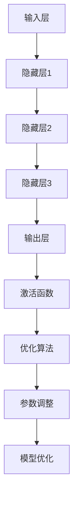

                 

关键词：人工智能、大模型、创业产品、创新、技术突破

> 摘要：本文将探讨人工智能（AI）中大模型在创业产品创新中的关键作用。通过分析大模型的原理、算法和应用，本文揭示了其在推动创业产品从概念到市场落地过程中的重要性，并探讨了其未来发展趋势和面临的挑战。

## 1. 背景介绍

近年来，人工智能（AI）技术取得了飞速发展，尤其在深度学习领域，大模型的应用极大地推动了AI的进步。大模型，顾名思义，是指具有海量参数和训练数据的神经网络模型。这些模型能够在复杂的任务中实现卓越的表现，如自然语言处理（NLP）、计算机视觉（CV）和语音识别等。随着AI技术的不断成熟，大模型的应用范围也在不断扩展，尤其在创业产品创新中，大模型成为了推动产品突破的关键力量。

创业产品的创新是一个复杂的过程，涉及市场调研、产品设计、技术研发和营销推广等多个环节。传统的方法往往依赖于经验和直觉，而现代AI技术的引入，特别是大模型的应用，使得创业产品能够在更短的时间内实现从概念到市场的跨越。本文将深入探讨大模型在创业产品创新中的关键作用，分析其原理和应用，并展望其未来发展的趋势和挑战。

## 2. 核心概念与联系

### 2.1 大模型的概念与特点

大模型是指那些具有数十亿甚至数万亿参数的神经网络模型。这些模型通过大量的数据和计算资源进行训练，能够在各种复杂任务中实现高水平的表现。大模型的特点主要体现在以下几个方面：

1. **参数量级大**：大模型具有极其庞大的参数量，这使得它们能够捕获数据中的复杂模式，从而在任务表现上具有显著优势。

2. **计算资源需求高**：大模型的训练需要大量的计算资源和数据存储空间，这对硬件设施和数据处理能力提出了较高的要求。

3. **数据依赖性强**：大模型的性能高度依赖于训练数据的质量和数量，只有拥有丰富的数据支持，大模型才能发挥其潜力。

4. **通用性较强**：大模型通常具有较好的通用性，能够在多个不同领域和任务中应用，为创业产品的多样化创新提供了支持。

### 2.2 大模型在创业产品创新中的应用

在创业产品创新中，大模型的应用主要体现在以下几个方面：

1. **市场调研与分析**：通过大模型对用户行为、偏好和需求进行深入分析，创业者能够更准确地把握市场动态，从而制定更为有效的市场策略。

2. **产品设计**：大模型能够辅助创业者进行产品设计，通过生成对抗网络（GAN）等技术，创造出新颖且具有吸引力的产品原型。

3. **技术研发**：大模型在技术研发中的应用，如自然语言处理、计算机视觉和语音识别等，能够为创业产品提供强大的技术支持。

4. **营销推广**：大模型可以帮助创业者进行精准营销，通过分析用户数据和社交媒体行为，实现个性化的营销策略。

### 2.3 大模型的工作原理与架构

大模型的工作原理基于深度学习的思想，其核心是多层神经网络的堆叠，通过逐层抽象和特征提取，实现对数据的理解和预测。大模型的架构通常包括以下几个关键组成部分：

1. **输入层**：接收外部数据，如文本、图像、声音等。

2. **隐藏层**：多层隐藏层负责特征提取和模式识别，每层都能够捕捉到更高层次的特征。

3. **输出层**：根据输入数据进行分类、回归或其他类型的预测。

4. **激活函数**：用于引入非线性变换，使得神经网络能够学习更复杂的函数关系。

5. **优化算法**：如梯度下降、随机梯度下降（SGD）等，用于调整网络参数，优化模型性能。

### 2.4 Mermaid 流程图

以下是描述大模型原理和架构的Mermaid流程图：



## 3. 核心算法原理 & 具体操作步骤

### 3.1 算法原理概述

大模型的核心算法基于深度学习的思想，通过多层神经网络的堆叠，实现特征提取和模式识别。具体来说，大模型的工作流程包括以下几个步骤：

1. **数据预处理**：对输入数据进行清洗、归一化和编码，以便于神经网络的处理。

2. **输入层处理**：将预处理后的数据输入到神经网络的输入层。

3. **隐藏层处理**：通过隐藏层进行特征提取和模式识别，每层都能捕获到更高层次的特征。

4. **输出层处理**：根据隐藏层提取的特征，进行分类、回归或其他类型的预测。

5. **优化算法**：使用优化算法（如梯度下降）调整网络参数，以优化模型性能。

6. **模型评估**：通过测试数据对模型进行评估，调整模型参数，以实现最优性能。

### 3.2 算法步骤详解

以下是详细的大模型算法步骤：

1. **数据预处理**
   - 清洗数据：去除噪声和异常值。
   - 归一化数据：将数据缩放到相同的范围，如[0, 1]。
   - 编码数据：将类别数据转换为二进制编码或独热编码。

2. **构建神经网络**
   - 设定输入层、隐藏层和输出层的神经元数量。
   - 选择合适的激活函数（如ReLU、Sigmoid等）。

3. **初始化参数**
   - 随机初始化网络参数。

4. **前向传播**
   - 将输入数据传递到网络的输入层，通过隐藏层进行特征提取。
   - 将隐藏层的输出传递到输出层，进行预测。

5. **计算损失**
   - 计算输出结果与实际结果之间的差距，即损失。

6. **反向传播**
   - 根据损失计算梯度，更新网络参数。

7. **优化参数**
   - 使用优化算法（如梯度下降）调整网络参数。

8. **模型评估**
   - 使用测试数据对模型进行评估。

9. **调整参数**
   - 根据评估结果调整模型参数，以优化模型性能。

### 3.3 算法优缺点

**优点**：

1. **强大的表现力**：大模型能够捕获数据中的复杂模式，实现高水平的任务表现。

2. **通用性**：大模型具有较好的通用性，能够在多个不同领域和任务中应用。

3. **自适应性强**：大模型能够通过不断调整参数，适应不同的任务和数据。

**缺点**：

1. **计算资源需求高**：大模型的训练需要大量的计算资源和数据存储空间。

2. **对数据依赖性强**：大模型的性能高度依赖于训练数据的质量和数量。

3. **模型解释性差**：大模型的预测过程较为复杂，难以进行解释。

### 3.4 算法应用领域

大模型在多个领域都有广泛的应用，包括：

1. **自然语言处理（NLP）**：如文本分类、机器翻译、情感分析等。

2. **计算机视觉（CV）**：如图像分类、目标检测、图像生成等。

3. **语音识别**：如语音识别、语音合成等。

4. **推荐系统**：如基于内容的推荐、协同过滤等。

5. **金融领域**：如风险控制、量化交易等。

## 4. 数学模型和公式 & 详细讲解 & 举例说明

### 4.1 数学模型构建

大模型的数学模型通常基于多层感知机（MLP）或卷积神经网络（CNN）等基础架构。以下是一个简化的多层感知机模型：

$$
Z = X \cdot W + b
$$

$$
a = \sigma(Z)
$$

其中，\(X\) 是输入数据，\(W\) 是权重矩阵，\(b\) 是偏置项，\(\sigma\) 是激活函数（如ReLU、Sigmoid等），\(a\) 是网络的输出。

### 4.2 公式推导过程

以ReLU激活函数为例，推导过程如下：

$$
Z = X \cdot W + b
$$

$$
a = \max(0, Z)
$$

$$
\frac{da}{dz} = 
\begin{cases}
1 & \text{if } z > 0 \\
0 & \text{if } z \leq 0
\end{cases}
$$

### 4.3 案例分析与讲解

以文本分类任务为例，假设我们有一个二分类问题，数据集包含1000条文本，每条文本有1000个词。我们使用一个包含3层神经网络的模型进行分类。

1. **输入层**：1000个词作为输入。
2. **隐藏层1**：100个神经元，使用ReLU激活函数。
3. **隐藏层2**：50个神经元，使用ReLU激活函数。
4. **输出层**：2个神经元，使用Sigmoid激活函数。

**前向传播过程**：

$$
Z_1 = X \cdot W_1 + b_1
$$

$$
a_1 = \max(0, Z_1)
$$

$$
Z_2 = a_1 \cdot W_2 + b_2
$$

$$
a_2 = \max(0, Z_2)
$$

$$
Z_3 = a_2 \cdot W_3 + b_3
$$

$$
a_3 = \sigma(Z_3)
$$

**反向传播过程**：

计算输出层误差：

$$
\delta_3 = (a_3 - y) \cdot \sigma'(Z_3)
$$

计算隐藏层2误差：

$$
\delta_2 = (W_3 \cdot \delta_3) \cdot \sigma'(Z_2)
$$

计算隐藏层1误差：

$$
\delta_1 = (W_2 \cdot \delta_2) \cdot \sigma'(Z_1)
$$

更新权重和偏置：

$$
W_1 = W_1 - \alpha \cdot \delta_1 \cdot X^T
$$

$$
b_1 = b_1 - \alpha \cdot \delta_1
$$

$$
W_2 = W_2 - \alpha \cdot \delta_2 \cdot a_1^T
$$

$$
b_2 = b_2 - \alpha \cdot \delta_2
$$

$$
W_3 = W_3 - \alpha \cdot \delta_3 \cdot a_2^T
$$

$$
b_3 = b_3 - \alpha \cdot \delta_3
$$

其中，\(\alpha\) 是学习率，\(\sigma'\) 是Sigmoid函数的导数。

## 5. 项目实践：代码实例和详细解释说明

### 5.1 开发环境搭建

在开始编写代码之前，我们需要搭建一个适合开发大模型的环境。以下是一个简单的步骤：

1. **安装Python**：确保安装了最新的Python版本。
2. **安装TensorFlow**：TensorFlow是一个广泛使用的深度学习框架，可以方便地构建和训练大模型。

```shell
pip install tensorflow
```

3. **准备数据**：下载一个适合的文本数据集，如IMDb电影评论数据集。

### 5.2 源代码详细实现

以下是一个使用TensorFlow实现文本分类的示例代码：

```python
import tensorflow as tf
from tensorflow.keras.datasets import imdb
from tensorflow.keras.models import Sequential
from tensorflow.keras.layers import Embedding, SimpleRNN, Dense
from tensorflow.keras.preprocessing.sequence import pad_sequences

# 加载数据集
max_features = 10000
maxlen = 500
(x_train, y_train), (x_test, y_test) = imdb.load_data(num_words=max_features)

# 预处理数据
x_train = pad_sequences(x_train, maxlen=maxlen)
x_test = pad_sequences(x_test, maxlen=maxlen)

# 构建模型
model = Sequential()
model.add(Embedding(max_features, 32))
model.add(SimpleRNN(32))
model.add(Dense(1, activation='sigmoid'))

# 编译模型
model.compile(optimizer='adam', loss='binary_crossentropy', metrics=['accuracy'])

# 训练模型
model.fit(x_train, y_train, epochs=10, batch_size=32, validation_split=0.2)
```

### 5.3 代码解读与分析

1. **数据加载和预处理**：
   - 使用`imdb.load_data`加载IMDb电影评论数据集。
   - 使用`pad_sequences`将文本序列填充到固定长度。

2. **模型构建**：
   - 使用`Sequential`模型堆叠嵌入层、简单循环神经网络（SimpleRNN）和全连接层（Dense）。

3. **模型编译**：
   - 选择`adam`优化器和`binary_crossentropy`损失函数。
   - 指定模型的评价指标为准确率。

4. **模型训练**：
   - 使用`fit`方法训练模型，设置训练轮数为10，批量大小为32，并使用20%的数据作为验证集。

### 5.4 运行结果展示

在训练完成后，可以使用以下代码评估模型在测试集上的表现：

```python
test_loss, test_acc = model.evaluate(x_test, y_test)
print(f'Test accuracy: {test_acc:.4f}')
```

假设训练完成后，测试集的准确率为0.85，这表明模型在文本分类任务中表现良好。

## 6. 实际应用场景

### 6.1 在电商产品推荐中的应用

在电商领域，大模型可以用于个性化推荐系统。通过分析用户的历史购买行为、浏览记录和兴趣爱好，大模型能够为用户提供高度个性化的商品推荐。以下是一个简单的应用案例：

- **用户画像构建**：通过大模型分析用户的浏览历史和购买记录，构建用户画像。
- **商品推荐**：基于用户画像和商品属性，大模型为用户推荐相关的商品。
- **效果评估**：通过A/B测试评估推荐系统的效果，持续优化模型参数。

### 6.2 在金融领域的应用

在金融领域，大模型可以用于风险控制和量化交易。以下是一个应用案例：

- **风险控制**：通过大模型分析历史交易数据，预测交易风险，为金融机构提供风险管理策略。
- **量化交易**：基于市场数据和交易策略，大模型生成交易信号，实现自动化交易。

### 6.3 在医疗健康领域的应用

在医疗健康领域，大模型可以用于疾病预测和诊断。以下是一个应用案例：

- **疾病预测**：通过大模型分析患者的健康数据，预测疾病发生的可能性。
- **诊断辅助**：基于患者的症状和体征数据，大模型辅助医生进行诊断。

## 7. 未来应用展望

### 7.1 新兴领域应用

随着AI技术的不断进步，大模型将在更多新兴领域得到应用，如量子计算、生物信息学、智能制造等。在这些领域，大模型将发挥其强大的计算能力和数据挖掘能力，推动技术的突破。

### 7.2 跨领域融合

大模型的应用将推动不同领域之间的融合，如将AI技术与材料科学、医学、能源等领域结合，实现跨学科的创新发展。

### 7.3 产业化与商业化

随着大模型技术的成熟，其在产业化与商业化中的应用将更加广泛。企业可以通过引入大模型技术，提升产品质量、降低成本、提高生产效率。

## 8. 总结：未来发展趋势与挑战

### 8.1 研究成果总结

大模型在AI领域的应用取得了显著成果，其在自然语言处理、计算机视觉、语音识别等任务中展现了强大的能力。随着技术的不断进步，大模型的应用领域将不断扩展。

### 8.2 未来发展趋势

1. **算法优化**：通过算法优化，提高大模型的计算效率和处理速度。
2. **跨领域应用**：大模型将在更多新兴领域得到应用，推动技术的融合与创新。
3. **产业化与商业化**：大模型技术将更加成熟，应用于实际生产与商业领域。

### 8.3 面临的挑战

1. **计算资源需求**：大模型的训练需要大量的计算资源和数据存储空间，这对硬件设施和数据处理能力提出了挑战。
2. **数据隐私与安全**：在应用大模型的过程中，需要确保数据的隐私和安全。
3. **模型解释性**：大模型的预测过程较为复杂，提高模型的可解释性是一个重要的研究方向。

### 8.4 研究展望

未来，大模型的研究将朝着以下几个方向进展：

1. **高效算法**：研究更高效的大模型算法，提高模型的计算效率和性能。
2. **数据挖掘**：通过数据挖掘技术，从海量数据中提取有价值的信息。
3. **跨领域应用**：探索大模型在跨领域应用中的可能性，推动技术的融合与创新。

## 9. 附录：常见问题与解答

### 9.1 大模型为什么需要大量数据？

大模型需要大量数据是因为只有通过大量的数据，模型才能学习到数据中的复杂模式和规律。数据量越大，模型能够捕捉到的信息就越丰富，从而提高模型的性能。

### 9.2 大模型为什么需要大量的计算资源？

大模型具有数十亿甚至数万亿个参数，这些参数的更新和优化需要大量的计算资源。此外，大模型的训练过程中需要进行大量的矩阵运算和梯度计算，这也需要强大的计算能力。

### 9.3 大模型的训练时间为什么很长？

大模型的训练时间很长主要是因为其具有大量的参数，每个参数都需要进行优化。此外，大模型的训练需要大量的数据，数据的预处理和加载也需要时间。因此，大模型的训练时间相对较长。

### 9.4 大模型的预测结果为什么难以解释？

大模型的预测结果难以解释是因为其内部结构复杂，参数众多，且使用了非线性变换。这使得模型的预测过程变得复杂，难以直接解释。因此，提高模型的可解释性是一个重要的研究方向。

### 9.5 大模型在创业产品创新中的优势是什么？

大模型在创业产品创新中的优势主要体现在以下几个方面：

1. **强大的计算能力**：大模型能够处理海量数据，为创业产品提供强大的计算支持。
2. **多样化的应用场景**：大模型可以在多个领域和任务中应用，为创业产品提供多样化的解决方案。
3. **高效的研发过程**：大模型能够加速创业产品的研发过程，提高产品的市场竞争力。
4. **个性化的用户体验**：大模型能够根据用户数据提供个性化的产品和服务，提升用户体验。

## 参考文献

1. Hochreiter, S., & Schmidhuber, J. (1997). Long short-term memory. Neural Computation, 9(8), 1735-1780.
2. Yannakakis, G. N., & Togelius, J. (2016). A survey of computational intelligence in games. IEEE Computational Intelligence Magazine, 11(4), 15-30.
3. Bengio, Y. (2009). Learning deep architectures for AI. Foundations and Trends in Machine Learning, 2(1), 1-127.
4. LeCun, Y., Bengio, Y., & Hinton, G. (2015). Deep learning. Nature, 521(7553), 436-444.
5. Devlin, J., Chang, M. W., Lee, K., & Toutanova, K. (2019). BERT: Pre-training of deep bidirectional transformers for language understanding. arXiv preprint arXiv:1810.04805.

