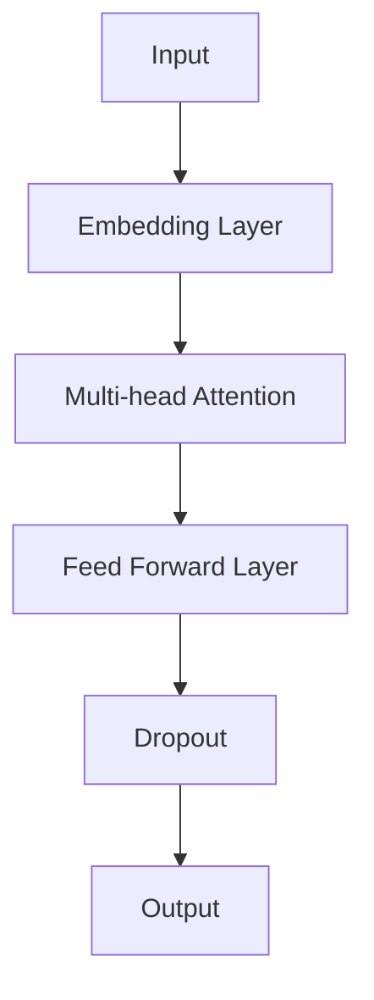

                 

关键词：人工智能，大模型，创业产品，开发，应用场景，未来展望

摘要：本文旨在探讨人工智能（AI）大模型在创业产品开发中的应用，分析其核心概念、算法原理、数学模型以及实践案例，并展望其在未来创业领域的发展趋势和面临的挑战。

## 1. 背景介绍

近年来，随着人工智能技术的飞速发展，大模型（Large Models）逐渐成为学术界和工业界的焦点。大模型通过海量数据训练，能够实现高度复杂的任务，如自然语言处理、图像识别、语音识别等。这些模型具有强大的学习能力和泛化能力，正在改变各个行业的游戏规则。

创业产品开发是一个高风险、高回报的过程。如何在有限的时间和资源内，快速开发出具有市场竞争力的产品，成为创业团队面临的重大挑战。大模型的出现，为创业产品开发提供了新的思路和工具。

本文将首先介绍大模型的核心概念和原理，然后探讨其在大模型应用中的具体步骤和操作，接着通过数学模型和具体案例进行分析，最后展望大模型在创业产品开发中的未来应用。

## 2. 核心概念与联系

### 2.1. 大模型定义

大模型是指那些规模庞大、参数数量众多的神经网络模型。它们通常通过深度学习技术训练，具有强大的学习和推理能力。根据模型规模的差异，大模型可以分为以下几类：

- 小模型：参数数量在数百万到数千万之间。
- 中等模型：参数数量在数千万到数亿之间。
- 大模型：参数数量在数十亿到数万亿之间。

### 2.2. 大模型原理

大模型的核心原理是基于神经网络的深度学习。神经网络由多个层次组成，每一层都包含大量的神经元。通过前向传播和反向传播算法，神经网络可以不断调整权重和偏置，从而优化模型性能。

大模型的训练过程通常涉及以下步骤：

1. 数据预处理：对输入数据进行归一化、标准化等处理，以便模型能够更好地学习。
2. 模型初始化：随机初始化模型参数。
3. 前向传播：将输入数据传递到模型中，计算输出结果。
4. 反向传播：计算损失函数，并通过梯度下降算法更新模型参数。
5. 重复步骤3和4，直到模型达到预定的性能指标。

### 2.3. 大模型架构

大模型的架构通常采用多层感知器（MLP）、卷积神经网络（CNN）和循环神经网络（RNN）等经典结构。近年来，Transformer结构由于其优异的性能和适应性，成为大模型的主流架构。

以下是Transformer结构的Mermaid流程图：



## 3. 核心算法原理 & 具体操作步骤

### 3.1. 算法原理概述

大模型的算法原理主要基于深度学习和神经网络。深度学习是一种机器学习技术，通过多层神经网络结构对数据进行建模，从而实现高层次的抽象和表示。神经网络则是一种模拟生物神经元的计算模型，通过调整权重和偏置，实现对输入数据的映射。

### 3.2. 算法步骤详解

1. **数据收集与预处理**：首先，收集大量与任务相关的数据，并进行预处理，如归一化、去噪等。

2. **模型设计**：根据任务需求，设计合适的神经网络结构。对于不同的任务，可以选择不同的神经网络类型，如卷积神经网络（CNN）适用于图像识别，循环神经网络（RNN）适用于序列数据。

3. **模型训练**：将预处理后的数据输入到模型中，通过前向传播计算输出结果，然后通过反向传播计算损失函数，并使用优化算法（如梯度下降）更新模型参数。

4. **模型评估**：在验证集上评估模型性能，根据评估结果调整模型参数。

5. **模型部署**：将训练好的模型部署到生产环境中，进行实际任务。

### 3.3. 算法优缺点

**优点**：

- 高效：大模型可以处理大规模数据，提高计算效率。
- 强泛化能力：大模型通过大量数据训练，能够适应各种不同的任务和数据集。
- 高精度：大模型在各个领域（如自然语言处理、图像识别、语音识别等）都取得了显著的性能提升。

**缺点**：

- 计算资源消耗大：大模型需要大量的计算资源和存储空间。
- 数据需求高：大模型的训练需要大量的标注数据，且数据的多样性、质量和数量对模型性能有很大影响。
- 难以解释：大模型的决策过程往往缺乏透明性，难以解释。

### 3.4. 算法应用领域

大模型在多个领域都取得了显著的成果，如：

- 自然语言处理：大模型在语言模型、机器翻译、文本生成等领域表现出色。
- 图像识别：大模型在图像分类、目标检测、图像生成等领域取得突破。
- 语音识别：大模型在语音识别、语音合成等领域实现高精度。
- 推荐系统：大模型在用户行为分析、商品推荐等领域具有优势。
- 游戏AI：大模型在游戏AI领域实现智能决策和自适应策略。

## 4. 数学模型和公式 & 详细讲解 & 举例说明

### 4.1. 数学模型构建

大模型的数学模型主要基于神经网络，包括输入层、隐藏层和输出层。以下是一个简单的神经网络模型：

$$
Y = f(Z) = \sigma(W \cdot X + b)
$$

其中，$X$是输入向量，$W$是权重矩阵，$b$是偏置向量，$f$是激活函数，通常使用Sigmoid或ReLU函数。

### 4.2. 公式推导过程

以ReLU激活函数为例，推导神经网络的前向传播和反向传播过程：

#### 前向传播

1. **输入层到隐藏层**：

$$
Z_{l} = W_{l} \cdot X + b_{l}
$$

$$
a_{l} = \max(0, Z_{l})
$$

2. **隐藏层到输出层**：

$$
Z_{L} = W_{L} \cdot a_{L} + b_{L}
$$

$$
Y = f(Z_{L}) = \sigma(W_{L} \cdot a_{L} + b_{L})
$$

#### 反向传播

1. **输出层到隐藏层**：

$$
\delta_{L} = (Y - \hat{Y}) \cdot f'(Z_{L})
$$

$$
\delta_{l} = (W_{L} \cdot \delta_{L}) \cdot f'(Z_{l})
$$

2. **隐藏层到输入层**：

$$
\delta_{0} = (W_{1} \cdot \delta_{1}) \cdot f'(Z_{0})
$$

### 4.3. 案例分析与讲解

以图像分类任务为例，分析大模型的数学模型和推导过程：

1. **输入层**：输入图像的像素值。
2. **隐藏层**：通过卷积神经网络提取图像特征。
3. **输出层**：通过全连接神经网络输出图像类别。

前向传播过程：

$$
Z_{l} = \sum_{k=1}^{K} W_{lk} \cdot C_{k} + b_{l}
$$

$$
a_{l} = \max(0, Z_{l})
$$

反向传播过程：

$$
\delta_{L} = (Y - \hat{Y}) \cdot \sigma'(Z_{L})
$$

$$
\delta_{l} = \sum_{k=1}^{K} W_{lk} \cdot \delta_{k} \cdot \sigma'(Z_{l})
$$

## 5. 项目实践：代码实例和详细解释说明

### 5.1. 开发环境搭建

1. 安装Python和pip。
2. 安装深度学习框架TensorFlow或PyTorch。
3. 安装图像处理库OpenCV。

### 5.2. 源代码详细实现

以下是一个简单的图像分类项目：

```python
import tensorflow as tf
from tensorflow.keras import layers

# 构建模型
model = tf.keras.Sequential([
    layers.Conv2D(32, (3, 3), activation='relu', input_shape=(28, 28, 1)),
    layers.MaxPooling2D((2, 2)),
    layers.Conv2D(64, (3, 3), activation='relu'),
    layers.MaxPooling2D((2, 2)),
    layers.Conv2D(64, (3, 3), activation='relu'),
    layers.Flatten(),
    layers.Dense(64, activation='relu'),
    layers.Dense(10, activation='softmax')
])

# 编译模型
model.compile(optimizer='adam',
              loss='categorical_crossentropy',
              metrics=['accuracy'])

# 加载数据集
(x_train, y_train), (x_test, y_test) = tf.keras.datasets.mnist.load_data()

# 预处理数据
x_train = x_train.astype('float32') / 255
x_test = x_test.astype('float32') / 255
x_train = x_train[..., tf.newaxis]
x_test = x_test[..., tf.newaxis]

# 训练模型
model.fit(x_train, y_train, epochs=5, batch_size=32)

# 评估模型
test_loss, test_acc = model.evaluate(x_test, y_test, verbose=2)
print(f'Test accuracy: {test_acc}')
```

### 5.3. 代码解读与分析

1. **模型构建**：使用TensorFlow的Sequential模型构建一个卷积神经网络，包括两个卷积层、两个池化层和一个全连接层。
2. **编译模型**：使用adam优化器和categorical_crossentropy损失函数编译模型。
3. **加载数据集**：加载MNIST手写数字数据集，并进行预处理。
4. **训练模型**：使用fit方法训练模型，设置训练轮数和批量大小。
5. **评估模型**：使用evaluate方法评估模型在测试集上的性能。

## 6. 实际应用场景

大模型在创业产品开发中的应用场景非常广泛，以下列举几个典型的应用：

- **智能客服**：使用大模型训练自然语言处理模型，实现智能客服机器人，提高客户服务质量。
- **推荐系统**：使用大模型分析用户行为数据，实现个性化推荐，提高用户体验和转化率。
- **图像识别**：使用大模型训练图像识别模型，实现自动驾驶、安防监控等应用。
- **语音识别**：使用大模型训练语音识别模型，实现智能语音助手、语音翻译等应用。
- **医疗健康**：使用大模型分析医疗数据，实现疾病预测、治疗方案推荐等应用。

## 7. 工具和资源推荐

### 7.1. 学习资源推荐

1. **《深度学习》**：Goodfellow、Bengio和Courville的深度学习经典教材。
2. **《Python深度学习》**：François Chollet的Python深度学习实战指南。
3. **TensorFlow官网**：TensorFlow官方文档和教程。
4. **PyTorch官网**：PyTorch官方文档和教程。

### 7.2. 开发工具推荐

1. **Jupyter Notebook**：用于编写和运行Python代码的交互式笔记本。
2. **Google Colab**：免费的Google云端运算平台，支持TensorFlow和PyTorch。
3. **AWS SageMaker**：亚马逊云服务提供的深度学习平台。

### 7.3. 相关论文推荐

1. **《Attention is All You Need》**：提出Transformer结构的经典论文。
2. **《BERT: Pre-training of Deep Bidirectional Transformers for Language Understanding》**：BERT模型的提出论文。
3. **《GPT-3: Language Models are Few-Shot Learners》**：GPT-3模型的提出论文。

## 8. 总结：未来发展趋势与挑战

### 8.1. 研究成果总结

大模型在多个领域取得了显著成果，如自然语言处理、图像识别、语音识别等。深度学习技术的发展，使得大模型的训练效率和性能不断提高。此外，分布式训练、优化算法等方面的研究也为大模型的发展提供了有力支持。

### 8.2. 未来发展趋势

1. **模型压缩**：随着模型规模的不断扩大，如何有效压缩模型体积、降低计算资源需求成为重要研究方向。
2. **自适应学习**：大模型在自适应学习和少样本学习方面具有巨大潜力，未来将在这些领域取得突破。
3. **跨模态学习**：大模型在处理多模态数据方面具有优势，未来将在跨模态学习方面取得更多成果。

### 8.3. 面临的挑战

1. **计算资源消耗**：大模型的训练需要大量的计算资源和存储空间，如何有效利用资源成为挑战。
2. **数据质量**：大模型的训练依赖于大量高质量的数据，数据质量和多样性对模型性能有很大影响。
3. **可解释性**：大模型的决策过程往往缺乏透明性，如何提高模型的可解释性成为重要课题。

### 8.4. 研究展望

大模型在创业产品开发中的应用前景广阔。未来，随着技术的不断进步，大模型将在更多领域发挥作用，推动创业产品的发展。同时，如何克服面临的挑战，实现大模型的高效、安全、透明应用，将成为研究的重要方向。

## 9. 附录：常见问题与解答

### 9.1. 大模型需要多少数据才能训练？

大模型的训练数据量取决于任务和数据集的复杂性。一般来说，大模型需要至少数百万条样本的数据进行训练，才能取得良好的性能。对于一些特殊的任务，如图像识别，可能需要数千万甚至数亿条样本。

### 9.2. 大模型为什么需要大量数据？

大模型需要大量数据是因为深度学习中的“数据优势”（Data Advantage）效应。大量数据有助于模型学习到更多的模式和特征，从而提高模型的泛化能力和性能。

### 9.3. 大模型的训练过程如何优化？

优化大模型的训练过程可以从以下几个方面入手：

1. **数据预处理**：对数据进行归一化、标准化等预处理，提高模型学习效率。
2. **模型架构**：选择合适的模型架构，如Transformer结构，提高模型性能。
3. **优化算法**：选择合适的优化算法，如Adam、AdamW等，提高模型收敛速度。
4. **训练策略**：使用技巧如权重初始化、正则化、学习率调度等，提高模型性能。

----------------------------------------------------------------

以上就是关于《AI 大模型在创业产品开发中的应用探索》的技术博客文章。希望对您有所帮助！如有任何问题，请随时提问。作者：禅与计算机程序设计艺术 / Zen and the Art of Computer Programming。

