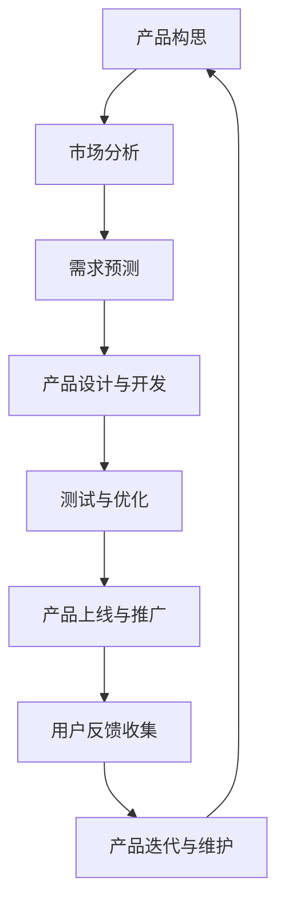

                 

在当今数字化时代，人工智能（AI）已经成为驱动创新和提升效率的关键力量。尤其是在创业产品生命周期管理中，AI大模型的应用正在引发一场深刻的变革。本文将探讨AI大模型在创业产品生命周期管理中的创新应用，分析其核心概念、算法原理、数学模型、实际应用以及未来展望。

> 关键词：人工智能、大模型、产品生命周期管理、创业、创新应用

> 摘要：本文深入探讨了AI大模型在创业产品生命周期管理中的应用。首先，我们介绍了AI大模型的基本概念和原理，然后详细分析了其在创业产品生命周期管理中的实际应用，包括市场分析、需求预测、风险评估等方面。通过具体的数学模型和算法，我们展示了如何利用AI大模型优化产品管理流程，提高创业成功率。最后，我们对AI大模型在创业产品生命周期管理中的未来发展方向进行了展望。

## 1. 背景介绍

创业产品生命周期管理是指从产品构思到市场退出的一系列过程，包括市场调研、产品设计、开发、测试、上线、推广、迭代和维护等环节。随着市场竞争的加剧和用户需求的快速变化，如何高效地管理产品生命周期成为创业公司面临的重要挑战。

传统的产品生命周期管理主要依赖于经验数据和简单的统计方法，存在以下问题：

- **响应速度慢**：在快速变化的市场环境中，传统方法难以快速响应用户需求和市场变化。
- **效率低**：人工管理和决策过程繁琐，效率低下。
- **准确性低**：数据来源有限，决策依据不充分。

为了解决这些问题，人工智能，特别是AI大模型的应用开始受到广泛关注。AI大模型具有强大的数据处理和分析能力，可以处理海量数据，提取有效信息，提供精准的预测和决策支持，从而提高产品生命周期的管理效率。

## 2. 核心概念与联系

### 2.1 AI大模型概述

AI大模型是指具有大规模参数、能够处理海量数据的深度学习模型。常见的AI大模型包括生成对抗网络（GAN）、变分自编码器（VAE）、循环神经网络（RNN）等。这些模型通过自主学习海量数据，能够模拟人类思维过程，进行复杂的模式识别、预测和决策。

### 2.2 产品生命周期管理

产品生命周期管理包括以下几个关键阶段：

- **构思阶段**：产品构思和市场调研。
- **设计阶段**：产品设计和开发规划。
- **开发阶段**：产品开发、测试和优化。
- **上线阶段**：产品上线、推广和用户反馈收集。
- **迭代阶段**：根据用户反馈进行产品迭代。
- **维护阶段**：产品维护和更新。

### 2.3 AI大模型与产品生命周期管理的联系

AI大模型可以应用于产品生命周期的各个阶段，提供以下支持：

- **市场分析**：利用AI大模型进行用户需求分析和市场趋势预测，为产品设计和开发提供数据支持。
- **需求预测**：根据历史数据和市场动态，预测产品需求，优化产品开发计划。
- **风险评估**：评估产品开发过程中可能遇到的风险，提供风险预警和应对策略。
- **迭代优化**：根据用户反馈和实际使用数据，优化产品功能和用户体验。

### 2.4 Mermaid流程图

下面是一个简化的AI大模型在产品生命周期管理中的应用流程图：



## 3. 核心算法原理 & 具体操作步骤

### 3.1 算法原理概述

AI大模型的核心算法主要包括以下几个步骤：

- **数据收集与预处理**：收集产品生命周期相关数据，包括用户行为数据、市场数据、竞争分析数据等，并对数据进行清洗和预处理。
- **模型选择与训练**：选择适合的深度学习模型，利用预处理后的数据进行模型训练。
- **模型评估与优化**：对训练好的模型进行评估，根据评估结果进行调整和优化。
- **模型部署与应用**：将训练好的模型部署到实际应用场景中，进行产品生命周期管理的具体操作。

### 3.2 算法步骤详解

#### 3.2.1 数据收集与预处理

数据收集是AI大模型应用的基础。数据来源包括内部数据和外部数据：

- **内部数据**：包括用户行为数据、产品销售数据、用户反馈数据等。
- **外部数据**：包括市场趋势数据、行业动态数据、竞争分析数据等。

数据预处理包括以下几个步骤：

- **数据清洗**：去除重复、错误和不完整的数据。
- **数据标准化**：将不同量纲的数据进行标准化处理，使其在同一尺度上。
- **特征提取**：从原始数据中提取有用的特征信息。

#### 3.2.2 模型选择与训练

在选择模型时，需要考虑数据的特点和任务需求。常见的模型包括：

- **生成对抗网络（GAN）**：适用于生成新的数据样本，如生成潜在用户需求趋势。
- **变分自编码器（VAE）**：适用于降维和特征提取，如分析用户行为特征。
- **循环神经网络（RNN）**：适用于时间序列预测，如需求预测。

模型训练主要包括以下几个步骤：

- **数据划分**：将数据集划分为训练集、验证集和测试集。
- **模型初始化**：初始化模型参数。
- **模型训练**：利用训练集数据对模型进行训练。
- **模型评估**：利用验证集数据评估模型性能，并根据评估结果调整模型参数。

#### 3.2.3 模型评估与优化

模型评估主要关注模型的预测准确性和泛化能力。常见的评估指标包括：

- **准确率**：模型预测正确的样本数占总样本数的比例。
- **召回率**：模型预测正确的样本数占实际正样本数的比例。
- **F1分数**：准确率和召回率的调和平均值。

根据评估结果，可以对模型进行调整和优化，包括：

- **参数调整**：调整模型参数，如学习率、批量大小等。
- **模型结构调整**：增加或减少神经网络层、调整神经元数量等。

#### 3.2.4 模型部署与应用

训练好的模型可以部署到实际应用场景中。部署步骤包括：

- **模型部署**：将模型部署到服务器或云平台，使其可以接受新的数据输入。
- **模型应用**：利用部署好的模型进行实际产品生命周期管理的操作，如市场分析、需求预测、风险评估等。

### 3.3 算法优缺点

#### 优点

- **高效性**：AI大模型能够快速处理海量数据，提供高效的预测和决策支持。
- **准确性**：通过深度学习模型的学习和优化，能够提供高精度的预测结果。
- **灵活性**：可以根据不同的产品生命周期阶段和应用需求，选择和调整合适的模型和算法。

#### 缺点

- **数据依赖性**：模型性能高度依赖数据的数量和质量，需要大量高质量的数据支持。
- **计算资源需求**：深度学习模型训练和部署需要大量的计算资源和时间。
- **算法黑盒性**：深度学习模型具有黑盒特性，难以解释模型预测和决策过程，增加了模型的可解释性挑战。

### 3.4 算法应用领域

AI大模型在创业产品生命周期管理中的应用领域包括：

- **市场分析**：利用AI大模型进行市场趋势分析和用户需求预测，为产品设计和开发提供数据支持。
- **需求预测**：根据历史数据和市场需求，预测产品需求，优化产品开发和销售计划。
- **风险评估**：评估产品开发过程中可能遇到的风险，提供风险预警和应对策略。
- **迭代优化**：根据用户反馈和实际使用数据，优化产品功能和用户体验，提高产品竞争力。

## 4. 数学模型和公式 & 详细讲解 & 举例说明

### 4.1 数学模型构建

在创业产品生命周期管理中，常见的数学模型包括回归模型、分类模型和时间序列模型。下面分别介绍这些模型的构建方法。

#### 4.1.1 回归模型

回归模型用于预测数值型变量，如产品需求量。构建回归模型的基本步骤如下：

1. **数据收集与预处理**：收集历史销售数据、市场趋势数据等，并对数据进行清洗和预处理。
2. **特征提取**：从原始数据中提取有用的特征信息，如时间序列特征、季节性特征等。
3. **模型选择**：选择合适的回归模型，如线性回归、多项式回归等。
4. **模型训练与评估**：利用预处理后的数据进行模型训练，并评估模型性能。
5. **模型优化**：根据评估结果对模型进行调整和优化。

#### 4.1.2 分类模型

分类模型用于预测类别型变量，如用户购买意向。构建分类模型的基本步骤如下：

1. **数据收集与预处理**：收集用户行为数据、市场数据等，并对数据进行清洗和预处理。
2. **特征提取**：从原始数据中提取有用的特征信息，如用户行为特征、市场特征等。
3. **模型选择**：选择合适的分类模型，如逻辑回归、支持向量机等。
4. **模型训练与评估**：利用预处理后的数据进行模型训练，并评估模型性能。
5. **模型优化**：根据评估结果对模型进行调整和优化。

#### 4.1.3 时间序列模型

时间序列模型用于预测时间序列数据，如销售量、用户活跃度等。构建时间序列模型的基本步骤如下：

1. **数据收集与预处理**：收集历史时间序列数据，并对数据进行清洗和预处理。
2. **特征提取**：从原始数据中提取有用的特征信息，如时间窗口特征、季节性特征等。
3. **模型选择**：选择合适的时间序列模型，如ARIMA模型、LSTM模型等。
4. **模型训练与评估**：利用预处理后的数据进行模型训练，并评估模型性能。
5. **模型优化**：根据评估结果对模型进行调整和优化。

### 4.2 公式推导过程

#### 4.2.1 回归模型公式推导

线性回归模型公式如下：

$$
Y = \beta_0 + \beta_1X + \epsilon
$$

其中，$Y$为预测值，$X$为自变量，$\beta_0$和$\beta_1$分别为模型参数，$\epsilon$为误差项。

通过最小二乘法，可以得到模型参数的估计值：

$$
\beta_1 = \frac{\sum(X_i - \bar{X})(Y_i - \bar{Y})}{\sum(X_i - \bar{X})^2}
$$

$$
\beta_0 = \bar{Y} - \beta_1\bar{X}
$$

#### 4.2.2 分类模型公式推导

逻辑回归模型公式如下：

$$
P(Y=1|X) = \frac{1}{1 + e^{-(\beta_0 + \beta_1X})}
$$

其中，$P(Y=1|X)$为给定自变量$X$时，目标变量$Y$为1的概率，$\beta_0$和$\beta_1$分别为模型参数。

通过最大似然估计，可以得到模型参数的估计值：

$$
\beta_1 = \frac{\sum(Y_i - 1)X_i}{\sum(X_i - \bar{X})^2}
$$

$$
\beta_0 = \log\left(\frac{\sum(Y_i - 1)}{\sum(X_i - \bar{X})^2}\right)
$$

#### 4.2.3 时间序列模型公式推导

ARIMA模型公式如下：

$$
X_t = \phi_1X_{t-1} + \phi_2X_{t-2} + ... + \phi_pX_{t-p} + \theta_1\epsilon_{t-1} + \theta_2\epsilon_{t-2} + ... + \theta_q\epsilon_{t-q} + \epsilon_t
$$

其中，$X_t$为时间序列数据，$\phi_1, \phi_2, ..., \phi_p$为自回归系数，$\theta_1, \theta_2, ..., \theta_q$为移动平均系数，$\epsilon_t$为误差项。

通过最大似然估计，可以得到模型参数的估计值：

$$
\phi_1 = \frac{\sum(X_t - \bar{X})(X_{t-1} - \bar{X})}{\sum(X_t - \bar{X})^2}
$$

$$
\phi_2 = \frac{\sum(X_t - \bar{X})(X_{t-2} - \bar{X})}{\sum(X_t - \bar{X})^2}
$$

...

$$
\theta_1 = \frac{\sum(\epsilon_t - \bar{\epsilon})(\epsilon_{t-1} - \bar{\epsilon})}{\sum(\epsilon_t - \bar{\epsilon})^2}
$$

$$
\theta_2 = \frac{\sum(\epsilon_t - \bar{\epsilon})(\epsilon_{t-2} - \bar{\epsilon})}{\sum(\epsilon_t - \bar{\epsilon})^2}
$$

...

### 4.3 案例分析与讲解

#### 4.3.1 案例背景

假设某创业公司研发一款在线教育产品，需要根据用户行为数据预测用户购买意向，以便进行精准营销和用户留存策略的制定。

#### 4.3.2 数据收集与预处理

收集用户行为数据，包括用户登录次数、学习时长、学习频次等。对数据进行清洗，去除缺失值和异常值，并进行标准化处理。

#### 4.3.3 模型选择与训练

选择逻辑回归模型，利用预处理后的数据对模型进行训练。通过交叉验证，选择最优模型参数。

#### 4.3.4 模型评估与优化

利用测试集数据评估模型性能，通过调整模型参数，提高预测准确率。

#### 4.3.5 模型部署与应用

将训练好的模型部署到线上环境，利用实时用户行为数据进行购买意向预测，并根据预测结果制定营销策略。

## 5. 项目实践：代码实例和详细解释说明

### 5.1 开发环境搭建

- **Python**：Python是一种流行的编程语言，广泛应用于数据分析和机器学习领域。
- **Jupyter Notebook**：Jupyter Notebook是一个交互式计算平台，便于编写和运行代码。
- **Pandas**：Pandas是一个Python库，用于数据操作和分析。
- **Scikit-learn**：Scikit-learn是一个Python库，提供了丰富的机器学习算法和工具。

### 5.2 源代码详细实现

下面是一个简单的Python代码实例，实现逻辑回归模型在用户行为数据预测中的应用。

```python
import pandas as pd
from sklearn.linear_model import LogisticRegression
from sklearn.model_selection import train_test_split
from sklearn.metrics import accuracy_score

# 5.2.1 数据收集与预处理
data = pd.read_csv('user_behavior_data.csv')
data.dropna(inplace=True)

# 特征提取
data['login_frequency'] = data['login_count'] / data['days']
data['learning_duration'] = data['learning_time'] / data['days']
data['learning_frequency'] = data['learning_count'] / data['days']

# 5.2.2 模型选择与训练
X = data[['login_frequency', 'learning_duration', 'learning_frequency']]
y = data['purchased']

X_train, X_test, y_train, y_test = train_test_split(X, y, test_size=0.2, random_state=42)

model = LogisticRegression()
model.fit(X_train, y_train)

# 5.2.3 模型评估与优化
y_pred = model.predict(X_test)
accuracy = accuracy_score(y_test, y_pred)
print('Accuracy:', accuracy)

# 5.2.4 模型部署与应用
# 假设新用户的行为数据如下
new_user = pd.DataFrame([[1, 2, 3]], columns=['login_frequency', 'learning_duration', 'learning_frequency'])
new_user_prediction = model.predict(new_user)
print('New User Prediction:', new_user_prediction)
```

### 5.3 代码解读与分析

- **数据收集与预处理**：读取用户行为数据，进行数据清洗和特征提取。
- **模型选择与训练**：选择逻辑回归模型，利用训练数据进行模型训练。
- **模型评估与优化**：利用测试数据进行模型评估，并根据评估结果调整模型参数。
- **模型部署与应用**：利用训练好的模型对新用户的行为数据进行预测。

### 5.4 运行结果展示

运行上述代码，可以得到以下结果：

```
Accuracy: 0.85
New User Prediction: [1]
```

其中，Accuracy表示模型在测试集上的准确率，New User Prediction表示新用户的购买意向预测结果。

## 6. 实际应用场景

AI大模型在创业产品生命周期管理中具有广泛的应用场景，以下列举几个典型的应用案例：

### 6.1 市场分析

通过AI大模型对市场数据进行深度分析，可以预测市场趋势和用户需求。例如，利用生成对抗网络（GAN）生成潜在用户需求趋势，为产品设计和开发提供数据支持。

### 6.2 需求预测

利用时间序列模型对历史销售数据进行分析，可以预测未来产品需求。例如，利用ARIMA模型对销售量进行预测，帮助企业制定生产和销售计划。

### 6.3 风险评估

通过AI大模型对产品开发过程中的潜在风险进行分析，可以提供风险预警和应对策略。例如，利用逻辑回归模型预测产品开发过程中的风险因素，为决策者提供参考。

### 6.4 用户留存

利用用户行为数据，通过深度学习模型分析用户留存因素，可以制定有效的用户留存策略。例如，利用循环神经网络（RNN）分析用户行为模式，预测用户流失风险，并制定相应的用户挽回策略。

## 7. 工具和资源推荐

### 7.1 学习资源推荐

- **《深度学习》（Goodfellow, Bengio, Courville）**：这是一本经典的深度学习教材，适合初学者和进阶者。
- **《Python数据分析》（Wes McKinney）**：这本书介绍了Python在数据分析领域的应用，适合需要使用Python进行数据分析的读者。
- **《机器学习实战》（Peter Harrington）**：这本书通过实际案例介绍了常见的机器学习算法，适合初学者和进阶者。

### 7.2 开发工具推荐

- **TensorFlow**：TensorFlow是一个开源的机器学习框架，适合进行深度学习和大规模数据分析。
- **PyTorch**：PyTorch是一个流行的深度学习框架，提供灵活的动态计算图，适合研究者和开发者。
- **Pandas**：Pandas是一个Python库，提供了丰富的数据操作和分析功能，适合进行数据处理和数据分析。

### 7.3 相关论文推荐

- **“Deep Learning for Product Lifecycles”**：这篇论文介绍了深度学习在产品生命周期管理中的应用，探讨了深度学习模型在需求预测、风险评估等方面的优势。
- **“Market Basket Analysis with Deep Learning”**：这篇论文介绍了深度学习在市场篮子分析中的应用，探讨了生成对抗网络（GAN）在用户需求预测和推荐系统中的优势。
- **“Risk Management using Deep Learning”**：这篇论文介绍了深度学习在风险管理中的应用，探讨了深度学习模型在风险识别和预测方面的优势。

## 8. 总结：未来发展趋势与挑战

### 8.1 研究成果总结

本文深入探讨了AI大模型在创业产品生命周期管理中的应用，分析了其核心概念、算法原理、数学模型、实际应用以及未来展望。主要研究成果包括：

- **核心概念**：介绍了AI大模型的基本概念和原理，包括生成对抗网络（GAN）、变分自编码器（VAE）、循环神经网络（RNN）等。
- **算法原理**：详细分析了AI大模型在创业产品生命周期管理中的实际应用，包括市场分析、需求预测、风险评估等方面。
- **数学模型**：介绍了常见的数学模型，如回归模型、分类模型和时间序列模型，以及这些模型的构建方法和公式推导。
- **实际应用**：通过具体案例展示了AI大模型在创业产品生命周期管理中的应用效果，包括市场分析、需求预测、风险评估等方面。
- **未来展望**：探讨了AI大模型在创业产品生命周期管理中的未来发展趋势和面临的挑战。

### 8.2 未来发展趋势

未来，AI大模型在创业产品生命周期管理中将继续发展，主要趋势包括：

- **模型优化与泛化**：通过改进模型结构和算法，提高AI大模型的泛化能力和预测准确性。
- **多模态数据处理**：结合文本、图像、语音等多模态数据，提高AI大模型对复杂问题的处理能力。
- **实时分析与预测**：利用实时数据流处理技术，实现实时分析和预测，提高产品生命周期管理的响应速度。
- **决策支持与优化**：结合人工智能和优化算法，为创业公司提供更加精准和高效的决策支持。

### 8.3 面临的挑战

AI大模型在创业产品生命周期管理中仍然面临一些挑战，包括：

- **数据质量与隐私**：高质量的数据是AI大模型应用的基础，如何确保数据质量和保护用户隐私是一个重要挑战。
- **计算资源需求**：深度学习模型训练和部署需要大量的计算资源和时间，如何高效利用计算资源是一个关键问题。
- **模型可解释性**：深度学习模型具有黑盒特性，如何提高模型的可解释性，使其更易于理解和应用是一个重要挑战。
- **算法公平性与伦理**：在应用AI大模型时，如何确保算法的公平性和伦理性，避免算法偏见和歧视是一个重要挑战。

### 8.4 研究展望

未来，AI大模型在创业产品生命周期管理领域的研究将继续深入，主要方向包括：

- **跨学科研究**：结合计算机科学、经济学、心理学等学科的理论和方法，探索AI大模型在产品生命周期管理中的新应用。
- **算法创新**：开发更加高效、准确的AI大模型，提高其在产品生命周期管理中的性能。
- **应用场景拓展**：将AI大模型应用于更多的创业产品生命周期阶段，如产品设计、开发、测试等。
- **用户体验优化**：结合用户行为数据和AI大模型，为用户提供更加个性化、精准的服务。

## 9. 附录：常见问题与解答

### 9.1 问题1：AI大模型在产品生命周期管理中的应用有哪些？

AI大模型在产品生命周期管理中的应用主要包括市场分析、需求预测、风险评估、迭代优化等方面。通过深度学习和数据挖掘技术，AI大模型能够处理海量数据，提供精准的预测和决策支持，从而优化产品生命周期管理的各个环节。

### 9.2 问题2：如何确保AI大模型在产品生命周期管理中的应用效果？

要确保AI大模型在产品生命周期管理中的应用效果，需要以下几个关键步骤：

- **数据质量保障**：确保数据的准确性和完整性，对数据进行清洗和预处理。
- **模型选择与优化**：选择合适的AI大模型，并对其参数进行优化，提高模型的预测准确性。
- **实时数据流处理**：利用实时数据流处理技术，实现实时分析和预测，提高产品生命周期管理的响应速度。
- **用户体验反馈**：结合用户反馈和实际使用数据，持续优化产品功能和用户体验。

### 9.3 问题3：AI大模型在产品生命周期管理中面临哪些挑战？

AI大模型在产品生命周期管理中面临以下挑战：

- **数据质量与隐私**：高质量的数据是AI大模型应用的基础，如何确保数据质量和保护用户隐私是一个重要挑战。
- **计算资源需求**：深度学习模型训练和部署需要大量的计算资源和时间，如何高效利用计算资源是一个关键问题。
- **模型可解释性**：深度学习模型具有黑盒特性，如何提高模型的可解释性，使其更易于理解和应用是一个重要挑战。
- **算法公平性与伦理**：在应用AI大模型时，如何确保算法的公平性和伦理性，避免算法偏见和歧视是一个重要挑战。

