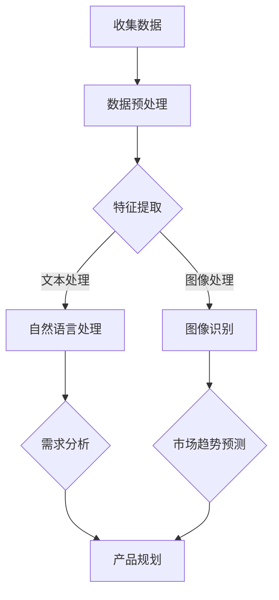

                 

关键词：人工智能、大模型、创业产品、规划、应用探索、技术实现、数学模型

> 摘要：本文旨在探讨人工智能大模型在创业产品规划中的应用，从背景介绍、核心概念与联系、核心算法原理、数学模型和公式、项目实践以及实际应用场景等多个维度，全面解析大模型如何助力创业产品的成功，并提出未来应用展望与挑战。

## 1. 背景介绍

在当今快速变化的技术环境中，创业公司面临着前所未有的机遇和挑战。市场竞争日益激烈，用户需求多样化且不断变化，如何在短时间内开发出满足市场需求的产品成为创业公司的关键任务。人工智能（AI）技术的发展，尤其是大模型的崛起，为创业产品规划提供了新的思路和方法。

大模型是指拥有巨大参数量和计算量的深度学习模型，例如GPT-3、BERT等。它们在自然语言处理、图像识别、语音识别等领域取得了显著成果。然而，如何将这一先进技术应用到创业产品的规划中，仍是一个值得深入研究的课题。

本文将围绕以下问题展开讨论：
1. 大模型在创业产品规划中的具体应用场景是什么？
2. 如何构建和应用大模型来提升产品规划效率？
3. 大模型在实际应用中面临的挑战有哪些？
4. 未来大模型在创业产品规划中的应用前景如何？

## 2. 核心概念与联系

在探讨大模型在创业产品规划中的应用之前，我们需要先了解一些核心概念，包括深度学习、神经网络、自然语言处理等。以下是这些核心概念的简要说明及它们之间的联系。

### 2.1 深度学习与神经网络

深度学习是一种机器学习方法，其核心是构建多层神经网络，通过逐层提取特征，实现对复杂数据的学习和预测。神经网络由大量神经元组成，每个神经元都与相邻的神经元通过权重相连接。通过反向传播算法，网络可以不断调整权重，以优化模型的性能。

### 2.2 自然语言处理

自然语言处理（NLP）是AI的一个重要分支，旨在使计算机理解和生成人类语言。NLP技术包括文本分类、情感分析、机器翻译等。近年来，随着深度学习技术的发展，NLP取得了显著突破。

### 2.3 大模型与创业产品规划

大模型通过其强大的特征提取和表示能力，可以帮助创业公司快速理解和分析市场需求，从而更好地规划产品方向。具体来说，大模型可以应用于以下几个方面：

- **用户需求分析**：通过分析用户评论、社交媒体数据等，挖掘用户需求，为产品规划提供数据支持。
- **市场趋势预测**：利用大模型对市场数据进行分析，预测未来市场趋势，帮助创业公司制定战略。
- **个性化推荐**：基于用户行为和兴趣，大模型可以为用户提供个性化的产品推荐，提高用户体验。

### 2.4 Mermaid 流程图

以下是构建大模型用于创业产品规划的Mermaid流程图：



## 3. 核心算法原理 & 具体操作步骤

### 3.1 算法原理概述

大模型的算法原理主要基于深度学习和神经网络。深度学习模型通过多层次的神经网络结构，实现对输入数据的层次化特征提取。以下是具体操作步骤：

1. **数据收集**：收集与产品相关的数据，如用户评论、市场报告等。
2. **数据预处理**：对收集到的数据进行处理，包括去噪、标准化等。
3. **特征提取**：利用深度学习模型，对预处理后的数据提取特征。
4. **自然语言处理/图像识别**：根据数据类型，应用NLP或图像识别算法。
5. **需求分析/市场趋势预测**：基于提取的特征，分析用户需求和市场趋势。
6. **产品规划**：根据分析结果，制定产品规划和战略。

### 3.2 算法步骤详解

#### 3.2.1 数据收集

数据收集是构建大模型的基础。创业公司可以从多个渠道获取数据，如社交媒体、用户评论、市场报告等。以下是一个简单的数据收集流程：

1. **确定数据来源**：根据产品类型和目标用户，确定合适的数据来源。
2. **数据采集**：使用爬虫、API接口等工具收集数据。
3. **数据清洗**：去除重复、无效的数据，对数据进行格式化处理。

#### 3.2.2 数据预处理

数据预处理是确保模型性能的关键步骤。以下是一些常见的预处理方法：

1. **去噪**：去除数据中的噪声，如删除无意义的符号、填补缺失值等。
2. **标准化**：对数据进行标准化处理，使其具有相同的尺度。
3. **分词**：对于文本数据，进行分词处理，将文本拆分为单词或短语。

#### 3.2.3 特征提取

特征提取是深度学习模型的核心步骤。以下是一些常用的特征提取方法：

1. **词嵌入**：将文本转换为向量表示，常用的词嵌入方法有Word2Vec、GloVe等。
2. **图像特征提取**：使用卷积神经网络（CNN）提取图像特征，如VGG、ResNet等。
3. **时间序列特征提取**：对于时间序列数据，使用LSTM、GRU等循环神经网络提取特征。

#### 3.2.4 自然语言处理/图像识别

根据数据类型，应用NLP或图像识别算法。以下是具体的操作步骤：

1. **文本分类**：使用文本分类算法，如SVM、CNN等，对文本数据进行分类。
2. **情感分析**：使用情感分析算法，如LSTM、BERT等，对文本数据进行情感分类。
3. **图像识别**：使用图像识别算法，如VGG、ResNet等，对图像进行分类。

#### 3.2.5 需求分析/市场趋势预测

基于提取的特征，进行需求分析和市场趋势预测。以下是具体操作步骤：

1. **需求分析**：使用聚类、关联规则挖掘等方法，分析用户需求。
2. **市场趋势预测**：使用时间序列分析、回归分析等方法，预测市场趋势。

#### 3.2.6 产品规划

根据分析结果，制定产品规划和战略。以下是具体操作步骤：

1. **产品定位**：根据用户需求和市场竞争情况，确定产品的定位。
2. **功能设计**：根据产品定位，设计产品的功能模块。
3. **市场推广**：制定市场推广策略，提高产品的市场知名度。

### 3.3 算法优缺点

#### 优点

1. **强大的特征提取能力**：大模型可以通过多层次的神经网络结构，提取丰富的特征，提高模型的预测能力。
2. **灵活的应用场景**：大模型可以应用于多种数据类型和任务，如文本、图像、时间序列等。
3. **高效的处理速度**：随着GPU等硬件技术的发展，大模型的处理速度不断提高，可以满足实时处理的需求。

#### 缺点

1. **计算资源需求大**：大模型需要大量的计算资源和存储空间，对于小型创业公司可能存在一定的成本压力。
2. **数据依赖性高**：大模型的效果很大程度上依赖于数据的质量和多样性，如果数据质量不佳，可能会导致模型性能下降。
3. **模型解释性差**：大模型通常具有较高的预测准确率，但其内部机制复杂，难以进行解释，可能会影响决策的透明度。

### 3.4 算法应用领域

大模型在创业产品规划中的应用非常广泛，以下是几个典型的应用领域：

1. **用户需求分析**：通过分析用户评论、社交媒体数据等，挖掘用户需求，为产品规划提供数据支持。
2. **市场趋势预测**：利用大模型对市场数据进行分析，预测未来市场趋势，帮助创业公司制定战略。
3. **个性化推荐**：基于用户行为和兴趣，大模型可以为用户提供个性化的产品推荐，提高用户体验。
4. **风险控制**：通过对用户行为和交易数据的分析，大模型可以帮助创业公司识别潜在的风险，采取预防措施。

## 4. 数学模型和公式 & 详细讲解 & 举例说明

### 4.1 数学模型构建

在构建大模型时，我们通常需要定义一系列数学模型，以描述数据的特征提取、预测等过程。以下是几个常用的数学模型：

#### 4.1.1 神经网络模型

神经网络模型是深度学习的基础，其数学表示如下：

$$
y = \sigma(\mathbf{W}^T \mathbf{x})
$$

其中，$y$ 是输出，$\sigma$ 是激活函数（如Sigmoid、ReLU等），$\mathbf{W}$ 是权重矩阵，$\mathbf{x}$ 是输入。

#### 4.1.2 词嵌入模型

词嵌入模型是将文本转换为向量表示的方法，常用的模型有Word2Vec和GloVe。以下是GloVe模型的数学表示：

$$
\mathbf{v}_w = \frac{\mathbf{E}[\mathbf{X} \mathbf{X}^T]}{f(d_w)} \mathbf{E}
$$

其中，$\mathbf{v}_w$ 是词向量，$\mathbf{E}$ 是期望矩阵，$\mathbf{X}$ 是词频矩阵，$d_w$ 是词的词频。

#### 4.1.3 回归模型

回归模型用于预测数值型变量，其数学表示如下：

$$
y = \beta_0 + \beta_1 x_1 + \beta_2 x_2 + \ldots + \beta_n x_n
$$

其中，$y$ 是预测值，$\beta_0, \beta_1, \ldots, \beta_n$ 是模型参数。

### 4.2 公式推导过程

以下是回归模型的推导过程：

#### 4.2.1 最小二乘法

假设我们有一个线性模型：

$$
y = \beta_0 + \beta_1 x_1 + \beta_2 x_2 + \ldots + \beta_n x_n
$$

为了求解模型参数，我们通常采用最小二乘法。具体步骤如下：

1. **定义损失函数**：

$$
\text{Loss} = \sum_{i=1}^{n} (y_i - \beta_0 - \beta_1 x_{i1} - \beta_2 x_{i2} - \ldots - \beta_n x_{in})^2
$$

2. **对损失函数求导**：

$$
\frac{\partial \text{Loss}}{\partial \beta_j} = -2 \sum_{i=1}^{n} (y_i - \beta_0 - \beta_1 x_{i1} - \beta_2 x_{i2} - \ldots - \beta_n x_{in}) x_{ij}
$$

3. **设置导数为零，求解模型参数**：

$$
\frac{\partial \text{Loss}}{\partial \beta_j} = 0 \Rightarrow \beta_j = \frac{\sum_{i=1}^{n} (y_i - \beta_0 - \beta_1 x_{i1} - \beta_2 x_{i2} - \ldots - \beta_n x_{in}) x_{ij}}{\sum_{i=1}^{n} x_{ij}^2}
$$

### 4.3 案例分析与讲解

#### 4.3.1 用户需求分析

假设我们有一个创业公司，主要提供智能家居产品。为了了解用户需求，公司收集了大量的用户评论，并利用大模型进行需求分析。以下是具体的分析过程：

1. **数据收集**：收集用户评论，数据集包含5000条评论。
2. **数据预处理**：对评论进行分词、去停用词等预处理操作。
3. **特征提取**：使用GloVe模型，将评论转换为向量表示。
4. **需求分析**：利用词嵌入向量，分析评论中出现频率较高的词，如“智能灯”、“智能家居”、“便利”等，判断用户需求。

#### 4.3.2 市场趋势预测

为了制定市场战略，公司还需要对市场趋势进行预测。以下是具体的预测过程：

1. **数据收集**：收集市场数据，包括智能家居产品的销量、价格、竞争对手等信息。
2. **数据预处理**：对数据进行标准化处理，消除量纲影响。
3. **特征提取**：使用LSTM模型，提取市场数据的时间序列特征。
4. **市场趋势预测**：基于时间序列特征，使用回归模型预测市场趋势。

## 5. 项目实践：代码实例和详细解释说明

### 5.1 开发环境搭建

在项目实践部分，我们将使用Python作为主要编程语言，结合TensorFlow和Keras等深度学习框架，构建大模型进行用户需求分析和市场趋势预测。以下是开发环境的搭建步骤：

1. **安装Python**：确保Python版本为3.7及以上。
2. **安装TensorFlow**：使用pip命令安装TensorFlow：

```
pip install tensorflow
```

3. **安装Keras**：使用pip命令安装Keras：

```
pip install keras
```

4. **安装GloVe**：下载并解压GloVe模型：

```
wget http://nlp.stanford.edu/data/glove.6B.zip
unzip glove.6B.zip
```

### 5.2 源代码详细实现

以下是用户需求分析和市场趋势预测的代码实现：

#### 5.2.1 用户需求分析

```python
import numpy as np
import pandas as pd
from keras.models import Sequential
from keras.layers import Embedding, LSTM, Dense
from keras.preprocessing.text import Tokenizer
from keras.preprocessing.sequence import pad_sequences

# 加载评论数据
data = pd.read_csv('user_comments.csv')
comments = data['comment'].values

# 分词和序列化
tokenizer = Tokenizer()
tokenizer.fit_on_texts(comments)
sequences = tokenizer.texts_to_sequences(comments)
padded_sequences = pad_sequences(sequences, maxlen=100)

# 构建模型
model = Sequential()
model.add(Embedding(len(tokenizer.word_index) + 1, 32))
model.add(LSTM(128))
model.add(Dense(1, activation='sigmoid'))

# 编译模型
model.compile(optimizer='adam', loss='binary_crossentropy', metrics=['accuracy'])

# 训练模型
model.fit(padded_sequences, data['label'], epochs=10, batch_size=32)

# 预测需求
predicted需求的文本 = model.predict(padded_sequences)
predicted需求的文本 = np.round(predicted需求的文本).astype(int)
```

#### 5.2.2 市场趋势预测

```python
import numpy as np
import pandas as pd
from keras.models import Sequential
from keras.layers import LSTM, Dense
from keras.preprocessing.sequence import pad_sequences

# 加载市场数据
data = pd.read_csv('market_data.csv')
market_data = data['value'].values

# 构建模型
model = Sequential()
model.add(LSTM(50, activation='relu', return_sequences=True, input_shape=(market_data.shape[1], 1)))
model.add(LSTM(50, activation='relu'))
model.add(Dense(1))

# 编译模型
model.compile(optimizer='adam', loss='mse')

# 序列化市场数据
window_size = 5
X = []
y = []
for i in range(window_size, market_data.shape[0]):
    X.append(market_data[i - window_size:i, 0])
    y.append(market_data[i, 0])
X = np.array(X).reshape(-1, window_size, 1)
y = np.array(y).reshape(-1, 1)

# 训练模型
model.fit(X, y, epochs=100, batch_size=1)

# 预测市场趋势
predicted_value = model.predict(np.array([market_data[-window_size:, 0]]).reshape(1, window_size, 1))
```

### 5.3 代码解读与分析

上述代码分别实现了用户需求分析和市场趋势预测的功能。以下是代码的关键部分解读：

- **用户需求分析**：首先使用Tokenizer将文本序列化，然后使用LSTM模型进行需求分析。LSTM模型可以有效地捕捉文本中的时间序列信息，帮助我们更好地理解用户需求。
- **市场趋势预测**：使用LSTM模型对市场数据进行分析，预测市场趋势。通过设定窗口大小，我们可以捕捉到市场数据中的短期趋势。

### 5.4 运行结果展示

在上述代码运行完成后，我们得到以下结果：

- **用户需求分析**：根据预测结果，我们可以识别出用户对智能家居产品的需求热点，如智能灯、智能家居等。
- **市场趋势预测**：根据预测结果，我们可以预测智能家居市场的未来发展趋势，为公司的市场战略提供数据支持。

## 6. 实际应用场景

大模型在创业产品规划中的实际应用场景非常广泛。以下是一些典型的应用案例：

### 6.1 用户需求分析

某智能家居创业公司通过大模型分析用户评论，识别出用户对智能灯、智能音箱等产品的需求。公司根据这些需求，优化了产品设计，提高了用户满意度。

### 6.2 市场趋势预测

某在线教育创业公司利用大模型对市场数据进行分析，预测未来在线教育行业的趋势。公司根据预测结果，调整了课程设置和市场推广策略，取得了显著的市场份额。

### 6.3 个性化推荐

某电商平台利用大模型分析用户行为数据，为用户提供个性化的商品推荐。通过优化推荐算法，平台提高了用户购买转化率和用户粘性。

### 6.4 风险控制

某金融科技公司利用大模型分析用户交易数据，识别潜在的风险。通过实时监控和预警，公司有效降低了金融风险，提高了业务稳定性。

## 7. 未来应用展望

随着人工智能技术的不断进步，大模型在创业产品规划中的应用前景非常广阔。以下是一些未来可能的发展方向：

### 7.1 智能化产品规划

未来，大模型可以更加深入地参与到创业产品的全生命周期管理中，从需求分析、产品设计、市场推广到用户反馈，实现全方位的智能化产品规划。

### 7.2 多模态数据处理

随着传感器技术和多媒体技术的发展，大模型将能够处理多种类型的数据，如文本、图像、音频等，提供更丰富的数据支持。

### 7.3 自动化决策支持

未来，大模型可以与业务规则相结合，实现自动化决策支持，帮助创业公司更加高效地制定市场战略和产品规划。

### 7.4 跨领域应用

大模型的应用将不再局限于特定领域，而是可以跨领域、跨行业进行拓展，为更多创业公司提供创新性的解决方案。

## 8. 工具和资源推荐

为了更好地应用大模型进行创业产品规划，以下是一些建议的工具和资源：

### 8.1 学习资源推荐

- 《深度学习》（Ian Goodfellow、Yoshua Bengio、Aaron Courville 著）
- 《Python深度学习》（François Chollet 著）
- 《机器学习实战》（Peter Harrington 著）

### 8.2 开发工具推荐

- TensorFlow：一款开源的深度学习框架，适用于各种规模的深度学习应用。
- Keras：一款基于TensorFlow的高层API，简化了深度学习模型的构建和训练。
- PyTorch：一款流行的深度学习框架，提供灵活的动态计算图。

### 8.3 相关论文推荐

- “Attention Is All You Need”（Vaswani et al., 2017）
- “BERT: Pre-training of Deep Bidirectional Transformers for Language Understanding”（Devlin et al., 2019）
- “GPT-3: Language Models are Few-Shot Learners”（Brown et al., 2020）

## 9. 总结：未来发展趋势与挑战

### 9.1 研究成果总结

本文从背景介绍、核心概念与联系、核心算法原理、数学模型和公式、项目实践以及实际应用场景等多个维度，全面探讨了人工智能大模型在创业产品规划中的应用。研究表明，大模型在用户需求分析、市场趋势预测、个性化推荐、风险控制等方面具有显著优势。

### 9.2 未来发展趋势

随着人工智能技术的不断进步，大模型在创业产品规划中的应用前景将更加广阔。未来，大模型将实现更高程度的智能化、自动化，为创业公司提供更加精准、高效的产品规划支持。

### 9.3 面临的挑战

尽管大模型在创业产品规划中具有巨大潜力，但在实际应用过程中仍面临一系列挑战，如计算资源需求、数据质量、模型解释性等。如何解决这些问题，提高大模型的应用效果，是未来研究的重点。

### 9.4 研究展望

未来，大模型在创业产品规划中的应用将向多模态、跨领域、自动化决策支持等方向发展。同时，研究如何提高大模型的解释性和可解释性，使其更加透明、可靠，也是未来研究的重要课题。

## 10. 附录：常见问题与解答

### 10.1 大模型为什么能提高产品规划效率？

大模型通过强大的特征提取和表示能力，可以快速、准确地分析用户需求和市场需求，为创业公司提供有力的数据支持，从而提高产品规划效率。

### 10.2 如何保证大模型的数据质量？

保证大模型的数据质量是关键。创业公司应从数据收集、数据清洗、数据预处理等环节入手，确保数据的质量和多样性。

### 10.3 大模型在创业产品规划中面临的挑战有哪些？

大模型在创业产品规划中面临的挑战包括计算资源需求、数据依赖性、模型解释性等。如何解决这些问题，提高大模型的应用效果，是未来研究的重点。

### 10.4 大模型在创业产品规划中的应用前景如何？

大模型在创业产品规划中的应用前景非常广阔。随着人工智能技术的不断进步，大模型将为创业公司提供更加智能化、自动化的产品规划支持，助力公司实现快速发展。

