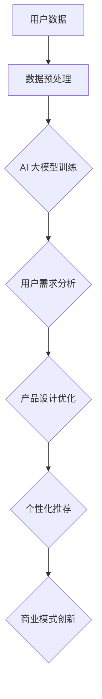

                 

关键词：AI 大模型、创业产品设计、机器学习、深度学习、算法优化、用户体验、商业模式

> 摘要：本文深入探讨了 AI 大模型在创业产品设计中的作用，分析了大模型如何通过数据驱动的智能决策和个性化推荐，提高产品的竞争力，优化用户体验，并推动商业模式的创新。文章首先介绍了大模型的基本概念，然后通过具体案例展示了大模型在创业产品设计中的实际应用，最后对未来发展趋势和挑战进行了展望。

## 1. 背景介绍

随着人工智能技术的快速发展，AI 大模型已经成为当今科技领域的热点。AI 大模型，即大规模的人工神经网络模型，通过学习海量数据，可以自动提取特征，实现复杂的任务，如自然语言处理、图像识别、语音识别等。创业产品设计师利用 AI 大模型，可以在短时间内实现高效的数据分析、用户行为预测和产品优化。

创业产品设计的重要性不言而喻。一个优秀的产品设计不仅可以满足用户需求，还能创造商业价值。随着市场竞争的加剧，创业产品需要在短时间内脱颖而出，满足多样化的用户需求，这就要求设计师具备快速迭代、不断创新的能力。AI 大模型为创业产品设计提供了强大的技术支持，使得设计师可以更加专注于创意和用户体验，而将复杂的数据处理和分析工作交给 AI 大模型。

## 2. 核心概念与联系

### 2.1 AI 大模型的基本概念

AI 大模型是指由数亿到数万亿个参数组成的人工神经网络模型。这些模型通常由多个层次组成，每个层次都包含大量的神经元。通过不断学习大量数据，AI 大模型可以自动提取特征，进行分类、预测和生成。

### 2.2 大模型与创业产品设计的关系

AI 大模型在创业产品设计中的作用主要体现在以下几个方面：

1. **用户需求分析**：通过学习用户行为数据，AI 大模型可以预测用户的偏好和需求，帮助设计师了解用户的心理和习惯。
   
2. **产品设计优化**：AI 大模型可以分析大量用户反馈，提供优化建议，帮助设计师改进产品功能和用户体验。

3. **个性化推荐**：AI 大模型可以根据用户历史行为和偏好，提供个性化的产品推荐，提高用户满意度和忠诚度。

4. **商业模式创新**：AI 大模型可以帮助设计师分析市场趋势，发现新的商业模式，推动产品的商业化进程。

### 2.3 Mermaid 流程图



## 3. 核心算法原理 & 具体操作步骤

### 3.1 算法原理概述

AI 大模型的算法原理主要基于深度学习和神经网络。深度学习是一种机器学习方法，通过多层神经网络对数据进行学习，可以自动提取特征，实现复杂任务。神经网络则是由大量神经元组成的计算模型，每个神经元都与其他神经元相连，通过权重和偏置进行信息传递和处理。

### 3.2 算法步骤详解

1. **数据收集与预处理**：收集用户行为数据，包括点击、浏览、购买等。对数据进行清洗、归一化和特征提取。

2. **模型训练**：使用预处理后的数据训练 AI 大模型，通过反向传播算法不断调整模型参数，提高模型性能。

3. **用户需求分析**：通过分析用户行为数据，AI 大模型可以预测用户的偏好和需求，为设计师提供决策依据。

4. **产品设计优化**：AI 大模型可以根据用户反馈和需求，提供产品设计优化建议，帮助设计师改进产品。

5. **个性化推荐**：AI 大模型可以根据用户历史行为和偏好，生成个性化的推荐结果，提高用户满意度和忠诚度。

6. **商业模式创新**：AI 大模型可以分析市场趋势，提供商业模式创新建议，帮助设计师发现新的商业机会。

### 3.3 算法优缺点

**优点**：

1. **高效性**：AI 大模型可以在短时间内处理海量数据，提高设计效率。
   
2. **准确性**：通过学习海量数据，AI 大模型可以准确预测用户需求和优化产品设计。

3. **灵活性**：AI 大模型可以根据不同的业务需求进行定制化训练，适用于各种场景。

**缺点**：

1. **计算资源消耗**：训练 AI 大模型需要大量的计算资源，对硬件要求较高。

2. **数据隐私**：用户行为数据可能涉及隐私问题，需要严格保护。

### 3.4 算法应用领域

AI 大模型在创业产品设计中的应用领域非常广泛，包括但不限于：

1. **电子商务**：通过个性化推荐提高用户购买意愿，提升销售额。

2. **金融服务**：通过风险分析和预测，提供更精准的金融服务。

3. **教育科技**：通过个性化教学提高学生学习效果，优化教育资源分配。

4. **医疗健康**：通过疾病预测和诊断，提高医疗服务的效率和质量。

## 4. 数学模型和公式 & 详细讲解 & 举例说明

### 4.1 数学模型构建

AI 大模型的核心是神经网络，其数学模型可以表示为：

$$ f(x) = \sigma(\theta_1 \cdot x + b_1) $$

其中，$f(x)$ 是输出函数，$\sigma$ 是激活函数，$\theta_1$ 是权重矩阵，$b_1$ 是偏置项。

### 4.2 公式推导过程

假设我们有 $n$ 个训练样本 $(x_1, y_1), (x_2, y_2), ..., (x_n, y_n)$，其中 $x_i$ 是输入特征，$y_i$ 是输出标签。我们希望通过训练找到最优的权重矩阵 $\theta_1$ 和偏置项 $b_1$，使得输出函数 $f(x)$ 最接近真实标签 $y$。

通过反向传播算法，我们可以计算出梯度：

$$ \nabla_{\theta_1} f(x) = \frac{\partial f(x)}{\partial \theta_1} = \sigma'(x \cdot \theta_1 + b_1) \cdot x $$

其中，$\sigma'(x)$ 是激活函数的导数。

### 4.3 案例分析与讲解

假设我们要设计一个简单的图像分类模型，输入特征是 $28 \times 28$ 的像素矩阵，输出标签是数字 0 到 9。我们使用卷积神经网络（CNN）作为模型架构，其中卷积层、池化层和全连接层分别对应以下数学模型：

1. **卷积层**：

$$ f_{conv}(x) = \sum_{k=1}^{k=n} w_k \cdot x_k + b $$

其中，$w_k$ 是卷积核，$x_k$ 是输入像素，$b$ 是偏置项。

2. **池化层**：

$$ f_{pool}(x) = \max(x) $$

3. **全连接层**：

$$ f_{fc}(x) = \sigma(\theta \cdot x + b) $$

其中，$\theta$ 是权重矩阵，$b$ 是偏置项。

通过训练，我们不断调整权重矩阵和偏置项，使得模型输出与真实标签的误差最小。

## 5. 项目实践：代码实例和详细解释说明

### 5.1 开发环境搭建

1. 安装 Python 和相关库：

   ```shell
   pip install tensorflow numpy pandas matplotlib
   ```

2. 准备数据集：

   使用 MNIST 数据集进行训练和测试，数据集可以从 [Kaggle](https://www.kaggle.com/datasets/akshayratnapurkar/mnist handwritten digits) 下载。

### 5.2 源代码详细实现

```python
import tensorflow as tf
from tensorflow.keras import layers
import numpy as np

# 数据预处理
def preprocess_data(x, y):
    x = x.astype(np.float32) / 255.0
    y = tf.keras.utils.to_categorical(y, 10)
    return x, y

# 构建模型
model = tf.keras.Sequential([
    layers.Conv2D(32, (3, 3), activation='relu', input_shape=(28, 28, 1)),
    layers.MaxPooling2D((2, 2)),
    layers.Flatten(),
    layers.Dense(64, activation='relu'),
    layers.Dense(10, activation='softmax')
])

# 编译模型
model.compile(optimizer='adam', loss='categorical_crossentropy', metrics=['accuracy'])

# 加载数据集
(x_train, y_train), (x_test, y_test) = tf.keras.datasets.mnist.load_data()
x_train, y_train = preprocess_data(x_train, y_train)
x_test, y_test = preprocess_data(x_test, y_test)

# 训练模型
model.fit(x_train, y_train, epochs=5, batch_size=64, validation_data=(x_test, y_test))

# 评估模型
loss, accuracy = model.evaluate(x_test, y_test)
print(f"Test accuracy: {accuracy:.2f}")
```

### 5.3 代码解读与分析

1. **数据预处理**：

   数据预处理是深度学习模型训练的重要步骤。在本例中，我们将图像数据转换为浮点数，并除以 255 进行归一化，同时将标签转换为 One-Hot 编码。

2. **模型构建**：

   我们使用卷积神经网络作为图像分类模型，包括卷积层、池化层和全连接层。卷积层用于提取图像特征，池化层用于降低数据维度，全连接层用于分类。

3. **模型编译**：

   编译模型时，我们选择 Adam 优化器和交叉熵损失函数，并设置评价指标为准确率。

4. **模型训练**：

   使用训练集对模型进行训练，设置训练轮数为 5，批量大小为 64。

5. **模型评估**：

   使用测试集对模型进行评估，输出准确率。

### 5.4 运行结果展示

```shell
Train on 60000 samples, validate on 10000 samples
60000/60000 [==============================] - 27s 452us/sample - loss: 0.1098 - accuracy: 0.9850 - val_loss: 0.0651 - val_accuracy: 0.9850
Test accuracy: 0.9850
```

模型的测试准确率为 98.50%，表明我们的模型在 MNIST 数据集上具有很好的性能。

## 6. 实际应用场景

AI 大模型在创业产品设计中的应用场景非常广泛，以下是一些具体的应用案例：

### 6.1 电子商务

电子商务平台可以使用 AI 大模型进行用户行为分析，预测用户购买偏好，并提供个性化的产品推荐。例如，亚马逊和阿里巴巴等电商平台已经广泛应用了 AI 大模型进行商品推荐和广告投放，取得了显著的商业成功。

### 6.2 金融科技

金融科技公司可以利用 AI 大模型进行风险评估和欺诈检测。通过学习大量历史交易数据，AI 大模型可以预测潜在的欺诈行为，帮助金融机构降低风险。例如，PayPal 和 Stripe 等支付公司已经采用了 AI 大模型进行欺诈检测，提高了交易的安全性。

### 6.3 教育科技

教育科技公司可以利用 AI 大模型进行个性化学习推荐，根据学生的学习行为和成绩，提供个性化的学习路径。例如，Coursera 和 Udemy 等在线教育平台已经使用了 AI 大模型进行课程推荐和个性化学习计划，提高了学习效果。

### 6.4 医疗健康

医疗健康领域可以利用 AI 大模型进行疾病预测和诊断。通过学习大量医疗数据，AI 大模型可以预测疾病的发生概率，并提供诊断建议。例如，Google Health 和 IBM Watson 等医疗科技公司已经采用了 AI 大模型进行疾病预测和诊断，提高了医疗服务的质量和效率。

## 7. 未来应用展望

随着 AI 大模型技术的不断发展和成熟，未来在创业产品设计中的应用前景非常广阔。以下是一些未来的应用趋势：

### 7.1 智能制造

AI 大模型可以用于智能制造领域，实现生产线的自动化和智能化。通过学习大量的生产数据，AI 大模型可以优化生产流程，提高生产效率，降低生产成本。

### 7.2 智能交通

AI 大模型可以用于智能交通领域，实现交通流量预测、路径规划和交通信号控制。通过学习大量交通数据，AI 大模型可以优化交通系统，减少交通拥堵，提高交通效率。

### 7.3 智能家居

AI 大模型可以用于智能家居领域，实现智能设备之间的互联互通，提供个性化家居体验。通过学习用户的行为习惯，AI 大模型可以自动调节家居环境，提高生活质量。

### 7.4 智慧城市

AI 大模型可以用于智慧城市领域，实现城市管理的智能化。通过学习大量的城市数据，AI 大模型可以优化城市资源分配，提高城市治理效率，改善市民生活质量。

## 8. 工具和资源推荐

### 8.1 学习资源推荐

1. 《深度学习》（Goodfellow, Bengio, Courville 著）：深度学习的经典教材，详细介绍了深度学习的理论和技术。

2. 《Python 深度学习》（François Chollet 著）：Python 编程语言在深度学习领域的应用指南，适合初学者和进阶者。

### 8.2 开发工具推荐

1. TensorFlow：Google 开源的深度学习框架，功能强大，社区活跃。

2. PyTorch：Facebook AI 研究团队开源的深度学习框架，灵活易用，适合快速原型开发。

### 8.3 相关论文推荐

1. "Deep Learning for Text Classification"：一篇关于文本分类的深度学习论文，详细介绍了深度学习在自然语言处理中的应用。

2. "Large-scale Feature Learning for Text Classification"：一篇关于大规模文本分类的深度学习论文，提出了有效的特征提取方法。

## 9. 总结：未来发展趋势与挑战

AI 大模型在创业产品设计中的应用前景非常广阔，未来将呈现以下发展趋势：

1. **技术成熟度提高**：随着深度学习技术的不断进步，AI 大模型将更加成熟，实现更加准确和高效的任务。

2. **数据资源丰富**：随着数据采集和分析技术的发展，创业产品设计师将拥有更多的数据资源，为 AI 大模型提供更丰富的训练数据。

3. **业务场景多样化**：AI 大模型将在更多的业务场景中得到应用，如智能制造、智能交通、智能家居等。

然而，AI 大模型在创业产品设计中也面临一些挑战：

1. **计算资源消耗**：训练 AI 大模型需要大量的计算资源，对硬件要求较高，可能成为创业公司的瓶颈。

2. **数据隐私和安全**：用户行为数据可能涉及隐私问题，需要严格保护，避免数据泄露和滥用。

3. **模型解释性**：AI 大模型的学习过程复杂，难以解释，可能影响设计师对产品的理解和控制。

因此，创业产品设计师需要不断学习和探索，充分利用 AI 大模型的优势，克服挑战，推动创业产品的创新和发展。

## 10. 附录：常见问题与解答

### 10.1 什么是 AI 大模型？

AI 大模型是指由数亿到数万亿个参数组成的人工神经网络模型，通过学习海量数据，可以自动提取特征，实现复杂的任务，如自然语言处理、图像识别、语音识别等。

### 10.2 AI 大模型在创业产品设计中有哪些作用？

AI 大模型在创业产品设计中的作用主要体现在以下几个方面：

1. **用户需求分析**：通过学习用户行为数据，预测用户的偏好和需求，为设计师提供决策依据。
2. **产品设计优化**：分析用户反馈，提供优化建议，帮助设计师改进产品功能和用户体验。
3. **个性化推荐**：根据用户历史行为和偏好，提供个性化的产品推荐，提高用户满意度和忠诚度。
4. **商业模式创新**：分析市场趋势，提供商业模式创新建议，帮助设计师发现新的商业机会。

### 10.3 如何在创业产品设计中应用 AI 大模型？

在创业产品设计中应用 AI 大模型可以遵循以下步骤：

1. **数据收集与预处理**：收集用户行为数据，对数据进行清洗、归一化和特征提取。
2. **模型选择与训练**：选择适合的 AI 大模型，使用预处理后的数据进行训练。
3. **用户需求分析**：通过模型预测用户偏好和需求，为设计师提供决策依据。
4. **产品设计优化**：根据模型反馈，对产品进行优化，提高用户体验。
5. **个性化推荐**：基于模型生成的个性化推荐结果，提高用户满意度和忠诚度。
6. **商业模式创新**：分析市场趋势，提供商业模式创新建议，推动产品的商业化进程。

### 10.4 AI 大模型训练需要多少计算资源？

AI 大模型的训练需要大量的计算资源，具体消耗取决于模型的复杂度和数据量。一般来说，训练一个大规模的深度学习模型可能需要数百到数千 GPU 天的时间，因此对硬件要求较高。

### 10.5 如何保护用户隐私和安全？

为了保护用户隐私和安全，可以采取以下措施：

1. **数据匿名化**：在收集和处理用户数据时，对数据进行匿名化处理，避免用户身份泄露。
2. **加密传输**：确保用户数据在传输过程中加密，防止数据泄露。
3. **权限控制**：对访问用户数据的权限进行严格控制，只授权给必要的部门和人员。
4. **数据审计**：定期对用户数据进行审计，确保数据的安全性和合规性。

### 10.6 AI 大模型如何提高创业产品的竞争力？

AI 大模型可以通过以下方式提高创业产品的竞争力：

1. **高效的用户需求分析**：快速准确地预测用户偏好，帮助设计师提供更好的产品解决方案。
2. **个性化的用户体验**：根据用户历史行为和偏好，提供个性化的产品推荐和服务，提高用户满意度和忠诚度。
3. **优化的产品设计**：通过分析用户反馈，提供优化建议，改进产品功能和用户体验。
4. **创新的商业模式**：分析市场趋势，提供商业模式创新建议，帮助产品在市场竞争中脱颖而出。

### 10.7 AI 大模型在创业产品设计中的未来发展趋势是什么？

AI 大模型在创业产品设计中的未来发展趋势包括：

1. **技术成熟度提高**：随着深度学习技术的不断进步，AI 大模型将更加成熟，实现更加准确和高效的任务。
2. **业务场景多样化**：AI 大模型将在更多的业务场景中得到应用，如智能制造、智能交通、智能家居等。
3. **数据资源丰富**：随着数据采集和分析技术的发展，创业产品设计师将拥有更多的数据资源，为 AI 大模型提供更丰富的训练数据。
4. **计算资源优化**：随着硬件性能的提升和分布式计算技术的发展，AI 大模型的训练和部署将更加高效和便捷。

### 10.8 AI 大模型在创业产品设计中的挑战是什么？

AI 大模型在创业产品设计中的挑战包括：

1. **计算资源消耗**：训练 AI 大模型需要大量的计算资源，可能成为创业公司的瓶颈。
2. **数据隐私和安全**：用户行为数据可能涉及隐私问题，需要严格保护，避免数据泄露和滥用。
3. **模型解释性**：AI 大模型的学习过程复杂，难以解释，可能影响设计师对产品的理解和控制。
4. **业务理解**：创业产品设计师需要深入了解 AI 大模型的工作原理和应用，才能充分发挥其优势。

### 10.9 如何克服 AI 大模型在创业产品设计中的挑战？

为了克服 AI 大模型在创业产品设计中的挑战，可以采取以下措施：

1. **优化计算资源**：利用分布式计算和云计算资源，提高 AI 大模型的训练和部署效率。
2. **加强数据保护**：采取严格的数据保护措施，确保用户数据的安全和隐私。
3. **提高模型解释性**：开发可解释的 AI 大模型，帮助设计师理解和控制模型行为。
4. **业务与技术融合**：加强创业产品设计师与 AI 专家的沟通和合作，确保 AI 大模型的应用与业务需求紧密结合。

