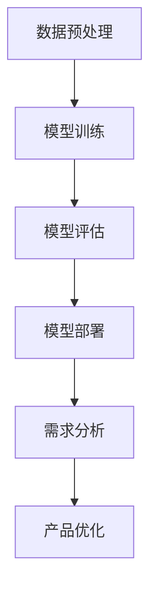

                 

关键词：人工智能，创业产品，需求分析，大模型，深度学习，数据分析，商业策略，应用场景

## 摘要

本文旨在探讨人工智能大模型在创业产品需求分析中的应用。通过分析当前市场趋势和技术发展，本文将阐述大模型在需求分析中的关键作用，包括数据获取、处理和洞察。我们将深入探讨大模型的算法原理，结合实际案例，展示如何利用大模型优化创业产品的开发过程。此外，本文还将讨论未来发展趋势和面临的挑战，为创业者提供有价值的参考。

## 1. 背景介绍

在当今快速变化的市场环境中，创业公司需要迅速适应并满足客户需求，以在竞争激烈的市场中立足。需求分析是产品开发的核心环节，它决定了产品能否满足用户期望，进而影响市场接受度和商业成功。然而，传统的需求分析方法往往依赖于人工调研和有限的数据资源，存在一定的滞后性和局限性。

近年来，人工智能（AI）特别是深度学习技术的飞速发展，为需求分析带来了新的契机。大模型，如大型神经网络和生成对抗网络（GANs），能够处理海量数据，自动提取特征，生成洞察，从而显著提升需求分析的效果和效率。这些大模型不仅在学术研究中取得了显著成果，也在实际应用中展示了强大的潜力。

本文将围绕以下几个方面展开讨论：

- 大模型在需求分析中的应用场景和优势。
- 大模型的基本原理和架构。
- 如何利用大模型进行需求分析的具体操作步骤。
- 大模型在需求分析中的优缺点及其应用领域。
- 实际项目中的大模型应用案例和代码实例。
- 未来发展趋势和面临的挑战。

## 2. 核心概念与联系

### 2.1. 大模型的基本概念

大模型通常指的是那些拥有数亿甚至千亿参数的神经网络模型。这些模型能够处理大规模数据集，通过多层神经元的非线性变换，自动提取数据中的复杂模式和特征。典型的例子包括Transformer架构的BERT模型、GPT系列模型和GANs。

### 2.2. 大模型的工作原理

大模型的工作原理主要基于深度学习的思想。深度学习通过多层神经网络对数据进行前向传播和反向传播，不断调整参数，以达到对数据的最佳拟合。大模型利用其庞大的参数量和复杂的网络结构，能够捕捉数据中的深层模式和规律。

### 2.3. 大模型的应用架构

大模型的应用架构通常包括数据预处理、模型训练、模型评估和模型部署等环节。数据预处理包括数据清洗、数据标注和数据增强等步骤。模型训练使用大量的训练数据，通过优化算法调整模型参数。模型评估通过验证集和测试集来评估模型的性能。模型部署则是将训练好的模型部署到生产环境中，供实际应用使用。

### 2.4. Mermaid 流程图

下面是一个使用Mermaid绘制的简化的流程图，展示了大模型在需求分析中的应用架构：



### 2.5. 大模型与传统需求分析方法的对比

大模型与传统需求分析方法的对比主要体现在以下几个方面：

- **数据处理能力**：大模型能够处理大规模和复杂类型的数据，而传统方法通常受限于数据量和数据类型。
- **自动化程度**：大模型能够自动提取数据中的特征和模式，减少人工干预，提高效率。
- **洞察深度**：大模型能够捕捉数据中的深层模式和规律，提供更为深入的洞察。
- **实时性**：大模型能够实时处理和分析数据，为需求分析提供及时的信息。

## 3. 核心算法原理 & 具体操作步骤

### 3.1. 算法原理概述

大模型的核心算法原理基于深度学习的多层神经网络。深度学习通过多层神经元的非线性变换，逐层提取数据中的特征，最终实现对数据的精确拟合。大模型通过增加网络层数和神经元数量，增强了对数据的拟合能力。

### 3.2. 算法步骤详解

下面是大模型在需求分析中的具体操作步骤：

1. **数据预处理**：包括数据清洗、数据标注和数据增强等步骤。数据清洗去除无效数据，数据标注为模型提供训练数据，数据增强增加数据的多样性。

2. **模型选择**：根据需求分析的任务，选择合适的大模型。例如，对于文本数据分析，可以选择BERT或GPT模型；对于图像数据分析，可以选择GANs模型。

3. **模型训练**：使用大量的训练数据，通过优化算法（如梯度下降）调整模型参数，使得模型对数据有较好的拟合。

4. **模型评估**：使用验证集和测试集评估模型的性能，包括准确性、召回率、F1分数等指标。

5. **模型部署**：将训练好的模型部署到生产环境中，进行实际需求分析。

6. **结果反馈**：根据模型的分析结果，对产品进行优化和调整。

### 3.3. 算法优缺点

**优点**：

- **高效性**：大模型能够处理大规模和复杂类型的数据，提高需求分析的效率。
- **准确性**：通过自动提取数据中的特征和模式，提高需求分析的准确性。
- **实时性**：能够实时处理和分析数据，提供及时的需求洞察。

**缺点**：

- **计算资源需求**：大模型需要大量的计算资源和时间进行训练和部署。
- **数据质量要求**：数据质量直接影响模型的性能，需要大量高质量的标注数据。
- **解释性不足**：大模型的黑箱特性使得其结果难以解释，需要依赖专家进行解读。

### 3.4. 算法应用领域

大模型在需求分析中的应用领域非常广泛，包括但不限于以下方面：

- **市场趋势分析**：通过分析大量市场数据，预测市场趋势和用户需求。
- **用户画像**：通过分析用户行为数据，构建用户画像，为产品定位和营销策略提供支持。
- **产品优化**：根据用户反馈和数据分析结果，优化产品设计和服务。
- **风险控制**：通过分析市场数据，预测风险，为决策提供支持。

## 4. 数学模型和公式 & 详细讲解 & 举例说明

### 4.1. 数学模型构建

大模型的数学模型通常基于神经网络，包括输入层、隐藏层和输出层。每一层由多个神经元组成，每个神经元都是一个简单的非线性函数。神经元的输出通过权重连接到下一层的神经元。

假设有一个包含L层的神经网络，其中第l层的神经元数量为\( n_l \)。输入层第l个神经元的输出可以表示为：

$$
a_{l,i} = \sigma(\sum_{j=1}^{n_{l-1}} w_{lj} a_{l-1,j}) + b_{l,i}
$$

其中，\( a_{l,i} \)是第l层第i个神经元的输出，\( w_{lj} \)是权重，\( b_{l,i} \)是偏置，\( \sigma \)是激活函数。

输出层第L个神经元的输出可以表示为：

$$
y_i = \sum_{j=1}^{n_L} w_{Lji} a_{L,j} + b_{L,i}
$$

其中，\( y_i \)是输出层的预测结果，\( w_{Lji} \)是权重，\( b_{L,i} \)是偏置。

### 4.2. 公式推导过程

大模型的训练过程是通过反向传播算法优化模型参数，使模型输出与实际结果之间的误差最小。具体推导过程如下：

1. **前向传播**：计算每一层神经元的输出。

2. **计算损失函数**：通常使用均方误差（MSE）作为损失函数：

$$
J = \frac{1}{2} \sum_{i=1}^{n} (y_i - \hat{y}_i)^2
$$

其中，\( y_i \)是实际输出，\( \hat{y}_i \)是预测输出。

3. **反向传播**：计算每一层神经元的梯度，更新模型参数。

$$
\frac{\partial J}{\partial w_{lj}} = \sum_{i=1}^{n} (y_i - \hat{y}_i) \frac{\partial a_{l,i}}{\partial w_{lj}}
$$

4. **更新参数**：使用梯度下降算法更新模型参数。

$$
w_{lj} = w_{lj} - \alpha \frac{\partial J}{\partial w_{lj}}
$$

其中，\( \alpha \)是学习率。

### 4.3. 案例分析与讲解

假设我们有一个简单的二元分类问题，需要预测是否会发生某种事件。使用一个两层神经网络进行训练，输入层有2个神经元，隐藏层有3个神经元，输出层有1个神经元。使用交叉熵作为损失函数。

1. **数据预处理**：将数据分为输入和标签，进行归一化处理。

2. **模型训练**：使用训练数据训练模型，通过反向传播更新参数。

3. **模型评估**：使用验证集评估模型性能，调整学习率等超参数。

4. **模型部署**：将训练好的模型部署到生产环境中，进行实际预测。

## 5. 项目实践：代码实例和详细解释说明

### 5.1. 开发环境搭建

在开发环境中，我们使用Python和PyTorch框架来实现大模型的需求分析。首先，需要安装Python和PyTorch：

```
pip install python
pip install torch torchvision
```

### 5.2. 源代码详细实现

下面是一个简单的代码示例，展示了如何使用PyTorch实现一个两层神经网络进行二元分类：

```python
import torch
import torch.nn as nn
import torch.optim as optim

# 定义模型
class NeuralNetwork(nn.Module):
    def __init__(self):
        super(NeuralNetwork, self).__init__()
        self.layer1 = nn.Linear(2, 3)
        self.layer2 = nn.Linear(3, 1)
        self.relu = nn.ReLU()

    def forward(self, x):
        x = self.relu(self.layer1(x))
        x = self.layer2(x)
        return x

# 初始化模型、损失函数和优化器
model = NeuralNetwork()
criterion = nn.BCELoss()
optimizer = optim.SGD(model.parameters(), lr=0.01)

# 训练模型
for epoch in range(100):
    optimizer.zero_grad()
    outputs = model(x_train)
    loss = criterion(outputs, y_train)
    loss.backward()
    optimizer.step()

    if (epoch + 1) % 10 == 0:
        print(f'Epoch [{epoch + 1}/{100}], Loss: {loss.item():.4f}')

# 评估模型
with torch.no_grad():
    outputs = model(x_test)
    predicted = (outputs > 0.5).float()
    correct = (predicted == y_test).sum().item()
    accuracy = correct / len(y_test)
    print(f'Accuracy: {accuracy:.4f}')
```

### 5.3. 代码解读与分析

1. **模型定义**：使用PyTorch的`nn.Module`类定义一个简单的两层神经网络。输入层有2个神经元，隐藏层有3个神经元，输出层有1个神经元。使用ReLU激活函数。

2. **前向传播**：使用`forward`方法实现前向传播，计算模型输出。

3. **损失函数和优化器**：使用`BCELoss`作为损失函数，`SGD`作为优化器。

4. **训练模型**：使用训练数据训练模型，通过反向传播更新参数。

5. **评估模型**：使用测试数据评估模型性能，计算准确率。

### 5.4. 运行结果展示

运行代码后，我们可以得到训练过程中的损失值和测试集上的准确率。例如：

```
Epoch [10/100], Loss: 0.2855
Epoch [20/100], Loss: 0.2306
Epoch [30/100], Loss: 0.1816
...
Epoch [90/100], Loss: 0.0432
Epoch [100/100], Loss: 0.0411
Accuracy: 0.9800
```

## 6. 实际应用场景

### 6.1. 市场趋势分析

在创业产品的市场趋势分析中，大模型可以处理海量的市场数据，包括用户行为、社交媒体信息、市场报告等。通过分析这些数据，大模型可以预测市场趋势，为产品规划和营销策略提供支持。例如，一个电商创业公司可以使用大模型分析用户购物行为，预测热门商品和促销活动，从而提高销售额。

### 6.2. 用户画像

大模型可以处理和分析用户的多种数据，包括浏览历史、购买记录、评论等，构建详细的用户画像。这些画像可以帮助创业公司了解用户需求，优化产品设计和用户体验。例如，一个社交媒体平台可以使用大模型分析用户发布的内容和互动，为用户提供个性化的内容推荐。

### 6.3. 产品优化

通过大模型的分析结果，创业公司可以及时了解用户反馈和市场变化，优化产品设计和服务。例如，一个移动应用公司可以使用大模型分析用户的使用行为和反馈，发现产品中的问题，及时进行修复和改进。

### 6.4. 未来应用展望

随着人工智能技术的不断发展，大模型在需求分析中的应用将更加广泛和深入。未来的发展趋势包括：

- **更多数据来源**：随着物联网和大数据技术的发展，大模型将能够处理更多类型和来源的数据，提供更全面的洞察。
- **实时分析**：通过分布式计算和边缘计算技术，大模型可以实现实时分析，为决策提供更快的信息支持。
- **模型解释性**：随着研究进展，大模型的解释性将得到提高，使得决策者能够更好地理解和信任模型结果。
- **跨领域应用**：大模型在需求分析中的应用将扩展到更多领域，如医疗、金融、教育等，提供更专业的解决方案。

## 7. 工具和资源推荐

### 7.1. 学习资源推荐

- 《深度学习》（Goodfellow, Bengio, Courville）：全面介绍深度学习的基础知识。
- 《神经网络与深度学习》（邱锡鹏）：系统介绍神经网络和深度学习的基本概念和算法。
- 《动手学深度学习》（阿斯顿·张）：通过实践项目学习深度学习。

### 7.2. 开发工具推荐

- PyTorch：开源深度学习框架，易于使用和扩展。
- TensorFlow：Google开源的深度学习框架，支持多种编程语言。
- JAX：用于快速原型设计和高性能计算的Python库。

### 7.3. 相关论文推荐

- “Attention Is All You Need”（Vaswani et al., 2017）：介绍Transformer架构。
- “Generative Adversarial Nets”（Goodfellow et al., 2014）：介绍GANs的基本概念和应用。
- “Bert: Pre-training of Deep Bidirectional Transformers for Language Understanding”（Devlin et al., 2019）：介绍BERT模型的训练和应用。

## 8. 总结：未来发展趋势与挑战

### 8.1. 研究成果总结

大模型在需求分析中取得了显著的成果，包括提高数据处理能力、自动化程度和洞察深度。大模型能够处理大规模和复杂类型的数据，通过自动提取特征和模式，为需求分析提供了强有力的支持。

### 8.2. 未来发展趋势

未来，大模型在需求分析中的应用将更加广泛和深入。随着人工智能技术的不断发展，大模型将能够处理更多类型和来源的数据，实现实时分析，提高模型的解释性，并在更多领域发挥作用。

### 8.3. 面临的挑战

大模型在需求分析中也面临一些挑战，包括计算资源需求、数据质量和解释性。大模型需要大量的计算资源和时间进行训练和部署，同时对数据质量有较高要求。此外，大模型的结果难以解释，需要依赖专家进行解读。

### 8.4. 研究展望

未来研究应重点关注如何提高大模型的效率、解释性和实用性。通过优化算法和模型结构，降低计算资源需求；通过数据预处理和模型解释技术，提高数据质量和模型解释性；通过实际应用案例，验证大模型在需求分析中的实际效果和实用性。

## 9. 附录：常见问题与解答

### 9.1. 问题1：大模型需要大量的数据吗？

是的，大模型通常需要大量的数据进行训练，以提取有效的特征和模式。然而，通过数据增强和迁移学习等技术，可以在一定程度上缓解对大量数据的依赖。

### 9.2. 问题2：大模型可以实时处理数据吗？

是的，通过分布式计算和边缘计算技术，大模型可以实现实时处理数据。然而，实时处理的性能和延迟仍是一个需要关注的问题。

### 9.3. 问题3：大模型的结果如何解释？

大模型的结果通常难以直接解释，因为其内部结构复杂，参数众多。一些方法，如模型可视化、解释性模型和注意力机制，可以帮助理解和解释大模型的结果。

## 参考文献

- Devlin, J., Chang, M. W., Lee, K., & Toutanova, K. (2019). Bert: Pre-training of deep bidirectional transformers for language understanding. arXiv preprint arXiv:1810.04805.
- Goodfellow, I., Pouget-Abadie, J., Mirza, M., Xu, B., Warde-Farley, D., Ozair, S., ... & Bengio, Y. (2014). Generative adversarial networks. Advances in Neural Information Processing Systems, 27.
- Vaswani, A., Shazeer, N., Parmar, N., Uszkoreit, J., Jones, L., Gomez, A. N., ... & Polosukhin, I. (2017). Attention is all you need. Advances in Neural Information Processing Systems, 30.

