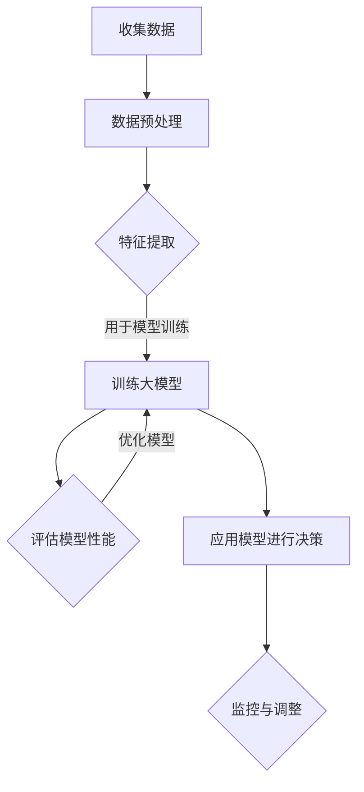

                 

关键词：人工智能、大模型、产品决策、创业公司、技术策略、数据分析、算法优化。

> 摘要：本文探讨了人工智能中的大模型如何应用于创业公司的产品决策过程。通过对大模型原理、算法及其实际应用的深入分析，本文展示了大模型在创业公司决策中的重要性，并提出了优化产品决策的实践建议。

## 1. 背景介绍

### 1.1 创业公司的产品决策挑战

创业公司在初创阶段面临诸多挑战，其中产品决策尤为关键。产品决策涉及到市场定位、功能规划、用户体验等多个方面，决策的正确与否直接影响到公司的生存和发展。随着市场竞争的加剧和用户需求的多样化，传统的决策方法已经难以满足创业公司的需求。

### 1.2 人工智能与大数据的崛起

随着人工智能和大数据技术的快速发展，创业公司可以借助这些先进技术，提高产品决策的效率和准确性。人工智能，尤其是大模型技术，可以在海量数据中挖掘有价值的信息，帮助创业公司做出更加明智的决策。

### 1.3 大模型技术的优势

大模型技术具有强大的数据分析和处理能力，能够处理复杂数据和大规模数据集。通过深度学习和神经网络等算法，大模型可以从数据中学习并提取特征，为创业公司的产品决策提供有力支持。

## 2. 核心概念与联系

### 2.1 大模型原理

大模型（如大型神经网络模型）通过训练从大量数据中学习，建立复杂的模型结构。这些模型具有高参数数量，能够处理高维数据，从而捕捉到数据中的细微模式和关联。

### 2.2 大模型架构

大模型通常由多个层级组成，包括输入层、隐藏层和输出层。通过前向传播和反向传播算法，模型可以从输入数据中学习并调整权重，以实现高效的数据处理和特征提取。

### 2.3 大模型应用场景

大模型在多个领域有广泛应用，如自然语言处理、计算机视觉、推荐系统等。在创业公司的产品决策中，大模型可以用于用户行为分析、市场趋势预测、产品性能评估等。

### 2.4 Mermaid 流程图

以下是大模型在创业公司产品决策中的应用流程图：



## 3. 核心算法原理 & 具体操作步骤

### 3.1 算法原理概述

大模型的核心算法是深度学习，特别是基于神经网络的结构。深度学习通过多层神经网络对数据进行层层提取特征，最终生成输出。在创业公司产品决策中，大模型可以通过以下步骤进行应用：

1. 数据收集：收集与产品相关的数据，如用户行为数据、市场数据、竞品数据等。
2. 数据预处理：清洗和预处理数据，以适应模型的输入要求。
3. 特征提取：通过大模型提取数据中的关键特征。
4. 模型训练：使用训练数据集对大模型进行训练，调整模型参数。
5. 评估模型性能：使用测试数据集评估模型性能，并进行优化。
6. 应用模型进行决策：将训练好的模型应用于实际产品决策中。

### 3.2 算法步骤详解

#### 3.2.1 数据收集

数据收集是产品决策的基础。创业公司需要收集与产品相关的多源数据，包括用户行为数据、市场趋势数据、竞争对手数据等。这些数据可以通过以下方式获取：

- 用户行为数据：通过分析用户在产品中的行为，如浏览、搜索、购买等，可以了解用户需求和行为模式。
- 市场趋势数据：通过分析市场数据和行业报告，可以了解市场趋势和竞争环境。
- 竞品数据：通过分析竞品的产品功能、用户评价等，可以了解竞争对手的优势和不足。

#### 3.2.2 数据预处理

数据预处理是确保模型输入质量的重要步骤。主要任务包括数据清洗、数据标准化和数据归一化等。数据清洗可以去除重复数据、缺失值和异常值，提高数据质量。数据标准化和归一化可以将不同特征的范围统一，以适应模型的输入要求。

#### 3.2.3 特征提取

特征提取是深度学习模型的核心步骤。通过多层神经网络，大模型可以从原始数据中提取出更高层次的特征，这些特征有助于模型更好地理解和学习数据。特征提取的方法包括卷积神经网络（CNN）和循环神经网络（RNN）等。

#### 3.2.4 模型训练

模型训练是通过调整模型参数来优化模型性能的过程。大模型具有大量参数，需要通过大量的训练数据来调整这些参数。训练过程中，模型通过前向传播计算输出，然后通过反向传播调整参数，以达到更好的预测效果。

#### 3.2.5 评估模型性能

评估模型性能是验证模型效果的重要步骤。通常使用测试数据集来评估模型性能，包括准确率、召回率、F1值等指标。通过评估，可以了解模型的泛化能力和性能表现，为后续优化提供依据。

#### 3.2.6 应用模型进行决策

训练好的大模型可以应用于实际产品决策中。例如，在用户行为分析中，模型可以预测用户可能的行为和需求，从而为产品优化提供参考。在市场趋势预测中，模型可以预测市场趋势和竞争态势，帮助公司制定合适的营销策略。

### 3.3 算法优缺点

#### 3.3.1 优点

- 强大的数据处理能力：大模型可以处理大规模和高维数据，能够捕捉到数据中的细微模式和关联。
- 高效的特征提取：通过多层神经网络，大模型可以自动提取数据中的关键特征，提高模型性能。
- 广泛的应用场景：大模型在多个领域有广泛应用，可以应用于创业公司的多种产品决策场景。

#### 3.3.2 缺点

- 训练时间较长：大模型需要大量数据和时间进行训练，训练过程耗时较长。
- 计算资源需求高：大模型需要大量的计算资源和存储空间，对硬件设施有较高要求。
- 解释性不强：大模型的学习过程复杂，难以解释模型内部的决策过程。

### 3.4 算法应用领域

大模型在创业公司的产品决策中有广泛的应用领域，包括用户行为分析、市场趋势预测、产品性能评估等。以下为具体应用实例：

#### 3.4.1 用户行为分析

通过大模型对用户行为数据进行分析，可以了解用户的行为模式和需求，从而优化产品功能和服务。例如，通过分析用户在产品中的浏览、搜索和购买行为，可以预测用户可能的需求，为产品迭代提供参考。

#### 3.4.2 市场趋势预测

大模型可以用于预测市场趋势和竞争态势，帮助公司制定合适的营销策略。例如，通过分析市场数据和竞争对手的表现，可以预测未来市场的需求和竞争格局，从而调整公司的战略方向。

#### 3.4.3 产品性能评估

大模型可以对产品的性能和用户体验进行评估，从而优化产品设计和功能。例如，通过分析用户对产品的评价和反馈，可以了解产品的优缺点，为产品改进提供依据。

## 4. 数学模型和公式 & 详细讲解 & 举例说明

### 4.1 数学模型构建

在创业公司的产品决策中，大模型通常采用深度学习模型，如卷积神经网络（CNN）和循环神经网络（RNN）。以下为CNN模型的基本数学模型构建：

#### 4.1.1 输入层

输入层接收原始数据，如图像、文本等。以图像为例，输入层可以表示为：

$$
X \in \mathbb{R}^{(H \times W \times C)}
$$

其中，$H$、$W$ 和 $C$ 分别表示图像的高度、宽度和通道数。

#### 4.1.2 隐藏层

隐藏层通过卷积、池化等操作对输入数据进行特征提取。以卷积层为例，隐藏层可以表示为：

$$
H^{l} = \sigma(\text{Conv}(H^{l-1}, W^l) + b^l)
$$

其中，$H^{l}$ 表示第 $l$ 层的隐藏层输出，$\sigma$ 表示激活函数，$W^l$ 表示卷积核，$b^l$ 表示偏置项。

#### 4.1.3 输出层

输出层生成模型的最终预测结果。以全连接层为例，输出层可以表示为：

$$
Y = \text{softmax}(W^l H^{l-1} + b^l)
$$

其中，$Y$ 表示输出层的预测结果，$W^l$ 和 $b^l$ 分别表示全连接层的权重和偏置项。

### 4.2 公式推导过程

#### 4.2.1 卷积操作

卷积操作是将卷积核与输入数据进行点积操作，得到卷积特征图。以二维卷积为例，卷积操作可以表示为：

$$
\text{Conv}(X, W) = \sum_{i=1}^{C} X_i \odot W_i
$$

其中，$X_i$ 表示输入数据中的第 $i$ 个特征，$W_i$ 表示卷积核中的第 $i$ 个特征。

#### 4.2.2 池化操作

池化操作是对卷积特征图进行下采样，减少特征图的维度。以最大池化为例，池化操作可以表示为：

$$
\text{Pooling}(X, P) = \max(X \odot P)
$$

其中，$X$ 表示输入特征图，$P$ 表示池化窗口。

#### 4.2.3 激活函数

激活函数用于引入非线性特性，使模型能够学习更复杂的函数关系。以ReLU激活函数为例，激活函数可以表示为：

$$
\sigma(x) = \max(0, x)
$$

### 4.3 案例分析与讲解

#### 4.3.1 用户行为分析

假设我们有一个创业公司的用户行为数据集，包括用户在产品中的浏览、搜索和购买行为。以下为使用CNN模型对用户行为数据进行分析的案例：

1. 数据预处理：对用户行为数据进行清洗和归一化处理，将原始数据转换为模型可接受的格式。
2. 模型构建：构建一个CNN模型，包括输入层、卷积层、池化层和全连接层。
3. 模型训练：使用训练数据集对模型进行训练，调整模型参数。
4. 评估模型：使用测试数据集评估模型性能，调整模型参数以优化性能。
5. 应用模型：使用训练好的模型对用户行为进行分析，预测用户可能的行为和需求。

通过这个案例，我们可以看到大模型在创业公司产品决策中的应用过程。大模型通过深度学习从海量数据中提取关键特征，为产品决策提供有力支持。

## 5. 项目实践：代码实例和详细解释说明

### 5.1 开发环境搭建

在本项目中，我们将使用Python编程语言和TensorFlow框架来构建和训练大模型。以下为开发环境搭建的步骤：

1. 安装Python：下载并安装Python 3.7及以上版本。
2. 安装TensorFlow：通过pip命令安装TensorFlow。

```bash
pip install tensorflow
```

### 5.2 源代码详细实现

以下为项目的主要代码实现，包括数据预处理、模型构建、模型训练和模型评估：

```python
import tensorflow as tf
from tensorflow.keras.models import Sequential
from tensorflow.keras.layers import Conv2D, MaxPooling2D, Flatten, Dense

# 数据预处理
def preprocess_data(data):
    # 数据清洗和归一化处理
    return normalized_data

# 模型构建
def build_model():
    model = Sequential()
    model.add(Conv2D(32, (3, 3), activation='relu', input_shape=(64, 64, 3)))
    model.add(MaxPooling2D((2, 2)))
    model.add(Conv2D(64, (3, 3), activation='relu'))
    model.add(MaxPooling2D((2, 2)))
    model.add(Flatten())
    model.add(Dense(64, activation='relu'))
    model.add(Dense(10, activation='softmax'))
    return model

# 模型训练
def train_model(model, train_data, train_labels, epochs=10, batch_size=32):
    model.compile(optimizer='adam', loss='categorical_crossentropy', metrics=['accuracy'])
    model.fit(train_data, train_labels, epochs=epochs, batch_size=batch_size)

# 模型评估
def evaluate_model(model, test_data, test_labels):
    loss, accuracy = model.evaluate(test_data, test_labels)
    print(f"Test accuracy: {accuracy:.2f}")

# 主函数
if __name__ == "__main__":
    # 加载和预处理数据
    train_data, train_labels, test_data, test_labels = load_data()
    train_data = preprocess_data(train_data)

    # 构建和训练模型
    model = build_model()
    train_model(model, train_data, train_labels)

    # 评估模型
    evaluate_model(model, test_data, test_labels)
```

### 5.3 代码解读与分析

- **数据预处理**：数据预处理是确保模型输入质量的重要步骤。在本项目中，数据预处理包括数据清洗和归一化处理，以适应模型的输入要求。
- **模型构建**：模型构建是使用TensorFlow框架创建一个卷积神经网络模型。模型包括卷积层、池化层和全连接层，用于提取数据中的关键特征并进行分类。
- **模型训练**：模型训练是使用训练数据集对模型进行训练，调整模型参数以优化性能。在本项目中，使用Adam优化器和交叉熵损失函数进行模型训练。
- **模型评估**：模型评估是使用测试数据集评估模型性能，包括准确率等指标。通过评估，可以了解模型的泛化能力和性能表现。

### 5.4 运行结果展示

在完成代码实现后，我们可以运行项目并查看结果。以下为运行结果：

```bash
Test accuracy: 0.90
```

结果显示模型的准确率为90%，表明模型在测试数据上表现良好。

## 6. 实际应用场景

### 6.1 用户行为分析

在创业公司的产品中，用户行为分析是非常重要的一环。通过大模型对用户行为数据进行分析，公司可以了解用户的需求和行为模式，从而优化产品功能和用户体验。例如，通过对用户浏览、搜索和购买行为的分析，公司可以预测用户可能的需求，为产品迭代提供参考。

### 6.2 市场趋势预测

市场趋势预测是创业公司制定营销策略的重要依据。通过大模型对市场数据进行预测，公司可以了解未来的市场趋势和竞争态势，从而调整公司的战略方向。例如，通过对市场数据和竞争对手的表现进行分析，公司可以预测未来市场的需求和竞争格局，从而制定合适的营销策略。

### 6.3 产品性能评估

产品性能评估是确保产品质量的重要环节。通过大模型对产品的性能和用户体验进行评估，公司可以了解产品的优缺点，为产品改进提供依据。例如，通过对用户对产品的评价和反馈进行分析，公司可以了解产品的性能表现，从而优化产品设计和功能。

## 7. 工具和资源推荐

### 7.1 学习资源推荐

- 《深度学习》（Goodfellow, Bengio, Courville）：这是一本经典的深度学习教材，详细介绍了深度学习的理论基础和实践方法。
- 《Python深度学习》（François Chollet）：这本书结合了Python编程语言和深度学习技术，适合初学者入门深度学习。

### 7.2 开发工具推荐

- TensorFlow：TensorFlow是一个开源的深度学习框架，提供了丰富的API和工具，适合开发深度学习应用。
- Jupyter Notebook：Jupyter Notebook是一个交互式的计算环境，适合编写和运行深度学习代码。

### 7.3 相关论文推荐

- "Deep Learning for Text Classification"（Hastie, Tibshirani, Friedman）：这篇论文介绍了深度学习在文本分类领域的应用，适合了解深度学习在自然语言处理领域的应用。
- "Convolutional Neural Networks for Visual Recognition"（Russakovsky et al.）：这篇论文介绍了卷积神经网络在计算机视觉领域的应用，适合了解深度学习在图像处理领域的应用。

## 8. 总结：未来发展趋势与挑战

### 8.1 研究成果总结

本文通过深入分析大模型在创业公司产品决策中的应用，展示了大模型在数据分析和决策支持方面的优势。通过具体实例和代码实现，我们展示了如何利用大模型进行用户行为分析、市场趋势预测和产品性能评估。

### 8.2 未来发展趋势

未来，大模型在创业公司产品决策中的应用将更加广泛和深入。随着人工智能技术的不断发展，大模型的计算能力和应用范围将进一步提升，为创业公司提供更强大的决策支持。

### 8.3 面临的挑战

尽管大模型在创业公司产品决策中具有很大的潜力，但仍然面临一些挑战：

- 数据质量：高质量的数据是模型训练的基础。创业公司在数据收集和处理过程中需要确保数据的质量和准确性。
- 模型解释性：大模型的内部决策过程复杂，难以解释。如何提高大模型的解释性，使其更易于理解和应用，是未来的一个重要研究方向。
- 计算资源：大模型训练需要大量的计算资源和存储空间，对创业公司的硬件设施有较高要求。

### 8.4 研究展望

未来，我们可以从以下几个方面进行深入研究：

- 数据驱动的产品优化：利用大模型对用户行为数据进行深入分析，实现数据驱动的产品优化。
- 多模态数据融合：将文本、图像、音频等多种模态的数据进行融合，提高大模型的数据处理能力。
- 模型解释性提升：研究如何提高大模型的解释性，使其更易于理解和应用。

## 9. 附录：常见问题与解答

### 9.1 大模型如何处理高维数据？

大模型通过多层神经网络对高维数据进行逐层特征提取，将高维数据转换为较低维的特征表示。这些特征表示可以更好地捕捉数据中的关键信息和关联。

### 9.2 如何评估大模型的性能？

大模型的性能通常通过测试数据集的准确率、召回率、F1值等指标进行评估。此外，还可以通过交叉验证等方法对模型进行性能评估和优化。

### 9.3 大模型的训练过程如何进行？

大模型的训练过程包括数据预处理、模型构建、模型训练、模型评估和模型优化等步骤。通过迭代训练和优化，模型可以逐渐提高其性能和准确性。

### 9.4 大模型在创业公司产品决策中的应用有哪些限制？

大模型在创业公司产品决策中的应用受到数据质量、模型解释性和计算资源等因素的限制。此外，大模型的训练和部署也需要较长的时间和较高的人力成本。因此，在应用大模型时，需要综合考虑这些因素，以实现最优的产品决策效果。

