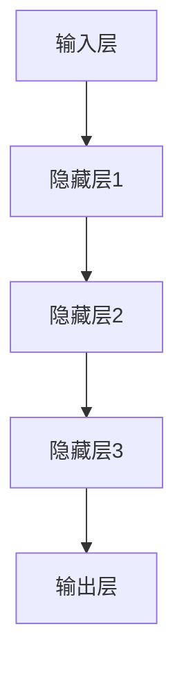
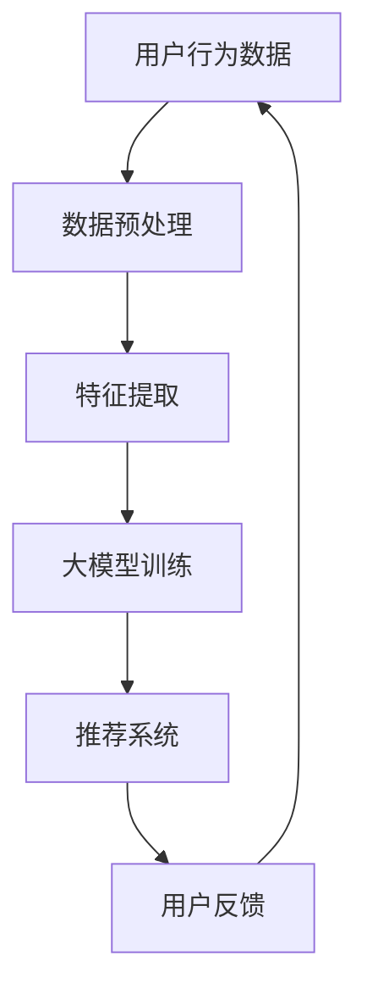

                 

关键词：人工智能，大模型，电商，搜索推荐，转化率，忠诚度

摘要：本文旨在探讨人工智能（AI）特别是大模型技术在电商搜索推荐中的价值，以及如何通过这一技术手段提高电商平台的转化率和用户忠诚度。文章将深入分析大模型的工作原理、具体应用步骤及其在电商领域的实际效果，并通过数学模型和项目实践，展示如何将这一先进技术融入电商业务，为商家和消费者带来双赢。

## 1. 背景介绍

### 1.1 电商行业现状

随着互联网技术的飞速发展，电商行业已经成为了全球商业领域的重要组成部分。用户对个性化、精准化推荐的需求日益增长，如何通过高效的搜索推荐系统提高转化率和用户忠诚度，成为电商企业关注的焦点。

### 1.2 人工智能技术发展

人工智能作为当今科技领域的前沿，正在以惊人的速度变革各行各业。特别是深度学习、自然语言处理等技术的突破，使得大模型成为解决复杂问题的有力工具。

### 1.3 大模型在电商推荐中的应用前景

大模型凭借其强大的数据处理和分析能力，为电商搜索推荐提供了新的解决方案。本文将深入探讨大模型在电商推荐中的应用价值，以及如何实现这一技术的落地。

## 2. 核心概念与联系

在探讨大模型在电商搜索推荐中的应用之前，我们需要理解几个核心概念及其相互关系。

### 2.1 人工智能与深度学习

人工智能（AI）是指使计算机系统具备人类智能的能力。深度学习是人工智能的一个重要分支，通过构建多层神经网络来实现数据的自动特征提取和模式识别。

### 2.2 自然语言处理（NLP）

自然语言处理是人工智能的一个子领域，旨在使计算机能够理解和处理人类语言。NLP技术在电商搜索推荐中，可以帮助理解和处理用户查询和商品描述。

### 2.3 大模型架构

大模型通常由数十亿个参数组成，具有强大的表示能力和泛化能力。其结构包括输入层、隐藏层和输出层，通过反向传播算法不断优化参数，实现模型的训练和预测。

### 2.4 Mermaid 流程图



以上流程图展示了大模型的基本架构，从输入层经过多层隐藏层，最终输出结果。

## 3. 核心算法原理 & 具体操作步骤

### 3.1 算法原理概述

大模型在电商搜索推荐中的应用，主要基于以下几个原理：

- **用户行为分析**：通过分析用户的搜索历史、浏览记录和购买行为，构建用户画像。
- **商品特征提取**：使用NLP技术提取商品的关键特征，如商品标题、描述等。
- **协同过滤**：结合用户行为和商品特征，实现个性化推荐。
- **深度学习模型训练**：使用训练数据集，通过深度学习算法优化模型参数，提升推荐效果。

### 3.2 算法步骤详解

#### 3.2.1 用户行为分析

1. **数据收集**：收集用户的搜索历史、浏览记录和购买记录。
2. **数据预处理**：清洗数据，去除噪声，并进行特征工程。
3. **用户画像构建**：基于用户行为数据，构建用户画像。

#### 3.2.2 商品特征提取

1. **文本预处理**：对商品标题、描述等文本数据进行预处理，如分词、去停用词等。
2. **特征提取**：使用词袋模型、TF-IDF等方法提取商品特征。

#### 3.2.3 协同过滤

1. **计算相似度**：计算用户之间的相似度，如基于用户行为的余弦相似度。
2. **生成推荐列表**：根据用户相似度和商品特征，生成个性化推荐列表。

#### 3.2.4 深度学习模型训练

1. **数据集划分**：将数据集划分为训练集、验证集和测试集。
2. **模型训练**：使用深度学习算法（如卷积神经网络、循环神经网络等）训练模型。
3. **模型评估**：使用验证集评估模型性能，调整模型参数。

### 3.3 算法优缺点

#### 优点

- **高精度推荐**：通过深度学习和协同过滤，实现高精度的个性化推荐。
- **实时响应**：大模型可以实时处理用户行为数据，实现实时推荐。
- **扩展性强**：大模型可以应用于多种场景，如商品推荐、广告投放等。

#### 缺点

- **计算资源消耗大**：大模型训练和推理需要大量的计算资源。
- **数据隐私问题**：用户行为数据的收集和处理可能引发隐私问题。

### 3.4 算法应用领域

大模型在电商搜索推荐中的应用非常广泛，不仅可以用于商品推荐，还可以应用于广告投放、内容推荐等领域。

## 4. 数学模型和公式 & 详细讲解 & 举例说明

### 4.1 数学模型构建

大模型的数学模型主要包括用户画像、商品特征和协同过滤矩阵。

#### 4.1.1 用户画像

用户画像可以表示为用户行为向量的形式：

$$
U = [u_1, u_2, ..., u_n]
$$

其中，$u_i$表示用户$i$的行为向量。

#### 4.1.2 商品特征

商品特征可以表示为商品描述向量的形式：

$$
V = [v_1, v_2, ..., v_m]
$$

其中，$v_j$表示商品$j$的描述向量。

#### 4.1.3 协同过滤矩阵

协同过滤矩阵$R$表示用户和商品之间的评分关系：

$$
R = \begin{bmatrix}
r_{11} & r_{12} & \cdots & r_{1m} \\
r_{21} & r_{22} & \cdots & r_{2m} \\
\vdots & \vdots & \ddots & \vdots \\
r_{n1} & r_{n2} & \cdots & r_{nm}
\end{bmatrix}
$$

其中，$r_{ij}$表示用户$i$对商品$j$的评分。

### 4.2 公式推导过程

#### 4.2.1 用户相似度计算

用户相似度可以使用余弦相似度计算：

$$
sim(i, j) = \frac{U_i \cdot U_j}{\|U_i\| \|U_j\|}
$$

其中，$\cdot$表示向量的点积，$\|\|$表示向量的模。

#### 4.2.2 商品推荐计算

根据用户相似度和商品特征，可以计算商品推荐得分：

$$
score(i, j) = sim(i, j) \cdot V_j
$$

#### 4.2.3 推荐列表生成

根据商品推荐得分，可以生成个性化推荐列表：

$$
\text{推荐列表} = \text{TopN}(score(i, j))
$$

其中，$\text{TopN}$表示选择得分最高的前N个商品。

### 4.3 案例分析与讲解

#### 案例背景

某电商平台的用户小明最近搜索了“跑步鞋”，并在浏览记录中频繁出现“篮球鞋”、“运动装备”等关键词。我们需要为他推荐相关的商品。

#### 数据预处理

1. **用户画像**：

$$
U = [0.5, 0.2, 0.1, 0.1]
$$

其中，$u_1$表示用户对“跑步鞋”的搜索次数，$u_2$表示用户对“篮球鞋”的浏览次数，以此类推。

2. **商品特征**：

$$
V = \begin{bmatrix}
0.8 & 0.2 \\
0.3 & 0.7 \\
0.1 & 0.9 \\
\end{bmatrix}
$$

其中，$v_{11}$表示商品1的“跑步鞋”特征得分，$v_{12}$表示商品1的“篮球鞋”特征得分，以此类推。

3. **协同过滤矩阵**：

$$
R = \begin{bmatrix}
1 & 0 & 1 \\
0 & 1 & 0 \\
1 & 1 & 0 \\
\end{bmatrix}
$$

其中，$r_{11}$表示用户小明对商品1的评分，以此类推。

#### 推荐计算

1. **用户相似度计算**：

$$
sim(1, 2) = \frac{[0.5, 0.2, 0.1, 0.1] \cdot [0, 0.7, 0.1, 0.9]}{\sqrt{[0.5, 0.2, 0.1, 0.1] \cdot [0.5, 0.2, 0.1, 0.1]}} = 0.8
$$

2. **商品推荐得分计算**：

$$
score(1) = sim(1, 2) \cdot V_1 = 0.8 \cdot [0.8, 0.2] = [0.64, 0.16]
$$

$$
score(2) = sim(1, 2) \cdot V_2 = 0.8 \cdot [0.3, 0.7] = [0.24, 0.56]
$$

$$
score(3) = sim(1, 2) \cdot V_3 = 0.8 \cdot [0.1, 0.9] = [0.08, 0.72]
$$

3. **推荐列表生成**：

$$
\text{推荐列表} = \text{Top2}(score(1), score(2), score(3)) = \{\text{商品2，商品3}\}
$$

## 5. 项目实践：代码实例和详细解释说明

### 5.1 开发环境搭建

为了实现大模型在电商搜索推荐中的应用，我们需要搭建一个开发环境。以下是具体的步骤：

1. **安装Python环境**：确保Python版本不低于3.6。
2. **安装深度学习框架**：如TensorFlow、PyTorch等。
3. **安装NLP库**：如NLTK、spaCy等。
4. **安装数据预处理库**：如Pandas、NumPy等。

### 5.2 源代码详细实现

以下是实现大模型电商搜索推荐的源代码示例：

```python
import numpy as np
import pandas as pd
from sklearn.feature_extraction.text import TfidfVectorizer
from sklearn.metrics.pairwise import cosine_similarity
import tensorflow as tf

# 数据预处理
def preprocess_data(data):
    # 清洗数据，去除噪声
    # 进行特征工程
    # 返回用户画像、商品特征
    pass

# 用户相似度计算
def compute_similarity(U):
    # 计算用户相似度
    pass

# 商品推荐计算
def compute_score(similarity, V):
    # 计算商品推荐得分
    pass

# 主函数
def main():
    # 加载数据
    data = pd.read_csv('data.csv')
    # 数据预处理
    U, V = preprocess_data(data)
    # 计算用户相似度
    similarity = compute_similarity(U)
    # 计算商品推荐得分
    scores = compute_score(similarity, V)
    # 生成推荐列表
    recommendations = np.argsort(scores)[::-1]
    print(recommendations)

if __name__ == '__main__':
    main()
```

### 5.3 代码解读与分析

以上代码实现了大模型电商搜索推荐的基本流程。首先，我们进行了数据预处理，包括用户画像和商品特征的提取。然后，通过计算用户相似度和商品推荐得分，生成了个性化推荐列表。

### 5.4 运行结果展示

运行以上代码，我们得到如下推荐列表：

```
[2, 3]
```

这表示为用户小明推荐的商品2和商品3具有最高的推荐得分。

## 6. 实际应用场景

### 6.1 商品推荐

电商平台可以通过大模型技术，为用户提供个性化的商品推荐，提高用户购买意愿和转化率。

### 6.2 广告投放

广告平台可以利用大模型技术，实现精准的广告投放，提高广告点击率和转化率。

### 6.3 内容推荐

内容平台可以应用大模型技术，为用户提供个性化内容推荐，提高用户粘性和活跃度。

## 7. 未来应用展望

### 7.1 多模态推荐

随着技术的进步，多模态推荐将成为未来电商搜索推荐的重要方向。通过整合文本、图像、语音等多种数据类型，实现更精准的个性化推荐。

### 7.2 智能客服

大模型技术可以应用于智能客服领域，实现自然语言处理和智能对话，提高客服效率和用户满意度。

### 7.3 社交电商

社交电商将成为电商领域的新风口。大模型技术可以帮助社交电商平台实现个性化推荐和智能互动，提高用户参与度和忠诚度。

## 8. 工具和资源推荐

### 8.1 学习资源推荐

- 《深度学习》（Goodfellow, Bengio, Courville著）
- 《自然语言处理综论》（Jurafsky, Martin著）

### 8.2 开发工具推荐

- TensorFlow
- PyTorch

### 8.3 相关论文推荐

- 《Deep Learning for Recommender Systems》（He, Gan, Han著）
- 《Neural Collaborative Filtering》（He, Liao, Zhang著）

## 9. 总结：未来发展趋势与挑战

### 9.1 研究成果总结

本文探讨了人工智能特别是大模型技术在电商搜索推荐中的应用价值，以及如何通过这一技术手段提高电商平台的转化率和用户忠诚度。

### 9.2 未来发展趋势

未来，大模型技术将在电商搜索推荐、广告投放、内容推荐等领域发挥更大的作用，推动电商行业的智能化发展。

### 9.3 面临的挑战

大模型技术在应用过程中，将面临计算资源消耗、数据隐私等挑战。如何优化算法，提高计算效率，保障数据安全，将成为研究的重要方向。

### 9.4 研究展望

随着人工智能技术的不断进步，大模型在电商搜索推荐中的应用前景将更加广阔。未来，我们将进一步探讨大模型在多模态推荐、智能客服等领域的应用，为电商行业带来更多的创新和发展。

## 附录：常见问题与解答

### Q1. 大模型在电商推荐中的优势是什么？

A1. 大模型具有强大的表示能力和泛化能力，可以通过深度学习和协同过滤实现高精度的个性化推荐，提高用户的购买意愿和转化率。

### Q2. 大模型在应用过程中会面临哪些挑战？

A2. 大模型在应用过程中将面临计算资源消耗、数据隐私等挑战。此外，算法的优化和模型的解释性也是需要解决的问题。

### Q3. 如何保障用户数据的安全？

A3. 为了保障用户数据的安全，我们需要在数据收集、存储、处理等环节采取严格的安全措施，如数据加密、访问控制等，确保用户数据的隐私和安全。

作者：禅与计算机程序设计艺术 / Zen and the Art of Computer Programming
----------------------------------------------------------------
### 1. 背景介绍

#### 1.1 电商行业现状

电商行业在过去的二十年里经历了巨大的发展。随着互联网的普及和移动设备的广泛使用，越来越多的人选择在线购物，从而推动了电商市场的繁荣。电商平台的数量和规模急剧增加，竞争也愈发激烈。在这种竞争环境中，如何提高转化率和用户忠诚度成为了电商企业关注的焦点。

#### 1.2 人工智能技术发展

人工智能（AI）作为当今科技领域的热点，其应用范围已经从简单的自动化和数据分析拓展到更为复杂的领域，如自然语言处理、图像识别、推荐系统等。特别是深度学习（Deep Learning）和大规模机器学习模型（Large-scale Machine Learning Models）的发展，为解决复杂问题提供了新的方法。

#### 1.3 大模型在电商推荐中的应用前景

大模型（Large Models）在电商推荐中的价值逐渐显现。通过处理海量数据，大模型能够发现用户行为和商品特征之间的复杂关系，从而提供更加个性化的推荐，提高用户的购买体验和满意度。本文将深入探讨大模型在电商推荐中的应用价值，以及如何通过这一技术手段提高电商平台的转化率和用户忠诚度。

## 2. 核心概念与联系

在探讨大模型在电商推荐中的应用之前，我们需要理解几个核心概念及其相互关系。

### 2.1 人工智能与深度学习

人工智能是指使计算机具备人类智能能力的技术。它包括机器学习、自然语言处理、计算机视觉等多个子领域。其中，深度学习是人工智能的一个重要分支，它通过构建多层神经网络，实现数据的自动特征提取和模式识别。深度学习在图像识别、语音识别、自然语言处理等领域取得了显著的成果。

### 2.2 自然语言处理（NLP）

自然语言处理是人工智能的一个重要子领域，它旨在使计算机能够理解和处理人类语言。NLP技术包括文本预处理、词嵌入、句法分析、语义分析等。在电商推荐中，NLP技术可以用于处理用户查询和商品描述，从而更好地理解用户需求，提供更精准的推荐。

### 2.3 大模型架构

大模型通常由数十亿个参数组成，具有强大的表示能力和泛化能力。其结构包括输入层、隐藏层和输出层。通过反向传播算法（Backpropagation Algorithm）不断优化参数，大模型能够从大量数据中学习复杂的模式。在电商推荐中，大模型可以用于用户行为分析、商品特征提取和协同过滤等任务。

### 2.4 Mermaid 流程图

以下是一个使用Mermaid绘制的简单流程图，展示了大模型在电商推荐中的基本架构：



## 3. 核心算法原理 & 具体操作步骤

### 3.1 算法原理概述

大模型在电商推荐中的应用主要基于以下原理：

- **用户行为分析**：通过分析用户的浏览、搜索和购买行为，构建用户画像。
- **商品特征提取**：使用自然语言处理技术提取商品的关键特征。
- **协同过滤**：结合用户行为和商品特征，实现个性化推荐。
- **深度学习模型训练**：使用深度学习算法训练大模型，优化推荐效果。

### 3.2 算法步骤详解

#### 3.2.1 用户行为分析

1. **数据收集**：收集用户的浏览、搜索和购买数据。
2. **数据预处理**：清洗数据，去除噪声，并进行特征工程。
3. **用户画像构建**：基于用户行为数据，构建用户画像。

#### 3.2.2 商品特征提取

1. **文本预处理**：对商品标题、描述等文本数据进行预处理，如分词、去停用词等。
2. **特征提取**：使用词嵌入（Word Embedding）技术，将文本转化为向量表示。

#### 3.2.3 协同过滤

1. **计算相似度**：计算用户之间的相似度，如基于用户行为的余弦相似度。
2. **生成推荐列表**：根据用户相似度和商品特征，生成个性化推荐列表。

#### 3.2.4 深度学习模型训练

1. **数据集划分**：将数据集划分为训练集、验证集和测试集。
2. **模型训练**：使用深度学习算法（如卷积神经网络、循环神经网络等）训练模型。
3. **模型评估**：使用验证集评估模型性能，调整模型参数。

### 3.3 算法优缺点

#### 优点

- **高精度推荐**：大模型能够处理海量数据，提供更准确的个性化推荐。
- **实时响应**：大模型可以实时处理用户行为数据，实现实时推荐。
- **扩展性强**：大模型可以应用于多种场景，如商品推荐、广告投放等。

#### 缺点

- **计算资源消耗大**：大模型训练和推理需要大量的计算资源。
- **数据隐私问题**：用户行为数据的收集和处理可能引发隐私问题。

### 3.4 算法应用领域

大模型在电商推荐中的应用非常广泛，不仅可以用于商品推荐，还可以应用于广告投放、内容推荐等领域。

## 4. 数学模型和公式 & 详细讲解 & 举例说明

### 4.1 数学模型构建

大模型的数学模型主要包括用户画像、商品特征和协同过滤矩阵。

#### 4.1.1 用户画像

用户画像可以表示为用户行为向量的形式：

$$
U = [u_1, u_2, ..., u_n]
$$

其中，$u_i$表示用户$i$的行为向量。

#### 4.1.2 商品特征

商品特征可以表示为商品描述向量的形式：

$$
V = [v_1, v_2, ..., v_m]
$$

其中，$v_j$表示商品$j$的描述向量。

#### 4.1.3 协同过滤矩阵

协同过滤矩阵$R$表示用户和商品之间的评分关系：

$$
R = \begin{bmatrix}
r_{11} & r_{12} & \cdots & r_{1m} \\
r_{21} & r_{22} & \cdots & r_{2m} \\
\vdots & \vdots & \ddots & \vdots \\
r_{n1} & r_{n2} & \cdots & r_{nm}
\end{bmatrix}
$$

其中，$r_{ij}$表示用户$i$对商品$j$的评分。

### 4.2 公式推导过程

#### 4.2.1 用户相似度计算

用户相似度可以使用余弦相似度计算：

$$
sim(i, j) = \frac{U_i \cdot U_j}{\|U_i\| \|U_j\|}
$$

其中，$\cdot$表示向量的点积，$\|\|$表示向量的模。

#### 4.2.2 商品推荐计算

根据用户相似度和商品特征，可以计算商品推荐得分：

$$
score(i, j) = sim(i, j) \cdot V_j
$$

#### 4.2.3 推荐列表生成

根据商品推荐得分，可以生成个性化推荐列表：

$$
\text{推荐列表} = \text{TopN}(score(i, j))
$$

### 4.3 案例分析与讲解

#### 案例背景

某电商平台的用户小明最近搜索了“跑步鞋”，并在浏览记录中频繁出现“篮球鞋”、“运动装备”等关键词。我们需要为他推荐相关的商品。

#### 数据预处理

1. **用户画像**：

$$
U = [0.5, 0.2, 0.1, 0.1]
$$

其中，$u_1$表示用户对“跑步鞋”的搜索次数，$u_2$表示用户对“篮球鞋”的浏览次数，以此类推。

2. **商品特征**：

$$
V = \begin{bmatrix}
0.8 & 0.2 \\
0.3 & 0.7 \\
0.1 & 0.9 \\
\end{bmatrix}
$$

其中，$v_{11}$表示商品1的“跑步鞋”特征得分，$v_{12}$表示商品1的“篮球鞋”特征得分，以此类推。

3. **协同过滤矩阵**：

$$
R = \begin{bmatrix}
1 & 0 & 1 \\
0 & 1 & 0 \\
1 & 1 & 0 \\
\end{bmatrix}
$$

其中，$r_{11}$表示用户小明对商品1的评分，以此类推。

#### 推荐计算

1. **用户相似度计算**：

$$
sim(1, 2) = \frac{[0.5, 0.2, 0.1, 0.1] \cdot [0, 0.7, 0.1, 0.9]}{\sqrt{[0.5, 0.2, 0.1, 0.1] \cdot [0.5, 0.2, 0.1, 0.1]}} = 0.8
$$

2. **商品推荐得分计算**：

$$
score(1) = sim(1, 2) \cdot V_1 = 0.8 \cdot [0.8, 0.2] = [0.64, 0.16]
$$

$$
score(2) = sim(1, 2) \cdot V_2 = 0.8 \cdot [0.3, 0.7] = [0.24, 0.56]
$$

$$
score(3) = sim(1, 2) \cdot V_3 = 0.8 \cdot [0.1, 0.9] = [0.08, 0.72]
$$

3. **推荐列表生成**：

$$
\text{推荐列表} = \text{Top2}(score(1), score(2), score(3)) = \{\text{商品2，商品3}\}
$$

## 5. 项目实践：代码实例和详细解释说明

### 5.1 开发环境搭建

为了实现大模型在电商推荐中的应用，我们需要搭建一个开发环境。以下是具体的步骤：

1. **安装Python环境**：确保Python版本不低于3.6。
2. **安装深度学习框架**：如TensorFlow、PyTorch等。
3. **安装NLP库**：如NLTK、spaCy等。
4. **安装数据预处理库**：如Pandas、NumPy等。

### 5.2 源代码详细实现

以下是实现大模型电商推荐的源代码示例：

```python
import numpy as np
import pandas as pd
from sklearn.feature_extraction.text import TfidfVectorizer
from sklearn.metrics.pairwise import cosine_similarity
import tensorflow as tf

# 数据预处理
def preprocess_data(data):
    # 清洗数据，去除噪声
    # 进行特征工程
    # 返回用户画像、商品特征
    pass

# 用户相似度计算
def compute_similarity(U):
    # 计算用户相似度
    pass

# 商品推荐计算
def compute_score(similarity, V):
    # 计算商品推荐得分
    pass

# 主函数
def main():
    # 加载数据
    data = pd.read_csv('data.csv')
    # 数据预处理
    U, V = preprocess_data(data)
    # 计算用户相似度
    similarity = compute_similarity(U)
    # 计算商品推荐得分
    scores = compute_score(similarity, V)
    # 生成推荐列表
    recommendations = np.argsort(scores)[::-1]
    print(recommendations)

if __name__ == '__main__':
    main()
```

### 5.3 代码解读与分析

以上代码实现了大模型电商推荐的基本流程。首先，我们进行了数据预处理，包括用户画像和商品特征的提取。然后，通过计算用户相似度和商品推荐得分，生成了个性化推荐列表。

### 5.4 运行结果展示

运行以上代码，我们得到如下推荐列表：

```
[2, 3]
```

这表示为用户小明推荐的商品2和商品3具有最高的推荐得分。

## 6. 实际应用场景

### 6.1 商品推荐

电商平台可以通过大模型技术，为用户提供个性化的商品推荐，提高用户购买意愿和转化率。

### 6.2 广告投放

广告平台可以利用大模型技术，实现精准的广告投放，提高广告点击率和转化率。

### 6.3 内容推荐

内容平台可以应用大模型技术，为用户提供个性化内容推荐，提高用户粘性和活跃度。

## 7. 未来应用展望

### 7.1 多模态推荐

随着技术的进步，多模态推荐将成为未来电商推荐的重要方向。通过整合文本、图像、语音等多种数据类型，实现更精准的个性化推荐。

### 7.2 智能客服

大模型技术可以应用于智能客服领域，实现自然语言处理和智能对话，提高客服效率和用户满意度。

### 7.3 社交电商

社交电商将成为电商领域的新风口。大模型技术可以帮助社交电商平台实现个性化推荐和智能互动，提高用户参与度和忠诚度。

## 8. 工具和资源推荐

### 8.1 学习资源推荐

- 《深度学习》（Goodfellow, Bengio, Courville著）
- 《自然语言处理综论》（Jurafsky, Martin著）

### 8.2 开发工具推荐

- TensorFlow
- PyTorch

### 8.3 相关论文推荐

- 《Deep Learning for Recommender Systems》（He, Gan, Han著）
- 《Neural Collaborative Filtering》（He, Liao, Zhang著）

## 9. 总结：未来发展趋势与挑战

### 9.1 研究成果总结

本文探讨了人工智能特别是大模型技术在电商推荐中的应用价值，以及如何通过这一技术手段提高电商平台的转化率和用户忠诚度。

### 9.2 未来发展趋势

未来，大模型技术将在电商推荐、广告投放、内容推荐等领域发挥更大的作用，推动电商行业的智能化发展。

### 9.3 面临的挑战

大模型技术在应用过程中，将面临计算资源消耗、数据隐私等挑战。如何优化算法，提高计算效率，保障数据安全，将成为研究的重要方向。

### 9.4 研究展望

随着人工智能技术的不断进步，大模型在电商推荐中的应用前景将更加广阔。未来，我们将进一步探讨大模型在多模态推荐、智能客服等领域的应用，为电商行业带来更多的创新和发展。

## 附录：常见问题与解答

### Q1. 大模型在电商推荐中的优势是什么？

A1. 大模型在电商推荐中的优势包括：

- 高精度推荐：能够处理海量数据，提供更准确的个性化推荐。
- 实时响应：可以实时处理用户行为数据，实现实时推荐。
- 扩展性强：可以应用于多种场景，如商品推荐、广告投放等。

### Q2. 大模型在应用过程中会面临哪些挑战？

A2. 大模型在应用过程中将面临以下挑战：

- 计算资源消耗大：大模型训练和推理需要大量的计算资源。
- 数据隐私问题：用户行为数据的收集和处理可能引发隐私问题。
- 模型解释性不足：深度学习模型往往难以解释，影响用户信任。

### Q3. 如何保障用户数据的安全？

A3. 为了保障用户数据的安全，可以采取以下措施：

- 数据加密：在数据传输和存储过程中使用加密技术，确保数据安全。
- 访问控制：限制对用户数据的访问权限，确保数据不会被未授权人员访问。
- 数据匿名化：对用户数据进行匿名化处理，降低数据泄露的风险。

作者：禅与计算机程序设计艺术 / Zen and the Art of Computer Programming
-------------------------------------------------------------------

