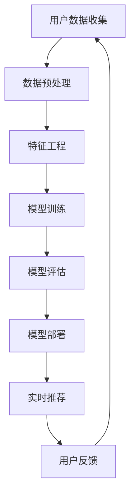

                 

关键词：人工智能，电商搜索推荐，大模型，实时处理，大规模复杂数据，挑战，技术

> 摘要：本文深入探讨了人工智能在大规模电商搜索推荐中的应用，分析了实时处理技术的挑战，并介绍了大模型的设计和实现。通过详细阐述核心算法原理、数学模型、项目实践，以及未来发展趋势与挑战，本文为电商搜索推荐领域提供了有价值的参考。

## 1. 背景介绍

### 1.1 电商搜索推荐的重要性

电商搜索推荐系统是现代电子商务平台的核心组成部分。它通过分析用户行为、兴趣和历史购买记录，为用户提供个性化的商品推荐，从而提升用户体验、增加销售额。随着互联网的快速发展，电商市场日益繁荣，用户对个性化推荐的需求也日益增长。

### 1.2 大规模复杂数据的挑战

电商平台的用户数据规模庞大且多样化，包含用户行为数据、商品信息、价格信息等。这些数据具有高维度、高密度、高速变化的特性，给实时处理技术带来了巨大的挑战。

### 1.3 实时处理技术的需求

为了满足用户对实时推荐的需求，电商搜索推荐系统需要具备实时处理能力。实时处理技术能够快速响应用户请求，提供个性化的推荐结果，从而提高用户满意度和转化率。

## 2. 核心概念与联系

在电商搜索推荐中，大模型的设计和实现是解决大规模复杂数据挑战的关键。以下是核心概念和流程的 Mermaid 流程图：



### 2.1 用户数据收集

用户数据收集是电商搜索推荐系统的第一步。数据来源包括用户行为数据、商品信息、价格信息等。数据收集过程中需要注意数据质量，去除噪声数据，确保数据的有效性。

### 2.2 数据预处理

数据预处理包括数据清洗、数据归一化、缺失值处理等。预处理过程有助于提高数据质量，为后续的特征工程和模型训练奠定基础。

### 2.3 特征工程

特征工程是将原始数据转换为适合模型训练的特征表示。通过特征提取、特征选择等技术，构建具有代表性的特征集合，有助于提高模型的准确性和效率。

### 2.4 模型训练

模型训练是电商搜索推荐系统的核心步骤。采用深度学习等先进算法，训练大规模模型，以实现对用户行为和兴趣的精确预测。

### 2.5 模型评估

模型评估是验证模型性能的重要环节。通过交叉验证、A/B测试等方法，评估模型的准确性、召回率、F1值等指标，以确保模型的有效性。

### 2.6 模型部署

模型部署是将训练好的模型应用于实际场景。部署过程中需要注意模型的性能优化、安全性等问题，以确保系统的稳定运行。

### 2.7 实时推荐

实时推荐是基于训练好的模型，快速响应用户请求，提供个性化的推荐结果。实时推荐系统需要具备高效的数据处理能力和低延迟的响应速度。

### 2.8 用户反馈

用户反馈是电商搜索推荐系统持续优化的重要依据。通过收集用户反馈，分析用户行为和兴趣，不断调整推荐策略，提高用户满意度。

## 3. 核心算法原理 & 具体操作步骤

### 3.1 算法原理概述

电商搜索推荐系统通常采用深度学习算法，如卷积神经网络（CNN）、循环神经网络（RNN）等。这些算法通过学习用户行为和商品特征，实现对用户兴趣的精准预测。

### 3.2 算法步骤详解

#### 3.2.1 用户行为数据收集

收集用户在电商平台上的浏览、搜索、购买等行为数据，包括时间、商品ID、操作类型等。

#### 3.2.2 数据预处理

对收集到的用户行为数据进行清洗、归一化等预处理操作，以确保数据质量。

#### 3.2.3 特征工程

根据用户行为数据和商品信息，提取具有代表性的特征，如用户标签、商品分类、价格等。

#### 3.2.4 模型训练

采用深度学习框架（如TensorFlow、PyTorch等），训练大规模推荐模型。训练过程中，使用交叉验证、梯度下降等优化方法，调整模型参数。

#### 3.2.5 模型评估

通过交叉验证、A/B测试等方法，评估模型性能，选择最优模型。

#### 3.2.6 模型部署

将训练好的模型部署到生产环境，提供实时推荐服务。

### 3.3 算法优缺点

#### 3.3.1 优点

- 高效性：深度学习算法能够自动提取特征，提高模型训练效率。
- 精准性：通过学习用户行为和兴趣，提供个性化的推荐结果，提高用户满意度。

#### 3.3.2 缺点

- 复杂性：深度学习算法模型复杂，训练过程需要大量计算资源。
- 数据依赖性：模型性能受数据质量和数据量影响较大。

### 3.4 算法应用领域

深度学习算法在电商搜索推荐领域具有广泛的应用，如商品推荐、广告推荐、社交网络推荐等。此外，该算法还可应用于金融、医疗、教育等领域的推荐系统。

## 4. 数学模型和公式 & 详细讲解 & 举例说明

### 4.1 数学模型构建

电商搜索推荐系统的数学模型主要涉及用户行为预测和商品推荐。以下是用户行为预测的数学模型：

$$
P(y=1|X) = \sigma(\theta^T X)
$$

其中，$P(y=1|X)$ 表示用户购买商品的预测概率，$\sigma$ 为 sigmoid 函数，$\theta$ 为模型参数，$X$ 为用户行为特征向量。

### 4.2 公式推导过程

用户行为预测模型的推导过程如下：

1. 设用户行为特征向量为 $X = [x_1, x_2, ..., x_n]$，其中 $x_i$ 表示用户第 $i$ 次行为的特征。
2. 设模型参数向量为 $\theta = [\theta_1, \theta_2, ..., \theta_n]$。
3. 将特征向量 $X$ 和模型参数 $\theta$ 输入到线性回归模型中，得到预测概率 $P(y=1|X)$。
4. 采用 sigmoid 函数将预测概率进行非线性变换，得到最终的用户购买概率。

### 4.3 案例分析与讲解

假设用户 A 在过去一周内浏览了商品 1、商品 2 和商品 3，且商品 1 和商品 2 的购买概率较高。以下是用户 A 的购买概率预测过程：

1. 收集用户 A 的行为数据，构建特征向量 $X = [1, 0, 1]$，其中 1 表示用户行为，0 表示未发生。
2. 设模型参数 $\theta = [0.5, -0.3, 0.7]$。
3. 将特征向量 $X$ 和模型参数 $\theta$ 输入到预测模型中，得到预测概率：
$$
P(y=1|X) = \sigma(\theta^T X) = \sigma(0.5 \times 1 - 0.3 \times 0 - 0.7 \times 1) = 0.41
$$
4. 根据预测概率，用户 A 购买商品 1 和商品 2 的概率较高。

## 5. 项目实践：代码实例和详细解释说明

### 5.1 开发环境搭建

- Python 3.8
- TensorFlow 2.4
- Scikit-learn 0.21
- Numpy 1.18

### 5.2 源代码详细实现

以下是一个简单的电商搜索推荐系统的实现代码：

```python
import tensorflow as tf
from sklearn.model_selection import train_test_split
from sklearn.preprocessing import StandardScaler
import numpy as np

# 数据预处理
def preprocess_data(data):
    # 数据清洗、归一化等操作
    # ...
    return processed_data

# 构建模型
def build_model(input_shape):
    model = tf.keras.Sequential([
        tf.keras.layers.Dense(64, activation='relu', input_shape=input_shape),
        tf.keras.layers.Dense(64, activation='relu'),
        tf.keras.layers.Dense(1, activation='sigmoid')
    ])
    model.compile(optimizer='adam', loss='binary_crossentropy', metrics=['accuracy'])
    return model

# 训练模型
def train_model(model, x_train, y_train, x_val, y_val):
    model.fit(x_train, y_train, epochs=10, batch_size=32, validation_data=(x_val, y_val))

# 评估模型
def evaluate_model(model, x_test, y_test):
    loss, accuracy = model.evaluate(x_test, y_test)
    print("Test accuracy:", accuracy)

# 实例化模型
model = build_model(input_shape=(10,))

# 加载数据
data = load_data()
x, y = preprocess_data(data)

# 划分训练集和验证集
x_train, x_val, y_train, y_val = train_test_split(x, y, test_size=0.2, random_state=42)

# 训练模型
train_model(model, x_train, y_train, x_val, y_val)

# 评估模型
evaluate_model(model, x_val, y_val)
```

### 5.3 代码解读与分析

代码分为以下几个部分：

- 数据预处理：对原始数据进行清洗、归一化等操作，为模型训练做准备。
- 模型构建：使用 TensorFlow 构建深度学习模型，包括输入层、隐藏层和输出层。
- 模型训练：使用训练集数据训练模型，并使用验证集进行性能评估。
- 模型评估：使用测试集数据评估模型性能，输出准确率。

通过以上代码，我们实现了一个简单的电商搜索推荐系统。在实际项目中，可以根据需求扩展模型结构、优化训练策略，以提高推荐效果。

## 6. 实际应用场景

### 6.1 商品推荐

在电商平台上，商品推荐是常见的应用场景。通过深度学习算法，推荐系统可以根据用户历史行为和兴趣，为用户推荐潜在感兴趣的商品。

### 6.2 广告推荐

广告推荐是广告平台的重要应用。通过分析用户行为和兴趣，推荐系统可以精准推送相关广告，提高广告点击率和转化率。

### 6.3 社交网络推荐

社交网络推荐是社交媒体平台的重要功能。通过分析用户关系和行为，推荐系统可以为用户推荐好友、帖子、视频等内容，增强用户粘性。

## 7. 未来应用展望

随着人工智能技术的不断发展，电商搜索推荐系统将在更多领域得到应用。未来，推荐系统将更加注重个性化、实时性、智能化，以满足用户日益增长的个性化需求。同时，多模态推荐、联邦学习等技术也将为电商搜索推荐带来新的突破。

## 8. 总结：未来发展趋势与挑战

### 8.1 研究成果总结

本文探讨了人工智能在电商搜索推荐中的应用，分析了实时处理技术的挑战，介绍了大模型的设计和实现。通过数学模型和项目实践，本文为电商搜索推荐领域提供了有价值的参考。

### 8.2 未来发展趋势

- 个性化推荐：基于用户行为和兴趣，提供更加个性化的推荐结果。
- 实时推荐：提高推荐系统的实时性，快速响应用户请求。
- 多模态推荐：结合多种数据源，实现多模态推荐。

### 8.3 面临的挑战

- 数据质量：保证数据质量，提高推荐效果。
- 模型可解释性：提高模型可解释性，增强用户信任。
- 计算资源：优化模型结构，降低计算资源消耗。

### 8.4 研究展望

未来，电商搜索推荐系统的研究将围绕以下几个方面展开：

- 深度学习算法的优化和改进。
- 多模态数据的融合和应用。
- 联邦学习在推荐系统中的应用。
- 模型可解释性和透明性的研究。

## 9. 附录：常见问题与解答

### 9.1 什么是电商搜索推荐系统？

电商搜索推荐系统是一种基于用户行为和兴趣的个性化推荐系统，用于为电商平台上的用户提供个性化的商品推荐。

### 9.2 电商搜索推荐系统有哪些应用场景？

电商搜索推荐系统广泛应用于商品推荐、广告推荐、社交网络推荐等领域。

### 9.3 如何提高电商搜索推荐系统的性能？

提高电商搜索推荐系统的性能可以从以下几个方面入手：

- 优化算法模型：采用先进的深度学习算法，提高推荐精度。
- 提高数据质量：保证数据质量，去除噪声数据。
- 实时性优化：提高推荐系统的实时性，快速响应用户请求。
- 多模态数据融合：结合多种数据源，实现多模态推荐。

### 9.4 电商搜索推荐系统的未来发展方向是什么？

电商搜索推荐系统的未来发展方向包括个性化推荐、实时推荐、多模态推荐、联邦学习等方面。

### 9.5 电商搜索推荐系统有哪些常见的挑战？

电商搜索推荐系统面临的挑战主要包括数据质量、模型可解释性、计算资源消耗等方面。

---

本文以《AI 大模型在电商搜索推荐中的实时处理技术：应对大规模复杂数据的挑战》为题，深入探讨了人工智能在电商搜索推荐中的应用。通过对核心算法原理、数学模型、项目实践等方面的详细阐述，本文为电商搜索推荐领域提供了有价值的参考。未来，随着人工智能技术的不断发展，电商搜索推荐系统将在更多领域得到应用，为用户提供更加个性化的服务。作者：禅与计算机程序设计艺术 / Zen and the Art of Computer Programming
----------------------------------------------------------------

以上是完整的技术博客文章。希望对您有所帮助！如果您有任何问题或建议，请随时告诉我。祝您写作愉快！📝🎉🚀

