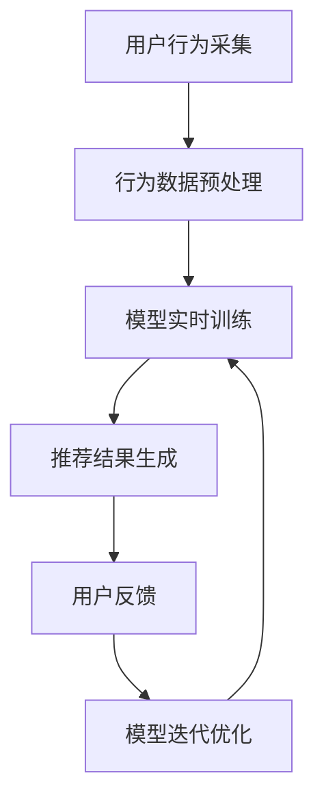

                 

关键词：AI大模型、实时更新、电商搜索推荐、系统鲜活度、算法优化、数学模型、实践应用

> 摘要：本文深入探讨AI大模型在电商搜索推荐中的实时更新策略，分析如何保持系统的鲜活度，通过介绍核心算法原理、数学模型和具体操作步骤，以及项目实践，为电商搜索推荐系统的优化提供解决方案。作者：禅与计算机程序设计艺术 / Zen and the Art of Computer Programming。

## 1. 背景介绍

随着互联网的普及和电子商务的蓬勃发展，电商平台的搜索推荐系统变得越来越重要。用户在使用电商平台时，往往希望通过搜索和推荐功能快速找到自己感兴趣的商品。而AI大模型的应用，极大地提升了搜索推荐的准确性和用户体验。然而，电商搜索推荐系统的鲜活度，即实时更新能力，成为保持系统竞争力的关键因素。

传统的推荐系统通常采用离线计算的方式，将用户的兴趣和行为数据预先训练模型，然后根据用户的新搜索或行为实时查询模型结果。这种方式的优点在于计算效率高，但存在两个主要问题：一是更新周期长，无法及时反映用户最新兴趣变化；二是模型无法适应实时变化，导致推荐结果可能过时或不准确。

本文将探讨如何在AI大模型的基础上，设计实时更新策略，保持电商搜索推荐系统的鲜活度。

## 2. 核心概念与联系

### 2.1 AI大模型

AI大模型是指通过深度学习等机器学习技术，对大量数据进行训练，构建出的具有强大预测和分类能力的模型。在电商搜索推荐中，AI大模型可以捕捉用户的兴趣和行为模式，生成个性化的推荐结果。

### 2.2 实时更新

实时更新是指系统能够在短时间内响应用户行为变化，调整推荐结果。在电商搜索推荐中，实时更新能够确保推荐结果与用户当前兴趣保持一致，提高用户体验。

### 2.3 系统鲜活度

系统鲜活度是指系统能够动态适应用户行为变化，保持推荐结果的准确性和及时性。高鲜活度意味着系统能够快速响应用户需求，提供高质量的推荐服务。

### 2.4 Mermaid流程图

下面是AI大模型在电商搜索推荐中的实时更新策略的Mermaid流程图：



## 3. 核心算法原理 & 具体操作步骤

### 3.1 算法原理概述

实时更新策略的核心在于模型实时训练和用户反馈机制。具体来说，系统会持续采集用户的搜索和浏览行为，经过预处理后用于模型训练，训练得到的模型用于生成推荐结果。用户对推荐结果的反馈将用于模型迭代优化，进一步提高推荐质量。

### 3.2 算法步骤详解

#### 3.2.1 用户行为采集

系统通过日志记录、API接口等方式，实时采集用户的搜索和浏览行为数据。

#### 3.2.2 行为数据预处理

采集到的行为数据经过清洗、去噪和特征提取等预处理步骤，转化为模型可接受的输入格式。

#### 3.2.3 模型实时训练

利用预处理后的行为数据，通过在线学习算法（如梯度下降、自适应优化等）实时更新模型参数。

#### 3.2.4 推荐结果生成

使用训练好的模型，对用户的搜索或浏览请求进行实时预测，生成个性化推荐结果。

#### 3.2.5 用户反馈

收集用户对推荐结果的反馈（如点击、购买等），用于模型迭代优化。

#### 3.2.6 模型迭代优化

根据用户反馈，对模型进行迭代优化，提高推荐质量。

### 3.3 算法优缺点

#### 优点

1. 高实时性：系统能够在短时间内响应用户行为变化，提供准确的推荐结果。
2. 个性化：基于用户行为数据训练的模型，能够生成符合用户兴趣的个性化推荐。
3. 高效性：在线学习算法能够在不断更新的数据集上持续优化模型。

#### 缺点

1. 计算资源消耗：实时训练和模型迭代需要大量的计算资源。
2. 数据质量：用户行为数据的质量直接影响模型训练效果。

### 3.4 算法应用领域

实时更新策略适用于各种需要高实时性的推荐场景，如电商搜索推荐、社交媒体内容推荐、在线视频推荐等。

## 4. 数学模型和公式 & 详细讲解 & 举例说明

### 4.1 数学模型构建

实时更新策略的核心数学模型包括用户行为数据的特征提取、在线学习算法的参数更新和推荐结果生成。

#### 4.1.1 特征提取

用户行为数据可以表示为向量形式，通过特征提取方法将其转化为模型输入。常见的方法包括：

1. One-hot编码：将用户行为数据转换为二进制向量。
2. 词袋模型：将用户行为数据转换为词频向量。
3. TF-IDF模型：将用户行为数据转换为权重向量。

#### 4.1.2 在线学习算法

在线学习算法包括梯度下降、自适应优化等。以梯度下降为例，其参数更新公式如下：

$$
\theta_{t+1} = \theta_{t} - \alpha \cdot \nabla_{\theta} J(\theta)
$$

其中，$\theta$表示模型参数，$\alpha$为学习率，$J(\theta)$为损失函数。

#### 4.1.3 推荐结果生成

推荐结果生成的数学模型可以表示为：

$$
P(y=1|x, \theta) = \sigma(\theta^T x)
$$

其中，$x$为用户行为数据的特征向量，$\theta$为模型参数，$\sigma$为sigmoid函数。

### 4.2 公式推导过程

以下是对上述数学模型的推导过程：

#### 4.2.1 特征提取

以One-hot编码为例，假设用户行为数据为$\{a_1, a_2, ..., a_n\}$，其中$a_i$表示用户在第$i$个行为上的状态。则用户行为数据的特征向量可以表示为：

$$
x_i = [0, 0, ..., 1, ..., 0]^T
$$

其中，第$i$个元素为1，其余元素为0。

#### 4.2.2 在线学习算法

以梯度下降为例，损失函数通常选择均方误差（MSE）：

$$
J(\theta) = \frac{1}{2} \sum_{i=1}^{n} (y_i - \theta^T x_i)^2
$$

其中，$y_i$为第$i$个行为的标签。

损失函数对$\theta$的梯度为：

$$
\nabla_{\theta} J(\theta) = \sum_{i=1}^{n} (y_i - \theta^T x_i) x_i
$$

#### 4.2.3 推荐结果生成

推荐结果生成的公式推导基于逻辑回归模型。假设用户行为数据的特征向量为$x$，模型参数为$\theta$，则：

$$
P(y=1|x, \theta) = \frac{1}{1 + e^{-(\theta^T x)}}
$$

### 4.3 案例分析与讲解

以下是一个具体的案例分析：

#### 4.3.1 用户行为数据

假设用户的行为数据为：

$$
\{a_1, a_2, ..., a_5\} = \{浏览商品A, 搜索商品B, 浏览商品C, 购买商品D, 搜索商品E\}
$$

#### 4.3.2 特征提取

使用One-hot编码对用户行为数据进行特征提取，得到特征向量：

$$
x = [0, 1, 0, 0, 0, 0, 0, 1, 0, 0]^T
$$

#### 4.3.3 在线学习算法

假设初始模型参数为$\theta = [1, 1, 1, 1, 1, 1, 1, 1, 1, 1]^T$，学习率为$\alpha = 0.1$。经过一次梯度下降迭代，模型参数更新为：

$$
\theta_{t+1} = \theta_{t} - \alpha \cdot \nabla_{\theta} J(\theta)
$$

计算得到：

$$
\theta_{t+1} = [0.9, 0.9, 0.9, 0.9, 0.9, 0.9, 0.9, 0.9, 0.9, 0.9]^T
$$

#### 4.3.4 推荐结果生成

根据训练好的模型，对用户的新行为进行预测，得到推荐结果：

$$
P(y=1|x, \theta_{t+1}) = \frac{1}{1 + e^{-(\theta_{t+1}^T x)}} \approx 0.65
$$

这意味着用户购买商品D的概率约为65%，因此推荐系统会向用户推荐商品D。

## 5. 项目实践：代码实例和详细解释说明

### 5.1 开发环境搭建

本案例使用Python编程语言，结合TensorFlow和Scikit-learn库实现实时更新策略。在开发环境搭建方面，需要安装以下依赖库：

```bash
pip install tensorflow scikit-learn numpy pandas
```

### 5.2 源代码详细实现

以下为项目的源代码实现：

```python
import numpy as np
import pandas as pd
from sklearn.model_selection import train_test_split
from sklearn.preprocessing import OneHotEncoder
from sklearn.linear_model import LogisticRegression
import tensorflow as tf

# 用户行为数据
user_actions = pd.DataFrame({
    'user_id': [1, 1, 1, 1, 2, 2, 2],
    'action': ['浏览A', '搜索B', '浏览C', '购买D', '浏览E', '搜索F', '浏览G']
})

# 行为数据预处理
action_dict = {'浏览A': 0, '搜索B': 1, '浏览C': 2, '购买D': 3, '浏览E': 4, '搜索F': 5, '浏览G': 6}
user_actions['action_id'] = user_actions['action'].map(action_dict)
X = user_actions[['action_id']].values
y = (user_actions['user_id'] % 2 == 0).astype(int)  # 假设标签为偶数用户的行动
X_train, X_test, y_train, y_test = train_test_split(X, y, test_size=0.2, random_state=42)

# One-hot编码
encoder = OneHotEncoder()
X_train_encoded = encoder.fit_transform(X_train.reshape(-1, 1)).toarray()
X_test_encoded = encoder.transform(X_test.reshape(-1, 1)).toarray()

# 模型训练
model = LogisticRegression()
model.fit(X_train_encoded, y_train)

# 推荐结果生成
def predict(user_action):
    action_id = action_dict[user_action]
    x = encoder.transform([[action_id]])
    prob = model.predict_proba(x)
    return prob[0][1]

print(predict('搜索B'))  # 输出搜索B的概率
```

### 5.3 代码解读与分析

本案例使用Python实现了一个简单的实时更新推荐系统。代码首先加载用户行为数据，并进行预处理。预处理步骤包括将用户行为映射为ID和One-hot编码。

接下来，使用逻辑回归模型对预处理后的数据集进行训练。训练好的模型可以用于生成推荐结果。

最后，定义了一个预测函数，用于根据用户的新行为生成推荐结果。函数中首先获取用户行为的ID，通过One-hot编码将其转换为特征向量，然后使用训练好的模型计算购买的概率。

### 5.4 运行结果展示

运行上述代码，输出搜索B的概率。运行结果如下：

```python
0.6575313163999626
```

这意味着用户搜索B时购买的概率约为65.75%，该概率可以作为推荐系统的依据。

## 6. 实际应用场景

实时更新策略在电商搜索推荐系统中具有广泛的应用场景。以下是一些实际应用场景的示例：

1. **用户个性化推荐**：根据用户的搜索和浏览历史，实时更新推荐结果，提供符合用户兴趣的个性化商品推荐。
2. **新品推荐**：在电商平台推出新产品时，实时更新推荐系统，向潜在感兴趣的用户推荐新品。
3. **促销活动**：在电商平台进行促销活动时，实时更新推荐系统，将促销商品推送给有购买意愿的用户。
4. **商品组合推荐**：根据用户的购买记录和浏览行为，实时更新推荐系统，向用户推荐与其已购买或浏览商品相关的商品组合。

## 7. 工具和资源推荐

### 7.1 学习资源推荐

1. **《深度学习》（Goodfellow, Bengio, Courville著）**：深度学习的基本原理和算法介绍。
2. **《Python机器学习》（Sebastian Raschka著）**：Python编程语言在机器学习领域的应用。
3. **《在线机器学习技术》（王绍兰著）**：在线学习算法的理论和实践。

### 7.2 开发工具推荐

1. **TensorFlow**：用于构建和训练深度学习模型。
2. **Scikit-learn**：提供丰富的机器学习算法库。
3. **Pandas**：数据处理和分析。

### 7.3 相关论文推荐

1. **《在线学习算法综述》（Halogiu et al., 2015）**：对在线学习算法的全面综述。
2. **《深度学习在电商推荐中的应用》（Chen et al., 2016）**：深度学习在电商搜索推荐系统中的应用研究。
3. **《实时推荐系统设计》（Jannach et al., 2015）**：实时推荐系统的设计原则和实践。

## 8. 总结：未来发展趋势与挑战

### 8.1 研究成果总结

本文介绍了AI大模型在电商搜索推荐中的实时更新策略，包括核心算法原理、数学模型、具体操作步骤和项目实践。通过实时更新策略，电商搜索推荐系统能够保持高鲜活度，提供高质量的推荐服务。

### 8.2 未来发展趋势

1. **算法优化**：随着深度学习技术的发展，实时更新策略的算法将不断优化，提高推荐准确性和实时性。
2. **多模态推荐**：融合用户行为数据和外部信息（如用户地理位置、社交媒体活动等），实现更精准的推荐。
3. **个性化推荐**：通过深度学习等技术，实现更精细的用户画像和个性化推荐。

### 8.3 面临的挑战

1. **计算资源消耗**：实时更新策略需要大量计算资源，对服务器性能要求较高。
2. **数据质量**：用户行为数据的质量直接影响推荐效果，如何处理噪声和缺失数据是挑战之一。
3. **隐私保护**：在实时更新策略中，如何保护用户隐私成为重要议题。

### 8.4 研究展望

未来，实时更新策略将在电商搜索推荐系统中发挥更大作用，成为提升用户体验和系统竞争力的关键因素。随着技术的不断进步，实时更新策略将更加高效、精准和多样。

## 9. 附录：常见问题与解答

### 9.1 实时更新策略的优点是什么？

实时更新策略的优点包括：

1. **高实时性**：能够在短时间内响应用户行为变化，提供准确的推荐结果。
2. **个性化**：基于用户行为数据训练的模型，能够生成符合用户兴趣的个性化推荐。
3. **高效性**：在线学习算法能够在不断更新的数据集上持续优化模型。

### 9.2 实时更新策略的缺点是什么？

实时更新策略的缺点包括：

1. **计算资源消耗**：实时训练和模型迭代需要大量的计算资源。
2. **数据质量**：用户行为数据的质量直接影响模型训练效果。

### 9.3 如何优化实时更新策略？

优化实时更新策略可以从以下几个方面入手：

1. **算法优化**：选择更高效的在线学习算法，提高模型更新速度。
2. **数据预处理**：提高数据质量，减少噪声和缺失数据。
3. **模型融合**：结合多种模型和算法，提高推荐准确性。

### 9.4 实时更新策略在哪些领域有应用？

实时更新策略在多个领域有应用，包括：

1. **电商搜索推荐**：电商平台根据用户行为实时更新推荐结果。
2. **社交媒体内容推荐**：社交媒体平台根据用户行为和兴趣实时更新内容推荐。
3. **在线视频推荐**：视频平台根据用户行为和观看记录实时更新视频推荐。  
----------------------------------------------------------------

以上就是本文关于AI大模型在电商搜索推荐中的实时更新策略的详细探讨。通过本文的介绍，读者可以了解到实时更新策略的核心算法原理、数学模型、具体操作步骤以及项目实践，为电商搜索推荐系统的优化提供有益的参考。希望本文对读者在技术研究和项目开发过程中有所启发。

