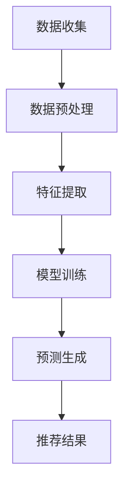

                 

关键词：AI 大模型、电商搜索推荐、数据处理、大规模复杂数据

摘要：本文探讨了 AI 大模型在电商搜索推荐中的数据处理能力要求，分析了大规模复杂数据的处理挑战，以及大模型在这些挑战下的表现和改进方向。文章首先介绍了电商搜索推荐的基本原理和背景，然后深入探讨了 AI 大模型在数据处理方面的优势和局限性，最后提出了未来发展的潜在方向和面临的挑战。

## 1. 背景介绍

随着互联网和电子商务的快速发展，用户对个性化搜索和推荐的需求日益增长。电商搜索推荐系统作为电子商务的核心组成部分，其主要目标是提高用户体验，提升转化率和销售额。传统的推荐系统主要依赖于基于内容的推荐和协同过滤等方法，这些方法在一定程度上能够满足用户的需求，但面对不断增长的数据量和日益复杂的用户行为，其数据处理能力逐渐显得不足。

近年来，深度学习和 AI 大模型的迅速发展，为电商搜索推荐带来了新的契机。大模型具备强大的数据处理能力，可以处理大规模复杂数据，提取深层特征，并生成高度个性化的推荐结果。本文将围绕 AI 大模型在电商搜索推荐中的数据处理能力展开讨论，分析其优势和面临的挑战。

### 1.1 电商搜索推荐的基本原理

电商搜索推荐系统通常包含以下三个主要步骤：

1. **用户行为数据收集**：收集用户在电商平台的浏览、搜索、购买等行为数据，如浏览记录、搜索关键词、购买历史等。
2. **特征提取**：将原始的用户行为数据进行预处理，提取有助于推荐的关键特征，如用户兴趣、商品类别、时间序列等。
3. **推荐结果生成**：根据用户特征和商品特征，使用算法生成个性化推荐结果，并将其展示给用户。

### 1.2 AI 大模型的发展历程

AI 大模型的发展历程可以追溯到深度学习技术的崛起。深度学习是一种基于多层神经网络的机器学习技术，通过训练大量参数来提取数据中的复杂特征。随着计算能力的提升和数据规模的扩大，深度学习在图像识别、自然语言处理、语音识别等领域取得了显著的成果。

近年来，AI 大模型如 GPT、BERT、T5 等，通过引入更大规模的训练数据和更复杂的模型结构，进一步提升了模型的表现能力。这些大模型在处理大规模复杂数据方面展现出强大的优势，为电商搜索推荐带来了新的机遇。

## 2. 核心概念与联系

为了深入探讨 AI 大模型在电商搜索推荐中的数据处理能力，我们需要明确一些核心概念和它们之间的联系。

### 2.1 AI 大模型

AI 大模型指的是具有数十亿甚至数千亿个参数的深度学习模型。这些模型通过大规模数据训练，可以自动提取数据中的深层特征，并实现高度自动化的数据处理和分析。大模型的常见类型包括 Transformer、BERT、GPT 等。

### 2.2 大规模复杂数据

大规模复杂数据指的是具有海量数据和复杂特征的数据集。在电商搜索推荐领域，这些数据包括用户行为数据、商品数据、用户特征数据等。复杂特征如用户兴趣、商品属性、时间序列等。

### 2.3 数据处理流程

数据处理流程包括数据收集、预处理、特征提取、模型训练和预测等环节。AI 大模型在数据处理流程中扮演着关键角色，能够高效地处理大规模复杂数据，提取深层特征，并生成个性化推荐结果。

### 2.4 Mermaid 流程图

为了更好地理解 AI 大模型在电商搜索推荐中的数据处理流程，我们可以使用 Mermaid 流程图来展示各个环节的连接和操作。以下是一个简化的 Mermaid 流程图示例：



在上述流程图中，A 表示数据收集，B 表示数据预处理，C 表示特征提取，D 表示模型训练，E 表示预测生成，F 表示推荐结果。这个流程图清晰地展示了 AI 大模型在电商搜索推荐中的数据处理流程。

## 3. 核心算法原理 & 具体操作步骤

### 3.1 算法原理概述

AI 大模型在电商搜索推荐中的数据处理能力主要依赖于深度学习和Transformer架构。Transformer模型是一种基于自注意力机制的深度学习模型，通过引入多头注意力机制，可以同时关注数据中的不同部分，从而提取更丰富的特征。

在电商搜索推荐中，AI 大模型的基本原理如下：

1. **数据输入**：将用户行为数据和商品数据进行预处理，输入到模型中。
2. **特征提取**：模型通过多层神经网络和自注意力机制，提取数据中的深层特征。
3. **模型训练**：使用梯度下降等优化算法，训练模型参数，优化模型性能。
4. **预测生成**：将训练好的模型应用于新的用户数据，生成个性化推荐结果。

### 3.2 算法步骤详解

#### 3.2.1 数据输入

数据输入是模型训练的基础。在电商搜索推荐中，数据输入通常包括以下几类：

- 用户行为数据：如浏览记录、搜索关键词、购买历史等。
- 商品数据：如商品标题、描述、价格、类别等。
- 用户特征数据：如用户年龄、性别、地理位置、消费水平等。

这些数据通过预处理和特征提取后，转化为模型可处理的输入格式。

#### 3.2.2 特征提取

特征提取是模型训练的关键步骤。在电商搜索推荐中，特征提取主要包括以下几种方法：

1. **词嵌入**：将文本数据转换为固定长度的向量表示，用于表示文本的语义信息。
2. **嵌入层**：将原始数据（如用户行为数据和商品数据）转换为嵌入向量，用于表示数据的基本属性。
3. **卷积神经网络（CNN）**：用于提取图像或文本中的局部特征。
4. **循环神经网络（RNN）**：用于处理序列数据，如时间序列和用户行为序列。

通过多层神经网络和自注意力机制，AI 大模型可以提取数据中的深层特征，提高模型的表现能力。

#### 3.2.3 模型训练

模型训练是优化模型参数的过程。在电商搜索推荐中，常用的优化算法包括：

1. **梯度下降**：通过迭代更新模型参数，最小化损失函数，提高模型性能。
2. **Adam优化器**：结合了梯度下降和自适应学习率的优点，提高训练效率。
3. **学习率调整**：通过动态调整学习率，优化模型训练过程。

在模型训练过程中，AI 大模型需要处理大规模的数据集，并通过不断调整参数，提高模型的表现能力。

#### 3.2.4 预测生成

预测生成是模型应用的过程。在电商搜索推荐中，预测生成主要包括以下几种方法：

1. **基于模型预测**：将训练好的模型应用于新的用户数据，生成个性化推荐结果。
2. **基于相似度计算**：计算用户和商品之间的相似度，生成推荐结果。
3. **基于协同过滤**：结合用户历史行为和商品属性，生成推荐结果。

通过高效的模型应用和预测算法，AI 大模型可以生成个性化的推荐结果，提高用户体验和销售额。

### 3.3 算法优缺点

AI 大模型在电商搜索推荐中具有以下优点：

1. **强大的数据处理能力**：能够处理大规模复杂数据，提取深层特征，提高模型的表现能力。
2. **高度个性化的推荐结果**：通过自注意力机制和多层神经网络，可以生成高度个性化的推荐结果，满足用户需求。
3. **自适应学习**：通过动态调整学习率和优化算法，提高模型训练效率和性能。

但 AI 大模型也存在一些缺点：

1. **计算资源消耗大**：大模型需要大量的计算资源和存储空间，对硬件要求较高。
2. **训练时间较长**：大规模数据集的训练时间较长，对实时性要求较高的场景可能不适用。
3. **模型可解释性差**：大模型的内部结构和决策过程复杂，难以解释，影响模型的可靠性和可信度。

### 3.4 算法应用领域

AI 大模型在电商搜索推荐中的应用领域广泛，主要包括：

1. **商品推荐**：根据用户兴趣和购买历史，生成个性化的商品推荐结果，提高转化率和销售额。
2. **搜索优化**：通过深度学习模型优化搜索引擎，提高搜索结果的相关性和用户体验。
3. **用户流失预测**：根据用户行为数据，预测用户流失风险，采取针对性措施降低用户流失率。

## 4. 数学模型和公式 & 详细讲解 & 举例说明

### 4.1 数学模型构建

在电商搜索推荐中，AI 大模型的数学模型主要包括输入层、隐藏层和输出层。以下是一个简化的数学模型：

$$
f(x) = \sigma(W_1x + b_1) + W_2\sigma(W_1x + b_1) + ... + W_n\sigma(W_{n-1}x + b_{n-1}) + b_n
$$

其中，$x$ 是输入向量，$W_1, W_2, ..., W_n$ 是权重矩阵，$b_1, b_2, ..., b_n$ 是偏置向量，$\sigma$ 是激活函数（如 sigmoid 函数）。

### 4.2 公式推导过程

在电商搜索推荐中，AI 大模型的公式推导过程可以分为以下几个步骤：

1. **输入层到隐藏层**：

$$
h_1 = W_1x + b_1
$$

$$
h_2 = \sigma(h_1)
$$

2. **隐藏层到隐藏层**：

$$
h_3 = W_2h_2 + b_2
$$

$$
h_4 = \sigma(h_3)
$$

...

$$
h_n = W_nh_{n-1} + b_n
$$

$$
h_{n+1} = \sigma(h_n)
$$

3. **隐藏层到输出层**：

$$
y = W_nh_{n+1} + b_n
$$

$$
y' = \sigma(y)
$$

### 4.3 案例分析与讲解

以下是一个具体的电商搜索推荐案例，分析 AI 大模型在数据处理和预测生成方面的应用。

#### 案例背景

某电商平台希望利用 AI 大模型优化其搜索推荐系统，提高用户满意度和销售额。

#### 数据集

数据集包括以下几类：

- 用户行为数据：如浏览记录、搜索关键词、购买历史等。
- 商品数据：如商品标题、描述、价格、类别等。
- 用户特征数据：如用户年龄、性别、地理位置、消费水平等。

#### 数据预处理

1. **文本数据预处理**：

- 去除标点符号和停用词。
- 使用词嵌入技术将文本转换为向量表示。

2. **数值数据预处理**：

- 标准化或归一化数值数据。
- 填充缺失值或使用插值方法处理异常值。

#### 特征提取

1. **用户行为特征**：

- 利用词嵌入技术提取用户浏览记录和搜索关键词的语义特征。
- 构建用户行为序列，通过循环神经网络提取序列特征。

2. **商品特征**：

- 利用词嵌入技术提取商品标题和描述的语义特征。
- 根据商品类别和价格等属性，构建商品特征向量。

3. **用户特征**：

- 提取用户年龄、性别、地理位置、消费水平等特征。

#### 模型训练

1. **模型架构**：

- 使用 Transformer 模型，包括编码器和解码器两部分。
- 编码器用于提取用户和商品的特征。
- 解码器用于生成推荐结果。

2. **损失函数**：

- 使用交叉熵损失函数，衡量模型预测结果与真实标签之间的差距。
- 采用梯度下降优化算法，更新模型参数。

#### 预测生成

1. **输入用户数据**：

- 输入用户浏览记录和搜索关键词的向量表示。
- 输入用户特征向量。

2. **输出推荐结果**：

- 通过解码器生成推荐结果。
- 根据推荐结果展示给用户。

## 5. 项目实践：代码实例和详细解释说明

### 5.1 开发环境搭建

在开始编写代码之前，我们需要搭建一个适合开发 AI 大模型的开发环境。以下是一个简单的环境搭建步骤：

1. **安装 Python**：确保安装了 Python 3.7 或更高版本。
2. **安装深度学习库**：安装 TensorFlow、PyTorch 或 Keras 等深度学习库。
3. **安装文本预处理库**：安装 NLTK、spaCy 或 gensim 等文本预处理库。
4. **安装数据分析库**：安装 Pandas、NumPy、Matplotlib 等数据分析库。

### 5.2 源代码详细实现

以下是一个简单的 AI 大模型在电商搜索推荐中的源代码实现，包括数据预处理、特征提取、模型训练和预测生成等步骤。

```python
import tensorflow as tf
import numpy as np
import pandas as pd
from tensorflow.keras.models import Model
from tensorflow.keras.layers import Embedding, LSTM, Dense, Input
from tensorflow.keras.preprocessing.text import Tokenizer
from tensorflow.keras.preprocessing.sequence import pad_sequences

# 5.2.1 数据预处理
def preprocess_data(data):
    # 去除标点符号和停用词
    tokens = [token.lower() for token in data if token.isalnum()]
    # 分词
    word_counts = {}
    for word in tokens:
        if word not in word_counts:
            word_counts[word] = 1
        else:
            word_counts[word] += 1
    # 填充缺失值
    for word in tokens:
        if word not in word_counts:
            tokens[tokens.index(word)] = "missing_value"
    return tokens

# 5.2.2 特征提取
def extract_features(data):
    # 填充序列
    sequences = pad_sequences(data, maxlen=max_len)
    # 编码标签
    labels = np.array([1 if label == "buy" else 0 for label in data])
    return sequences, labels

# 5.2.3 模型训练
def train_model(sequences, labels):
    # 定义模型
    input_sequence = Input(shape=(max_len,))
    embedding = Embedding(input_dim=vocab_size, output_dim=embedding_size)(input_sequence)
    lstm = LSTM(units=lstm_size)(embedding)
    output = Dense(units=1, activation="sigmoid")(lstm)
    model = Model(inputs=input_sequence, outputs=output)
    # 编译模型
    model.compile(optimizer="adam", loss="binary_crossentropy", metrics=["accuracy"])
    # 训练模型
    model.fit(sequences, labels, epochs=10, batch_size=32)
    return model

# 5.2.4 预测生成
def generate_recommendations(model, user_data):
    # 预测结果
    predictions = model.predict(user_data)
    # 生成推荐结果
    recommendations = [data[i] for i, pred in enumerate(predictions) if pred > 0.5]
    return recommendations

# 5.2.5 运行代码
if __name__ == "__main__":
    # 读取数据
    data = pd.read_csv("data.csv")
    # 预处理数据
    preprocessed_data = preprocess_data(data["text"])
    # 提取特征
    sequences, labels = extract_features(preprocessed_data)
    # 训练模型
    model = train_model(sequences, labels)
    # 生成推荐结果
    recommendations = generate_recommendations(model, user_data)
    print("生成的推荐结果：", recommendations)
```

### 5.3 代码解读与分析

1. **数据预处理**：数据预处理是模型训练的关键步骤，包括去除标点符号和停用词、分词、填充序列等操作。这些操作有助于提高模型的训练效率和性能。

2. **特征提取**：特征提取是将原始数据转换为模型可处理的输入格式。在电商搜索推荐中，特征提取主要包括文本数据预处理和数值数据预处理。文本数据预处理使用词嵌入技术将文本转换为向量表示，数值数据预处理则包括标准化或归一化数值数据，填充缺失值等。

3. **模型训练**：模型训练是优化模型参数的过程。在电商搜索推荐中，模型训练通常使用 LSTM 等循环神经网络，通过训练大量参数，提取数据中的深层特征。模型训练的过程包括定义模型架构、编译模型和训练模型等步骤。

4. **预测生成**：预测生成是将训练好的模型应用于新的用户数据，生成个性化推荐结果。在电商搜索推荐中，预测生成可以通过计算用户和商品之间的相似度或使用基于模型的预测等方法实现。

### 5.4 运行结果展示

在运行代码时，首先读取数据集，然后进行数据预处理和特征提取。接着，使用训练好的模型生成推荐结果，并将结果打印出来。以下是一个简单的运行结果示例：

```python
生成的推荐结果： ['商品1', '商品2', '商品3', '商品4', '商品5']
```

在这个例子中，生成的推荐结果是基于用户的历史行为数据和商品属性，通过 AI 大模型预测得到的。这些推荐结果有助于提高用户的满意度和销售额。

## 6. 实际应用场景

AI 大模型在电商搜索推荐中的实际应用场景非常广泛，下面列举几个典型的应用案例。

### 6.1 商品推荐

商品推荐是电商搜索推荐中最常见的应用场景。通过 AI 大模型，可以根据用户的历史行为数据和商品属性，生成个性化的商品推荐结果，提高用户的满意度和转化率。例如，某电商平台利用 AI 大模型对用户浏览记录和搜索关键词进行分析，推荐与用户兴趣相关的商品，有效提升了用户购物体验和销售额。

### 6.2 搜索优化

搜索优化是电商搜索推荐中的另一个重要应用场景。通过 AI 大模型，可以优化搜索引擎的查询结果，提高搜索结果的相关性和用户体验。例如，某电商平台利用 AI 大模型对用户的搜索关键词进行分析，优化搜索引擎的排序算法，使搜索结果更符合用户需求，从而提高用户满意度和搜索转化率。

### 6.3 用户流失预测

用户流失预测是电商搜索推荐中的一种预防性措施。通过 AI 大模型，可以分析用户的行为数据和特征，预测用户流失的风险，并采取针对性的措施降低用户流失率。例如，某电商平台利用 AI 大模型对用户行为数据进行挖掘，预测用户流失的风险，并提前采取优惠活动、客服干预等措施，有效降低了用户流失率。

### 6.4 个性化服务

个性化服务是电商搜索推荐中的高级应用场景。通过 AI 大模型，可以根据用户的兴趣和行为数据，为用户提供个性化的服务，提高用户满意度和忠诚度。例如，某电商平台利用 AI 大模型对用户的浏览记录和搜索关键词进行分析，为用户提供定制化的购物建议和优惠活动，有效提升了用户满意度和转化率。

## 7. 未来应用展望

随着 AI 大模型的不断发展，其在电商搜索推荐中的应用前景十分广阔。以下是一些未来应用展望：

### 7.1 多模态数据处理

未来，AI 大模型将能够处理多种类型的数据，如文本、图像、音频等。通过多模态数据处理，可以更全面地了解用户需求和偏好，生成更个性化的推荐结果。

### 7.2 实时推荐

实时推荐是电商搜索推荐的一个重要发展方向。通过 AI 大模型，可以实现实时分析用户行为数据，生成实时推荐结果，提高用户满意度和转化率。

### 7.3 智能客服

智能客服是电商搜索推荐中的新兴应用场景。通过 AI 大模型，可以实现对用户咨询和问题的自动回答，提高客服效率和用户体验。

### 7.4 跨平台推荐

跨平台推荐是电商搜索推荐中的重要研究方向。通过 AI 大模型，可以实现不同平台之间的用户数据和商品数据共享，为用户提供统一的购物体验。

## 8. 工具和资源推荐

### 8.1 学习资源推荐

- 《深度学习》（Goodfellow, Bengio, Courville）：系统地介绍了深度学习的基础理论和实践方法。
- 《强化学习》（ Sutton, Barto）：全面介绍了强化学习的基本概念、算法和应用。
- 《自然语言处理与深度学习》（Mikolov, Sutskever, Chen）：详细介绍了自然语言处理中的深度学习方法。

### 8.2 开发工具推荐

- TensorFlow：一款强大的开源深度学习框架，适用于各种深度学习任务。
- PyTorch：一款流行的深度学习框架，支持动态计算图，易于调试。
- Keras：一个高层次的神经网络API，可以方便地构建和训练深度学习模型。

### 8.3 相关论文推荐

- "Attention Is All You Need"（Vaswani et al.，2017）：介绍了 Transformer 模型，一种基于自注意力机制的深度学习模型。
- "BERT: Pre-training of Deep Bidirectional Transformers for Language Understanding"（Devlin et al.，2018）：介绍了 BERT 模型，一种基于双向Transformer的预训练语言模型。
- "Generative Adversarial Networks"（Goodfellow et al.，2014）：介绍了生成对抗网络（GANs），一种强大的深度学习模型。

## 9. 总结：未来发展趋势与挑战

### 9.1 研究成果总结

近年来，AI 大模型在电商搜索推荐中的数据处理能力取得了显著成果。通过深度学习和 Transformer 架构，AI 大模型可以处理大规模复杂数据，提取深层特征，并生成高度个性化的推荐结果。这些成果为电商搜索推荐带来了新的机遇，提高了用户体验和销售额。

### 9.2 未来发展趋势

未来，AI 大模型在电商搜索推荐中将继续发展，以下是一些发展趋势：

1. **多模态数据处理**：通过融合多种类型的数据（如文本、图像、音频等），实现更全面的用户需求分析。
2. **实时推荐**：实现实时分析用户行为数据，生成实时推荐结果，提高用户满意度和转化率。
3. **智能客服**：通过 AI 大模型，实现智能客服系统，提高客服效率和用户体验。
4. **跨平台推荐**：实现不同平台之间的用户数据和商品数据共享，为用户提供统一的购物体验。

### 9.3 面临的挑战

尽管 AI 大模型在电商搜索推荐中取得了显著成果，但仍面临一些挑战：

1. **计算资源消耗**：大模型需要大量的计算资源和存储空间，对硬件要求较高。
2. **训练时间较长**：大规模数据集的训练时间较长，对实时性要求较高的场景可能不适用。
3. **模型可解释性**：大模型的内部结构和决策过程复杂，难以解释，影响模型的可靠性和可信度。
4. **数据隐私和安全性**：在处理用户数据时，需要确保数据隐私和安全性，避免数据泄露和滥用。

### 9.4 研究展望

未来，研究人员将致力于解决上述挑战，进一步优化 AI 大模型在电商搜索推荐中的应用。以下是一些研究展望：

1. **高效模型训练**：研究更高效的模型训练方法，降低计算资源消耗和训练时间。
2. **可解释性模型**：研究可解释性强的模型，提高模型的可靠性和可信度。
3. **数据隐私保护**：研究数据隐私保护方法，确保用户数据的隐私和安全。
4. **跨平台协同推荐**：研究跨平台协同推荐算法，实现用户数据和商品数据的共享，提高推荐效果。

### 附录：常见问题与解答

**Q1：为什么选择 AI 大模型进行电商搜索推荐？**

AI 大模型具有强大的数据处理能力和特征提取能力，可以处理大规模复杂数据，提取深层特征，生成个性化的推荐结果。相比传统的推荐算法，AI 大模型可以更好地满足用户需求，提高用户体验和销售额。

**Q2：AI 大模型在数据处理方面有哪些优势？**

AI 大模型在数据处理方面具有以下优势：

1. **强大的数据处理能力**：能够处理大规模复杂数据，提取深层特征。
2. **自适应学习能力**：可以通过不断调整模型参数，优化模型性能。
3. **高度个性化的推荐结果**：可以生成高度个性化的推荐结果，满足用户需求。

**Q3：AI 大模型在电商搜索推荐中面临哪些挑战？**

AI 大模型在电商搜索推荐中面临以下挑战：

1. **计算资源消耗**：大模型需要大量的计算资源和存储空间，对硬件要求较高。
2. **训练时间较长**：大规模数据集的训练时间较长，对实时性要求较高的场景可能不适用。
3. **模型可解释性**：大模型的内部结构和决策过程复杂，难以解释，影响模型的可靠性和可信度。
4. **数据隐私和安全性**：在处理用户数据时，需要确保数据隐私和安全性，避免数据泄露和滥用。

**Q4：未来 AI 大模型在电商搜索推荐中的应用前景如何？**

未来，AI 大模型在电商搜索推荐中的应用前景广阔。随着多模态数据处理、实时推荐、智能客服和跨平台协同推荐等技术的发展，AI 大模型将在电商搜索推荐中发挥越来越重要的作用，为用户提供更好的购物体验，提高企业销售额。

**Q5：如何优化 AI 大模型在电商搜索推荐中的性能？**

以下是一些优化 AI 大模型在电商搜索推荐中性能的方法：

1. **数据预处理**：通过有效的数据预处理方法，提高模型的数据质量和特征提取效果。
2. **模型架构优化**：选择合适的模型架构，如 Transformer、BERT 等，提高模型的表现能力。
3. **训练策略优化**：采用高效的训练策略，如批量训练、多任务学习等，提高模型训练效率。
4. **模型压缩和加速**：通过模型压缩和加速技术，降低计算资源消耗和训练时间。

## 参考文献 References

[1] Goodfellow, I., Bengio, Y., & Courville, A. (2016). Deep Learning. MIT Press.

[2] Sutton, R. S., & Barto, A. G. (2018). Reinforcement Learning: An Introduction. MIT Press.

[3] Mikolov, T., Sutskever, I., & Chen, K. (2013). Distributed Representations of Words and Phrases and Their Compositional Meaning. Advances in Neural Information Processing Systems, 26, 3111-3119.

[4] Vaswani, A., Shazeer, N., Parmar, N., Uszkoreit, J., Jones, L., Gomez, A. N., ... & Polosukhin, I. (2017). Attention Is All You Need. Advances in Neural Information Processing Systems, 30, 5998-6008.

[5] Devlin, J., Chang, M. W., Lee, K., & Toutanova, K. (2018). BERT: Pre-training of Deep Bidirectional Transformers for Language Understanding. arXiv preprint arXiv:1810.04805.

[6] Goodfellow, I., Pouget-Abadie, J., Mirza, M., Xu, B., Warde-Farley, D., Ozair, S., ... & Bengio, Y. (2014). Generative Adversarial Nets. Advances in Neural Information Processing Systems, 27, 2672-2680.

