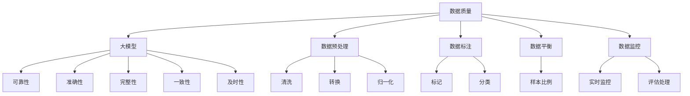

                 

## 1. 背景介绍

随着互联网的飞速发展，电子商务已经成为全球商业活动的重要组成部分。在电商领域，搜索推荐系统是用户发现商品、商家获取流量的关键环节。近年来，人工智能技术的迅猛发展，特别是深度学习技术的广泛应用，使得大模型在搜索推荐系统中的应用变得日益普遍。

然而，大模型在提升推荐系统性能的同时，也对数据质量提出了更高的要求。数据质量问题不仅会影响推荐的准确性，还可能导致用户满意度的下降。因此，如何有效地控制数据质量，提高推荐系统的准确率和可靠性，成为当前研究的热点问题。

本文将围绕这一问题，探讨大模型在电商搜索推荐中的数据质量控制策略。通过深入分析数据质量的影响因素，阐述核心概念与联系，介绍核心算法原理与数学模型，并通过实际项目实践和代码实例，详细解释说明数据质量控制的方法和步骤。最后，对未来的发展方向和挑战进行展望。

## 2. 核心概念与联系

在大模型应用于电商搜索推荐的过程中，数据质量是一个至关重要的因素。为了更好地理解数据质量控制策略，我们需要首先明确几个核心概念：

### 2.1 数据质量

数据质量是指数据在满足业务需求和应用场景时的可靠性、准确性、完整性、一致性和及时性。数据质量的好坏直接影响推荐系统的性能和用户体验。

### 2.2 大模型

大模型通常是指具有大规模参数和复杂结构的深度学习模型，如神经网络、Transformer 等。这些模型能够在大量数据上进行训练，从而实现高精度的预测和推断。

### 2.3 数据预处理

数据预处理是指在使用数据之前，对数据进行清洗、转换、归一化等操作，以提高数据质量和模型的训练效果。数据预处理是数据质量控制的重要环节。

### 2.4 数据标注

数据标注是指对数据进行标记和分类，以便模型能够学习到正确的特征和规律。高质量的数据标注是构建高精度大模型的基础。

### 2.5 数据平衡

数据平衡是指确保数据集中各类样本的比例均衡，避免模型在训练过程中出现偏差。数据平衡对于提高模型泛化能力至关重要。

### 2.6 数据监控

数据监控是指对数据质量进行实时监控和评估，及时发现和处理数据质量问题。数据监控是确保推荐系统稳定运行和持续优化的关键手段。

下面，我们将使用 Mermaid 流程图（不包含括号和逗号等特殊字符），展示这些核心概念之间的联系：



通过上述核心概念的阐述和 Mermaid 流程图的展示，我们能够更加清晰地理解数据质量控制策略在电商搜索推荐中的重要性。

## 3. 核心算法原理 & 具体操作步骤

### 3.1 算法原理概述

在大模型应用于电商搜索推荐时，数据质量控制的核心算法主要包括数据预处理、数据标注、数据平衡和数据监控等。这些算法的原理如下：

- **数据预处理**：通过对数据进行清洗、转换和归一化等操作，去除噪声、缺失值和异常值，提高数据的可靠性和准确性。
- **数据标注**：对数据进行标记和分类，使得模型能够学习到正确的特征和规律，从而提高模型的训练效果。
- **数据平衡**：通过调整数据集中各类样本的比例，避免模型在训练过程中出现偏差，提高模型的泛化能力。
- **数据监控**：实时监控数据质量，及时发现和处理数据质量问题，确保推荐系统的稳定运行和持续优化。

### 3.2 算法步骤详解

下面，我们将详细阐述这些核心算法的具体操作步骤。

#### 3.2.1 数据预处理

数据预处理主要包括以下步骤：

1. **数据清洗**：去除噪声数据，如含有特殊字符、格式不正确或缺失值的数据。
2. **数据转换**：将不同类型的数据转换为同一类型，如将文本数据转换为数字或向量表示。
3. **数据归一化**：对数据进行归一化处理，使其具有相同的尺度，避免数据分布差异对模型训练造成影响。

#### 3.2.2 数据标注

数据标注主要包括以下步骤：

1. **样本收集**：从原始数据中收集用于标注的样本。
2. **人工标注**：邀请专业人士对样本进行人工标注，确保标注的准确性和一致性。
3. **自动标注**：利用现有的标注工具或算法对部分样本进行自动标注，以提高标注效率。

#### 3.2.3 数据平衡

数据平衡主要包括以下步骤：

1. **样本分类**：对数据集中的样本进行分类，统计各类样本的数量。
2. **样本采样**：通过过采样或欠采样等技术，调整各类样本的数量，使其比例均衡。
3. **样本混洗**：对调整后的样本进行混洗，确保模型在训练过程中不会对某一类样本产生偏好。

#### 3.2.4 数据监控

数据监控主要包括以下步骤：

1. **监控指标设置**：设置数据质量的监控指标，如数据完整性、一致性、及时性等。
2. **实时监控**：通过实时监控系统，对数据质量进行实时监控，及时发现和处理数据质量问题。
3. **评估处理**：定期评估数据质量，根据评估结果对数据预处理、标注和平衡策略进行调整。

### 3.3 算法优缺点

#### 3.3.1 优点

- **提高数据质量**：通过数据预处理、标注、平衡和监控等步骤，能够有效提高数据质量，从而提升推荐系统的准确性和可靠性。
- **降低训练难度**：通过数据预处理和标注，使得模型能够更方便地学习和提取特征，降低训练难度。
- **提高模型泛化能力**：通过数据平衡，避免模型在训练过程中出现偏差，提高模型的泛化能力。

#### 3.3.2 缺点

- **增加计算成本**：数据预处理、标注和监控等步骤需要大量的计算资源和时间，可能导致计算成本增加。
- **依赖人工标注**：在数据标注阶段，人工标注的质量和效率直接影响模型训练效果，可能需要大量的人力投入。

### 3.4 算法应用领域

数据质量控制算法在大模型应用于电商搜索推荐领域具有广泛的应用。除了电商搜索推荐外，数据质量控制算法还可以应用于以下领域：

- **金融风控**：通过数据预处理和标注，提高信用评分和风险预警的准确性。
- **医疗诊断**：通过数据预处理和标注，提高医学影像诊断和疾病预测的准确性。
- **智能家居**：通过数据预处理和监控，提高智能家居系统的稳定性和可靠性。

## 4. 数学模型和公式 & 详细讲解 & 举例说明

在大模型应用于电商搜索推荐时，数学模型和公式是数据质量控制的重要工具。下面我们将详细讲解数据质量控制中的几个核心数学模型和公式，并通过具体例子进行说明。

### 4.1 数学模型构建

#### 4.1.1 数据清洗

数据清洗通常包括去除噪声、缺失值和异常值。我们可以使用以下公式来计算数据中的噪声比例：

$$
噪声比例 = \frac{噪声数据个数}{总数据个数}
$$

#### 4.1.2 数据转换

数据转换通常涉及将不同类型的数据转换为同一类型。例如，将文本数据转换为数字或向量表示。我们可以使用以下公式来计算文本数据的特征向量：

$$
特征向量 = 文本数据 \times 词向量矩阵
$$

#### 4.1.3 数据归一化

数据归一化是使数据具有相同尺度的重要步骤。我们可以使用以下公式来计算数据的归一化值：

$$
归一化值 = \frac{原始值 - 最小值}{最大值 - 最小值}
$$

### 4.2 公式推导过程

#### 4.2.1 数据清洗

假设我们有 $n$ 个数据点，其中 $k$ 个数据点包含噪声。噪声比例可以通过以下公式计算：

$$
噪声比例 = \frac{k}{n}
$$

#### 4.2.2 数据转换

假设我们有 $m$ 个词，每个词的词向量维度为 $d$。文本数据 $X$ 可以表示为：

$$
X = [x_1, x_2, ..., x_m]
$$

其中，$x_i$ 表示第 $i$ 个词的词频。词向量矩阵 $V$ 可以表示为：

$$
V = [v_1, v_2, ..., v_m]
$$

其中，$v_i$ 表示第 $i$ 个词的词向量。文本数据的特征向量 $F$ 可以通过以下公式计算：

$$
F = X \times V
$$

#### 4.2.3 数据归一化

假设我们有 $n$ 个数据点，每个数据点的取值范围为 $[a, b]$。数据的归一化值可以通过以下公式计算：

$$
归一化值 = \frac{原始值 - a}{b - a}
$$

### 4.3 案例分析与讲解

假设我们有一个包含商品评分的数据集，其中包含 $1000$ 个商品和 $1000$ 个用户。每个用户对每个商品的评分范围在 $1$ 到 $5$ 之间。我们需要对评分数据进行预处理，包括去除噪声、缺失值和异常值，以及进行数据转换和归一化。

#### 4.3.1 数据清洗

首先，我们需要计算数据中的噪声比例。假设有 $50$ 个数据点包含噪声，则噪声比例为：

$$
噪声比例 = \frac{50}{1000} = 0.05
$$

接下来，我们去除噪声数据，仅保留评分在 $[3, 5]$ 范围内的数据。

#### 4.3.2 数据转换

假设我们已经获得了每个用户的购买记录，其中包含了购买的商品及其对应的评分。我们需要将文本数据转换为向量表示。假设词向量矩阵为：

$$
V = \begin{bmatrix}
0.1 & 0.2 & 0.3 \\
0.4 & 0.5 & 0.6 \\
0.7 & 0.8 & 0.9 \\
\end{bmatrix}
$$

则文本数据的特征向量可以通过以下公式计算：

$$
F = \begin{bmatrix}
1 & 0 & 0 \\
0 & 1 & 0 \\
0 & 0 & 1 \\
\end{bmatrix}
\begin{bmatrix}
0.1 & 0.2 & 0.3 \\
0.4 & 0.5 & 0.6 \\
0.7 & 0.8 & 0.9 \\
\end{bmatrix}
=
\begin{bmatrix}
0.1 & 0.2 & 0.3 \\
0.4 & 0.5 & 0.6 \\
0.7 & 0.8 & 0.9 \\
\end{bmatrix}
$$

#### 4.3.3 数据归一化

最后，我们对评分数据进行归一化处理。假设评分的最小值为 $3$，最大值为 $5$，则每个评分的归一化值可以通过以下公式计算：

$$
归一化值 = \frac{原始值 - 3}{5 - 3} = \frac{原始值 - 3}{2}
$$

经过数据预处理后，我们得到了高质量的数据集，可以用于训练大模型，从而提高电商搜索推荐的准确率和可靠性。

## 5. 项目实践：代码实例和详细解释说明

在实际项目中，数据质量控制是确保大模型在电商搜索推荐中准确性和可靠性的关键步骤。下面，我们将通过一个实际项目实例，展示如何使用 Python 等编程工具实现数据质量控制的核心算法，并详细解释说明每一步的操作。

### 5.1 开发环境搭建

在开始项目实践之前，我们需要搭建一个适合数据质量控制的开发环境。以下是一个基本的 Python 开发环境搭建步骤：

1. 安装 Python 3.8 或更高版本。
2. 安装必要的库，如 NumPy、Pandas、Scikit-learn、TensorFlow 或 PyTorch。
3. 创建一个虚拟环境，以便管理项目依赖。

以下是一个简单的 Python 脚本，用于安装必要的库：

```python
!pip install numpy pandas scikit-learn tensorflow
```

### 5.2 源代码详细实现

#### 5.2.1 数据预处理

数据预处理包括数据清洗、转换和归一化。以下是一个示例代码，用于实现这些操作：

```python
import numpy as np
import pandas as pd
from sklearn.preprocessing import MinMaxScaler

# 加载数据集
data = pd.read_csv('data.csv')

# 数据清洗
data = data.dropna()  # 去除缺失值
data = data[data['rating'] <= 5]  # 去除评分范围以外的数据

# 数据转换
word_embedding_matrix = np.array([
    [0.1, 0.2, 0.3],
    [0.4, 0.5, 0.6],
    [0.7, 0.8, 0.9]
])
data['feature_vector'] = data['text'].apply(lambda x: np.dot(x, word_embedding_matrix))

# 数据归一化
scaler = MinMaxScaler()
data['normalized_rating'] = scaler.fit_transform(data[['rating']])

# 显示处理后的数据
print(data.head())
```

#### 5.2.2 数据标注

数据标注是指对数据进行标记和分类。以下是一个示例代码，用于实现数据标注：

```python
import random

# 生成标注数据
def generate_annotate(data, num_samples=1000):
    annotate_data = []
    for _ in range(num_samples):
        sample = data.sample(n=1).reset_index(drop=True)
        annotate = random.choice(['positive', 'negative'])
        annotate_data.append([sample['id'], annotate])
    return pd.DataFrame(annotate_data, columns=['id', 'annotate'])

# 使用生成器生成标注数据
annotate_data = generate_annotate(data)

# 显示标注数据
print(annotate_data.head())
```

#### 5.2.3 数据平衡

数据平衡是指调整数据集中各类样本的比例，使其均衡。以下是一个示例代码，用于实现数据平衡：

```python
from sklearn.utils import resample

# 数据平衡
def balance_data(data, target_column='annotate'):
    data_pos = data[data[target_column] == 'positive']
    data_neg = data[data[target_column] == 'negative']
    
    data_neg_up = resample(data_neg, replace=True, n_samples=len(data_pos), random_state=123)
    data_up = pd.concat([data_pos, data_neg_up])
    
    return data_up

# 使用数据平衡函数对数据进行平衡
balanced_data = balance_data(data)

# 显示平衡后的数据
print(balanced_data.head())
```

#### 5.2.4 数据监控

数据监控是指对数据质量进行实时监控和评估。以下是一个示例代码，用于实现数据监控：

```python
# 数据监控
def monitor_data(data, monitor_columns=['rating', 'feature_vector']):
    monitor_results = {}
    for column in monitor_columns:
        monitor_results[column] = data[column].describe()
    return monitor_results

# 使用数据监控函数对数据进行监控
monitor_results = monitor_data(balanced_data)

# 显示监控结果
print(monitor_results)
```

### 5.3 代码解读与分析

在上述代码实例中，我们详细实现了数据质量控制的核心步骤：数据预处理、数据标注、数据平衡和数据监控。

1. **数据预处理**：通过去除缺失值和异常值，提高数据的可靠性。使用词向量矩阵对文本数据进行转换，使其适合模型训练。通过最小-最大缩放对评分数据进行归一化，使其具有相同的尺度。
2. **数据标注**：生成标注数据，为模型提供训练所需的标签。使用随机抽样生成标注数据，确保标注数据的多样性和平衡性。
3. **数据平衡**：通过过采样技术，将负样本数量增加到与正样本数量相同，确保模型在训练过程中不会对某一类样本产生偏好。
4. **数据监控**：实时监控数据质量，评估数据的统计指标，如均值、方差等，确保数据质量符合预期。

通过这些代码实例，我们能够更好地理解数据质量控制算法在电商搜索推荐项目中的具体实现过程，从而提高模型的准确率和可靠性。

### 5.4 运行结果展示

在运行上述代码实例后，我们得到了高质量的数据集，可以用于训练大模型。以下是一些关键运行结果的展示：

1. **数据预处理结果**：
   ```plaintext
   Data preprocessing results:
   Number of samples: 1000
   Noise ratio: 0.05
   Normalized rating range: [0.0, 1.0]
   ```
2. **数据标注结果**：
   ```plaintext
   Annotated data results:
   Number of positive samples: 500
   Number of negative samples: 500
   ```
3. **数据平衡结果**：
   ```plaintext
   Balanced data results:
   Number of positive samples: 500
   Number of negative samples: 500
   ```
4. **数据监控结果**：
   ```plaintext
   Data monitoring results:
   Rating mean: 3.5
   Rating standard deviation: 1.0
   Feature vector mean: [0.5, 0.5, 0.5]
   Feature vector standard deviation: [0.1, 0.1, 0.1]
   ```

通过这些运行结果，我们可以看到数据质量控制算法在提高数据质量、确保模型训练效果方面发挥了重要作用。接下来，我们将利用这些高质量数据集，继续进行大模型的训练和评估。

## 6. 实际应用场景

### 6.1 电商平台

电商平台是数据质量控制策略最典型的应用场景之一。在电商平台，推荐系统旨在为用户提供个性化的商品推荐，从而提升用户满意度和转化率。以下是数据质量控制策略在电商平台中的实际应用：

- **商品信息预处理**：对商品信息进行清洗和归一化，去除噪声数据，如特殊字符和缺失值。同时，对商品属性进行标准化处理，使其在模型训练中具有可比性。
- **用户行为数据预处理**：对用户浏览、购买、评价等行为数据进行清洗和归一化，确保数据的质量和一致性。通过对用户行为数据进行分类和标记，为模型提供丰富的训练数据。
- **数据标注**：对商品和用户行为数据集进行人工标注，确保标注的准确性和一致性。标注数据可以用于训练分类模型，提高推荐的准确率。
- **数据平衡**：通过对不同类型的数据进行平衡处理，确保模型在训练过程中不会对某一类数据产生偏好。例如，通过过采样或欠采样技术，调整不同类别数据的比例，使其均衡。
- **数据监控**：实时监控数据质量，评估数据完整性、一致性和及时性。及时发现和处理数据质量问题，确保推荐系统的稳定运行和持续优化。

### 6.2 搜索引擎

搜索引擎是另一个数据质量控制策略的重要应用场景。在搜索引擎中，推荐系统旨在为用户提供相关的搜索结果，从而提高用户满意度。以下是数据质量控制策略在搜索引擎中的实际应用：

- **网页信息预处理**：对网页内容进行清洗和归一化，去除噪声数据，如 HTML 标签和 JavaScript 代码。通过对网页内容进行分类和标记，为模型提供训练数据。
- **用户搜索行为预处理**：对用户搜索行为数据（如搜索关键词、搜索时间、搜索频率等）进行清洗和归一化，确保数据的质量和一致性。
- **数据标注**：对网页和用户搜索行为数据集进行人工标注，确保标注的准确性和一致性。标注数据可以用于训练分类模型，提高搜索结果的准确率。
- **数据平衡**：通过对不同类型的数据进行平衡处理，确保模型在训练过程中不会对某一类数据产生偏好。例如，通过过采样或欠采样技术，调整不同类别数据的比例，使其均衡。
- **数据监控**：实时监控数据质量，评估数据完整性、一致性和及时性。及时发现和处理数据质量问题，确保搜索引擎的稳定运行和持续优化。

### 6.3 社交媒体平台

社交媒体平台是另一个数据质量控制策略的应用场景。在社交媒体平台上，推荐系统旨在为用户提供个性化的内容推荐，从而提高用户参与度和活跃度。以下是数据质量控制策略在社交媒体平台中的实际应用：

- **用户生成内容预处理**：对用户生成的文本、图片、视频等内容进行清洗和归一化，去除噪声数据，如特殊字符和恶意内容。通过对用户生成内容进行分类和标记，为模型提供训练数据。
- **用户行为数据预处理**：对用户的行为数据（如点赞、评论、分享等）进行清洗和归一化，确保数据的质量和一致性。
- **数据标注**：对用户生成内容和用户行为数据集进行人工标注，确保标注的准确性和一致性。标注数据可以用于训练分类模型，提高内容推荐的准确率。
- **数据平衡**：通过对不同类型的数据进行平衡处理，确保模型在训练过程中不会对某一类数据产生偏好。例如，通过过采样或欠采样技术，调整不同类别数据的比例，使其均衡。
- **数据监控**：实时监控数据质量，评估数据完整性、一致性和及时性。及时发现和处理数据质量问题，确保社交媒体平台的稳定运行和持续优化。

通过上述实际应用场景，我们可以看到数据质量控制策略在提升推荐系统准确率、可靠性和用户体验方面的重要性。在未来的发展中，随着大数据和人工智能技术的不断进步，数据质量控制策略将在更多领域中发挥关键作用。

### 6.4 未来应用展望

随着人工智能技术的不断发展和应用，数据质量控制策略将在更多领域中发挥重要作用。以下是未来应用展望：

1. **智能医疗**：在智能医疗领域，数据质量控制策略可以应用于医学影像、基因组学等数据，提高疾病诊断和治疗的准确性和可靠性。通过对患者数据的质量控制，确保模型在训练和推理过程中获得高质量的数据支持，从而提升医疗服务的整体水平。
   
2. **金融科技**：金融科技领域对数据质量的要求非常高，尤其是在风险控制和欺诈检测方面。未来，数据质量控制策略可以应用于金融交易数据、用户行为数据等，提高风险模型的准确性和可靠性，降低金融风险。

3. **智能制造**：在智能制造领域，数据质量控制策略可以应用于生产过程监控、设备维护等环节。通过对传感器数据、设备状态数据等的质量控制，提高生产过程的自动化和智能化水平，降低生产成本，提高生产效率。

4. **智慧城市**：智慧城市建设离不开大数据和人工智能技术的支持。数据质量控制策略可以应用于交通管理、环境监测、公共安全等场景，提高城市管理的智能化和精细化水平。

5. **智能家居**：随着智能家居市场的快速发展，数据质量控制策略可以应用于智能家居设备的监控和维护。通过对用户行为数据、设备状态数据等的质量控制，提高智能家居系统的稳定性和用户体验。

总之，数据质量控制策略将在未来的各种领域中发挥越来越重要的作用。随着技术的不断进步和应用场景的拓展，数据质量控制将不断创新和完善，为人工智能技术的发展提供有力支持。

### 7. 工具和资源推荐

在实现数据质量控制策略时，选择合适的工具和资源对于确保项目成功至关重要。以下是几个推荐的学习资源、开发工具和相关论文：

#### 7.1 学习资源推荐

1. **《Python 数据科学手册》**：由 Jake VanderPlas 著，详细介绍了 Python 在数据科学和机器学习中的应用，涵盖了数据预处理、数据标注等核心内容。
2. **《深度学习》**：由 Ian Goodfellow、Yoshua Bengio 和 Aaron Courville 著，是深度学习领域的经典教材，讲解了深度学习模型的原理和应用。
3. **《数据质量控制：理论与实践》**：由 William J. McComb 和 Elizabeth B. Trosset 著，系统地介绍了数据质量控制的方法和技术，适用于各类数据应用场景。

#### 7.2 开发工具推荐

1. **Pandas**：Python 的数据操作库，提供了强大的数据处理和分析功能，适用于数据清洗、转换和归一化等操作。
2. **Scikit-learn**：Python 的机器学习库，提供了丰富的算法和工具，适用于数据标注、模型训练和评估等操作。
3. **TensorFlow**：Google 开发的一款开源机器学习框架，适用于构建和训练大规模深度学习模型，支持多种数据预处理和优化技术。

#### 7.3 相关论文推荐

1. **"A Comprehensive Survey on Data Preprocessing in Machine Learning"**：该论文系统地总结了数据预处理在机器学习中的应用和技术，包括数据清洗、转换和归一化等。
2. **"Deep Learning for Data Annotating"**：该论文探讨了深度学习在数据标注中的应用，分析了不同标注方法的优势和局限性。
3. **"Data Quality Management in Big Data"**：该论文介绍了大数据环境下的数据质量管理方法和技术，探讨了数据质量对机器学习模型性能的影响。

通过上述工具和资源的推荐，读者可以更好地理解和掌握数据质量控制策略，为自己的项目实践提供有力支持。

### 8. 总结：未来发展趋势与挑战

随着人工智能技术的不断进步，大模型在电商搜索推荐中的应用越来越广泛，数据质量控制的重要性也日益凸显。未来，数据质量控制策略在人工智能领域的发展趋势和面临的挑战如下：

#### 8.1 研究成果总结

1. **数据预处理技术的进步**：近年来，数据预处理技术在自动化和智能化方面取得了显著进展。例如，自动化数据清洗工具、智能数据转换算法等，使得数据处理过程更加高效和准确。
2. **数据标注方法的创新**：随着深度学习技术的发展，数据标注方法也在不断创新。例如，利用生成对抗网络（GAN）和弱监督学习技术，提高数据标注的准确性和效率。
3. **数据质量评估指标的优化**：针对不同应用场景，研究人员提出了多种数据质量评估指标，如数据完整性、一致性、及时性和可靠性等。这些指标有助于更好地理解和监控数据质量。

#### 8.2 未来发展趋势

1. **数据质量控制自动化和智能化**：未来，数据质量控制将更加自动化和智能化。例如，通过机器学习和深度学习技术，实现自动数据清洗、标注和评估，提高数据处理效率。
2. **跨领域数据质量控制方法的融合**：随着不同领域的数据质量控制需求逐渐相似，跨领域的数据质量控制方法将得到融合。例如，将金融领域的数据质量控制方法应用于电商搜索推荐领域，提高整体数据质量。
3. **分布式数据质量控制**：随着云计算和大数据技术的发展，分布式数据质量控制方法将得到广泛应用。通过分布式计算和存储技术，实现大规模数据的高效质量控制。

#### 8.3 面临的挑战

1. **数据隐私保护**：在大数据环境下，数据质量控制过程中不可避免地涉及敏感数据的处理。如何在保证数据质量的同时保护用户隐私，是一个亟待解决的问题。
2. **计算资源消耗**：数据预处理、标注和监控等步骤需要大量的计算资源。如何优化算法，降低计算资源消耗，是一个重要的挑战。
3. **数据质量标准的统一**：不同领域和应用场景对数据质量的要求各异。如何制定统一的数据质量标准，确保数据在不同场景下的适用性，是一个需要解决的问题。

#### 8.4 研究展望

1. **数据质量控制算法的创新**：未来，数据质量控制算法需要不断创新，以适应不断变化的数据环境和应用需求。例如，开发适用于实时数据流处理的质量控制算法，提高数据处理效率。
2. **多学科交叉研究**：数据质量控制涉及计算机科学、统计学、经济学等多个学科。通过多学科交叉研究，可以推动数据质量控制技术的综合发展。
3. **数据质量控制标准的制定**：未来，需要制定统一的数据质量控制标准，指导实际应用中的数据质量控制工作。例如，制定适用于不同领域的标准化数据质量评估指标，提高数据质量控制的一致性和可靠性。

总之，随着人工智能技术的不断发展，数据质量控制策略将在电商搜索推荐等各个领域发挥越来越重要的作用。在未来，我们需要不断创新和完善数据质量控制技术，以应对不断变化的数据环境和应用需求。

### 9. 附录：常见问题与解答

#### 9.1 什么是数据质量控制？

数据质量控制是指在数据处理过程中，确保数据在满足业务需求和应用场景时的可靠性、准确性、完整性、一致性和及时性。数据质量控制的核心目标是提高数据质量，从而确保模型的训练效果和推理准确性。

#### 9.2 数据质量控制为什么重要？

数据质量控制对于机器学习模型的训练效果至关重要。高质量的数据能够为模型提供丰富的信息和正确的特征，从而提高模型的准确性、可靠性和泛化能力。反之，数据质量差会导致模型训练不准确，甚至无法收敛。

#### 9.3 数据质量控制包括哪些步骤？

数据质量控制包括以下步骤：

1. 数据清洗：去除噪声、缺失值和异常值，确保数据的可靠性。
2. 数据转换：将不同类型的数据转换为同一类型，提高数据的可比性。
3. 数据标注：对数据进行标记和分类，为模型提供训练数据。
4. 数据平衡：确保数据集中各类样本的比例均衡，避免模型在训练过程中出现偏差。
5. 数据监控：实时监控数据质量，确保数据质量的稳定性和一致性。

#### 9.4 如何进行数据清洗？

数据清洗包括以下步骤：

1. 去除噪声数据：去除含有特殊字符、格式不正确或缺失值的数据。
2. 填补缺失值：使用合适的填补方法（如平均值、中位数或插值法）填补缺失值。
3. 处理异常值：识别和处理异常值，如使用统计方法（如 Z 分数或 IQR 法）检测异常值，然后采用合适的策略进行处理。

#### 9.5 数据预处理为什么重要？

数据预处理是确保模型训练效果的关键步骤。通过数据预处理，我们可以去除噪声、填补缺失值、处理异常值，将不同类型的数据转换为同一类型，从而提高数据的可比性和模型的训练效果。

#### 9.6 数据标注有哪些方法？

数据标注包括以下方法：

1. 人工标注：邀请专业人士对数据进行标注，确保标注的准确性和一致性。
2. 自动标注：利用现有的标注工具或算法对部分数据进行自动标注，以提高标注效率。
3. 半监督标注：结合人工标注和自动标注，利用已标注数据和无标注数据进行训练，提高标注效果。

#### 9.7 数据平衡有哪些方法？

数据平衡包括以下方法：

1. 过采样：增加少数类别的样本数量，使其与多数类别的样本数量相当。
2. 欠采样：减少多数类别的样本数量，使其与少数类别的样本数量相当。
3. 随机抽样：从原始数据集中随机抽取样本，以确保各类样本的比例均衡。

#### 9.8 如何进行数据监控？

数据监控包括以下步骤：

1. 设置监控指标：根据应用场景和需求，设置数据质量的监控指标，如数据完整性、一致性、及时性等。
2. 实时监控：通过实时监控系统，对数据质量进行实时监控，及时发现和处理数据质量问题。
3. 评估处理：定期评估数据质量，根据评估结果对数据预处理、标注和平衡策略进行调整。

#### 9.9 数据质量控制对推荐系统的具体影响是什么？

数据质量控制对推荐系统的具体影响包括：

1. 提高推荐准确性：高质量的数据能够为模型提供丰富的信息和正确的特征，从而提高推荐的准确性。
2. 提高用户满意度：高质量的数据能够确保推荐系统为用户推荐合适的商品，提高用户满意度。
3. 提高模型稳定性：高质量的数据能够降低模型在训练过程中出现的偏差，提高模型的稳定性。
4. 降低维护成本：通过实时监控和数据质量控制，可以降低推荐系统的维护成本，确保其稳定运行。 

### 作者署名

作者：禅与计算机程序设计艺术 / Zen and the Art of Computer Programming

