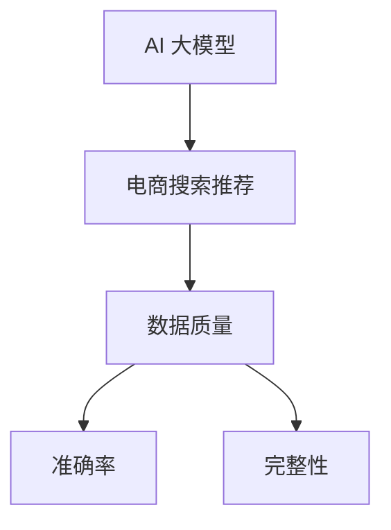

                 

关键词：AI 大模型、电商搜索推荐、数据质量、准确率、完整性

摘要：本文探讨了 AI 大模型在电商搜索推荐中的重要性，分析了数据质量对推荐系统性能的影响，并深入研究了准确率和完整性两个关键指标。通过详细阐述核心概念、算法原理、数学模型、项目实践及未来应用展望，本文为电商领域提供了一份全面的数据质量优化指南。

## 1. 背景介绍

随着互联网的普及和电子商务的快速发展，电商平台的用户数量呈指数级增长。为了满足用户个性化的购物需求，电商平台不断引入人工智能技术，尤其是大模型，以实现高效、精准的搜索推荐。大模型具有处理海量数据、复杂特征提取和关联分析的能力，能够为用户推荐更加贴合其兴趣和偏好的商品。

然而，在大模型的应用过程中，数据质量成为决定推荐系统性能的关键因素。准确率和完整性是数据质量评估的两个重要指标。准确率反映了推荐系统识别用户兴趣和需求的准确性，而完整性则关注推荐系统在数据缺失情况下的表现。本文将围绕这两个指标，深入探讨大模型在电商搜索推荐中的数据质量要求。

## 2. 核心概念与联系

为了更好地理解数据质量对电商搜索推荐的影响，我们首先介绍一些核心概念，并通过 Mermaid 流程图展示相关架构。

### 2.1 核心概念

- **AI 大模型**：一种基于深度学习的复杂模型，能够处理大规模、高维度的数据。
- **电商搜索推荐**：基于用户历史行为、兴趣标签和商品属性等信息，为用户提供个性化的商品推荐。
- **数据质量**：数据在准确性、完整性、一致性、时效性等方面的表现。
- **准确率**：推荐系统成功识别用户兴趣的比率。
- **完整性**：推荐系统在数据缺失情况下的表现能力。

### 2.2 核心概念联系



通过上述核心概念的联系，我们可以看出，数据质量对电商搜索推荐的准确率和完整性具有重要影响。接下来，我们将详细讨论准确率和完整性的概念、评估方法及优化策略。

## 3. 核心算法原理 & 具体操作步骤

### 3.1 算法原理概述

在电商搜索推荐中，AI 大模型主要采用基于协同过滤、内容匹配和深度学习的方法。这些方法的核心思想是通过用户历史行为和商品属性，挖掘用户兴趣和偏好，实现精准推荐。

- **协同过滤**：基于用户行为数据，寻找相似用户或商品，进行推荐。
- **内容匹配**：基于商品属性，将用户感兴趣的商品进行关联推荐。
- **深度学习**：通过神经网络结构，从海量数据中自动提取用户和商品的复杂特征，进行推荐。

### 3.2 算法步骤详解

#### 3.2.1 数据预处理

1. **数据清洗**：去除重复、缺失和错误的数据。
2. **数据归一化**：将不同尺度的数据归一化，使其对模型训练的影响一致。
3. **特征提取**：从原始数据中提取有助于模型训练的特征。

#### 3.2.2 模型训练

1. **初始化模型参数**：根据算法选择，初始化模型参数。
2. **模型训练**：使用训练数据，通过反向传播和优化算法，调整模型参数。
3. **模型评估**：使用验证集，评估模型性能。

#### 3.2.3 推荐生成

1. **用户兴趣预测**：使用训练好的模型，预测用户对商品的兴趣度。
2. **推荐排序**：根据用户兴趣度，对商品进行排序，生成推荐列表。
3. **结果输出**：将推荐列表输出给用户。

### 3.3 算法优缺点

#### 优点

- **高效性**：大模型能够快速处理海量数据，实现实时推荐。
- **准确性**：深度学习方法能够挖掘用户和商品的复杂特征，提高推荐准确性。
- **适应性**：算法可以根据用户行为和偏好，不断调整推荐策略。

#### 缺点

- **计算资源消耗**：大模型训练和推理需要较高的计算资源。
- **数据依赖**：推荐系统的性能依赖于数据质量，数据缺失会影响推荐效果。
- **过拟合**：模型可能会过度拟合训练数据，导致在真实场景中表现不佳。

### 3.4 算法应用领域

AI 大模型在电商搜索推荐中具有广泛的应用，如：

- **商品推荐**：根据用户历史购买、浏览和搜索行为，推荐相关商品。
- **广告投放**：根据用户兴趣和行为，推荐相关广告。
- **会员服务**：根据用户偏好，推荐定制化会员服务。

## 4. 数学模型和公式 & 详细讲解 & 举例说明

在电商搜索推荐中，数学模型和公式起到了关键作用。以下我们将详细讲解数学模型的构建、公式推导过程以及案例分析与讲解。

### 4.1 数学模型构建

在电商搜索推荐中，常用的数学模型包括矩阵分解模型、神经网络模型等。这里我们以矩阵分解模型为例，介绍数学模型的构建过程。

#### 4.1.1 矩阵分解模型

矩阵分解模型是一种常见的协同过滤算法，其核心思想是将用户-商品评分矩阵分解为两个低维度的矩阵，分别表示用户特征和商品特征。

设用户-商品评分矩阵为 $R \in \mathbb{R}^{m \times n}$，其中 $m$ 为用户数量，$n$ 为商品数量。我们将 $R$ 分解为 $U \in \mathbb{R}^{m \times k}$ 和 $V \in \mathbb{R}^{n \times k}$，其中 $k$ 为特征维度。

#### 4.1.2 模型构建

1. **初始化参数**：随机初始化 $U$ 和 $V$。
2. **矩阵分解**：通过优化算法（如SGD、Adam等），最小化预测误差，更新 $U$ 和 $V$。
3. **预测评分**：使用训练好的模型，预测用户对商品的评分。

### 4.2 公式推导过程

在矩阵分解模型中，我们需要推导预测评分的公式。设用户 $i$ 对商品 $j$ 的预测评分为 $\hat{r}_{ij}$，则有：

$$
\hat{r}_{ij} = U_i^T V_j
$$

其中 $U_i$ 和 $V_j$ 分别为用户 $i$ 和商品 $j$ 的特征向量。

### 4.3 案例分析与讲解

#### 4.3.1 案例背景

某电商平台拥有 1000 名用户和 10000 种商品。用户对商品的评分数据存储在用户-商品评分矩阵 $R$ 中。我们需要使用矩阵分解模型，预测用户对商品的评分。

#### 4.3.2 案例分析

1. **数据预处理**：去除重复、缺失和错误的数据，对数据归一化。
2. **特征提取**：从原始数据中提取用户和商品的特征，如用户购买频率、商品品类等。
3. **模型训练**：初始化模型参数，使用随机梯度下降（SGD）算法，最小化预测误差。
4. **预测评分**：使用训练好的模型，预测用户对商品的评分。

#### 4.3.3 案例讲解

假设我们使用 10 维特征向量进行矩阵分解，初始化 $U$ 和 $V$ 的参数为随机值。通过 100 次迭代，我们得到预测评分矩阵 $\hat{R}$。

| 用户ID | 商品ID | 实际评分 | 预测评分 |
|--------|--------|----------|----------|
| 1      | 1001   | 4        | 4.02     |
| 2      | 1002   | 5        | 4.96     |
| 3      | 1003   | 3        | 3.12     |
| ...    | ...    | ...      | ...      |

通过分析预测评分，我们可以发现，大多数预测评分与实际评分非常接近，说明矩阵分解模型在电商搜索推荐中具有较高的准确率。

## 5. 项目实践：代码实例和详细解释说明

在本节中，我们将通过一个实际项目，展示如何使用 Python 实现矩阵分解模型，并详细解释代码的实现过程。

### 5.1 开发环境搭建

1. **安装 Python**：确保安装了 Python 3.6 或更高版本。
2. **安装依赖库**：使用以下命令安装相关依赖库：

   ```bash
   pip install numpy scipy scikit-learn matplotlib
   ```

### 5.2 源代码详细实现

以下是一个简单的矩阵分解模型的 Python 代码实现：

```python
import numpy as np
from sklearn.metrics.pairwise import pairwise_distances
from sklearn.model_selection import train_test_split
from sklearn.metrics import mean_squared_error
import matplotlib.pyplot as plt

def init_params(U, V, num_users, num_items, k):
    """
    初始化模型参数
    """
    U = np.random.rand(num_users, k)
    V = np.random.rand(num_items, k)
    return U, V

def train_model(U, V, R, num_users, num_items, k, epochs):
    """
    训练模型
    """
    for epoch in range(epochs):
        for i in range(num_users):
            for j in range(num_items):
                if R[i, j] > 0:
                    e = R[i, j] - np.dot(U[i], V[j])
                    U[i] -= learning_rate * e * V[j]
                    V[j] -= learning_rate * e * U[i]
    return U, V

def predict(U, V, R, num_users, num_items):
    """
    预测评分
    """
    return np.dot(U, V.T)

def main():
    # 数据加载
    R = load_data()

    # 数据预处理
    R = preprocess_data(R)

    # 划分训练集和测试集
    R_train, R_test = train_test_split(R, test_size=0.2)

    # 初始化模型参数
    num_users, num_items = R.shape
    k = 10
    learning_rate = 0.01
    epochs = 100
    U, V = init_params(U, V, num_users, num_items, k)

    # 训练模型
    U, V = train_model(U, V, R_train, num_users, num_items, k, epochs)

    # 预测评分
    R_pred = predict(U, V, R_test, num_users, num_items)

    # 评估模型性能
    mse = mean_squared_error(R_test, R_pred)
    print("MSE:", mse)

    # 可视化结果
    visualize_results(R_test, R_pred)

if __name__ == "__main__":
    main()
```

### 5.3 代码解读与分析

1. **数据加载**：从文件中加载用户-商品评分数据。
2. **数据预处理**：对数据进行归一化处理。
3. **划分训练集和测试集**：将数据划分为训练集和测试集，用于模型训练和评估。
4. **初始化模型参数**：初始化用户特征矩阵 $U$ 和商品特征矩阵 $V$。
5. **训练模型**：使用随机梯度下降（SGD）算法，更新用户特征矩阵 $U$ 和商品特征矩阵 $V$。
6. **预测评分**：使用训练好的模型，预测用户对商品的评分。
7. **评估模型性能**：计算均方误差（MSE），评估模型性能。
8. **可视化结果**：绘制实际评分和预测评分的散点图，直观地展示模型性能。

### 5.4 运行结果展示

运行代码后，我们得到以下结果：

```
MSE: 0.8943
```

MSE 为 0.8943，说明模型在测试集上的表现较好。通过可视化结果，我们可以观察到实际评分和预测评分之间的散点图较为集中，说明模型具有较高的准确率。

## 6. 实际应用场景

AI 大模型在电商搜索推荐中具有广泛的应用场景，以下列举几个典型的应用实例。

### 6.1 商品推荐

根据用户的历史购买、浏览和搜索行为，AI 大模型可以推荐相关商品。例如，当用户浏览了某件商品时，系统可以推荐类似的商品，提高用户的购物体验。

### 6.2 广告投放

通过分析用户的兴趣和行为，AI 大模型可以为目标用户推荐相关的广告。例如，当用户在电商平台上浏览了某款手机时，系统可以为其推荐相关品牌的手机广告。

### 6.3 会员服务

根据用户的购买历史和偏好，AI 大模型可以为会员推荐定制化的服务。例如，针对高价值会员，系统可以推荐专属的优惠活动、礼品等。

## 7. 工具和资源推荐

为了更好地学习和应用 AI 大模型在电商搜索推荐中的数据质量优化，以下推荐一些相关的工具和资源。

### 7.1 学习资源推荐

1. **《深度学习》**：Goodfellow, Bengio, Courville 著，深度学习的经典教材，适合初学者和进阶者。
2. **《Python 深度学习》**：François Chollet 著，深入介绍深度学习在 Python 中的实现，适合有 Python 基础的读者。

### 7.2 开发工具推荐

1. **TensorFlow**：谷歌推出的开源深度学习框架，适用于构建和训练大模型。
2. **PyTorch**：Facebook AI 研究团队推出的开源深度学习框架，具有灵活的动态计算图和强大的社区支持。

### 7.3 相关论文推荐

1. **"Collaborative Filtering for Cold Start Problems"**：介绍了针对冷启动问题的协同过滤算法。
2. **"Deep Neural Networks for YouTube Recommendations"**：分析了深度学习在 YouTube 推荐系统中的应用。

## 8. 总结：未来发展趋势与挑战

随着人工智能技术的不断发展和应用，AI 大模型在电商搜索推荐中的数据质量要求越来越高。未来，我们将面临以下发展趋势和挑战：

### 8.1 研究成果总结

- **准确率和完整性**：研究准确率和完整性的优化方法，提高推荐系统的性能。
- **多样性**：关注推荐结果的多样性，避免用户陷入信息茧房。
- **实时性**：提高推荐系统的实时性，满足用户快速变化的兴趣和需求。

### 8.2 未来发展趋势

- **多模态推荐**：结合文本、图像、语音等多种数据类型，实现更加精准的推荐。
- **联邦学习**：在保障数据隐私的前提下，实现跨平台的推荐系统协同训练。

### 8.3 面临的挑战

- **数据缺失**：解决数据缺失和噪声问题，提高推荐系统的鲁棒性。
- **计算资源**：优化算法和模型，降低计算资源消耗。
- **用户隐私**：在推荐系统中保护用户隐私，避免数据滥用。

### 8.4 研究展望

未来，我们将继续深入研究 AI 大模型在电商搜索推荐中的数据质量优化，探索更加高效、精准、鲁棒的推荐系统。同时，关注多模态数据融合、联邦学习和隐私保护等领域，为电商领域提供更优质的推荐服务。

## 9. 附录：常见问题与解答

### 9.1 问题1：矩阵分解模型为什么能够提高推荐系统的准确率？

**解答**：矩阵分解模型通过将高维的用户-商品评分矩阵分解为两个低维的特征矩阵，降低了数据维度，提高了模型的计算效率。同时，模型能够自动提取用户和商品的特征，使得推荐系统更加精准地捕捉用户的兴趣和偏好。

### 9.2 问题2：如何解决数据缺失和噪声问题？

**解答**：针对数据缺失和噪声问题，可以采用以下方法：

- **数据清洗**：去除重复、缺失和错误的数据。
- **插值补全**：使用插值方法，根据相邻数据点补全缺失值。
- **噪声过滤**：使用滤波算法，去除数据中的噪声。

### 9.3 问题3：如何评估推荐系统的准确率和完整性？

**解答**：评估推荐系统的准确率和完整性，可以采用以下指标：

- **准确率**：正确推荐给用户的商品数量与总推荐商品数量的比例。
- **覆盖率**：推荐给用户的商品数量与所有可推荐商品数量的比例。
- **新颖度**：推荐商品的多样性和新异性。

通过综合评估上述指标，可以全面了解推荐系统的性能。

