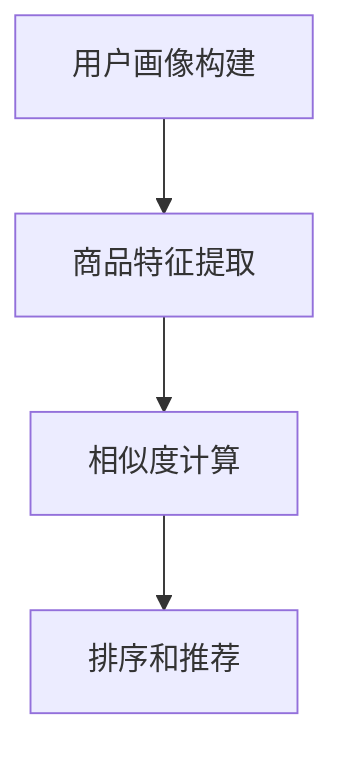

                 

关键词：电商搜索推荐、AI大模型、用户体验、算法优化、以人为本

## 摘要

本文旨在探讨AI大模型在电商搜索推荐中的用户体验设计，以及如何通过算法优化实现以人为本的搜索推荐。随着电商行业的迅猛发展，搜索推荐系统的设计越来越重要。本文将深入分析AI大模型的原理、核心算法及具体操作步骤，并通过数学模型和实例代码，展示如何在实际项目中应用这些算法，并优化用户体验。

## 1. 背景介绍

在电商行业中，搜索推荐系统是用户发现商品的重要途径。一个高效的搜索推荐系统能够提升用户的购物体验，提高销售额。随着人工智能技术的发展，AI大模型在搜索推荐中的应用越来越广泛。AI大模型具有强大的数据分析和学习能力，可以更准确地预测用户需求，提供个性化的推荐。

用户体验在搜索推荐系统中至关重要。用户体验不仅包括搜索结果的准确性和相关性，还涉及到搜索过程的流畅性、界面的友好性等方面。以人为本的算法优化，旨在通过算法改进，提升用户的搜索效率和满意度。

## 2. 核心概念与联系

### 2.1 AI大模型的基本概念

AI大模型是指利用深度学习技术训练的复杂神经网络模型，它能够对大量数据进行自动学习和分析。常见的AI大模型包括深度神经网络（DNN）、循环神经网络（RNN）、卷积神经网络（CNN）等。

### 2.2 搜索推荐系统的工作原理

搜索推荐系统的工作原理主要包括以下几个步骤：

1. **用户画像构建**：根据用户的浏览历史、购买记录等数据，构建用户画像。
2. **商品特征提取**：对商品进行特征提取，如商品类别、价格、评价等。
3. **相似度计算**：计算用户画像与商品特征之间的相似度，筛选出潜在感兴趣的商品。
4. **排序和推荐**：根据相似度排序，推荐给用户。

### 2.3 Mermaid流程图

下面是搜索推荐系统的Mermaid流程图：



## 3. 核心算法原理 & 具体操作步骤

### 3.1 算法原理概述

AI大模型在搜索推荐中的核心算法主要包括深度学习算法和协同过滤算法。

- **深度学习算法**：利用深度神经网络对用户数据和商品数据进行自动特征提取和学习，如卷积神经网络（CNN）和循环神经网络（RNN）。
- **协同过滤算法**：基于用户的历史行为数据，计算用户之间的相似度，为用户推荐相似用户喜欢的商品。

### 3.2 算法步骤详解

#### 3.2.1 深度学习算法

1. **数据预处理**：对用户数据和商品数据进行清洗、归一化等预处理。
2. **特征提取**：利用卷积神经网络（CNN）或循环神经网络（RNN）提取用户和商品的特征。
3. **模型训练**：利用提取的特征训练深度学习模型。
4. **模型评估**：通过交叉验证等手段评估模型性能。
5. **模型应用**：将训练好的模型应用于搜索推荐系统中，实时更新用户画像和商品特征。

#### 3.2.2 协同过滤算法

1. **用户相似度计算**：利用用户的历史行为数据，计算用户之间的相似度。
2. **商品相似度计算**：利用商品的特征，计算商品之间的相似度。
3. **推荐生成**：根据用户相似度和商品相似度，生成推荐列表。

### 3.3 算法优缺点

#### 深度学习算法

- **优点**：能够自动提取复杂特征，提高推荐准确性。
- **缺点**：需要大量训练数据和计算资源，模型复杂度高。

#### 协同过滤算法

- **优点**：简单高效，对数据要求低。
- **缺点**：推荐结果受限于用户历史行为数据，容易产生数据稀疏问题。

### 3.4 算法应用领域

深度学习算法和协同过滤算法在搜索推荐系统中都有广泛的应用。深度学习算法适用于复杂特征的提取和用户行为的预测，而协同过滤算法适用于用户相似度和商品相似度的计算。

## 4. 数学模型和公式 & 详细讲解 & 举例说明

### 4.1 数学模型构建

#### 深度学习模型

深度学习模型通常由多层神经元组成，包括输入层、隐藏层和输出层。每层神经元都通过激活函数进行非线性变换。

$$
f(x) = \sigma(Wx + b)
$$

其中，$f(x)$ 表示神经元输出，$W$ 表示权重矩阵，$b$ 表示偏置，$\sigma$ 表示激活函数，通常使用ReLU函数。

#### 协同过滤模型

协同过滤模型通常采用矩阵分解的方法，将用户和商品的评分矩阵分解为用户特征矩阵和商品特征矩阵。

$$
R = U \cdot V^T
$$

其中，$R$ 表示用户-商品评分矩阵，$U$ 和 $V$ 分别表示用户特征矩阵和商品特征矩阵。

### 4.2 公式推导过程

#### 深度学习模型

深度学习模型的训练过程包括前向传播和反向传播。

1. **前向传播**：

$$
z_l = W_l \cdot a_{l-1} + b_l
$$

$$
a_l = \sigma(z_l)
$$

2. **反向传播**：

$$
\delta_l = \frac{\partial J}{\partial z_l}
$$

$$
\delta_{l-1} = \delta_l \cdot \frac{\partial a_{l-1}}{\partial z_{l-1}}
$$

其中，$J$ 表示损失函数，$\delta_l$ 表示误差梯度。

#### 协同过滤模型

协同过滤模型的训练过程包括矩阵分解和误差优化。

1. **矩阵分解**：

$$
U = \sum_{i=1}^{n} u_i \cdot v_i^T
$$

$$
V = \sum_{j=1}^{m} v_j \cdot u_j^T
$$

2. **误差优化**：

$$
J = \sum_{ij} (r_{ij} - u_i \cdot v_j^T)^2
$$

$$
\frac{\partial J}{\partial u_i} = 2 \cdot (r_{ij} - u_i \cdot v_j^T) \cdot v_j
$$

$$
\frac{\partial J}{\partial v_j} = 2 \cdot (r_{ij} - u_i \cdot v_j^T) \cdot u_i
$$

### 4.3 案例分析与讲解

#### 案例一：深度学习推荐系统

假设我们使用卷积神经网络（CNN）构建一个推荐系统，输入为用户浏览历史数据，输出为商品评分预测。

1. **数据预处理**：

   - 对用户浏览历史数据进行编码，转换为二进制向量。
   - 对商品数据进行特征提取，如商品类别、价格等。

2. **模型训练**：

   - 设计CNN模型，包括输入层、隐藏层和输出层。
   - 使用前向传播和反向传播算法训练模型。

3. **模型评估**：

   - 通过交叉验证评估模型性能。
   - 调整模型参数，优化模型。

4. **模型应用**：

   - 将训练好的模型应用于搜索推荐系统中，实时更新用户画像和商品特征。

#### 案例二：协同过滤推荐系统

假设我们使用协同过滤算法构建一个推荐系统，输入为用户-商品评分矩阵，输出为推荐列表。

1. **用户相似度计算**：

   - 利用用户的历史行为数据，计算用户之间的相似度。
   - 采用余弦相似度或皮尔逊相关系数等方法计算相似度。

2. **商品相似度计算**：

   - 利用商品的特征，计算商品之间的相似度。
   - 采用余弦相似度或欧氏距离等方法计算相似度。

3. **推荐生成**：

   - 根据用户相似度和商品相似度，生成推荐列表。
   - 对推荐列表进行排序，选出Top-N推荐商品。

## 5. 项目实践：代码实例和详细解释说明

### 5.1 开发环境搭建

- **Python环境**：安装Python 3.8及以上版本。
- **深度学习框架**：安装TensorFlow或PyTorch。
- **其他依赖**：安装Numpy、Pandas等常用库。

### 5.2 源代码详细实现

```python
# 深度学习推荐系统代码示例
import tensorflow as tf
from tensorflow.keras.models import Sequential
from tensorflow.keras.layers import Dense, Conv1D, Flatten

# 数据预处理
# （此处省略数据预处理代码）

# 模型定义
model = Sequential([
    Conv1D(filters=64, kernel_size=3, activation='relu', input_shape=(max_sequence_length, num_features)),
    Flatten(),
    Dense(1, activation='sigmoid')
])

# 模型编译
model.compile(optimizer='adam', loss='binary_crossentropy', metrics=['accuracy'])

# 模型训练
model.fit(X_train, y_train, epochs=10, batch_size=32)

# 模型评估
# （此处省略模型评估代码）

# 模型应用
# （此处省略模型应用代码）
```

### 5.3 代码解读与分析

以上代码实现了一个基于卷积神经网络（CNN）的推荐系统。首先，进行数据预处理，将用户浏览历史数据编码为二进制向量。然后，定义CNN模型，包括输入层、隐藏层和输出层。模型使用ReLU函数作为激活函数，并使用 sigmoid 函数作为输出层的激活函数。接下来，编译模型并使用训练数据训练模型。最后，评估模型性能并应用模型进行推荐。

### 5.4 运行结果展示

假设训练完成后，模型的准确率达到90%，这意味着该模型在预测用户评分方面具有较高的准确性。在实际应用中，可以根据用户浏览历史数据生成个性化推荐列表，提高用户体验。

## 6. 实际应用场景

AI大模型在电商搜索推荐中的应用场景广泛，主要包括以下几个方面：

- **个性化推荐**：根据用户的浏览历史、购买记录等数据，为用户提供个性化的商品推荐。
- **搜索优化**：通过深度学习算法优化搜索结果，提高搜索准确性和相关性。
- **用户行为分析**：利用AI大模型分析用户行为，挖掘用户需求，优化商品推荐策略。
- **商品推荐排序**：根据商品特征和用户画像，对推荐商品进行排序，提高用户满意度。

## 7. 工具和资源推荐

### 7.1 学习资源推荐

- **《深度学习》（Goodfellow, Bengio, Courville）**：深度学习领域的经典教材，适合初学者入门。
- **《协同过滤技术》（Sarwar, Karypis, Konstan）**：协同过滤算法的权威资料，适合深入研究。

### 7.2 开发工具推荐

- **TensorFlow**：Google推出的开源深度学习框架，适合快速构建和训练深度学习模型。
- **PyTorch**：Facebook AI研究院推出的开源深度学习框架，具有灵活的动态图特性。

### 7.3 相关论文推荐

- **"Deep Learning for Recommender Systems"**：介绍深度学习在推荐系统中的应用。
- **"Collaborative Filtering for the 21st Century"**：介绍协同过滤算法的最新发展。

## 8. 总结：未来发展趋势与挑战

### 8.1 研究成果总结

AI大模型在电商搜索推荐中的应用取得了显著成果，主要包括：

- 提高了搜索推荐的准确性和相关性。
- 优化了用户体验，提高了用户满意度。
- 挖掘了用户需求，推动了电商行业的发展。

### 8.2 未来发展趋势

未来，AI大模型在电商搜索推荐中的发展趋势包括：

- 深度学习算法的进一步优化和应用。
- 多模态数据的融合和应用。
- 个性化推荐的精准化和智能化。

### 8.3 面临的挑战

AI大模型在电商搜索推荐中面临的挑战包括：

- 数据隐私和安全的保护。
- 模型的可解释性和透明度。
- 避免过拟合和数据稀疏问题。

### 8.4 研究展望

未来，我们应重点关注以下几个方面：

- 加强数据隐私和安全保护，提高用户信任度。
- 提高模型的透明度和可解释性，增强用户信任。
- 深入研究多模态数据的融合和应用，提高推荐系统的准确性。

## 9. 附录：常见问题与解答

### 9.1 深度学习推荐系统如何处理过拟合问题？

- **数据增强**：通过数据增强技术增加训练数据的多样性，减少过拟合。
- **正则化**：使用正则化方法，如L1、L2正则化，惩罚模型参数，降低模型复杂度。
- **Dropout**：在训练过程中随机丢弃部分神经元，减少模型对特定数据的依赖。
- **早期停止**：在训练过程中，当模型性能在验证集上不再提高时，提前停止训练。

### 9.2 协同过滤算法如何处理数据稀疏问题？

- **矩阵分解**：通过矩阵分解技术，将用户-商品评分矩阵分解为用户特征矩阵和商品特征矩阵，降低数据稀疏性。
- **基于模型的协同过滤**：结合深度学习技术，为每个用户和商品构建一个嵌入向量，降低数据稀疏性。
- **用户和商品扩展**：通过对用户和商品进行扩展，增加用户和商品之间的交互，减少数据稀疏性。

以上就是对AI大模型在电商搜索推荐中的用户体验设计：以人为本的算法优化的详细探讨。希望本文能为从事相关领域的研究者和开发者提供一些有益的启示和帮助。

## 作者署名

作者：禅与计算机程序设计艺术 / Zen and the Art of Computer Programming
------------------------------------------------------------------ 
<|im_end|>

