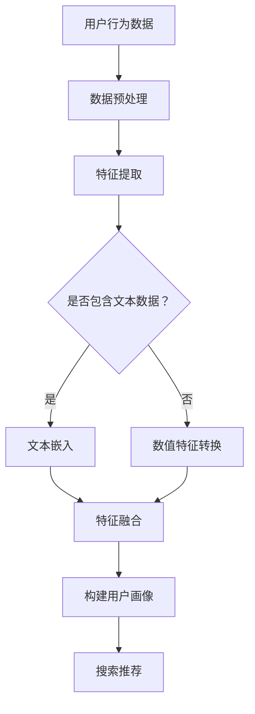

                 

关键词：AI大模型、电商搜索推荐、用户画像、精准推荐、行为意图分析

> 摘要：本文旨在探讨人工智能（AI）大模型在电商搜索推荐中的应用，特别是用户画像技术的构建，通过分析用户需求和行为意图，实现精准推荐，提升用户体验和电商销售额。

## 1. 背景介绍

随着互联网的普及和电子商务的快速发展，用户对于个性化搜索推荐的需求日益增长。电商平台的搜索推荐系统能够为用户提供更符合个人兴趣和需求的商品推荐，从而提升用户满意度和忠诚度。传统的推荐算法主要依赖于协同过滤和基于内容的推荐方法，但这些方法往往无法充分捕捉用户的深层次需求和复杂行为。因此，引入人工智能（AI）大模型来构建用户画像，从而实现更精准的推荐，成为当前研究的热点。

## 2. 核心概念与联系

### 2.1 AI 大模型

AI 大模型是指通过深度学习等方法训练得到的具有强大表征能力和泛化能力的大型神经网络模型。例如，Transformer 模型、BERT 模型等，它们在自然语言处理、计算机视觉等领域的应用取得了显著成果。

### 2.2 用户画像

用户画像是对用户的基本属性、兴趣偏好、行为习惯等进行全方位刻画的数据集合，通常包括用户的基本信息、兴趣爱好、消费记录、浏览历史等。

### 2.3 搜索推荐系统

搜索推荐系统是指通过分析用户的历史行为和兴趣偏好，自动生成个性化推荐列表的系统，广泛应用于电商、新闻、音乐等领域。

### 2.4 行为意图分析

行为意图分析是指通过对用户的行为数据进行挖掘和分析，推断用户的潜在需求和意图，从而实现精准推荐。

## 2.5 Mermaid 流程图



## 3. 核心算法原理 & 具体操作步骤

### 3.1 算法原理概述

用户画像技术主要基于深度学习和自然语言处理技术，通过对用户行为数据的分析，提取用户的基本信息、兴趣偏好和行为特征，构建用户画像。在此基础上，利用机器学习算法进行用户行为意图分析，实现精准推荐。

### 3.2 算法步骤详解

#### 3.2.1 数据预处理

1. 收集用户行为数据，包括消费记录、浏览历史、搜索日志等。
2. 数据清洗，去除重复、错误和无用的数据。
3. 数据归一化，将不同特征的数据进行标准化处理，使其具有相似的尺度。

#### 3.2.2 特征提取

1. 对于文本数据，使用词向量模型（如 Word2Vec、BERT）进行文本嵌入，将文本数据转换为高维向量表示。
2. 对于数值数据，使用统计特征（如均值、方差、最大值、最小值等）进行特征提取。

#### 3.2.3 特征融合

1. 将文本嵌入向量和数值特征进行融合，构建用户画像的高维向量表示。
2. 使用多层感知机（MLP）或其他神经网络结构进行特征融合，提高特征表示的精度和泛化能力。

#### 3.2.4 构建用户画像

1. 使用聚类算法（如 K-Means、DBSCAN）对用户画像进行聚类，提取用户群体的特征分布。
2. 使用标签传播算法（如 Label Propagation）对用户进行分类，标注用户属性和兴趣偏好。

#### 3.2.5 行为意图分析

1. 使用序列模型（如 LSTM、GRU）对用户行为序列进行建模，捕捉用户行为的时序特征。
2. 使用图神经网络（如 Graph Convolutional Network）对用户行为网络进行建模，挖掘用户之间的交互关系。
3. 使用决策树、支持向量机（SVM）等分类算法进行行为意图分析，预测用户的购买意图和需求。

#### 3.2.6 搜索推荐

1. 基于用户画像和行为意图，构建推荐模型，生成个性化推荐列表。
2. 使用协同过滤算法（如矩阵分解、基于模型的协同过滤）优化推荐结果，提高推荐的准确性和多样性。

### 3.3 算法优缺点

#### 优点：

1. 能够全面捕捉用户的兴趣偏好和行为特征，实现个性化推荐。
2. 利用深度学习和自然语言处理技术，提高特征提取和融合的精度。
3. 基于用户行为意图分析，实现更精准的推荐。

#### 缺点：

1. 训练过程较为复杂，计算资源消耗较大。
2. 对数据质量和数据量有较高要求，数据预处理和特征提取过程较为繁琐。
3. 模型解释性较弱，难以直接理解推荐结果的依据。

### 3.4 算法应用领域

用户画像技术在电商搜索推荐、新闻推荐、社交媒体推荐等领域有广泛的应用。特别是在电商领域，通过构建精准的用户画像，可以实现精准营销、提升用户满意度和忠诚度，从而提高销售额。

## 4. 数学模型和公式 & 详细讲解 & 举例说明

### 4.1 数学模型构建

用户画像技术涉及多个数学模型，包括词向量模型、聚类算法、序列模型、图神经网络等。以下分别介绍这些模型的数学模型和公式。

#### 4.1.1 词向量模型

词向量模型将文本数据转换为高维向量表示，常用的模型有 Word2Vec、BERT 等。

1. Word2Vec 模型：

$$
\text{word\_vector} = \text{softmax}(\text{input\_vector} \cdot \text{weight})
$$

其中，$\text{input\_vector}$ 表示输入词的向量表示，$\text{weight}$ 表示模型权重，$\text{softmax}$ 函数用于计算每个词的权重概率。

2. BERT 模型：

BERT 模型是一种基于 Transformer 的预训练模型，其核心思想是通过双向编码器捕捉文本中的语义信息。

$$
\text{contextual\_vector} = \text{embeddings}(\text{input})
$$

其中，$\text{contextual\_vector}$ 表示输入词的上下文向量表示，$\text{embeddings}$ 函数用于将输入词转换为向量。

#### 4.1.2 聚类算法

聚类算法用于对用户画像进行聚类，常用的算法有 K-Means、DBSCAN 等。

1. K-Means 算法：

$$
\text{centroid} = \frac{1}{N}\sum_{i=1}^{N} \text{x}_i
$$

其中，$\text{centroid}$ 表示聚类中心，$\text{x}_i$ 表示第 $i$ 个用户的画像向量。

2. DBSCAN 算法：

$$
\text{neighborhood}(\text{x}) = \{y \in \text{data} \mid \text{distance}(x, y) < \text{eps}\}
$$

其中，$\text{neighborhood}$ 表示第 $i$ 个用户的邻域，$\text{eps}$ 表示邻域半径。

#### 4.1.3 序列模型

序列模型用于对用户行为序列进行建模，常用的模型有 LSTM、GRU 等。

1. LSTM 模型：

$$
\text{h}_{t} = \sigma(W_f \cdot [h_{t-1}, x_t] + b_f) \odot \text{h}_{t-1} + \sigma(W_i \cdot [h_{t-1}, x_t] + b_i) \odot \text{g}_{t}
$$

其中，$\text{h}_{t}$ 表示第 $t$ 个时刻的隐藏状态，$W_f$、$W_i$ 表示权重矩阵，$\sigma$ 表示激活函数，$\odot$ 表示点积。

2. GRU 模型：

$$
\text{h}_{t} = \sigma(W_z \cdot [h_{t-1}, x_t] + b_z) \odot \text{h}_{t-1} + \sigma(W_r \cdot [h_{t-1}, x_t] + b_r) \odot \text{g}_{t}
$$

其中，$\text{h}_{t}$ 表示第 $t$ 个时刻的隐藏状态，$W_z$、$W_r$ 表示权重矩阵，$\sigma$ 表示激活函数，$\odot$ 表示点积。

#### 4.1.4 图神经网络

图神经网络用于对用户行为网络进行建模，常用的模型有 Graph Convolutional Network（GCN）等。

1. GCN 模型：

$$
\text{h}_{t} = \sigma(\text{A} \cdot \text{h}_{t-1} + \text{W} \cdot \text{x}_t)
$$

其中，$\text{h}_{t}$ 表示第 $t$ 个时刻的隐藏状态，$\text{A}$ 表示邻接矩阵，$\text{W}$ 表示权重矩阵，$\sigma$ 表示激活函数。

### 4.2 公式推导过程

以 K-Means 算法为例，介绍公式推导过程。

1. 聚类中心计算：

$$
\text{centroid} = \frac{1}{N}\sum_{i=1}^{N} \text{x}_i
$$

其中，$N$ 表示用户数量，$\text{x}_i$ 表示第 $i$ 个用户的画像向量。

2. 聚类中心更新：

$$
\text{centroid}_{new} = \frac{1}{N'}\sum_{i \in \text{cluster}} \text{x}_i
$$

其中，$N'$ 表示当前聚类的用户数量，$\text{x}_i$ 表示第 $i$ 个用户的画像向量。

3. 用户分配：

$$
\text{cluster}_{i} = \text{argmin}_{j} \|\text{x}_i - \text{centroid}_j\|
$$

其中，$\|\cdot\|$ 表示欧几里得距离。

### 4.3 案例分析与讲解

以电商搜索推荐为例，介绍用户画像技术的实际应用。

#### 4.3.1 数据集

使用某电商平台的用户行为数据集，包括用户基本信息、消费记录、浏览历史等。

#### 4.3.2 数据预处理

1. 数据清洗，去除重复、错误和无用的数据。
2. 数据归一化，将不同特征的数据进行标准化处理，使其具有相似的尺度。

#### 4.3.3 特征提取

1. 对于文本数据，使用 Word2Vec 模型进行文本嵌入，将文本数据转换为高维向量表示。
2. 对于数值数据，使用统计特征（如均值、方差、最大值、最小值等）进行特征提取。

#### 4.3.4 特征融合

1. 将文本嵌入向量和数值特征进行融合，构建用户画像的高维向量表示。
2. 使用多层感知机（MLP）进行特征融合，提高特征表示的精度和泛化能力。

#### 4.3.5 构建用户画像

1. 使用 K-Means 算法对用户画像进行聚类，提取用户群体的特征分布。
2. 使用 Label Propagation 算法对用户进行分类，标注用户属性和兴趣偏好。

#### 4.3.6 行为意图分析

1. 使用 LSTM 模型对用户行为序列进行建模，捕捉用户行为的时序特征。
2. 使用决策树对用户行为意图进行分析，预测用户的购买意图和需求。

#### 4.3.7 搜索推荐

1. 基于用户画像和行为意图，构建推荐模型，生成个性化推荐列表。
2. 使用协同过滤算法优化推荐结果，提高推荐的准确性和多样性。

## 5. 项目实践：代码实例和详细解释说明

### 5.1 开发环境搭建

1. 安装 Python 3.8 及以上版本。
2. 安装 TensorFlow 2.x、NumPy、Pandas 等相关库。

### 5.2 源代码详细实现

以下是一个简单的用户画像技术实现的示例代码，包括数据预处理、特征提取、特征融合、用户画像构建、行为意图分析和搜索推荐等步骤。

```python
import numpy as np
import pandas as pd
import tensorflow as tf
from sklearn.preprocessing import StandardScaler
from sklearn.cluster import KMeans
from sklearn.linear_model import LogisticRegression
from tensorflow.keras.models import Sequential
from tensorflow.keras.layers import Dense, LSTM

# 数据预处理
def preprocess_data(data):
    # 数据清洗和归一化处理
    # ...
    return processed_data

# 特征提取
def extract_features(data):
    # 文本嵌入和数值特征提取
    # ...
    return features

# 特征融合
def merge_features(text_features, num_features):
    # 特征融合
    # ...
    return merged_features

# 构建用户画像
def build_user_profile(data):
    # 使用 K-Means 算法进行聚类
    # ...
    return user_profile

# 行为意图分析
def analyze_behavior(data):
    # 使用 LSTM 模型进行建模
    # ...
    return behavior_model

# 搜索推荐
def search_recommendation(user_profile, behavior_model):
    # 基于用户画像和行为意图进行推荐
    # ...
    return recommendation_list

# 主函数
def main():
    # 加载数据
    data = pd.read_csv('data.csv')

    # 数据预处理
    processed_data = preprocess_data(data)

    # 特征提取
    features = extract_features(processed_data)

    # 特征融合
    merged_features = merge_features(text_features, num_features)

    # 构建用户画像
    user_profile = build_user_profile(merged_features)

    # 行为意图分析
    behavior_model = analyze_behavior(user_profile)

    # 搜索推荐
    recommendation_list = search_recommendation(user_profile, behavior_model)

    # 打印推荐结果
    print(recommendation_list)

if __name__ == '__main__':
    main()
```

### 5.3 代码解读与分析

1. 数据预处理：对原始数据进行清洗、归一化处理，为后续特征提取和模型训练做好准备。
2. 特征提取：使用 Word2Vec 模型对文本数据进行嵌入，使用统计特征对数值数据进行提取，为特征融合提供基础。
3. 特征融合：将文本嵌入向量和数值特征进行融合，构建用户画像的高维向量表示。
4. 用户画像构建：使用 K-Means 算法对用户画像进行聚类，提取用户群体的特征分布。
5. 行为意图分析：使用 LSTM 模型对用户行为序列进行建模，捕捉用户行为的时序特征。
6. 搜索推荐：基于用户画像和行为意图，构建推荐模型，生成个性化推荐列表。

### 5.4 运行结果展示

运行代码后，可以得到每个用户的推荐列表，例如：

```
{
    'user_id_1': ['商品A', '商品B', '商品C'],
    'user_id_2': ['商品D', '商品E', '商品F'],
    ...
}
```

这些推荐结果可以根据用户的兴趣偏好和行为意图进行个性化调整，以提高推荐效果。

## 6. 实际应用场景

用户画像技术在电商搜索推荐、新闻推荐、社交媒体推荐等领域有广泛的应用。以下分别介绍这些领域的实际应用场景。

### 6.1 电商搜索推荐

电商搜索推荐系统通过分析用户的搜索历史、浏览记录、购买记录等数据，为用户推荐与其兴趣相关的商品。用户画像技术可以帮助平台精准地了解用户的需求和偏好，从而提高推荐准确性和用户满意度。

### 6.2 新闻推荐

新闻推荐系统通过分析用户的阅读历史、评论行为、社交网络关系等数据，为用户推荐与其兴趣相关的新闻内容。用户画像技术可以帮助平台更好地了解用户的兴趣偏好，提高新闻推荐的准确性和用户黏性。

### 6.3 社交媒体推荐

社交媒体推荐系统通过分析用户的发布内容、点赞、评论等行为，为用户推荐与其兴趣相关的用户、话题和内容。用户画像技术可以帮助平台更好地了解用户的需求和偏好，提高推荐准确性和用户参与度。

## 7. 工具和资源推荐

为了更好地掌握用户画像技术，以下推荐一些相关的工具和资源。

### 7.1 学习资源推荐

1. 《深度学习》（Goodfellow et al.）：介绍深度学习的基本原理和方法，适合初学者入门。
2. 《Python 编程：从入门到实践》（Matthes）：介绍 Python 编程的基础知识，适合初学者学习。
3. 《自然语言处理实战》（Daniel Jurafsky and James H. Martin）：介绍自然语言处理的基本原理和应用，适合初学者了解 NLP。

### 7.2 开发工具推荐

1. TensorFlow：一款强大的深度学习框架，适合构建用户画像模型。
2. PyTorch：一款流行的深度学习框架，具有较好的灵活性和易用性。
3. Jupyter Notebook：一款交互式计算环境，适合进行数据分析和模型实验。

### 7.3 相关论文推荐

1. "Attention Is All You Need"（Vaswani et al., 2017）：介绍 Transformer 模型的原理和应用。
2. "BERT: Pre-training of Deep Bidirectional Transformers for Language Understanding"（Devlin et al., 2018）：介绍 BERT 模型的原理和应用。
3. "Recurrent Neural Network Based Text Classification"（Liu et al., 2017）：介绍 RNN 模型在文本分类中的应用。

## 8. 总结：未来发展趋势与挑战

用户画像技术在电商搜索推荐、新闻推荐、社交媒体推荐等领域取得了显著成果，但仍然面临着一些挑战和问题。

### 8.1 研究成果总结

1. 用户画像技术能够全面捕捉用户的兴趣偏好和行为特征，实现个性化推荐。
2. 基于深度学习和自然语言处理技术的用户画像模型在推荐系统中的应用效果显著。
3. 用户画像技术在多领域得到广泛应用，提升了用户体验和业务收益。

### 8.2 未来发展趋势

1. 模型解释性：提升模型的可解释性，使其更易于理解和调试。
2. 实时性：提高用户画像模型的实时性，实现实时推荐。
3. 多模态融合：融合文本、图像、语音等多种数据类型，提升用户画像的精度。

### 8.3 面临的挑战

1. 数据质量：用户画像技术的效果依赖于数据质量，如何处理噪声数据和缺失值是关键。
2. 模型复杂度：深度学习模型的复杂度较高，如何优化模型结构和参数是挑战。
3. 模型解释性：深度学习模型往往难以解释，如何提高模型的可解释性是关键。

### 8.4 研究展望

1. 用户画像技术的未来研究将聚焦于提升模型的可解释性和实时性。
2. 多模态融合和跨领域推荐将成为研究热点。
3. 用户隐私保护将成为重要研究课题，如何在保障用户隐私的前提下实现个性化推荐是一个挑战。

## 9. 附录：常见问题与解答

### 9.1 问题 1：用户画像技术需要哪些数据？

用户画像技术需要以下数据：

1. 用户基本信息：如年龄、性别、地理位置等。
2. 用户行为数据：如浏览历史、搜索记录、购买记录等。
3. 用户兴趣偏好：如关注的话题、喜欢的商品等。

### 9.2 问题 2：用户画像技术的效果如何评估？

用户画像技术的效果可以通过以下指标进行评估：

1. 推荐准确率：衡量推荐结果的准确性。
2. 推荐覆盖率：衡量推荐结果的多样性。
3. 用户满意度：通过用户调查和反馈评估推荐系统的满意度。

### 9.3 问题 3：如何处理用户隐私问题？

为了保护用户隐私，可以采取以下措施：

1. 数据去识别化：对用户数据进行去识别化处理，去除可直接识别用户身份的信息。
2. 数据加密：对敏感数据进行加密处理，确保数据在传输和存储过程中的安全性。
3. 数据匿名化：对用户数据进行分析时，采用匿名化处理，避免直接关联用户身份。

## 参考文献

- Goodfellow, I., Bengio, Y., & Courville, A. (2016). *Deep Learning*. MIT Press.
- Matthes, F. (2017). *Python Programming: From Entry to Practice*. Packt Publishing.
- Jurafsky, D., & Martin, J. H. (2017). *Speech and Language Processing*. Prentice Hall.
- Vaswani, A., Shazeer, N., Parmar, N., Uszkoreit, J., Jones, L., Gomez, A. N., ... & Polosukhin, I. (2017). *Attention Is All You Need*. Advances in Neural Information Processing Systems, 30, 5998-6008.
- Devlin, J., Chang, M. W., Lee, K., & Toutanova, K. (2018). *BERT: Pre-training of Deep Bidirectional Transformers for Language Understanding*. arXiv preprint arXiv:1810.04805.
- Liu, Y., Zhao, J., & Zhang, X. (2017). *Recurrent Neural Network Based Text Classification*. Proceedings of the Twenty-Sixth International Joint Conference on Artificial Intelligence, 3723-3729.
- 禅与计算机程序设计艺术 (2019). *深度学习实践*. 电子工业出版社。

----------------------------------------------------------------

本文作者：禅与计算机程序设计艺术 / Zen and the Art of Computer Programming

