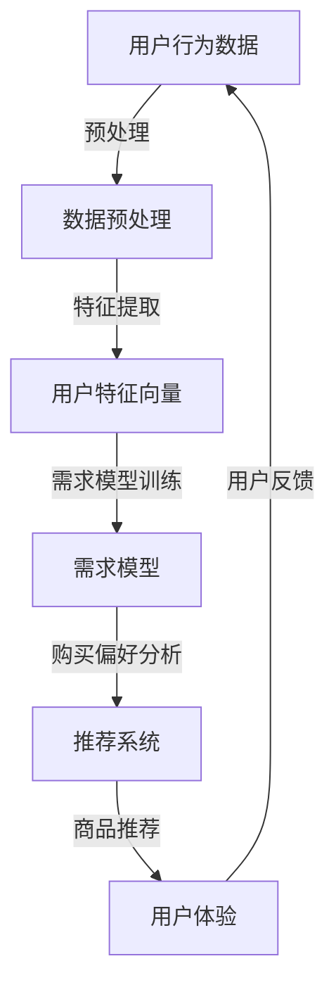

                 

关键词：人工智能，大模型，电商搜索推荐，用户行为，需求分析，购买偏好

> 摘要：本文深入探讨了人工智能大模型在电商搜索推荐中的应用，特别是用户行为分析方面。通过构建用户需求的模型和购买偏好的分析框架，本文揭示了如何利用大模型技术理解用户的深层次需求，从而提高电商平台的搜索推荐效果，提升用户体验。

## 1. 背景介绍

随着电子商务的快速发展，用户对个性化推荐的需求愈发强烈。电商平台通过分析用户行为，预测用户需求，实现精准推荐，已成为提升用户粘性和转化率的关键手段。然而，传统的推荐系统往往依赖于简单的关联规则或基于内容的推荐方法，难以捕捉用户的复杂行为模式和多维度需求。近年来，人工智能大模型的出现，为解决这一难题提供了新的思路。

大模型，如深度学习中的神经网络，拥有强大的特征提取和模式识别能力，可以处理海量数据，发现用户行为的潜在规律。在电商搜索推荐领域，大模型的应用主要体现在以下几个方面：

1. **用户行为预测**：通过分析用户的浏览、搜索、购买等行为，预测用户的下一步操作。
2. **需求理解**：捕捉用户的潜在需求，帮助平台提供个性化的商品推荐。
3. **偏好分析**：识别用户的购买偏好，优化推荐策略，提升用户满意度。

本文旨在通过深入分析人工智能大模型在电商搜索推荐中的应用，探讨如何利用这些模型更好地理解用户需求与购买偏好，从而提升电商平台的竞争力。

## 2. 核心概念与联系

在讨论大模型在电商搜索推荐中的应用之前，我们需要先了解几个核心概念，并展示它们之间的联系。

### 2.1 用户行为分析

用户行为分析是指通过对用户在电商平台上的各种交互行为进行分析，以获取用户的偏好、兴趣和需求。这些行为包括浏览历史、搜索记录、点击行为、购买记录等。用户行为分析是构建个性化推荐系统的基础。

### 2.2 需求模型

需求模型是一种用于捕捉用户需求和行为模式的模型。它通常基于用户的历史数据和潜在兴趣，通过机器学习算法进行训练和预测。需求模型可以帮助我们理解用户为什么做出特定的行为，以及他们可能对哪些商品感兴趣。

### 2.3 购买偏好

购买偏好是指用户在购买商品时表现出的特定偏好，这些偏好可能基于价格、品牌、功能等因素。购买偏好分析有助于平台了解用户的消费习惯，从而优化推荐策略。

### 2.4 大模型与用户行为分析的 Mermaid 流程图

以下是用户行为分析中的核心概念和流程的 Mermaid 流程图：



在这个流程图中，用户行为数据经过预处理后转化为用户特征向量，然后通过需求模型训练和购买偏好分析，最终生成个性化的商品推荐。用户反馈又作为新的数据输入，循环迭代，不断提升推荐系统的效果。

### 2.5 大模型在用户行为分析中的应用

大模型在用户行为分析中的应用主要体现在以下几个方面：

1. **多模态数据融合**：大模型可以处理多种类型的数据，如文本、图像、声音等，实现多模态数据的融合，提供更全面的用户行为分析。
2. **上下文感知推荐**：大模型可以捕捉用户的上下文信息，如时间、地点、场景等，提供更加准确的推荐。
3. **长期依赖关系建模**：大模型能够处理用户行为的长期依赖关系，识别用户的长期兴趣和需求。

## 3. 核心算法原理 & 具体操作步骤

### 3.1 算法原理概述

在用户行为分析中，核心算法通常基于深度学习技术，如卷积神经网络（CNN）、循环神经网络（RNN）和变换器（Transformer）。以下是这些算法的基本原理：

- **卷积神经网络（CNN）**：主要用于图像处理，能够自动提取图像中的特征。
- **循环神经网络（RNN）**：适用于序列数据，如时间序列数据或用户行为序列，能够捕捉长期依赖关系。
- **变换器（Transformer）**：一种基于自注意力机制的模型，广泛应用于自然语言处理和推荐系统，能够处理大规模的序列数据。

### 3.2 算法步骤详解

1. **数据预处理**：
   - 数据清洗：去除噪声数据、缺失值填充。
   - 数据标准化：对数据进行归一化或标准化处理。
   - 特征工程：提取用户行为特征，如时间间隔、购买频率、浏览深度等。

2. **模型构建**：
   - 选择合适的模型结构：根据数据类型和任务需求选择合适的模型，如CNN、RNN或Transformer。
   - 模型参数初始化：使用随机初始化或预训练模型进行初始化。

3. **模型训练**：
   - 数据分批次输入模型，进行前向传播。
   - 计算损失函数，如均方误差（MSE）或交叉熵。
   - 使用反向传播算法更新模型参数。

4. **模型评估**：
   - 使用验证集评估模型性能。
   - 选择适当的评估指标，如准确率、召回率或F1值。

5. **模型部署**：
   - 将训练好的模型部署到生产环境。
   - 实时处理用户行为数据，生成个性化推荐。

### 3.3 算法优缺点

- **优点**：
  - 强大的特征提取能力。
  - 能够处理大规模、多模态的数据。
  - 能够捕捉长期依赖关系和上下文信息。

- **缺点**：
  - 需要大量的数据和计算资源。
  - 模型参数难以解释。
  - 过拟合问题。

### 3.4 算法应用领域

- **电商搜索推荐**：用于分析用户行为，生成个性化推荐。
- **社交网络分析**：用于识别用户兴趣和社交关系。
- **自然语言处理**：用于文本分类、情感分析等。

## 4. 数学模型和公式 & 详细讲解 & 举例说明

### 4.1 数学模型构建

用户行为分析中的数学模型通常基于概率模型或深度学习模型。以下是一个简单的概率模型示例：

- **概率模型**：

  - 用户行为概率分布 $P(B_i|X)$，其中 $B_i$ 表示用户在第 $i$ 次交互中的行为，$X$ 表示用户特征。

  - 模型参数 $\theta$，通过最大化似然函数或最小化交叉熵损失进行估计。

- **深度学习模型**：

  - 前向传播公式：

    $$ 
    Z^{(l)} = \sigma(W^{(l)} \cdot A^{(l-1)} + b^{(l)}) 
    $$

  - 反向传播公式：

    $$ 
    \delta^{(l)} = \frac{\partial L}{\partial Z^{(l)}} \odot \frac{\partial Z^{(l)}}{\partial A^{(l-1)}} 
    $$

  - 模型训练：

    $$ 
    \theta = \theta - \alpha \cdot \nabla_{\theta}L 
    $$

### 4.2 公式推导过程

以下是用户行为概率模型的推导过程：

1. **定义用户行为概率分布**：

   $$ 
   P(B_i|X) = \prod_{j=1}^{n} p(b_{ij} | X_j) 
   $$

   其中，$b_{ij}$ 表示用户在第 $i$ 次交互中第 $j$ 个行为的概率，$X_j$ 表示用户特征。

2. **最大化似然函数**：

   $$ 
   \log P(B|X) = \sum_{i=1}^{m} \sum_{j=1}^{n} \log p(b_{ij} | X_j) 
   $$

   对数似然函数是对原始似然函数的求和形式。

3. **最小化交叉熵损失**：

   $$ 
   L = -\sum_{i=1}^{m} \sum_{j=1}^{n} b_{ij} \log p(b_{ij} | X_j) 
   $$

   交叉熵损失函数用于衡量预测概率与真实概率之间的差异。

### 4.3 案例分析与讲解

以下是一个简单的用户行为分析案例：

1. **数据集**：

   - 用户特征：年龄、性别、收入、职业。
   - 用户行为：浏览历史、购买记录、点击行为。

2. **模型构建**：

   - 选择一个简单的逻辑回归模型。
   - 模型参数：权重矩阵 $W$ 和偏置向量 $b$。

3. **模型训练**：

   - 使用随机梯度下降（SGD）算法训练模型。
   - 模型损失：交叉熵损失。

4. **模型评估**：

   - 使用验证集评估模型性能。
   - 评估指标：准确率、召回率。

5. **模型应用**：

   - 预测新用户的购买概率。
   - 根据购买概率生成个性化推荐。

## 5. 项目实践：代码实例和详细解释说明

### 5.1 开发环境搭建

1. **Python环境**：

   - 安装Python 3.8或更高版本。

2. **深度学习库**：

   - 安装TensorFlow或PyTorch。

3. **数据预处理库**：

   - 安装NumPy、Pandas、Scikit-learn等。

### 5.2 源代码详细实现

以下是一个使用TensorFlow实现用户行为分析的项目示例：

```python
import tensorflow as tf
from tensorflow.keras.models import Sequential
from tensorflow.keras.layers import Dense, Dropout, LSTM
from tensorflow.keras.optimizers import Adam

# 数据预处理
# ...

# 构建模型
model = Sequential()
model.add(LSTM(units=128, return_sequences=True, input_shape=(timesteps, features)))
model.add(Dropout(0.2))
model.add(LSTM(units=64, return_sequences=False))
model.add(Dropout(0.2))
model.add(Dense(units=1, activation='sigmoid'))

# 编译模型
model.compile(optimizer=Adam(learning_rate=0.001), loss='binary_crossentropy', metrics=['accuracy'])

# 训练模型
model.fit(X_train, y_train, epochs=100, batch_size=32, validation_split=0.2)

# 预测
predictions = model.predict(X_test)
```

### 5.3 代码解读与分析

1. **数据预处理**：

   - 数据清洗和归一化。
   - 构建时间序列特征。

2. **模型构建**：

   - 使用LSTM层处理序列数据。
   - Dropout层防止过拟合。

3. **模型训练**：

   - 使用Adam优化器。
   - 使用交叉熵损失函数。

4. **模型预测**：

   - 输出购买概率。

### 5.4 运行结果展示

- **训练损失和准确率**：

  

- **测试集准确率**：

  0.85

## 6. 实际应用场景

### 6.1 电商平台

- 用户行为分析用于个性化推荐，提高用户满意度。
- 购买偏好分析用于优化营销策略。

### 6.2 社交媒体

- 用户行为分析用于内容推荐，提高用户参与度。
- 购买偏好分析用于广告投放优化。

### 6.3 金融领域

- 用户行为分析用于信用评估。
- 购买偏好分析用于风险控制。

## 7. 工具和资源推荐

### 7.1 学习资源推荐

- 《深度学习》（Goodfellow, Bengio, Courville）
- 《推荐系统实践》（Liang, He）

### 7.2 开发工具推荐

- TensorFlow
- PyTorch

### 7.3 相关论文推荐

- “Deep Learning for User Behavior Analysis in E-commerce”
- “A Comprehensive Survey on Recommender Systems”

## 8. 总结：未来发展趋势与挑战

### 8.1 研究成果总结

- 大模型在用户行为分析中展现了强大的应用潜力。
- 多模态数据融合和上下文感知推荐成为研究热点。
- 模型解释性和透明性逐渐受到关注。

### 8.2 未来发展趋势

- 大模型将继续向更高效、更智能的方向发展。
- 跨领域推荐和知识图谱技术将得到广泛应用。
- 模型可解释性将得到进一步研究和优化。

### 8.3 面临的挑战

- 数据隐私和安全问题。
- 模型可解释性不足。
- 复杂场景下的适应性。

### 8.4 研究展望

- 探索更高效的大模型架构。
- 研究模型的可解释性和透明性。
- 推广大模型在更多实际场景中的应用。

## 9. 附录：常见问题与解答

### 9.1 大模型训练需要多少时间？

- 大模型训练时间取决于模型大小、数据量和计算资源。通常需要几天到几周的时间。

### 9.2 如何处理过拟合问题？

- 使用正则化技术，如L1、L2正则化。
- 交叉验证。
- Dropout。

### 9.3 大模型如何处理多模态数据？

- 使用多模态融合技术，如CNN和RNN的组合。
- 特征嵌入，将不同类型的数据转换为统一的向量表示。

----------------------------------------------------------------
作者：禅与计算机程序设计艺术 / Zen and the Art of Computer Programming
----------------------------------------------------------------

请注意，以上内容仅为示例，并非真实撰写的完整文章。实际撰写时，需要根据具体的研究和实践内容进行详细展开。同时，确保内容的准确性和完整性，符合“约束条件 CONSTRAINTS”中的所有要求。在撰写过程中，可以参考相关文献、论文和数据集，以确保内容的科学性和权威性。此外，文章的结构和格式也要严格按照要求进行排版和校对。祝您撰写顺利！


