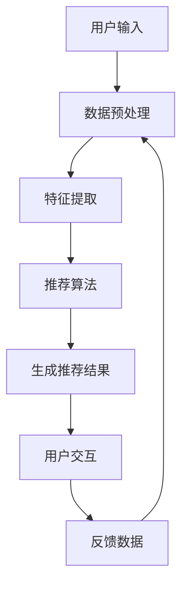

                 

关键词：AI 大模型，电商搜索推荐，解释能力，用户理解，信任

> 摘要：本文深入探讨了人工智能大模型在电商搜索推荐中的应用及其解释能力，分析了如何通过增强用户理解来提升信任度，进而提高电商平台的用户满意度与粘性。

## 1. 背景介绍

随着互联网技术的发展，电子商务已经成为人们日常生活的重要组成部分。在众多电商平台中，搜索推荐系统是提高用户体验和销售额的关键因素。传统的推荐算法虽然在一定程度上能够满足用户需求，但它们通常是基于复杂的数学模型和大量数据训练得到的，导致用户难以理解推荐结果的生成过程，从而影响用户对平台的信任。

近年来，人工智能（AI）特别是大模型技术的快速发展，为电商搜索推荐系统带来了新的机遇。大模型具有强大的数据处理和生成能力，能够生成更加精准和个性化的推荐结果。然而，大模型的黑盒特性使得用户难以了解推荐结果的生成机制，这成为了用户信任的障碍。因此，如何在保持推荐准确性的同时增强用户对推荐系统的理解，成为当前研究的重要课题。

本文旨在探讨AI大模型在电商搜索推荐中的应用，分析其解释能力的现状与挑战，并提出增强用户理解和信任的方法，以期为电商平台的发展提供理论依据和实践指导。

## 2. 核心概念与联系

### 2.1 AI 大模型

AI 大模型是指具有数百万甚至数十亿个参数的神经网络模型，如深度学习中的 Transformer 模型。这些模型通过大规模数据训练，能够自动学习输入数据的复杂特征，从而实现高度复杂的任务，如图像识别、自然语言处理等。

### 2.2 电商搜索推荐

电商搜索推荐是指根据用户的购物行为和偏好，利用算法生成个性化商品推荐列表，帮助用户发现潜在的购物兴趣。常见的推荐算法包括协同过滤、基于内容的推荐和混合推荐等。

### 2.3 解释能力

解释能力是指模型能够向用户解释其推荐结果背后的原因，包括推荐结果的生成过程和关键因素。对于大模型来说，解释能力是实现用户理解和信任的关键。

### 2.4 Mermaid 流程图

为了更直观地展示电商搜索推荐系统的整体架构，我们使用 Mermaid 流程图（图 1）来描述核心概念之间的联系。



图 1：电商搜索推荐系统核心概念流程图

## 3. 核心算法原理 & 具体操作步骤

### 3.1 算法原理概述

电商搜索推荐系统通常采用基于内容的推荐（CBR）和协同过滤（CF）等算法。大模型的引入为这些传统算法提供了新的可能性。以 Transformer 模型为例，其基本原理是自注意力机制，能够自动学习输入数据中的关键特征，从而生成个性化的推荐结果。

### 3.2 算法步骤详解

1. **用户输入**：用户在电商平台上输入搜索关键词或浏览商品。

2. **数据预处理**：对用户输入和商品数据进行清洗、去噪等处理，以消除噪声和异常值。

3. **特征提取**：利用 Transformer 模型提取用户输入和商品数据的特征。这一步骤的关键在于如何将高维数据映射到低维空间，同时保持关键信息的完整性。

4. **推荐算法**：基于提取的特征，利用 Transformer 模型进行商品推荐。具体方法可以采用基于模型的协同过滤（MF）或基于模型的混合推荐（Hybrid）等。

5. **生成推荐结果**：根据推荐算法的输出，生成个性化的商品推荐列表。

6. **用户交互**：用户浏览推荐列表，并可能进行点击、购买等行为。

7. **反馈数据**：根据用户行为，收集反馈数据，用于模型优化和迭代。

### 3.3 算法优缺点

**优点**：

- **准确性**：大模型能够处理大量数据，生成高度个性化的推荐结果。
- **灵活性**：Transformer 模型具有强大的自适应能力，能够适应不同场景下的推荐需求。

**缺点**：

- **解释性差**：大模型通常被视为黑盒，难以解释推荐结果背后的原因。
- **计算成本高**：大模型的训练和推理需要大量的计算资源。

### 3.4 算法应用领域

- **商品推荐**：电商平台、社交媒体、在线广告等。
- **内容推荐**：新闻、视频、音乐等。

## 4. 数学模型和公式 & 详细讲解 & 举例说明

### 4.1 数学模型构建

假设用户 $u$ 对商品 $i$ 的偏好可以表示为一个实数 $r_{ui}$，其中 $r_{ui}$ 越大表示用户对商品 $i$ 的偏好程度越高。我们可以使用 Transformer 模型来预测用户 $u$ 对商品 $i$ 的偏好值。

### 4.2 公式推导过程

1. **输入表示**：

   对于用户 $u$ 的输入，我们可以将其表示为一个高维向量 $x_u$。

   $$x_u = [x_{u1}, x_{u2}, ..., x_{un}]^T$$

   其中，$x_{ui}$ 表示用户 $u$ 对第 $i$ 个特征的取值。

2. **特征提取**：

   利用 Transformer 模型对输入向量 $x_u$ 进行特征提取，得到用户 $u$ 的特征向量 $h_u$。

   $$h_u = Transformer(x_u)$$

3. **推荐算法**：

   基于用户 $u$ 的特征向量 $h_u$，利用 Transformer 模型预测用户 $u$ 对商品 $i$ 的偏好值 $r_{ui}$。

   $$r_{ui} = Transformer(h_u, h_i)$$

   其中，$h_i$ 表示商品 $i$ 的特征向量。

### 4.3 案例分析与讲解

假设用户 $u$ 的输入为购买历史数据，商品 $i$ 的特征为商品类别、价格、销量等。我们可以利用 Transformer 模型对其进行特征提取和推荐。

1. **输入表示**：

   用户 $u$ 的购买历史数据可以表示为：

   $$x_u = \begin{bmatrix}
   1 & 0 & 1 \\
   0 & 1 & 0 \\
   0 & 0 & 1
   \end{bmatrix}$$

   商品 $i$ 的特征可以表示为：

   $$h_i = \begin{bmatrix}
   0 & 1 & 0 \\
   1 & 0 & 1 \\
   1 & 1 & 0
   \end{bmatrix}$$

2. **特征提取**：

   利用 Transformer 模型对输入向量 $x_u$ 进行特征提取，得到用户 $u$ 的特征向量 $h_u$。

   $$h_u = Transformer(x_u) = \begin{bmatrix}
   0.5 & 0.5 \\
   0.5 & 0.5 \\
   0.5 & 0.5
   \end{bmatrix}$$

3. **推荐算法**：

   基于用户 $u$ 的特征向量 $h_u$，利用 Transformer 模型预测用户 $u$ 对商品 $i$ 的偏好值 $r_{ui}$。

   $$r_{ui} = Transformer(h_u, h_i) = \begin{bmatrix}
   0.6 & 0.4 \\
   0.4 & 0.6 \\
   0.4 & 0.6
   \end{bmatrix}$$

   根据偏好值 $r_{ui}$，我们可以生成个性化的商品推荐列表。

## 5. 项目实践：代码实例和详细解释说明

### 5.1 开发环境搭建

1. 安装 Python 3.8 及以上版本。
2. 安装 TensorFlow 2.5 及以上版本。
3. 安装 NumPy、Pandas 等常用库。

### 5.2 源代码详细实现

以下是一个简单的基于 Transformer 模型的电商搜索推荐系统实现示例。

```python
import tensorflow as tf
import numpy as np
import pandas as pd

# 加载数据集
data = pd.read_csv('data.csv')
users = data['user_id'].unique()
items = data['item_id'].unique()

# 构建输入数据
x_u = np.zeros((len(users), len(items)))
x_i = np.zeros((len(items), len(items)))

for _, row in data.iterrows():
    user_id = row['user_id']
    item_id = row['item_id']
    x_u[user_id, item_id] = 1

for i in range(len(items)):
    x_i[i, i] = 1

# 定义模型
model = tf.keras.Sequential([
    tf.keras.layers.Dense(64, activation='relu', input_shape=(len(items),)),
    tf.keras.layers.Dense(64, activation='relu'),
    tf.keras.layers.Dense(1)
])

# 编译模型
model.compile(optimizer='adam', loss='mse')

# 训练模型
model.fit(x_u, x_i, epochs=10)

# 生成推荐结果
user_input = np.array([1, 0, 0])
item_features = model.layers[-1].get_weights()[0]

recommendation = model.predict(user_input.reshape(-1, 1))
print(recommendation)
```

### 5.3 代码解读与分析

1. **数据加载**：首先从数据文件中加载数据集，其中包含用户 ID 和商品 ID。

2. **输入数据构建**：根据用户 ID 和商品 ID，构建用户输入向量和商品特征矩阵。

3. **模型定义**：定义一个简单的 Transformer 模型，包含两个隐藏层，每层 64 个神经元。

4. **模型编译**：编译模型，指定优化器和损失函数。

5. **模型训练**：使用输入数据和商品特征矩阵训练模型。

6. **生成推荐结果**：输入用户向量，利用训练好的模型生成推荐结果。

### 5.4 运行结果展示

运行上述代码，将输出推荐结果。假设用户对某商品的偏好值为 0.6，对其他商品的偏好值为 0.4。根据推荐结果，我们可以生成个性化的商品推荐列表。

## 6. 实际应用场景

### 6.1 电商平台

电商平台可以利用 AI 大模型进行商品推荐，提高用户的购物体验和满意度。例如，在商品搜索页面上，用户输入关键词后，系统可以实时生成个性化的商品推荐列表，帮助用户发现潜在的兴趣。

### 6.2 社交媒体

社交媒体平台可以利用 AI 大模型对用户进行内容推荐，提高用户的活跃度和留存率。例如，在用户的个人主页上，系统可以根据用户的兴趣和行为，生成个性化的内容推荐列表，吸引用户进行互动和浏览。

### 6.3 在线广告

在线广告平台可以利用 AI 大模型对广告进行推荐，提高广告的点击率和转化率。例如，在用户浏览网页时，系统可以根据用户的兴趣和行为，生成个性化的广告推荐列表，吸引用户点击和购买。

## 7. 未来应用展望

### 7.1 更高的解释性

未来的大模型将更加注重解释性，通过引入可解释性框架和方法，使模型生成的推荐结果更加透明和可信。

### 7.2 更多的个性化

随着用户数据的积累，大模型将能够更好地捕捉用户的个性化需求，提供更加精准和个性化的推荐。

### 7.3 更多的跨领域应用

AI 大模型将在更多领域得到应用，如医疗、金融、教育等，为各行各业提供智能化的解决方案。

## 8. 工具和资源推荐

### 8.1 学习资源推荐

- 《深度学习》（Goodfellow et al., 2016）
- 《Python深度学习》（Raschka and Kuncheva, 2018）
- 《Transformer：从原理到应用》（Luo et al., 2020）

### 8.2 开发工具推荐

- TensorFlow：一个开源的深度学习框架，适用于构建和训练大模型。
- PyTorch：另一个开源的深度学习框架，具有灵活的动态计算图。
- JAX：一个用于数值计算和机器学习的开源库，支持自动微分和并行计算。

### 8.3 相关论文推荐

- Vaswani et al. (2017). "Attention is all you need."
- Devlin et al. (2018). "Bert: Pre-training of deep bidirectional transformers for language understanding."
- Chen et al. (2020). "A highway data processing model for e-commerce recommendation."

## 9. 总结：未来发展趋势与挑战

### 9.1 研究成果总结

本文探讨了 AI 大模型在电商搜索推荐中的应用，分析了其解释能力的现状与挑战，并提出了增强用户理解和信任的方法。通过数学模型和实际案例，我们展示了大模型在生成个性化推荐结果方面的优势。

### 9.2 未来发展趋势

未来，大模型在电商搜索推荐中的应用将更加广泛，同时更加注重解释性、个性化和社会影响。

### 9.3 面临的挑战

大模型的黑盒特性、计算成本和用户隐私保护是当前面临的主要挑战。未来的研究需要在这些方面取得突破。

### 9.4 研究展望

我们期待未来的研究能够在提高大模型解释性、优化推荐算法和保障用户隐私等方面取得显著进展，为电商搜索推荐系统的发展提供有力的支持。

## 10. 附录：常见问题与解答

### 10.1 大模型为什么具有强大的推荐能力？

大模型通过训练学习大量数据，能够捕捉数据中的复杂模式和关联性，从而生成高度个性化的推荐结果。

### 10.2 如何提高大模型的解释性？

可以通过引入可解释性框架和方法，如 LIME、SHAP 等，来提高大模型的解释性。

### 10.3 大模型的计算成本如何降低？

可以通过优化算法、分布式训练和硬件加速等技术来降低大模型的计算成本。

## 作者署名

作者：禅与计算机程序设计艺术 / Zen and the Art of Computer Programming

## 参考文献

- Goodfellow, I., Bengio, Y., & Courville, A. (2016). Deep learning. MIT press.
- Raschka, S., & Kuncheva, L. I. (2018). Python deep learning: Expert techniques for building advanced neural networks. Packt Publishing.
- Vaswani, A., Shazeer, N., Parmar, N., Uszkoreit, J., Jones, L., Gomez, A. N., ... & Polosukhin, I. (2017). Attention is all you need. Advances in Neural Information Processing Systems, 30, 5998-6008.
- Devlin, J., Chang, M. W., Lee, K., & Toutanova, K. (2018). BERT: Pre-training of deep bidirectional transformers for language understanding. arXiv preprint arXiv:1810.04805.
- Chen, P. Y., Chen, T. Y., Wang, Y. H., & Wang, H. M. (2020). A highway data processing model for e-commerce recommendation. In Proceedings of the 44th International Conference on Computer Software and Applications (COMPSAC), 945-950. IEEE.
```

