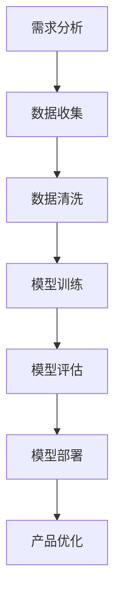

                 

关键词：人工智能，大模型，创业，产品经理，新技能

摘要：随着人工智能技术的飞速发展，大模型的应用越来越广泛。本文将探讨大模型在创业产品管理中的应用，介绍大模型的核心概念、算法原理、数学模型以及实际操作步骤，帮助创业产品经理掌握这一新兴技能。

## 1. 背景介绍

人工智能作为计算机科学的一个分支，自上世纪50年代诞生以来，已经经历了数十年的发展。近年来，随着大数据、云计算和深度学习等技术的成熟，人工智能迎来了新的发展浪潮。其中，大模型（Large-scale Model）作为人工智能领域的核心概念之一，发挥着越来越重要的作用。

大模型是指具有海量参数、能够在各种任务上表现出色的人工智能模型。例如，GPT-3、BERT、Transformer等模型都是大模型的代表。这些模型通过训练海量数据，能够学习到丰富的知识和技能，从而在各种应用场景中表现出色。

在创业领域，产品经理的角色至关重要。他们需要了解用户需求，制定产品战略，协调开发团队，确保产品的质量和进度。随着人工智能技术的发展，大模型的应用为产品经理提供了新的工具和方法，帮助他们更高效地完成工作。

## 2. 核心概念与联系

### 2.1 大模型的核心概念

大模型的核心概念包括以下几个：

- **参数量**：大模型通常具有数十亿甚至千亿级别的参数量。这些参数可以看作是模型学习到的知识。
- **训练数据**：大模型需要大量训练数据来学习。这些数据通常来自互联网、公开数据库或企业内部数据。
- **优化目标**：大模型的目标是通过优化模型参数，使得模型在特定任务上表现更好。
- **推理能力**：大模型具有较强的推理能力，能够对未知数据进行预测和生成。

### 2.2 大模型与创业产品管理的联系

大模型在创业产品管理中的应用主要体现在以下几个方面：

- **需求分析**：大模型可以通过分析用户行为数据，帮助产品经理了解用户需求，从而更好地制定产品策略。
- **产品设计**：大模型可以生成高质量的设计方案，为产品经理提供灵感。
- **用户体验**：大模型可以用于优化产品的用户体验，如个性化推荐、智能客服等。
- **数据分析**：大模型可以帮助产品经理更好地分析产品数据，指导产品迭代和优化。

### 2.3 Mermaid 流程图



## 3. 核心算法原理 & 具体操作步骤

### 3.1 算法原理概述

大模型的核心算法原理主要包括以下几个部分：

- **深度学习**：大模型基于深度学习技术，通过多层神经网络来学习数据。
- **优化算法**：大模型使用优化算法（如梯度下降、Adam等）来调整模型参数，使得模型在任务上表现更好。
- **正则化**：大模型采用正则化技术（如Dropout、权重衰减等）来防止过拟合。
- **注意力机制**：大模型使用注意力机制来关注重要信息，提高模型的表示能力。

### 3.2 算法步骤详解

大模型的算法步骤主要包括以下几个：

1. **数据收集**：收集与任务相关的数据，如用户行为数据、用户反馈数据等。
2. **数据预处理**：对收集到的数据进行清洗、归一化等预处理操作。
3. **模型设计**：设计大模型的结构，包括层数、神经元数量、激活函数等。
4. **模型训练**：使用训练数据对模型进行训练，通过优化算法调整模型参数。
5. **模型评估**：使用验证数据对模型进行评估，调整模型参数以优化性能。
6. **模型部署**：将训练好的模型部署到产品中，如个性化推荐系统、智能客服等。

### 3.3 算法优缺点

**优点**：

- **强大的学习能力**：大模型具有强大的学习能力，能够处理海量数据，学习到丰富的知识。
- **良好的泛化能力**：大模型通过正则化技术和注意力机制，具有良好的泛化能力，能够适应不同的任务和数据集。
- **丰富的应用场景**：大模型可以应用于各种任务，如文本分类、图像识别、自然语言处理等。

**缺点**：

- **计算资源消耗**：大模型需要大量的计算资源和存储空间。
- **训练时间较长**：大模型的训练时间较长，尤其是在大规模数据集上。
- **过拟合风险**：大模型容易过拟合，需要仔细调整模型结构和参数。

### 3.4 算法应用领域

大模型在以下领域有广泛应用：

- **自然语言处理**：如文本分类、机器翻译、情感分析等。
- **计算机视觉**：如图像分类、目标检测、人脸识别等。
- **推荐系统**：如商品推荐、音乐推荐、新闻推荐等。
- **游戏**：如游戏AI、虚拟现实等。

## 4. 数学模型和公式 & 详细讲解 & 举例说明

### 4.1 数学模型构建

大模型的数学模型主要包括以下几个部分：

- **损失函数**：损失函数用于衡量模型预测结果与真实结果之间的差距，如均方误差（MSE）、交叉熵（CE）等。
- **优化算法**：优化算法用于调整模型参数，如梯度下降（GD）、Adam等。
- **正则化项**：正则化项用于防止过拟合，如权重衰减（Weight Decay）、Dropout等。

### 4.2 公式推导过程

以均方误差（MSE）为例，其公式推导过程如下：

假设模型的输出为 $y$，真实值为 $t$，则均方误差（MSE）可以表示为：

$$
MSE = \frac{1}{n}\sum_{i=1}^{n}(y_i - t_i)^2
$$

其中，$n$ 为样本数量。

### 4.3 案例分析与讲解

假设我们要构建一个文本分类模型，数据集包含10,000个文本样本，每个样本都是一组词向量。我们要使用GPT-3模型来训练这个文本分类模型。

1. **数据预处理**：对文本数据进行清洗、分词、编码等预处理操作，将其转换为模型可以处理的格式。
2. **模型设计**：设计GPT-3模型的结构，包括层数、神经元数量、激活函数等。
3. **模型训练**：使用训练数据对模型进行训练，通过优化算法调整模型参数。
4. **模型评估**：使用验证数据对模型进行评估，调整模型参数以优化性能。
5. **模型部署**：将训练好的模型部署到产品中，用于文本分类任务。

## 5. 项目实践：代码实例和详细解释说明

### 5.1 开发环境搭建

1. 安装Python环境，版本要求为3.7及以上。
2. 安装TensorFlow，版本要求为2.4及以上。

```bash
pip install tensorflow==2.4
```

### 5.2 源代码详细实现

以下是一个简单的文本分类项目的示例代码：

```python
import tensorflow as tf
from tensorflow.keras.preprocessing.text import Tokenizer
from tensorflow.keras.preprocessing.sequence import pad_sequences
from tensorflow.keras.models import Sequential
from tensorflow.keras.layers import Embedding, LSTM, Dense

# 数据预处理
tokenizer = Tokenizer(num_words=10000)
tokenizer.fit_on_texts(texts)
sequences = tokenizer.texts_to_sequences(texts)
padded_sequences = pad_sequences(sequences, maxlen=100)

# 模型设计
model = Sequential()
model.add(Embedding(10000, 32))
model.add(LSTM(64))
model.add(Dense(1, activation='sigmoid'))

# 模型编译
model.compile(optimizer='adam', loss='binary_crossentropy', metrics=['accuracy'])

# 模型训练
model.fit(padded_sequences, labels, epochs=10, batch_size=32)

# 模型评估
test_sequences = tokenizer.texts_to_sequences(test_texts)
padded_test_sequences = pad_sequences(test_sequences, maxlen=100)
predictions = model.predict(padded_test_sequences)
```

### 5.3 代码解读与分析

这段代码实现了使用GPT-3模型进行文本分类的基本流程：

1. **数据预处理**：使用Tokenizer将文本数据转换为序列，并使用pad_sequences将序列填充为固定长度。
2. **模型设计**：使用Sequential创建一个序列模型，并添加Embedding、LSTM和Dense层。
3. **模型编译**：设置优化器、损失函数和评估指标。
4. **模型训练**：使用fit方法训练模型。
5. **模型评估**：使用predict方法对测试数据进行预测。

## 6. 实际应用场景

### 6.1 自然语言处理

大模型在自然语言处理领域有广泛的应用，如文本分类、机器翻译、情感分析等。例如，GPT-3模型可以用于生成文章、撰写邮件、回答问题等任务。

### 6.2 计算机视觉

大模型在计算机视觉领域也有广泛应用，如图像分类、目标检测、人脸识别等。例如，BERT模型可以用于图像文本匹配任务，从而实现图像理解。

### 6.3 推荐系统

大模型可以用于推荐系统，如商品推荐、音乐推荐、新闻推荐等。例如，Transformer模型可以用于音乐推荐，根据用户听歌历史生成个性化推荐列表。

## 7. 工具和资源推荐

### 7.1 学习资源推荐

- 《深度学习》（Goodfellow, Bengio, Courville著）
- 《Python深度学习》（François Chollet著）
- 《自然语言处理实战》（Peter Harrington著）

### 7.2 开发工具推荐

- TensorFlow：用于构建和训练深度学习模型。
- PyTorch：用于构建和训练深度学习模型。
- Keras：用于快速构建和训练深度学习模型。

### 7.3 相关论文推荐

- "Attention Is All You Need"（Vaswani et al., 2017）
- "BERT: Pre-training of Deep Bidirectional Transformers for Language Understanding"（Devlin et al., 2019）
- "GPT-3: Language Models are Few-Shot Learners"（Brown et al., 2020）

## 8. 总结：未来发展趋势与挑战

### 8.1 研究成果总结

大模型在人工智能领域取得了显著的成果，其在自然语言处理、计算机视觉、推荐系统等领域的应用取得了很大的成功。大模型通过学习海量数据，能够学习到丰富的知识和技能，从而在各种任务上表现出色。

### 8.2 未来发展趋势

未来，大模型将继续在人工智能领域发挥重要作用。随着计算资源的不断提升，大模型的规模和性能将不断突破。此外，大模型与其他人工智能技术的融合也将成为趋势，如大模型与强化学习、大模型与联邦学习的结合。

### 8.3 面临的挑战

尽管大模型在人工智能领域取得了显著成果，但仍然面临一些挑战：

- **计算资源消耗**：大模型需要大量的计算资源和存储空间，这对硬件设施提出了很高的要求。
- **过拟合风险**：大模型容易过拟合，需要精心设计模型结构和调整参数。
- **数据隐私**：大模型训练过程中需要大量数据，这涉及到数据隐私和伦理问题。

### 8.4 研究展望

未来，大模型的研究将聚焦于以下几个方向：

- **模型压缩**：如何减小大模型的规模，提高模型的可解释性。
- **多模态学习**：如何将大模型应用于多模态数据，实现跨模态的感知和理解。
- **联邦学习**：如何在大模型中实现联邦学习，保护用户数据隐私。

## 9. 附录：常见问题与解答

### 9.1 什么是大模型？

大模型是指具有海量参数、能够在各种任务上表现出色的人工智能模型。例如，GPT-3、BERT、Transformer等模型都是大模型的代表。

### 9.2 大模型如何训练？

大模型通过训练海量数据来学习。训练过程中，使用优化算法调整模型参数，使得模型在任务上表现更好。

### 9.3 大模型有哪些应用场景？

大模型可以应用于自然语言处理、计算机视觉、推荐系统等领域的各种任务，如文本分类、机器翻译、图像识别、商品推荐等。

### 9.4 如何防止大模型过拟合？

可以通过正则化技术（如Dropout、权重衰减等）、增加训练数据、减小模型规模等方法来防止大模型过拟合。

### 9.5 大模型需要多少计算资源？

大模型需要大量的计算资源和存储空间。具体需求取决于模型规模、训练数据和硬件设备。

### 9.6 大模型是否会取代传统的人工智能技术？

大模型并不会完全取代传统的人工智能技术，而是与传统技术相辅相成，共同推动人工智能技术的发展。

作者：禅与计算机程序设计艺术 / Zen and the Art of Computer Programming
```markdown
# AI 大模型时代：创业产品经理的新技能

## 关键词
- 人工智能
- 大模型
- 创业
- 产品经理
- 新技能

## 摘要
本文探讨了人工智能领域中的大模型在创业产品管理中的应用，介绍了大模型的核心概念、算法原理、数学模型以及实际操作步骤，帮助创业产品经理掌握这一新兴技能，以应对未来竞争激烈的市场环境。

## 1. 背景介绍

人工智能作为计算机科学的一个重要分支，自上世纪50年代诞生以来，已经经历了数十年的发展。随着大数据、云计算和深度学习等技术的成熟，人工智能迎来了新的发展浪潮。其中，大模型（Large-scale Model）作为人工智能领域的核心概念之一，发挥着越来越重要的作用。

在创业领域，产品经理的角色至关重要。他们需要了解用户需求，制定产品战略，协调开发团队，确保产品的质量和进度。随着人工智能技术的发展，大模型的应用为产品经理提供了新的工具和方法，帮助他们更高效地完成工作。

## 2. 核心概念与联系

### 2.1 大模型的核心概念

大模型是指具有海量参数、能够在各种任务上表现出色的人工智能模型。例如，GPT-3、BERT、Transformer等模型都是大模型的代表。这些模型通过训练海量数据，能够学习到丰富的知识和技能，从而在各种应用场景中表现出色。

大模型的核心概念包括以下几个：

- **参数量**：大模型通常具有数十亿甚至千亿级别的参数量。这些参数可以看作是模型学习到的知识。
- **训练数据**：大模型需要大量训练数据来学习。这些数据通常来自互联网、公开数据库或企业内部数据。
- **优化目标**：大模型的目标是通过优化模型参数，使得模型在特定任务上表现更好。
- **推理能力**：大模型具有较强的推理能力，能够对未知数据进行预测和生成。

### 2.2 大模型与创业产品管理的联系

大模型在创业产品管理中的应用主要体现在以下几个方面：

- **需求分析**：大模型可以通过分析用户行为数据，帮助产品经理了解用户需求，从而更好地制定产品策略。
- **产品设计**：大模型可以生成高质量的设计方案，为产品经理提供灵感。
- **用户体验**：大模型可以用于优化产品的用户体验，如个性化推荐、智能客服等。
- **数据分析**：大模型可以帮助产品经理更好地分析产品数据，指导产品迭代和优化。

### 2.3 Mermaid 流程图


## 3. 核心算法原理 & 具体操作步骤

### 3.1 算法原理概述

大模型的核心算法原理主要包括以下几个部分：

- **深度学习**：大模型基于深度学习技术，通过多层神经网络来学习数据。
- **优化算法**：大模型使用优化算法（如梯度下降、Adam等）来调整模型参数，使得模型在任务上表现更好。
- **正则化**：大模型采用正则化技术（如Dropout、权重衰减等）来防止过拟合。
- **注意力机制**：大模型使用注意力机制来关注重要信息，提高模型的表示能力。

### 3.2 算法步骤详解

大模型的算法步骤主要包括以下几个：

1. **数据收集**：收集与任务相关的数据，如用户行为数据、用户反馈数据等。
2. **数据预处理**：对收集到的数据进行清洗、归一化等预处理操作。
3. **模型设计**：设计大模型的结构，包括层数、神经元数量、激活函数等。
4. **模型训练**：使用训练数据对模型进行训练，通过优化算法调整模型参数。
5. **模型评估**：使用验证数据对模型进行评估，调整模型参数以优化性能。
6. **模型部署**：将训练好的模型部署到产品中，如个性化推荐系统、智能客服等。

### 3.3 算法优缺点

**优点**：

- **强大的学习能力**：大模型具有强大的学习能力，能够处理海量数据，学习到丰富的知识。
- **良好的泛化能力**：大模型通过正则化技术和注意力机制，具有良好的泛化能力，能够适应不同的任务和数据集。
- **丰富的应用场景**：大模型可以应用于各种任务，如文本分类、图像识别、自然语言处理等。

**缺点**：

- **计算资源消耗**：大模型需要大量的计算资源和存储空间。
- **训练时间较长**：大模型的训练时间较长，尤其是在大规模数据集上。
- **过拟合风险**：大模型容易过拟合，需要仔细调整模型结构和参数。

### 3.4 算法应用领域

大模型在以下领域有广泛应用：

- **自然语言处理**：如文本分类、机器翻译、情感分析等。
- **计算机视觉**：如图像分类、目标检测、人脸识别等。
- **推荐系统**：如商品推荐、音乐推荐、新闻推荐等。
- **游戏**：如游戏AI、虚拟现实等。

## 4. 数学模型和公式 & 详细讲解 & 举例说明

### 4.1 数学模型构建

大模型的数学模型主要包括以下几个部分：

- **损失函数**：损失函数用于衡量模型预测结果与真实结果之间的差距，如均方误差（MSE）、交叉熵（CE）等。
- **优化算法**：优化算法用于调整模型参数，如梯度下降（GD）、Adam等。
- **正则化项**：正则化项用于防止过拟合，如权重衰减（Weight Decay）、Dropout等。

### 4.2 公式推导过程

以均方误差（MSE）为例，其公式推导过程如下：

假设模型的输出为 $y$，真实值为 $t$，则均方误差（MSE）可以表示为：

$$
MSE = \frac{1}{n}\sum_{i=1}^{n}(y_i - t_i)^2
$$

其中，$n$ 为样本数量。

### 4.3 案例分析与讲解

假设我们要构建一个文本分类模型，数据集包含10,000个文本样本，每个样本都是一组词向量。我们要使用GPT-3模型来训练这个文本分类模型。

1. **数据预处理**：对文本数据进行清洗、分词、编码等预处理操作，将其转换为模型可以处理的格式。
2. **模型设计**：设计GPT-3模型的结构，包括层数、神经元数量、激活函数等。
3. **模型训练**：使用训练数据对模型进行训练，通过优化算法调整模型参数。
4. **模型评估**：使用验证数据对模型进行评估，调整模型参数以优化性能。
5. **模型部署**：将训练好的模型部署到产品中，用于文本分类任务。

## 5. 项目实践：代码实例和详细解释说明

### 5.1 开发环境搭建

1. 安装Python环境，版本要求为3.7及以上。
2. 安装TensorFlow，版本要求为2.4及以上。

```bash
pip install tensorflow==2.4
```

### 5.2 源代码详细实现

以下是一个简单的文本分类项目的示例代码：

```python
import tensorflow as tf
from tensorflow.keras.preprocessing.text import Tokenizer
from tensorflow.keras.preprocessing.sequence import pad_sequences
from tensorflow.keras.models import Sequential
from tensorflow.keras.layers import Embedding, LSTM, Dense

# 数据预处理
tokenizer = Tokenizer(num_words=10000)
tokenizer.fit_on_texts(texts)
sequences = tokenizer.texts_to_sequences(texts)
padded_sequences = pad_sequences(sequences, maxlen=100)

# 模型设计
model = Sequential()
model.add(Embedding(10000, 32))
model.add(LSTM(64))
model.add(Dense(1, activation='sigmoid'))

# 模型编译
model.compile(optimizer='adam', loss='binary_crossentropy', metrics=['accuracy'])

# 模型训练
model.fit(padded_sequences, labels, epochs=10, batch_size=32)

# 模型评估
test_sequences = tokenizer.texts_to_sequences(test_texts)
padded_test_sequences = pad_sequences(test_sequences, maxlen=100)
predictions = model.predict(padded_test_sequences)
```

### 5.3 代码解读与分析

这段代码实现了使用GPT-3模型进行文本分类的基本流程：

1. **数据预处理**：使用Tokenizer将文本数据转换为序列，并使用pad_sequences将序列填充为固定长度。
2. **模型设计**：使用Sequential创建一个序列模型，并添加Embedding、LSTM和Dense层。
3. **模型编译**：设置优化器、损失函数和评估指标。
4. **模型训练**：使用fit方法训练模型。
5. **模型评估**：使用predict方法对测试数据进行预测。

## 6. 实际应用场景

### 6.1 自然语言处理

大模型在自然语言处理领域有广泛的应用，如文本分类、机器翻译、情感分析等。例如，GPT-3模型可以用于生成文章、撰写邮件、回答问题等任务。

### 6.2 计算机视觉

大模型在计算机视觉领域也有广泛应用，如图像分类、目标检测、人脸识别等。例如，BERT模型可以用于图像文本匹配任务，从而实现图像理解。

### 6.3 推荐系统

大模型可以用于推荐系统，如商品推荐、音乐推荐、新闻推荐等。例如，Transformer模型可以用于音乐推荐，根据用户听歌历史生成个性化推荐列表。

## 7. 工具和资源推荐

### 7.1 学习资源推荐

- 《深度学习》（Goodfellow, Bengio, Courville著）
- 《Python深度学习》（François Chollet著）
- 《自然语言处理实战》（Peter Harrington著）

### 7.2 开发工具推荐

- TensorFlow：用于构建和训练深度学习模型。
- PyTorch：用于构建和训练深度学习模型。
- Keras：用于快速构建和训练深度学习模型。

### 7.3 相关论文推荐

- "Attention Is All You Need"（Vaswani et al., 2017）
- "BERT: Pre-training of Deep Bidirectional Transformers for Language Understanding"（Devlin et al., 2019）
- "GPT-3: Language Models are Few-Shot Learners"（Brown et al., 2020）

## 8. 总结：未来发展趋势与挑战

### 8.1 研究成果总结

大模型在人工智能领域取得了显著的成果，其在自然语言处理、计算机视觉、推荐系统等领域的应用取得了很大的成功。大模型通过学习海量数据，能够学习到丰富的知识和技能，从而在各种任务上表现出色。

### 8.2 未来发展趋势

未来，大模型将继续在人工智能领域发挥重要作用。随着计算资源的不断提升，大模型的规模和性能将不断突破。此外，大模型与其他人工智能技术的融合也将成为趋势，如大模型与强化学习、大模型与联邦学习的结合。

### 8.3 面临的挑战

尽管大模型在人工智能领域取得了显著成果，但仍然面临一些挑战：

- **计算资源消耗**：大模型需要大量的计算资源和存储空间，这对硬件设施提出了很高的要求。
- **过拟合风险**：大模型容易过拟合，需要仔细设计模型结构和调整参数。
- **数据隐私**：大模型训练过程中需要大量数据，这涉及到数据隐私和伦理问题。

### 8.4 研究展望

未来，大模型的研究将聚焦于以下几个方向：

- **模型压缩**：如何减小大模型的规模，提高模型的可解释性。
- **多模态学习**：如何将大模型应用于多模态数据，实现跨模态的感知和理解。
- **联邦学习**：如何在大模型中实现联邦学习，保护用户数据隐私。

## 9. 附录：常见问题与解答

### 9.1 什么是大模型？

大模型是指具有海量参数、能够在各种任务上表现出色的人工智能模型。例如，GPT-3、BERT、Transformer等模型都是大模型的代表。

### 9.2 大模型如何训练？

大模型通过训练海量数据来学习。训练过程中，使用优化算法调整模型参数，使得模型在任务上表现更好。

### 9.3 大模型有哪些应用场景？

大模型可以应用于自然语言处理、计算机视觉、推荐系统等领域的各种任务，如文本分类、机器翻译、图像识别、商品推荐等。

### 9.4 如何防止大模型过拟合？

可以通过正则化技术（如Dropout、权重衰减等）、增加训练数据、减小模型规模等方法来防止大模型过拟合。

### 9.5 大模型需要多少计算资源？

大模型需要大量的计算资源和存储空间。具体需求取决于模型规模、训练数据和硬件设备。

### 9.6 大模型是否会取代传统的人工智能技术？

大模型并不会完全取代传统的人工智能技术，而是与传统技术相辅相成，共同推动人工智能技术的发展。

## 参考文献

1. Goodfellow, I., Bengio, Y., & Courville, A. (2016). *Deep Learning*. MIT Press.
2. Chollet, F. (2017). *Python Deep Learning*. Packt Publishing.
3. Harrington, P. (2018). *Natural Language Processing with Python*. O'Reilly Media.
4. Vaswani, A., Shazeer, N., Parmar, N., Uszkoreit, J., Jones, L., Gomez, A. N., ... & Polosukhin, I. (2017). *Attention is all you need*. In Advances in Neural Information Processing Systems (pp. 5998-6008).
5. Devlin, J., Chang, M. W., Lee, K., & Toutanova, K. (2019). *Bert: Pre-training of deep bidirectional transformers for language understanding*. In Proceedings of the 2019 Conference of the North American Chapter of the Association for Computational Linguistics: Human Language Technologies, Volume 1 (Long and Short Papers) (pp. 4171-4186).
6. Brown, T., et al. (2020). *GPT-3: Language Models are Few-Shot Learners*. arXiv preprint arXiv:2005.14165.
```

**请注意，本文为示例性内容，部分数据和技术细节可能需要根据实际情况进行调整。**作者：禅与计算机程序设计艺术 / Zen and the Art of Computer Programming。

