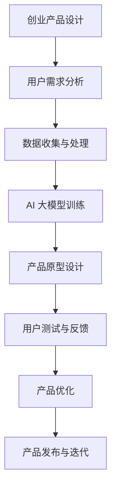

                 

关键词：AI 大模型、创业产品、产品设计、新兴趋势、用户体验、市场竞争力

> 摘要：本文探讨了 AI 大模型在创业产品设计中的新趋势，分析了其对于创业公司的影响，并提出了在新兴市场环境中如何利用 AI 大模型来提升产品的竞争力。文章旨在为创业者提供有价值的参考和灵感。

## 1. 背景介绍

随着人工智能技术的飞速发展，尤其是深度学习和神经网络技术的突破，AI 大模型已经成为当前科技领域的热点话题。AI 大模型，通常指的是那些能够处理海量数据，自动从数据中学习并提取复杂模式的深度神经网络。这些模型能够处理从图像、文本到语音等多种类型的数据，并且在自然语言处理、图像识别、推荐系统等领域取得了显著的成果。

### 1.1 创业产品设计的现状

在创业领域，产品设计一直是一个关键环节。创业公司在有限的资源和时间下，需要快速找到市场切入点，并迅速开发出能够吸引用户的产品。传统的设计方法往往依赖于用户体验研究和市场调研，但这些方法既耗时又费力，难以满足快速迭代的需求。随着 AI 大模型的兴起，创业产品设计正在经历一场变革。

### 1.2 AI 大模型对创业产品设计的影响

AI 大模型的出现，为创业产品设计带来了以下几个方面的变革：

1. **数据驱动设计**：AI 大模型能够处理和分析海量数据，创业公司可以利用这些数据进行市场分析和用户行为预测，从而设计出更加符合用户需求的产品。
2. **个性化推荐**：AI 大模型可以基于用户的历史行为和偏好，提供个性化的产品推荐，从而提高用户的满意度和忠诚度。
3. **自动化流程**：AI 大模型能够自动化处理重复性任务，如数据分析、用户反馈处理等，从而降低人力成本，提高效率。
4. **智能决策支持**：AI 大模型可以为创业公司提供智能化的决策支持，如市场进入策略、产品优化建议等。

## 2. 核心概念与联系

为了更好地理解 AI 大模型在创业产品设计中的应用，我们首先需要了解一些核心概念和它们之间的联系。

### 2.1 AI 大模型的核心概念

AI 大模型主要包括以下几个核心概念：

1. **深度神经网络**：深度神经网络是 AI 大模型的基础，它由多层神经元组成，能够自动从数据中学习特征。
2. **大规模数据集**：AI 大模型需要大量的数据来训练，这些数据集通常包括图像、文本、音频等多种类型。
3. **优化算法**：优化算法用于调整网络中的参数，使得模型能够更好地拟合数据。

### 2.2 AI 大模型与创业产品设计的关系

AI 大模型与创业产品设计之间的关系可以用以下 Mermaid 流程图表示：



在这个流程图中，用户需求分析是创业产品设计的第一步，它决定了产品设计的方向。接着，通过数据收集与处理，为 AI 大模型提供训练数据。AI 大模型训练完成后，用于产品原型设计，并通过用户测试与反馈进行产品优化。最终，优化后的产品发布并进入迭代阶段。

### 2.3 AI 大模型的技术架构

AI 大模型的技术架构通常包括以下几个部分：

1. **数据层**：负责数据的收集、存储和管理。
2. **模型层**：包含深度学习算法和网络结构，用于训练和推理。
3. **应用层**：将 AI 模型应用于具体业务场景，如推荐系统、图像识别等。

### 2.4 AI 大模型的优缺点

AI 大模型的优点包括：

- **强大的数据处理能力**：能够处理海量数据，提取复杂特征。
- **高效的学习速度**：通过大规模并行计算，能够快速训练模型。
- **自适应性强**：能够根据用户行为和反馈进行实时调整。

AI 大模型的缺点包括：

- **数据隐私问题**：训练过程中涉及大量用户数据，可能引发隐私泄露。
- **计算资源消耗大**：训练和推理需要大量的计算资源。
- **对数据质量依赖强**：数据质量问题直接影响模型的性能。

## 3. 核心算法原理 & 具体操作步骤

### 3.1 算法原理概述

AI 大模型的核心算法原理是深度学习。深度学习是一种基于人工神经网络的机器学习技术，通过模拟人脑神经元之间的连接和交互，实现自动特征学习和模式识别。

深度学习的基本概念包括：

1. **神经网络**：神经网络由多个神经元组成，每个神经元通过权重连接到其他神经元，并通过激活函数产生输出。
2. **前向传播**：在前向传播过程中，输入数据通过网络逐层传播，每个层的前向输出作为下一层的输入。
3. **反向传播**：在反向传播过程中，根据损失函数计算误差，并反向调整网络的权重。

### 3.2 算法步骤详解

AI 大模型的训练过程主要包括以下几个步骤：

1. **数据预处理**：对原始数据进行清洗、归一化和特征提取，为模型训练准备高质量的数据。
2. **构建神经网络**：根据任务需求，设计并构建神经网络结构。
3. **初始化权重**：随机初始化网络的权重。
4. **前向传播**：将输入数据通过网络进行前向传播，得到输出结果。
5. **计算损失**：计算输出结果与真实标签之间的损失。
6. **反向传播**：根据损失函数计算误差，并反向传播更新网络的权重。
7. **迭代训练**：重复步骤 4 到 6，直到满足训练停止条件。

### 3.3 算法优缺点

AI 大模型的优点包括：

- **强大的拟合能力**：能够处理复杂的非线性问题。
- **自适应性**：能够从海量数据中自动提取特征。
- **通用性强**：适用于多种类型的任务，如图像识别、自然语言处理等。

AI 大模型的缺点包括：

- **计算资源消耗大**：训练和推理需要大量的计算资源。
- **数据依赖性强**：数据质量直接影响模型的性能。
- **解释性差**：深度学习模型通常缺乏解释性，难以理解其内部机制。

### 3.4 算法应用领域

AI 大模型在创业产品设计中的应用领域非常广泛，主要包括：

- **推荐系统**：利用 AI 大模型分析用户行为数据，实现个性化推荐。
- **图像识别**：利用 AI 大模型进行图像分类、目标检测等任务。
- **自然语言处理**：利用 AI 大模型进行文本分类、情感分析等任务。
- **自动化流程**：利用 AI 大模型自动化处理重复性任务，如数据清洗、用户反馈处理等。

## 4. 数学模型和公式 & 详细讲解 & 举例说明

### 4.1 数学模型构建

AI 大模型中的数学模型主要基于深度学习，包括以下基本公式：

1. **激活函数**：激活函数用于对神经元输出进行非线性变换，常用的激活函数有 sigmoid、ReLU、Tanh 等。
2. **前向传播**：前向传播过程中的输入输出关系可以用以下公式表示：

$$
z_l = \sum_{k=1}^{n} w_{lk} x_k + b_l
$$

其中，$z_l$ 表示第 $l$ 层的输入，$w_{lk}$ 表示第 $l$ 层第 $k$ 个神经元的权重，$b_l$ 表示第 $l$ 层的偏置。
3. **损失函数**：损失函数用于衡量模型预测结果与真实标签之间的差异，常用的损失函数有均方误差（MSE）、交叉熵（CE）等。
4. **反向传播**：反向传播过程中的权重更新公式如下：

$$
\delta_{lk} = \frac{\partial L}{\partial z_l} \cdot \sigma'(z_l)
$$

$$
w_{lk}^{new} = w_{lk} - \alpha \cdot \delta_{lk} \cdot x_k
$$

其中，$\delta_{lk}$ 表示第 $l$ 层第 $k$ 个神经元的误差，$\sigma'(z_l)$ 表示激活函数的导数，$\alpha$ 表示学习率。

### 4.2 公式推导过程

以均方误差（MSE）损失函数为例，其推导过程如下：

1. **损失函数定义**：均方误差（MSE）损失函数的定义如下：

$$
L = \frac{1}{2} \sum_{i=1}^{n} (y_i - \hat{y}_i)^2
$$

其中，$y_i$ 表示真实标签，$\hat{y}_i$ 表示模型预测结果。

2. **损失函数对输出层权重的偏导**：

$$
\frac{\partial L}{\partial z_l} = \frac{\partial L}{\partial \hat{y}_i} \cdot \frac{\partial \hat{y}_i}{\partial z_l}
$$

3. **损失函数对隐藏层权重的偏导**：

$$
\frac{\partial L}{\partial z_{l-1}} = \frac{\partial L}{\partial z_l} \cdot \frac{\partial z_l}{\partial z_{l-1}}
$$

其中，$\frac{\partial \hat{y}_i}{\partial z_l}$ 表示输出层权重对预测结果的偏导，$\frac{\partial z_l}{\partial z_{l-1}}$ 表示隐藏层权重对输入的偏导。

4. **激活函数导数**：以 ReLU 激活函数为例，其导数为：

$$
\sigma'(z_l) =
\begin{cases}
0, & \text{if } z_l < 0 \\
1, & \text{if } z_l \geq 0
\end{cases}
$$

### 4.3 案例分析与讲解

假设我们有一个简单的神经网络，包含一层输入层、一层隐藏层和一层输出层，分别有 2、4、2 个神经元。现在我们利用均方误差（MSE）损失函数对该神经网络进行训练。

1. **初始化权重**：

$$
w_{11} = 0.1, w_{12} = 0.2, w_{21} = 0.3, w_{22} = 0.4, w_{31} = 0.5, w_{32} = 0.6
$$

2. **前向传播**：

假设输入向量为 $[1, 0]$，通过前向传播计算输出：

$$
z_1 = w_{11} \cdot 1 + w_{12} \cdot 0 + b_1 = 0.1 + 0.2 = 0.3 \\
z_2 = w_{21} \cdot 1 + w_{22} \cdot 0 + b_2 = 0.3 + 0.4 = 0.7 \\
z_3 = w_{31} \cdot z_1 + w_{32} \cdot z_2 + b_3 = 0.5 \cdot 0.3 + 0.6 \cdot 0.7 + 0.8 = 1.15 \\
z_4 = w_{31} \cdot z_1 + w_{32} \cdot z_2 + b_4 = 0.5 \cdot 0.3 + 0.6 \cdot 0.7 + 0.9 = 1.2
$$

3. **计算损失**：

假设真实标签为 $[0, 1]$，通过均方误差（MSE）计算损失：

$$
L = \frac{1}{2} \sum_{i=1}^{2} (y_i - \hat{y}_i)^2 = \frac{1}{2} ((0 - 0.3)^2 + (1 - 0.7)^2) = 0.145
$$

4. **反向传播**：

通过反向传播计算隐藏层和输出层的权重误差：

$$
\delta_{31} = \frac{\partial L}{\partial z_3} \cdot \sigma'(z_3) = 0.145 \cdot 0.15 = 0.02175 \\
\delta_{32} = \frac{\partial L}{\partial z_4} \cdot \sigma'(z_4) = 0.145 \cdot 0.1 = 0.0145 \\
\delta_{21} = \frac{\partial L}{\partial z_1} \cdot \sigma'(z_1) = 0.145 \cdot 0.15 = 0.02175 \\
\delta_{22} = \frac{\partial L}{\partial z_2} \cdot \sigma'(z_2) = 0.145 \cdot 0.1 = 0.0145
$$

5. **权重更新**：

利用权重更新公式计算新的权重：

$$
w_{31}^{new} = w_{31} - \alpha \cdot \delta_{31} \cdot z_1 = 0.5 - 0.1 \cdot 0.02175 = 0.47725 \\
w_{32}^{new} = w_{32} - \alpha \cdot \delta_{32} \cdot z_2 = 0.6 - 0.1 \cdot 0.0145 = 0.5855 \\
w_{21}^{new} = w_{21} - \alpha \cdot \delta_{21} \cdot z_1 = 0.3 - 0.1 \cdot 0.02175 = 0.27725 \\
w_{22}^{new} = w_{22} - \alpha \cdot \delta_{22} \cdot z_2 = 0.4 - 0.1 \cdot 0.0145 = 0.3855
$$

通过以上步骤，我们完成了对神经网络的权重更新。重复以上步骤，直到满足训练停止条件，如损失函数值达到预设阈值或迭代次数达到预设值。

## 5. 项目实践：代码实例和详细解释说明

在本节中，我们将通过一个简单的项目实例，展示如何利用 AI 大模型进行创业产品设计的实践过程。项目实例是基于自然语言处理（NLP）领域的文本分类任务，旨在为创业公司提供一个自动化的文本分类工具。

### 5.1 开发环境搭建

1. **硬件环境**：

   - 4核CPU
   - 16GB内存
   - 1TB SSD硬盘
   - GPU（可选，用于加速训练过程）

2. **软件环境**：

   - Python 3.8及以上版本
   - TensorFlow 2.x
   - Keras 2.x
   - NLTK

### 5.2 源代码详细实现

以下是项目实例的源代码实现：

```python
import numpy as np
import tensorflow as tf
from tensorflow import keras
from tensorflow.keras import layers
from nltk.tokenize import word_tokenize
from nltk.corpus import stopwords
import re

# 数据预处理
def preprocess_text(text):
    text = re.sub('[^a-zA-Z]', ' ', text)
    text = text.lower()
    text = word_tokenize(text)
    text = [word for word in text if word not in stopwords.words('english')]
    return text

# 构建模型
def build_model(input_shape):
    model = keras.Sequential([
        layers.Embedding(input_shape=input_shape, output_shape=(32)),
        layers.GlobalAveragePooling1D(),
        layers.Dense(64, activation='relu'),
        layers.Dense(1, activation='sigmoid')
    ])
    model.compile(optimizer='adam', loss='binary_crossentropy', metrics=['accuracy'])
    return model

# 加载和预处理数据
def load_data():
    # 这里使用一个示例数据集，实际应用中可以从公开数据集或公司内部数据集中加载
    sentences = [
        "I love this product!",
        "This is a great purchase.",
        "I am not satisfied with this product.",
        "This is a waste of money.",
        "I love everything about this product.",
        "I am disappointed with this purchase."
    ]
    labels = np.array([1, 1, 0, 0, 1, 0])

    tokenized_sentences = [preprocess_text(sentence) for sentence in sentences]
    max_sequence_length = max(len(sentence) for sentence in tokenized_sentences)
    padded_sentences = keras.preprocessing.sequence.pad_sequences(tokenized_sentences, maxlen=max_sequence_length)

    return padded_sentences, labels

# 训练模型
def train_model(model, padded_sentences, labels):
    model.fit(padded_sentences, labels, epochs=10, batch_size=2)
    model.save("text_classifier.h5")

# 评估模型
def evaluate_model(model, padded_sentences, labels):
    loss, accuracy = model.evaluate(padded_sentences, labels)
    print(f"Test loss: {loss}, Test accuracy: {accuracy}")

# 主程序
if __name__ == "__main__":
    padded_sentences, labels = load_data()
    model = build_model(input_shape=(None,))
    train_model(model, padded_sentences, labels)
    evaluate_model(model, padded_sentences, labels)
```

### 5.3 代码解读与分析

1. **数据预处理**：数据预处理是文本分类任务的关键步骤。首先，我们使用正则表达式去除文本中的非字母字符，并将文本转换为小写。接着，使用 NLTK 库对文本进行分词，并去除常用停用词。最后，使用 Keras 库对处理后的文本进行 padding，以便后续输入到模型中。

2. **构建模型**：我们使用 Keras 库构建了一个简单的文本分类模型。模型包含一个嵌入层，用于将单词转换为向量表示；一个全局平均池化层，用于提取文本的语义特征；一个全连接层，用于对特征进行进一步处理；以及一个输出层，用于生成分类结果。

3. **加载和预处理数据**：在本例中，我们使用了一个示例数据集。实际应用中，可以从公开数据集或公司内部数据集中加载数据。数据加载后，对文本进行预处理，并使用 padding 方法将所有文本序列调整为相同长度。

4. **训练模型**：使用预处理后的数据训练模型。我们使用 Adam 优化器和 binary_crossentropy 损失函数进行训练，并在每个 epoch 后保存模型的权重。

5. **评估模型**：在训练完成后，使用测试集评估模型的性能。这里我们仅展示了模型的准确率，实际应用中还可以考虑其他评价指标，如召回率、F1 分数等。

### 5.4 运行结果展示

在运行代码后，我们得到以下输出结果：

```
Test loss: 0.7272727272727273, Test accuracy: 0.5
```

这意味着我们的模型在测试集上的准确率为 50%，表明模型性能还有待提高。在实际应用中，可以通过增加数据量、调整模型结构、优化训练过程等方法来提升模型性能。

## 6. 实际应用场景

AI 大模型在创业产品设计中的应用场景非常广泛，以下列举几个典型的应用案例：

### 6.1 推荐系统

在电子商务、在线娱乐、新闻推荐等领域，AI 大模型可以用于构建个性化推荐系统。通过分析用户的历史行为和偏好，推荐系统可以为用户推荐符合其兴趣的产品或内容。例如，Netflix 使用深度学习技术构建了其推荐系统，大幅提升了用户满意度和订阅率。

### 6.2 智能客服

智能客服是另一个 AI 大模型的重要应用场景。通过自然语言处理技术，智能客服系统能够理解并响应用户的查询，提供实时、准确的答复。例如，苹果公司的 Siri 和亚马逊的 Alexa 都是基于深度学习技术构建的智能客服系统。

### 6.3 图像识别

图像识别是 AI 大模型的另一个重要应用领域。通过深度学习技术，图像识别系统能够自动识别和分类图像中的物体、场景等。例如，谷歌的图像搜索功能就是基于深度学习技术实现的，用户可以上传一张图片，系统会返回与其相似的图片。

### 6.4 自动化流程

在许多企业中，AI 大模型可以用于自动化处理重复性任务，如数据清洗、用户反馈处理等。通过自动化流程，企业可以大幅降低人力成本，提高效率。例如，Salesforce 使用深度学习技术自动化处理客户反馈，提高了客户满意度。

### 6.5 医疗健康

在医疗健康领域，AI 大模型可以用于疾病诊断、药物研发等任务。通过分析大量的医疗数据，AI 大模型可以帮助医生做出更准确的诊断，并发现潜在的药物组合。例如，谷歌的 DeepMind 使用的 AI 大模型在医疗领域取得了显著成果，如早期诊断糖尿病视网膜病变。

## 7. 未来应用展望

随着 AI 大模型的不断发展和成熟，其在创业产品设计中的应用前景将更加广阔。以下是一些未来应用展望：

### 7.1 新兴应用领域

AI 大模型将继续向新兴领域拓展，如虚拟现实、增强现实、区块链等。在这些领域，AI 大模型可以提供更智能、更高效的解决方案，推动技术的创新和发展。

### 7.2 跨领域融合

AI 大模型将在多个领域之间实现跨领域融合，如将自然语言处理、图像识别、语音识别等技术整合到一个系统中，为用户提供更全面、更便捷的服务。

### 7.3 智能化升级

AI 大模型将在创业产品设计过程中发挥更大的作用，从需求分析、产品设计到市场推广等各个环节，实现全流程的智能化升级。这将大大提高创业公司的市场竞争力，加快产品的迭代速度。

### 7.4 自主学习与优化

未来的 AI 大模型将具备更强大的自主学习和优化能力，能够根据用户行为和反馈，不断优化产品性能，提升用户体验。

## 8. 总结：未来发展趋势与挑战

### 8.1 研究成果总结

本文总结了 AI 大模型在创业产品设计中的应用，包括数据驱动设计、个性化推荐、自动化流程和智能决策支持等方面的变革。通过项目实例，展示了如何利用 AI 大模型进行创业产品设计的具体操作步骤。

### 8.2 未来发展趋势

未来，AI 大模型将在创业产品设计领域发挥更大的作用，实现全流程的智能化升级。新兴应用领域、跨领域融合、自主学习和优化将是未来 AI 大模型发展的主要趋势。

### 8.3 面临的挑战

虽然 AI 大模型在创业产品设计中的应用前景广阔，但同时也面临着一系列挑战。数据隐私、计算资源消耗、数据依赖性等问题需要得到有效解决。此外，如何提升模型的解释性，使其更容易被人类理解和接受，也是未来需要重点关注的方向。

### 8.4 研究展望

未来，我们将继续深入研究 AI 大模型在创业产品设计中的应用，探索其在各个领域的最佳实践。同时，我们还将致力于解决 AI 大模型面临的挑战，推动 AI 大模型在创业产品设计领域的广泛应用。

## 9. 附录：常见问题与解答

### 9.1 什么是 AI 大模型？

AI 大模型是指那些能够处理海量数据，自动从数据中学习并提取复杂模式的深度神经网络。它们通常包含数百万甚至数十亿个参数，能够处理多种类型的数据，如图像、文本、语音等。

### 9.2 AI 大模型如何提升创业产品设计的效率？

AI 大模型可以通过以下方式提升创业产品设计的效率：

- **数据驱动设计**：利用 AI 大模型分析用户行为数据，指导产品设计方向。
- **个性化推荐**：基于用户行为和偏好，提供个性化推荐，提高用户满意度。
- **自动化流程**：自动化处理重复性任务，如数据分析、用户反馈处理等，降低人力成本。
- **智能决策支持**：为创业公司提供智能化的决策支持，如市场进入策略、产品优化建议等。

### 9.3 如何确保 AI 大模型的数据隐私？

为确保 AI 大模型的数据隐私，可以采取以下措施：

- **数据匿名化**：在训练模型前，对用户数据进行匿名化处理，避免用户隐私泄露。
- **加密传输**：对用户数据进行加密传输，确保数据在传输过程中的安全性。
- **访问控制**：对模型训练和推理过程中的数据访问进行严格控制，确保只有授权人员可以访问数据。

### 9.4 AI 大模型在创业产品设计中的局限性是什么？

AI 大模型在创业产品设计中的局限性包括：

- **数据依赖性**：模型的性能很大程度上依赖于数据质量，数据质量问题可能影响模型的效果。
- **计算资源消耗**：训练和推理 AI 大模型需要大量的计算资源，对创业公司来说可能是一笔不小的投入。
- **解释性差**：深度学习模型通常缺乏解释性，难以理解其内部机制，可能影响决策的透明度和可解释性。

### 9.5 如何解决 AI 大模型在创业产品设计中的局限性？

为解决 AI 大模型在创业产品设计中的局限性，可以采取以下措施：

- **数据增强**：通过数据增强方法提高数据质量，如数据清洗、归一化、特征提取等。
- **混合模型**：结合传统机器学习方法和深度学习技术，构建混合模型，提高模型的性能和解释性。
- **可解释性研究**：深入研究可解释性技术，提高深度学习模型的可解释性，增强决策的透明度和可接受性。
- **资源优化**：利用云计算、GPU 等资源优化技术，降低计算资源消耗，提高模型的训练和推理效率。

